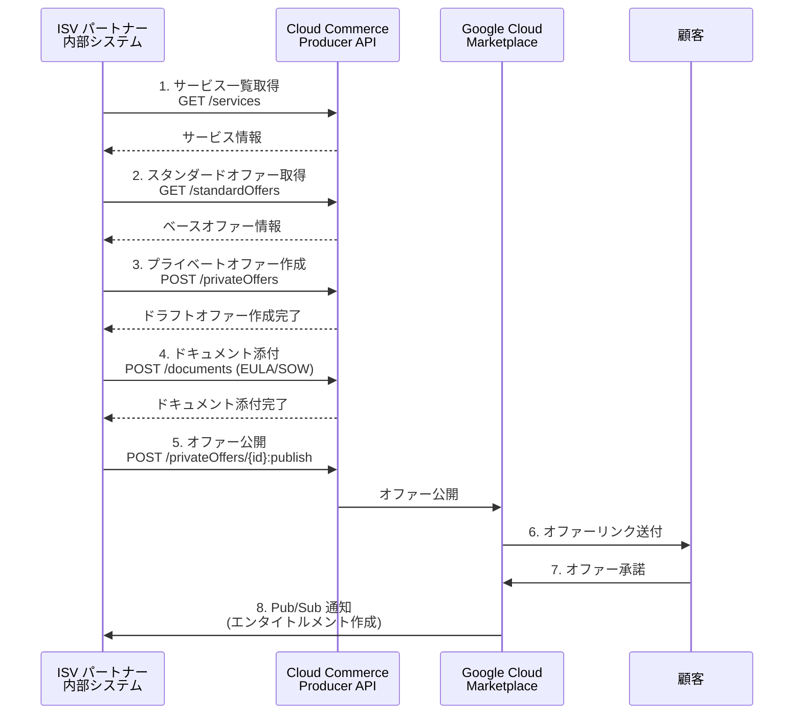

# Google Cloud Marketplace: Cloud Commerce Producer API for Private Offers

**リリース日**: 2026-07-24

**サービス**: Google Cloud Marketplace

**機能**: Cloud Commerce Producer API による Private Offers のプログラマティック管理

**ステータス**: GA (General Availability)

[このアップデートのインフォグラフィックを見る](https://takech9203.github.io/google-cloud-news-summary/20260724-google-cloud-marketplace-private-offers-api.html)

## 概要

Google Cloud Marketplace において、Cloud Commerce Producer API を使用して Private Offers (プライベートオファー) をプログラマティックに作成、管理、公開できるようになりました。これまで Producer Portal (Google Cloud コンソール上の UI) で手動操作が必要だったプライベートオファーのワークフローを、API 経由で完全に自動化できます。

この API により、ISV パートナーやマーケットプレイスインテグレーターは、自社の内部システムやサードパーティプラットフォームから直接プライベートオファーを操作できます。カスタム料金モデルの設定、EULA や SOW ドキュメントの添付、修正対象となるアクティブオファーの特定など、プライベートオファーのライフサイクル全体を API で制御可能です。

対象ユーザーは、大量のプライベートオファーを管理する戦略的 ISV パートナー、マーケットプレイスインテグレーター、および Google Cloud Marketplace を通じて SaaS・VM・Kubernetes 製品を販売するベンダーです。

**アップデート前の課題**

- プライベートオファーの作成・管理は Producer Portal (Google Cloud コンソール) での手動操作が必須だった
- 大量のオファーを処理する場合、手動によるポータル操作がボトルネックとなりスケールしにくかった
- 手動操作に起因する設定ミス (料金設定の誤り、ドキュメント添付漏れなど) のリスクがあった
- 社内のディールデスクシステムや CRM との連携が困難で、ワークフローが分断されていた
- 既存のアクティブオファーに対する修正 (アメンド) の際、対象オファーの特定も手動で行う必要があった

**アップデート後の改善**

- REST API 経由でプライベートオファーの作成・更新・公開・キャンセルを完全自動化可能
- 社内システムや CRM、サードパーティプラットフォームとの直接統合が実現
- バッチ処理による大量オファーの一括作成やカスタム料金設定の自動化でスケーラビリティが向上
- API による修正対象オファーの自動特定とアメンドワークフローの効率化
- プログラマティック制御によるヒューマンエラーの大幅削減

## アーキテクチャ図



ISV パートナーが Cloud Commerce Producer API を通じてプライベートオファーを作成し、顧客に公開するまでの一連のフローを示しています。サービス検索からオファー公開、顧客承諾まで全てプログラマティックに管理できます。

## サービスアップデートの詳細

### 主要機能

1. **プライベートオファーのプログラマティック作成**
   - REST API を使用してドラフトオファーを作成
   - カスタム料金モデル (CUD、フラットフィー、使用量ベース) の設定
   - 分割払い (インストールメント) 構成のサポート
   - 即時開始およびスケジュール開始の指定が可能

2. **ドキュメント管理の自動化**
   - EULA (Standard End User License Agreement) の添付
   - SOW (Statement of Work) などカスタムドキュメントの添付
   - オファー公開前のドキュメント検証

3. **オファーライフサイクル管理**
   - オファーの一覧取得 (フィルタリング・ソート対応)
   - 個別オファーの詳細表示 (FULL ビュー対応)
   - オファーの更新・キャンセル
   - 修正対象アクティブオファーの自動特定

4. **オファー公開とアメンド**
   - ドラフトオファーの公開 (`:publish` エンドポイント)
   - 既存契約の修正 (アメンド) ワークフロー
   - `offerDealType` による新規/アメンドの明確な区別

## 技術仕様

### API エンドポイント

| 操作 | メソッド | エンドポイント |
|------|----------|----------------|
| サービス一覧 | GET | `/v1beta/projects/{PROJECT}/locations/global/services` |
| スタンダードオファー一覧 | GET | `/v1beta/projects/{PROJECT}/locations/global/services/{SERVICE}/standardOffers` |
| プライベートオファー作成 | POST | `/v1beta/projects/{PROJECT}/locations/global/privateOffers` |
| プライベートオファー取得 | GET | `/v1beta/projects/{PROJECT}/locations/global/privateOffers/{ID}` |
| ドキュメント添付 | POST | `/v1beta/projects/{PROJECT}/locations/global/privateOffers/{ID}/documents` |
| オファー公開 | POST | `/v1beta/projects/{PROJECT}/locations/global/privateOffers/{ID}:publish` |

### IAM ロール

| ロール | 説明 |
|--------|------|
| `roles/commerceproducer.admin` | 全リソースへのフルアクセス (作成・更新・公開・キャンセル) |
| `roles/commerceproducer.viewer` | 全リソースへの読み取りアクセス |
| `roles/commercepricemanagement.privateOffersAdmin` | プライベートオファーの管理権限 |

### サポートする料金モデル

| 料金モデル | 対象製品 | 説明 |
|------------|----------|------|
| Committed Use Discount (CUD) | SaaS, VM, Kubernetes | コミットメントベースの割引 |
| フラットフィー | SaaS, Professional Services | 定額料金 |
| 使用量ベース | SaaS, VM, Kubernetes | 使用量に応じた従量課金 |
| フラットフィー + 使用量 | SaaS, Professional Services | 定額 + 超過分従量課金 |

## 設定方法

### 前提条件

1. Google Cloud Marketplace に製品が登録済みであること
2. Commerce Producer API (`commerceproducer.googleapis.com`) の有効化
3. 適切な IAM ロールの付与 (`roles/commerceproducer.admin` または `roles/commercepricemanagement.privateOffersAdmin`)
4. 顧客の Cloud Billing アカウント ID の取得

### 手順

#### ステップ 1: API の有効化

```bash
gcloud services enable commerceproducer.googleapis.com
```

プロジェクトで Cloud Commerce Producer API を有効にします。

#### ステップ 2: サービスとスタンダードオファーの確認

```bash
# サービス一覧を取得
curl -H "Authorization: Bearer $(gcloud auth application-default print-access-token)" \
  "https://commerceproducer.googleapis.com/v1beta/projects/YOUR_PROJECT_ID/locations/global/services"

# アクティブなスタンダードオファーを取得 (ベースオファーとして使用)
curl -G -H "Authorization: Bearer $(gcloud auth application-default print-access-token)" \
  "https://commerceproducer.googleapis.com/v1beta/projects/YOUR_PROJECT_ID/locations/global/services/SERVICE_NAME/standardOffers" \
  --data-urlencode 'filter=expire_time > "2026-07-24T00:00:00Z"'
```

プライベートオファーを作成する前に、ベースとなるスタンダードオファーを特定します。

#### ステップ 3: プライベートオファーの作成

```bash
curl -X POST \
  -H "Authorization: Bearer $(gcloud auth application-default print-access-token)" \
  -H "Content-Type: application/json" \
  -d '{
    "title": "Custom Enterprise Offer",
    "acceptDeadlineTime": {
      "year": 2026, "month": 8, "day": 24,
      "timeZone": {"id": "America/Los_Angeles"}
    },
    "singleProductOffer": {
      "baseStandardOffer": "projects/PROJECT_ID/locations/global/services/SERVICE/standardOffers/OFFER_ID",
      "customIntervalPrice": {
        "installments": [{
          "priceModel": {
            "commitment": {
              "commitmentAmount": {"currencyCode": "USD", "units": 500},
              "discountPercent": {"value": "30"}
            }
          }
        }]
      }
    },
    "customer": {
      "entityTitle": "Customer Name",
      "contact": "customer@example.com",
      "targetBillingAccount": "billingAccounts/BILLING_ACCOUNT_ID"
    },
    "term": {
      "startPolicy": "IMMEDIATE",
      "endPolicy": "AFTER_DURATION",
      "durationMonths": 12,
      "maxRenewalCount": 1
    },
    "offerDealType": "NEW"
  }' \
  "https://commerceproducer.googleapis.com/v1beta/projects/PROJECT_ID/locations/global/privateOffers"
```

カスタム料金とオファー条件を指定してドラフトオファーを作成します。

#### ステップ 4: ドキュメント添付と公開

```bash
# EULA を添付
curl -X POST \
  -H "Authorization: Bearer $(gcloud auth application-default print-access-token)" \
  -H "Content-Type: application/json" \
  -d '{"documentType": "STANDARD_END_USER_LICENSE_AGREEMENT_V2"}' \
  "https://commerceproducer.googleapis.com/v1beta/projects/PROJECT_ID/locations/global/privateOffers/OFFER_ID/documents"

# オファーを公開
curl -X POST \
  -H "Authorization: Bearer $(gcloud auth application-default print-access-token)" \
  -H "Content-Type: application/json" \
  -d '{}' \
  "https://commerceproducer.googleapis.com/v1beta/projects/PROJECT_ID/locations/global/privateOffers/OFFER_ID:publish"
```

ドキュメントを添付した後、オファーを公開して顧客が承諾できる状態にします。

## メリット

### ビジネス面

- **スケーラビリティの向上**: 手動の UI 操作からプログラマティック制御に移行することで、大量のオファーを効率的に処理可能
- **市場投入スピードの改善**: API による自動化により、オファーの作成から公開までのリードタイムを大幅短縮
- **ディールデスクの効率化**: CRM やセールスツールとの直接統合により、営業プロセス全体をシームレスに連携
- **エラー削減**: プログラマティックなバリデーションにより、料金設定やドキュメント添付のミスを防止

### 技術面

- **CI/CD 統合**: オファー管理をコードとして管理し、レビュープロセスやバージョン管理と統合可能
- **クライアントライブラリ対応**: 公式 SDK を利用した開発で、型安全な API 呼び出しが可能
- **フィルタリングとソート**: `update_time` や `expire_time` によるクエリで効率的なオファー管理
- **べき等性**: 一貫した API インターフェースにより、リトライロジックの実装が容易

## デメリット・制約事項

### 制限事項

- API バージョンは `v1beta` であり、今後破壊的変更が入る可能性がある
- オファー満了まで 24 時間以内の場合、修正や置換は不可
- アメンド時のインストールメント値は前回の 50% 以上である必要がある
- アメンド後の契約総額は現行契約の 50% 以上である必要がある

### 考慮すべき点

- Producer Portal での手動操作と API 操作の並行使用時は、オファーの競合に注意が必要
- API 利用開始前にクライアントライブラリのセットアップと認証設定が必要
- 料金モデルの変更制限 (フラットフィーから使用量ベースへの変更不可など) は API でも同様に適用
- 請求頻度 (月次/年次) はアメンド時に変更不可

## ユースケース

### ユースケース 1: 大量カスタムオファーの一括生成

**シナリオ**: エンタープライズ ISV パートナーが、年度末のキャンペーンで 100 社以上の既存顧客に対して個別の割引オファーを作成する必要がある。

**実装例**:
```python
import google.auth
from google.auth.transport.requests import AuthorizedSession

credentials, project = google.auth.default()
session = AuthorizedSession(credentials)

BASE_URL = "https://commerceproducer.googleapis.com/v1beta"

# 顧客リストからバッチでオファーを作成
for customer in customer_list:
    offer_payload = {
        "title": f"Year-End Discount for {customer['name']}",
        "singleProductOffer": {
            "baseStandardOffer": base_offer_id,
            "standardIntervalPrice": {
                "standardInterval": "MONTHLY_NOT_PRORATED",
                "priceModel": {
                    "usage": {
                        "defaultDiscountPercent": {"value": str(customer['discount'])}
                    }
                }
            }
        },
        "customer": {
            "entityTitle": customer['name'],
            "targetBillingAccount": customer['billing_account']
        },
        "term": {"startPolicy": "IMMEDIATE", "endPolicy": "AFTER_DURATION", "durationMonths": 12}
    }
    response = session.post(f"{BASE_URL}/projects/{project}/locations/global/privateOffers", json=offer_payload)
```

**効果**: 従来 1 件あたり 15-20 分の手動操作が必要だったオファー作成を、スクリプトで数分以内に全件処理可能。

### ユースケース 2: CRM 連携によるセールスプロセスの自動化

**シナリオ**: Salesforce や HubSpot での商談クローズをトリガーに、自動的に Google Cloud Marketplace のプライベートオファーを生成し、顧客にリンクを送付する。

**効果**: 営業担当者が CRM 上で操作を完結でき、Google Cloud コンソールへの切り替えが不要になる。商談成立からオファー送付までのタイムラグを解消し、迅速な契約締結を実現。

### ユースケース 3: 契約更新のアメンド自動化

**シナリオ**: 既存契約の更新時に、使用量の増加に応じた新しい料金体系を自動的に算出し、アメンドオファーとして公開する。

**効果**: API の `filter` パラメータでアクティブオファーを特定し、`offerDealType: "AMENDMENT"` で修正オファーを自動生成。契約更新プロセスのリードタイムを削減。

## 料金

Cloud Commerce Producer API 自体の使用に追加料金は発生しません。Google Cloud Marketplace を通じた取引に対しては、通常の Marketplace 手数料 (売上の一定割合) が適用されます。

料金の詳細については [Google Cloud Marketplace パートナー向け料金](https://cloud.google.com/marketplace/docs/partners/get-started) を参照してください。

## 利用可能リージョン

Cloud Commerce Producer API はグローバルサービスとして提供されます。API エンドポイントのロケーションは `global` で、全てのリージョンから利用可能です。

## 関連サービス・機能

- **Google Cloud Marketplace Producer Portal**: API の代替としてブラウザベースの UI でプライベートオファーを管理する既存ツール
- **Partner Procurement API**: 顧客のエンタイトルメント管理や Pub/Sub 通知の処理に使用
- **Cloud Billing**: 顧客の請求アカウントとオファーの紐付け管理
- **Cloud Pub/Sub**: エンタイトルメント作成や変更の通知をリアルタイムで受信
- **IAM (Identity and Access Management)**: API アクセスの権限制御 (Commerce Producer Admin/Viewer ロール)

## 参考リンク

- [インフォグラフィック](https://takech9203.github.io/google-cloud-news-summary/20260724-google-cloud-marketplace-private-offers-api.html)
- [公式リリースノート](https://docs.cloud.google.com/release-notes#July_24_2026)
- [Cloud Commerce Producer API ドキュメント](https://docs.cloud.google.com/marketplace/docs/partners/offers/commerce-producer-api)
- [プライベートオファーの作成と管理](https://docs.cloud.google.com/marketplace/docs/partners/offers/create-private-offers)
- [オファーの修正 (アメンド)](https://docs.cloud.google.com/marketplace/docs/partners/offers/modify-offer)
- [プライベートオファーの料金モデル](https://docs.cloud.google.com/marketplace/docs/partners/offers/select-pricing-model)
- [IAM ロールと権限 (Commerce Producer)](https://docs.cloud.google.com/iam/docs/roles-permissions/commerceproducer)

## まとめ

Cloud Commerce Producer API の GA により、Google Cloud Marketplace のプライベートオファー管理が完全にプログラマティックに制御可能になりました。大量の取引を処理する ISV パートナーにとって、手動操作から API ベースの自動化への移行は運用効率の劇的な改善をもたらします。既存の CRM やディールデスクシステムとの統合を早期に計画し、オファーワークフローの自動化を推進することを推奨します。

---

**タグ**: #GoogleCloudMarketplace #CloudCommerceProducerAPI #PrivateOffers #ISV #API #マーケットプレイス #自動化
