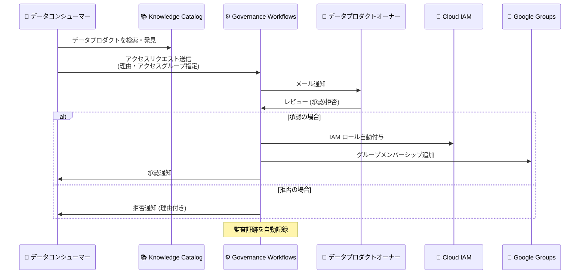

# Knowledge Catalog (Dataplex): Governance Workflows (Preview)

**リリース日**: 2026-07-24

**サービス**: Knowledge Catalog (Dataplex)

**機能**: Governance Workflows

**ステータス**: Preview

📊 [このアップデートのインフォグラフィックを見る](https://takech9203.github.io/google-cloud-news-summary/20260724-knowledge-catalog-governance-workflows.html)

## 概要

Knowledge Catalog (旧 Dataplex) に、データプロダクトへのアクセス管理を自動化するための「Governance Workflows」機能が Preview として追加されました。この機能は、データプロダクトへのアクセスに対してリクエスト-レビュー (承認/拒否) のメカニズムを提供し、組織のデータガバナンスを強化します。

Governance Workflows を使用することで、データコンシューマーは Knowledge Catalog 内で直接データプロダクトを検索し、アクセスをリクエストできます。承認後は IAM ロールやグループメンバーシップが自動的に付与されるため、手動での管理オーバーヘッドが大幅に削減されます。すべてのリクエスト、承認/拒否の判断、タイムスタンプが監査証跡として記録されるため、規制コンプライアンスの監査も簡素化されます。

本機能は、データスチュワード、データプロダクトオーナー、データガバナンス管理者、および大規模なデータプラットフォームを運用する組織を主な対象としています。

**アップデート前の課題**

- データプロダクトへのアクセス申請にサポートチケットやメールなどの手動プロセスが必要だった
- アクセス承認後に IAM ロールやグループメンバーシップを手動で設定する管理オーバーヘッドが発生していた
- アクセスリクエストの履歴や承認/拒否の判断根拠を追跡する仕組みが標準化されていなかった
- 複数のデータプロダクトにまたがるアクセスリクエストを一元的に管理する手段がなかった

**アップデート後の改善**

- Knowledge Catalog 内から直接アクセスリクエストを送信可能になり、手動チケットプロセスが不要になった
- 承認時に IAM ロールとグループメンバーシップが自動的にプロビジョニングされるようになった
- リクエスト、理由、承認者の判断、タイムスタンプの完全な監査証跡がシステムログに自動記録されるようになった
- Governance Workflows ページで複数のデータプロダクトにまたがるリクエストを一元管理できるようになった

## アーキテクチャ図



Governance Workflows は、データコンシューマーからのアクセスリクエストを受け付け、データプロダクトオーナーによるレビューを経て、承認時に IAM ロールとグループメンバーシップを自動的にプロビジョニングする一連のフローを管理します。

## サービスアップデートの詳細

### 主要機能

1. **アクセスリクエストの送信**
   - データコンシューマーが Knowledge Catalog のデータプロダクトページから直接アクセスをリクエスト可能
   - リクエスト時にアクセスグループ、プリンシパルタイプ (自身 / サービスアカウント)、ビジネス上の理由を指定
   - REST API (`dataProducts:requestAccess`) を通じたプログラマティックなリクエストも可能

2. **一元的なレビュー・承認管理**
   - Governance Workflows ページの「Pending Approvals」タブで複数データプロダクトのリクエストを一括管理
   - 個別のデータプロダクトの「Access request management」タブからも個別に承認/拒否が可能
   - REST API (`changeRequests:approve` / `changeRequests:reject`) によるプログラマティックな承認処理に対応

3. **自動アクセスプロビジョニング**
   - ユーザーリクエスト承認時: データプロダクトのアクセスグループにマッピングされた Google Group に自動的にメンバー追加
   - サービスアカウントリクエスト承認時: データプロデューサーのサービスアカウントに対する impersonation 権限を自動付与
   - 承認ログ (Approval log) タブで処理済みリクエストの完全な履歴を確認可能

4. **リクエストステータス追跡**
   - 「My requests」タブでコンシューマー自身の全リクエストを一覧表示
   - ステータス: New (レビュー待ち)、Approved (アクセスプロビジョニング中)、Rejected (拒否)
   - ステータス更新時にメール通知を送信

## 技術仕様

### IAM ロールと権限

| ロール | 用途 |
|------|------|
| `roles/dataplex.catalogViewer` | データプロダクトの検索 |
| `roles/dataplex.dataProductsConsumer` | データアセット検索とアクセスリクエスト送信 |
| `roles/dataplex.dataProductsViewer` | データプロダクトの定義・メタデータの読み取り専用アクセス |
| `roles/dataplex.dataProductsEditor` | アクセスリクエストの承認 |
| `roles/dataplex.dataProductsAdmin` | データプロダクトの完全な管理権限 |
| `roles/dataplex.workflowApprover` | ワークフローでのリクエスト承認専用ロール |
| `roles/dataplex.workflowAdmin` | Governance Workflows の管理 |

### REST API エンドポイント

```bash
# アクセスリクエストの送信
curl -X POST \
  -H "Authorization: Bearer $(gcloud auth print-access-token)" \
  -H "Content-Type: application/json" \
  -d '{
    "parent": "projects/PROJECT_ID/locations/LOCATION/dataProducts/DATA_PRODUCT_ID",
    "change_request": {
      "justification": "JUSTIFICATION_TEXT",
      "data_product_access_request": {
        "parent": "projects/PROJECT_ID/locations/LOCATION/dataProducts/DATA_PRODUCT_ID",
        "access_group_id": "DATA_PRODUCT_ACCESS_GROUP_ID"
      }
    }
  }' \
  "https://dataplex.googleapis.com/v1/projects/PROJECT_ID/locations/LOCATION/dataProducts/DATA_PRODUCT_ID:requestAccess"
```

```bash
# 保留中のリクエスト一覧取得
curl -X GET \
  -H "Authorization: Bearer $(gcloud auth print-access-token)" \
  -H "Content-Type: application/json" \
  "https://dataplex.googleapis.com/v1/projects/PROJECT_ID/locations/LOCATION/changeRequests:listReviewable"
```

```bash
# リクエストの承認
curl -X POST \
  -H "Authorization: Bearer $(gcloud auth print-access-token)" \
  -H "Content-Type: application/json" \
  "https://dataplex.googleapis.com/v1/projects/PROJECT_ID/locations/LOCATION/changeRequests/CHANGE_REQUEST_ID:approve"
```

## 設定方法

### 前提条件

1. Google Cloud プロジェクトで Dataplex API が有効化されていること
2. 承認者に適切な IAM ロール (`roles/dataplex.dataProductsEditor`、`roles/dataplex.dataProductsAdmin`、または `roles/dataplex.workflowApprover`) が付与されていること
3. データプロダクトが作成済みで、アクセスグループが設定されていること

### 手順

#### ステップ 1: API の有効化

```bash
gcloud services enable dataplex.googleapis.com --project=PROJECT_ID
```

Dataplex API を有効化します。API 有効化には `roles/serviceusage.serviceUsageAdmin` ロールが必要です。

#### ステップ 2: IAM ロールの付与

```bash
# 承認者にワークフロー承認者ロールを付与
gcloud projects add-iam-policy-binding PROJECT_ID \
  --member="user:approver@example.com" \
  --role="roles/dataplex.workflowApprover"

# コンシューマーにデータプロダクトコンシューマーロールを付与
gcloud projects add-iam-policy-binding PROJECT_ID \
  --member="user:consumer@example.com" \
  --role="roles/dataplex.dataProductsConsumer"
```

#### ステップ 3: アクセスリクエストの送信 (コンシューマー)

Google Cloud コンソールで Knowledge Catalog > Data products ページを開き、対象のデータプロダクトを選択して「Request access」をクリックします。アクセスグループ、プリンシパルタイプ、リクエスト理由を入力して送信します。

#### ステップ 4: リクエストのレビュー (承認者)

Google Cloud コンソールで Knowledge Catalog > Governance workflows ページを開き、「Pending Approvals」タブでリクエストを確認し、承認または拒否します。

## メリット

### ビジネス面

- **コンプライアンス強化**: すべてのアクセスリクエストと承認判断の完全な監査証跡が自動記録され、規制対応が容易になる
- **アクセスまでの時間短縮**: 手動チケットプロセスを排除し、承認後即座にアクセスがプロビジョニングされるため、データ活用までのリードタイムが大幅に短縮される
- **セキュリティの向上**: 集中管理された承認メカニズムにより、機密データへのアクセスが適切に制御される

### 技術面

- **管理オーバーヘッドの削減**: IAM ロール付与とグループメンバーシップ管理の自動化により、管理者の手動作業が不要になる
- **API 対応**: REST API によるプログラマティックな操作が可能で、既存の自動化ワークフローとの統合が容易
- **一元管理**: 複数のデータプロダクトにまたがるアクセスリクエストを単一のインターフェースで管理可能

## デメリット・制約事項

### 制限事項

- Preview 段階のため、本番環境での利用には「Pre-GA Offerings Terms」が適用される
- Preview 機能はサポートが限定的で、SLA の保証がない
- REST API 経由での承認時は Google Group メンバーシップやサービスアカウントトークン impersonation の設定を手動で完了する必要がある (コンソール経由では自動)
- ビジネス用語集やカタログエントリへのメタデータ変更リクエストは Private Preview であり、別途アクセス申請が必要

### 考慮すべき点

- アクセスグループの設計と Google Groups へのマッピングを事前に計画する必要がある
- 既存のアクセス管理プロセス (ITSM ツール、チケットシステム等) からの移行計画が必要
- 大規模組織では承認者の負荷が集中する可能性があるため、承認権限の委譲設計を検討する必要がある

## ユースケース

### ユースケース 1: 小売業 - マーケティングチームのデータアクセス

**シナリオ**: マーケティングマネージャーが顧客行動分析のために、リージョン別売上データプロダクト (theLook eCommerce データセット) へのアクセスを必要としている。

**実装例**:
```bash
# マーケティングマネージャーがアクセスリクエストを送信
curl -X POST \
  -H "Authorization: Bearer $(gcloud auth print-access-token)" \
  -H "Content-Type: application/json" \
  -d '{
    "parent": "projects/retail-analytics/locations/us-central1/dataProducts/regional-sales",
    "change_request": {
      "justification": "Q3 ターゲティング広告キャンペーンの顧客行動分析のため",
      "data_product_access_request": {
        "parent": "projects/retail-analytics/locations/us-central1/dataProducts/regional-sales",
        "access_group_id": "marketing-analysts"
      }
    }
  }' \
  "https://dataplex.googleapis.com/v1/projects/retail-analytics/locations/us-central1/dataProducts/regional-sales:requestAccess"
```

**効果**: データチームへのサポートチケット発行から承認・アクセス付与までの期間が数日から数分に短縮される。

### ユースケース 2: 金融業 - リスク分析チームのコンプライアンス対応

**シナリオ**: リスクアナリストが不正検知モデルの構築のために、取引履歴データプロダクトへのアクセスを申請する。承認フローの記録がコンプライアンス監査に活用される。

**効果**: 全てのアクセスリクエストと承認判断が自動的に記録されるため、監査対応時のエビデンス収集が効率化される。承認者のコメントと判断理由も保存されるため、アクセス権付与の正当性を証明できる。

### ユースケース 3: ヘルスケア - 研究データへの制御されたアクセス

**シナリオ**: 臨床研究アナリストが匿名化された患者アウトカムデータへのアクセスを申請する。データプロダクトオーナーが研究目的とアクセスの必要性をレビューし、承認する。

**効果**: 機密性の高い医療データへのアクセスが適切に制御され、HIPAA 等の規制要件への準拠を証明するための監査証跡が自動的に生成される。

## 料金

Knowledge Catalog の料金は従量課金制に基づいています。Governance Workflows 機能固有の追加料金に関する公式情報は現時点で確認できていませんが、Knowledge Catalog の一般的な料金体系は以下の通りです。

### 料金例

| 項目 | 料金 |
|------|------|
| Standard Processing | $0.060 / DCU-hour (最初の 100 DCU-hour/月は無料) |
| Premium Processing | $0.089 / DCU-hour |
| メタデータストレージ | $2 / GiB / 月 (最初の 1 MiB は無料) |
| API コール | $10 / 100,000 コール (最初の 100 万コール/月は無料) |

詳細は [Knowledge Catalog 料金ページ](https://cloud.google.com/dataplex/pricing) を参照してください。

## 関連サービス・機能

- **Knowledge Catalog Data Products**: Governance Workflows が直接管理するデータプロダクトの基盤機能。データアセットをパッケージ化し、SLA やガバナンス制約を組み込んだ単位として提供
- **Cloud IAM**: アクセス承認時に自動的に IAM ロールが付与される連携先。Fine-grained なアクセス制御の基盤
- **Google Groups**: ユーザーリクエスト承認時にメンバーシップが自動追加されるグループ管理サービス
- **Knowledge Catalog Business Glossary**: Governance Workflows でメタデータ変更リクエストの対象となるビジネス用語集 (Private Preview)
- **Cloud Audit Logs**: Governance Workflows の全操作が記録され、コンプライアンス監査に活用可能
- **Dataplex Data Quality**: データプロダクトの品質保証と組み合わせることで、品質が保証されたデータへの制御されたアクセスを実現

## 参考リンク

- 📊 [インフォグラフィック](https://takech9203.github.io/google-cloud-news-summary/20260724-knowledge-catalog-governance-workflows.html)
- [公式リリースノート](https://docs.cloud.google.com/release-notes#July_24_2026)
- [About governance workflows](https://docs.cloud.google.com/dataplex/docs/about-governance-workflows)
- [Manage governance requests](https://docs.cloud.google.com/dataplex/docs/manage-requests)
- [Manage data product access requests](https://docs.cloud.google.com/dataplex/docs/manage-data-products)
- [Use data products - Request access](https://docs.cloud.google.com/dataplex/docs/use-data-products#request-access)
- [Knowledge Catalog IAM roles](https://docs.cloud.google.com/dataplex/docs/iam-roles)
- [料金ページ](https://cloud.google.com/dataplex/pricing)

## まとめ

Knowledge Catalog の Governance Workflows は、データプロダクトへのアクセス管理をチケットベースの手動プロセスからセルフサービス型の自動化ワークフローに変革する重要な機能です。承認後の IAM ロール自動付与と完全な監査証跡により、セキュリティとコンプライアンスを維持しながらデータ活用までの時間を大幅に短縮できます。現在 Preview 段階のため、本番環境への適用前に機能の検証を行い、アクセスグループの設計と承認者の配置を計画することを推奨します。

---

**タグ**: #KnowledgeCatalog #Dataplex #DataGovernance #AccessManagement #DataProducts #Preview #IAM #Compliance
