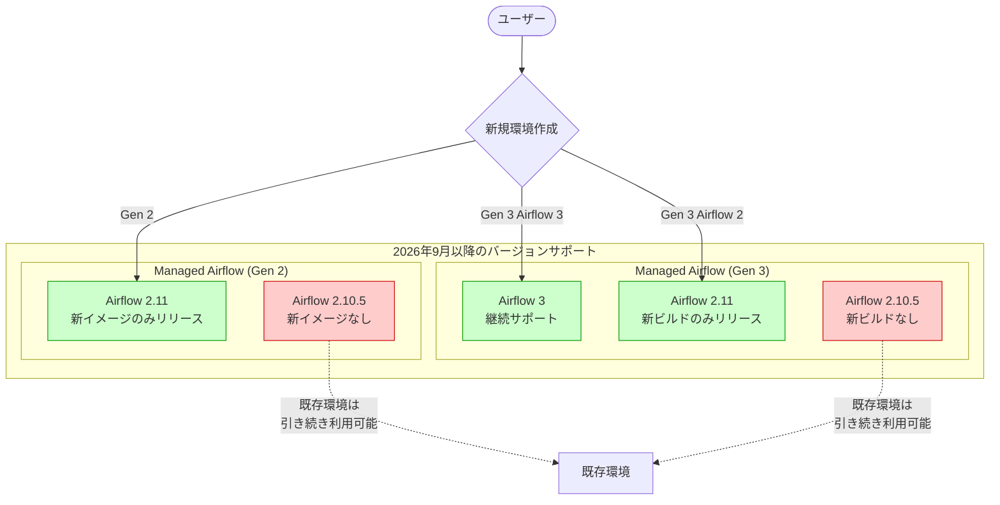

# Managed Service for Apache Airflow: Version Support Policy Changes (Airflow 2.10.5 Deprecation)

**リリース日**: 2026-07-24

**サービス**: Managed Service for Apache Airflow (Cloud Composer)

**機能**: Version Support Policy Changes (Airflow 2.10.5 Deprecation)

**ステータス**: Announcement

[このアップデートのインフォグラフィックを見る](https://takech9203.github.io/google-cloud-news-summary/20260724-managed-airflow-version-support-policy-changes.html)

## 概要

Google Cloud は、Managed Service for Apache Airflow (Cloud Composer) における Airflow 2.10.5 のバージョンサポートポリシー変更を発表した。2026 年 9 月以降、Airflow 2.10.5 は新しい Managed Airflow イメージおよびビルドに含まれなくなる。これは Gen 2 と Gen 3 の両方に適用される変更であり、今後は Airflow 2.11 が Gen 2/Gen 3 における新規リリースの基準バージョンとなる。

この変更は、Managed Airflow (Gen 2) のバージョンサポートポリシーを Managed Airflow (Gen 3) のポリシーに統一する取り組みの一環である。具体的には、Gen 2 では Airflow 2.11 を含む新しいイメージのみがリリースされ、Gen 3 では Airflow 2.11 の新しいビルドのみがリリースされる (Airflow 3 は引き続き変更なし)。既存のイメージおよびビルドには影響がないため、現在 Airflow 2.10.5 で稼働している環境は引き続き利用可能である。

**アップデート前の課題**

- Gen 2 と Gen 3 でバージョンサポートポリシーが異なっており、運用管理の一貫性に欠けていた
- Airflow 2.10.5 を含む複数のマイナーバージョンが並行してリリースされ、メンテナンス対象が分散していた
- ユーザーにとってどのバージョンを選択すべきか判断が複雑だった

**アップデート後の改善**

- Gen 2 と Gen 3 のバージョンサポートポリシーが統一され、管理が簡素化された
- Airflow 2.11 に新規リリースが集約されることで、セキュリティパッチやバグ修正がより迅速に提供される
- バージョン選択の指針が明確になり、Airflow 2.11 または Airflow 3 への移行パスが整理された

## アーキテクチャ図



この図は、2026 年 9 月以降のバージョンサポート状況を示している。Gen 2 では Airflow 2.11 のみ、Gen 3 では Airflow 2.11 と Airflow 3 が新規リリースの対象となり、Airflow 2.10.5 は新規リリースから除外される。

## サービスアップデートの詳細

### 主要機能

1. **Airflow 2.10.5 の新規リリース停止**
   - 2026 年 9 月以降、新しい Managed Airflow イメージ (Gen 2) およびビルド (Gen 3) に Airflow 2.10.5 は含まれない
   - 既存のイメージおよびビルドには影響なし (現在稼働中の環境はそのまま利用可能)

2. **Gen 2 バージョンサポートポリシーの変更**
   - Gen 2 では今後 Airflow 2.11 を含む新しいイメージのみがリリースされる
   - Gen 3 のポリシーに合わせた統一的な管理体制への移行

3. **Gen 3 における Airflow 2.11 ビルドへの集約**
   - Gen 3 では Airflow 2.11 の新しいビルドのみがリリースされる
   - Airflow 3 は従来通り変更なくサポートが継続される

## 技術仕様

### バージョンサポートポリシー比較

| 項目 | 変更前 | 変更後 (2026年9月以降) |
|------|--------|----------------------|
| Gen 2 新規イメージ | Airflow 2.10.5 + 2.11 | Airflow 2.11 のみ |
| Gen 3 新規ビルド (Airflow 2) | Airflow 2.10.5 + 2.11 | Airflow 2.11 のみ |
| Gen 3 新規ビルド (Airflow 3) | Airflow 3 | Airflow 3 (変更なし) |
| 既存環境への影響 | - | なし |

### サポート期間のルール

| 世代 | サポート期間 | 詳細 |
|------|------------|------|
| Gen 2 | リリースから 12 ヶ月 | サポート終了後も環境は動作するが、アップグレード推奨 |
| Gen 3 | リリースから 12 ヶ月 | サポート終了後も環境は動作するが、アップグレード推奨 |
| Legacy Gen 1 | 2026年9月15日 EOL | 全環境が利用不可になる予定 |

### バージョン形式

```
# Gen 2 イメージ形式
composer-2.b.c-airflow-x.y.z
# 例: composer-2.13.7-airflow-2.11.1

# Gen 3 ビルド形式
composer-3-airflow-x.y.z-build.t
# 例: composer-3-airflow-2.11.1-build.5
```

## 設定方法

### 前提条件

1. 既存の Managed Airflow (Gen 2 または Gen 3) 環境が Airflow 2.10.5 で稼働している場合
2. gcloud CLI がインストールされ、適切なプロジェクトが設定されていること

### 手順

#### ステップ 1: 現在の環境バージョンを確認

```bash
# 環境のバージョン情報を確認
gcloud composer environments describe ENVIRONMENT_NAME \
  --location LOCATION \
  --format="value(config.softwareConfig.imageVersion)"
```

現在のイメージバージョンに `airflow-2.10.5` が含まれている場合、アップグレードを計画する。

#### ステップ 2: アップグレード可能なバージョンを確認

```bash
# 利用可能なアップグレード先を一覧表示
gcloud composer environments list-upgrades ENVIRONMENT_NAME \
  --location LOCATION
```

Airflow 2.11 を含むバージョンが表示されることを確認する。

#### ステップ 3: 環境をアップグレード

```bash
# Gen 2 の場合
gcloud composer environments update ENVIRONMENT_NAME \
  --location LOCATION \
  --image-version composer-2-airflow-2.11

# Gen 3 の場合
gcloud composer environments update ENVIRONMENT_NAME \
  --location LOCATION \
  --image-version composer-3-airflow-2.11
```

アップグレード前に全 DAG を一時停止し、実行中のタスクが完了するのを待つこと。

#### ステップ 4: (オプション) Gen 3 への互換性チェック

```bash
# Gen 2 から Gen 3 への互換性を確認
gcloud composer environments check-upgrade ENVIRONMENT_NAME \
  --location LOCATION \
  --image-version composer-3-airflow-2.11
```

BLOCKING / NON_BLOCKING の競合を確認し、移行計画を立てる。

## メリット

### ビジネス面

- **管理の簡素化**: Gen 2 と Gen 3 のポリシーが統一されることで、マルチ世代環境の管理オーバーヘッドが削減される
- **セキュリティの向上**: リリース対象が集約されることで、セキュリティパッチの適用が迅速化される

### 技術面

- **明確なアップグレードパス**: Airflow 2.11 への集約により、バージョン選択の複雑さが軽減される
- **Airflow 3 への移行準備**: Gen 3 で Airflow 3 が引き続きサポートされることで、将来的なメジャーバージョンアップへのスムーズな移行が可能

## デメリット・制約事項

### 制限事項

- 2026 年 9 月以降、Airflow 2.10.5 で新しい環境を作成することが将来的にできなくなる可能性がある (新規イメージ/ビルドが提供されないため)
- Airflow 2.10.5 固有の機能やバグ修正に依存している場合、Airflow 2.11 への互換性確認が必要

### 考慮すべき点

- Airflow 2.10.5 から 2.11 へのアップグレードに伴う DAG の互換性テストが必要
- カスタム PyPI パッケージが Airflow 2.11 と互換性があるか事前に確認すること
- Gen 1 環境は 2026 年 9 月 15 日に EOL となるため、まだ移行していない場合は早急に対応が必要

## ユースケース

### ユースケース 1: 既存 Airflow 2.10.5 環境の計画的アップグレード

**シナリオ**: 本番環境で Airflow 2.10.5 を使用しており、2026 年 9 月までに Airflow 2.11 へのアップグレードを計画する必要がある。

**実装例**:
```bash
# 1. アップグレード前の互換性チェック
gcloud composer environments check-upgrade my-prod-env \
  --location us-central1 \
  --image-version composer-2-airflow-2.11

# 2. ステージング環境でのテスト
gcloud composer environments update my-staging-env \
  --location us-central1 \
  --image-version composer-2-airflow-2.11

# 3. DAG の動作確認後、本番環境をアップグレード
gcloud composer environments update my-prod-env \
  --location us-central1 \
  --image-version composer-2-airflow-2.11
```

**効果**: セキュリティパッチや新機能を継続的に受け取れる状態を維持し、サポート切れによるリスクを回避できる。

### ユースケース 2: Gen 2 から Gen 3 への移行を検討

**シナリオ**: Gen 2 のサポートポリシー変更をきっかけに、Gen 3 への移行を検討する。

**実装例**:
```bash
# 互換性チェック
gcloud composer environments check-upgrade my-env \
  --location us-central1 \
  --image-version composer-3-airflow-2.11

# 移行スクリプトの活用
# https://docs.cloud.google.com/composer/docs/composer-2/migrate-composer-3-script
```

**効果**: Gen 3 の自動スケーリング、簡素化されたネットワーク設定、CeleryKubernetes Executor などの利点を享受できる。

## 料金

Managed Service for Apache Airflow の料金は世代によって異なる。今回のバージョンポリシー変更による料金への直接的な影響はない。

### 料金モデル

| 世代 | 料金モデル |
|------|-----------|
| Gen 2 | Compute、Database、Web server、Storage の各コンポーネントに基づく従量課金 |
| Gen 3 | Compute、Storage の各コンポーネントに基づく従量課金 (簡素化されたモデル) |

詳細な料金情報は [Cloud Composer の料金ページ](https://cloud.google.com/composer/pricing) を参照。

## 利用可能リージョン

Managed Service for Apache Airflow は 40 以上のリージョンで利用可能。リージョンごとにイメージのリリースタイミングが異なる場合がある。詳細は [Cloud Composer のリージョン情報](https://cloud.google.com/composer/docs/concepts/locations) を参照。

## 関連サービス・機能

- **Apache Airflow 2.11**: 新しいリリースの基準バージョン。セキュリティ修正やパフォーマンス改善が含まれる
- **Apache Airflow 3**: Gen 3 で引き続きサポート。DAG バージョニング、イベントドリブンスケジューリングなどの新機能を提供
- **Cloud Monitoring**: Composer 環境の監視とアラート設定に使用
- **Cloud Logging**: Airflow DAG およびタスクのログ管理
- **GKE (Google Kubernetes Engine)**: Gen 2 環境の基盤として Autopilot モードの GKE クラスタを使用

## 参考リンク

- [インフォグラフィック](https://takech9203.github.io/google-cloud-news-summary/20260724-managed-airflow-version-support-policy-changes.html)
- [公式リリースノート](https://docs.cloud.google.com/release-notes#July_24_2026)
- [Cloud Composer バージョニング概要](https://docs.cloud.google.com/composer/docs/composer-versioning-overview)
- [Cloud Composer バージョン一覧](https://docs.cloud.google.com/composer/docs/composer-versions)
- [Gen 2 環境のアップグレード](https://docs.cloud.google.com/composer/docs/composer-2/upgrade-environments)
- [Gen 3 環境のアップグレード](https://docs.cloud.google.com/composer/docs/composer-3/upgrade-environments)
- [Gen 3 への移行ガイド](https://docs.cloud.google.com/composer/docs/latest/migrate-composer-1-to-3)
- [料金ページ](https://cloud.google.com/composer/pricing)

## まとめ

今回の発表は、Managed Service for Apache Airflow のバージョンサポートポリシーを Gen 2/Gen 3 で統一し、Airflow 2.10.5 を新規リリースから段階的に廃止する重要な変更である。既存環境への直接的な影響はないが、2026 年 9 月までに Airflow 2.11 へのアップグレード計画を策定し、テストを実施することが推奨される。特に Gen 1 環境を利用中の場合は、同月の EOL に向けた移行対応が急務である。

---

**タグ**: #CloudComposer #ManagedAirflow #ApacheAirflow #VersionSupport #Deprecation #Airflow2.11 #DataOrchestration
