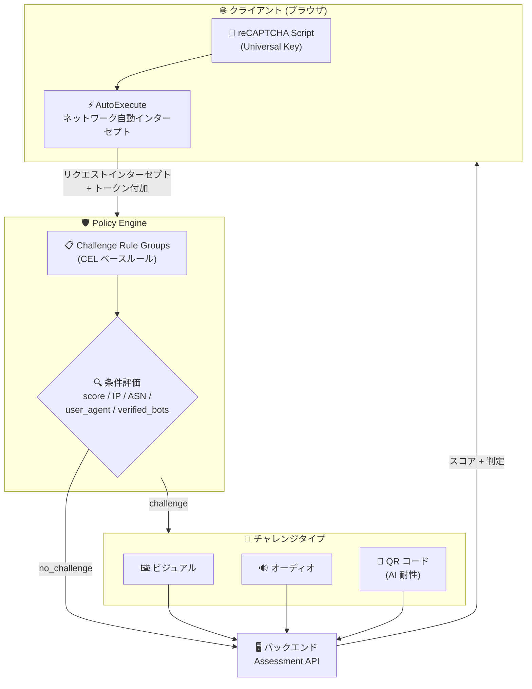

# reCAPTCHA (Google Cloud Fraud Defense): Policy Engine, Universal keys, Challenge Policies (Preview)

**リリース日**: 2026-07-24

**サービス**: reCAPTCHA (Google Cloud Fraud Defense)

**機能**: Policy Engine, Universal keys, Challenge Policies

**ステータス**: Preview

📊 [このアップデートのインフォグラフィックを見る](https://takech9203.github.io/google-cloud-news-summary/20260724-recaptcha-policy-engine-preview.html)

## 概要

Google Cloud Fraud Defense (旧 reCAPTCHA Enterprise) において、Policy Engine、Universal keys、および Challenge Policies が Preview として利用可能になった。Policy Engine は、カスタムルールに基づいて CAPTCHA チャレンジを条件付きでトリガーする機能を提供し、リスクスコア、IP アドレス、ユーザーエージェント、ASN (Autonomous System Number)、検証済みボットの識別情報に基づいた細やかな制御を可能にする。

新たに導入された Universal key は、Policy Engine 内でのルール作成をサポートする新しいキータイプであり、AutoExecute によるフロントエンド JavaScript 統合の簡素化を実現する。AutoExecute は非同期ネットワークリクエストを自動的にインターセプトし、reCAPTCHA トークンを付加するため、フロントエンド側はスクリプトタグの追加のみで統合が完了する。

さらに、AI 耐性を持つ新しい QR コードチャレンジが利用可能になった。従来のビジュアルチャレンジやオーディオチャレンジに加え、モバイルデバイスを使った二段階検証により、高度な自動化攻撃やクリックファームへの対策が強化される。

**アップデート前の課題**

- CAPTCHA チャレンジのトリガー条件が限定的で、スコアしきい値ベースの単純なルールしか設定できなかった
- フロントエンド統合には `grecaptcha.enterprise.execute()` を各アクションごとに手動で呼び出す必要があり、実装コストが高かった
- 従来のビジュアル/オーディオチャレンジは高度な AI ボットやクリックファームによって突破されるリスクがあった
- ボットの識別と信頼できるクローラーの許可を柔軟にルール化する手段がなかった

**アップデート後の改善**

- CEL (Common Expression Language) ベースのカスタムルールにより、スコア、IP、ASN、ユーザーエージェント、検証済みボットなど複数条件を組み合わせた精密な制御が可能になった
- AutoExecute により、スクリプトタグの追加だけでフロントエンド統合が完了し、開発工数が大幅に削減された
- AI 耐性のある QR コードチャレンジにより、モバイルデバイスの信頼された実行環境を活用した高セキュリティな検証が可能になった
- verified_bots 変数により、Google 検索ボットや AI エージェントなど信頼できるボットをルールで明示的に許可できるようになった

## アーキテクチャ図



Policy Engine がリクエストを受信すると、CEL ベースのカスタムルールを順次評価し、最初にマッチしたルールに基づいてチャレンジの表示可否と難易度を決定する。

## サービスアップデートの詳細

### 主要機能

1. **Policy Engine (ポリシーエンジン)**
   - CEL (Common Expression Language) で記述されたカスタムルールに基づき、CAPTCHA チャレンジを決定論的にトリガー
   - ルールはグループ単位 (`challenge_rule_groups`) で管理し、アクションごとに異なるポリシーを適用可能
   - ルールは上から順に評価され、最初にマッチしたルールが適用される (first-match 方式)
   - マッチしない場合はチャレンジなしでスコアのみ生成

2. **Universal Key (ユニバーサルキー)**
   - Policy Engine 内でのルール作成をサポートする新しいキータイプ
   - Console、gcloud CLI、REST API から作成可能
   - `--universal` フラグまたは `universalSettings` で作成
   - 既存のスコアベースキーやチェックボックスキーとは別の専用キータイプ

3. **AutoExecute (自動実行)**
   - フロントエンドの JavaScript 統合を簡素化
   - Fetch API や XMLHttpRequest による非同期ネットワークリクエストを自動インターセプト
   - reCAPTCHA トークンを `X-Recaptcha-Token` ヘッダーとして自動付加
   - `protected_endpoint_group` で保護対象のエンドポイントをパスとアクション名で定義

4. **Challenge Policies (チャレンジポリシー)**
   - `challenge_rule_groups` セクションでルールを定義
   - 難易度レベル: `USABILITY` (易), `BALANCE` (中, デフォルト), `SECURITY` (難)
   - `challenge` (チャレンジ表示) と `no_challenge` (チャレンジ非表示) の排他的アウトカム
   - アクションワイルドカード (`*`) による全アクション一括適用も可能

5. **QR コードチャレンジ (AI 耐性)**
   - モバイルデバイスの信頼された実行環境を活用した検証メカニズム
   - ブラウザに QR コードを表示し、モバイルデバイスでスキャンして検証完了
   - Android: Google Play Services 25.41.30 以降で内蔵
   - iOS: Apple App Clips 対応 (iOS 16 以降)、アプリインストール不要
   - モバイルブラウザ/WebView では QR コード表示がボタンに置換され直接検証フロー起動
   - 利用にはフラウドディフェンスチーム (fraud-defense@google.com) への申請が必要

## 技術仕様

### CEL 条件式で利用可能な変数

| 変数名 | 型 | 説明 |
|--------|-----|------|
| `score` | double | Fraud Defense のボットスコア (0.0-1.0) |
| `user_ip_address` | string | リクエスト元の IP アドレス (IPv4/IPv6) |
| `user_agent` | string | リクエスト元のユーザーエージェント |
| `user_asn` | int | リクエスト元の ASN (AS プレフィックスなし) |
| `verified_bots` | list(Bot) | 検証済みボットのリスト |

### CEL 条件式で利用可能な関数

| 関数名 | シグネチャ | 説明 |
|--------|-----------|------|
| `contains` | `string.contains(string) -> bool` | 部分文字列の検索 |
| `startsWith` | `string.startsWith(string) -> bool` | プレフィックス一致 |
| `endsWith` | `string.endsWith(string) -> bool` | サフィックス一致 |
| `size` | `size(string\|list) -> int` | 文字列長/リストサイズ |
| `has` | `has(message.field) -> bool` | フィールドの存在確認 |
| `all` | `list.all(x, predicate) -> bool` | 全要素が条件を満たすか |
| `exists` | `list.exists(x, predicate) -> bool` | 条件を満たす要素が存在するか |

### Policy 設定 (YAML 形式)

```yaml
client_settings:
  allowedDomains:
    - example.com
  protected_endpoint_group:
    protected_endpoints:
      - path: "/login_api"
        action: login
      - path: "/register_api"
        action: register
      - path: "/cart_api/add/*"
        action: add_to_cart

challenge_rule_groups:
  - actions: ['login', 'signup']
    challenge_rules:
      - condition: 'score < 0.5'
        challenge:
          difficulty: BALANCE
      - condition: 'verified_bots.exists(e, e.name == "google-agent")'
        no_challenge: {}
  - actions: ['*']
    challenge_rules:
      - condition: 'score < 0.3'
        challenge:
          difficulty: SECURITY
```

## 設定方法

### 前提条件

1. Google Cloud Fraud Defense の環境準備が完了していること
2. Google Cloud プロジェクトで課金が有効であること
3. reCAPTCHA Enterprise API が有効であること

### 手順

#### ステップ 1: Universal Key の作成

```bash
# gcloud CLI を使用して Universal key を作成
gcloud recaptcha keys create \
  --universal \
  --display-name="My Website Universal Key"
```

Console からの場合: Google Cloud Fraud Defense ページ > Keys タブ > Create key > Application type で "Universal" を選択

#### ステップ 2: フロントエンドへのスクリプト追加

```html
<head>
  <script src="https://www.google.com/recaptcha/enterprise.js?render=KEY_ID"></script>
</head>
```

AutoExecute 利用時はこのスクリプトタグの追加のみで統合完了。

#### ステップ 3: Policy 設定の適用

```bash
# ポリシー設定ファイルを作成 (policy.yaml)
cat > policy.yaml << 'EOF'
client_settings:
  allowedDomains:
    - example.com
  protected_endpoint_group:
    protected_endpoints:
      - path: "/login_api"
        action: login
      - path: "/checkout_api"
        action: checkout

challenge_rule_groups:
  - actions: ['login']
    challenge_rules:
      - condition: 'score < 0.5'
        challenge:
          difficulty: BALANCE
EOF

# ポリシーを適用
gcloud alpha recaptcha policies update \
  --key=KEY_ID \
  --policy=policy.yaml
```

#### ステップ 4: バックエンドでのアセスメント作成

```bash
# アセスメント API を呼び出し
curl -X POST \
  -H "Authorization: Bearer $(gcloud auth print-access-token)" \
  -H "Content-Type: application/json" \
  "https://recaptchaenterprise.googleapis.com/v1/projects/PROJECT_ID/assessments" \
  -d '{
    "event": {
      "token": "TOKEN_FROM_X_RECAPTCHA_TOKEN_HEADER",
      "siteKey": "KEY_ID",
      "expectedAction": "login"
    }
  }'
```

## メリット

### ビジネス面

- **不正アクセス対策の精密化**: リスクスコアだけでなく、IP、ASN、ボット識別を組み合わせた多層的な防御が可能になり、不正行為の検知精度が向上
- **正当なボットとの共存**: AI エージェントや検索エンジンクローラーを明示的に許可するルールにより、正当なボットトラフィックへの影響を最小化
- **ユーザー体験の最適化**: 低リスクユーザーにはチャレンジを表示せず、高リスクリクエストのみに段階的な難易度でチャレンジを適用

### 技術面

- **実装工数の削減**: AutoExecute により、フロントエンド統合がスクリプトタグ 1 行で完了し、各アクションごとの `execute()` 呼び出しが不要
- **CEL ベースの柔軟なルール定義**: 標準的な式言語で複雑な条件分岐を記述でき、Infrastructure as Code との相性も良い
- **AI 耐性の向上**: QR コードチャレンジにより、従来のビジュアルチャレンジでは防げなかった高度なボット攻撃に対応

## デメリット・制約事項

### 制限事項

- Preview ステータスのため、本番環境での SLA は保証されない (Pre-GA Offerings Terms が適用)
- QR コードチャレンジの利用には、Fraud Defense チーム (fraud-defense@google.com) への事前申請と Universal key のアロウリスト登録が必要
- AutoExecute は Fetch API と XMLHttpRequest による非同期リクエストのみをインターセプト (ページロード時のリソース読み込みは対象外)
- Policy Engine は Premium ティアで 3 ルールまで、Enterprise ティアで無制限
- `protected_endpoints` のパスパターンでスタンドアロンの `/*` や `/**` は使用不可 (パフォーマンス影響防止のため)

### 考慮すべき点

- AutoExecute でサードパーティスクリプトのリクエストが保護パスと一致する場合、意図しないインターセプトが発生する可能性がある
- ルール評価は first-match 方式のため、ルールの順序設計が重要
- QR コードチャレンジは Android では Google Play Services 25.41.30 以降、iOS では iOS 16 以降が必要

## ユースケース

### ユースケース 1: EC サイトのログイン保護

**シナリオ**: EC サイトでのアカウント乗っ取り (ATO) 対策として、ログインアクションにリスクベースのチャレンジを適用したい。信頼できる社内 IP からのアクセスにはチャレンジを表示せず、低スコアのアクセスには高難易度のチャレンジを表示する。

**実装例**:
```yaml
challenge_rule_groups:
  - actions: ['login']
    challenge_rules:
      - condition: 'user_ip_address.startsWith("10.0.")'
        no_challenge: {}
      - condition: 'score < 0.3'
        challenge:
          difficulty: SECURITY
      - condition: 'score < 0.7'
        challenge:
          difficulty: BALANCE
```

**効果**: 正当な社内ユーザーのフリクションをゼロにしつつ、不審なアクセスには段階的なチャレンジで防御。ATO 攻撃の大幅な削減が期待される。

### ユースケース 2: AI エージェント対応 Web サービス

**シナリオ**: AI ショッピングアシスタントなどの正当な AI エージェントからのアクセスを許可しつつ、不正なボットによるスクレイピングや自動購入を防止したい。

**実装例**:
```yaml
challenge_rule_groups:
  - actions: ['*']
    challenge_rules:
      - condition: 'verified_bots.exists(e, e.name == "google-agent")'
        no_challenge: {}
      - condition: 'score < 0.5 && user_asn in [12345, 67890]'
        challenge:
          difficulty: SECURITY
      - condition: 'score < 0.5'
        challenge:
          difficulty: BALANCE
```

**効果**: 検証済み AI エージェントの通行を確保しつつ、不正なボットファームの ASN からのアクセスを高セキュリティチャレンジで阻止。Agentic Web 時代の信頼性フレームワークを実現。

### ユースケース 3: 高セキュリティ要件の決済ページ

**シナリオ**: 決済処理を行うページで、QR コードチャレンジによる最高レベルのセキュリティを適用し、クリックファームや高度な AI ボットによるカーディング攻撃を防止したい。

**効果**: モバイルデバイスの信頼された実行環境を使った検証により、従来のビジュアルチャレンジを突破する高度な攻撃に対しても有効な防御を実現。

## 料金

Google Cloud Fraud Defense の料金体系は 3 つのティアで構成される。Policy Engine は Premium ティア以上で利用可能。

### 料金例

| ティア | 月額料金 (概算) | Policy Engine |
|--------|-----------------|---------------|
| Essentials | 無料 (10,000 アセスメントまで) | 利用不可 |
| Premium | 10,001-100,000: $8.00/1,000、100,000超: $1.00/1,000 | 3 ルールまで |
| Enterprise | $1.00/1,000 アセスメント (固定月額コミットメント) | 無制限 |

- 無料枠: 組織あたり 10,000 アセスメント/月 (全アカウント・全サイト合算)
- Premium: 月額 + 従量制、コミットメントなし
- Enterprise: 最低 12 か月のサブスクリプション

## 利用可能リージョン

Google Cloud Fraud Defense はグローバルサービスとして提供されており、特定のリージョン制限はない。ただし QR コードチャレンジの利用には事前申請が必要。

## 関連サービス・機能

- **Google Cloud Armor**: WAF レベルでの reCAPTCHA トークン検証との連携が可能。Cloud Armor のセキュリティポリシーで reCAPTCHA スコアに基づくルールを定義し、ネットワークレイヤーでの防御と組み合わせ可能
- **Cloud Identity / Identity Platform**: ユーザー認証フローとの統合により、ログイン・サインアップ時の不正アクセス防御を強化
- **Cloud Monitoring / Cloud Logging**: Fraud Defense のアセスメント結果のモニタリングとログ分析
- **Apigee**: API ゲートウェイレベルでの reCAPTCHA トークン検証を組み合わせた API セキュリティ

## 参考リンク

- 📊 [インフォグラフィック](https://takech9203.github.io/google-cloud-news-summary/20260724-recaptcha-policy-engine-preview.html)
- [公式リリースノート](https://docs.cloud.google.com/release-notes#July_24_2026)
- [Policy Engine ドキュメント](https://docs.cloud.google.com/recaptcha/docs/policy-engine)
- [Challenge Policies ドキュメント](https://docs.cloud.google.com/recaptcha/docs/challenge-policies)
- [Challenge Types ドキュメント](https://docs.cloud.google.com/recaptcha/docs/select-challenge-types)
- [Universal Key のインストール](https://docs.cloud.google.com/recaptcha/docs/install-universal-keys-web-pages)
- [Fraud Defense ティア比較](https://docs.cloud.google.com/recaptcha/docs/compare-tiers)
- [料金ページ](https://cloud.google.com/security/products/fraud-defense#pricing)
- [Policy REST API リファレンス](https://docs.cloud.google.com/recaptcha/docs/reference/rest/v1/Policy)

## まとめ

今回の Policy Engine、Universal keys、Challenge Policies の Preview リリースは、Google Cloud Fraud Defense の柔軟性とセキュリティを大幅に向上させるアップデートである。CEL ベースのカスタムルールにより、従来のスコアしきい値のみの制御から脱却し、多次元的な条件に基づく精密な不正アクセス防御が実現された。特に AI 耐性の QR コードチャレンジと、Agentic Web 時代に対応した検証済みボットの識別機能は、今後のセキュリティ戦略において重要な要素となる。Web サイトのセキュリティ担当者は、まず Premium ティア以上のアカウントで Policy Engine を有効化し、ログインや決済といった重要アクションへの段階的なチャレンジポリシーの導入を検討することを推奨する。

---

**タグ**: #GoogleCloud #FraudDefense #reCAPTCHA #PolicyEngine #UniversalKey #ChallengePolicy #Security #Preview #AntiBot #CAPTCHA #QRCode #CEL
