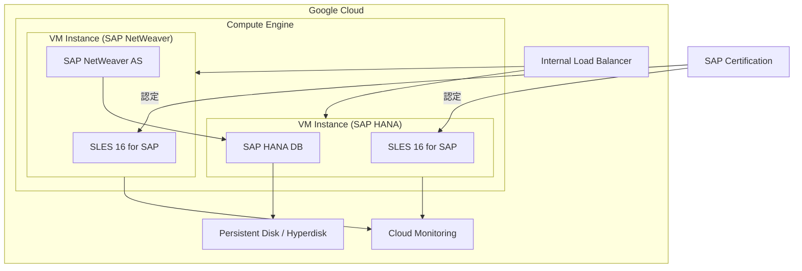

# SAP on Google Cloud: SLES 16 for SAP Certification

**リリース日**: 2026-07-24

**サービス**: SAP on Google Cloud

**機能**: SLES 16 for SAP Certification

**ステータス**: Announcement

📊 [このアップデートのインフォグラフィックを見る](https://takech9203.github.io/google-cloud-news-summary/20260724-sap-on-google-cloud-sles-16-certification.html)

## 概要

SAP は、Google Cloud 上での SAP HANA および SAP NetWeaver の実行環境として、SUSE Linux Enterprise Server (SLES) 16 for SAP を新たに認定しました。これは SLES のメジャーバージョンアップであり、SLES 12 から SLES 15 への移行以来の大きなプラットフォーム更新となります。

SLES 16 for SAP は、最新の Linux カーネル、改善されたセキュリティ機能、パフォーマンス最適化を提供し、Google Cloud の Compute Engine インスタンス上で SAP ワークロードを実行する際の基盤 OS として利用可能になります。この認定により、SAP on Google Cloud のユーザーは最新のオペレーティングシステムを採用し、長期的なサポートとセキュリティパッチの恩恵を受けることができます。

この認定は、SAP HANA データベースおよび SAP NetWeaver アプリケーションサーバーの両方に適用されるため、S/4HANA、BW/4HANA、ECC などの SAP アプリケーションスイート全体で SLES 16 を活用できます。

**アップデート前の課題**

- Google Cloud 上の SAP ワークロードでは SLES 15 SP7 が最新の認定 OS バージョンであり、SLES 16 の新機能やカーネル改善を活用できなかった
- SLES 15 の一部バージョン (SP5 以前) では Linux カーネルの制限により SAP HANA テーブルロードパフォーマンスが低下する問題があった
- 新しいハードウェアやセキュリティ要件に対応するため、最新の OS プラットフォームへの移行ニーズがあった

**アップデート後の改善**

- SLES 16 for SAP が SAP HANA および SAP NetWeaver の両方で正式に認定され、Google Cloud 上で利用可能になった
- 最新の Linux カーネルによるパフォーマンス改善、セキュリティ強化、新しいハードウェアサポートが利用可能になった
- 長期サポート (LTSS) のライフサイクルが更新され、今後数年間にわたる安定したサポートが確保された

## アーキテクチャ図



SLES 16 for SAP が SAP HANA および SAP NetWeaver の基盤 OS として認定され、Google Cloud の Compute Engine 上で SAP ワークロードを実行する構成を示しています。

## サービスアップデートの詳細

### 主要機能

1. **SAP HANA 対応の認定**
   - SLES 16 for SAP が SAP HANA データベースの実行 OS として正式に認定
   - Google Cloud 上のすべての SAP HANA 認定マシンタイプで利用可能 (確認待ち)
   - OLAP (分析) および OLTP (トランザクション) の両ワークロードに対応

2. **SAP NetWeaver 対応の認定**
   - SAP NetWeaver Application Server (ABAP/Java) の実行 OS として認定
   - S/4HANA、BW/4HANA、ECC、Business Suite などの SAP アプリケーションで利用可能
   - 3 層構成 (3-tier) デプロイメントに対応

3. **SLES 16 プラットフォームの主な特徴**
   - 最新の Linux カーネルによるパフォーマンス向上
   - セキュリティ機能の強化 (暗号化、アクセス制御)
   - 改善されたコンテナおよび仮想化サポート
   - SAP 固有のカーネルチューニングとメモリ管理の最適化

## 技術仕様

### サポートされる SAP 製品

| SAP 製品 | SLES 16 対応 |
|----------|-------------|
| SAP HANA | 認定済み |
| SAP NetWeaver (ABAP/Java) | 認定済み |
| SAP S/4HANA | 認定済み (SAP HANA + NetWeaver) |
| SAP BW/4HANA | 認定済み (SAP HANA + NetWeaver) |
| SAP ECC | 認定済み |
| SAP Business Suite | 認定済み |

### Google Cloud 上の既存 SLES 認定バージョンとの比較

| OS バージョン | SAP HANA | SAP NetWeaver | 備考 |
|--------------|----------|---------------|------|
| SLES 16 for SAP | 認定済み | 認定済み | 新規追加 |
| SLES 15 SP7 for SAP | 認定済み | 認定済み | 現行最新 SP |
| SLES 15 SP6 for SAP | 認定済み | 認定済み | カーネル最適化あり |
| SLES 15 SP5 for SAP | 認定済み | 認定済み | テーブルロード性能注意 |
| SLES 12 SP5 for SAP | 認定済み | 認定済み | レガシーサポート |

### ライセンスオプション

Google Cloud 上での SLES for SAP のライセンスオプションは以下の通りです (SLES 16 での提供形態は今後の発表を確認)。

| オプション | 説明 |
|-----------|------|
| On demand | Google Cloud が提供するイメージにライセンスが含まれる |
| BYOS (Bring Your Own Subscription) | SUSE から直接購入したサブスクリプションを使用 |
| GC-HA | Google Cloud 向けの高可用性機能が有効化されたイメージ |

## 設定方法

### 前提条件

1. Google Cloud プロジェクトが作成済みであること
2. SAP on Google Cloud の認定マシンタイプを使用すること
3. SLES 16 for SAP のイメージが Compute Engine で利用可能であること (Google Cloud からの提供開始を確認)

### 手順

#### ステップ 1: SLES 16 for SAP イメージの確認

```bash
# Compute Engine で利用可能な SLES for SAP イメージを確認
gcloud compute images list --project suse-sap-cloud --filter="name~sles-16"
```

Google Cloud が SLES 16 for SAP のイメージを提供開始した後に利用可能になります。

#### ステップ 2: VM インスタンスの作成

```bash
# SAP HANA 用の VM を作成する例
gcloud compute instances create sap-hana-vm \
    --zone=us-central1-a \
    --machine-type=m4-ultramem-112 \
    --image-family=sles-16-for-sap \
    --image-project=suse-sap-cloud \
    --boot-disk-size=50GB \
    --boot-disk-type=pd-ssd
```

具体的なイメージファミリー名は Google Cloud からの正式発表を確認してください。

#### ステップ 3: SAP HANA のインストール

```bash
# SAP HANA のインストール前に OS の設定を確認
sudo saptune solution apply HANA
sudo saptune solution verify HANA
```

SLES 16 での saptune の互換性と設定手順については、SUSE の公式ドキュメントを参照してください。

## メリット

### ビジネス面

- **長期サポートの確保**: SLES 16 は新しいサポートライフサイクルを開始するため、今後数年間にわたり安定したセキュリティパッチとアップデートが提供される
- **コンプライアンス対応**: 最新の暗号化規格やセキュリティ標準に準拠し、規制要件への対応が容易になる
- **将来性**: 新しいハードウェア世代やクラウドインフラの進化に対応する最新プラットフォーム

### 技術面

- **パフォーマンス改善**: 最新カーネルによるメモリ管理、I/O スケジューリング、ネットワークスタックの最適化
- **セキュリティ強化**: 最新のセキュリティパッチ、改善されたアクセス制御メカニズム
- **最新 Compute Engine マシンタイプとの互換性**: C4、M4 などの最新世代マシンタイプでの最適な動作が期待される

## デメリット・制約事項

### 制限事項

- Google Cloud が SLES 16 for SAP のイメージを公式に提供開始するまで、On demand ライセンスオプションが利用できない可能性がある
- 高可用性クラスター構成 (Pacemaker) の SLES 16 対応ガイドが別途必要になる可能性がある
- 既存の SLES 15 環境からのインプレースアップグレードパスについては SUSE のガイダンスを確認する必要がある

### 考慮すべき点

- SLES 15 SP6 以降で改善された SAP HANA テーブルロードパフォーマンスが SLES 16 でも引き継がれているか確認が必要
- 既存の Terraform デプロイメントテンプレートが SLES 16 に対応しているか確認が必要
- sap-suse-cluster-connector やその他の SAP HA 関連パッケージの SLES 16 対応状況を確認する必要がある
- Google Cloud's Agent for SAP の SLES 16 対応状況を確認する必要がある

## ユースケース

### ユースケース 1: 新規 S/4HANA デプロイメント

**シナリオ**: 新規に S/4HANA システムを Google Cloud 上にデプロイする企業が、最新の OS プラットフォームで長期的なサポートを確保したい。

**効果**: SLES 16 for SAP を基盤として採用することで、OS のサポート終了を心配することなく、今後のシステムライフサイクル全体にわたり安定した運用が可能。最新のカーネル最適化によるパフォーマンス向上も期待できる。

### ユースケース 2: 既存 SAP システムの OS アップグレード

**シナリオ**: SLES 12 SP5 や SLES 15 の古いバージョンを使用している既存の SAP on Google Cloud 環境を最新の OS に移行したい。

**効果**: SLES 16 への移行により、セキュリティの強化、パフォーマンスの改善、および長期サポートの恩恵を受けることができる。ただし、インプレースアップグレードではなく、新規インスタンスへの移行 (OS Migration) を推奨。

### ユースケース 3: 高可用性クラスター構成での利用

**シナリオ**: SAP HANA の高可用性 (HA) クラスターを Google Cloud 上に構築し、最新の Pacemaker スタックと SLES 16 の HA 機能を活用したい。

**効果**: SLES 16 の最新 Pacemaker/Corosync スタックと Google Cloud の Internal Load Balancer を組み合わせた HA 構成により、信頼性の高い SAP HANA 運用が実現可能。STONITH フェンシング (fence_gce) による障害検出と自動フェイルオーバーが利用可能。

## 料金

SLES 16 for SAP の利用料金は、ライセンスオプションにより異なります。

- **On demand**: Compute Engine の VM 利用料金に SLES for SAP のライセンス料が含まれる
- **BYOS**: SUSE から直接購入したサブスクリプションを適用 (Google Cloud の VM 料金のみ課金)
- **Committed Use Discounts (CUD)**: SLES for SAP イメージに対して確約利用割引を適用可能

具体的な料金については、Google Cloud の料金ページおよび SUSE の価格体系を確認してください。

## 利用可能リージョン

SLES for SAP のイメージは、Compute Engine が利用可能なすべてのリージョンでサポートされています。SAP HANA の認定マシンタイプの利用可能性はリージョンにより異なるため、デプロイ先のリージョンで必要なマシンタイプが利用可能か確認してください。

## 関連サービス・機能

- **Compute Engine**: SAP HANA および SAP NetWeaver をホストする仮想マシンインフラ。M4、C4 などのメモリ最適化マシンタイプが SAP HANA 向けに認定されている
- **Cloud Monitoring**: Google Cloud's Agent for SAP を使用した SAP HANA モニタリングメトリクスの収集と可視化
- **Internal Load Balancer**: SAP の高可用性クラスター構成におけるフェイルオーバー時のトラフィック制御
- **Cloud Storage**: Backint ベースの SAP HANA バックアップ・リカバリ
- **Google Cloud NetApp Volumes**: SAP HANA の /hana/data、/hana/log ボリューム用の高性能ネットワークストレージ
- **Terraform**: SAP デプロイメントの自動化 (sap_hana、sap_hana_ha モジュール)

## 参考リンク

- 📊 [インフォグラフィック](https://takech9203.github.io/google-cloud-news-summary/20260724-sap-on-google-cloud-sles-16-certification.html)
- [公式リリースノート](https://docs.cloud.google.com/release-notes#July_24_2026)
- [SAP HANA の OS サポート (Google Cloud ドキュメント)](https://docs.cloud.google.com/sap/docs/sap-hana-os-support)
- [SAP NetWeaver の OS サポート (Google Cloud ドキュメント)](https://docs.cloud.google.com/sap/docs/netweaver-os-support)
- [SAP HANA の認定構成 (Google Cloud ドキュメント)](https://docs.cloud.google.com/sap/docs/certifications-sap-hana)
- [SAP アプリケーションの認定 (Google Cloud ドキュメント)](https://docs.cloud.google.com/sap/docs/certifications-sap-apps)
- [SUSE Product Support Lifecycle](https://www.suse.com/lifecycle/)
- [SAP HANA Hardware Directory](https://www.sap.com/dmc/exp/2014-09-02-hana-hardware/enEN/#/solutions?filters=iaas;ve:29)

## まとめ

SLES 16 for SAP の認定は、Google Cloud 上の SAP ワークロードに最新のオペレーティングシステムプラットフォームを提供する重要なマイルストーンです。新規デプロイメントを計画している場合は SLES 16 for SAP の採用を検討し、既存環境については移行計画の策定を開始することを推奨します。Google Cloud からの公式イメージ提供状況および高可用性クラスター構成ガイドの更新を確認した上で、本番環境への適用を進めてください。

---

**タグ**: SAP on Google Cloud, SLES 16, SUSE Linux Enterprise Server, SAP HANA, SAP NetWeaver, OS Certification, Compute Engine
