# Google SecOps SOAR: Release 6.3.94 全リージョン提供開始

**リリース日**: 2026-07-25

**サービス**: Google SecOps SOAR (Security Orchestration, Automation, and Response)

**機能**: Release 6.3.94 メンテナンスリリース

**ステータス**: GA (全リージョン提供)

[このアップデートのインフォグラフィックを見る](https://takech9203.github.io/google-cloud-news-summary/20260725-google-secops-soar-release-6-3-94.html)

## 概要

Google SecOps SOAR の Release 6.3.94 が全リージョンで利用可能になった。本リリースは 2026 年 7 月 19 日に第 1 フェーズのリージョン (日本、インド、オーストラリア、カナダ、ドイツ、スイス) に展開が開始され、約 1 週間の段階的ロールアウトを経て、7 月 25 日に全リージョンへの提供が完了した。

本リリースは内部およびカスタマー向けのバグ修正を含むメンテナンスリリースである。Google SecOps SOAR は週次リリースサイクルを維持しており、プラットフォームの安定性と信頼性の継続的な改善を行っている。

セキュリティオーケストレーション・自動化・レスポンス (SOAR) プラットフォームを運用しているセキュリティチームは、自動的にアップデートが適用されるため特別な対応は不要だが、リリース後のプレイブック動作やインテグレーション接続の正常性を確認することが推奨される。

**アップデート前の課題**

- 第 1 フェーズのリージョン (日本、インド等) のみで Release 6.3.94 が利用可能だった
- 第 2 フェーズのリージョン (米国、EU、英国等) では Release 6.3.93 が最新バージョンだった
- 一部のカスタマー向けバグが未修正の状態だった

**アップデート後の改善**

- 全リージョンで Release 6.3.94 が統一的に利用可能になった
- 内部バグ修正によりプラットフォームの安定性が向上した
- カスタマー報告のバグが修正され、運用品質が改善された

## アーキテクチャ図

```mermaid
flowchart LR
    subgraph Phase1["第1フェーズ (7/19)"]
        JP["🇯🇵 日本"]
        IN["🇮🇳 インド"]
        AU["🇦🇺 オーストラリア"]
        CA["🇨🇦 カナダ"]
        DE["🇩🇪 ドイツ"]
        CH["🇨🇭 スイス"]
    end

    subgraph Phase2["第2フェーズ (7/25)"]
        SG["🇸🇬 シンガポール"]
        QA["🇶🇦 カタール"]
        SA["🇸🇦 サウジアラビア"]
        IL["🇮🇱 イスラエル"]
        UK["🇬🇧 英国"]
        IT["🇮🇹 イタリア"]
        EU["🇪🇺 EU マルチリージョン"]
        US["🇺🇸 US マルチリージョン"]
    end

    Release["📦 Release 6.3.94"]
    Release --> Phase1
    Phase1 --> Phase2
```



Google SecOps SOAR は 2 段階のグラデュアルリリースプロセスを採用しており、第 1 フェーズで安定性を確認した後に第 2 フェーズのリージョンへ展開される。

## サービスアップデートの詳細

### 主要機能

1. **内部バグ修正**
   - Google SecOps SOAR プラットフォームの内部動作に関する不具合の修正
   - プラットフォームの安定性とパフォーマンスの向上

2. **カスタマー向けバグ修正**
   - カスタマーから報告された不具合の修正
   - 具体的な修正内容は個別のバグ ID で管理されているが、公開リリースノートでは詳細は開示されていない

3. **段階的ロールアウトの完了**
   - 7 月 19 日: 第 1 フェーズリージョンへの展開開始
   - 7 月 25 日: 全リージョンへの展開完了

## 技術仕様

### リリースバージョン情報

| 項目 | 詳細 |
|------|------|
| バージョン | 6.3.94 |
| 前バージョン | 6.3.93 |
| リリースタイプ | メンテナンス (バグ修正) |
| 第 1 フェーズ展開日 | 2026-07-19 |
| 全リージョン提供日 | 2026-07-25 |
| 展開方式 | 2 段階グラデュアルリリース |

### グラデュアルリリース対象リージョン

| フェーズ | リージョン |
|---------|-----------|
| 第 1 フェーズ | 日本、インド、オーストラリア、カナダ、ドイツ、スイス |
| 第 2 フェーズ | シンガポール、カタール、サウジアラビア、イスラエル、英国 (ロンドン)、イタリア、EU (マルチリージョン)、US (マルチリージョン) |

## メリット

### ビジネス面

- **ダウンタイム最小化**: 段階的ロールアウトにより、リリースに起因する問題を早期に検知し、全リージョンへの影響を最小化
- **継続的な品質向上**: 週次リリースサイクルによりバグ修正が迅速に提供され、運用品質が維持される

### 技術面

- **プラットフォーム安定性向上**: 内部バグ修正により、プレイブック実行やインテグレーション動作の信頼性が向上
- **自動適用**: マネージドサービスとして自動的にアップデートが適用されるため、運用チームのメンテナンス負荷がない

## デメリット・制約事項

### 制限事項

- リリースノートに個別のバグ修正内容が詳細に記載されていないため、特定の不具合が修正されたかは個別に確認が必要
- 段階的ロールアウトにより、第 1 フェーズと第 2 フェーズのリージョン間で一時的にバージョン差異が発生する

### 考慮すべき点

- リリース後にプレイブックやカスタムインテグレーションの動作確認を行うことが推奨される
- 不具合が発生した場合は Google SecOps サポートへの問い合わせが必要

## ユースケース

### ユースケース 1: セキュリティ運用チームのバージョン確認

**シナリオ**: SOC チームが Google SecOps SOAR のバージョンを確認し、最新のバグ修正が適用されていることを確認する。

**実装例**:
```
Settings > License Management ページでシステムバージョン番号を確認
バージョンが 6.3.94 であることを確認
```

**効果**: プラットフォームが最新状態であることを確認し、既知の不具合が解消されていることを把握できる。

### ユースケース 2: リリース後のプレイブック動作確認

**シナリオ**: リリース適用後に、運用中のプレイブックが正常に動作していることを確認する。

**効果**: リリースに起因する予期しない動作変更を早期に検知し、必要に応じてロールバックやワークアラウンドを実施できる。

## 料金

Google SecOps SOAR の料金は Google Security Operations のサブスクリプションに含まれる。リリースアップデートによる追加料金は発生しない。詳細な料金体系については Google SecOps の営業担当に確認が必要。

## 利用可能リージョン

Release 6.3.94 は以下の全リージョンで利用可能:

- 日本、インド、オーストラリア、カナダ、ドイツ、スイス
- シンガポール、カタール、サウジアラビア、イスラエル
- 英国 (ロンドン)、イタリア
- EU (マルチリージョン)、US (マルチリージョン)

## 関連サービス・機能

- **Google SecOps SIEM**: SOAR と統合されたセキュリティ情報・イベント管理。アラートの検出と SOAR への転送を担当
- **Chronicle API**: SOAR の Case、Alert、Playbook 等のリソースをプログラムから操作する統合 API
- **Publisher Agent**: リモート環境でのコネクタ、アクション、ジョブの実行を可能にするエージェント (最新版 2.7.0)
- **Content Hub (Marketplace)**: サードパーティインテグレーション、ユースケース、Power Ups の配布プラットフォーム
- **Gemini for Playbooks**: AI を活用したプレイブック自動生成機能 (GA)

## 参考リンク

- [インフォグラフィック](https://takech9203.github.io/google-cloud-news-summary/20260725-google-secops-soar-release-6-3-94.html)
- [公式リリースノート](https://docs.cloud.google.com/chronicle/docs/soar/release-notes)
- [Google SecOps SOAR 概要](https://docs.cloud.google.com/chronicle/docs/soar/overview-and-introduction/soar-overview)
- [グラデュアルリリース計画](https://docs.cloud.google.com/chronicle/docs/soar/overview-and-introduction/soar-gradual-release)
- [Google SecOps ステータスダッシュボード](https://status.cloud.google.com/security/)

## まとめ

Google SecOps SOAR Release 6.3.94 は全リージョンで利用可能になったメンテナンスリリースである。内部およびカスタマー向けのバグ修正が含まれており、プラットフォームの安定性と信頼性が向上している。運用中のセキュリティチームは特別な対応は不要だが、プレイブックやインテグレーションの正常動作を確認しておくことが推奨される。

---

**タグ**: #GoogleSecOps #SOAR #SecurityOperations #BugFix #Release #Chronicle #SecurityAutomation
