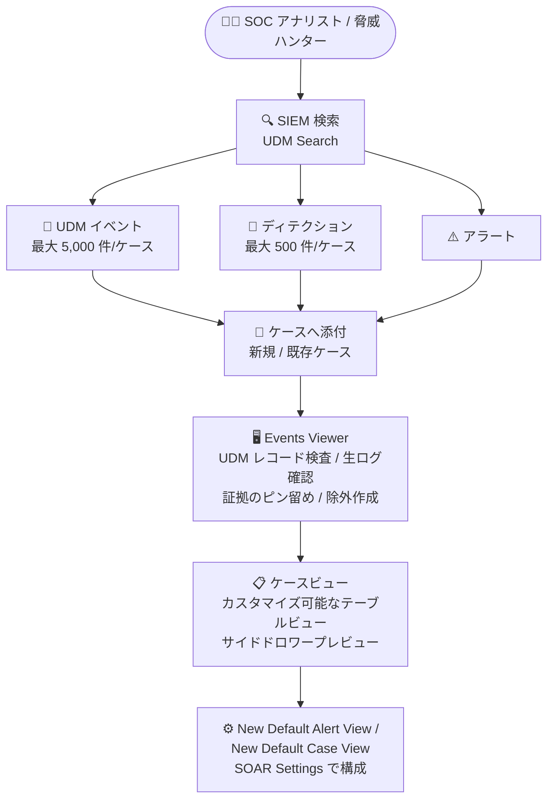

# Google SecOps: [Spotlight Feature] 新しい調査・ケース管理エクスペリエンス (Public Preview)

**リリース日**: 2026-07-26

**サービス**: Google SecOps

**機能**: Investigation and case management experience (調査・ケース管理エクスペリエンスの刷新)

**ステータス**: Public Preview

📊 [このアップデートのインフォグラフィックを見る](https://takech9203.github.io/google-cloud-news-summary/20260726-google-secops-investigation-case-management.html)

## 概要

Google SecOps に、刷新された Investigation Management (調査管理) エクスペリエンスが Public Preview として追加されました。従来のアラート中心のケース管理に加えて、生の UDM イベントおよびディテクション (検出) をアラートと並べてケース内で追跡できるようになり、レトロハント (retrohunt) やスレットハント (threat hunt) といった新しいタイプの調査や、ケースあたりの調査ボリュームの増大に対応します。

ケースキューはカスタマイズ可能なテーブルビュー、サイドドロワーによるプレビュー、統合された UDM Search ワークフローでナビゲートでき、SIEM 検索と SOAR ケース管理の間のコンテキストスイッチを削減します。公式ドキュメントでは、アラート起点の「リアクティブ」なケースに加え、仮説やハンティングタスクを起点とする「プロアクティブ」なケース (探索的調査のコンテナ) という新しい調査モデルが示されています。

本 Preview は、単一の Google SecOps SIEM インスタンスが SOAR にデータを取り込む「シングル SIEM デプロイメント」のみをサポートしており、フェデレーテッド環境や MSSP 環境はサポート対象外です。SOC アナリスト、脅威ハンター、インシデントレスポンダーが主な対象ユーザーです。

**アップデート前の課題**

- ケースはアラートを中心に構成されており、レトロハントやスレットハントで見つかった生の UDM イベントやディテクションをケースの中核的な証拠として直接追跡することができなかった
- SIEM 検索 (UDM Search) の結果をケースに取り込むための統合されたワークフローがなく、調査中に検索画面とケース画面を行き来する必要があった
- 大量のイベント・ディテクションを扱う調査 (高ボリュームの調査) をケース管理の枠組みで扱いにくかった

**アップデート後の改善**

- 生の UDM イベントとディテクションをアラートと並べてケース内で追跡できるようになり、レトロハントやスレットハントなどの調査タイプに対応した
- SIEM 検索結果から UDM イベントやディテクションを新規または既存のケースに直接添付できるようになった (1 ケースあたり最大 500 ディテクション、5,000 UDM イベント)
- インタラクティブな Events Viewer により、パース済み UDM レコードの確認、元の生ログのレビュー、重要な証拠のピン留め、検出除外 (exclusion) のリアルタイム作成がサイドパネルで完結するようになった
- カスタマイズ可能なテーブルビューとサイドドロワープレビューで、大量のケースキューを効率的にナビゲートできるようになった

## アーキテクチャ図



SIEM 検索で見つけた UDM イベント・ディテクション・アラートをケースの中核的な証拠として添付し、Events Viewer で詳細を検査、カスタマイズ可能なケースビューで調査を管理するフローを示しています。

## サービスアップデートの詳細

### 主要機能

1. **SIEM 検索結果のケースへの添付**
   - SIEM 検索結果から個別の UDM イベントまたはディテクションを、新規または既存のケースに中核的な証拠 (core evidence) として手動で添付できる
   - 1 ケースあたり最大 500 ディテクション、5,000 UDM イベントまでサポート
   - レトロハントやスレットハントで発見した証拠を、アラートを経由せずに直接ケース化できる

2. **インタラクティブな Events Viewer**
   - インタラクティブなサイドパネルから技術的な証拠に直接アクセス
   - パース済みの UDM レコードの検査、元の生ログのレビューが可能
   - 重要な証拠をケースにピン留めし、検出除外 (detection exclusion) をリアルタイムで作成できる

3. **刷新されたケースキューのナビゲーション**
   - カスタマイズ可能なテーブルビューでケースキューを一覧・ソート・フィルタリング
   - サイドドロワープレビューにより、ケースを開かずに内容を確認可能
   - ケース URL は「スティッキー」であり、選択したソートやフィルタリングの状態を保持したまま他のユーザーと共有できる

4. **新しいデフォルトビューの構成**
   - **SOAR Settings > Case Data > Views** に「New Default Alert View」と「New Default Case View」の 2 つの新しいビューが追加
   - 刷新された Cases エクスペリエンス用のビューを管理者が構成できる

### プロアクティブ / リアクティブなケースモデル

公式ドキュメント (Investigation management journey) では、ケース作成の 2 つのモデルが示されています。

| ケースタイプ | 説明 |
|------|------|
| リアクティブ | セキュリティ検出結果と関連データをバンドルし、迅速な調査と解決を促進する従来型のケース |
| プロアクティブ | 仮説やハンティングタスクを起点とするケース。探索的調査のコンテナとして機能し、インシデントが確認されなければクローズできる |

## 技術仕様

### 制限値・サポート範囲

| 項目 | 詳細 |
|------|------|
| ステータス | Public Preview (Pre-GA Offerings Terms が適用) |
| 1 ケースあたりのディテクション添付上限 | 500 件 |
| 1 ケースあたりの UDM イベント添付上限 | 5,000 件 |
| サポートされるデプロイメント | シングル SIEM デプロイメント (単一の Google SecOps SIEM インスタンスが SOAR に取り込む構成) のみ |
| 非サポート環境 | フェデレーテッド環境、MSSP (マルチ環境) 構成 |
| 提供状況 | すべての顧客・リージョンで利用可能とは限らない (段階的提供) |

## 設定方法

### 前提条件

1. Google SecOps のシングル SIEM デプロイメント環境であること (フェデレーテッド / MSSP 環境は非対応)
2. 管理者権限で SOAR Settings にアクセスできること

### 手順

#### ステップ 1: 既存ビューの設定を新ビューへコピー

機能を有効化する前に、既存の **Default Alert View** および **Default Case View** から、高度なウィジェット設定 (Safe HTML Rendering やカスタム Conditions など) を手動で新しいビューにコピーします。

```text
SOAR Settings > Case Data > Views
  ├── Default Alert View  → 設定を確認して控える
  ├── Default Case View   → 設定を確認して控える
  ├── New Default Alert View → 設定を手動でコピー
  └── New Default Case View  → 設定を手動でコピー
```

自動移行は行われないため、この作業を怠ると既存のカスタムウィジェット構成が新エクスペリエンスに反映されません。

#### ステップ 2: 新しい調査エクスペリエンスの利用

有効化後、SIEM 検索 (UDM Search) の結果から UDM イベントやディテクションを選択し、新規または既存のケースに添付します。Events Viewer のサイドパネルから UDM レコードの検査、生ログの確認、証拠のピン留め、除外の作成を行います。

## メリット

### ビジネス面

- **調査ワークフローの一元化**: SIEM 検索とケース管理が統合され、コンテキストスイッチが減ることでインシデント対応 (MTTR) の短縮が期待できる
- **プロアクティブなセキュリティ運用**: スレットハントやレトロハントの結果をケースとして正式に追跡・監査できるため、ハンティング活動の成果を組織的に管理できる

### 技術面

- **証拠の粒度向上**: アラートに集約される前の生の UDM イベントやディテクションをケースの中核的な証拠として扱えるため、調査の正確性が向上する
- **リアルタイムのチューニング**: Events Viewer から検出除外をその場で作成でき、誤検知対応のループが短縮される
- **高ボリューム対応**: 1 ケースあたり最大 5,000 UDM イベント・500 ディテクションという上限により、大規模な調査にも対応できる

## デメリット・制約事項

### 制限事項

- Public Preview であり、Pre-GA Offerings Terms が適用される (サポートが限定的な場合があり、後方互換性のない変更の可能性がある)
- シングル SIEM デプロイメントのみサポート。フェデレーテッド環境や MSSP 環境では利用できない
- すべての顧客・リージョンで利用可能とは限らない
- 添付上限は 1 ケースあたりディテクション 500 件、UDM イベント 5,000 件

### 考慮すべき点

- 既存の Default Alert View / Default Case View の高度なウィジェット設定 (Safe HTML Rendering、カスタム Conditions など) は自動移行されないため、有効化前に手動でのコピーが必須
- Preview 段階での本番 SOC ワークフローへの全面適用は慎重に検討し、まずは一部のアナリストで評価することを推奨

## ユースケース

### ユースケース 1: レトロハント結果の体系的な調査

**シナリオ**: 新しい脅威インテリジェンスに基づいて YARA-L ルールのレトロハントを実行し、過去データから多数のディテクションが見つかった。アラートを大量生成せずに調査を進めたい。

**実装例**:
```text
1. ルールのアラートを無効にした状態でレトロハントを実行 (SOAR アラートの氾濫を回避)
2. SIEM 検索 / ルール検出ビューでディテクションを確認
3. 関連するディテクション (最大 500 件) を新規ケースに添付
4. Events Viewer で UDM レコードと生ログを検査し、重要な証拠をピン留め
5. インシデントが確認されればケースをエスカレーション、誤検知なら除外を作成してクローズ
```

**効果**: レトロハント結果をアラート氾濫なしにケースとして体系的に追跡でき、調査の抜け漏れを防止できる。

### ユースケース 2: 仮説駆動のスレットハント

**シナリオ**: 特定の APT グループの TTP に関する仮説を立て、UDM Search で該当する挙動を探索する。

**効果**: 仮説を起点とするプロアクティブなケースを作成し、検索で見つけた UDM イベントを証拠として蓄積。インシデントが確認できなければケースをクローズするという、ハンティング活動のライフサイクル管理が可能になる。

## 料金

Google SecOps は Standard / Enterprise / Enterprise Plus の 3 つのパッケージで提供され、料金は取り込み (インジェスト) ボリュームに基づくサブスクリプションモデルです。本機能は調査・ケース管理エクスペリエンスの刷新であり、追加料金に関する記載はありません。詳細は料金ページまたは営業担当への問い合わせが案内されています。

## 利用可能リージョン

本機能はすべての顧客・すべてのリージョンで利用可能とは限らないと公式ドキュメントに明記されています。利用可否は各テナントでの表示を確認してください。

## 関連サービス・機能

- **UDM Search**: 本アップデートで統合が強化された SIEM 検索機能。UDM イベント・エンティティ・アラートの横断検索を提供し、検索結果を直接ケースに添付できるようになった
- **Detection Engine (YARA-L ルール / レトロハント)**: レトロハントで生成されたディテクションを本機能でケースに添付して調査できる
- **SOAR プレイブック**: ケースに対する自動対応を行う機能。新しいデフォルトビューはプレイブック未設定のアラート表示にも使用される
- **Gemini in Security Operations (Enterprise 以上)**: ケースサマリーの生成など、調査を支援する AI 機能

## 参考リンク

- 📊 [インフォグラフィック](https://takech9203.github.io/google-cloud-news-summary/20260726-google-secops-investigation-case-management.html)
- [公式リリースノート](https://docs.cloud.google.com/release-notes#July_26_2026)
- [Investigation management journey (公式ドキュメント)](https://docs.cloud.google.com/chronicle/docs/soar/investigate/working-with-cases/cases-2.0-overview)
- [Investigation and case management overview](https://docs.cloud.google.com/chronicle/docs/soar/investigate/working-with-cases/cases-overview)
- [UDM Search](https://docs.cloud.google.com/chronicle/docs/investigation/udm-search)
- [Default Alert View の定義](https://docs.cloud.google.com/chronicle/docs/soar/investigate/working-with-alerts/define-default-alert-view-admin)
- [Default Case View の構成](https://docs.cloud.google.com/chronicle/docs/soar/investigate/working-with-cases/define-default-view-for-cases-admin)
- [Google SecOps パッケージ概要](https://docs.cloud.google.com/chronicle/docs/secops/secops-packages)
- [料金ページ (Google Security Operations)](https://cloud.google.com/security/products/security-operations)

## まとめ

Google SecOps の調査・ケース管理エクスペリエンスが刷新され、アラート中心だったケース管理が、生の UDM イベントやディテクションを中核的な証拠として扱えるスレットハント・レトロハント対応の調査基盤へと進化しました。シングル SIEM デプロイメントを利用している組織は、既存のデフォルトビュー設定を新ビューへ手動コピーした上で、まずは一部のアナリストで Preview を評価することを推奨します。

---

**タグ**: Google SecOps, SIEM, SOAR, ケース管理, UDM Search, スレットハント, レトロハント, Public Preview, セキュリティ運用
