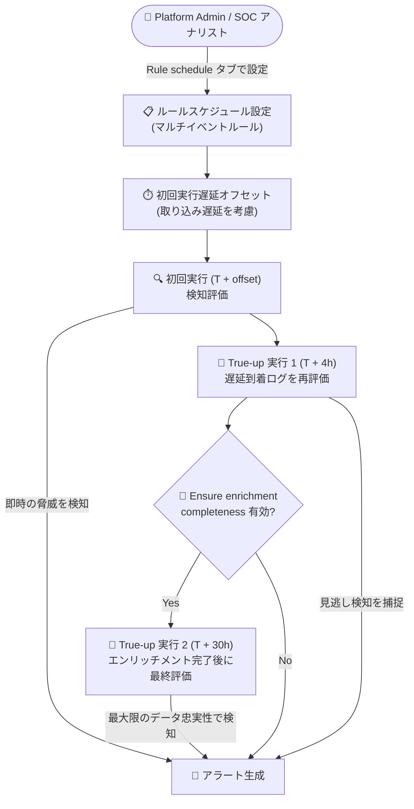

# Google SecOps: マルチイベントルールのカスタマイズ可能なスケジュール (Public Preview)

**リリース日**: 2026-07-26

**サービス**: Google SecOps (Google Security Operations)

**機能**: Customizable schedules for multi-event rules

**ステータス**: Public Preview

📊 [このアップデートのインフォグラフィックを見る](https://takech9203.github.io/google-cloud-news-summary/20260726-google-secops-multi-event-rule-schedules.html)

## 概要

Google SecOps において、マルチイベントルールの実行スケジュールをカスタマイズできる機能が Public Preview として提供されました。「Rule schedule」タブからルールの実行スケジュールをカスタマイズし、データ取り込み (Ingestion) の遅延を考慮した初回実行の遅延オフセット (first-run delay offset) を指定できるようになります。

さらに、システムは自動的なバックグラウンドの「True-up 実行」(再評価実行) を行い、遅れて到着したログの捕捉やメタデータのエンリッチメント処理を、手動でのシステム介入なしに実施します。これにより、検知評価タイミングの精密なコントロールが可能になり、検知漏れを防ぎつつ誤検知 (False Negative) を削減し、アラートの精度向上を実現します。

本機能は、SIEM の検知ルール運用を担う Platform Admin や SOC アナリスト、Security Engineer が主な対象です。ログソースごとに異なる取り込み遅延に合わせて検知タイミングを調整したい組織にとって重要なアップデートです。

**アップデート前の課題**

従来、マルチイベントルールの実行スケジュールはシステムがマッチウィンドウのサイズに基づいて自動的に決定しており、ユーザー側での調整手段が限られていました。

- ルールの実行頻度はマッチウィンドウにより自動決定され (1〜48 時間のウィンドウは 1 時間ごと、48 時間超は 24 時間ごと)、「10 分ごとに実行」「午前 2 時に実行」のようなカスタム間隔は設定できなかった
- ログソースの取り込み遅延 (Ingestion Latency) が大きい環境では、ルール評価時点でデータが揃っておらず、検知漏れ (False Negative) が発生する可能性があった
- 遅延到着ログやエンリッチメントデータを確実に評価に含めるための、ユーザーが制御可能な仕組みがなかった

**アップデート後の改善**

- 「Rule schedule」タブから、初回実行の遅延オフセットを指定し、データ取り込み遅延を考慮した検知評価タイミングを精密に制御できるようになった
- 遅延到着ログの捕捉とメタデータエンリッチメントの反映のため、システムが自動でバックグラウンドの True-up 実行を行い、手動介入が不要になった
- 「Adjust first run for late-arriving data」「Ensure enrichment completeness」のトグルにより、検知の速度とデータ完全性のトレードオフをルールごとに選択できるようになった

## アーキテクチャ図



ルールスケジュール設定で指定した遅延オフセット後に初回の検知評価が実行され、その後バックグラウンドの True-up 実行 (T + 4 時間、オプションで T + 30 時間) が同じ時間ウィンドウを再評価し、遅延到着ログとエンリッチメントデータを捕捉するフローです。

## サービスアップデートの詳細

### 主要機能

1. **初回実行の遅延オフセット (First run schedule)**
   - 「Rule schedule」タブの First run schedule フィールドで、ルールの実行頻度と初回実行までの遅延オフセットを指定可能
   - オフセットは、ログソースの取り込み遅延を考慮してデータが揃うのを待つためのバッファ期間として機能
   - 初回実行 (T + offset) は、即時の脅威をできるだけ早く検知することを目的とする

2. **遅延到着データへの対応 (Adjust first run for late-arriving data)**
   - 初回実行を遅延到着データに合わせて調整するトグル
   - オフセットがソースの実際の取り込み遅延より短い場合は初回実行でログを見逃す可能性があるため、オフセットを増やすか True-up 実行による最終検証に依存する形で補正する

3. **自動 True-up 実行 (バックグラウンド再評価)**
   - True-up 実行 1 (T + 4 時間): 初回実行の 4 時間後に同じウィンドウを再スキャンし、見逃したデータや遅延データを捕捉
   - True-up 実行 2 (T + 30 時間): 「Ensure enrichment completeness」トグルを有効にした場合のみ実行され、初回実行の 30 時間後にすべてのエンリッチメントデータの処理完了を待って最終スキャンを実施し、最大限のデータ忠実性を確保
   - 手動でのシステム介入なしに、遅延到着ログとエンリッチメントコンテキスト (アセット ID、ユーザーエイリアスなどのメタデータ) を検知に反映

4. **スケジュールプレビュー (Rule schedule preview)**
   - 設定画面上で初回実行・True-up 実行のタイムラインを事前に確認可能
   - バックグラウンド実行のマイルストーンを把握することで、MTTD (Mean Time to Detection) の正確な測定とアラートの整合性検証に活用できる

5. **検知タイプの識別**
   - Alerts ページや Rules Dashboard の Detection Type 列で、検知が初回実行・True-up 実行・レトロハントのいずれから生成されたかを識別可能

## 技術仕様

### スケジュール実行のタイムライン

| 実行ステージ | タイミング | 内容 |
|------|------|------|
| 初回実行 (First run) | T + offset | 指定した遅延オフセット後にルールロジックを実行。即時の脅威検知が目的 |
| True-up 実行 1 | T + 4 時間 | 初回実行の 4 時間後にウィンドウを再スキャンし、遅延到着データを捕捉。「Ensure enrichment completeness」有効時はエンリッチメントデータの処理完了も待機 |
| True-up 実行 2 | T + 30 時間 | 「Ensure enrichment completeness」有効時のみ実行。最終スキャンで最大限のデータ忠実性を確保 |

### 参考: デフォルトのスケジュール構成

| スケジュール | 割り当て基準 | 評価タイミング | True-up サイクル |
|------|------|------|------|
| リアルタイム (10 分) | 単一イベント、またはマッチウィンドウ < 1 時間 | 到着後すぐ | なし (遅延/エンリッチメントデータは標準実行で評価) |
| 毎時 (1 時間) | マッチウィンドウが 1〜48 時間 | 到着の 1〜2 時間後 | あり |
| 毎日 (24 時間) | マッチウィンドウ > 48 時間 | 到着の 24〜25 時間後 | あり |

### 必要な IAM 権限

| 権限 | 用途 |
|------|------|
| `chronicle.ruleDeployments.update` | API 経由での個別ルールスケジュールの更新 |
| `chronicle.rules.modifyRules` | Web UI およびバッチ API でのルールスケジュールの変更 |

事前定義ロールの **Chronicle API 管理者** (`roles/chronicle.admin`) と **Chronicle API 編集者** (`roles/chronicle.editor`) には、これらの権限が自動的に含まれます。カスタムロールを使用する場合は上記の権限を個別に付与する必要があります。

## 設定方法

### 前提条件

1. スケジュール変更に必要な IAM 権限 (`chronicle.ruleDeployments.update` または `chronicle.rules.modifyRules`) を保有していること
2. 対象がマルチイベントルールであること (単一イベントルールとキュレートルールは対象外)
3. レガシースケジュールからカスタマイズ可能スケジュールへの移行は一方向であり、元に戻せないことを理解しておくこと

### 手順

#### ステップ 1: Rule schedule タブを開く

1. Google SecOps で **Detection > Rules & Detections** に移動
2. **Rules Dashboard** をクリック
3. 対象ルールの **More (⋮)** メニューから **Run schedule** を選択

#### ステップ 2: スケジュールを構成する

1. **Rule schedule** タブで **First run schedule** フィールドの値 (実行頻度) を選択
2. **Adjust first run for late-arriving data** トグルを有効化 (オフセットがソースの実際の取り込み遅延より短い場合、初回実行でログを見逃す可能性があるため、必要に応じてオフセットを増やす)
3. 必要に応じて **Ensure enrichment completeness** トグルを有効化 (アラートがイベントのタイムスタンプより大幅に遅れて生成される可能性があるため、速度より正確性を重視するコンプライアンス用途向け)
4. **Rule schedule preview** で初回実行と True-up 実行のタイムラインを確認
5. **Save** をクリック

## メリット

### ビジネス面

- **アラート精度の向上**: 取り込み遅延に起因する検知漏れ (False Negative) を削減し、SOC のアラート品質と信頼性を向上
- **運用負荷の削減**: 遅延到着ログやエンリッチメント処理への対応が自動化され、手動でのシステム介入や再実行 (レトロハント) の運用負担が軽減
- **MTTD の可視化**: スケジュールプレビューにより検知マイルストーンを把握でき、Mean Time to Detection の正確な測定と SLA 管理が可能

### 技術面

- **検知タイミングの精密制御**: ログソースごとに異なる取り込み遅延特性に合わせて、初回実行の遅延オフセットをルール単位で調整可能
- **データ完全性の担保**: T + 4 時間、T + 30 時間の True-up 実行により、遅延到着ログとエンリッチメントコンテキスト (アセット ID、ユーザーエイリアスなど) を確実に評価に反映
- **速度と正確性のトレードオフ選択**: 即時性重視のルールとデータ忠実性重視のルールを、トグル設定で使い分け可能

## デメリット・制約事項

### 制限事項

- Pre-GA (Public Preview) 機能であり、Google Security Operations Service Specific Terms の Pre-GA Offerings Terms が適用される。サポートが限定的な場合があり、他の Pre-GA バージョンとの互換性がない変更が入る可能性がある
- カスタマイズ可能スケジュールはマルチイベントルールのみに適用され、単一イベントルールとキュレートルールは対象外
- マッチウィンドウが 48 時間を超えるルールは、実行頻度が Daily (毎日) に制限される
- レガシースケジュールからカスタマイズ可能スケジュールへの移行は一方向であり、移行後に元へ戻すことはできない

### 考慮すべき点

- 本機能を有効にすると、既存のマルチイベントルールのスケジュールはすべて「legacy」としてラベル付けされる
- 「Ensure enrichment completeness」を有効にすると、アラートがイベントのタイムスタンプより大幅に遅れて生成される可能性がある。速度より正確性が重要な非クリティカルなコンプライアンスルールでの利用が推奨される
- オフセットがログソースの実際の取り込み遅延より短い場合、初回実行でログを見逃す可能性がある。その場合はオフセットを増やすか、True-up 実行による最終検証に依存する

## ユースケース

### ユースケース 1: 取り込み遅延が大きいログソースでのブルートフォース検知

**シナリオ**: オンプレミスのファイアウォールログを転送しており、取り込みに 30 分以上の遅延がある環境で、短時間のブルートフォース攻撃をマルチイベントルールで検知したい。従来はルール評価時点でログが揃っておらず、検知漏れが発生するリスクがあった。

**実装例**:
```
1. Rules Dashboard で対象ルールの Run schedule を開く
2. First run schedule で実行頻度を選択し、
   取り込み遅延 (30 分以上) をカバーするオフセットを設定
3. Adjust first run for late-arriving data トグルを有効化
4. スケジュールプレビューで初回実行 (T + offset) と
   True-up 実行 1 (T + 4h) のタイムラインを確認して保存
```

**効果**: 初回実行時点でデータが揃った状態で評価され、さらに T + 4 時間の True-up 実行で遅延到着ログも捕捉されるため、検知漏れを削減できる。

### ユースケース 2: エンリッチメント完全性を重視するコンプライアンス検知

**シナリオ**: アセット ID やユーザーエイリアスなどのエンリッチメントデータに依存する監査・コンプライアンス系の検知ルールで、アラートの速度よりも正確性・データ忠実性を優先したい。

**効果**: 「Ensure enrichment completeness」トグルを有効にすることで、T + 30 時間の最終 True-up 実行がすべてのエンリッチメントデータの処理完了を待って評価を行い、最大限のデータ忠実性でアラートを生成できる。

## 料金

本機能自体の追加料金に関する記載はリリースノートにありません。Google SecOps はパッケージベースの料金体系であり、詳細は料金ページを参照してください。

- [Google Security Operations の料金](https://cloud.google.com/security/products/security-operations)

## 関連サービス・機能

- **YARA-L 2.0 ルール**: マルチイベントルールは YARA-L の `match` セクション (時間ウィンドウ) と `condition` セクションで定義され、マッチウィンドウのサイズがスケジュール割り当ての基準となる
- **Rules Dashboard / Alerts ページ**: Detection Type 列で検知が初回実行・True-up 実行・レトロハントのいずれ由来かを識別できる
- **Chronicle API (ruleDeployments)**: API 経由で個別ルールのスケジュールを更新でき、バッチ API による一括更新にも対応
- **IAM (カスタムロール)**: `chronicle.ruleDeployments.update` と `chronicle.rules.modifyRules` 権限により、スケジュール変更操作を細かく制御可能

## 参考リンク

- 📊 [インフォグラフィック](https://takech9203.github.io/google-cloud-news-summary/20260726-google-secops-multi-event-rule-schedules.html)
- [公式リリースノート](https://docs.cloud.google.com/release-notes#July_26_2026)
- [Configure customized schedules for rules](https://docs.cloud.google.com/chronicle/docs/detection/set-customized-schedule)
- [Understand rule run scheduling](https://docs.cloud.google.com/chronicle/docs/detection/run-frequency)
- [Rule execution frequency](https://docs.cloud.google.com/chronicle/docs/detection/rule-execution-frequency)

## まとめ

Google SecOps のマルチイベントルールにおいて、取り込み遅延を考慮した初回実行オフセットの指定と自動 True-up 実行が Public Preview として利用可能になり、検知タイミングの精密な制御と検知漏れの削減が実現しました。ログソースの取り込み遅延に起因する検知漏れに悩んでいる SOC チームは、まず遅延が大きいソースに依存するルールから本機能の適用を検討することを推奨します。ただし、レガシースケジュールからの移行は一方向で元に戻せない点に注意が必要です。

---

**タグ**: #GoogleSecOps #Chronicle #SIEM #DetectionEngineering #YARA-L #Security #Preview
