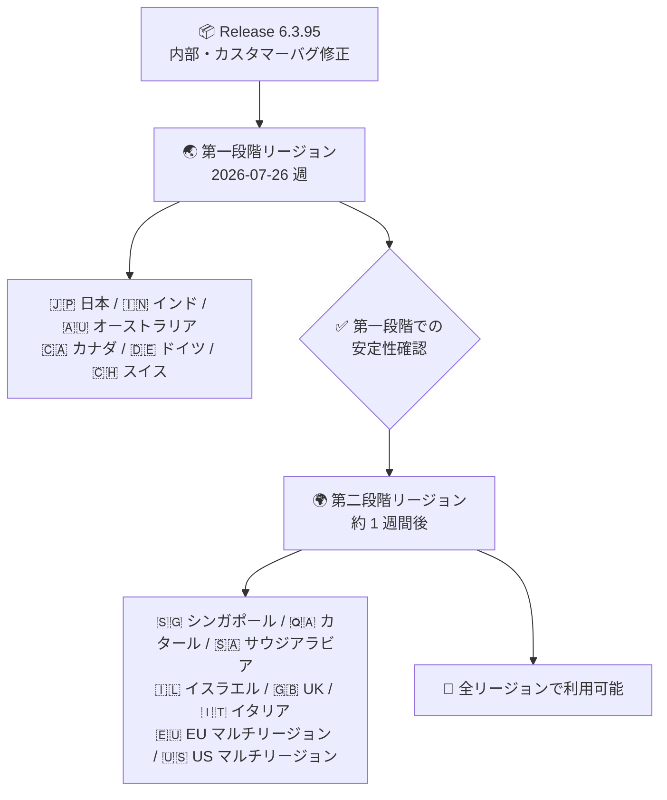

# Google SecOps SOAR: Release 6.3.95 第一段階リージョンへのロールアウト開始

**リリース日**: 2026-07-26

**サービス**: Google SecOps SOAR

**機能**: Release 6.3.95 ロールアウト (第一段階リージョン)

**ステータス**: Announcement

📊 [このアップデートのインフォグラフィックを見る](https://takech9203.github.io/google-cloud-news-summary/20260726-google-secops-soar-release-6-3-95.html)

## 概要

Google SecOps SOAR の Release 6.3.95 が、第一段階のリージョンへのロールアウトを開始しました。本リリースは、内部バグおよびカスタマー報告バグの修正を含むメンテナンスリリースです。新機能の追加はアナウンスされていません。

Google SecOps SOAR のリリースは、公式の[段階的リリースプラン](https://docs.cloud.google.com/chronicle/docs/soar/overview-and-introduction/soar-gradual-release)に基づき、通常 2 段階に分けて日曜日にロールアウトされます。第二段階のリージョンは、第一段階のリージョンの 1 週間後にアップグレードされます。前週の 2026 年 7 月 19 日には Release 6.3.94 の第一段階ロールアウトが開始されており、6.3.x 系のバグ修正リリースが週次ペースで継続的に提供されています。

本アップデートは、Google SecOps SOAR (スタンドアロン利用) および Google SecOps 内の SOAR コンポーネントを利用するすべての顧客が対象です。SOC 運用チームや MSSP は、自組織のリージョンがどの段階に属するかを把握し、アップグレードのタイミングを確認しておくことが推奨されます。

## アーキテクチャ図

Google SecOps SOAR の段階的リリースフローを示しています。第一段階リージョンでの展開後、約 1 週間で第二段階リージョンに展開され、全リージョンで利用可能になります。

## サービスアップデートの詳細

### 主要な内容

1. **バグ修正リリース**
   - 内部バグおよびカスタマー報告バグの修正が含まれる
   - 個別の修正内容 (バグ ID など) は本リリースノートでは公開されていない

2. **段階的リリース (Gradual Release)**
   - 第一段階リージョン: 日本、インド、オーストラリア、カナダ、ドイツ、スイス
   - 第二段階リージョン: シンガポール、カタール、サウジアラビア、イスラエル、UK (ロンドン)、イタリア、EU (マルチリージョン)、US (マルチリージョン)
   - ロールアウトは通常日曜日に実施され、第二段階は第一段階の 1 週間後にアップグレードされる

## 技術仕様

### リリース概要

| 項目 | 詳細 |
|------|------|
| リリースバージョン | 6.3.95 |
| リリースタイプ | バグ修正 (内部・カスタマー) |
| ロールアウト方式 | 2 段階の段階的リリース |
| 第一段階開始日 | 2026 年 7 月 26 日 |
| 第二段階 (全リージョン) | 通常、第一段階の約 1 週間後 |
| 前バージョン | 6.3.94 (2026 年 7 月 19 日に第一段階ロールアウト開始) |

## メリット

### ビジネス面

- **運用の安定性向上**: カスタマー報告バグの修正により、SOC 運用における既知の問題が解消される
- **リスクを抑えた展開**: 段階的リリースにより、問題発生時の影響範囲が限定され、全リージョン展開前に安定性が検証される

### 技術面

- **自動アップグレード**: SaaS 型プラットフォームのため、ユーザー側でのアップグレード作業は不要
- **週次の継続的な品質改善**: 6.3.x 系リリースが週次ペースで提供され、バグ修正が迅速に反映される

## デメリット・制約事項

### 考慮すべき点

- 個別のバグ修正内容 (対象機能や不具合 ID) は公開されていないため、特定の既知の問題が修正されたかを確認するにはサポートへの問い合わせが必要
- 第二段階リージョン (US、EU マルチリージョンなど) の環境では、反映まで約 1 週間の待機が必要
- 自組織のリージョンがどの段階に属するか不明な場合は、Google SecOps の担当者への確認が推奨される
- 公式のメンテナンスウィンドウは日曜日 11:00〜15:00 UTC であり、必ずしもサービス停止を伴うわけではないが、この時間帯の動作には留意する

## 利用可能リージョン

第一段階リージョン (本リリースの展開対象):

- 日本、インド、オーストラリア、カナダ、ドイツ、スイス

第二段階リージョン (約 1 週間後に展開予定):

- シンガポール、カタール、サウジアラビア、イスラエル、UK (ロンドン)、イタリア、EU (マルチリージョン)、US (マルチリージョン)

詳細は [Google SecOps リリースプラン](https://docs.cloud.google.com/chronicle/docs/soar/overview-and-introduction/soar-gradual-release)を参照してください。

## 関連サービス・機能

- **Google SecOps (SIEM)**: SOAR と統合されたセキュリティ運用プラットフォーム。SOAR はアラートのケース管理・プレイブック自動化を担う
- **Google SecOps SOAR ステータスダッシュボード**: [status.cloud.google.com/security](https://status.cloud.google.com/security/) で SOAR のサービスステータスを確認可能
- **Chronicle API**: SOAR のケース、プレイブック、インテグレーションなどをプログラムから操作する統合 API

## 参考リンク

- 📊 [インフォグラフィック](https://takech9203.github.io/google-cloud-news-summary/20260726-google-secops-soar-release-6-3-95.html)
- [公式リリースノート (Google Cloud)](https://docs.cloud.google.com/release-notes#July_26_2026)
- [Google SecOps SOAR リリースノート](https://docs.cloud.google.com/chronicle/docs/soar/release-notes)
- [Google SecOps リリースプラン (段階的リリース)](https://docs.cloud.google.com/chronicle/docs/soar/overview-and-introduction/soar-gradual-release)

## まとめ

Release 6.3.95 は内部・カスタマーバグ修正を含むメンテナンスリリースで、第一段階リージョン (日本を含む) から展開が開始されました。第二段階リージョンの利用者は約 1 週間後の展開を見込んでください。SaaS 型のため対応作業は不要ですが、既知の問題の解消状況を確認したい場合はリリースノートやサポートを通じてフォローすることを推奨します。

---

**タグ**: #GoogleSecOps #SOAR #リリース #バグ修正 #セキュリティ運用
