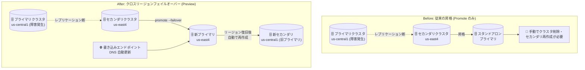

# AlloyDB for PostgreSQL: クロスリージョンフェイルオーバー (Preview)

**リリース日**: 2026-07-27

**サービス**: AlloyDB for PostgreSQL

**機能**: クロスリージョンフェイルオーバー (Cross-region failover)

**ステータス**: Preview

📊 [このアップデートのインフォグラフィックを見る](https://takech9203.github.io/google-cloud-news-summary/20260727-alloydb-cross-region-failover.html)

## 概要

AlloyDB for PostgreSQL がクロスリージョンフェイルオーバーを Preview でサポートしました。セカンダリクラスタをプライマリに昇格 (promote) する際にクロスリージョンフェイルオーバーをオプションで有効化すると、元のプライマリクラスタをセカンダリクラスタとして自動的に再作成し、レプリケーショントポロジを維持できます。従来必要だった手動でのクラスタ削除・再作成が不要になります。

これまで AlloyDB のクロスリージョンレプリケーション構成では、リージョン障害時にセカンダリクラスタを昇格させると、そのクラスタは独立したスタンドアロンのプライマリクラスタとなり、元のプライマリとのレプリケーション関係は解消されていました。障害復旧後にディザスタリカバリ (DR) 体制を再構築するには、元のプライマリクラスタを削除し、新しいプライマリからセカンダリクラスタを作り直す手作業が必要でした。

今回のアップデートは、リージョン障害からの復旧ワークフロー全体をオーケストレーションするもので、リージョン間 DR を運用するデータベース管理者や SRE チームにとって、復旧手順の簡素化と RTO 短縮に直結する重要な機能です。なお、本機能は単一プライマリクラスタ + 単一セカンダリクラスタのトポロジのみをサポートします。

**アップデート前の課題**

- セカンダリクラスタを昇格すると元のプライマリとのレプリケーション関係が解消され、昇格後のクラスタは独立したスタンドアロンクラスタになっていた
- 障害復旧後に DR 体制 (レプリケーショントポロジ) を復元するには、元のプライマリクラスタを手動で削除し、セカンダリクラスタを再作成する必要があった
- フェイルオーバー時に新旧プライマリの両方が書き込みを受け付けるスプリットブレインへの対処や、接続先の切り替えを利用者側で管理する必要があった

**アップデート後の改善**

- 昇格時に `--failover` オプションを指定するだけで、元のプライマリクラスタがセカンダリクラスタとして自動的に再作成され、レプリケーショントポロジが維持される
- 手動でのクラスタ削除・再作成が不要になり、DR 体制の復元が自動化された
- 書き込みエンドポイント (write endpoint) を利用している場合、フェイルオーバー時に DNS レコードが新プライマリへ自動更新され、スプリットブレインのリスクを低減できる
- 再作成前に元のプライマリのバックアップが自動取得され、レプリケーションラグにより未転送だったトランザクションを後から復旧できる

## アーキテクチャ図



従来はセカンダリの昇格後に手動でトポロジを再構築する必要がありましたが、クロスリージョンフェイルオーバーを有効にすると、元のプライマリがセカンダリとして自動再作成され、レプリケーショントポロジが維持されます。

## サービスアップデートの詳細

### 主要機能

1. **フェイルオーバーオーケストレーション (元プライマリの自動再作成)**
   - セカンダリクラスタの昇格時に `--failover` フラグを指定すると、元のプライマリクラスタがセカンダリクラスタとして自動的に再作成される
   - 昇格コマンド自体はセカンダリがプライマリに昇格した時点で完了し、元プライマリの再作成はプライマリリージョンが利用可能になった時点でバックグラウンドで実行される
   - 再作成中の元プライマリクラスタは `RECREATING` 状態として表示される

2. **書き込みエンドポイントとの連携によるスプリットブレイン対策**
   - クロスリージョンフェイルオーバーの実行時、書き込みエンドポイントの DNS レコードが昇格と同時に新プライマリクラスタを指すよう自動更新される
   - 新しい書き込みトラフィックが旧プライマリではなく新プライマリへ誘導され、新旧プライマリが同時に書き込みを受け付けるスプリットブレインのリスクを低減する
   - なお、書き込みエンドポイントのメタデータは、旧プライマリのリージョンが復旧するまで旧プライマリのアドレスを表示し続ける場合がある

3. **フェイルオーバー時の自動バックアップによるデータ復旧**
   - 元のプライマリをセカンダリとして再作成する前に、AlloyDB が元プライマリのバックアップを自動取得する
   - バックアップ取得前に元プライマリへの書き込みが停止されるため、スプリットブレインを防止できる
   - このバックアップを使って一時クラスタを作成し、レプリケーションラグによりセカンダリへ未転送だったトランザクションを手動で照合・復旧できる (新プライマリへの自動マージは行われない)

## 技術仕様

### クロスリージョンフェイルオーバーの仕様

| 項目 | 詳細 |
|------|------|
| ステータス | Preview |
| サポートトポロジ | 単一プライマリクラスタ + 単一セカンダリクラスタのみ |
| 有効化方法 | 昇格 (promote) 時にオプションで指定 (`--failover` フラグ) |
| 元プライマリの再作成タイミング | プライマリリージョンが利用可能になった時点でバックグラウンド実行 |
| 再作成中のクラスタ状態 | `RECREATING` |
| DNS 更新 | 書き込みエンドポイントの DNS レコードは昇格時に即時更新 |
| データ保全 | 再作成前に元プライマリのバックアップを自動取得 (通常の自動バックアップ・オンデマンドバックアップとは別) |

### 昇格 (Promote) とスイッチオーバー (Switchover) の使い分け

| 操作 | 用途 | データ損失 | 前提 |
|------|------|-----------|------|
| Promote (+ 失敗オーバー) | プライマリリージョンの障害時の DR | レプリケーションラグ分の損失の可能性あり | プライマリリージョンが利用不可でも実行可能 |
| Switchover | 計画的な移行・DR 訓練 | ゼロデータロス (RPO 0) | プライマリ・セカンダリ両リージョンが正常であること |

計画的なリージョン移行やゼロデータロスでのロール入れ替えにはスイッチオーバーを使用し、クロスリージョンフェイルオーバーは実際のリージョン障害時の復旧に使用します。

## 設定方法

### 前提条件

1. AlloyDB のクロスリージョンレプリケーション構成 (プライマリクラスタ 1 つ + セカンダリクラスタ 1 つ) が作成済みであること
2. スプリットブレイン対策として、クライアントの接続管理に書き込みエンドポイントの利用が推奨される

### 手順

#### ステップ 1: 通常の昇格 (フェイルオーバーなし)

```bash
gcloud alloydb clusters promote SECONDARY_CLUSTER_ID \
  --region=REGION_ID \
  --project=PROJECT_ID
```

デフォルトの昇格では、セカンダリクラスタはスタンドアロンのプライマリクラスタになります。

#### ステップ 2: フェイルオーバーオーケストレーション付きの昇格 (Preview)

```bash
gcloud alloydb alpha clusters promote SECONDARY_CLUSTER_ID \
  --region=REGION_ID \
  --project=PROJECT_ID \
  --failover
```

`--failover` フラグを追加すると、元のプライマリがセカンダリとして自動的に再作成され、関連するエンドポイントが新プライマリクラスタへトラフィックをルーティングするよう更新されます。コマンドはセカンダリの昇格完了時点で終了し、元プライマリの再作成はリージョン復旧後にバックグラウンドで行われます。

- `SECONDARY_CLUSTER_ID`: 昇格するセカンダリクラスタの ID
- `REGION_ID`: セカンダリクラスタのリージョン (例: `us-central1`)
- `PROJECT_ID`: セカンダリクラスタのプロジェクト ID

Google Cloud コンソールからも、Clusters ページでセカンダリクラスタを選択し「Promote cluster」から昇格を実行できます。

## メリット

### ビジネス面

- **DR 運用コストの削減**: 障害復旧後のレプリケーショントポロジ再構築が自動化され、手動オペレーションに伴う工数と人的ミスのリスクを削減できる
- **事業継続性の向上**: フェイルオーバー後すみやかに DR 体制が復元されるため、二次障害への耐性が早期に回復し、コンプライアンス要件 (DR 体制の維持) を満たしやすくなる

### 技術面

- **復旧手順の簡素化**: `--failover` フラグ 1 つで昇格から元プライマリの再作成、エンドポイント更新までがオーケストレーションされる
- **スプリットブレイン対策の組み込み**: 書き込みエンドポイントの DNS 自動更新と、再作成前の書き込み停止 + 自動バックアップにより、データ不整合のリスクを低減できる
- **未転送データの救済手段**: フェイルオーバー時の自動バックアップから一時クラスタを作成し、ラグにより失われたトランザクションを照合・復旧できる

## デメリット・制約事項

### 制限事項

- Preview 段階の機能であり、本番環境での利用には注意が必要
- 単一プライマリクラスタ + 単一セカンダリクラスタのトポロジのみサポート (複数セカンダリ構成では利用不可)
- フェイルオーバー付き昇格には `gcloud alloydb alpha` コマンドの使用が必要
- 自動バックアップに含まれる未転送トランザクションは新プライマリへ自動マージされず、手動での照合・復旧が必要

### 考慮すべき点

- フェイルオーバー開始直後は新旧プライマリの両方が書き込みを受け付ける短い期間が発生し得るため、書き込みエンドポイントによる接続管理が推奨される。旧プライマリに接続し続けたクライアントの書き込みは、旧プライマリがセカンダリとして再作成される際に失われる
- 書き込みエンドポイントのメタデータ更新は、旧プライマリリージョンが復旧するまで遅延する場合がある (DNS レコード自体は即時更新)
- 元プライマリの再作成はプライマリリージョンが利用可能になるまで開始されないため、それまでは単一リージョン構成で稼働することになる
- ゼロデータロスが必要な計画的移行や DR 訓練にはフェイルオーバーではなくスイッチオーバーを使用する

## ユースケース

### ユースケース 1: リージョン障害時のディザスタリカバリと DR 体制の自動復元

**シナリオ**: `us-central1` のプライマリクラスタがリージョン障害で利用不可になった。`us-east4` のセカンダリクラスタを昇格させてサービスを継続しつつ、障害復旧後の DR 体制も自動で復元したい。

**実装例**:
```bash
gcloud alloydb alpha clusters promote dr-secondary-cluster \
  --region=us-east4 \
  --project=my-project \
  --failover
```

**効果**: セカンダリが新プライマリに昇格してサービスを即時再開できる。`us-central1` の復旧後、旧プライマリがセカンダリとして自動再作成され、手作業なしにクロスリージョン DR 体制が復元される。書き込みエンドポイントを使用していれば、アプリケーションの接続先変更も DNS 更新により自動化される。

### ユースケース 2: ラグにより未転送だったトランザクションの復旧

**シナリオ**: フェイルオーバー時に非同期レプリケーションのラグがあり、一部のトランザクションがセカンダリに転送されていなかった。監査要件のため、失われた可能性のあるデータを確認・復旧したい。

**効果**: フェイルオーバーオーケストレーションの一環として自動取得された旧プライマリのバックアップから一時クラスタを作成し、新プライマリとの差分を照合して欠損データを手動で復旧できる。

## 料金

クロスリージョンフェイルオーバー機能自体の追加料金に関する公式情報は、リリースノートおよびドキュメントでは確認できませんでした。クロスリージョンレプリケーション構成では、セカンダリクラスタのコンピュート・ストレージおよびリージョン間のデータ転送に対して通常の AlloyDB 料金が適用されます。詳細は料金ページを参照してください。

- [AlloyDB for PostgreSQL 料金](https://cloud.google.com/alloydb/pricing)

## 利用可能リージョン

リージョン制限に関する記載はリリースノートでは確認できませんでした。クロスリージョンレプリケーションは AlloyDB が利用可能なリージョン間で構成できます。詳細は [AlloyDB のロケーション](https://cloud.google.com/alloydb/docs/locations) を参照してください。

## 関連サービス・機能

- **AlloyDB クロスリージョンレプリケーション**: 本機能の基盤。プライマリクラスタから最大 5 つのセカンダリクラスタへ非同期レプリケーションを構成できる (フェイルオーバーは 1 対 1 構成のみ対応)
- **AlloyDB スイッチオーバー**: ゼロデータロスでプライマリとセカンダリのロールを入れ替える機能。計画的移行や DR 訓練に使用し、障害時のフェイルオーバーと使い分ける
- **AlloyDB 書き込みエンドポイント**: フェイルオーバー時に DNS が新プライマリへ自動更新される接続エンドポイント。スプリットブレイン対策として利用が推奨される
- **AlloyDB 自動バックアップ / 継続バックアップ**: フェイルオーバー時の自動バックアップは通常のバックアップとは別に作成され、未転送トランザクションの復旧に使用できる
- **Cloud SQL for PostgreSQL**: 同様のリージョン間 DR 構成 (クロスリージョンレプリカ) を提供する代替マネージド PostgreSQL サービス

## 参考リンク

- 📊 [インフォグラフィック](https://takech9203.github.io/google-cloud-news-summary/20260727-alloydb-cross-region-failover.html)
- [公式リリースノート](https://docs.cloud.google.com/release-notes#July_27_2026)
- [クロスリージョンレプリケーションについて](https://docs.cloud.google.com/alloydb/docs/cross-region-replication/about-cross-region-replication)
- [クロスリージョンレプリケーションの操作](https://docs.cloud.google.com/alloydb/docs/cross-region-replication/work-with-cross-region-replication)
- [料金ページ](https://cloud.google.com/alloydb/pricing)

## まとめ

AlloyDB のクロスリージョンフェイルオーバー (Preview) により、リージョン障害時のセカンダリ昇格後に必要だった手動のトポロジ再構築が自動化され、DR 運用が大幅に簡素化されました。1 対 1 のクロスリージョンレプリケーション構成を運用しているチームは、書き込みエンドポイントの導入とあわせて本機能を検証し、DR ランブックへの組み込みを検討することを推奨します。

---

**タグ**: AlloyDB, PostgreSQL, ディザスタリカバリ, クロスリージョンレプリケーション, フェイルオーバー, 高可用性, Preview
