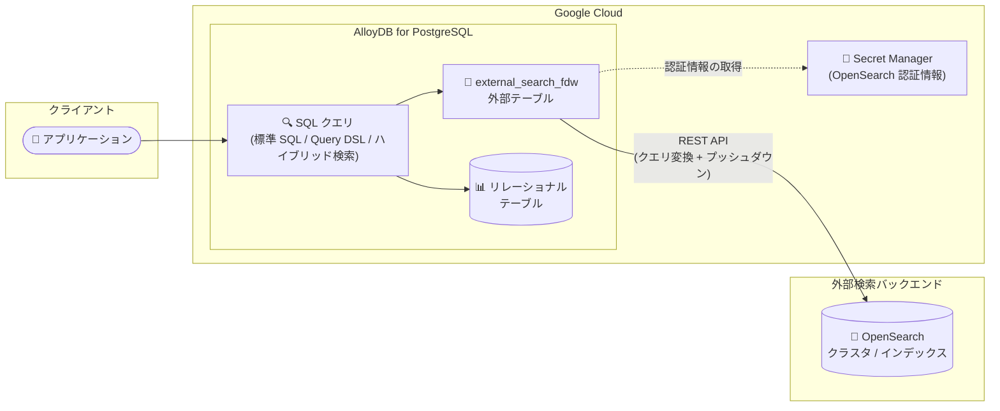

# AlloyDB for PostgreSQL: 外部検索 (External Search) が OpenSearch をサポート (Preview)

**リリース日**: 2026-07-27

**サービス**: AlloyDB for PostgreSQL

**機能**: 外部検索 (external_search_fdw 拡張) による OpenSearch 連携

**ステータス**: Preview

📊 [このアップデートのインフォグラフィックを見る](https://takech9203.github.io/google-cloud-news-summary/20260727-alloydb-opensearch-external-search.html)

## 概要

AlloyDB for PostgreSQL の外部検索 (External Search) 機能が、新たに OpenSearch をサポートしました (Preview)。`external_search_fdw` 拡張を使用して OpenSearch クラスタに接続し、OpenSearch のインデックスに格納されたデータを AlloyDB のデータベースから直接 SQL で検索できるようになります。

`external_search_fdw` は PostgreSQL の Foreign Data Wrapper (FDW) の仕組みを利用した、外部検索バックエンドへの読み取り専用の統合機能です。OpenSearch のインデックスを PostgreSQL の外部テーブル (Foreign Table) としてマッピングすることで、データを移動・コピーすることなく、AlloyDB のリレーショナルテーブルと OpenSearch のインデックスを JOIN して利用できます。標準 SQL (Lucene 構文の検索式)、OpenSearch の Query DSL、さらに AlloyDB のベクトル検索と組み合わせたハイブリッド検索 (`ai.hybrid_search` 関数、RRF によるランク融合) にも対応しています。

運用データベースとして AlloyDB を使用しつつ、全文検索や高度な検索機能に OpenSearch を利用している組織にとって、2 つのシステム間のデータ統合をアプリケーション側で実装する必要がなくなる重要なアップデートです。なお、`external_search_fdw` 拡張はすでに Elasticsearch (2026 年 4 月に Preview 公開) や Solr にも対応しており、今回の OpenSearch 対応で主要な検索エンジンへの接続が揃った形になります。

**アップデート前の課題**

- AlloyDB のリレーショナルデータと OpenSearch のインデックスデータを組み合わせるには、アプリケーション側で 2 つのシステムに個別にクエリを発行し、結果をマージする実装が必要だった
- OpenSearch のデータを SQL で分析するには、ETL パイプラインなどでデータを AlloyDB 側へコピー・同期する必要があり、データの重複や鮮度の問題が発生していた
- AlloyDB のベクトル検索と OpenSearch のトークンベース全文検索を組み合わせたハイブリッド検索を、データベース内で完結して実行する手段がなかった

**アップデート後の改善**

- `external_search_fdw` 拡張により、OpenSearch のインデックスを外部テーブルとしてマッピングし、AlloyDB から直接 SQL で検索できるようになった
- データの移動・コピーなしに、OpenSearch のインデックスと AlloyDB のテーブルを JOIN できるようになった
- `ai.hybrid_search` 関数を使い、OpenSearch のトークン検索結果と AlloyDB のベクトル検索結果を Reciprocal Rank Fusion (RRF) で融合するハイブリッド検索がデータベース内で実行可能になった

## アーキテクチャ図



AlloyDB は SQL クエリを OpenSearch の REST API クエリに変換して外部クラスタに送信し、結果を外部テーブルとして返します。認証情報は Secret Manager で安全に管理され、OpenSearch のインデックスと AlloyDB のテーブルをデータ移動なしで JOIN できます。

## サービスアップデートの詳細

### 主要機能

1. **OpenSearch インデックスの外部テーブルマッピング**
   - `CREATE SERVER` で OpenSearch クラスタを外部データサーバーとして登録し、`CREATE FOREIGN TABLE` でインデックスのスキーマを PostgreSQL の外部テーブルにマッピング
   - データを移動・コピーすることなく、AlloyDB のリレーショナルテーブルと OpenSearch のインデックスを JOIN 可能
   - 読み取り専用 (read-only) のシャロー統合として提供

2. **3 種類のクエリ方式**
   - **標準 SQL**: Lucene 構文の検索式を `ORDER BY metadata <@> 'QUERY'` の形式で指定 (例: `body:database`)
   - **Query DSL**: OpenSearch の JSON 形式 Query DSL をそのまま利用可能 (query、filter、sort 式に対応)
   - **ハイブリッド検索**: `ai.hybrid_search` 関数で OpenSearch のトークン検索と AlloyDB のベクトル検索を RRF (Reciprocal Rank Fusion) で融合

3. **Secret Manager による認証情報管理**
   - OpenSearch の認証情報 (Basic 認証) を Secret Manager に格納し、`secret_path` オプションで参照
   - AlloyDB サービスアカウントに Secret Manager Secret Accessor ロール (`roles/secretmanager.secretAccessor`) を付与して利用

4. **クエリプッシュダウンによる効率化**
   - SELECT フィールド、WHERE フィルタ、ORDER BY ソート、LIMIT を OpenSearch への API 呼び出しに直接プッシュダウンし、転送データ量と処理を最適化

## 技術仕様

### サポートされるデータ型マッピング

| OpenSearch のデータ型 | AlloyDB (PostgreSQL) 型 |
|------|------|
| alias | 参照先フィールドの PostgreSQL 型 |
| binary | bytea |
| boolean | BOOLEAN |
| byte, short | SMALLINT |
| date | TIMESTAMPTZ |
| double, scaled_float | DOUBLE PRECISION |
| float, half_float | REAL |
| integer | INTEGER |
| long | BIGINT |
| object, flattened | jsonb |
| text, keyword, constant_keyword, wildcard | TEXT |
| unsigned_long | NUMERIC |

### 外部サーバー定義のオプション

| オプション | 説明 |
|------|------|
| server | OpenSearch クラスタの公開エンドポイント URL |
| search_provider | `opensearch` を指定 |
| auth_mode | `secret_manager` (Secret Manager 経由の認証) |
| auth_method | `Basic` (Basic 認証) |
| secret_path | Secret Manager のシークレットパス |

## 設定方法

### 前提条件

1. AlloyDB クラスタを作成済みであること
2. プライマリ AlloyDB インスタンスでアウトバウンド接続 (outbound connectivity) を有効化していること
3. パブリックにアクセス可能なエンドポイントを持つ OpenSearch クラスタを構成済みであること
4. OpenSearch クラスタでセキュリティプラグインを有効化し、内部ユーザーデータベースに読み取り専用ユーザーを作成していること
5. OpenSearch の認証情報を Secret Manager に格納し、AlloyDB サービスアカウントに `roles/secretmanager.secretAccessor` を付与していること

### 手順

#### ステップ 1: 拡張機能の有効化と外部サーバーの作成

```sql
CREATE EXTENSION external_search_fdw;

CREATE SERVER opensearch_server
FOREIGN DATA WRAPPER external_search_fdw
OPTIONS (
    server 'OPENSEARCH_SERVER_HOST_PORT',
    search_provider 'opensearch',
    auth_mode 'secret_manager',
    auth_method 'Basic',
    secret_path 'projects/123456789012/secrets/opensearch-credentials/versions/1'
);
```

OpenSearch クラスタのエンドポイントと Secret Manager のシークレットパスを指定して、外部データサーバーを作成します。

#### ステップ 2: ユーザーマッピングと外部テーブルの作成

```sql
CREATE USER MAPPING FOR CURRENT_USER SERVER opensearch_server;

CREATE FOREIGN TABLE my_fd_opensearch_table(
    metadata external_search_fdw_schema.OpaqueMetadata,
    id BIGINT,
    body TEXT
)
SERVER opensearch_server
OPTIONS (
    remote_table_name 'my-opensearch-index'
);
```

PostgreSQL の FDW に必須のユーザーマッピングを定義した後、OpenSearch インデックスのスキーマを外部テーブルにマッピングします。

#### ステップ 3: クエリの実行

```sql
-- 標準 SQL + Lucene 構文
SELECT id, body
FROM my_fd_opensearch_table
ORDER BY metadata <@> 'body:database';

-- ハイブリッド検索 (OpenSearch トークン検索 + AlloyDB ベクトル検索)
SELECT *
FROM ai.hybrid_search(
  ARRAY[
    '{"limit": 10,
      "weight": 0.5,
      "table_name": "my_fd_opensearch_table",
      "key_column": "id",
      "query_text_input": "body:\"cloud databases\""}'::jsonb
  ])
ORDER BY score DESC;
```

## メリット

### ビジネス面

- **データ統合コストの削減**: AlloyDB と OpenSearch の間で ETL パイプラインやアプリケーション側のマージ処理を構築・維持する必要がなくなる
- **既存資産の活用**: OpenSearch に蓄積済みの検索インデックスをそのまま活用しながら、AlloyDB のリレーショナルデータと組み合わせた分析・検索が可能

### 技術面

- **データ移動なしの JOIN**: OpenSearch インデックスを外部テーブルとして扱い、AlloyDB のテーブルと直接 JOIN できるため、データの重複や同期遅延が発生しない
- **ハイブリッド検索**: OpenSearch のトークンベース全文検索と AlloyDB のベクトル検索を RRF で融合し、セマンティック検索とキーワード検索の長所を両立
- **クエリプッシュダウン**: SELECT / WHERE / ORDER BY / LIMIT を OpenSearch 側にプッシュダウンして効率的に実行

## デメリット・制約事項

### 制限事項

- Preview 段階の機能であり、Pre-GA Offerings Terms が適用される (サポートが限定される可能性あり)
- 読み取り専用 (read-only) の統合であり、AlloyDB から OpenSearch のデータを更新することはできない
- OpenSearch クラスタにはパブリックにアクセス可能なエンドポイントが必要
- 認証は Secret Manager 経由の Basic 認証を使用する

### 考慮すべき点

- AlloyDB インスタンスでアウトバウンド接続の有効化が必要
- クエリの形によってはプッシュダウンできない要素があり (複数フィールドを比較する式や関数を含む式など)、その場合は AlloyDB 側での後処理となるためパフォーマンスに注意が必要
- OpenSearch 側にセキュリティプラグインの有効化と読み取り専用ユーザーの作成が必要

## ユースケース

### ユースケース 1: 運用データと検索インデックスの横断分析

**シナリオ**: EC サイトで注文・在庫データを AlloyDB に、商品カタログの全文検索インデックスを OpenSearch に保持している。商品検索結果に在庫状況や販売実績を組み合わせて表示したい。

**実装例**:
```sql
SELECT p.id, p.title, o.stock_count
FROM my_fd_opensearch_table p
JOIN inventory o ON o.product_id = p.id
ORDER BY p.metadata <@> 'title:wireless earphone'
LIMIT 20;
```

**効果**: アプリケーション側での 2 システムへのクエリ発行と結果マージが不要になり、1 つの SQL で検索と在庫参照を完結できる。

### ユースケース 2: RAG 向けハイブリッド検索

**シナリオ**: 生成 AI アプリケーションの検索拡張生成 (RAG) で、AlloyDB のベクトル検索 (セマンティック検索) と OpenSearch のキーワード検索を組み合わせて検索精度を高めたい。

**効果**: `ai.hybrid_search` 関数により、ベクトル検索とトークン検索の結果を RRF で融合した高精度な検索結果をデータベース内で取得でき、RAG パイプラインの構成をシンプルにできる。

## 料金

`external_search_fdw` 拡張自体に追加料金の記載はありません。AlloyDB の通常料金 (vCPU・メモリ、ストレージ、ネットワーク) と、接続先 OpenSearch クラスタの運用コスト、Secret Manager の利用料金が適用されます。

詳細は [AlloyDB 料金ページ](https://cloud.google.com/alloydb/pricing) を参照してください。

## 関連サービス・機能

- **Secret Manager**: OpenSearch クラスタの認証情報を安全に格納し、AlloyDB が実行時に参照する
- **AlloyDB AI (ベクトル検索 / ai.hybrid_search)**: OpenSearch のトークン検索と AlloyDB のベクトル検索を融合するハイブリッド検索を提供
- **Elasticsearch / Solr 外部検索**: 同じ `external_search_fdw` 拡張で Elasticsearch (2026 年 4 月 Preview) と Solr にも接続可能
- **BigQuery FDW (bigquery_fdw)**: 同様に FDW ベースで BigQuery のデータを AlloyDB からリアルタイムに参照できる Preview 機能

## 参考リンク

- 📊 [インフォグラフィック](https://takech9203.github.io/google-cloud-news-summary/20260727-alloydb-opensearch-external-search.html)
- [公式リリースノート](https://docs.cloud.google.com/release-notes#July_27_2026)
- [ドキュメント: Access OpenSearch data from AlloyDB](https://docs.cloud.google.com/alloydb/docs/opensearch)
- [ドキュメント: AlloyDB 拡張機能一覧 (external_search_fdw)](https://docs.cloud.google.com/alloydb/docs/reference/extensions#external_search_fdw)
- [料金ページ](https://cloud.google.com/alloydb/pricing)

## まとめ

AlloyDB の外部検索が OpenSearch に対応したことで、Elasticsearch・Solr と合わせて主要な検索エンジンを AlloyDB から SQL で直接検索できる体制が整いました。運用データベースと検索エンジンを併用している場合、ETL やアプリケーション側の統合処理を削減できる可能性があるため、Preview 段階のうちに接続性 (パブリックエンドポイント、アウトバウンド接続) とクエリプッシュダウンの挙動を検証しておくことをおすすめします。

---

**タグ**: #AlloyDB #PostgreSQL #OpenSearch #FDW #外部検索 #ハイブリッド検索 #Preview
