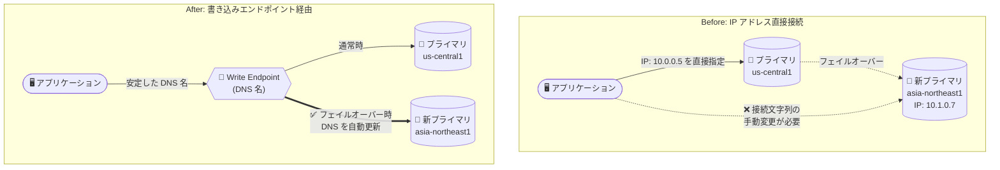

# AlloyDB for PostgreSQL: 書き込みエンドポイント (Write Endpoints) が Preview で利用可能に

**リリース日**: 2026-07-27

**サービス**: AlloyDB for PostgreSQL

**機能**: 書き込みエンドポイント (Write Endpoints)

**ステータス**: Preview

📊 [このアップデートのインフォグラフィックを見る](https://takech9203.github.io/google-cloud-news-summary/20260727-alloydb-write-endpoints.html)

## 概要

AlloyDB for PostgreSQL の書き込みエンドポイント (Write Endpoints) が Preview で利用可能になりました。エンドポイントは、アプリケーションが AlloyDB インスタンスに接続するために使用できる安定した DNS 名を提供する AlloyDB リソースです。これにより、アプリケーションをインスタンスの特定の IP アドレスや URI から切り離す (デカップリングする) ことができます。

書き込みエンドポイントは単一の AlloyDB プライマリインスタンスにトラフィックを振り向け、読み取り・書き込みの両方のトラフィックを処理します。災害復旧 (DR) のスイッチオーバーやクロスリージョンフェイルオーバーの際、AlloyDB はエンドポイントの DNS レコードを新しいプライマリインスタンスに自動的に更新します。アプリケーションは同じ DNS 名で再接続できるため、接続文字列の手動再設定が不要になり、目標復旧時間 (RTO) の短縮につながります。

このアップデートは、AlloyDB でクロスリージョンレプリケーションを利用して DR 構成を組んでいるユーザーや、バックアップ復元・移行時のアプリケーション側の接続変更を最小化したいユーザーに特に有用です。なお、同日に発表されたクロスリージョンフェイルオーバーの自動化 (Preview) と組み合わせることで、DR 運用全体の自動化を強化できます。

**アップデート前の課題**

- アプリケーションはインスタンスの IP アドレス (または URI) を直接指定して接続する必要があり、インスタンスと密結合になっていた
- スイッチオーバーやクロスリージョンフェイルオーバーでセカンダリクラスタが新しいプライマリに昇格すると、アプリケーション側で接続文字列を手動で再設定する必要があり、復旧時間 (RTO) が長くなる要因となっていた
- バックアップからの復元では新しい IP アドレスを持つ新規インスタンスが作成されるため、アプリケーションの設定変更が必要だった

**アップデート後の改善**

- 安定した DNS 名を通じて接続することで、アプリケーションをインスタンスの IP アドレスから切り離せるようになった
- スイッチオーバーやクロスリージョンフェイルオーバー時に、AlloyDB がエンドポイントの DNS レコードを新しいプライマリインスタンスへ自動更新するため、手動での再設定なしに同じ DNS 名で再接続できるようになった
- バックアップ復元や移行の際も、エンドポイントの参照先を新しいインスタンスに切り替えるだけで、アプリケーションの設定変更なしに運用を再開できるようになった
- クロスリージョンフェイルオーバー時に、新しい書き込みトラフィックを自動的に新プライマリへ誘導することで、旧プライマリへの書き込み競合 (スプリットブレイン) の防止に役立つようになった

## アーキテクチャ図



従来はアプリケーションがインスタンスの IP を直接参照していたため、フェイルオーバー後に接続文字列の手動変更が必要でした。書き込みエンドポイント導入後は、AlloyDB が DNS レコードを新プライマリへ自動更新するため、アプリケーションは同じ DNS 名のまま再接続できます。

## サービスアップデートの詳細

### 主要機能

1. **安定した DNS 名による接続の抽象化**
   - エンドポイントは、アプリケーションが AlloyDB インスタンスへの接続に使用できる安定した DNS 名を提供する
   - アプリケーションをインスタンス固有の IP アドレスや URI から切り離すことで、DR、バックアップ復元、移行などの運用イベント時の接続管理を簡素化する
   - DNS 名はグローバルに解決可能だが、エンドポイントリソース自体はリージョナルリソース。ただし各エンドポイントはグローバルにインスタンスへリンクできる

2. **スイッチオーバー / クロスリージョンフェイルオーバー時の自動 DNS 更新**
   - セカンダリクラスタが新しいプライマリクラスタに昇格すると、エンドポイントは DNS レコードを新プライマリインスタンスへ自動更新する
   - アプリケーション接続文字列の手動再構成が不要になり、運用の複雑さを軽減し、ダウンタイムを最小化して RTO の達成に貢献する
   - DNS 伝播完了後、アプリケーションは同じエンドポイント DNS 名で新プライマリに再接続できる

3. **スプリットブレイン (書き込み競合) の防止**
   - クロスリージョンフェイルオーバー時に、新しい書き込みトラフィックを旧プライマリクラスタから自動的に引き離し、新プライマリへ誘導することで、書き込みの競合防止に役立つ
   - 注意: 旧プライマリのリージョンが利用不能な場合、エンドポイントのメタデータ更新に遅延が生じ、DNS レコードが更新済みでも `effective_target_instances` などのフィールドが一時的に旧プライマリを表示することがある

4. **バックアップ復元・移行時の接続切り替え**
   - バックアップから復元すると新しい IP アドレスを持つ新規インスタンスが作成されるが、エンドポイントの参照先を復元後のインスタンスへ更新するだけで、アプリケーションは設定変更なしに運用を再開できる
   - 移行時も、ソースデータベースから AlloyDB インスタンスへ最小限のアプリケーション中断でエンドポイントを切り替えられる

## 技術仕様

### エンドポイントの仕様

| 項目 | 詳細 |
|------|------|
| エンドポイントタイプ | `WRITE_ENDPOINT` のみサポート |
| ターゲットインスタンス | 単一の `PRIMARY` インスタンスのみ (1 エンドポイントにつき 1 ターゲット) |
| 処理可能なトラフィック | 読み取りと書き込みの両方 |
| リソーススコープ | エンドポイントリソースはリージョナル。DNS 名はグローバルに解決可能で、リンク先インスタンスはグローバルに指定可能 |
| 管理操作 | 作成 / 更新 / 削除 / 一覧 / 詳細表示 (Google Cloud コンソールまたは gcloud CLI) |

### 必要な IAM 権限

エンドポイントの管理には、AlloyDB 管理者 (`roles/alloydb.admin`) ロール、または以下の権限を含むロールが必要です。

- `alloydb.endpoints.create`
- `alloydb.endpoints.update`
- `alloydb.endpoints.get`
- `alloydb.endpoints.list`
- `alloydb.endpoints.delete`

## 設定方法

### 前提条件

1. Google Cloud CLI がインストール・初期化されていること
2. Cloud DNS API が有効化されていること
3. エンドポイントのターゲットとなる既存の AlloyDB インスタンス (プライマリ) が存在すること
4. `roles/alloydb.admin` などエンドポイント管理権限を持つ IAM ロールが付与されていること

### 手順

#### ステップ 1: 書き込みエンドポイントの作成

```bash
gcloud beta alloydb endpoints create ENDPOINT_ID \
  --project=PROJECT_ID \
  --region=REGION_ID \
  --endpoint-type=WRITE_ENDPOINT \
  --target-instances=projects/PROJECT_ID/locations/REGION_ID/clusters/CLUSTER_ID/instances/INSTANCE_ID
```

`WRITE_ENDPOINT` はターゲットインスタンスを 1 つのみ指定でき、そのインスタンスは `PRIMARY` タイプである必要があります。Google Cloud コンソールの「エンドポイント」ページからも作成できます。

#### ステップ 2: DNS 名を取得してアプリケーションから接続

Google Cloud コンソールの「エンドポイント」ページで対象エンドポイントの「DNS 名」列の値をコピーするか、gcloud CLI (`gcloud beta alloydb endpoints describe`) で DNS 名を確認し、アプリケーションの接続文字列のホスト名として使用します。

#### ステップ 3: (必要に応じて) エンドポイントの参照先を更新

```bash
gcloud beta alloydb endpoints update ENDPOINT_ID \
  --region=REGION_ID \
  --target-instances=projects/PROJECT_ID/locations/REGION_ID/clusters/CLUSTER_ID/instances/NEW_INSTANCE_ID
```

バックアップ復元後の新インスタンスへの切り替えなど、参照先を手動で変更する場合に使用します。スイッチオーバーやクロスリージョンフェイルオーバー時は AlloyDB が自動的に更新するため、手動操作は不要です。

## メリット

### ビジネス面

- **RTO の短縮**: DR イベント時にアプリケーション側の接続再設定が不要になり、復旧時間の短縮と事業継続性の向上につながる
- **運用負荷の削減**: フェイルオーバー・復元・移行のたびに発生していた接続文字列変更の作業やデプロイが不要になり、運用ミスのリスクも低減する

### 技術面

- **疎結合なアーキテクチャ**: アプリケーションとデータベースインスタンスの IP アドレスが分離され、インフラ変更がアプリケーション構成に波及しない
- **スプリットブレイン防止**: クロスリージョンフェイルオーバー時に書き込みトラフィックを新プライマリへ自動誘導し、旧プライマリへの書き込み競合を防止する
- **グローバルな名前解決**: DNS 名は任意のロケーションから解決可能で、リージョンをまたぐ DR 構成でも同一の接続先名を維持できる

## デメリット・制約事項

### 制限事項

- Private Service Access (PSA) を使用するよう構成されたインスタンスのみサポート。Private Service Connect (PSC) を使用するインスタンスはサポートされない
- AlloyDB Language Connectors および AlloyDB Auth Proxy は書き込みエンドポイントに対応していない
- 同一ターゲットインスタンスを指すエンドポイントへの同時変更操作 (同時更新や、更新と削除の同時実行など) はサポートされず、失敗する可能性がある
- 書き込みエンドポイントのターゲットは単一のプライマリインスタンスのみ (読み取りプールへの分散などは対象外)

### 考慮すべき点

- Preview 段階の機能であり、Pre-GA Offerings Terms が適用される。サポートが限定される可能性があるため、本番環境への適用は慎重に判断する
- フェイルオーバー後の再接続には DNS 伝播の完了が必要であり、切り替えは瞬時ではない
- 旧プライマリのリージョンが利用不能な場合、`effective_target_instances` などのメタデータ更新に遅延が生じることがある (DNS レコード自体は更新済み)
- エンドポイント作成には Cloud DNS API の有効化が必要

## ユースケース

### ユースケース 1: クロスリージョン DR 構成での自動接続切り替え

**シナリオ**: us-central1 のプライマリクラスタと asia-northeast1 のセカンダリクラスタでクロスリージョンレプリケーションを構成しており、リージョン障害時にセカンダリを昇格させる DR 計画を運用している。従来は昇格後にアプリケーションの接続文字列を新プライマリの IP に書き換える必要があった。

**実装例**:
```bash
# プライマリインスタンスを指す書き込みエンドポイントを作成
gcloud beta alloydb endpoints create my-write-endpoint \
  --project=my-project \
  --region=us-central1 \
  --endpoint-type=WRITE_ENDPOINT \
  --target-instances=projects/my-project/locations/us-central1/clusters/primary-cluster/instances/primary-instance

# アプリケーションはエンドポイントの DNS 名で接続 (以後変更不要)
```

**効果**: スイッチオーバーやクロスリージョンフェイルオーバー時に DNS が自動更新されるため、アプリケーションの設定変更・再デプロイなしで新プライマリへ再接続でき、RTO を短縮できる。

### ユースケース 2: バックアップ復元後の迅速なサービス再開

**シナリオ**: 障害やデータ破損からの復旧のためバックアップから新しいインスタンスを復元した。新インスタンスは新しい IP アドレスを持つため、従来は全アプリケーションの接続設定を変更する必要があった。

**効果**: エンドポイントのターゲットを復元後のインスタンスに更新するだけで、アプリケーションは同じ DNS 名のまま運用を再開でき、復旧作業を大幅に簡素化できる。

### ユースケース 3: 他データベースから AlloyDB への移行

**シナリオ**: 既存データベースから AlloyDB への移行を計画しており、切り替え時のアプリケーション停止時間を最小化したい。

**効果**: 移行時にエンドポイントをソースデータベースから AlloyDB インスタンスへ切り替えることで、アプリケーションの中断を最小限に抑えて移行できる。

## 料金

書き込みエンドポイント機能自体に関する個別の料金情報は、リリースノートおよびドキュメントでは確認できませんでした。AlloyDB の料金の詳細は公式料金ページを参照してください。

- [AlloyDB for PostgreSQL の料金](https://cloud.google.com/alloydb/pricing)

## 利用可能リージョン

リージョン別の提供状況に関する個別の記載は確認できませんでした。エンドポイントリソースはリージョナルであり、DNS 名は任意のロケーションから解決可能です。詳細は公式ドキュメントを参照してください。

## 関連サービス・機能

- **AlloyDB クロスリージョンレプリケーション / クロスリージョンフェイルオーバー**: 同日に Preview となったクロスリージョンフェイルオーバーの自動化と組み合わせることで、セカンダリ昇格からアプリケーション接続切り替えまでの DR フローを自動化できる
- **Cloud DNS**: エンドポイントの DNS 名管理に使用され、エンドポイント作成には Cloud DNS API の有効化が必要
- **Private Service Access (PSA)**: 書き込みエンドポイントがサポートする接続方式。PSC 構成のインスタンスはサポート対象外
- **AlloyDB Auth Proxy / Language Connectors**: 従来の接続支援ツール。現時点では書き込みエンドポイントに未対応のため、併用時は注意が必要

## 参考リンク

- 📊 [インフォグラフィック](https://takech9203.github.io/google-cloud-news-summary/20260727-alloydb-write-endpoints.html)
- [公式リリースノート](https://docs.cloud.google.com/release-notes#July_27_2026)
- [ドキュメント: Manage database connections with write endpoints](https://docs.cloud.google.com/alloydb/docs/manage-write-endpoints)
- [ドキュメント: About cross-region replication](https://docs.cloud.google.com/alloydb/docs/cross-region-replication/about-cross-region-replication)
- [gcloud beta alloydb endpoints リファレンス](https://docs.cloud.google.com/sdk/gcloud/reference/beta/alloydb/endpoints)
- [料金ページ](https://cloud.google.com/alloydb/pricing)

## まとめ

AlloyDB の書き込みエンドポイントは、安定した DNS 名によりアプリケーションとインスタンス IP を切り離し、DR スイッチオーバー・フェイルオーバー時の接続切り替えを自動化する重要な機能です。クロスリージョンレプリケーションで DR 構成を運用しているチームは、Preview 段階のうちに検証環境で動作を確認し、PSA 構成であることや Auth Proxy 非対応などの制約を踏まえて導入計画を立てることを推奨します。

---

**タグ**: #AlloyDB #PostgreSQL #WriteEndpoint #DNS #DisasterRecovery #Failover #Preview #Database
