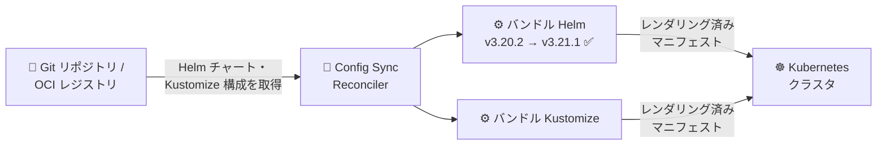

# Anthos Config Management (Config Sync): バンドル Helm の v3.21.1 へのアップグレードと CVE 対応

**リリース日**: 2026-07-27

**サービス**: Anthos Config Management (Config Sync)

**機能**: バンドル Helm バージョンアップグレード / 依存関係の CVE 対応

**ステータス**: Change (セキュリティ・メンテナンスアップデート)

📊 [このアップデートのインフォグラフィックを見る](https://takech9203.github.io/google-cloud-news-summary/20260727-anthos-config-management-helm-cve-updates.html)

## 概要

2026 年 7 月 27 日、Anthos Config Management (Config Sync) にセキュリティ・メンテナンスアップデートがリリースされました。今回のアップデートには 2 つの変更が含まれています。1 つ目は、Config Sync にバンドルされている Helm のバージョンを v3.20.2 から [v3.21.1](https://github.com/helm/helm/releases/tag/v3.21.1) にアップグレードし、脆弱性修正を取り込んだことです。2 つ目は、依存関係の更新により複数の CVE (Common Vulnerabilities and Exposures) に対処したことです。

Config Sync は、Git リポジトリや OCI レジストリに格納された Kustomize 構成や Helm チャートを自動レンダリング (ハイドレーション) する際に、内部でバンドルされた Helm 実行バイナリを使用しています。そのため、Helm 本体の脆弱性修正を取り込むことは、GitOps パイプライン全体のセキュリティ維持に直結します。

このアップデートは新機能の追加ではなくセキュリティ強化が目的であり、Config Sync を利用してクラスタ構成を管理しているすべてのユーザーに関係します。特にコンプライアンス要件で脆弱性管理が求められる環境では、早期の適用が推奨されます。

**アップデート前の課題**

- 従来バンドルされていた Helm v3.20.2 には、上流の Helm プロジェクトで修正済みの脆弱性 (golang.org/x/net の脆弱性 GO-2026-5026 など) が残存していた
- Config Sync の依存ライブラリに複数の CVE が存在していた

**アップデート後の改善**

- バンドル Helm が v3.21.1 に更新され、golang.org/x/net v0.55.0 へのバンプによる脆弱性修正や、`helm template` の nil ポインタパニック修正、OCI レジストリクライアントの認証情報保持の修正などが取り込まれた
- 依存関係の更新により複数の CVE に対処され、Config Sync コンポーネントのセキュリティ体制が改善された

## アーキテクチャ図

Config Sync はソースから取得した Helm チャートをバンドルされた Helm バイナリでレンダリングしてクラスタに適用します。今回のアップデートでこのバンドル Helm が v3.21.1 に更新され、脆弱性修正が取り込まれました。

## サービスアップデートの詳細

### 主要な変更点

1. **バンドル Helm の v3.20.2 → v3.21.1 へのアップグレード**
   - Config Sync が Helm チャートのレンダリングに使用する Helm 実行バイナリが更新された
   - Helm v3.21.1 には golang.org/x/net v0.55.0 へのバンプ (脆弱性 GO-2026-5026 への対応) が含まれる
   - そのほか `helm template` 実行時の nil ポインタパニック修正、OCI レジストリの plain-HTTP フォールバック時に認証情報が保持されるようになる修正、CRD インストール時のパニック修正、Go 1.26 へのアップグレードなどが含まれる
   - 各リリースの変更点は [Helm の changelogs](https://github.com/helm/helm/releases) を参照

2. **依存関係の更新による複数の CVE 対応**
   - Config Sync の依存ライブラリを更新し、複数の CVE に対処した
   - 対象の CVE 識別子はリリースノートでは個別に公表されていない

## 技術仕様

### バンドル Helm の更新履歴 (直近)

| Config Sync リリース時期 | Helm バージョン |
|------|------|
| 2026-01-29 (1.23.1) | v3.15.3 → v3.18.6 |
| 2026-03-26 (1.23.3) | v3.18.6 → v3.20.0 |
| 2026-07-27 (今回) | v3.20.2 → v3.21.1 |

バンドルされる Helm / Kustomize のバージョンは、[Config Sync ドキュメントの Bundled Helm and Kustomize versions](https://docs.cloud.google.com/kubernetes-engine/config-sync/docs/how-to/installing-config-sync) で確認できます。

## メリット

### ビジネス面

- **コンプライアンス対応**: 既知の脆弱性 (CVE) への対処により、脆弱性スキャンやセキュリティ監査での指摘事項を低減できる
- **運用負荷なしのセキュリティ改善**: Config Sync のバージョンを更新するだけで、GitOps パイプラインのレンダリングエンジンの脆弱性修正を取り込める

### 技術面

- **レンダリングの安定性向上**: Helm v3.21.1 に含まれる `helm template` や CRD インストール時のパニック修正により、ハイドレーション処理の安定性が向上する
- **OCI レジストリ連携の改善**: OCI レジストリクライアントの認証情報の扱いに関する修正が取り込まれる

## デメリット・制約事項

### 考慮すべき点

- 新しいバンドル Helm を利用するには、クラスタの Config Sync を今回の変更を含むバージョンへ更新する必要がある (自動アップグレードを構成していない場合)
- Helm のマイナーバージョンが v3.20 系から v3.21 系に上がるため、チャートのレンダリング結果に影響がないか、`nomos hydrate` / `nomos vet` での事前検証を推奨
- 対処された CVE の詳細 (識別子・深刻度) は公表されていないため、個別のリスク評価はできない

## 料金

Config Sync 自体のこのアップデートに伴う料金変更はありません。Config Sync は GKE Enterprise の機能として提供されます。詳細は [GKE の料金ページ](https://cloud.google.com/kubernetes-engine/pricing) を参照してください。

## 関連サービス・機能

- **GKE (Google Kubernetes Engine)**: Config Sync が構成を同期する対象のマネージド Kubernetes サービス
- **Artifact Registry**: Config Sync が Helm チャートや OCI イメージを直接同期できるレジストリ。今回の Helm 更新には OCI クライアントの修正も含まれる
- **Policy Controller**: Config Sync と組み合わせて使われるポリシー適用コンポーネント (リリースノートは別管理)

## 参考リンク

- 📊 [インフォグラフィック](https://takech9203.github.io/google-cloud-news-summary/20260727-anthos-config-management-helm-cve-updates.html)
- [公式リリースノート (Google Cloud)](https://docs.cloud.google.com/release-notes#July_27_2026)
- [Config Sync リリースノート](https://docs.cloud.google.com/kubernetes-engine/config-sync/docs/release-notes)
- [Helm v3.21.1 リリースノート](https://github.com/helm/helm/releases/tag/v3.21.1)
- [Config Sync での Kustomize / Helm レンダリング](https://docs.cloud.google.com/kubernetes-engine/config-sync/docs/concepts/kustomize)

## まとめ

今回のアップデートは、Config Sync のバンドル Helm を v3.21.1 に更新し、依存関係の CVE に対処するセキュリティ・メンテナンスリリースです。Config Sync で Helm チャートをレンダリングしている環境では、脆弱性修正とレンダリング安定性向上の恩恵を受けられるため、計画的なバージョン更新を推奨します。更新前には `nomos hydrate` によるレンダリング結果の事前検証を行うと安全です。

---

**タグ**: #AnthosConfigManagement #ConfigSync #Helm #セキュリティ #CVE #GitOps #GKE
