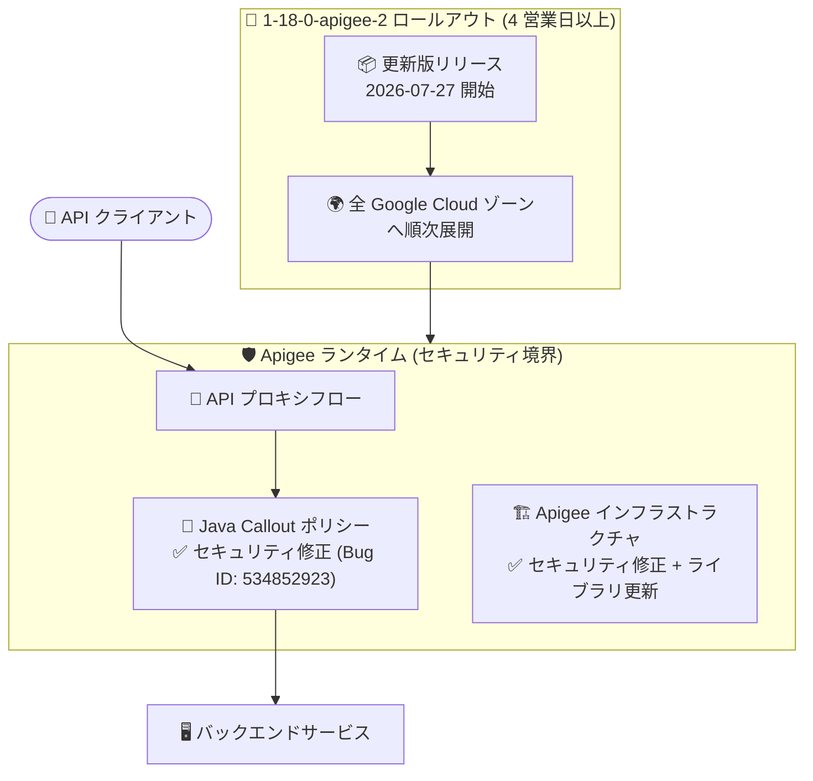

# Apigee X: セキュリティアップデート (1-18-0-apigee-2)

**リリース日**: 2026-07-27

**サービス**: Apigee X

**機能**: Apigee 更新版リリース 1-18-0-apigee-2 (セキュリティ修正)

**ステータス**: Announcement / Security

📊 [このアップデートのインフォグラフィックを見る](https://takech9203.github.io/google-cloud-news-summary/20260727-apigee-x-security-update-1-18-0-2.html)

## 概要

2026 年 7 月 27 日、Apigee の更新バージョン **1-18-0-apigee-2** がリリースされました。本リリースのロールアウトは同日より開始され、すべての Google Cloud ゾーンへの展開完了までに **4 営業日以上** かかる場合があります。ロールアウトが完了するまで、各インスタンスに本リリースの修正が反映されない可能性があります。

本リリースはセキュリティ修正を中心としたアップデートです。**Java Callout ポリシーにおけるセキュリティ問題の修正 (Bug ID: 534852923)** と、**Apigee インフラストラクチャに対するセキュリティ修正**が含まれています。Java Callout ポリシーは、Apigee の標準ポリシーではカバーできないカスタムロジックを Java コードで実装するための機能であり、API プロキシフロー内でユーザー提供の JAR を実行する仕組みです。

Apigee X を利用して API 管理を行っているすべての組織、特に Java Callout ポリシーを使用したカスタム処理を実装している組織にとって重要なアップデートです。適用のための操作は不要で、Google 側のロールアウトにより自動的に反映されます。

**アップデート前の課題**

- Java Callout ポリシーにセキュリティ問題 (Bug ID: 534852923) が存在していた
- Apigee インフラストラクチャに修正対象のセキュリティ問題が存在していた

**アップデート後の改善**

- Java Callout ポリシーのセキュリティ問題が修正された
- Apigee インフラストラクチャのセキュリティが強化された
- インフラストラクチャおよびライブラリが更新された

## アーキテクチャ図

更新版 1-18-0-apigee-2 が全ゾーンへ段階的にロールアウトされ、Apigee ランタイム内の Java Callout ポリシーとインフラストラクチャのセキュリティ問題が修正されます。

## サービスアップデートの詳細

### 主要な修正内容

1. **Java Callout ポリシーのセキュリティ修正 (Security)**
   - Bug ID: 534852923
   - Java Callout ポリシーにおけるセキュリティ問題を修正
   - Java Callout ポリシーは API プロキシフロー内でカスタム Java コード (JAR) を実行する機能。セキュリティ上の理由から、Apigee は Java Callout コードに Java パーミッションポリシーを適用しており (システムコールの制限、ネットワークアクセスの制限など)、この実行環境に関わる修正が行われた

2. **Apigee インフラストラクチャのセキュリティ修正 (Security)**
   - Apigee 基盤側のセキュリティ問題を修正
   - 個別の Bug ID は公開されていない (N/A)

3. **インフラストラクチャとライブラリの更新 (Fixed)**
   - Apigee 基盤のインフラストラクチャおよび依存ライブラリの更新

### ロールアウト情報

| 項目 | 詳細 |
|------|------|
| リリースバージョン | 1-18-0-apigee-2 |
| ロールアウト開始日 | 2026 年 7 月 27 日 |
| 展開完了までの期間 | 4 営業日以上かかる場合あり |
| 対象 | すべての Google Cloud ゾーンの Apigee インスタンス |
| ユーザー側の操作 | 不要 (Google 管理のロールアウトで自動適用) |

## 影響と推奨アクション

### 影響を受ける環境

- Apigee X / Apigee (Google Cloud 管理版) のすべてのインスタンス
- 特に Java Callout ポリシーを使用してカスタムロジックを実装している API プロキシ

### 推奨アクション

1. **ロールアウト完了の考慮**: ロールアウトには 4 営業日以上かかる場合があるため、インスタンスに修正が反映されるまでの期間を考慮する
2. **Java Callout ポリシー利用状況の確認**: 組織内で Java Callout ポリシーを使用している API プロキシを棚卸しし、修正適用後の動作を確認する
3. **Java パーミッションポリシーの遵守**: Java Callout コードは Apigee の Java パーミッションポリシー (ファイルシステムアクセス制限、ソケット経由のネットワークアクセス制限など) に従う必要がある。制限に違反するコードは失敗するため、[Java permission reference](https://docs.cloud.google.com/apigee/docs/api-platform/reference/java-permission-reference) を確認する

## デメリット・制約事項

### 考慮すべき点

- ロールアウトが完了するまで、インスタンスによっては本リリースの修正が利用できない
- 修正されたセキュリティ問題の詳細 (脆弱性の内容、CVE 番号など) は公開されていない
- Apigee hybrid は本リリースノートの対象外 (Apigee X / Google Cloud 管理版が対象)

## 関連サービス・機能

- **Java Callout ポリシー**: 今回の修正対象。Apigee 標準ポリシーでカバーできないカスタム動作を Java で実装する機能。軽量な処理には JavaScript ポリシーや Service Callout ポリシーの利用が推奨されている
- **Apigee API Monitoring / Cloud Logging**: ロールアウト後の API プロキシの動作確認やエラー監視に活用できる

## 参考リンク

- 📊 [インフォグラフィック](https://takech9203.github.io/google-cloud-news-summary/20260727-apigee-x-security-update-1-18-0-2.html)
- [公式リリースノート](https://docs.cloud.google.com/release-notes#July_27_2026)
- [Java Callout ポリシー ドキュメント](https://docs.cloud.google.com/apigee/docs/api-platform/reference/policies/java-callout-policy)
- [Java permission reference](https://docs.cloud.google.com/apigee/docs/api-platform/reference/java-permission-reference)

## まとめ

Apigee 1-18-0-apigee-2 は、Java Callout ポリシーおよび Apigee インフラストラクチャのセキュリティ問題を修正する重要なアップデートです。適用は Google 管理のロールアウトにより自動で行われますが、全ゾーンへの展開に 4 営業日以上かかる場合があります。Java Callout ポリシーを利用している組織は、ロールアウト完了後に API プロキシの正常動作を確認することを推奨します。

---

**タグ**: Apigee X, セキュリティ, Java Callout, API 管理, リリースアップデート
