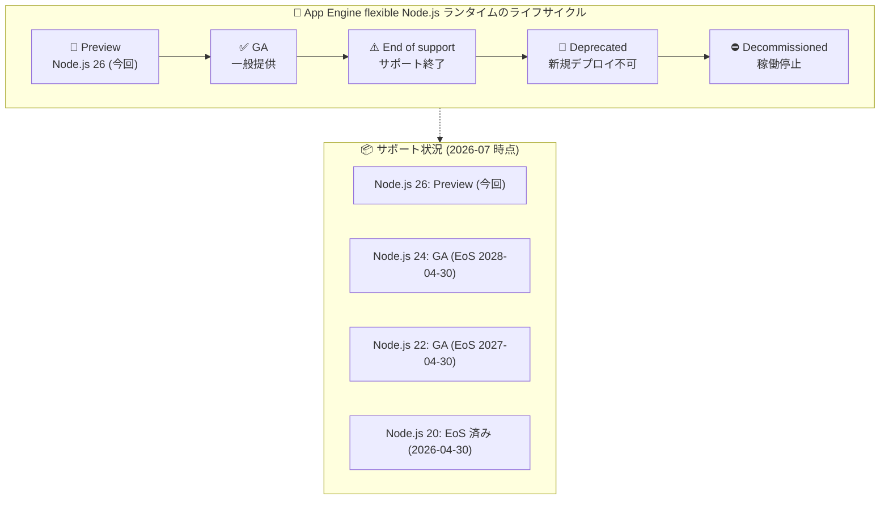

# App Engine flexible environment: Node.js 26 ランタイムのサポート (Preview)

**リリース日**: 2026-07-27

**サービス**: App Engine flexible environment (Node.js)

**機能**: Node.js 26 ランタイムのサポート

**ステータス**: Preview

📊 [このアップデートのインフォグラフィックを見る](https://takech9203.github.io/google-cloud-news-summary/20260727-app-engine-flexible-nodejs-26-runtime.html)

## 概要

App Engine flexible environment において、Node.js 26 ランタイムのサポートが Preview として発表されました。これにより、App Engine flexible environment 上の Node.js アプリケーションで、最新のメジャーバージョンである Node.js 26 を利用できるようになります。

App Engine flexible environment の Node.js ランタイムは、これまで Node.js 24 (2025 年 11 月 GA)、Node.js 22 (2024 年 11 月 GA) と、Node.js の偶数系メジャーバージョン (LTS 対象) を順次サポートしてきました。今回の Node.js 26 対応もこの流れに沿ったもので、新しい言語機能やパフォーマンス改善をいち早く評価したい開発者向けの先行提供という位置づけです。なお、同日に Cloud Run でも Node.js 26 ランタイムが Preview として発表されており、Google Cloud のサーバーレス実行環境全体で足並みを揃えた対応となっています。

Node.js のランタイムには End of support / Deprecated / Decommissioned というライフサイクルが定められており (例: Node.js 20 は 2026-04-30 にサポート終了済み)、古いバージョンを利用中のアプリケーションは順次アップグレードが必要です。今回の Preview は、次期 LTS 世代への移行検証を始める良いタイミングとなります。

**アップデート前の課題**

- App Engine flexible environment で公式にサポートされる最新の Node.js ランタイムは Node.js 24 までであり、Node.js 26 の新機能を利用するには対応を待つ必要があった
- Node.js 26 を App Engine flexible environment で動かすには、カスタムランタイム (独自の Dockerfile) を構築・管理する必要があった
- 古いランタイム (Node.js 20 は 2026-04-30 にサポート終了) を利用しているアプリケーションにとって、移行先の選択肢が限られていた

**アップデート後の改善**

- `app.yaml` の設定変更のみで Node.js 26 ランタイムを利用でき、カスタムランタイムの構築・保守が不要になった
- Node.js 26 の新しい言語機能・パフォーマンス改善を App Engine flexible environment 上で先行評価できるようになった
- サポート終了が近い、または終了した旧バージョンからの移行検証を早期に開始できるようになった

## アーキテクチャ図



App Engine flexible environment のランタイムは Preview → GA → End of support → Deprecated → Decommissioned というライフサイクルをたどります。Node.js 26 は今回 Preview 段階に入り、既存バージョンは順次サポート終了へ向かいます。

## サービスアップデートの詳細

### 主要機能

1. **Node.js 26 ランタイムの Preview 提供**
   - App Engine flexible environment で `runtime: nodejs` を利用するアプリケーションが Node.js 26 を指定可能に
   - Preview 段階のため、本番環境での利用は推奨されず、評価・検証目的での利用が想定される

2. **buildpacks ベースのランタイム**
   - 近年の Node.js ランタイム (18 以降) と同様、Google Cloud の buildpacks を使用してビルドされる
   - `package.json` に `build` スクリプトがあれば `npm run build` が自動実行され、`gcp-build` スクリプトによるカスタムビルドステップも利用可能

3. **バージョン指定の柔軟性**
   - `app.yaml` の `runtime_config.runtime_version` でバージョンを明示指定 (semver 対応)
   - `package.json` の `engines.node` フィールドでも指定可能 (両方指定した場合は `runtime_version` が優先)

## 技術仕様

### ランタイム設定 (Node.js ランタイム共通)

| 項目 | 詳細 |
|------|------|
| ランタイム名 | `nodejs` |
| 環境 | App Engine flexible environment (`env: flex`) |
| バージョン指定 | `runtime_config.runtime_version` または `package.json` の `engines.node` |
| OS 指定 | `runtime_config.operating_system` (Node.js 18 以降で必須) |
| ビルド | Google Cloud buildpacks |
| 必要な gcloud CLI | 420.0.0 以降 |
| 起動方法 | `npm start` (`PORT` 環境変数、通常 8080 で HTTP リクエストを受信) |

### Node.js ランタイムのサポートスケジュール (flexible environment)

| ランタイム | OS | サポート終了 (EoS) | 非推奨 (Deprecated) |
|-----------|-----|-------------------|---------------------|
| Node.js 26 | - (Preview) | 未定 | 未定 |
| Node.js 24 | Ubuntu 24.04 | 2028-04-30 | 2029-04-30 |
| Node.js 22 | Ubuntu 22.04 | 2027-04-30 | 2028-04-30 |
| Node.js 20 | Ubuntu 22.04 | 2026-04-30 (終了済み) | 2027-04-30 |
| Node.js 18 | Ubuntu 22.04 | 2025-04-30 (終了済み) | 2026-04-30 |

最新のスケジュールは [Runtime support schedule](https://docs.cloud.google.com/appengine/docs/flexible/lifecycle/support-schedule#nodejs) を参照してください。

## 設定方法

### 前提条件

1. gcloud CLI バージョン 420.0.0 以降がインストールされていること (`gcloud components update` で更新可能)
2. App Engine アプリケーションが作成済みであること

### 手順

#### ステップ 1: app.yaml でランタイムバージョンを指定

```yaml
runtime: nodejs
env: flex
runtime_config:
  operating_system: "ubuntu24"
  runtime_version: "26"
```

`runtime_version` を省略した場合は、デフォルトで最新の Node.js バージョンが使用されます。`operating_system` に指定する OS バージョンは、[ランタイムドキュメント](https://docs.cloud.google.com/appengine/docs/flexible/nodejs/runtime)で対応する Ubuntu バージョンを確認してください。

#### ステップ 2: package.json でエンジンバージョンを指定 (推奨)

```json
{
  "engines": {
    "node": "26.x"
  }
}
```

予期しない動作変更を防ぐため、`runtime_version` とあわせて `engines.node` も指定することが推奨されています。

#### ステップ 3: デプロイ

```bash
gcloud app deploy
```

## メリット

### ビジネス面

- **移行計画の前倒し**: 次世代ランタイムを早期に検証することで、サポート終了に伴う強制的な移行作業を計画的に進められる
- **カスタムランタイムの保守コスト削減**: 最新の Node.js を使うために独自 Dockerfile を管理する必要がなくなる

### 技術面

- **最新の言語機能の利用**: Node.js 26 の新機能・パフォーマンス改善を App Engine flexible environment 上で評価できる
- **設定のみで移行可能**: `app.yaml` と `package.json` の変更だけでランタイムを切り替えられ、アプリケーションコードやインフラ構成の大幅な変更は不要
- **Cloud Run との整合**: 同日に Cloud Run でも Node.js 26 が Preview となっており、flexible environment から Cloud Run への移行 (`gcloud beta app migrate-to-run`、2026 年 6 月 Preview) を検討する場合もランタイムバージョンを揃えられる

## デメリット・制約事項

### 制限事項

- Preview 段階のため、SLA の対象外であり、本番ワークロードでの利用は推奨されない
- Node.js 26 の End of support / Deprecated などのライフサイクル日程はまだ公開されていない

### 考慮すべき点

- Preview 期間中は仕様や挙動が変更される可能性があるため、GA 後に本番移行することが望ましい
- 依存パッケージ (ネイティブモジュールなど) が Node.js 26 に対応しているか事前に確認が必要
- Node.js 20 以前のランタイムはすでにサポート終了しており、サポート終了後のランタイムでは再デプロイがブロックされるため、旧バージョン利用者は早めの移行計画が必要

## ユースケース

### ユースケース 1: 次期 LTS 世代への移行検証

**シナリオ**: Node.js 22 で本番運用中のアプリケーションについて、将来の移行に備えて Node.js 26 での互換性を早期に検証したい。

**実装例**:
```yaml
# staging 用の app.yaml (例: app.staging.yaml)
runtime: nodejs
env: flex
runtime_config:
  operating_system: "ubuntu24"
  runtime_version: "26"
service: staging
```

```bash
gcloud app deploy app.staging.yaml --no-promote
```

**効果**: 本番トラフィックに影響を与えずに、別サービス/バージョンとして Node.js 26 の互換性テストを実施でき、GA 後の移行をスムーズに進められる。

### ユースケース 2: サポート終了ランタイムからの計画的アップグレード

**シナリオ**: Node.js 20 (2026-04-30 サポート終了) を利用中のアプリケーションを、最新世代へアップグレードしたい。

**効果**: まず GA 済みの Node.js 24 へ移行しつつ、Node.js 26 の Preview で先行検証を並行して進めることで、ランタイムのライフサイクルに追従する継続的なアップグレードサイクルを確立できる。

## 料金

ランタイムバージョンの追加による料金変更はありません。App Engine flexible environment の料金は、インスタンスが使用する vCPU、メモリ、永続ディスクのリソース量に基づいて課金されます。

詳細は [App Engine の料金ページ](https://cloud.google.com/appengine/pricing) を参照してください。

## 関連サービス・機能

- **Cloud Run**: 同日 (2026-07-27) に Node.js 26 ランタイムが Preview として発表。flexible environment からの移行コマンド `gcloud beta app migrate-to-run` も 2026 年 6 月に Preview 提供されており、移行先の候補となる
- **App Engine standard environment**: 同じく Node.js ランタイムを提供。ランタイムライフサイクル (サポートスケジュール) が別途定義されている
- **Cloud Build / buildpacks**: Node.js 18 以降のランタイムは Google Cloud buildpacks を使用してアプリケーションイメージをビルドする
- **Artifact Registry**: デプロイ時にビルドされたアプリケーションイメージの保存先

## 参考リンク

- 📊 [インフォグラフィック](https://takech9203.github.io/google-cloud-news-summary/20260727-app-engine-flexible-nodejs-26-runtime.html)
- [公式リリースノート](https://docs.cloud.google.com/release-notes#July_27_2026)
- [Node.js ランタイム (App Engine flexible environment)](https://docs.cloud.google.com/appengine/docs/flexible/nodejs/runtime)
- [Runtime support schedule](https://docs.cloud.google.com/appengine/docs/flexible/lifecycle/support-schedule#nodejs)
- [Runtime lifecycle](https://docs.cloud.google.com/appengine/docs/flexible/lifecycle/runtime-lifecycle)
- [料金ページ](https://cloud.google.com/appengine/pricing)

## まとめ

App Engine flexible environment に Node.js 26 ランタイムが Preview として追加され、`app.yaml` の設定のみで最新世代の Node.js を評価できるようになりました。Node.js 20 以前はすでにサポートが終了しているため、旧バージョンを利用中のチームは GA 済みの Node.js 24 への移行を進めつつ、ステージング環境で Node.js 26 の互換性検証を開始することを推奨します。

---

**タグ**: #AppEngine #NodeJS #Runtime #Preview #Serverless
