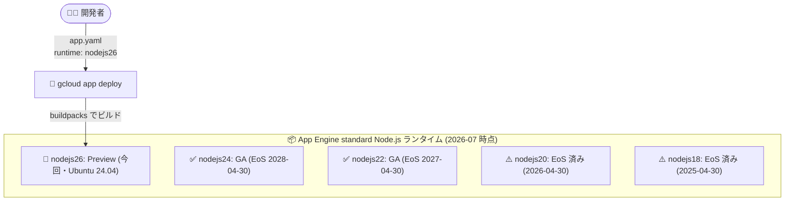

# App Engine standard environment: Node.js 26 ランタイムのサポート (Preview)

**リリース日**: 2026-07-27

**サービス**: App Engine standard environment (Node.js)

**機能**: Node.js 26 ランタイムのサポート

**ステータス**: Preview

📊 [このアップデートのインフォグラフィックを見る](https://takech9203.github.io/google-cloud-news-summary/20260727-app-engine-standard-nodejs-26-runtime.html)

## 概要

App Engine standard environment において、Node.js 26 ランタイムのサポートが Preview として発表されました。`app.yaml` に `runtime: nodejs26` と指定するだけで、最新メジャーバージョンである Node.js 26 上でアプリケーションを実行できるようになります。

App Engine standard environment の Node.js ランタイムは、Node.js 24 (Ubuntu 24.04)、Node.js 22 (Ubuntu 22.04) と偶数系メジャーバージョンを順次サポートしてきており、今回の Node.js 26 対応もこの流れに沿った先行提供です。公式ドキュメントでは、Node.js 26 (Preview) は Ubuntu 24.04 上で動作し、ランタイム ID は `nodejs26` と定義されています。

なお、同日に App Engine flexible environment でも Node.js 26 ランタイムが Preview として発表されており ([別レポート参照](2026-07-27-app-engine-flexible-nodejs-26-runtime.md))、App Engine の両環境で足並みを揃えた対応となっています。

**アップデート前の課題**

- App Engine standard environment で利用できる最新の Node.js ランタイムは Node.js 24 までで、Node.js 26 の新機能・改善を standard environment 上で評価できなかった
- Node.js 18 (2025-04-30) や Node.js 20 (2026-04-30) はすでにサポート終了しており、次世代への移行検証を早期に始めたいユーザーにとって選択肢が限られていた

**アップデート後の改善**

- `app.yaml` の `runtime: nodejs26` 指定のみで Node.js 26 を利用可能になり、最新ランタイムの評価・移行検証を開始できるようになった
- Node.js のライフサイクル (Preview → GA → End of support) に沿って、GA 前から互換性テストを進められるようになった

## アーキテクチャ図



`app.yaml` のランタイム指定を変更してデプロイするだけで Node.js 26 (Preview) を利用できます。旧バージョンは順次サポート終了へ向かいます。

## サービスアップデートの詳細

### 主要機能

1. **Node.js 26 ランタイムの Preview 提供**
   - `app.yaml` に `runtime: nodejs26` と指定することで利用可能
   - Ubuntu 24.04 ベースで動作 (ランタイム ID: `nodejs26`)
   - Preview 段階のため、評価・検証目的での利用が想定される

2. **マイナー・パッチバージョンの自動更新**
   - ランタイムは指定メジャーバージョンの最新安定版を使用し、パッチ・マイナーリリースは自動更新される (メジャーバージョンは自動更新されない)
   - `package.json` の `engines.node` を指定する場合は、`app.yaml` のメジャーバージョンと互換性のある指定 (例: `26.x.x`、`^26.0.0`) が必要。非互換の場合はデプロイがエラーになる

3. **既存の Node.js ランタイム機能をそのまま利用可能**
   - npm / Yarn / Pnpm による依存関係インストール、`npm run build` の自動実行、`gcp-build` カスタムビルドステップに対応
   - `package.json` の `start` スクリプトまたは `app.yaml` の `entrypoint` で起動方法を制御

## 技術仕様

### Node.js 26 ランタイム (standard environment)

| 項目 | 詳細 |
|------|------|
| ランタイム ID | `nodejs26` |
| ステータス | Preview |
| OS | Ubuntu 24.04 |
| 指定方法 | `app.yaml` に `runtime: nodejs26` |
| バージョン更新 | パッチ・マイナーは自動更新、メジャーは固定 |
| 起動 | `node server.js` / `start` スクリプト / `entrypoint` (PORT 環境変数で HTTP 受信) |
| ファイルシステム | 読み取り専用 (`/tmp` のみ書き込み可、RAM 上の仮想ディスク) |

### Node.js ランタイムのサポートスケジュール (standard environment)

| ランタイム | OS | サポート終了 (EoS) | 非推奨 (Deprecated) |
|-----------|-----|-------------------|---------------------|
| Node.js 26 | Ubuntu 24.04 | 未定 (Preview) | 未定 |
| Node.js 24 | Ubuntu 24.04 | 2028-04-30 | 2029-04-30 |
| Node.js 22 | Ubuntu 22.04 | 2027-04-30 | 2028-04-30 |
| Node.js 20 | Ubuntu 22.04 | 2026-04-30 (終了済み) | 2027-04-30 |
| Node.js 18 | Ubuntu 22.04 | 2025-04-30 (終了済み) | 2026-04-30 |

最新のスケジュールは [Runtime support schedule](https://docs.cloud.google.com/appengine/docs/standard/lifecycle/support-schedule#nodejs) を参照してください。

## 設定方法

### 前提条件

1. App Engine アプリケーションが作成済みであること
2. gcloud CLI がインストール済みであること

### 手順

#### ステップ 1: app.yaml でランタイムを指定

```yaml
runtime: nodejs26
```

standard environment ではこの 1 行のみで最小構成となり、インスタンスクラス (デフォルト F1) や自動スケーリングはデフォルト値が適用されます。

#### ステップ 2: package.json でエンジンバージョンを指定 (任意)

```json
{
  "engines": {
    "node": "26.x.x"
  }
}
```

`engines.node` は `app.yaml` で指定したメジャーバージョンと互換性がある必要があります。

#### ステップ 3: デプロイ

```bash
gcloud app deploy
```

## メリット

### ビジネス面

- **移行計画の前倒し**: GA 前に互換性検証を始められるため、サポート終了に伴う移行作業を計画的に進められる
- **継続的なランタイム追従**: 偶数系メジャーバージョンごとの提供サイクルに乗ることで、EoS 直前の駆け込み移行を回避できる

### 技術面

- **設定 1 行で最新ランタイムを利用**: `runtime: nodejs26` の指定のみで切り替え可能。アプリケーションコードやインフラの変更は不要
- **flexible environment との整合**: 同日に flexible environment でも Node.js 26 が Preview となっており、両環境でバージョンを揃えた検証が可能

## デメリット・制約事項

### 制限事項

- Preview 段階のため SLA の対象外であり、本番ワークロードでの利用は推奨されない
- Node.js 26 の End of support / Deprecated などのライフサイクル日程は未公開

### 考慮すべき点

- Preview 期間中は仕様や挙動が変更される可能性があるため、本番移行は GA 後が望ましい
- ネイティブモジュールなどの依存パッケージが Node.js 26 に対応しているか事前確認が必要
- Node.js 18/20 はすでにサポート終了しており、EoS 後のランタイムは再デプロイがブロックされる場合があるため、旧バージョン利用者は早めの移行が必要

## ユースケース

### ユースケース 1: 次期ランタイムへの互換性検証

**シナリオ**: Node.js 22/24 で本番運用中のアプリケーションについて、将来の移行に備えて Node.js 26 での動作を検証したい。

**実装例**:
```yaml
# staging 用 app.yaml (例: app.staging.yaml)
runtime: nodejs26
service: staging
```

```bash
gcloud app deploy app.staging.yaml --no-promote
```

**効果**: 本番トラフィックに影響を与えずに別サービス/バージョンとして Node.js 26 の互換性テストを実施でき、GA 後の移行をスムーズに進められる。

### ユースケース 2: サポート終了ランタイムからの計画的アップグレード

**シナリオ**: Node.js 20 (2026-04-30 サポート終了) を利用中のアプリケーションをアップグレードしたい。

**効果**: まず GA 済みの Node.js 24 へ移行しつつ、Node.js 26 Preview での先行検証を並行して進めることで、ランタイムライフサイクルに追従する継続的なアップグレードサイクルを確立できる。

## 料金

ランタイムバージョンの追加による料金変更はありません。App Engine standard environment の料金は、インスタンスクラスとインスタンス稼働時間に基づいて課金され、無料枠も提供されています。

詳細は [App Engine の料金ページ](https://cloud.google.com/appengine/pricing) を参照してください。

## 関連サービス・機能

- **App Engine flexible environment**: 同日 (2026-07-27) に Node.js 26 ランタイムが Preview として発表 ([レポート](2026-07-27-app-engine-flexible-nodejs-26-runtime.md))
- **Cloud Build / buildpacks**: デプロイ時のアプリケーションビルドに使用され、`npm run build` の自動実行や `gcp-build` カスタムビルドステップをサポート
- **Artifact Registry**: Node.js のプライベートパッケージリポジトリとして利用可能 (`.npmrc` で認証設定)

## 参考リンク

- 📊 [インフォグラフィック](https://takech9203.github.io/google-cloud-news-summary/20260727-app-engine-standard-nodejs-26-runtime.html)
- [公式リリースノート](https://docs.cloud.google.com/release-notes#July_27_2026)
- [Node.js ランタイム (App Engine standard environment)](https://docs.cloud.google.com/appengine/docs/standard/nodejs/runtime)
- [Runtime support schedule](https://docs.cloud.google.com/appengine/docs/standard/lifecycle/support-schedule#nodejs)
- [Runtime lifecycle](https://docs.cloud.google.com/appengine/docs/standard/lifecycle/runtime-lifecycle)
- [料金ページ](https://cloud.google.com/appengine/pricing)

## まとめ

App Engine standard environment に Node.js 26 ランタイムが Preview として追加され、`app.yaml` に `runtime: nodejs26` と 1 行指定するだけで最新世代の Node.js を評価できるようになりました。Node.js 18/20 はすでにサポートが終了しているため、旧バージョンを利用中のチームは GA 済みの Node.js 24 への移行を進めつつ、ステージング環境で Node.js 26 の互換性検証を開始することを推奨します。

---

**タグ**: #AppEngine #NodeJS #Runtime #Preview #Serverless
