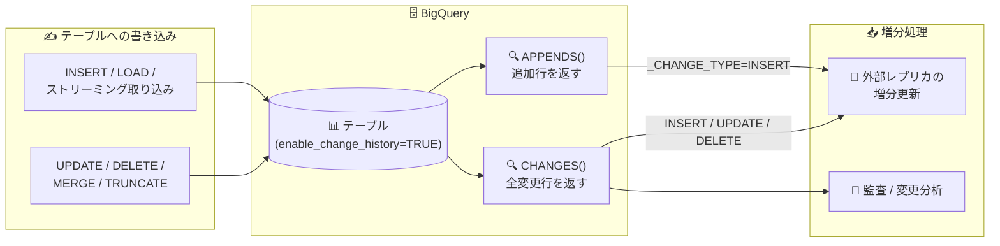

# BigQuery: APPENDS / CHANGES 変更履歴関数が GA

**リリース日**: 2026-07-27

**サービス**: BigQuery

**機能**: APPENDS / CHANGES 変更履歴 (Change History) 関数

**ステータス**: GA (一般提供)

📊 [このアップデートのインフォグラフィックを見る](https://takech9203.github.io/google-cloud-news-summary/20260727-bigquery-change-history-functions-ga.html)

## 概要

BigQuery の変更履歴 (Change History) 機能である `APPENDS` 関数と `CHANGES` 関数が一般提供 (GA) になりました。これらは GoogleSQL のテーブル値関数で、指定した時間範囲内にテーブルへ追加 (append) された行や、変更 (insert / update / delete) された行を SQL クエリで直接取得できます。

`APPENDS` はテーブルに追加された行 (CREATE TABLE / INSERT / MERGE による追加 / データロード / ストリーミング取り込み) を返し、`CHANGES` はそれに加えて UPDATE / DELETE / TRUNCATE / WRITE_TRUNCATE ジョブ / パーティション削除など、テーブルに対するあらゆる行レベルの変更を返します。各行には `_CHANGE_TYPE` と `_CHANGE_TIMESTAMP` の擬似列が付与されるため、テーブルへの増分変更を SQL だけで処理できます。

BigQuery のテーブルレプリカを外部システムで増分メンテナンスしたいデータエンジニアや、CDC (Change Data Capture) 的なワークロードを高コストなフルコピーなしで実現したいチームにとって、本番利用の裏付け (GA) が得られた重要なアップデートです。

**アップデート前の課題**

- `APPENDS` / `CHANGES` 関数は Preview (Pre-GA) の位置付けで、Pre-GA Offerings Terms が適用され、サポートも限定的であったため、本番ワークロードへの採用が難しかった
- テーブルの増分変更を外部システムへ反映するには、テーブル全体のコピーや、タイムスタンプ列を使った独自の差分抽出ロジックの実装が必要だった
- 削除や更新を含む行レベルの変更を、標準 SQL のみで網羅的に追跡する公式の手段がなかった

**アップデート後の改善**

- `APPENDS` / `CHANGES` の両関数が GA となり、SLA・サポートを伴う本番環境での利用が可能になった
- `SELECT ... FROM APPENDS(TABLE t, start, end)` のように SQL だけで、指定期間の追加行・変更行を取得できるようになった
- `_CHANGE_TYPE` (INSERT / UPDATE / DELETE)、`_CHANGE_TIMESTAMP`、`_CHANGE_IS_FOR_UPDATE` の擬似列により、増分レプリケーションや監査などの CDC 的な処理を、コストの高いフルテーブルコピーなしで実装できるようになった

## アーキテクチャ図



テーブルへの書き込み操作 (追加・更新・削除) を、`APPENDS` / `CHANGES` 関数が SQL クエリとして取得し、外部レプリカの増分更新や監査に利用するデータフローです。

## サービスアップデートの詳細

### 主要機能

1. **APPENDS 関数 (追加行の取得)**
   - 指定した時間範囲内にテーブルへ追加されたすべての行を返す
   - 対象操作: `CREATE TABLE` DDL、`INSERT` DML、`MERGE` DML による追加、データロード、ストリーミング取り込み
   - 追加された行のレコードは、後にそのデータが削除されても保持される (削除は `APPENDS` には反映されない)
   - `_CHANGE_TYPE` は `INSERT` のみ

2. **CHANGES 関数 (全変更行の取得)**
   - 指定した時間範囲内にテーブルで変更されたすべての行を返す
   - 対象操作: `APPENDS` の対象に加え、`UPDATE` / `DELETE` / `TRUNCATE TABLE` DML、`writeDisposition: WRITE_TRUNCATE` のジョブ、個別パーティション削除
   - 利用にはテーブルオプション `enable_change_history = TRUE` の設定が必要
   - 行の更新は「旧行の `DELETE` (このとき `_CHANGE_IS_FOR_UPDATE = TRUE`)」+「新行の `UPDATE`」の 2 レコードとして表現される

3. **変更メタデータの擬似列**
   - `_CHANGE_TYPE`: 変更種別 (`INSERT` / `UPDATE` / `DELETE`)
   - `_CHANGE_TIMESTAMP`: 変更をコミットしたトランザクションのコミット時刻
   - `_CHANGE_IS_FOR_UPDATE` (`CHANGES` のみ): 行更新に伴う `DELETE` イベントかどうかを示す BOOL 値

## 技術仕様

### 関数シグネチャ

| 関数 | シグネチャ | 返す変更 |
|------|-----------|----------|
| APPENDS | `APPENDS(TABLE table, start_timestamp, end_timestamp)` | 追加行 (INSERT のみ) |
| CHANGES | `CHANGES(TABLE table, start_timestamp, end_timestamp)` | INSERT / UPDATE / DELETE |

- `start_timestamp`: 出力に含める最も早い変更時刻。`NULL` の場合はテーブル作成以降のすべての変更 (タイムトラベルウィンドウの範囲内)
- `end_timestamp`: 出力に含める最も遅い変更時刻 (排他的)。`NULL` の場合はクエリ開始時刻までの変更。未来の時刻を指定するとエラー
- 取得可能な範囲はテーブルのタイムトラベルウィンドウ (標準テーブルで最大 7 日間、短縮設定可) に制限される
- `CHANGES` では `start_timestamp` と `end_timestamp` の間隔は最大 1 日

### 必要な権限

| 項目 | 詳細 |
|------|------|
| 必要な権限 | 対象テーブルに対する `bigquery.tables.getData` |
| 含まれる事前定義ロール | `roles/bigquery.dataViewer`、`roles/bigquery.dataEditor`、`roles/bigquery.dataOwner`、`roles/bigquery.admin` |
| 行レベルアクセスポリシーがある (あった) テーブル | `bigquery.rowAccessPolicies.overrideTimeTravelRestrictions` 権限が必要 (`roles/bigquery.admin` に含まれる) |
| 列レベルセキュリティ | アクセス権のある列の変更履歴のみ閲覧可能 |

## 設定方法

### 前提条件

1. 対象テーブルが通常の BigQuery テーブルであること (クローン、スナップショット、ビュー、マテリアライズドビュー、外部テーブル、ワイルドカードテーブルは非対応)
2. `CHANGES` 関数を使う場合は、テーブルの `enable_change_history` オプションが `TRUE` であること
3. 対象テーブルに対する `bigquery.tables.getData` 権限があること

### 手順

#### ステップ 1: (CHANGES を使う場合) 変更履歴オプションを有効化

```sql
-- 新規テーブル作成時に有効化
CREATE TABLE mydataset.Produce (
  product STRING,
  inventory INT64
) OPTIONS (enable_change_history = TRUE);

-- 既存テーブルで有効化
ALTER TABLE `mydataset.Produce`
SET OPTIONS (enable_change_history = TRUE);
```

`enable_change_history = TRUE` を設定すると、BigQuery はテーブルの変更メタデータを保存します (追加のストレージ・コンピュートコストが発生)。

#### ステップ 2: APPENDS で追加行を取得

```sql
SELECT
  product,
  inventory,
  _CHANGE_TYPE AS change_type,
  _CHANGE_TIMESTAMP AS change_time
FROM APPENDS(TABLE mydataset.Produce, NULL, NULL);
```

`NULL, NULL` を指定すると、タイムトラベルウィンドウ内の全追加履歴を取得します。

#### ステップ 3: CHANGES で全変更行を取得

```sql
SELECT
  product,
  inventory,
  _CHANGE_TYPE AS change_type,
  _CHANGE_TIMESTAMP AS change_time,
  _CHANGE_IS_FOR_UPDATE AS change_is_for_update
FROM CHANGES(
  TABLE mydataset.Produce,
  TIMESTAMP_SUB(CURRENT_TIMESTAMP(), INTERVAL 1 DAY),
  NULL)
ORDER BY change_time;
```

`CHANGES` は開始・終了間の最大時間範囲が 1 日である点に注意してください。

## メリット

### ビジネス面

- **本番利用の安心感**: GA により Pre-GA Offerings Terms の制約が外れ、SLA とサポートを前提に本番ワークロードで採用できる
- **コスト削減**: 増分変更のみを処理できるため、外部レプリカの維持にテーブル全体の高コストなコピーが不要になる

### 技術面

- **SQL のみで完結する CDC 的処理**: 追加のパイプラインツールを導入せずに、GoogleSQL クエリだけで増分変更を抽出できる
- **豊富な変更メタデータ**: `_CHANGE_TYPE` / `_CHANGE_TIMESTAMP` / `_CHANGE_IS_FOR_UPDATE` により、変更種別・コミット時刻・更新起因の削除を正確に判別できる
- **幅広い書き込み経路をカバー**: DML だけでなく、データロード、ストリーミング取り込み、WRITE_TRUNCATE ジョブ、パーティション削除まで捕捉できる

## デメリット・制約事項

### 制限事項

- 取得できる履歴はテーブルのタイムトラベルウィンドウ (標準で最大 7 日間) に制限される
- 出力はテーブルの現在のスキーマに準拠する (後から追加された列は過去行では NULL)
- `CHANGES` の `start_timestamp` と `end_timestamp` の間隔は最大 1 日
- マルチステートメントトランザクション内では両関数を呼び出せない。`CHANGES` は、要求ウィンドウ内にマルチステートメントトランザクションがコミットされたテーブルでは使用不可
- 通常の BigQuery テーブルのみ対応 (ビュー、マテリアライズドビュー、外部テーブル、ワイルドカードテーブルなどは非対応)
- クローン・スナップショットおよびそこからの復元テーブルには、元テーブルの変更履歴は引き継がれない
- CDC (change data capture) が有効なテーブルでは `CHANGES` を使用できない
- 取り込み時間パーティションテーブルの擬似列 (`_PARTITIONTIME` / `_PARTITIONDATE`) は出力に含まれない
- パーティション有効期限切れによる削除は変更履歴に記録されない
- `enable_change_history = TRUE` のテーブルでは、直近にストリーミングされたデータに対する DML が失敗する

### 考慮すべき点

- `enable_change_history = TRUE` にすると変更メタデータが保存され、追加のストレージ・コンピュートコストが発生する (特に大規模な削除が多いテーブルで顕著になりやすい)
- `APPENDS` / `CHANGES` の呼び出しは、指定期間内にテーブルへ書き込まれた全データの処理を伴うため、クエリコストに注意が必要
- 7 日を超える履歴保持が必要な場合は、変更履歴を定期的に別テーブルへ書き出すなどの設計が必要

## ユースケース

### ユースケース 1: 外部データストアへの増分レプリケーション

**シナリオ**: BigQuery のマスタテーブルの内容を、検索エンジンや運用系データベースなど外部システムにレプリケーションしている。従来は定期的なフルエクスポートを行っており、データ量の増加とともにコストと反映遅延が問題になっていた。

**実装例**:
```sql
-- 前回同期時刻以降の変更のみを取得して外部システムへ反映
SELECT *, _CHANGE_TYPE, _CHANGE_TIMESTAMP, _CHANGE_IS_FOR_UPDATE
FROM CHANGES(
  TABLE mydataset.master_table,
  TIMESTAMP '2026-07-26 00:00:00+00',   -- 前回同期時刻
  TIMESTAMP '2026-07-27 00:00:00+00')   -- 今回同期時刻 (最大 1 日間隔)
ORDER BY _CHANGE_TIMESTAMP;
```

**効果**: 変更された行のみを処理するため、フルコピーに比べて転送量・処理コストを大幅に削減し、同期の頻度を上げられる。

### ユースケース 2: 追記型テーブルの増分 ETL

**シナリオ**: ストリーミング取り込みやバッチロードで行が追加され続けるイベントテーブルから、下流の集計テーブルを定期的に更新したい。

**実装例**:
```sql
-- 過去 1 時間に追加された行のみを下流処理へ
SELECT *
FROM APPENDS(
  TABLE mydataset.events,
  TIMESTAMP_SUB(CURRENT_TIMESTAMP(), INTERVAL 1 HOUR),
  NULL);
```

**効果**: 追加行だけを対象とした増分 ETL を SQL のみで実装でき、`enable_change_history` の設定も不要 (`APPENDS` はオプション設定なしで利用可能)。

### ユースケース 3: テーブル変更の監査・調査

**シナリオ**: 特定の期間にテーブルのどの行が更新・削除されたかを、障害調査やデータ品質の監査のために確認したい。

**効果**: `_CHANGE_TYPE` と `_CHANGE_TIMESTAMP` により、いつ・どの行が・どのように変更されたかを SQL で即座に特定でき、調査時間を短縮できる。

## 料金

変更履歴関数の呼び出しには BigQuery のコンピュート料金 (分析料金) が発生します。

- `APPENDS` / `CHANGES` はどちらも、指定した時間範囲内にテーブルへ書き込まれた全データ (追加・変更の両方) の処理を必要とする。`enable_change_history` を `FALSE` にしても `APPENDS` が処理するデータ量は減らない
- `enable_change_history = TRUE` を設定すると、BigQuery はテーブル変更メタデータを保存し、追加のストレージ料金とコンピュート料金が発生する。課金額は変更の数と種類に依存し、通常は小さいが、大規模な削除が多いテーブルでは目立つコストになる可能性がある

詳細は [BigQuery 料金ページ](https://cloud.google.com/bigquery/pricing) を参照してください。

## 利用可能リージョン

リージョン固有の制限は Release Notes には記載されていません。詳細は[公式ドキュメント](https://docs.cloud.google.com/bigquery/docs/change-history)を参照してください。

## 関連サービス・機能

- **BigQuery タイムトラベル**: 変更履歴関数が取得できる範囲はタイムトラベルウィンドウ (標準 7 日間、短縮可能) に依存する
- **BigQuery Change Data Capture (CDC)**: Storage Write API 経由で UPSERT/DELETE をリアルタイム反映する機能。CDC が有効なテーブルでは `CHANGES` 関数は使用できないため、用途に応じた使い分けが必要
- **BigQuery Storage Write API / ストリーミング取り込み**: ストリーミングで追加された行も `APPENDS` / `CHANGES` の変更履歴に記録される
- **テーブルスナップショット / クローン**: 特定時点の状態保存には有効だが、変更履歴は新テーブルへ引き継がれない点に注意
- **Datastream**: 運用系データベースから BigQuery への CDC レプリケーションを担うサービス。本機能は逆に BigQuery から外部への増分連携の起点として利用できる

## 参考リンク

- 📊 [インフォグラフィック](https://takech9203.github.io/google-cloud-news-summary/20260727-bigquery-change-history-functions-ga.html)
- [公式リリースノート](https://docs.cloud.google.com/release-notes#July_27_2026)
- [ドキュメント: Work with change history](https://docs.cloud.google.com/bigquery/docs/change-history)
- [リファレンス: APPENDS / CHANGES 関数](https://docs.cloud.google.com/bigquery/docs/reference/standard-sql/time-series-functions)
- [料金ページ](https://cloud.google.com/bigquery/pricing)

## まとめ

BigQuery の `APPENDS` / `CHANGES` 変更履歴関数が GA となり、テーブルへの増分変更を標準 SQL だけで追跡する手法を本番環境で安心して採用できるようになりました。外部レプリカの増分メンテナンスや増分 ETL、変更監査を実装しているチームは、フルコピーに依存した既存パイプラインの置き換えを検討する価値があります。導入時はタイムトラベルウィンドウ (最大 7 日) や `CHANGES` の 1 日の時間範囲制限、`enable_change_history` 有効化に伴うコストを事前に確認してください。

---

**タグ**: #BigQuery #ChangeHistory #APPENDS #CHANGES #CDC #GA #DataEngineering
