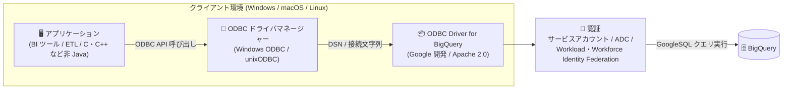

# BigQuery: Google 開発の ODBC ドライバが一般提供 (GA) / Storage Write API の名称変更

**リリース日**: 2026-07-27

**サービス**: BigQuery

**機能**: Google 開発の ODBC ドライバ (GA)、Storage Write API の名称変更

**ステータス**: GA (ODBC ドライバ) / Change (名称変更)

📊 [このアップデートのインフォグラフィックを見る](https://takech9203.github.io/google-cloud-news-summary/20260727-bigquery-odbc-driver-ga.html)

## 概要

Google が開発した BigQuery 用の Open Database Connectivity (ODBC) ドライバが一般提供 (GA) になりました。このドライバを使用すると、非 Java アプリケーションを BigQuery に接続し、使い慣れたツールやインフラストラクチャから BigQuery の機能を利用できます。Java アプリケーションの場合は、同じく Google 開発の JDBC ドライバが用意されています。ドライバは Apache 2.0 ライセンスの下で提供され、Windows、macOS、Linux の各プラットフォームに対応しています。

これまで BigQuery への ODBC 接続には、Google Cloud Ready - BigQuery パートナーである insightsoftware が開発する Simba ODBC ドライバが案内されてきました。今回の GA により、Google 自身が開発・提供するファーストパーティの ODBC ドライバという選択肢が正式に利用可能になり、公式ドキュメントでも Simba ドライバの代替として Google 開発ドライバの利用が推奨されています。BI ツールや ETL ツール、C/C++/Python などで書かれた既存アプリケーションから ODBC 標準インターフェース経由で BigQuery に接続したいユーザーが対象です。

あわせて、同日の Release Notes では機能名称の変更もアナウンスされました。従来「legacy tabledata.insertAll method」と呼ばれていた機能は「**Storage Write API (REST)**」に、従来「Storage Write API」と呼ばれていた機能は「**Storage Write API (gRPC)**」に改称されています。

**アップデート前の課題**

- ODBC 経由で BigQuery に接続する場合、サードパーティ (insightsoftware) 製の Simba ODBC ドライバを利用する必要があった
- Google 開発の ODBC ドライバは GA ではなく、本番環境での採用判断が難しかった
- ストリーミング挿入の 2 つの API が「legacy tabledata.insertAll method」「Storage Write API」という名称で、両者の関係 (プロトコルの違い) が名称から分かりにくかった

**アップデート後の改善**

- Google 開発の ODBC ドライバが GA となり、本番環境で正式に利用できるようになった
- Apache 2.0 ライセンスのもと、Windows (x86/x64)、macOS (x86_64/Apple Silicon)、Linux (x86_64) 向けにドライバが提供され、サービスアカウント認証・Application Default Credentials (ADC)・Workload/Workforce Identity Federation の 3 種類の認証方式に対応した
- ストリーミング系 API の名称が「Storage Write API (REST)」「Storage Write API (gRPC)」に統一され、プロトコルの違いが名称から明確になった

## アーキテクチャ図



非 Java アプリケーションが ODBC ドライバマネージャーと Google 開発の ODBC ドライバを経由し、認証を行ったうえで BigQuery にクエリを実行するデータフローを示しています。

## サービスアップデートの詳細

### 主要機能

1. **Google 開発の ODBC ドライバ (GA)**
   - 非 Java アプリケーションを ODBC 標準インターフェースで BigQuery に接続できる
   - Apache 2.0 ライセンスで提供される
   - GoogleSQL (推奨) とレガシー SQL の両方の SQL 方言に対応 (`QueryDialect` プロパティで指定)

2. **マルチプラットフォーム対応**
   - Windows: 32-bit (x86) / 64-bit (x64) 向けの MSI インストーラを提供
   - macOS: 64-bit (x86_64) / ARM64 (Apple Silicon) 向けの tar.gz を提供
   - Linux: 64-bit (x86_64) 向けの ZIP を提供

3. **複数の認証方式に対応**
   - サービスアカウント認証 (`OAuthMechanism=0`)
   - Application Default Credentials 認証 (`OAuthMechanism=3`)
   - Workload Identity Federation / Workforce Identity Federation 認証 (`OAuthMechanism=4`)

4. **豊富な接続プロパティ**
   - プロキシ設定 (`ProxyHost`、`ProxyPort` など)、ログ設定 (`LogLevel`、`LogPath` など)、クエリキャッシュ (`UseQueryCache`)、Private Service Connect のカスタムエンドポイント (`PrivateServiceConnectUris`) などを設定可能
   - `MaxResults` (ページあたりの結果件数、デフォルト 10000)、`MaxThreads` (並行処理スレッド数、デフォルト 8) などのチューニングも可能

### 関連する変更: Storage Write API の名称変更

同日の Release Notes で、BigQuery のストリーミング関連機能の名称変更が発表されました。

| 旧名称 | 新名称 | ドキュメント |
|--------|--------|--------------|
| legacy tabledata.insertAll method | Storage Write API (REST) | [Stream data using the Storage Write API (REST)](https://docs.cloud.google.com/bigquery/docs/streaming-data-into-bigquery) |
| Storage Write API | Storage Write API (gRPC) | [Introduction to the Storage Write API (gRPC)](https://docs.cloud.google.com/bigquery/docs/write-api) |

これは名称のみの変更であり、機能自体の変更ではありません。公式ドキュメントでは、新規プロジェクトには Storage Write API (gRPC) の利用が推奨されています。gRPC 版は料金が低く、exactly-once 配信セマンティクスや Apache Iceberg マネージドテーブルへのストリーミングなど、より堅牢な機能を備えています。Storage Write API (REST) も引き続き完全にサポートされます。REST 版から gRPC 版へ移行する場合は、書き込みセマンティクスが類似しているデフォルトストリーム (at-least-once) の利用が推奨されています。

## 技術仕様

### サポートされるオペレーティングシステム

| OS | 対応アーキテクチャ | 最小バージョンと依存関係 |
|------|------|------|
| Windows | 32-bit (x86)、64-bit (x64) | Windows 10、Windows Server 2016 以降。Microsoft Visual C++ Redistributable (Visual Studio 2019 または 2022) が必要 |
| macOS | 64-bit (x86_64)、ARM64 (Apple Silicon) | macOS 12 (Monterey) 以降。ODBC ドライバマネージャー (unixODBC など) が必要。インストールディレクトリを `DYLD_LIBRARY_PATH` に追加する |
| Linux | 64-bit (x86_64) | glibc 2.27 以降のディストリビューション (Ubuntu 20.04 LTS 以降、Debian 11 以降など)。ODBC ドライバマネージャー (unixODBC など) が必要。インストールディレクトリを `LD_LIBRARY_PATH` に追加する |

### 接続文字列の形式

```text
Driver=ODBC Driver for BigQuery;ProjectId=PROJECT_ID;OAuthType=AUTH_TYPE;AUTH_PROPS;OTHER_PROPS
```

| パラメータ | 説明 |
|------|------|
| `PROJECT_ID` | BigQuery プロジェクトの ID (クエリの実行と課金の対象) |
| `AUTH_TYPE` | 認証タイプ。`0`: サービスアカウント、`3`: Application Default Credentials、`4`: Workload/Workforce Identity Federation |
| `AUTH_PROPS` | 認証情報 (例: サービスアカウント認証の場合 `KeyFilePath=my-sa-key`) |
| `OTHER_PROPS` | 追加の接続プロパティ (省略可) |

## 設定方法

### 前提条件

1. ODBC ドライバとドライバマネージャーの基本知識があること
2. オペレーティングシステムが上記のシステム要件を満たしていること
3. BigQuery への認証を完了し、使用する認証方式に対応する情報 (サービスアカウントキーのパスなど) を控えておくこと

### 手順

#### ステップ 1: ドライバのインストール

**Windows の場合**: アプリケーションのアーキテクチャに対応する MSI インストーラをダウンロードしてインストールします。

- 32-bit: `ODBCDriverforBigQuery_windows_x86_latest.msi`
- 64-bit: `ODBCDriverforBigQuery_windows_x64_latest.msi`

**Linux / macOS の場合**: アーカイブをダウンロードして展開し、インストール先に配置後、`.ini` ファイルを更新します。

```bash
# Linux の例
unzip linux_odbc-driver.VERSION.zip -d linux_odbc-driver.VERSION/
cd ./linux_odbc-driver.VERSION
export INSTALL_DIR=$(pwd)
export ODBCINI=$INSTALL_DIR/odbc.ini
export ODBCINSTINI=$INSTALL_DIR/odbcinst.ini
export GOOGLEBIGQUERYODBCINI=$INSTALL_DIR/googlebigqueryodbc.ini
```

共有オブジェクトのパスは `INSTALL_DIR/lib/libgoogle_cloud_odbc_bq_driver.so` です。

#### ステップ 2: DSN の作成 (Windows) または接続文字列の設定

Windows では「ODBC データソース」からドライバ「ODBC Driver for BigQuery」を選択し、System DSN (推奨) または User DSN を作成します。System DSN は、異なるユーザーアカウントでデータをロードするアプリケーションからも検出できるため、一般的に推奨されます。

DSN を使用しない場合は、接続文字列で接続します。

```text
Driver=ODBC Driver for BigQuery;ProjectId=my-project;OAuthType=0;KeyFilePath=my-sa-key
```

## メリット

### ビジネス面

- **ファーストパーティサポート**: Google 自身が開発するドライバが GA となり、本番環境での採用判断がしやすくなった
- **ライセンスの明確さ**: Apache 2.0 ライセンスで提供され、利用条件が明確

### 技術面

- **標準インターフェース**: ODBC 標準に対応するため、既存の BI・ETL ツールや非 Java アプリケーションから追加開発を最小限に BigQuery へ接続できる
- **柔軟な認証**: サービスアカウント、ADC、Workload/Workforce Identity Federation に対応し、キーレス認証を含む多様なセキュリティ要件に適合できる
- **エンタープライズ向け設定**: プロキシ、Private Service Connect カスタムエンドポイント、ログ、クエリキャッシュなどの設定が可能

## デメリット・制約事項

### 考慮すべき点

- macOS / Linux では unixODBC などの ODBC ドライバマネージャーを別途用意し、ライブラリパス (`DYLD_LIBRARY_PATH` / `LD_LIBRARY_PATH`) の設定が必要
- Windows ではアプリケーションのビット数 (32-bit / 64-bit) に一致するドライバを選択する必要がある
- Java アプリケーションには ODBC ドライバではなく JDBC ドライバの利用が案内されている
- `ProjectId` に指定したプロジェクトがクエリ実行の課金対象になるため、接続設定時にプロジェクトの選定に注意が必要

## ユースケース

### ユースケース 1: BI ツールからの直接接続

**シナリオ**: ODBC 接続をサポートする BI ツールやレポーティングツールから BigQuery のデータを直接分析したい。

**実装例**:
```text
# System DSN を作成し、BI ツールの ODBC データソースとして指定
Driver=ODBC Driver for BigQuery;ProjectId=analytics-project;OAuthType=0;KeyFilePath=C:\keys\bq-sa-key.json
```

**効果**: データのエクスポートや中間データストアを介さず、ツールから GoogleSQL クエリを BigQuery に直接実行できる。

### ユースケース 2: 既存の C/C++ アプリケーションの BigQuery 対応

**シナリオ**: ODBC API を利用する既存の社内アプリケーションのデータソースを、オンプレミス DB から BigQuery に切り替えたい。

**効果**: アプリケーションコードの大幅な書き換えなしに、DSN や接続文字列の変更を中心とした構成変更で BigQuery へ移行できる。

## 料金

ODBC ドライバ自体は Apache 2.0 ライセンスで提供されます。ドライバ経由で実行されるクエリには、`ProjectId` で指定したプロジェクトに対して通常の BigQuery の料金 (オンデマンドまたはエディションの料金) が適用されます。

詳細は [BigQuery の料金ページ](https://cloud.google.com/bigquery/pricing) を参照してください。

## 関連サービス・機能

- **JDBC driver for BigQuery**: Java アプリケーション向けの Google 開発ドライバ。ODBC ドライバと対になる位置付け
- **Simba ODBC / JDBC drivers**: insightsoftware が開発するパートナー製ドライバ。公式ドキュメントでは代替として Google 開発ドライバの利用が案内されている
- **BigQuery Storage Write API (gRPC)**: BigQuery へのストリーミング取り込み API。今回の名称変更で「(gRPC)」が付与された。新規プロジェクトに推奨
- **BigQuery Storage Write API (REST)**: 旧称 legacy tabledata.insertAll method。引き続き完全サポートされる
- **Private Service Connect**: `PrivateServiceConnectUris` プロパティでカスタムエンドポイントを指定し、プライベート接続経由で BigQuery にアクセス可能

## 参考リンク

- 📊 [インフォグラフィック](https://takech9203.github.io/google-cloud-news-summary/20260727-bigquery-odbc-driver-ga.html)
- [公式リリースノート](https://docs.cloud.google.com/release-notes#July_27_2026)
- [Use the ODBC driver for BigQuery](https://docs.cloud.google.com/bigquery/docs/odbc-for-bigquery)
- [Stream data using the Storage Write API (REST)](https://docs.cloud.google.com/bigquery/docs/streaming-data-into-bigquery)
- [Introduction to the Storage Write API (gRPC)](https://docs.cloud.google.com/bigquery/docs/write-api)
- [BigQuery の料金ページ](https://cloud.google.com/bigquery/pricing)

## まとめ

Google 開発の ODBC ドライバが GA となり、非 Java アプリケーションから BigQuery へ接続するためのファーストパーティな選択肢が正式に利用可能になりました。現在 Simba ODBC ドライバを利用している場合や、BI・ETL ツールからの BigQuery 接続を検討している場合は、Google 開発ドライバの評価を推奨します。あわせて、ストリーミング関連 API の名称が「Storage Write API (REST)」「Storage Write API (gRPC)」に変更されたため、社内ドキュメントや設計資料の表記の更新も検討してください。

---

**タグ**: BigQuery, ODBC, GA, ドライバ, Storage Write API, データ分析
