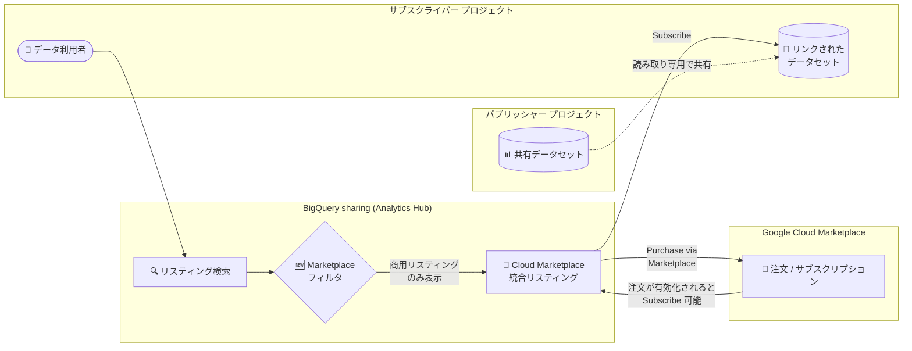

# BigQuery: Marketplace フィルタによる商用 BigQuery sharing リスティングの検索 (GA)

**リリース日**: 2026-07-27

**サービス**: BigQuery (BigQuery sharing / 旧 Analytics Hub)

**機能**: Marketplace フィルタで Google Cloud Marketplace の商用 BigQuery sharing リスティングを検索

**ステータス**: GA (一般提供)

📊 [このアップデートのインフォグラフィックを見る](https://takech9203.github.io/google-cloud-news-summary/20260727-bigquery-sharing-marketplace-filter.html)

## 概要

BigQuery sharing (旧 Analytics Hub) のリスティング検索画面に **Marketplace フィルタ** が追加され、一般提供 (GA) となりました。Google Cloud コンソールの「Sharing (Analytics Hub)」ページで「Listings > Marketplace」フィルタを適用することで、Google Cloud Marketplace で販売されている商用リスティング (Cloud Marketplace 統合リスティング) だけを素早く絞り込んで発見できるようになります。

BigQuery sharing と Cloud Marketplace の統合は、データパブリッシャーが自社のデータプロダクトを Marketplace 上で収益化し、サブスクライバーが Google やサードパーティの商用データセットを発見・購入・利用できる仕組みです。今回のアップデートは、この統合におけるサブスクライバー側の「発見 (Discovery)」体験を改善するもので、数多くのリスティングの中から購入可能な商用データプロダクトを効率的に見つけられるようになります。

対象ユーザーは、外部の商用データセット (金融、天候、地理空間データなど) を BigQuery で活用したいデータアナリスト・データエンジニアと、Marketplace 経由でデータプロダクトを販売するデータプロバイダーです。

**アップデート前の課題**

- リスティング検索のフィルタは「Listings (private / public / 組織内)」「Categories」「Location」「Provider」が中心で、Cloud Marketplace で購入可能な商用リスティングだけを直接絞り込む手段がなかった
- 商用リスティングを探すには、名前や説明でのキーワード検索や、カテゴリ・プロバイダーによる絞り込みの後、個々のリスティングを開いて「Purchase via Marketplace」ボタンの有無を確認する必要があった
- Cloud Marketplace 統合リスティングは Data Catalog / Knowledge Catalog にもインデックスされるが、リソースタイプとして個別にフィルタできないという制限がある (この制限は引き続き存在)

**アップデート後の改善**

- 「Listings > Marketplace」フィルタを適用するだけで、Cloud Marketplace の商用リスティングのみを一覧表示できるようになった
- 購入可能なデータプロダクトの発見から「Purchase via Marketplace」による購入、リンクされたデータセットの作成までの一連のフローがスムーズになった
- 本機能は GA として提供され、本番環境での利用が正式にサポートされる

## アーキテクチャ図



サブスクライバーは新しい Marketplace フィルタで商用リスティングを発見し、Cloud Marketplace 経由で購入すると、自プロジェクトにリンクされたデータセットが作成され、パブリッシャーの共有データセットを読み取り専用で利用できます。

## サービスアップデートの詳細

### 主要機能

1. **Marketplace フィルタによる商用リスティングの絞り込み (GA)**
   - 「Sharing (Analytics Hub)」ページの「Search listings」ダイアログで、「Listings > Marketplace」フィルタを適用可能
   - Cloud Marketplace で購入できる商用リスティング (Cloud Marketplace 統合リスティング) のみを素早く表示
   - 既存のフィルタ (Categories、Location、Provider) と組み合わせて利用可能

2. **発見から購入・サブスクライブまでの一貫したフロー**
   - 組織が未購入のリスティングは「Purchase via Marketplace」から Cloud Marketplace の注文フローに進み、サブスクリプションプランと購入詳細を指定して購入
   - 組織が購入済みのリスティングは「Subscribe」ボタンからプロジェクトとリンクされたデータセット名を指定してサブスクライブ
   - 同じ請求先アカウントを持つプロジェクトであれば、いずれもそのリスティングにサブスクライブ可能

3. **Cloud Marketplace 注文に基づく自動的なアクセス管理**
   - Cloud Marketplace 統合リスティングでは、Analytics Hub Subscriber ロールが Cloud Marketplace の注文に基づいて自動的にプロビジョニングされる
   - サブスクライブ権限がない場合は「Request access」からリクエストフォームを送信可能

## 技術仕様

### Cloud Marketplace 統合リスティングの構成要素

| 項目 | 詳細 |
|------|------|
| データプロダクト (Cloud Marketplace 上) | BigQuery sharing リスティングを選択し、料金モデル (有料/無料/トライアル) を設定して Marketplace に申請・公開したもの |
| Cloud Marketplace 統合リスティング | データプロダクトが承認・公開された BigQuery sharing リスティング。共有データセットをサポートし、購入可能になる |
| リンクされたリソース | サブスクライブ時にサブスクライバー プロジェクトに作成される読み取り専用のリンクされたデータセット。アクセスは有効な Cloud Marketplace 注文により管理される |

### 必要な IAM ロール (サブスクライバー側)

| タスク | 必要なロール |
|------|------|
| リスティングの発見 | Analytics Hub Viewer (`roles/analyticshub.viewer`) |
| 有料リスティングの購入 | Billing Account Administrator (`roles/billing.admin`) + Analytics Hub Viewer |
| サブスクライブ (リンクされたデータセット作成) | BigQuery User (`roles/bigquery.user`)。Marketplace 統合リスティングでは Subscriber ロールは注文に基づき自動付与 |

### 前提となる API

```bash
# Analytics Hub API の有効化
gcloud services enable analyticshub.googleapis.com
```

## 設定方法

### 前提条件

1. Analytics Hub API が有効化されていること
2. リスティングの発見には Analytics Hub Viewer ロール、有料リスティングの購入には Billing Account Administrator ロールが付与されていること

### 手順

#### ステップ 1: Marketplace フィルタで商用リスティングを検索

1. Google Cloud コンソールで「Sharing (Analytics Hub)」ページに移動
2. 「Search listings」をクリック
3. 「Filters」セクションで **「Listings > Marketplace」フィルタを適用** し、Cloud Marketplace の商用リスティングのみを表示
4. 目的のリスティングをクリック

#### ステップ 2: 購入またはサブスクライブ

- **組織が未購入の場合**: 「Purchase via Marketplace」→「Subscribe」をクリックし、注文サマリーでサブスクリプションプランと購入詳細を指定して利用規約に同意。注文の有効化後、「Manage on BigQuery sharing (Analytics Hub)」から Sharing ページに戻り「Subscribe」をクリック
- **組織が購入済みの場合**: 「Subscribe」をクリック

#### ステップ 3: リンクされたデータセットの作成

1. サブスクライブ時にプロジェクトとリンクされたデータセット名を指定して「Save」をクリック
2. 作成されたリンクされたデータセットは、通常の BigQuery テーブルと同様にクエリ可能 (読み取り専用)

## メリット

### ビジネス面

- **商用データの調達時間短縮**: 購入可能なデータプロダクトを 1 つのフィルタで一覧でき、データ調達の検討・比較が迅速になる
- **パブリッシャーの露出向上**: Marketplace で販売するデータプロバイダーにとって、商用リスティングがサブスクライバーに発見されやすくなり、販売機会の拡大につながる
- **調達・請求の一元化**: Cloud Marketplace 経由の購入となるため、既存の Google Cloud 請求先アカウントで商用データの支払いを一元管理できる

### 技術面

- **既存フィルタとの組み合わせ**: Categories、Location、Provider などの既存フィルタと組み合わせて、目的の商用データセットを効率的に絞り込める
- **データコピー不要の利用**: サブスクライブするとリンクされたデータセットが作成され、データの物理コピーなしで最新の共有データをクエリできる
- **アクセス管理の自動化**: Marketplace の注文に基づいて Subscriber ロールが自動プロビジョニングされ、個別の IAM 設定が不要

## デメリット・制約事項

### 制限事項

- BigQuery sharing の一般的な制限事項がすべて適用される
- パブリッシャーとサブスクライバーは、サポートされている Cloud Marketplace Agency Jurisdiction に所在している必要がある
- Cloud Marketplace 統合リスティングは Data Catalog (非推奨) / Knowledge Catalog にインデックスされるが、リソースタイプとして個別にフィルタすることはできない
- Cloud Marketplace 統合リスティングの課金使用量メトリクスは、プロバイダー使用量メトリクスや INFORMATION_SCHEMA ビューには記録されない
- データクリーンルームと Pub/Sub トピックは Cloud Marketplace 統合ではサポートされない

### 考慮すべき点

- 有料リスティングの購入には Billing Account Administrator ロールが必要なため、組織内の購入フローと権限設計を事前に確認する必要がある
- 一部のリスティングでは見積もり取得のためにフォーム送信による営業チームへの問い合わせが必要な場合がある
- リンクされたデータセットは読み取り専用であり、データやメタデータの編集、個々のリソースへの権限設定はできない

## ユースケース

### ユースケース 1: 外部商用データセットの調達と分析

**シナリオ**: 小売企業のデータ分析チームが、需要予測モデルの精度向上のために外部の天候データや人流データを探している。

**実装例**:
```
1. Sharing (Analytics Hub) ページ → Search listings
2. Filters で「Listings > Marketplace」を適用し、Categories で絞り込み
3. 候補リスティングを比較し、「Purchase via Marketplace」で購入
4. サブスクライブしてリンクされたデータセットを作成
5. 自社の売上データと JOIN して需要予測モデルの特徴量として活用
```

**効果**: 商用データの発見から購入、分析基盤への組み込みまでを BigQuery 内で完結でき、データ調達のリードタイムを大幅に短縮できる。

### ユースケース 2: データプロバイダーによるデータプロダクトの販売

**シナリオ**: データプロバイダーが自社の商用データセットを Cloud Marketplace で販売し、より多くの Google Cloud ユーザーにリーチしたい。

**効果**: Marketplace フィルタにより商用リスティングがサブスクライバーに発見されやすくなり、パブリッシャー・サブスクライバー モデルによって個々のトランザクションやサブスクリプションを手動管理することなく、スケーラブルにデータ提供を収益化できる。

## 料金

Marketplace フィルタ自体に追加料金はありません。商用リスティングの利用には以下が適用されます。

- 標準の BigQuery sharing 料金が適用される (リンクされたデータセットへのクエリはサブスクライバー側のクエリ料金として課金)
- Cloud Marketplace 統合リスティングには、パブリッシャー側に Cloud Marketplace のレベニューシェア要件が適用される
- データプロダクトの利用料金はパブリッシャーが設定した価格 (有料/無料/トライアル) に基づき、Cloud Marketplace 経由で請求される

詳細は [BigQuery sharing の料金](https://docs.cloud.google.com/bigquery/docs/analytics-hub-introduction#pricing) および [Cloud Marketplace プロダクトの請求管理](https://docs.cloud.google.com/marketplace/docs/manage-billing) を参照してください。

## 利用可能リージョン

BigQuery sharing がサポートするリージョンで利用できます。リスティングの検索ではデータエクスチェンジのロケーション単位でフィルタ可能です。詳細は [サポートされているリージョン](https://docs.cloud.google.com/bigquery/docs/analytics-hub-introduction#supported-regions) を参照してください。

## 関連サービス・機能

- **Google Cloud Marketplace**: 商用データプロダクトの公開・購入・請求を担うマーケットプレイス。BigQuery sharing との統合により、データプロダクトの収益化が可能
- **BigQuery sharing (Analytics Hub)**: 組織間・組織内でデータセットを大規模に共有するためのデータエクスチェンジ プラットフォーム。今回のフィルタ追加の対象機能
- **Cloud Marketplace Producer Portal**: パブリッシャーがデータプロダクトのオンボーディング、公開ステータス管理、オフボーディングを行うポータル
- **Knowledge Catalog (Dataplex)**: リンクされたデータセットを含むデータ資産の検索・カタログ管理。ただし Marketplace 統合リスティングのリソースタイプ フィルタには未対応
- **VPC Service Controls**: サブスクライバーが VPC Service Controls 境界内のプロジェクトを利用する場合、適切な上り (ingress) / 下り (egress) ルールの設定が必要

## 参考リンク

- 📊 [インフォグラフィック](https://takech9203.github.io/google-cloud-news-summary/20260727-bigquery-sharing-marketplace-filter.html)
- [公式リリースノート](https://docs.cloud.google.com/release-notes#July_27_2026)
- [ドキュメント: Cloud Marketplace 統合リスティングへのサブスクライブ](https://docs.cloud.google.com/bigquery/docs/analytics-hub-cloud-marketplace#subscribe)
- [ドキュメント: リスティングとデータエクスチェンジの表示とサブスクライブ](https://docs.cloud.google.com/bigquery/docs/analytics-hub-view-subscribe-listings)
- [料金: BigQuery sharing の料金](https://docs.cloud.google.com/bigquery/docs/analytics-hub-introduction#pricing)

## まとめ

BigQuery sharing のリスティング検索に Marketplace フィルタが GA として追加され、Cloud Marketplace で購入可能な商用データプロダクトの発見が大幅に容易になりました。外部の商用データセットの活用を検討しているチームは、まず「Listings > Marketplace」フィルタで利用可能なデータプロダクトを一覧し、購入に必要な IAM ロール (Billing Account Administrator など) と組織内の購入フローを整備することを推奨します。

---

**タグ**: BigQuery, BigQuery sharing, Analytics Hub, Cloud Marketplace, データ共有, データエクスチェンジ, GA
