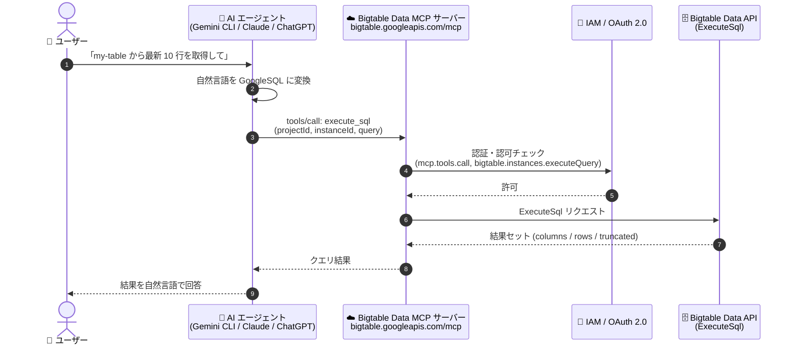

# Bigtable: リモート MCP サーバーが Data API (execute_sql ツール) をサポート (GA)

**リリース日**: 2026-07-27

**サービス**: Bigtable

**機能**: リモート MCP サーバーの Bigtable Data API サポート (execute_sql ツール)

**ステータス**: GA (一般提供)

📊 [このアップデートのインフォグラフィックを見る](https://takech9203.github.io/google-cloud-news-summary/20260727-bigtable-mcp-data-api-execute-sql-ga.html)

## 概要

Google Cloud は 2026 年 7 月 27 日に、Bigtable リモート MCP (Model Context Protocol) サーバーの Bigtable Data API サポートを一般提供 (GA) としてリリースした。Data MCP サーバーは `execute_sql` ツールを提供し、AI アプリケーションや AI エージェントが自然言語プロンプトから Bigtable のデータを SQL (GoogleSQL for Bigtable) で照会できるようになる。

Bigtable の MCP 対応は段階的に拡大しており、2026 年 2 月には Admin API の MCP サーバー (インスタンス・テーブル管理などのコントロールプレーン操作) がリリースされている ([関連レポート](2026-02-17-bigtable-admin-api-mcp-server.md))。今回の Data API 対応により、管理操作に加えてデータプレーンのクエリ実行も MCP プロトコル経由で可能となり、Bigtable の MCP サポートが管理とデータアクセスの両面をカバーする形になった。Bigtable リモート MCP サーバーは Bigtable API を有効化すると利用可能になる。

対象となるのは、Gemini CLI、ChatGPT、Claude などの AI アプリケーションや自社開発のエージェントから Bigtable のデータを参照したい開発者、および自然言語によるデータ探索・デバッグを実現したいデータエンジニアである。

**アップデート前の課題**

- AI エージェントから Bigtable のデータを照会するには、クライアントライブラリ (Java / Python / Go) や cbt CLI を使ったカスタム統合コードの開発が必要だった
- 2 月にリリースされた Admin API MCP サーバーは管理操作 (コントロールプレーン) が対象であり、テーブル内のデータを読み取るクエリ実行 (データプレーン) には対応していなかった
- 自然言語での Bigtable データ探索は、Bigtable Studio や Gemini によるSQL 作成支援など Console 上の機能に限られ、任意の MCP 対応 AI アプリケーションからは実現できなかった

**アップデート後の改善**

- Data MCP サーバーの `execute_sql` ツールにより、AI エージェントが自然言語プロンプトから GoogleSQL クエリを生成・実行し、Bigtable のデータを直接取得できるようになった
- GA となったため、Pre-GA 段階の制約なしに本番ワークロードでの利用を検討できるようになった
- OAuth 2.0 + IAM による認証・認可、Model Armor によるセキュリティ保護 (オプション)、監査ログといった Google Cloud リモート MCP サーバー共通のガバナンス機能をデータクエリにも適用できるようになった

## アーキテクチャ図



AI エージェントはユーザーの自然言語プロンプトを GoogleSQL クエリに変換し、MCP プロトコル経由で Bigtable Data MCP サーバーの `execute_sql` ツールを呼び出す。IAM / OAuth 2.0 による認証・認可を通過したリクエストが Bigtable Data API の ExecuteSql として実行され、結果セットがエージェントに返却される。

## サービスアップデートの詳細

### 主要機能

1. **execute_sql ツール (Data MCP サーバー)**
   - Bigtable インスタンスに対して GoogleSQL クエリを実行するツール
   - エンドポイントは `https://bigtable.googleapis.com/mcp` (Admin MCP サーバーの `https://bigtableadmin.googleapis.com/mcp` とは別)
   - 最低 10 MiB の proto シリアライズされた結果セットを返却 (1 行が 10 MiB を超える場合はその 1 行のみ)。パフォーマンス上の理由で 10 MiB を超える結果が返る場合もある
   - 動的ルーティング (データが存在するリージョンへのリクエスト転送) のため、HTTP リクエストの `x-goog-request-params` ヘッダーに `instance_name=<INSTANCE_NAME>` (完全修飾リソース名) を設定できる

2. **自然言語によるデータクエリ**
   - 「テーブル TABLE_ID から最大 10 行を取得して」のような自然言語プロンプトから、AI エージェントが GoogleSQL クエリを生成・実行
   - アプリプロファイル (`appProfileId`) を指定したレプリケーションルーティングの制御も自然言語で指示可能
   - `viewParameters` により、ユーザー ID などのアイデンティティに基づくデータのユーザーレベルスコーピングに対応 (VIEW_PARAMETERS() 関数の実行時値を提供)

3. **ツールの自動検出 (tools/list)**
   - `tools/list` メソッドで Data MCP サーバーが提供するツールを検出可能。`tools/list` の呼び出しに認証は不要
   - MCP inspector によるツール一覧の確認にも対応

4. **エンタープライズ向けセキュリティ・ガバナンス**
   - OAuth 2.0 + IAM による認証・認可 (API キーは非対応)
   - Data MCP サーバーの利用には Bigtable Reader ロール (`roles/bigtable.reader`) と MCP Tool User ロール (`roles/mcp.toolUser`) が必要
   - Model Armor によるプロンプト・レスポンスのセキュリティ保護 (オプション)、一元的な監査ログ

## 技術仕様

### MCP サーバーエンドポイント

| 項目 | 詳細 |
|------|------|
| Data API エンドポイント | `https://bigtable.googleapis.com/mcp` |
| Admin API エンドポイント | `https://bigtableadmin.googleapis.com/mcp` |
| トランスポート | HTTP (リモート MCP サーバー) |
| 認証方式 | OAuth 2.0 + IAM (API キー非対応) |
| 提供ツール (Data) | `execute_sql` |
| ステータス | GA (一般提供) |

### execute_sql の入力スキーマ (ExecuteSqlRequest)

| フィールド | 必須 | 説明 |
|-----------|------|------|
| `projectId` | 必須 | プロジェクト ID。不明な場合、エージェントは `gcloud config get-value project` で取得を試みる |
| `instanceId` | 必須 | インスタンス ID (`myinstance` 形式。完全修飾名ではない) |
| `appProfileId` | 任意 | レプリケーションのルーティング指定。未指定時はデフォルトアプリプロファイル |
| `query` | 必須 | SQL クエリ文字列 (GoogleSQL for Bigtable) |
| `viewParameters` | 任意 | VIEW_PARAMETERS() 関数の実行時値のマップ (ユーザーレベルのデータスコーピング用) |

出力 (ExecuteSqlResponse) は `columns` (カラムメタデータ)、`rows` (結果行)、`truncated` (結果が切り詰められたかどうか) で構成される。

### 必要な IAM ロールと権限

| 用途 | ロール | 主な権限 |
|------|--------|----------|
| MCP ツール呼び出し | MCP Tool User (`roles/mcp.toolUser`) | `mcp.tools.call` |
| Data MCP サーバーの利用 | Bigtable Reader (`roles/bigtable.reader`) | `bigtable.instances.executeQuery` |
| (参考) Admin MCP サーバーの利用 | Bigtable Administrator (`roles/bigtable.admin`) | `bigtable.instances.*`, `bigtable.tables.*` |

### OAuth スコープ

| スコープ | 説明 |
|----------|------|
| `https://www.googleapis.com/auth/bigtable.data` | Bigtable テーブルに保存されたデータへの読み書きアクセス |
| `https://www.googleapis.com/auth/bigtable.admin` | Bigtable リソースへのフルアクセス (Admin MCP サーバー用) |

## 設定方法

### 前提条件

1. Google Cloud プロジェクトで Bigtable API が有効化されていること (Bigtable リモート MCP サーバーは Bigtable API の有効化により利用可能になる)
2. 必要な IAM ロール (MCP Tool User、Bigtable Reader) が付与されていること
3. エージェント用に別のアイデンティティを作成することが推奨される (リソースアクセスの制御・監視のため)

### 手順

#### ステップ 1: MCP クライアントの設定

AI アプリケーションのリモート MCP サーバー追加画面で、以下の情報を入力する。

```text
サーバー名:   Bigtable Data MCP server
サーバー URL: https://bigtable.googleapis.com/mcp
トランスポート: HTTP
認証:         Google Cloud 認証情報 / OAuth クライアント ID とシークレット / エージェント ID
OAuth スコープ: https://www.googleapis.com/auth/bigtable.data
```

Web ベースのアプリケーションでは、クライアント ID・シークレット作成時にリダイレクト URI の許可リスト登録が必要 (カスタムリダイレクト URI は非対応)。

#### ステップ 2: ツール一覧の確認 (tools/list)

```bash
# Data MCP サーバーへの tools/list リクエスト (認証不要)
curl --location 'https://bigtable.googleapis.com/mcp' \
  --header 'content-type: application/json' \
  --data '{
    "jsonrpc": "2.0",
    "method": "tools/list"
  }'
```

#### ステップ 3: execute_sql ツールの呼び出し

```bash
curl --location 'https://bigtable.googleapis.com/mcp' \
  --header 'content-type: application/json' \
  --header 'accept: application/json, text/event-stream' \
  --data '{
    "method": "tools/call",
    "params": {
      "name": "execute_sql",
      "arguments": {
        "projectId": "PROJECT_ID",
        "instanceId": "INSTANCE_ID",
        "query": "SELECT * FROM myTable WHERE _key = '\''r1'\'' LIMIT 10"
      }
    },
    "jsonrpc": "2.0",
    "id": 1
  }'
```

AI アプリケーションからは、次のような自然言語プロンプトで同等の操作を実行できる。

```text
"Execute a query to retrieve up to 10 rows from the table TABLE_ID
 in instance INSTANCE_ID in project PROJECT_ID."

"Run a SQL query against instance INSTANCE_ID under project PROJECT_ID:
 SELECT _key, column_family, value FROM TABLE_ID WHERE row_key LIKE USER_ID."

"Retrieve data from Bigtable instance INSTANCE_ID, project PROJECT_ID
 using app profile APP_PROFILE_ID with the query:
 SELECT * FROM TABLE_ID WHERE cf1['status'] = 'ERROR'."
```

## メリット

### ビジネス面

- **データ活用の民主化**: Bigtable のスキーマ設計や API 仕様を熟知していなくても、自然言語でデータを照会でき、データ探索の裾野が広がる
- **GA による本番採用の後押し**: Pre-GA 段階の利用制約がなくなり、エンタープライズの本番ワークフローに AI エージェント経由の Bigtable データアクセスを組み込みやすくなった
- **運用・デバッグの迅速化**: 障害調査時に「status が ERROR の行を出して」のような指示でデータを即座に確認でき、インシデント対応時間の短縮が期待できる

### 技術面

- **標準化されたデータアクセス**: MCP プロトコルにより、Gemini CLI、ChatGPT、Claude、カスタムエージェントなど複数の AI アプリケーションから統一インターフェースで Bigtable データを照会できる
- **Admin + Data の一貫した MCP 体験**: Admin MCP サーバー (管理操作) と Data MCP サーバー (クエリ実行) を組み合わせ、テーブル作成からデータ確認までを AI エージェントで一気通貫に実行できる
- **きめ細かいアクセス制御**: Data MCP サーバーは読み取り系ロール (`roles/bigtable.reader`) で利用でき、管理権限と分離した最小権限運用が可能。`viewParameters` によるユーザーレベルのデータスコーピングにも対応

## デメリット・制約事項

### 制限事項

- `execute_sql` で使用する GoogleSQL for Bigtable は現行リリースで `SELECT` 以外の DML (`INSERT` / `UPDATE` / `DELETE`)、DDL (`CREATE` / `ALTER` / `DROP`)、サブクエリ・`JOIN`・`UNION`・CTE などの構文をサポートしていない
- 結果セットには切り詰め (`truncated`) が発生する場合がある。ツールは最低 10 MiB の proto シリアライズされた結果を返す仕様であり、大規模な結果の取得には向かない
- API キーによる認証は非対応。OAuth 2.0 + IAM が必須

### 考慮すべき点

- SQL クエリは NoSQL データリクエストと同様にクラスタノードで処理されるため、フルテーブルスキャンや複雑なフィルタを避けるなど、Bigtable の読み取りベストプラクティスが適用される。AI エージェントが生成するクエリが意図せずフルスキャンとなり、本番クラスタの性能に影響する可能性に注意が必要
- エージェント用には専用のアイデンティティを作成し、アクセスの制御・監視を行うことが推奨される
- 動的ルーティングを利用する場合は `x-goog-request-params` ヘッダーへの `instance_name` の設定が必要になる

## ユースケース

### ユースケース 1: 自然言語による本番データのアドホック調査

**シナリオ**: アプリケーションでエラーが多発した際、運用担当者が Gemini CLI や Claude Code から「instance my-instance の events テーブルで cf1['status'] = 'ERROR' の行を取得して」と指示し、エラーレコードを即座に確認する。

**実装例**:
```text
ユーザー: "Retrieve data from Bigtable instance my-instance, project my-project
          with the query: SELECT * FROM events WHERE cf1['status'] = 'ERROR'"

AI エージェント:
  1. execute_sql ツールを呼び出し (projectId, instanceId, query を設定)
  2. Bigtable Data API がクエリを実行
  3. 結果セット (columns / rows) を受信し、要約して報告
```

**効果**: cbt CLI やクライアントライブラリのセットアップなしに、AI アプリケーションから直接データを確認でき、調査の初動が速くなる。

### ユースケース 2: Admin + Data MCP サーバーを組み合わせたエージェントワークフロー

**シナリオ**: AI エージェントが Admin MCP サーバーでテーブル一覧・スキーマを確認した後、Data MCP サーバーの `execute_sql` でサンプルデータを照会し、データ構造のドキュメント化やデータ品質チェックを一括で実施する。

**効果**: コントロールプレーンとデータプレーンの操作を単一のエージェント会話の中で完結でき、データベースのオンボーディングや監査作業の生産性が向上する。

## 料金

Bigtable Data MCP サーバー自体の追加料金についての公式情報は確認できていない。`execute_sql` による SQL クエリは他のデータリクエストと同様に Bigtable のクラスタノードで処理されるため、基盤となる Bigtable のノード・ストレージ・ネットワーク料金が適用される。

| 項目 | 料金 (概算、us-central1) |
|------|--------------------------|
| ノード (SSD) | $0.65/ノード/時間 (オンデマンド) |
| SSD ストレージ | $0.17/GB/月 |
| HDD ストレージ | $0.026/GB/月 |

詳細は [Bigtable 料金ページ](https://cloud.google.com/bigtable/pricing) を参照。

## 関連サービス・機能

- **Bigtable Admin API MCP サーバー**: 2026 年 2 月に Preview として提供開始された管理操作用の MCP サーバー (`https://bigtableadmin.googleapis.com/mcp`)。インスタンス・テーブルの作成・一覧・削除などを提供し、今回の Data MCP サーバーと補完関係にある
- **GoogleSQL for Bigtable**: `execute_sql` で使用するクエリ言語。BigQuery や Spanner でも採用されている ANSI 準拠の SQL で、カラムファミリーをマップ型として扱う Bigtable 向けの拡張を持つ
- **Database Insights MCP サーバー**: Bigtable のパフォーマンス・システムメトリクスを照会・分析するツールを提供する別のリモート MCP サーバー
- **Google Cloud MCP サーバーエコシステム**: BigQuery、Cloud SQL、Spanner、Firestore など多数のサービスがリモート MCP サーバーを提供しており、マルチサービスのエージェントワークフローを構築できる
- **Model Armor**: MCP のプロンプトとレスポンスに対するセキュリティ保護をオプションで提供

## 参考リンク

- 📊 [インフォグラフィック](https://takech9203.github.io/google-cloud-news-summary/20260727-bigtable-mcp-data-api-execute-sql-ga.html)
- [公式リリースノート](https://docs.cloud.google.com/release-notes#July_27_2026)
- [Use the Bigtable remote MCP server](https://docs.cloud.google.com/bigtable/docs/use-bigtable-mcp)
- [Bigtable MCP リファレンス](https://docs.cloud.google.com/bigtable/docs/reference/admin/mcp)
- [execute_sql ツールリファレンス](https://docs.cloud.google.com/bigtable/docs/reference/data/mcp/tools_list/execute_sql)
- [GoogleSQL for Bigtable overview](https://docs.cloud.google.com/bigtable/docs/googlesql-overview)
- [MCP サーバーへの認証](https://docs.cloud.google.com/mcp/authenticate-mcp)
- [Google Cloud MCP サーバー概要](https://docs.cloud.google.com/mcp/overview)
- [Bigtable 料金ページ](https://cloud.google.com/bigtable/pricing)
- [関連レポート: Bigtable Admin API MCP Server (Preview)](2026-02-17-bigtable-admin-api-mcp-server.md)

## まとめ

Bigtable リモート MCP サーバーの Data API サポート (execute_sql ツール) の GA により、AI エージェントは管理操作に加えてデータクエリまでを標準化された MCP プロトコルで実行できるようになった。2 月の Admin API MCP サーバー (Preview) から続く Bigtable の MCP 対応拡大の中で、初の GA 機能として本番利用への道が開かれた点が重要である。まずは読み取り専用ロール (`roles/bigtable.reader`) と専用エージェントアイデンティティを組み合わせた最小権限構成で、非クリティカルなテーブルに対する自然言語クエリから導入を始めることを推奨する。

---

**タグ**: #Bigtable #MCP #ModelContextProtocol #AIAgent #DataAPI #executeSQL #GoogleSQL #GA #GoogleCloud #NoSQL
