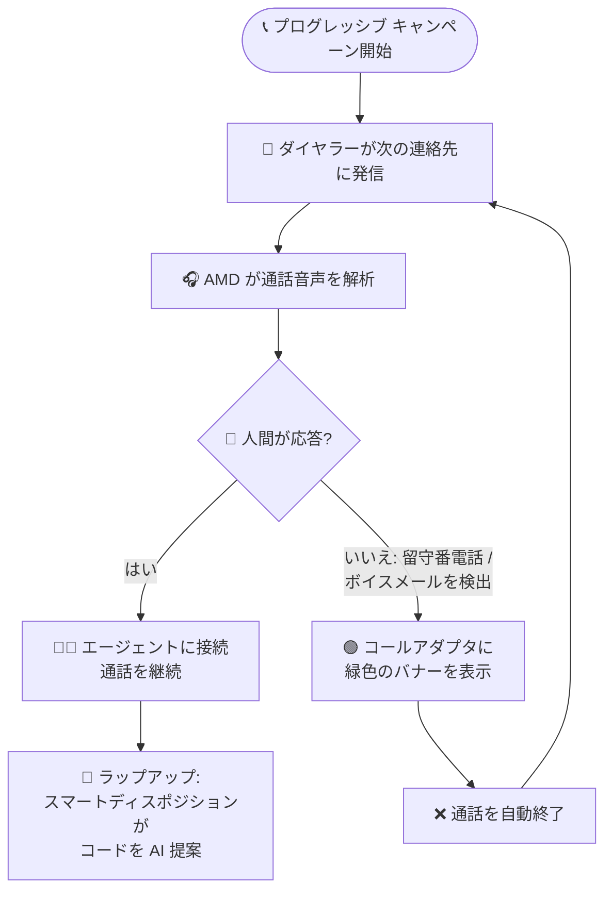

# Google Cloud Contact Center as a Service: 次期バージョンのプレリリースノート (留守番電話検出、メール API、スマートディスポジション)

**リリース日**: 2026-07-27

**サービス**: Google Cloud Contact Center as a Service (CCaaS / CCAI Platform)

**機能**: 留守番電話検出 (AMD)、メール解析データ API、メール転送 (添付ファイル対応)、スマートディスポジション

**ステータス**: プレリリース (次期バージョンで提供予定の機能の事前告知)

📊 [このアップデートのインフォグラフィックを見る](https://takech9203.github.io/google-cloud-news-summary/20260727-ccaas-prerelease-amd-email-smart-disposition.html)

## 概要

Google Cloud Contact Center as a Service (CCaaS、旧称 CCAI Platform) の次期バージョンに関するプレリリースノートが公開されました。今回のプレリリースノートでは、プログレッシブ アウトバウンド キャンペーン向けの留守番電話検出 (AMD: Answering Machine Detection)、メールの解析済みデータを取得する 2 つの新しい読み取り専用 API エンドポイント、添付ファイル付きメール転送、AI によるディスポジション コード提案 (スマートディスポジション) という 4 つの新機能が発表されています。

これらの機能は、アウトバウンド コールセンターの運用効率化、メールチャネルの外部システム連携、エージェントのラップアップ (後処理) 作業の省力化という、コンタクトセンター運用の主要な課題に対応するものです。あわせて、通話処理、チャット、メール、レポーティング、外部連携 (Kustomer、ServiceNow、Calabrio など) に関する多数のバグ修正も含まれています。

**注意**: 本レポートはプレリリースノートに基づいており、記載された機能は次期バージョンで提供が予定されているものです。実際のリリース時に内容が変更される可能性があります。

**アップデート前の課題**

- プログレッシブ キャンペーンでは、留守番電話やボイスメールが応答した場合もエージェントに接続されるため、エージェントが手動で切断して次の連絡先に進む必要があり、時間が浪費されていた
- Apps API にはメールの解析済みコンテンツ (送信者、宛先、件名、本文、添付ファイル情報) を取得するエンドポイントがなく、外部システムからメールセッションの詳細データにプログラムでアクセスすることが困難だった
- エージェントがメールアダプタから外部の宛先にメールを転送する手段がなかった
- セッション終了後のラップアップでは、エージェントがディスポジション リストから手動でコードを検索・選択する必要があり、後処理時間の増加や入力ミスの原因となっていた

**アップデート後の改善**

- AMD が通話音声を解析して人間か留守番電話かを判定し、留守番電話を検出すると自動的に通話を終了して次の連絡先のダイヤルに進むため、エージェントは実際の人間との会話に集中できるようになる
- 2 つの新しい読み取り専用 API エンドポイントにより、メールセッションのサマリーとメッセージ一覧、および個々のメールの解析済み全文コンテンツを外部システムから取得できるようになる
- メールアダプタに新しい「Forward」ボタンが追加され、添付ファイルを自動的に含めた外部宛先へのメール転送が可能になる (送信前に添付ファイルの削除も可能)
- AI がセッション内容に基づいてディスポジション コードを提案するスマートディスポジションにより、ラップアップ作業が効率化される

## アーキテクチャ図



留守番電話検出 (AMD) を有効化したプログレッシブ キャンペーンの通話フローです。AMD が留守番電話を検出すると通話を自動終了し、ダイヤラーは次の連絡先へ進みます。人間が応答した場合はエージェントに接続され、通話終了後はスマートディスポジションがラップアップを支援します。

## サービスアップデートの詳細

### 主要機能

1. **留守番電話検出 (AMD: Answering Machine Detection)**
   - プログレッシブ アウトバウンド キャンペーンで、通話音声を解析して応答したのが人間か留守番電話 (ボイスメール) かを判定する
   - 留守番電話を検出した場合、通話は自動的に終了し、ダイヤラーはキャンペーンリストの次の連絡先の発信に進む
   - **Settings > Campaigns > Dialer Modes** に新しい「Enable Answering Machine Detection」トグルが追加される
   - 留守番電話が検出されると、コールアダプタに緑色のバナーが表示される

2. **メール解析データ エンドポイント (Apps API)**
   - Apps API に 2 つの新しい読み取り専用エンドポイントが追加される
   - `/apps/api/v1/email/sessions/{email_support_id}`: メールセッションのサマリーとメッセージ一覧を取得
   - `/apps/api/v1/email/messages/{email_thread_id}`: 個々のメールの解析済み全文コンテンツ (送信者、宛先、件名、本文、添付ファイルのメタデータ) を取得
   - 既存の Apps API と同様に Basic 認証を使用し、外部システムとの統合に活用できる

3. **添付ファイル付きメール転送**
   - エージェントがメールアダプタから外部の宛先にメールを転送できるようになる
   - メールアダプタに新しい「Forward」ボタンが追加される
   - 添付ファイルは自動的に転送メールに含まれ、送信前に個別に削除することも可能
   - 転送しても元のメールは元のキューに残ったままとなり、対応フローに影響しない

4. **スマートディスポジション (Smart Disposition)**
   - セッション終了時のラップアップで、AI がセッション内容に基づいてディスポジション コードを提案する
   - **Settings > Operation Management > Wrap-up** に、インバウンド コール、アウトバウンド コール、チャットそれぞれのトグルが追加される
   - 従来の手動によるディスポジション コード検索・選択作業を支援し、後処理時間を短縮する

5. **バグ修正**
   - 通話処理、チャット、メール、レポーティングに関する多数の不具合が修正される
   - Kustomer、ServiceNow、Calabrio などの外部連携 (CRM / WFM インテグレーション) に関する修正も含まれる

## 技術仕様

### 新機能の設定場所

| 機能 | 設定場所 | 対象チャネル |
|------|---------|-------------|
| 留守番電話検出 (AMD) | Settings > Campaigns > Dialer Modes の「Enable Answering Machine Detection」トグル | プログレッシブ アウトバウンド キャンペーン |
| スマートディスポジション | Settings > Operation Management > Wrap-up のトグル | インバウンド コール / アウトバウンド コール / チャット |
| メール転送 | メールアダプタの「Forward」ボタン (エージェント操作) | メール |
| メール解析データ API | Apps API (読み取り専用) | メール |

### 新しい Apps API エンドポイント

| エンドポイント | メソッド | 取得できる情報 |
|---------------|---------|---------------|
| `/apps/api/v1/email/sessions/{email_support_id}` | GET | メールセッションのサマリーとメッセージ一覧 |
| `/apps/api/v1/email/messages/{email_thread_id}` | GET | メールの解析済み全文コンテンツ (送信者、宛先、件名、本文、添付ファイルのメタデータ) |

Apps API のベース URL は `https://{subdomain}.{domain}/apps/api/v1` で、Basic 認証 (サブドメインを username、API トークンを password として使用) が必要です。API クレデンシャルは CCaaS ポータルの **Settings > Developer Settings > API Credentials** で作成します。既存の Apps API にはリクエストレートの制限 (顧客あたり 10 リクエスト/秒) があります。

## 設定方法

### 前提条件

1. CCaaS (CCAI Platform) の次期バージョンが適用されていること (本機能はプレリリースノートに記載された次期バージョンの機能)
2. AMD を利用する場合: プログレッシブ キャンペーンが構成済みであること (キュー作成、キャンペーンリスト CSV のアップロードなど)
3. メール API を利用する場合: Apps API の API クレデンシャルが作成済みであること

### 手順

#### ステップ 1: 留守番電話検出の有効化

1. CCaaS ポータルで **Settings > Campaigns > Dialer Modes** に移動
2. 「Enable Answering Machine Detection」トグルをオンにする

以降、プログレッシブ キャンペーンで留守番電話が検出されると、コールアダプタに緑色のバナーが表示され、通話は自動終了して次の連絡先に進みます。

#### ステップ 2: スマートディスポジションの有効化

1. CCaaS ポータルで **Settings > Operation Management > Wrap-up** に移動
2. インバウンド コール、アウトバウンド コール、チャットのうち、有効化したいセッション種別のトグルをオンにする

#### ステップ 3: メール解析データ API の呼び出し例

```bash
# メールセッションのサマリーとメッセージ一覧を取得
curl -u "{subdomain}:{api_token}" \
  -H "Accept: application/json" \
  "https://{subdomain}.{domain}/apps/api/v1/email/sessions/{email_support_id}"

# メールの解析済み全文コンテンツを取得
curl -u "{subdomain}:{api_token}" \
  -H "Accept: application/json" \
  "https://{subdomain}.{domain}/apps/api/v1/email/messages/{email_thread_id}"
```

## メリット

### ビジネス面

- **アウトバウンド キャンペーンの生産性向上**: AMD により、エージェントが留守番電話の対応に時間を取られなくなり、実際の顧客との会話時間 (トークタイム) の比率が向上する
- **後処理時間 (ACW) の短縮**: スマートディスポジションによる AI 提案で、ラップアップにかかる時間を削減し、エージェントの処理件数を増やせる
- **メール対応の柔軟性向上**: 社外の担当部門や委託先へのメール転送が添付ファイル込みでアダプタ内から直接行えるようになり、対応のたらい回しやコピー&ペースト作業が減る

### 技術面

- **外部システム統合の強化**: メール解析データ エンドポイントにより、メールの全文や添付ファイル メタデータを外部のデータ基盤・分析システム・カスタムアプリケーションに取り込める
- **データ品質の向上**: AI によるディスポジション コード提案により、コード選択の一貫性が高まり、レポーティングや品質分析の精度向上が期待できる
- **既存フローへの影響が小さい設計**: メール転送後も元のメールは元のキューに残るため、既存のキュー運用やレポーティングへの影響を抑えられる

## デメリット・制約事項

### 制限事項

- 本内容はプレリリースノートであり、記載された機能は次期バージョンで提供予定のもの。一般提供 (GA) 前に仕様が変更される可能性がある
- メール解析データ エンドポイントは読み取り専用であり、メールの作成・更新には使用できない
- AMD の対象はプログレッシブ アウトバウンド キャンペーンとして案内されている

### 考慮すべき点

- AMD は通話音声の解析に基づく判定であるため、検出精度や判定にかかる時間は実環境での検証が推奨される
- スマートディスポジションは AI による「提案」であり、最終的なコード選択の責任はエージェントにある。既存のディスポジション リスト設計 (階層構造など) との整合性を確認しておくとよい
- アウトバウンド キャンペーンの運用では、従来どおり Do Not Call (DNC) リストとの照合や各国の放棄呼率規制などのコンプライアンス要件に注意が必要
- メール転送機能により社外へ添付ファイルが送信できるようになるため、情報漏えい防止の観点から運用ルールの整備を検討する

## ユースケース

### ユースケース 1: 督促・フォローアップ架電キャンペーンの効率化

**シナリオ**: 金融機関が支払いリマインドのプログレッシブ キャンペーンを実施しているが、架電の相当数が留守番電話につながり、エージェントが手動で切断する時間が積み重なって生産性を圧迫している。

**実装例**: Settings > Campaigns > Dialer Modes で「Enable Answering Machine Detection」を有効化し、既存のプログレッシブ キャンペーンをそのまま実行する。

**効果**: 留守番電話への接続が自動で切断・スキップされ、エージェントは人間が応答した通話のみに対応する。キャンペーンあたりの有効会話数が増加し、リスト消化速度も向上する。

### ユースケース 2: メール対応データの分析基盤への取り込み

**シナリオ**: サポート部門がメールチャネルの問い合わせ内容を BigQuery 上の分析基盤に取り込み、問い合わせ傾向の分析や品質管理に活用したい。

**実装例**:
```bash
# セッション ID からメッセージ一覧を取得し、各メッセージの全文を取得して分析基盤にロード
curl -u "{subdomain}:{api_token}" \
  "https://{subdomain}.{domain}/apps/api/v1/email/sessions/{email_support_id}"
```

**効果**: 従来取得が難しかったメールの解析済みコンテンツ (件名、本文、添付ファイル メタデータ) をプログラムで取得でき、ETL パイプラインによる自動収集と分析が可能になる。

### ユースケース 3: ラップアップ作業の標準化と短縮

**シナリオ**: 多数のディスポジション コードを階層化して運用しているコンタクトセンターで、エージェントによるコード選択のばらつきと後処理時間の長さが課題になっている。

**効果**: スマートディスポジションを有効化することで、AI がセッション内容に基づいてコードを提案し、エージェントは提案を確認・確定するだけでよくなる。コード選択の一貫性が向上し、レポーティング精度と後処理時間の両方が改善する。

## 料金

プレリリースノートには本機能群に関する追加料金の情報は記載されていません。CCaaS の料金は、同時利用ライセンスまたは月間アクティブユーザーに基づく体系です。詳細は料金ページを参照してください。

- [Google Cloud CCaaS 料金](https://cloud.google.com/solutions/contact-center-ai-platform/pricing)

## 利用可能リージョン

プレリリースノートにはリージョン固有の記載はありません。次期バージョンの適用スケジュールはインスタンスごとに異なる場合があるため、詳細は公式リリースノートおよびドキュメントを確認してください。

## 関連サービス・機能

- **アウトバウンド キャンペーン (Preview / Predictive / Progressive)**: AMD が追加されるプログレッシブ モードのほか、エージェントが手動発信する Preview、複数番号を同時発信する Predictive の 3 つのダイヤルモードがある。Predictive では従来からビジー信号やボイスメールのスクリーニングが行われていた
- **Apps API / Manager API**: CCaaS の外部統合用 API 群。今回のメール解析データ エンドポイントは Apps API に追加される
- **ディスポジション コードとリスト**: ラップアップでセッション結果を分類する仕組み。スマートディスポジションはこの既存の仕組みを AI で拡張する
- **Agent Assist**: 通話・チャットの要約 (セッション サマライゼーション) などエージェント支援機能。スマートディスポジションとあわせてラップアップ作業全体の効率化に寄与する
- **CRM / WFM 連携 (Salesforce、Kustomer、ServiceNow、Calabrio など)**: 今回のバグ修正には Kustomer、ServiceNow、Calabrio 連携に関する修正が含まれる

## 参考リンク

- 📊 [インフォグラフィック](https://takech9203.github.io/google-cloud-news-summary/20260727-ccaas-prerelease-amd-email-smart-disposition.html)
- [公式リリースノート](https://docs.cloud.google.com/release-notes#July_27_2026)
- [プログレッシブ キャンペーンのドキュメント](https://docs.cloud.google.com/contact-center/ccai-platform/docs/campaign-progressive)
- [キャンペーン管理のドキュメント](https://docs.cloud.google.com/contact-center/ccai-platform/docs/campaign-management)
- [Apps API のドキュメント](https://docs.cloud.google.com/contact-center/ccai-platform/docs/apps-api)
- [ディスポジション コードとリストのドキュメント](https://docs.cloud.google.com/contact-center/ccai-platform/docs/disposition-note)
- [料金ページ](https://cloud.google.com/solutions/contact-center-ai-platform/pricing)

## まとめ

CCaaS の次期バージョンでは、留守番電話検出によるアウトバウンド キャンペーンの効率化、メール解析データ API による外部統合の強化、添付ファイル付きメール転送、AI によるスマートディスポジションと、コンタクトセンター運用の生産性に直結する機能が揃って追加される予定です。アウトバウンド キャンペーンやメールチャネルを運用している組織は、次期バージョンの適用スケジュールを確認し、AMD やスマートディスポジションの有効化、メール API を活用した分析基盤連携の設計を今のうちに検討しておくことを推奨します。

---

**タグ**: #CCaaS #CCAIPlatform #ContactCenter #AnsweringMachineDetection #OutboundCampaign #AppsAPI #Email #SmartDisposition #AI #プレリリース
