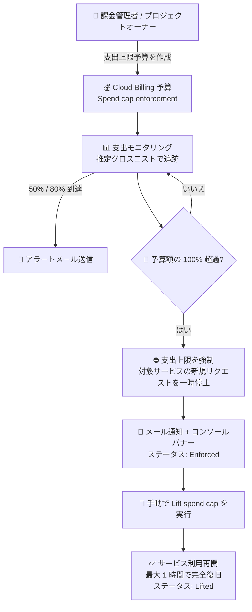

# Cloud Billing: 支出上限予算 (Spend Cap Budgets) が Preview で利用可能に

**リリース日**: 2026-07-27

**サービス**: Cloud Billing

**機能**: 支出上限予算 (Spend Cap Budgets)

**ステータス**: Preview

📊 [このアップデートのインフォグラフィックを見る](https://takech9203.github.io/google-cloud-news-summary/20260727-cloud-billing-spend-cap-budgets.html)

## 概要

Cloud Billing の予算機能に、支出が予算額を超えた際に対象サービスの利用を自動的に一時停止する「支出上限予算 (Spend Cap Budgets)」が Preview として追加されました。対象となる一部の適格サービス (Gemini API、Gemini Enterprise Agent Platform (旧 Vertex AI)、Cloud Run、Cloud Run functions) に対して支出上限予算を構成すると、指定したプロジェクト内で使用コストが予算のターゲット金額を超過した時点で上限が強制 (enforce) され、対象サービスへの新規リクエストが一時停止されます。上限を手動で解除するまで、それ以上の使用コストは発生しません。

支出上限は、多くの場合、実際のコストではなく推定コスト (estimated costs) を使用してアラートと上限をトリガーします。これにより、実際のコストが処理されて課金レポートに表示されるよりもはるかに速く上限を強制できます。ただし、レポートより速いとはいえ強制は即時ではなく、コスト報告の遅延により発生した超過分は通常どおり課金される点に注意が必要です。

予期しないコストや暴走コスト (runaway costs) のリスクを抑えたい開発者や、AI ワークロード・サーバーレスワークロードの支出をハードリミットで管理したいチームにとって、待望のコスト制御メカニズムです。同日、Cloud Run 側でも予算の支出上限による Cloud Run ワークロードの一時停止のサポートが Preview として発表されています (別レポートで解説)。

**アップデート前の課題**

- 従来の Cloud Billing の予算はアラート専用であり、予算を超過しても通知が送られるだけで、使用量やコストの発生を自動的に止めることはできなかった
- コストを強制的に止めるには、Pub/Sub 通知と Cloud Run functions などを組み合わせて課金の無効化やリソース停止を自前で実装する必要があった
- LLM API の呼び出しループやサーバーレスの暴走など、短時間でコストが急増するケースに対して、標準機能では支出のハードリミットを設定できなかった

**アップデート後の改善**

- 予算作成時に「Spend cap enforcement」オプションを選択するだけで、支出が予算額を超えた際に対象サービスの新規利用を自動的に一時停止できるようになった
- 推定コスト (directional costs) に基づく高速な強制により、実際のコストが課金レポートに反映されるのを待つよりもはるかに速く上限を適用できるようになった
- 予算額の 50%、80%、100% 到達時に課金管理者とプロジェクトオーナーへ自動でメールアラートが送信され、強制時には課金コンソールにバナーも表示されるようになった

## アーキテクチャ図



支出上限予算は推定グロスコストで支出を追跡し、50%・80% でアラートを送信、100% 超過で対象サービスの新規利用を自動停止します。停止の解除は手動操作 (Lift spend cap) が必要で、解除後は最大 1 時間でサービスが完全に復旧します。

## サービスアップデートの詳細

### 主要機能

1. **支出超過時の使用量自動一時停止**
   - 指定したプロジェクト内で、特定サービスの推定グロス使用コストが予算のターゲット金額を超過すると、支出上限が強制される
   - 強制中は対象サービスの新規使用がすべてブロックされ、オンデマンド (従量課金) 利用に加え、確約利用割引 (CUD) や Provisioned Throughput (PT) でカバーされる使用も一時停止される
   - 処理中 (in-flight) のリクエストは完了まで処理され、該当分の料金は発生する
   - リソースやデータは削除されず、他のプロジェクトや他のサービスには影響しない

2. **推定コストによる高速な強制**
   - 一部のサービスでは、実際のコストよりも速く方向性のある推定コスト (directional costs) を算出でき、この推定コストがターゲット金額に達した時点で上限を強制する
   - 推定コストはコストレポートには表示されず、実際のコストは従来どおりのレイテンシでレポートに反映される
   - 推定コストを利用できないサービスは、通常のコスト報告レイテンシに従う

3. **自動アラートとステータス管理**
   - 予算額の 50%、80%、100% で、すべての課金管理者とプロジェクトオーナーに自動でメールアラートが送信される (アラートと受信者はカスタマイズ不可)
   - 強制時には課金コンソールの「予算とアラート」ページと課金概要ページにバナーが表示される
   - Budgets ダッシュボードの「Spend cap status」列で、Not applicable / Configured / Enforced / Lifted のステータスを確認できる

4. **手動による上限解除 (Lift spend cap)**
   - 強制された上限は、課金コンソールで予算を編集して「Lift spend cap」を実行するまで解除されない
   - 同一課金月内に強制・解除された場合、ターゲット金額を引き上げない限りその月内には再トリガーされない
   - 前月に強制された上限は解除後にリセットされ、当月の予算期間でコストが閾値を超えると再びトリガーされる
   - 解除後、サービスが完全に復旧するまで最大 1 時間かかる場合がある

## 技術仕様

### 支出上限予算の仕様

| 項目 | 詳細 |
|------|------|
| ステータス | Preview (Pre-GA Offerings Terms が適用) |
| 適格サービス | Gemini API、Gemini Enterprise Agent Platform (旧 Vertex AI)、Cloud Run、Cloud Run functions |
| スコープ | 1 予算につき単一プロジェクト + 単一の適格サービス |
| 期間 (Time range) | Monthly 固定 (毎月 1 日開始、変更不可) |
| 予算タイプ | Specified amount (指定金額) 固定 |
| コスト計算 | グロスコスト基準 (割引・クレジットは含まない)。推定コストを利用できるサービスは推定グロスコストで強制 |
| アラート閾値 | 50% / 80% / 100% (自動設定、カスタマイズ不可) |
| 通知先 | 課金アカウント管理者およびプロジェクトオーナー (カスタマイズ不可) |
| 強制の対象 | オンデマンド利用、CUD / Provisioned Throughput でカバーされる利用 |
| 強制の対象外 | 永続リソース (コンピュート・ストレージなど) の継続的な固定利用、サブスクリプション型コスト |
| 重複防止 | 同一スコープの予算を複数作成できない重複排除ポリシーあり |

### 必要な権限

以下のいずれかのロール構成で支出上限予算を作成・管理できます。

| 構成 | ロール |
|------|--------|
| 構成 1 | 課金アカウントに対する Billing Account Administrator (`billing.admin`) |
| 構成 2 | 対象プロジェクトに対する Project Owner |
| 構成 3 (組み合わせ) | 課金アカウントに対する Billing Account Costs Manager (`billing.costsManager`) + 対象プロジェクトに対する Project Editor |

## 設定方法

### 前提条件

1. 対象プロジェクトが Cloud Billing アカウントにリンクされていること
2. 上記「必要な権限」のいずれかのロール構成を保有していること
3. 対象サービスが適格サービス (Gemini API、Agent Platform、Cloud Run、Cloud Run functions) であること

### 手順

#### ステップ 1: 支出上限予算の作成

1. Google Cloud コンソールで「予算とアラート (Budgets & alerts)」ページに移動する
2. 「Create new budget」をクリックする
3. Define セクションで「Spend cap enforcement」オプションを選択し (「Alerts only」ではなく)、予算名を入力する

注意: 既存のアラート専用予算を支出上限予算に変換することはできません。同様のスコープで支出上限を設定するには、アラート専用予算を削除して新規に支出上限予算を作成します。

#### ステップ 2: スコープと金額の設定

1. Scope セクションで、単一のプロジェクトと単一の適格サービスを選択する (Time range は Monthly 固定)
2. Amount セクションで上限のターゲット金額を入力する (Budget type は Specified amount 固定)
3. Actions セクションで通知設定を確認する (50% / 80% / 100% の通知が自動構成され、変更不可)
4. 「Finish」をクリックして保存・有効化する

強制は即時ではないため、絶対的な上限よりもやや低めに予算を設定することが公式ドキュメントで推奨されています。

#### ステップ 3: 強制された上限の解除 (必要時)

1. 「予算とアラート」ページの支出上限の情報バナーから「View spend cap details」を選択する
2. 対象の予算名をクリックして編集画面を開く
3. 「Lift spend cap」を選択し、「Confirm」をクリックして解除する

## メリット

### ビジネス面

- **予期しないコストの防止**: LLM API の暴走やサーバーレスワークロードの想定外のスパイクなど、短時間で急増するコストに対してハードリミットを設定でき、月次予算の超過リスクを大幅に低減できる
- **運用負荷の削減**: 従来 Pub/Sub + Cloud Run functions などで自前実装していたコスト強制停止の仕組みが、コンソールの予算設定だけで実現できる
- **AI Studio との一貫した保護**: AI Studio で提供されていた支出上限付き予算と同じ保護を、Cloud Billing コンソール経由でより広いサービスに拡張して利用できる

### 技術面

- **推定コストベースの高速強制**: 課金レポートへの反映を待たず、推定コストに基づいて上限を強制するため、コスト暴走への反応が速い
- **安全な停止動作**: リソースやデータは削除されず、処理中のリクエストは完了まで処理される。停止対象は指定プロジェクト内の指定サービスの新規利用のみで、他のプロジェクト・サービスへの影響がない
- **ステータスの可視化**: Budgets ダッシュボードの Spend cap status 列 (Configured / Enforced / Lifted) で上限の状態を一目で把握できる

## デメリット・制約事項

### 制限事項

- 適格サービスは現時点で Gemini API、Gemini Enterprise Agent Platform (旧 Vertex AI)、Cloud Run、Cloud Run functions に限定される (今後のリリースで追加予定)
- スコープは単一プロジェクト + 単一サービスに限定され、フォルダ、組織、ラベル、複数プロジェクト・複数サービスの予算は対象外
- 予算期間は Monthly (毎月 1 日開始) 固定で変更できない
- コスト計算はグロスコスト基準で、割引やクレジットは考慮されない
- ファーストパーティの Google Cloud 顧客限定で、リセラーアカウントは対象外
- サブスクリプション型コスト (Gemini Enterprise サブスクリプションなど) は対象外
- アラートの閾値や通知先はカスタマイズできない
- 既存のアラート専用予算を支出上限予算に変換できない

### 考慮すべき点

- **強制は即時ではない**: 推定コストによる強制はレポートより速いものの瞬時ではなく、コスト報告の遅延により発生した超過分は通常どおり課金される。予算は絶対的な上限よりやや低めに設定することが推奨される
- **固定コストは止まらない**: 永続リソース (コンピュート・ストレージなど) の継続的な固定利用は一時停止されず、課金が継続する
- **復旧は手動かつ時間差あり**: 上限の解除は手動操作が必須で、解除後の完全復旧に最大 1 時間かかる場合がある。本番ワークロードに設定する場合は、停止許容度を十分に検討する必要がある
- **Preview 段階**: Pre-GA Offerings Terms が適用され、サポートが限定される可能性がある

## ユースケース

### ユースケース 1: 生成 AI の開発・検証プロジェクトのコスト保護

**シナリオ**: 開発チームが Gemini API を使ったプロトタイプを検証環境で開発している。リトライループのバグやテストの誤設定により、API 呼び出しコストが一晩で急増するリスクを排除したい。

**実装例**:
```
予算タイプ: Spend cap enforcement
プロジェクト: dev-genai-sandbox
サービス: Gemini API
ターゲット金額: 月額 $500 (実際の許容上限 $600 より低めに設定)
```

**効果**: 推定コストが $500 を超えた時点で Gemini API の新規リクエストが自動停止され、暴走コストを防止できる。50% / 80% のアラートで事前に兆候を把握でき、上限強制後もデータやリソースは保持されるため、原因調査後に手動解除して再開できる。

### ユースケース 2: Cloud Run ワークロードの月次支出のハードリミット

**シナリオ**: 社内ツールを Cloud Run でホストしており、外部からの想定外のトラフィックやスケーリング設定のミスによるコスト超過を月次予算内に抑えたい。

**効果**: 指定プロジェクトの Cloud Run に支出上限予算を設定することで、月次予算超過時に新規リクエストが一時停止され、コスト発生を止められる。同日発表された Cloud Run 側の予算支出上限サポート (Preview) と合わせて、サーバーレスワークロードのコストガバナンスを強化できる。

## 料金

支出上限予算は Cloud Billing の予算機能の一部として提供され、リリースノートおよびドキュメントに追加料金の記載はありません。なお、上限強制前に発生した超過分や、永続リソースの固定コストは通常どおり課金されます。

料金・課金の詳細は [Cloud Billing ドキュメント](https://docs.cloud.google.com/billing/docs) を参照してください。

## 利用可能リージョン

リージョン固有の制限はドキュメントに記載されていません。適格サービス (Gemini API、Gemini Enterprise Agent Platform、Cloud Run、Cloud Run functions) と課金アカウントの種別 (ファーストパーティ顧客のみ、リセラー対象外) による制限があります。詳細は [制限事項](https://docs.cloud.google.com/billing/docs/how-to/budgets-spend-caps#limitations) を参照してください。

## 関連サービス・機能

- **Cloud Run / Cloud Run functions**: 適格サービスの 1 つ。同日 (2026-07-27) に Cloud Run 側でも予算の支出上限による Cloud Run ワークロードの一時停止サポートが Preview として発表されている (別レポート参照)
- **Gemini API / Gemini Enterprise Agent Platform (旧 Vertex AI)**: 適格サービス。AI ワークロードの暴走コスト対策として支出上限を設定できる
- **Cloud Billing 予算とアラート (アラート専用予算)**: 従来からの通知ベースの予算機能。支出上限予算は強制停止を追加した新しい予算タイプで、既存のアラート専用予算からの変換は不可
- **課金異常検知 (Anomaly detection)**: 2026-07-24 に AI ワークロード向けの Early signals (準リアルタイムのコスト推定に基づく早期異常検知) が追加されており、支出上限予算と組み合わせてコスト暴走の早期発見・自動停止の両面から対策できる
- **AI Studio の支出上限付き予算**: AI Studio で提供されていた同様の保護機能。Cloud Billing の支出上限予算は同じ保護をより広いサービスに拡張したもの

## 参考リンク

- 📊 [インフォグラフィック](https://takech9203.github.io/google-cloud-news-summary/20260727-cloud-billing-spend-cap-budgets.html)
- [公式リリースノート](https://docs.cloud.google.com/release-notes#July_27_2026)
- [ドキュメント: Create and manage spend cap budgets](https://docs.cloud.google.com/billing/docs/how-to/budgets-spend-caps)
- [支出上限予算の仕組み](https://docs.cloud.google.com/billing/docs/how-to/budgets-spend-caps#how-spend-cap-budgets-work)
- [支出上限予算の構成](https://docs.cloud.google.com/billing/docs/how-to/budgets-spend-caps#configure-spend-cap)
- [強制された支出上限の解除](https://docs.cloud.google.com/billing/docs/how-to/budgets-spend-caps#lift-spend-cap)
- [制限事項](https://docs.cloud.google.com/billing/docs/how-to/budgets-spend-caps#limitations)

## まとめ

Cloud Billing の支出上限予算は、これまでアラート通知に留まっていた予算機能に「支出超過時の自動停止」という強制力を加える重要なアップデートです。特に Gemini API や Cloud Run などコストが急増しやすいワークロードを扱うチームは、開発・検証プロジェクトから優先的に導入を検討することを推奨します。強制は即時ではなく超過分は課金されるため、絶対的な上限よりも低めのターゲット金額を設定し、Preview 段階の制限事項 (単一プロジェクト・単一サービス、月次固定など) を踏まえた運用設計を行ってください。

---

**タグ**: Cloud Billing, 予算, 支出上限, Spend Cap, コスト管理, FinOps, Gemini API, Cloud Run, Preview
