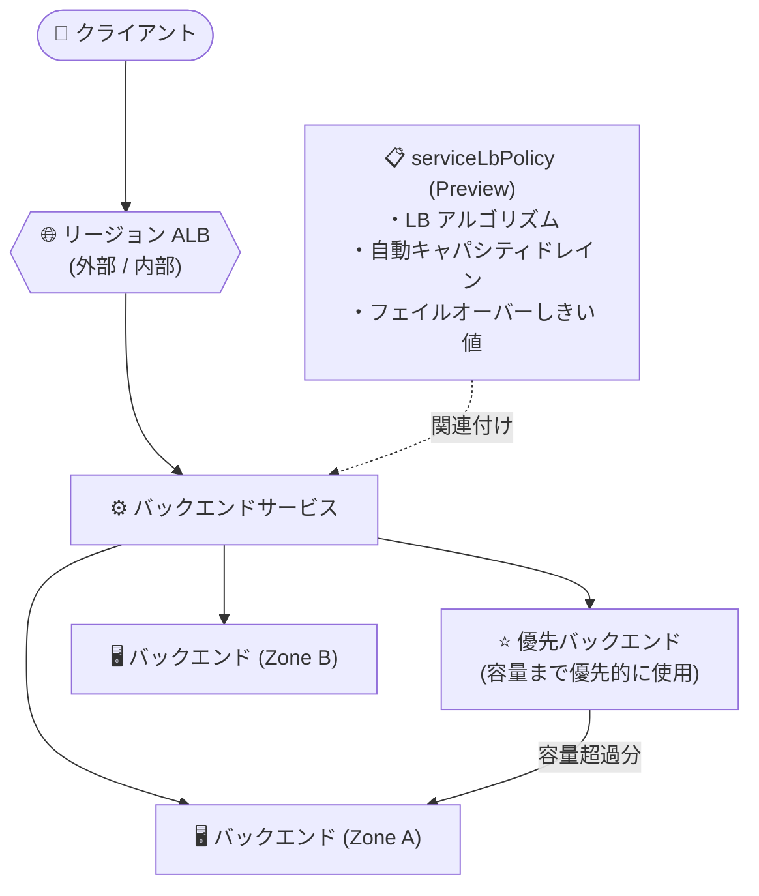

# Cloud Load Balancing: リージョン ALB でのサービスロードバランシングポリシー (serviceLbPolicy) サポート

**リリース日**: 2026-07-27

**サービス**: Cloud Load Balancing

**機能**: リージョン外部/内部アプリケーションロードバランサでのサービスロードバランシングポリシー (serviceLbPolicy) サポート

**ステータス**: Preview

📊 [このアップデートのインフォグラフィックを見る](https://takech9203.github.io/google-cloud-news-summary/20260727-cloud-load-balancing-service-lb-policy-regional-albs.html)

## 概要

Cloud Load Balancing において、サービスロードバランシングポリシー (`serviceLbPolicy`) が **リージョン外部アプリケーションロードバランサ** と **リージョン内部アプリケーションロードバランサ** でサポートされました (Preview)。サービスロードバランシングポリシーは、ロードバランサのバックエンドサービスに関連付けるリソースで、バックエンド間のトラフィック分散方法を細かくカスタマイズできます。

今回のアップデートにより、リージョン ALB でも以下の高度なロードバランシング最適化が利用可能になります: カスタムロードバランシングアルゴリズムの選択、自動キャパシティドレイン (auto-capacity draining)、フェイルオーバーしきい値の設定、および優先バックエンド (preferred backends) の指定です。

コンプライアンスやレイテンシ要件からリージョン型ロードバランサを採用している組織でも、これまでグローバル/クロスリージョン型ロードバランサ限定だったコスト・レイテンシ・レジリエンシの高度な最適化機能を活用できるようになります。

**アップデート前の課題**

- サービスロードバランシングポリシーはグローバル外部 ALB、クロスリージョン内部 ALB、グローバル外部プロキシ NLB、クロスリージョン内部プロキシ NLB のみでサポートされており、リージョン外部/内部 ALB では利用できなかった
- リージョン ALB ではロードバランシングアルゴリズムをカスタマイズできず、ゾーン間のトラフィック分散を用途に応じて調整できなかった
- 不健全なバックエンドからのトラフィック排出 (自動キャパシティドレイン) やフェイルオーバーしきい値のカスタマイズが、リージョン ALB では構成できなかった

**アップデート後の改善**

- リージョン外部 ALB とリージョン内部 ALB でサービスロードバランシングポリシーを作成し、バックエンドサービスに関連付けられるようになった (Preview)
- ロードバランシングアルゴリズム (`WATERFALL_BY_REGION`、`SPRAY_TO_REGION`、`WATERFALL_BY_ZONE`) をリージョン ALB でも選択可能になった
- 自動キャパシティドレインとフェイルオーバーしきい値により、不健全なバックエンドを迅速に回避するレジリエンシ強化が可能になった
- 優先バックエンドを指定し、特定バックエンドの容量を使い切ってから残りのバックエンドへトラフィックを流す制御が可能になった

## アーキテクチャ図



リージョン ALB のバックエンドサービスに `serviceLbPolicy` リソースを関連付けることで、アルゴリズム選択・自動ドレイン・フェイルオーバーしきい値によるトラフィック分散の最適化と、優先バックエンドによる分散制御が可能になります。

## サービスアップデートの詳細

### 主要機能

1. **カスタムロードバランシングアルゴリズム**
   - リージョンまたはゾーン内でのトラフィック分散方法を決定するアルゴリズムをカスタマイズ可能
   - `WATERFALL_BY_REGION` (デフォルト): ネットワークレイテンシを最適化しつつ、リージョン内のゾーン間で均等にトラフィックを分散
   - `SPRAY_TO_REGION`: リージョン内のすべてのバックエンドへ均一にトラフィックを分散し、単一ゾーンのスパイクの影響を軽減
   - `WATERFALL_BY_ZONE`: 最も近いゾーンを容量まで優先的に使用し、ゾーン間トラフィックを抑制

2. **自動キャパシティドレイン (Auto-capacity draining)**
   - 不健全なバックエンドからロードバランサが迅速にトラフィックを排出
   - MIG または NEG は、健全なインスタンス/エンドポイントが 25% 未満になると不健全と判定される
   - `serviceLbPolicies` 設定時は、ドレインされない MIG/NEG の最小割合は 50%。ドレイン解除には 35% 以上の健全性回復が必要 (ドレイン状態の振動を防止)

3. **フェイルオーバーしきい値**
   - バックエンドが不健全と見なされるしきい値を 1〜99 の範囲で設定 (デフォルト: 70)
   - しきい値を下回った場合、トラフィックを別のバックエンドにフェイルオーバーさせ、不健全なバックエンドを回避

4. **優先バックエンド (Preferred backends)**
   - 特定のバックエンドを「優先」として指定し、その容量を使い切ってから残りのバックエンドにリクエストを送信
   - コミット済み使用割引 (CUD) 対象リソースの優先利用など、コスト最適化に活用可能

## 技術仕様

### サポートされるロードバランサ (serviceLbPolicy / 優先バックエンド)

| ロードバランサ | サポート状況 |
|------|------|
| グローバル外部アプリケーションロードバランサ | サポート済み (既存) |
| **リージョン外部アプリケーションロードバランサ** | **Preview (今回追加)** |
| クロスリージョン内部アプリケーションロードバランサ | サポート済み (既存) |
| **リージョン内部アプリケーションロードバランサ** | **Preview (今回追加)** |
| グローバル外部プロキシネットワークロードバランサ | サポート済み (既存) |
| クロスリージョン内部プロキシネットワークロードバランサ | サポート済み (既存) |

### リージョンポリシーで設定可能なフィールド

| 項目 | 詳細 |
|------|------|
| `loadBalancingAlgorithm` | `WATERFALL_BY_REGION` (デフォルト) / `SPRAY_TO_REGION` / `WATERFALL_BY_ZONE` |
| `autoCapacityDrain` | 自動キャパシティドレインの有効化 (`enable: True`) |
| `failoverConfig.failoverHealthThreshold` | フェイルオーバーしきい値 (1〜99、デフォルト 70) |
| トラフィック分離 (`isolationConfig`) | Preview。グローバル/クロスリージョンロードバランサのみサポート (リージョンポリシーでは非対応) |

### リージョンポリシーの YAML 例

```yaml
name: projects/PROJECT_ID/locations/REGION/serviceLbPolicies/SERVICE_LB_POLICY_NAME
autoCapacityDrain:
  enable: True
failoverConfig:
  failoverHealthThreshold: FAILOVER_THRESHOLD_VALUE
loadBalancingAlgorithm: LOAD_BALANCING_ALGORITHM
```

- `REGION` は、ポリシーを適用するバックエンドサービスのリージョンと一致させる必要があります

## 設定方法

### 前提条件

1. リージョン外部 ALB またはリージョン内部 ALB とバックエンドサービスが構成済みであること
2. リージョン ALB 向けのリージョンサービスロードバランシングポリシーは Google Cloud コンソールでは構成できないため、gcloud CLI または API を使用すること

### 手順

#### ステップ 1: サービスロードバランシングポリシーを作成する

```bash
gcloud network-services service-lb-policies create SERVICE_LB_POLICY_NAME \
    --load-balancing-algorithm=LOAD_BALANCING_ALGORITHM \
    --auto-capacity-drain \
    --failover-health-threshold=FAILOVER_THRESHOLD_VALUE \
    --location=REGION
```

`--location` にはバックエンドサービスと同じリージョンを指定します (リージョンポリシーの場合)。YAML ファイルを作成して `gcloud network-services service-lb-policies import` でインポートすることも可能です。

#### ステップ 2: バックエンドサービスにポリシーを関連付ける

```bash
gcloud compute backend-services update BACKEND_SERVICE_NAME \
    --service-lb-policy=SERVICE_LB_POLICY_NAME \
    --region=REGION
```

1 つのバックエンドサービスに関連付けられるサービスロードバランシングポリシーは 1 つのみです。バックエンドサービス作成時に `--service-lb-policy` を指定して関連付けることもできます。

## メリット

### ビジネス面

- **コスト最適化**: 優先バックエンドにより、コミット済みリソースなど特定バックエンドを容量まで優先利用でき、リソース利用効率を向上できる
- **可用性向上**: 自動キャパシティドレインとフェイルオーバーしきい値により、障害時のユーザー影響を最小化できる
- **リージョン型アーキテクチャとの両立**: データレジデンシーなどの要件でリージョン ALB を採用している場合でも、高度な最適化機能を利用できる

### 技術面

- **ワークロードに合わせたアルゴリズム選択**: レイテンシ優先 (`WATERFALL_BY_ZONE`)、スパイク耐性優先 (`SPRAY_TO_REGION`) など、特性に応じた分散制御が可能
- **宣言的な構成**: `serviceLbPolicy` は独立したリソースとして管理でき、YAML によるインポート/エクスポートに対応
- **既存構成への追加が容易**: 既存のバックエンドサービスに `--service-lb-policy` を関連付けるだけで有効化できる

## デメリット・制約事項

### 制限事項

- リージョン外部/内部 ALB でのサポートは Preview であり、SLA の対象外
- リージョン ALB 向けのリージョンポリシーは Google Cloud コンソールで構成できない (gcloud CLI / API のみ)
- トラフィック分離 (traffic isolation) はグローバル/クロスリージョンロードバランサのみサポートされ、リージョンポリシーでは設定できない
- バックエンドはバランシングモードをサポートする互換性のあるものが必要。ゾーン単位の非マネージド/マネージドインスタンスグループはサポートされるが、リージョンマネージドインスタンスグループ (リージョン MIG) はサポートされない

### 考慮すべき点

- 優先バックエンドはクライアントから遠い場合があり、より近いバックエンドが存在しても平均レイテンシが増加する可能性がある
- `WATERFALL_BY_REGION`、`SPRAY_TO_REGION`、`WATERFALL_BY_ZONE` の各アルゴリズムは、優先バックエンドとして構成されたバックエンドには適用されない
- `WATERFALL_BY_ZONE` では、リージョン内で一部の MIG/NEG が容量上限に達する一方、他が十分に活用されないケースが起こりうる
- `SPRAY_TO_REGION` ではゾーン間トラフィックやエンドポイントへの接続数が増加し、リソース使用量が増える場合がある

## ユースケース

### ユースケース 1: リージョン内部 ALB でのゾーン間トラフィック最適化

**シナリオ**: 社内向けマイクロサービスをリージョン内部 ALB で公開しており、ゾーン間のデータ転送コストとレイテンシを抑えたい。

**実装例**:
```bash
gcloud network-services service-lb-policies create zone-affinity-policy \
    --load-balancing-algorithm=WATERFALL_BY_ZONE \
    --location=asia-northeast1

gcloud compute backend-services update internal-api-backend \
    --service-lb-policy=zone-affinity-policy \
    --region=asia-northeast1
```

**効果**: 最も近いゾーンのバックエンドが容量まで優先的に使用され、ゾーン間トラフィックの削減とレイテンシ最適化が期待できる。

### ユースケース 2: 障害時の迅速なフェイルオーバー

**シナリオ**: リージョン外部 ALB で公開している Web サービスで、一部バックエンドの劣化時に自動でトラフィックを健全なバックエンドへ切り替えたい。

**効果**: 自動キャパシティドレインとカスタムフェイルオーバーしきい値により、不健全なバックエンドからのトラフィック排出が自動化され、劣化したバックエンドへのリクエスト送信を回避できる。

## 料金

サービスロードバランシングポリシー自体の追加料金に関する記載はリリースノートおよびドキュメントでは確認できませんでした。Cloud Load Balancing の料金体系 (転送ルール、処理データ量など) は料金ページを参照してください。

- [Cloud Load Balancing の料金](https://cloud.google.com/vpc/network-pricing#lb)

## 利用可能リージョン

リージョン固有の提供情報はリリースノートに記載がありません。詳細は公式ドキュメントを参照してください。

## 関連サービス・機能

- **バックエンドサービス**: `serviceLbPolicy` はバックエンドサービスに関連付けて使用するリソース。バランシングモードをサポートするバックエンドが必要
- **Cloud Service Mesh**: サービスメッシュでも同様の高度なロードバランシング最適化 (advanced load balancing) をサポートしており、メッシュ内トラフィックに適用可能
- **ヘルスチェック**: 自動キャパシティドレインとフェイルオーバーしきい値はバックエンドの健全性判定に基づいて動作するため、適切なヘルスチェック構成が前提となる

## 参考リンク

- 📊 [インフォグラフィック](https://takech9203.github.io/google-cloud-news-summary/20260727-cloud-load-balancing-service-lb-policy-regional-albs.html)
- [公式リリースノート](https://docs.cloud.google.com/release-notes#July_27_2026)
- [ドキュメント: Advanced load balancing optimizations](https://docs.cloud.google.com/load-balancing/docs/service-lb-policy)
- [ドキュメント: バックエンドサービスの概要](https://docs.cloud.google.com/load-balancing/docs/backend-service)
- [料金ページ](https://cloud.google.com/vpc/network-pricing#lb)

## まとめ

これまでグローバル/クロスリージョン型ロードバランサに限られていた高度なロードバランシング最適化 (カスタムアルゴリズム、自動キャパシティドレイン、フェイルオーバーしきい値、優先バックエンド) が、Preview としてリージョン外部/内部 ALB でも利用可能になりました。リージョン型 ALB を採用している環境でゾーン間トラフィックの最適化や障害時のレジリエンシ強化を検討している場合は、gcloud CLI または API を使用して `serviceLbPolicy` の検証を始めることを推奨します。Preview 段階のため、本番適用は GA を待つか影響範囲を限定して評価してください。

---

**タグ**: #CloudLoadBalancing #serviceLbPolicy #ApplicationLoadBalancer #リージョンALB #Preview #ネットワーキング
