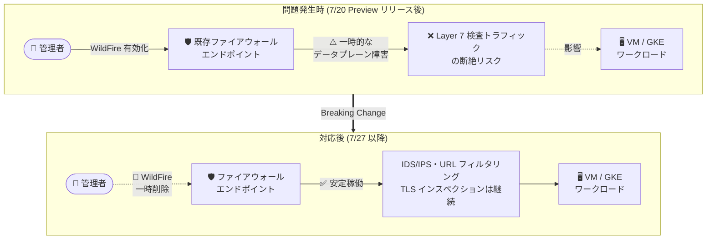

# Cloud NGFW: WildFire 機能の一時的な提供停止 (Breaking Change)

**リリース日**: 2026-07-27

**サービス**: Cloud NGFW (Cloud Next Generation Firewall)

**機能**: WildFire マルウェア防御サービスの一時的な削除

**ステータス**: Breaking Change (一時的な機能削除)

📊 [このアップデートのインフォグラフィックを見る](https://takech9203.github.io/google-cloud-news-summary/20260727-cloud-ngfw-wildfire-temporary-removal.html)

## 概要

2026 年 7 月 20 日に Preview として発表された Cloud NGFW の WildFire マルウェア防御サービスについて、既存のファイアウォールエンドポイントで WildFire を有効化すると一時的なデータプレーン障害 (data plane outage) が発生する可能性があることが判明した。この問題を受けて、WildFire 機能は一時的に削除 (temporarily removed) された。

WildFire は Palo Alto Networks のサンドボックス技術とリアルタイム機械学習を組み合わせ、ネットワーク経由のファイル転送から未知のマルウェアを検知・ブロックする Cloud NGFW Enterprise ティアの機能である。発表からわずか 1 週間での提供停止となり、Preview 段階での評価を開始していた、あるいは検討していた組織は影響を受ける。

本アップデートは Breaking Change として公示されており、特に既存のファイアウォールエンドポイントに対して WildFire を有効化する操作が、そのエンドポイントを経由する Layer 7 検査トラフィック全体に影響を及ぼしうる点が重要である。ファイアウォールエンドポイントは検査できないトラフィックを転送しない設計であるため、データプレーンの障害は検査対象トラフィックの断絶に直結する。

**アップデート前の課題**

- 2026 年 7 月 20 日の Preview リリース以降、既存のファイアウォールエンドポイントに対して WildFire を有効化できたが、この操作によって一時的なデータプレーン障害が発生する可能性があった
- ファイアウォールエンドポイントは検査できないトラフィックを転送しないため、データプレーン障害が発生すると、そのエンドポイントで Layer 7 検査対象となっている正規のトラフィックにも影響が及ぶリスクがあった
- 障害リスクが解消されるまで、WildFire の有効化操作自体が本番ネットワークに対する潜在的な障害要因となっていた

**アップデート後の改善**

- WildFire 機能が一時的に削除されたことで、既存エンドポイントへの WildFire 有効化に起因するデータプレーン障害のリスクが排除された
- ユーザーが意図せず障害を引き起こす操作を実行できない状態となり、Cloud NGFW Enterprise の既存機能 (IDS/IPS、URL フィルタリング、TLS インスペクション) の安定性が維持される

## アーキテクチャ図

既存のファイアウォールエンドポイントで WildFire を有効化するとデータプレーン障害が発生する可能性があったため、WildFire 機能自体が一時的に削除された。IDS/IPS など他の Enterprise ティア機能は引き続き利用可能である。

## サービスアップデートの詳細

### 変更内容

1. **WildFire 機能の一時的な削除**
   - 2026 年 7 月 20 日に Preview として提供開始された WildFire マルウェア防御サービスが一時的に削除された
   - 削除の理由は、既存のファイアウォールエンドポイントで WildFire を有効化した際に一時的なデータプレーン障害が発生する可能性があるため
   - 再提供の時期については Release Notes に明記されていない

2. **影響を受ける操作**
   - 既存のファイアウォールエンドポイントに対する WildFire の有効化 (エンドポイント編集時の `Enable WildFire` 設定)
   - WildFire Analysis (WILDFIRE_ANALYSIS) セキュリティプロファイルを利用した構成

3. **影響を受けない機能**
   - 侵入検知・防御サービス (IDS/IPS) によるシグネチャベースの脅威検知
   - URL フィルタリングサービス
   - TLS インスペクション
   - Essentials / Standard ティアの機能 (ステートフルインスペクション、FQDN オブジェクト、脅威インテリジェンスなど)

## 技術仕様

### 問題の背景: ファイアウォールエンドポイントとデータプレーン

| 項目 | 詳細 |
|------|------|
| ファイアウォールエンドポイント | ゾーン単位の Google 管理リソース。パケットインターセプト技術でトラフィックを横取りし Layer 7 検査を実施 |
| データプレーンの特性 | エンドポイントは検査未完了のトラフィックを転送しないため、障害時は正規トラフィックもドロップされうる |
| WildFire の位置付け | WildFire Inline ML は Cloud NGFW Enterprise のデータプレーン内でファイルを解析する構成 |
| 障害の性質 | 既存エンドポイントでの WildFire 有効化操作に起因する一時的 (temporary) なデータプレーン障害 |

WildFire Inline ML はファイアウォールエンドポイントのデータプレーン内で動作する設計であるため、既存エンドポイントへの機能追加がデータプレーンの再構成を伴い、これが障害の要因になったと考えられる (公式には障害メカニズムの詳細は公開されていない)。

## 影響を受けるユーザーへの対応

### 対象ユーザー

1. Cloud NGFW Enterprise ティアで WildFire の Preview 評価を実施・計画していた組織
2. WildFire Analysis セキュリティプロファイルやセキュリティプロファイルグループの構成を進めていた組織

### 推奨アクション

1. **WildFire 前提のセキュリティ設計の見直し**: WildFire を前提としたファイルベース脅威防御の設計・評価計画は、機能の再提供まで保留する
2. **既存機能による防御の継続**: IDS/IPS (シグネチャベースの脅威検知) と URL フィルタリングは引き続き利用可能であるため、これらによる多層防御を維持する
3. **Release Notes の継続的な確認**: WildFire の再提供時期は未定のため、[Cloud NGFW Release Notes](https://docs.cloud.google.com/release-notes) を定期的に確認する
4. **エンドポイントの安定性確認**: WildFire 有効化を試行した既存エンドポイントがある場合、Cloud Monitoring の `firewall_endpoint` メトリクスでデータプレーンの健全性 (容量使用率、パケットドロップ) を確認する

## デメリット・制約事項

### 制限事項

- WildFire によるサンドボックス分析・インライン ML 判定は利用できない (未知のマルウェア・ゼロデイ脅威に対するファイルベースの動的解析が不可)
- 機能の再提供時期は公表されていない
- 7 月 20 日の Preview リリースで評価を開始していた場合、評価作業は中断を余儀なくされる

### 考慮すべき点

- Preview 機能は「Pre-GA Offerings Terms」の対象であり、SLA やサポートの保証がなく、今回のように予告なく提供が変更・停止される可能性があることを改めて認識する必要がある
- 未知のマルウェア対策が必要な場合は、当面はエンドポイント側のマルウェア対策 (EDR など) やサードパーティのサンドボックスソリューションで補完することを検討する
- WildFire が再提供された際には、既存エンドポイントへの有効化手順に関する注意事項 (メンテナンスウィンドウでの適用など) が追加される可能性があるため、再提供時のドキュメントを確認する

## 関連サービス・機能

- **Cloud NGFW IDS/IPS (侵入検知・防御サービス)**: シグネチャベースの既知脅威検知。WildFire 停止中もマルウェア・スパイウェア・C2 攻撃への防御を提供し続ける
- **Cloud NGFW URL フィルタリング**: アプリケーションレイヤーでの URL ベースのアクセス制御。悪性サイトからのファイルダウンロード抑止に活用可能
- **TLS インスペクション**: 暗号化トラフィックの復号・検査。IDS/IPS と組み合わせた暗号化トラフィック内の脅威検知に引き続き利用可能
- **Cloud Monitoring**: `firewall_endpoint` メトリクスによるエンドポイントの容量使用率・健全性の監視
- **Security Command Center**: 脅威検出結果の一元管理。Cloud NGFW の検知イベントを含むセキュリティポスチャの可視化に活用

## 参考リンク

- 📊 [インフォグラフィック](https://takech9203.github.io/google-cloud-news-summary/20260727-cloud-ngfw-wildfire-temporary-removal.html)
- [公式リリースノート](https://docs.cloud.google.com/release-notes#July_27_2026)
- [関連レポート: Cloud NGFW WildFire マルウェア防御サービス (2026-07-20)](./2026-07-20-cloud-ngfw-wildfire-malware-protection.md)
- [Cloud NGFW ティアと機能](https://docs.cloud.google.com/firewall/docs/ngfw_tiers)
- [ファイアウォールエンドポイントの概要](https://docs.cloud.google.com/firewall/docs/about-firewall-endpoints)
- [侵入検知・防御サービスの概要](https://docs.cloud.google.com/firewall/docs/about-intrusion-prevention)
- [料金ページ](https://cloud.google.com/firewall/pricing)

## まとめ

Cloud NGFW の WildFire マルウェア防御サービスは、既存ファイアウォールエンドポイントでの有効化が一時的なデータプレーン障害を引き起こす可能性があるため、Preview 開始からわずか 1 週間で一時的に提供停止となった。評価を進めていた組織は WildFire 前提の設計を保留し、IDS/IPS と URL フィルタリングによる既存の多層防御を維持しつつ、再提供に関する Release Notes の更新を注視することを推奨する。

---

**タグ**: #CloudNGFW #WildFire #BreakingChange #機能削除 #データプレーン障害 #NetworkSecurity #CloudFirewallEnterprise #Preview
