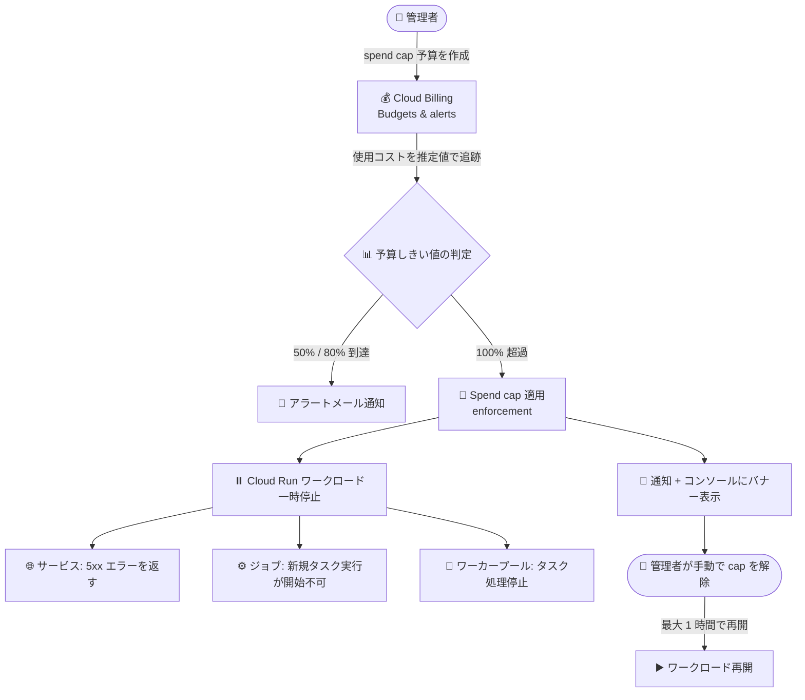

# Cloud Run: Budget spend caps によるワークロード自動一時停止 (Preview)

**リリース日**: 2026-07-27

**サービス**: Cloud Run

**機能**: Budget spend caps によるワークロード自動一時停止

**ステータス**: Preview

📊 [このアップデートのインフォグラフィックを見る](https://takech9203.github.io/google-cloud-news-summary/20260727-cloud-run-budget-spend-caps.html)

## 概要

Cloud Run が、Cloud Billing の Budget spend caps (予算の支出上限) によるワークロードの自動一時停止に対応しました (Preview)。Cloud Billing コンソールで spend cap 付き予算を設定すると、その上限がプロジェクト内のすべての Cloud Run リソースタイプ (サービス、ジョブ、ワーカープール) に自動的に適用されます。使用コストが予算のターゲット金額を超過すると、Google Cloud が Cloud Run ワークロードを自動的に一時停止し、それ以上のコスト発生を防ぎます。

spend cap の進捗は Cloud Run コンソールの概要ページから直接モニタリングでき、上限に達した場合はアラート通知の受信と、Cloud Run コンソールでの適用中バナーの表示が行われます。運用を再開するには、Cloud Run コンソールの概要ページから上限を解除または調整します。

本機能は同日に Preview 公開された Cloud Billing の spend cap budgets 機能の一部であり、対象サービスには Cloud Run のほか、Cloud Run functions、Gemini API、Gemini Enterprise Agent Platform (旧 Vertex AI) が含まれます。予期しないコスト超過 (runaway cost) を防ぎたい開発者や、検証環境・個人プロジェクトで支出の絶対上限を設けたいユーザーに有用です。

**アップデート前の課題**

- Cloud Billing の予算 (Budgets) はアラート通知のみで、しきい値を超過してもサービスの使用は継続し、コストが発生し続けた
- コスト超過時に Cloud Run サービスを停止するには、予算アラートの Pub/Sub 通知を受けて Cloud Run Admin API を呼び出すなどの自動化を自前で構築する必要があった
- スパイクトラフィックや設定ミスによる予期しない高額請求 (runaway cost) を仕組みとして防ぐ手段がなかった

**アップデート後の改善**

- Cloud Billing コンソールで spend cap 付き予算を設定するだけで、上限超過時にプロジェクト内のすべての Cloud Run リソースタイプが自動的に一時停止されるようになった
- Cloud Run コンソールの概要ページから spend cap の進捗を直接モニタリングできるようになった
- 上限超過時にはアラート通知と Cloud Run コンソールの適用中バナーで即座に状況を把握でき、コンソールから上限の解除・調整で運用を再開できるようになった

## アーキテクチャ図



Cloud Billing の spend cap 予算が使用コストを追跡し、50% / 80% でアラート、100% 超過で Cloud Run ワークロードを自動一時停止します。再開には管理者による手動での cap 解除が必要です。

## サービスアップデートの詳細

### 主要機能

1. **プロジェクト内の全 Cloud Run リソースタイプへの自動適用**
   - Cloud Billing コンソールで設定した spend cap は、プロジェクト内のすべての Cloud Run リソースタイプに自動的に適用される
   - サービス、ジョブ、ワーカープールが対象

2. **上限超過時のワークロード一時停止**
   - 上限に達すると、Google Cloud がすべての Cloud Run ワークロードを一時停止し、それ以上のコスト発生を防ぐ
   - サービス: 既存のサービスはトラフィックの処理に失敗し、5xx エラーを返す
   - ジョブ: 新規タスク実行は開始に失敗し、実行中のタスクは完了に失敗する
   - ワーカープール: 既存のインスタンスはタスクの処理を停止する

3. **Cloud Run コンソールでのモニタリングと解除**
   - spend cap の進捗を Cloud Run コンソールの概要ページから直接モニタリング可能
   - 上限超過時はアラート通知を受信し、Cloud Run コンソールに適用中 (enforcement) バナーが表示される
   - 運用の再開には、Cloud Run コンソールの概要ページで cap の解除 (lift) または調整が必要

4. **段階的なアラート通知 (Cloud Billing 側の機能)**
   - 支出が予算額の 50%、80% に達した時点でアラートメールが送信される
   - 100% 超過で spend cap が適用され、請求先アカウント管理者とプロジェクトオーナー全員にメール通知が送信される

## 技術仕様

### Spend cap の動作仕様

| 項目 | 詳細 |
|------|------|
| ステータス | Preview (Pre-GA Offerings Terms が適用) |
| 設定場所 | Cloud Billing コンソールの Budgets & alerts ページ |
| スコープ | 1 つのプロジェクト + 1 つの対象サービスごとに設定 |
| 期間 | 月次 (Monthly) 固定、変更不可 |
| 予算タイプ | 指定金額 (Specified amount) 固定 |
| 判定基準 | 推定の総コスト (estimated gross costs、割引適用前) で高速に判定 |
| 適用時の挙動 | 新規の使用のみブロック。処理中 (in-flight) のリクエストは完了まで処理される |
| リソース・データ | 削除されない。使用が一時停止されるのみ |
| 解除方法 | 手動での cap 解除が必須。解除後、完全な再開まで最大 1 時間かかる場合がある |
| 解除後の挙動 | 同一請求月内に解除した場合、ターゲット金額を増額しない限りその月は再適用されない |
| 注意点 | 適用は即時ではなく、レポーティングの遅延による超過分は通常どおり請求される |

### 対象サービス (Cloud Billing spend cap budgets の初回リリース時点)

| サービス | 備考 |
|----------|------|
| Cloud Run | サービス、ジョブ、ワーカープールが一時停止対象 |
| Cloud Run functions | Cloud Run 上で動作する関数 |
| Gemini API | API ベースのサービス |
| Gemini Enterprise Agent Platform (旧 Vertex AI) | API ベースのサービス |

### VPC コネクタに関する注意

- VPC コネクタの VM は Compute Engine によって課金されるため、spend cap の対象外
- Egress ネットワーキングまで spend cap でカバーしたい場合は、[Direct VPC egress](https://docs.cloud.google.com/run/docs/configuring/vpc-direct-vpc) の使用が推奨される

## 設定方法

### 前提条件

1. Cloud Billing アカウントに対する予算の作成・管理権限があること
2. 対象の Cloud Run ワークロードが動作するプロジェクトが Cloud Billing アカウントにリンクされていること

### 手順

#### ステップ 1: spend cap 予算の作成

1. Google Cloud コンソールで「Budgets & alerts」ページに移動する
2. 「Create new budget」をクリックする
3. Define セクションで「Spend cap enforcement」オプションを選択し (「Alerts only」ではなく)、予算名を入力する

既存のアラートのみの予算を spend cap 予算に変換することはできません。同様のスコープで spend cap を設定する場合は、既存予算を削除して新規作成します。

#### ステップ 2: スコープと金額の設定

1. Scope セクションで、単一のプロジェクトと単一の対象サービス (Cloud Run) を選択する (期間は Monthly 固定)
2. Amount セクションで spend cap のターゲット金額を入力する
3. Actions セクションで「Finish」をクリックして保存・有効化する

コストレポーティングの遅延により適用は即時ではないため、絶対的な上限よりやや低い金額を設定することが推奨されます。通知は請求先アカウント管理者とプロジェクトオーナーに対して 50%・80%・100% で自動設定され、カスタマイズはできません。

#### ステップ 3: 適用後の解除 (必要時)

1. Cloud Run コンソールの概要ページ、または Cloud Billing の Budgets & alerts ページで適用中の spend cap を確認する
2. 対象の予算を開き、「Lift spend cap」を選択して確定する
3. サービスの完全な再開まで最大 1 時間かかる場合がある

## メリット

### ビジネス面

- **予期しない高額請求の防止**: 設定ミスやトラフィックスパイクによる runaway cost を、支出上限で仕組みとして防止できる
- **予算ガバナンスの強化**: 検証環境や個人プロジェクトで支出の絶対上限を設定でき、安心してサービスを試せる

### 技術面

- **自前の自動化が不要**: 従来必要だった予算アラート + Pub/Sub + API 呼び出しによる停止自動化を構築せずに、マネージドな仕組みでワークロードを停止できる
- **Cloud Run コンソールとの統合**: spend cap の進捗確認、適用状況のバナー表示、cap の解除・調整までを Cloud Run コンソールから行える
- **推定コストによる高速な適用**: 実際のコスト計上よりも速い推定コストベースで判定されるため、超過の拡大を抑えやすい

## デメリット・制約事項

### 制限事項

- Preview 機能であり、Pre-GA Offerings Terms が適用される (サポートが限定される場合がある)
- spend cap 予算は 1 予算につき 1 プロジェクト + 1 サービスのみ設定可能
- 期間は月次固定、予算タイプは指定金額固定で、アラートのしきい値 (50% / 80% / 100%) や通知先はカスタマイズ不可
- 既存のアラートのみの予算を spend cap 予算へ変換することはできない
- VPC コネクタの VM は Compute Engine 課金のため spend cap の対象外

### 考慮すべき点

- 適用は即時ではなく、コストレポーティングの遅延による超過分は通常どおり請求される。絶対上限よりやや低い金額の設定が推奨される
- 上限超過時は本番サービスも 5xx エラーを返すようになるため、本番環境への適用は影響を十分に検討する必要がある
- 再開には手動での cap 解除が必須で、解除後も完全な復旧まで最大 1 時間かかる場合がある
- 永続リソースに関連する固定費用 (コンピュート、ストレージなど) は一時停止されず、引き続き課金される

## ユースケース

### ユースケース 1: 検証環境・個人プロジェクトのコスト上限設定

**シナリオ**: 開発者が個人プロジェクトや検証環境で Cloud Run サービスを公開しており、意図しないトラフィックの流入やループ呼び出しによる高額請求を絶対に避けたい。

**実装例**:
```
1. Cloud Billing コンソール → Budgets & alerts → Create new budget
2. 「Spend cap enforcement」を選択
3. スコープ: 検証用プロジェクト + Cloud Run
4. ターゲット金額: 月額 $50 (絶対上限より低めに設定)
```

**効果**: 月間の Cloud Run 支出が $50 を超えるとワークロードが自動一時停止され、想定外の請求を防止できる。50% / 80% 時点のアラートメールで事前に状況を把握できる。

### ユースケース 2: 生成 AI アプリケーションのコスト暴走防止

**シナリオ**: Cloud Run 上でホストするアプリケーションから Gemini API を呼び出す構成で、バグや悪用によるコスト暴走をサービス単位で防ぎたい。

**効果**: Cloud Run と Gemini API のそれぞれに spend cap 予算を設定することで、どちらのレイヤーでコストが暴走しても自動的に使用が一時停止され、被害額を予算内に抑えられる。

## 料金

spend cap 予算の設定自体に追加料金はかかりません。Cloud Run 自体の料金は従来どおり、リクエストベース課金またはインスタンスベース課金の設定に基づきます。

なお、spend cap 適用時もコストレポーティングの遅延による超過分、およびサービス維持に必要な継続的な固定費用は通常どおり請求される点に注意してください。

- 料金の詳細: [Cloud Run の料金](https://cloud.google.com/run/pricing)

## 利用可能リージョン

リージョン固有の制限は Release Notes およびドキュメントに記載されていません。spend cap 予算は Cloud Billing アカウントのプロジェクト単位で設定します。

## 関連サービス・機能

- **Cloud Billing (Budgets & alerts)**: spend cap 予算の作成・管理・解除を行う。本機能の基盤であり、同日に spend cap budgets が Preview 公開された (別レポートで解説: [Cloud Billing spend cap budgets](https://docs.cloud.google.com/billing/docs/how-to/budgets-spend-caps))
- **Cloud Run functions**: Cloud Run 上で動作する関数も spend cap の対象サービスに含まれる
- **Gemini API / Gemini Enterprise Agent Platform (旧 Vertex AI)**: spend cap budgets の初回リリースにおけるその他の対象サービス
- **Direct VPC egress**: VPC コネクタ VM は spend cap 対象外のため、Egress ネットワーキングまでカバーしたい場合に使用を推奨
- **Recommender**: Cloud Run の課金設定 (リクエストベース / インスタンスベース) の最適化を推奨する既存機能

## 参考リンク

- 📊 [インフォグラフィック](https://takech9203.github.io/google-cloud-news-summary/20260727-cloud-run-budget-spend-caps.html)
- [公式リリースノート](https://docs.cloud.google.com/release-notes#July_27_2026)
- [Cloud Run 課金設定 (Spend caps)](https://docs.cloud.google.com/run/docs/configuring/billing-settings#spend-caps)
- [Cloud Billing spend cap budgets](https://docs.cloud.google.com/billing/docs/how-to/budgets-spend-caps)
- [料金ページ](https://cloud.google.com/run/pricing)

## まとめ

Cloud Run が Cloud Billing の Budget spend caps に対応し、予算超過時にサービス・ジョブ・ワーカープールを自動的に一時停止できるようになりました (Preview)。これまで自前の自動化が必要だった「コスト超過時の強制停止」がマネージドな仕組みとして提供されるため、検証環境や個人プロジェクト、生成 AI アプリケーションのコスト暴走対策として、まずは非本番プロジェクトで spend cap 予算の設定を試すことを推奨します。適用は即時ではない点と、再開に手動解除が必要な点を踏まえた運用設計が重要です。

---

**タグ**: Cloud Run, Cloud Billing, Budget, Spend Caps, コスト管理, FinOps, Preview
