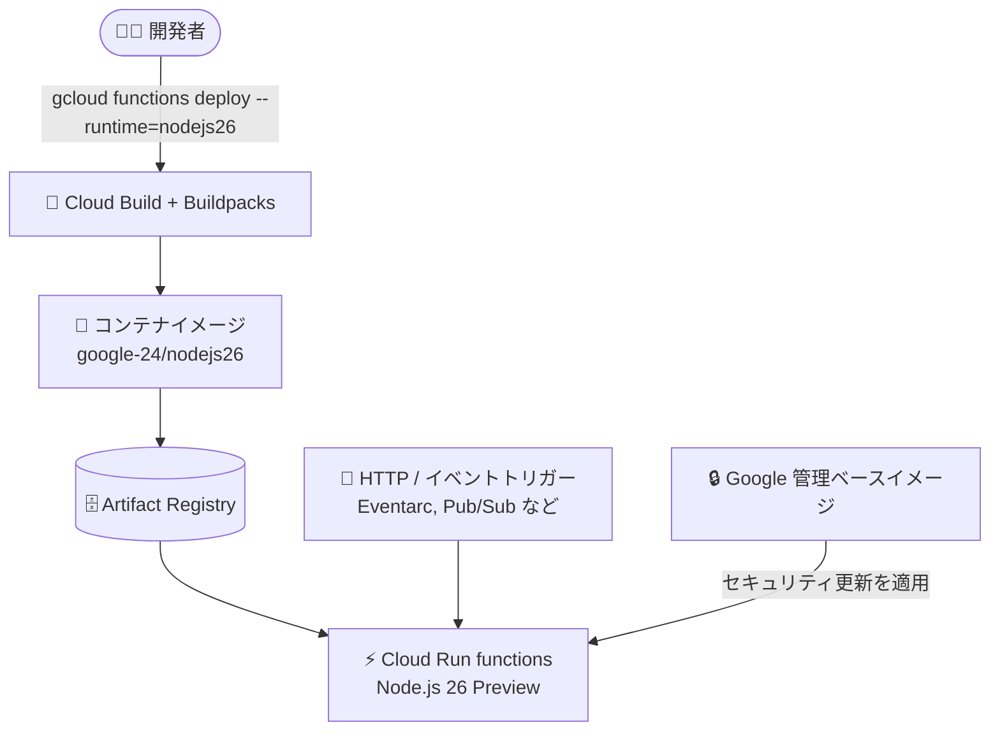

# Cloud Run functions: Node.js 26 ランタイムのサポート (Preview)

**リリース日**: 2026-07-27

**サービス**: Cloud Run functions

**機能**: Node.js 26 ランタイムのサポート

**ステータス**: Preview

📊 [このアップデートのインフォグラフィックを見る](https://takech9203.github.io/google-cloud-news-summary/20260727-cloud-run-functions-nodejs-26-runtime.html)

## 概要

Cloud Run functions において、Node.js 26 ランタイムのサポートが Preview として提供開始されました。ランタイム ID は `nodejs26` で、Ubuntu 24.04 ベースの `google-24` スタック (デフォルト) および `google-24-full` スタックで利用できます。関数のデプロイ時にランタイムとして `nodejs26` を指定するだけで、Google が管理するセキュアな実行環境上で Node.js 26 の関数を実行できます。

Cloud Run functions のランタイムは、OS・システムパッケージ・言語サポート・Functions Framework を含む実行環境として Google が管理しており、セキュリティ更新やメンテナンス更新が提供されます。今回の追加により、最新の Node.js 系列を関数ワークロードでもコンテナ管理なしで検証できるようになります。

なお、同日のリリースノートでは Cloud Run および App Engine フレキシブル環境でも Node.js 26 ランタイムが Preview として発表されており、Google Cloud のサーバーレス実行環境全体で Node.js 26 への対応が進んでいます。

**アップデート前の課題**

- Cloud Run functions で利用できる最新の Node.js ランタイムは Node.js 24 までで、Node.js 26 の新機能や性能改善をマネージドな関数実行環境で検証する手段がなかった
- Node.js 26 を試すには、Cloud Run functions ではなくコンテナベースのデプロイ (自前イメージの Cloud Run サービス) に切り替え、イメージのメンテナンスを自分で行う必要があった

**アップデート後の改善**

- デプロイ時にランタイム ID `nodejs26` を指定するだけで、Node.js 26 の関数を実行できるようになった
- Ubuntu 24.04 ベースの `google-24` / `google-24-full` スタック上で提供され、実行環境のセキュリティ更新は Google の管理下で適用される
- 将来の LTS 系列である Node.js 26 への移行検証を、関数ワークロードでも早期に開始できるようになった

## アーキテクチャ図



開発者はランタイム ID `nodejs26` を指定して関数をデプロイするだけで、Google 管理の Node.js 26 実行環境上で HTTP・イベント駆動の関数を実行できます。

## サービスアップデートの詳細

### 主要機能

1. **Node.js 26 ランタイム (Preview)**
   - ランタイム ID: `nodejs26`、対象は Cloud Run functions (2nd gen / Run functions 世代)
   - 実行環境は Ubuntu 24.04 ベース

2. **google-24 スタックでの提供**
   - `google-24` (デフォルト) および `google-24-full` スタックで利用可能
   - ランタイムベースイメージ: `us-central1-docker.pkg.dev/serverless-runtimes/google-24/runtimes/nodejs26` および `google-24-full/nodejs26`

3. **ランタイムライフサイクル管理**
   - 廃止 (Deprecation) / 提供終了 (Decommission) 日は未定 (スケジュールされた時点でランタイムサポートページに掲載)

## 技術仕様

### Cloud Run functions の Node.js ランタイム サポートスケジュール

| ランタイム | 世代 | ランタイム ID | スタック | 廃止予定日 | 提供終了日 |
|------|------|------|------|------|------|
| Node.js 26 (Preview) | Run functions | `nodejs26` | google-24 (デフォルト), google-24-full | 未定 | 未定 |
| Node.js 24 | Run functions | `nodejs24` | google-24 (デフォルト), google-24-full | 2028-04-30 | 2028-10-31 |
| Node.js 22 | 1st gen, Run functions | `nodejs22` | google-22 (デフォルト), google-22-full | 2027-04-30 | 2027-10-31 |
| Node.js 20 | 1st gen, Run functions | `nodejs20` | google-22 (デフォルト), google-22-full | 2026-04-30 | 2026-10-30 |

## 設定方法

### 前提条件

1. Google Cloud プロジェクトで Cloud Run functions (Cloud Functions API / Cloud Run API) が有効になっていること
2. gcloud CLI がインストールされていること

### 手順

#### ステップ 1: Node.js 26 で関数をデプロイ

```bash
gcloud functions deploy my-function \
  --runtime=nodejs26 \
  --trigger-http \
  --region=asia-northeast1 \
  --source=.
```

`--runtime=nodejs26` を指定してデプロイします。ソースコードの構成 (エントリポイント、`package.json` での依存関係指定) は既存の Node.js ランタイムと同様です。

#### ステップ 2: 動作確認

```bash
gcloud functions describe my-function \
  --region=asia-northeast1 \
  --format="value(buildConfig.runtime)"
```

デプロイされた関数のランタイムが `nodejs26` であることを確認します。

## メリット

### ビジネス面

- **最新ランタイムへの早期対応**: GA 前に Node.js 26 での関数の動作検証を開始でき、将来の移行計画を前倒しで進められる
- **運用コストの削減**: 実行環境のメンテナンスを Google に任せることで、ランタイムのパッチ運用にかかる工数を削減できる

### 技術面

- **Ubuntu 24.04 ベースの新スタック**: `google-24` スタック上で提供され、長期サポートされる OS 基盤の上で最新 Node.js を利用できる
- **既存ワークフローをそのまま利用**: ランタイム ID を変更するだけで、Functions Framework やデプロイ手順は従来の Node.js ランタイムと共通

## デメリット・制約事項

### 制限事項

- Preview 段階のため、Pre-GA Offerings Terms が適用され、サポートが限定される場合がある
- 廃止・提供終了スケジュールが未定のため、GA 昇格時期を含め今後の発表を確認する必要がある

### 考慮すべき点

- 本番ワークロードには GA の Node.js 24 (`nodejs24`) の利用が引き続き推奨される
- Node.js 20 ランタイムは 2026-04-30 に廃止済みで 2026-10-30 に提供終了予定のため、古いランタイムを利用中の場合は移行計画が急務
- 依存パッケージ (ネイティブモジュールなど) が Node.js 26 に対応しているか事前確認が必要

## ユースケース

### ユースケース 1: Node.js 26 への移行前検証

**シナリオ**: Node.js 22 で稼働中のイベント駆動関数を、将来の LTS 系列である Node.js 26 に移行する前に互換性を検証したい。

**実装例**:
```bash
# 検証用の関数を Node.js 26 でデプロイ
gcloud functions deploy my-function-canary \
  --runtime=nodejs26 \
  --trigger-http \
  --region=asia-northeast1 \
  --source=.
```

**効果**: 本番関数に影響を与えずに検証用関数で Node.js 26 の動作を確認でき、GA 昇格後の移行をスムーズに進められる。

### ユースケース 2: 古いランタイムからの計画的アップグレード

**シナリオ**: Node.js 20 (2026-10-30 提供終了予定) で稼働する関数群を、最新ランタイムへ計画的にアップグレードする。

**効果**: 提供終了前に新しいランタイムへの移行パスを確保でき、ランタイムサポート切れによるセキュリティリスクを回避できる。

## 料金

ランタイムの追加自体による追加料金はありません。Cloud Run functions の料金は、従来どおり呼び出し回数、コンピューティング時間 (vCPU・メモリ)、ネットワークに基づく従量課金です。デプロイ時のビルドには Cloud Build、イメージの保存には Artifact Registry の料金が別途発生します。

詳細は [Cloud Run functions 料金ページ](https://cloud.google.com/functions/pricing) を参照してください。

## 利用可能リージョン

リージョン固有の制限はリリースノートに記載されていません。Cloud Run functions が利用可能なリージョンについては [ロケーション](https://docs.cloud.google.com/functions/docs/locations) を参照してください。

## 関連サービス・機能

- **Cloud Run**: 同日に Node.js 26 ランタイムの Preview サポートが発表されている (関連レポート: [Cloud Run: Node.js 26 ランタイムのサポート](2026-07-27-cloud-run-nodejs-26-runtime.md))
- **App Engine フレキシブル環境**: 同日に Node.js 26 ランタイムの Preview サポートが発表されている
- **Cloud Build / Buildpacks**: 関数のデプロイ時にソースコードからコンテナイメージを自動ビルドする
- **Eventarc / Pub/Sub**: イベント駆動関数のトリガーとして組み合わせて利用される

## 参考リンク

- 📊 [インフォグラフィック](https://takech9203.github.io/google-cloud-news-summary/20260727-cloud-run-functions-nodejs-26-runtime.html)
- [公式リリースノート](https://docs.cloud.google.com/release-notes#July_27_2026)
- [Cloud Run functions 実行環境 (Node.js)](https://docs.cloud.google.com/functions/docs/concepts/execution-environment#node.js)
- [ランタイムサポートスケジュール](https://docs.cloud.google.com/functions/docs/runtime-support#node.js)
- [料金ページ](https://cloud.google.com/functions/pricing)

## まとめ

Cloud Run functions で Node.js 26 ランタイムが Preview として利用可能になり、関数ワークロードでも最新の Node.js 系列を Google 管理の実行環境上で検証できるようになりました。本番利用は GA の Node.js 24 を継続しつつ、検証用関数で Node.js 26 の互換性確認を早期に開始することを推奨します。特に Node.js 20 以前を利用中のチームは、提供終了スケジュールを踏まえた移行計画の策定が重要です。

---

**タグ**: Cloud Run functions, Node.js, ランタイム, Preview, サーバーレス
