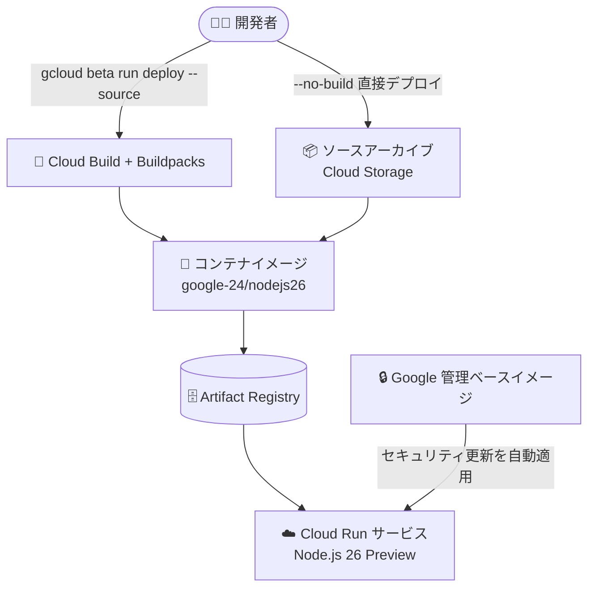

# Cloud Run: Node.js 26 ランタイムのサポート (Preview)

**リリース日**: 2026-07-27

**サービス**: Cloud Run

**機能**: Node.js 26 ランタイムのサポート

**ステータス**: Preview

📊 [このアップデートのインフォグラフィックを見る](https://takech9203.github.io/google-cloud-news-summary/20260727-cloud-run-nodejs-26-runtime.html)

## 概要

Cloud Run において、Node.js 26 ランタイムのサポートが Preview として提供開始されました。ランタイム ID は `nodejs26` で、Ubuntu 24.04 LTS ベースの `google-24` スタック (デフォルト) および `google-24-full` スタックで利用できます。ソースコードからのデプロイ (`gcloud run deploy --source`) や、ビルドをバイパスする直接デプロイ (`--no-build`) の際に、Google が管理するセキュアなベースイメージ上で Node.js 26 アプリケーションを実行できます。

Cloud Run のランタイムは、特定の言語向けにコードのビルド・実行に必要なコンポーネントと OS を含むベースイメージとして提供され、選択したセキュリティ更新ポリシーに従って Google が更新を適用します。今回の追加により、Node.js の最新の偶数バージョン (LTS 対象系列) である Node.js 26 を、コンテナイメージのメンテナンスを自前で行うことなく Cloud Run 上で利用できるようになります。

なお、同日のリリースノートでは App Engine フレキシブル環境でも Node.js 26 ランタイムが Preview として発表されており、Google Cloud のサーバーレス実行環境全体で Node.js 26 への対応が進んでいます。

**アップデート前の課題**

- Cloud Run のソースデプロイで利用できる最新の Node.js ランタイムは Node.js 24 までで、Node.js 26 を使うには自前で Dockerfile とコンテナイメージを作成・管理する必要があった
- 自前イメージの場合、Node.js 本体や OS パッケージへのセキュリティパッチ適用を利用者自身が継続的に行う必要があった
- 新しい Node.js バージョンの機能や性能改善を、マネージドなランタイムでいち早く検証する手段がなかった

**アップデート後の改善**

- ランタイム ID `nodejs26` を指定するだけで、Google 管理のベースイメージ上で Node.js 26 アプリケーションをデプロイできるようになった
- `google-24` / `google-24-full` スタック上で提供され、自動ベースイメージ更新 (automatic base image updates) と組み合わせることでセキュリティパッチをゼロダウンタイムで受け取れる
- Dockerfile を書かずに、buildpacks によるソースデプロイまたは `--no-build` の直接デプロイで Node.js 26 を利用できるようになった

## アーキテクチャ図



開発者はソースデプロイ (buildpacks 経由) または `--no-build` の直接デプロイで、Google が管理する Node.js 26 ベースイメージ上にアプリケーションをデプロイできます。

## サービスアップデートの詳細

### 主要機能

1. **Node.js 26 ランタイム (Preview)**
   - ランタイム ID: `nodejs26`
   - Preview 段階のため、gcloud CLI でのデプロイには `gcloud beta run deploy` コマンドを使用する

2. **google-24 スタックでの提供**
   - Ubuntu 24.04 LTS ベースの `google-24` (デフォルト) および `google-24-full` スタックで利用可能
   - ランタイムベースイメージ: `us-central1-docker.pkg.dev/serverless-runtimes/google-24/runtimes/nodejs26` および `google-24-full/nodejs26`

3. **ランタイムライフサイクル管理**
   - 廃止 (Deprecation) / 提供終了 (Decommission) 日は未定 (今後スケジュールされた時点でドキュメントに掲載)
   - GA サポート期間中はセキュリティ修正とバグ修正が定期的に適用され、破壊的変更は事前にリリースノートで告知される

## 技術仕様

### Cloud Run の Node.js ランタイム サポートスケジュール

| ランタイム | ランタイム ID | スタック | 廃止予定日 | 提供終了日 |
|------|------|------|------|------|
| Node.js 26 (Preview) | `nodejs26` | google-24 (デフォルト), google-24-full | 未定 | 未定 |
| Node.js 24 | `nodejs24` | google-24 (デフォルト), google-24-full | 2028-04-30 | 2028-10-31 |
| Node.js 22 | `nodejs22` | google-22 (デフォルト), google-22-full | 2027-04-30 | 2027-10-31 |
| Node.js 20 | `nodejs20` | google-22 (デフォルト), google-22-full | 2026-04-30 | 2026-10-30 |

### ランタイムライフサイクルの各段階

| 項目 | GA サポート | 廃止 (Deprecated) | 提供終了 (Decommissioned) |
|------|------|------|------|
| 新規作成・再デプロイ | 可能 | 可能 | 不可 |
| 既存ワークロードの実行 | 可能 | 可能 | 無効化される場合あり |
| 言語・OS パッチ | ポリシーに従い適用 | ポリシーに従い適用 | 更新なし |
| サポート | GA レベル | ランタイムサポートなし | ランタイムサポートなし |

## 設定方法

### 前提条件

1. Google Cloud プロジェクトで Cloud Run API が有効になっていること
2. gcloud CLI がインストールされ、beta コンポーネントが利用可能であること (Preview ランタイムのため)

### 手順

#### ステップ 1: ソースコードから Node.js 26 でデプロイ

```bash
# Preview ランタイムのため gcloud beta を使用
gcloud beta run deploy my-service \
  --source . \
  --region asia-northeast1
```

buildpacks が `package.json` の `engines.node` フィールドなどからランタイムバージョンを検出し、コンテナイメージをビルドします。

#### ステップ 2: ビルドなしで直接デプロイ (オプション)

```bash
gcloud beta run deploy my-service \
  --source . \
  --region asia-northeast1 \
  --no-build \
  --base-image=nodejs26 \
  --command=node \
  --args=index.js
```

依存関係をローカルでインストール済みのソースアーカイブを、Cloud Build を経由せず Node.js 26 ベースイメージ上に直接デプロイします。

## メリット

### ビジネス面

- **最新ランタイムへの早期対応**: 本番導入前に Node.js 26 での動作検証を開始でき、将来の LTS 移行計画を前倒しで進められる
- **運用コストの削減**: ベースイメージのメンテナンスを Google に任せることで、ランタイムのパッチ運用にかかる工数を削減できる

### 技術面

- **マネージドなセキュリティ更新**: 自動ベースイメージ更新と組み合わせることで、OS・ランタイムへのセキュリティパッチがゼロダウンタイムで適用される
- **Ubuntu 24.04 LTS スタック**: 新しい `google-24` スタック上で提供されるため、長期サポートされる OS 基盤の上で最新 Node.js を利用できる
- **Dockerfile 不要**: buildpacks によるソースデプロイで、コンテナの知識がなくても最新ランタイムを利用できる

## デメリット・制約事項

### 制限事項

- Preview 段階のため、Pre-GA Offerings Terms が適用され、サポートが限定される場合がある
- Preview ランタイムのデプロイには `gcloud beta` コマンドが必要
- 廃止・提供終了スケジュールが未定のため、GA 昇格時期を含め今後の発表を確認する必要がある

### 考慮すべき点

- 本番ワークロードには GA の Node.js 24 (`nodejs24`) の利用が引き続き推奨される
- Node.js 20 ランタイムは 2026-04-30 に廃止済みで 2026-10-30 に提供終了予定のため、古いランタイムを利用中の場合は移行計画が急務
- 依存パッケージ (ネイティブモジュールなど) が Node.js 26 に対応しているか事前確認が必要

## ユースケース

### ユースケース 1: Node.js 26 への移行前検証

**シナリオ**: Node.js 22 で稼働中の Cloud Run サービスを、将来の LTS 系列である Node.js 26 に移行する前に互換性を検証したい。

**実装例**:
```bash
# 検証用サービスとして Node.js 26 でデプロイ
gcloud beta run deploy my-service-canary \
  --source . \
  --region asia-northeast1 \
  --no-traffic --tag nodejs26-test
```

**効果**: 本番トラフィックに影響を与えずにタグ付き URL で Node.js 26 の動作を確認でき、GA 昇格後の移行をスムーズに進められる。

### ユースケース 2: 古いランタイムからの計画的アップグレード

**シナリオ**: Node.js 20 (2026-10-30 提供終了予定) で稼働するサービスを、最新ランタイムへ計画的にアップグレードする。

**効果**: 提供終了前に新しいランタイムへの移行パスを確保でき、ランタイムサポート切れによるセキュリティリスクを回避できる。

## 料金

ランタイムの追加自体による追加料金はありません。Cloud Run の料金は、従来どおり vCPU・メモリの割り当てとリクエスト数に基づく従量課金です。ソースデプロイを使用する場合は Cloud Build と Artifact Registry の料金が別途発生します。

詳細は [Cloud Run 料金ページ](https://cloud.google.com/run/pricing) を参照してください。

## 利用可能リージョン

リージョン固有の制限はリリースノートに記載されていません。Cloud Run が利用可能なリージョンについては [Cloud Run のロケーション](https://cloud.google.com/run/docs/locations) を参照してください。

## 関連サービス・機能

- **Cloud Run functions**: 同じランタイム基盤を共有しており、関数ワークロードでも Node.js ランタイムのサポートスケジュールが管理されている
- **Cloud Build / Buildpacks**: ソースデプロイ時に Node.js アプリケーションのコンテナイメージを自動ビルドする
- **Artifact Registry**: ソースデプロイでビルドされたコンテナイメージの保存先 (`cloud-run-source-deploy` リポジトリ)
- **App Engine フレキシブル環境**: 同日に Node.js 26 ランタイムの Preview サポートが発表されている

## 参考リンク

- 📊 [インフォグラフィック](https://takech9203.github.io/google-cloud-news-summary/20260727-cloud-run-nodejs-26-runtime.html)
- [公式リリースノート](https://docs.cloud.google.com/release-notes#July_27_2026)
- [Cloud Run ランタイムサポート (Node.js)](https://docs.cloud.google.com/run/docs/runtime-support#node.js)
- [ソースコードからのデプロイ](https://docs.cloud.google.com/run/docs/deploying-source-code)
- [料金ページ](https://cloud.google.com/run/pricing)

## まとめ

Cloud Run で Node.js 26 ランタイムが Preview として利用可能になり、最新の Node.js 系列を Google 管理のセキュアなベースイメージ上で検証できるようになりました。本番利用は GA の Node.js 24 を継続しつつ、タグ付きリビジョンなどを活用して Node.js 26 での互換性検証を早期に開始することを推奨します。特に Node.js 20 以前を利用中のチームは、提供終了スケジュールを踏まえた移行計画の策定が重要です。

---

**タグ**: Cloud Run, Node.js, ランタイム, Preview, サーバーレス, Buildpacks
