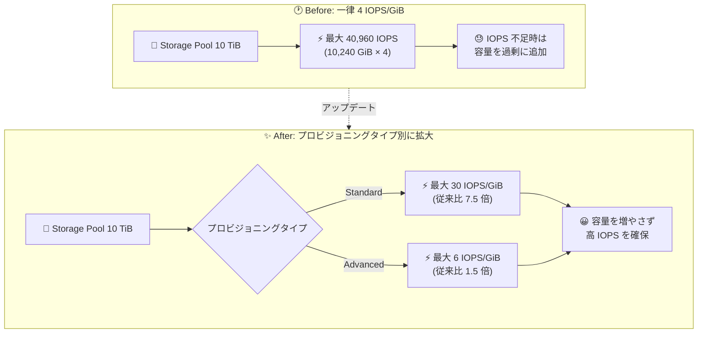

# Compute Engine: Hyperdisk Balanced Storage Pools の GiB あたり最大 IOPS が引き上げ

**リリース日**: 2026-07-27

**サービス**: Compute Engine

**機能**: Hyperdisk Balanced Storage Pools の GiB あたり最大 IOPS 引き上げ

**ステータス**: Feature (GA)

📊 [このアップデートのインフォグラフィックを見る](https://takech9203.github.io/google-cloud-news-summary/20260727-compute-engine-hyperdisk-storage-pools-iops-increase.html)

## 概要

Compute Engine の Hyperdisk Balanced Storage Pools において、プロビジョニングできる容量 (GiB) あたりの最大 IOPS が引き上げられました。従来はプロビジョニングタイプに関わらず 4 IOPS/GiB が上限でしたが、今回のアップデートにより、Standard パフォーマンスプロビジョニングでは 30 IOPS/GiB、Advanced パフォーマンスプロビジョニングでは 6 IOPS/GiB まで設定できるようになりました。

Hyperdisk Storage Pools は、複数の Hyperdisk の容量とパフォーマンスをプール単位で集約管理する仕組みです。プールに対して容量・IOPS・スループットをまとめてプロビジョニングし、その中に作成した各ディスクがリソースを消費します。今回の変更により、同じプール容量に対してより多くの IOPS を割り当てられるようになり、容量は小さいが IOPS 要求が高いワークロード (データベースなど) でのプール設計の自由度が大きく向上します。

対象ユーザーは、Hyperdisk Balanced Storage Pools を利用して多数のディスクを集約管理している組織、特に IOPS 集約型のデータベースワークロードや GKE のステートフルワークロードを運用しているユーザーです。

**アップデート前の課題**

- 従来は Hyperdisk Balanced Storage Pool の GiB あたり最大 IOPS が 4 IOPS/GiB に制限されていた
- IOPS 集約型のワークロードでは、必要な IOPS を確保するためだけに実際には不要な容量まで大きくプロビジョニングする必要があった
- 結果として、容量利用効率が低下し、余剰容量分のコストが発生していた

**アップデート後の改善**

- Standard パフォーマンスプロビジョニングでは最大 30 IOPS/GiB (従来比 7.5 倍) まで設定可能になった
- Advanced パフォーマンスプロビジョニングでは最大 6 IOPS/GiB (従来比 1.5 倍) まで設定可能になった
- 必要な容量に対して十分な IOPS を割り当てられるため、容量の過剰プロビジョニングが不要になり、コスト効率が向上した

## アーキテクチャ図



同じプール容量でも、プロビジョニングタイプに応じてより多くの IOPS を割り当てられるようになり、容量の過剰プロビジョニングが不要になったことを示しています。

## サービスアップデートの詳細

### 主要機能

1. **Standard パフォーマンスプロビジョニングの上限拡大 (4 → 30 IOPS/GiB)**
   - プールに作成した各ディスクのパフォーマンスがプールの他のディスクと共有されない方式
   - ピークが重なるワークロード (毎朝ピークを迎えるデータベース群など) に適する
   - 各ディスクの最初の 3,000 IOPS / 140 MiB/s のベースラインパフォーマンスはプールのリソースを消費しない

2. **Advanced パフォーマンスプロビジョニングの上限拡大 (4 → 6 IOPS/GiB)**
   - プロビジョニングしたパフォーマンスをプール内の全ディスクで動的に共有するシンプロビジョニング方式
   - プールにプロビジョニングした IOPS/スループットの最大 500% までディスクに割り当て可能
   - ピークタイミングの相関が低いワークロードに適する

3. **プール設計の柔軟性向上**
   - 容量要件と IOPS 要件を独立して最適化できるようになり、小容量・高 IOPS のプール構成が可能になった

## 技術仕様

### Hyperdisk Balanced Storage Pool の制限値 (アップデート後)

| 項目 | 値 |
|------|------|
| GiB あたり最大 IOPS (Standard パフォーマンス) | **30** (従来: 4) |
| GiB あたり最大 IOPS (Advanced パフォーマンス) | **6** (従来: 4) |
| プールあたり最大 IOPS | 4,194,304 |
| プールあたり最小 IOPS | 0 (Standard) / 10,000 (Advanced) |
| IOPS の増分単位 | 10,000 の倍数 |
| プールの最大プロビジョニング容量 | 5 PiB |
| プールの最小プロビジョニング容量 | 10 TiB |
| プールあたり最大ディスク数 | 10,000 |
| GiB あたり最大スループット | 1 MiB/s |
| 容量・パフォーマンス変更の頻度 | 24 時間に 2 回まで |

### 設定例: 10 TiB プールでの最大 IOPS

| プロビジョニングタイプ | 従来の最大 IOPS | 新しい最大 IOPS |
|------|------|------|
| Standard パフォーマンス | 40,960 (4 × 10,240 GiB) | 307,200 (30 × 10,240 GiB) |
| Advanced パフォーマンス | 40,960 (4 × 10,240 GiB) | 61,440 (6 × 10,240 GiB) |

## 設定方法

### 前提条件

1. Hyperdisk Balanced をサポートするマシンシリーズを使用していること
2. Hyperdisk Balanced が利用可能なゾーンであること (`gcloud compute storage-pool-types list --filter="name=hyperdisk-balanced"` で確認可能)

### 手順

#### ステップ 1: 新しい上限で Storage Pool を作成

```bash
gcloud compute storage-pools create my-hdb-pool \
    --zone=us-central1-a \
    --storage-pool-type=hyperdisk-balanced \
    --provisioned-capacity=10TB \
    --provisioned-iops=300000 \
    --provisioned-throughput=1024 \
    --capacity-provisioning-type=standard \
    --performance-provisioning-type=standard
```

Standard パフォーマンスプロビジョニングであれば、10 TiB のプールに対して最大 30 IOPS/GiB まで IOPS をプロビジョニングできます。

#### ステップ 2: 既存プールの IOPS を引き上げ

```bash
gcloud compute storage-pools update my-hdb-pool \
    --zone=us-central1-a \
    --provisioned-iops=300000
```

既存プールでも、容量を増やすことなくプロビジョニング IOPS を新しい上限まで引き上げられます。なお、プールのパフォーマンス変更は 24 時間に 2 回までという制限があります。

## メリット

### ビジネス面

- **コスト効率の向上**: IOPS 確保のためだけの容量過剰プロビジョニングが不要になり、ストレージコストを削減できる
- **キャパシティプランニングの簡素化**: 容量と IOPS を独立して計画できるため、プール設計がシンプルになる

### 技術面

- **高 IOPS ワークロードへの対応**: 小容量でも高い IOPS が必要なデータベースなどのワークロードをプールで集約管理しやすくなった
- **既存プールでの引き上げ**: プールの再作成なしに、プロビジョニング IOPS の更新だけで新しい上限を活用できる

## デメリット・制約事項

### 制限事項

- プールあたりの最大 IOPS は 4,194,304 で変更なし
- IOPS のプロビジョニングは 10,000 の倍数単位
- プールのパフォーマンス変更は 24 時間に 2 回まで
- プールのプロビジョニングモデル (Standard/Advanced) は作成後に変更できない
- Storage Pools はゾーンリソースであり、リージョナルディスクは非対応

### 考慮すべき点

- Advanced パフォーマンスプロビジョニングの上限は 6 IOPS/GiB であり、Standard (30 IOPS/GiB) と大きく異なるため、ワークロードのピーク特性に応じたタイプ選択が重要
- Advanced パフォーマンスプールでは、全ディスクの合計使用パフォーマンスがプールのプロビジョニング量に達するとリソース競合が発生し得るため、モニタリングが必要
- Hyperdisk Storage Pools はリソースベースの確約利用割引 (CUD) や継続利用割引 (SUD) の対象外

## ユースケース

### ユースケース 1: 高 IOPS データベース群のプール集約

**シナリオ**: 容量は各 500 GiB 程度と小さいものの、ピーク時に高い IOPS を要求するデータベース VM を多数運用している。従来は 4 IOPS/GiB の制限により、必要な IOPS を確保するためにプール容量を実需要より大きくプロビジョニングしていた。

**実装例**:
```bash
# 10 TiB / 300,000 IOPS の Standard パフォーマンスプール
gcloud compute storage-pools create db-pool \
    --zone=asia-northeast1-b \
    --storage-pool-type=hyperdisk-balanced \
    --provisioned-capacity=10TB \
    --provisioned-iops=300000 \
    --provisioned-throughput=1024 \
    --performance-provisioning-type=standard
```

**効果**: 容量を増やさずに従来比最大 7.5 倍の IOPS をプロビジョニングでき、余剰容量分のコストを削減できる。

### ユースケース 2: 既存プールの IOPS 増強

**シナリオ**: 既存の Hyperdisk Balanced Storage Pool が 4 IOPS/GiB の上限に達しており、ワークロードの成長に対応するには容量追加しか選択肢がなかった。

**効果**: プールの再作成や容量追加なしに、プロビジョニング IOPS の更新のみで性能を増強できる。

## 料金

Hyperdisk Storage Pools は、プールにプロビジョニングした容量・スループット・IOPS に対して月額で課金されます。プール内に作成した個々のディスクのプロビジョニング容量・性能には課金されません。

- Standard 容量 / Standard パフォーマンスのプールは、スタンドアロンの Hyperdisk Balanced ディスクと同じ単価
- Advanced 容量 / Advanced パフォーマンスのプールは、シンプロビジョニングとデータ削減機能のため単価が高い (ただし利用効率の向上により総コストは削減できる場合がある)
- Hyperdisk Storage Pools はリソースベースの確約利用割引 (CUD)・継続利用割引 (SUD) の対象外

詳細は [ディスク料金ページ](https://docs.cloud.google.com/compute/disks-image-pricing#section-2) を参照してください。

## 利用可能リージョン

Hyperdisk Balanced Storage Pools は、Hyperdisk Balanced が利用可能なすべてのゾーンで使用できます。最新の対応リージョン・ゾーンは以下のコマンドで確認できます。

```bash
gcloud compute storage-pool-types list --filter="name=hyperdisk-balanced"
```

## 関連サービス・機能

- **Hyperdisk Balanced**: プール内に作成するディスクタイプ。ベースライン 3,000 IOPS / 140 MiB/s を持ち、Standard パフォーマンスプールではベースライン分はプールリソースを消費しない
- **Google Kubernetes Engine (GKE)**: ステートフルワークロードの永続ボリュームとして Hyperdisk Storage Pools を利用可能
- **Cloud Monitoring**: プールの容量・パフォーマンス使用率の監視に使用。特に Advanced プロビジョニングではリソース枯渇の監視が推奨される
- **Compute Engine 予約 (Reservations)**: 予約を消費するインスタンスと Storage Pool 内の Hyperdisk を組み合わせて利用可能

## 参考リンク

- 📊 [インフォグラフィック](https://takech9203.github.io/google-cloud-news-summary/20260727-compute-engine-hyperdisk-storage-pools-iops-increase.html)
- [公式リリースノート](https://docs.cloud.google.com/release-notes#July_27_2026)
- [Hyperdisk Storage Pools のドキュメント (制限値)](https://docs.cloud.google.com/compute/docs/disks/storage-pools#hdsp-limits)
- [料金ページ (ディスク料金)](https://docs.cloud.google.com/compute/disks-image-pricing#section-2)

## まとめ

Hyperdisk Balanced Storage Pools の GiB あたり最大 IOPS が 4 から Standard で 30、Advanced で 6 に引き上げられ、容量と IOPS を独立して最適化できるようになりました。IOPS 確保のために容量を過剰にプロビジョニングしていた場合は、プール構成を見直すことでコスト削減の余地があります。既存プールでもプロビジョニング IOPS の更新だけで新しい上限を活用できるため、まずは現在のプールの IOPS/容量比を確認することを推奨します。

---

**タグ**: Compute Engine, Hyperdisk, Storage Pools, IOPS, ブロックストレージ, パフォーマンス
