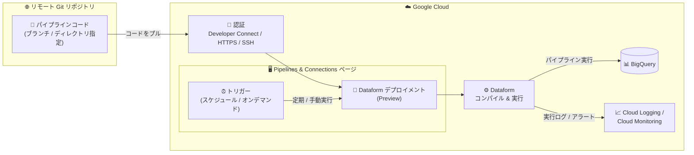

# Dataform: Dataform デプロイメント (Preview)

**リリース日**: 2026-07-27

**サービス**: Dataform

**機能**: リモート Git リポジトリと連携したパイプラインデプロイメントの一元管理

**ステータス**: Preview

📊 [このアップデートのインフォグラフィックを見る](https://takech9203.github.io/google-cloud-news-summary/20260727-dataform-deployments-preview.html)

## 概要

Google Cloud は 2026 年 7 月 27 日、Dataform の新機能「Dataform デプロイメント (Dataform deployments)」を Preview として発表しました。この機能は、リモート Git リポジトリに接続されたパイプラインデプロイメントを、Google Cloud コンソールの「Pipelines & Connections」ページから一元的に作成・管理できる新しいエクスペリエンスを提供します。

デプロイメントは、GitHub などのリモート Git リポジトリに保存されたコード (パイプラインなど) をスケジュール実行するための仕組みです。コードが配置されているディレクトリを指定し、リモートリポジトリからコードをプルして定期実行するトリガーを構成できます。実行ログは Google Cloud コンソール内で直接確認でき、アラートについては Cloud Logging および Cloud Monitoring と統合されています。

対象ユーザーは、Dataform で SQL ワークフローや BigQuery パイプラインを運用しているデータエンジニアリングチームです。特に、Git ベースの CI/CD プラクティスに沿ってデータパイプラインのコードを管理し、本番環境へのデプロイと実行スケジューリングを簡素化したいチームに価値があります。

**アップデート前の課題**

このアップデート以前は、リモート Git リポジトリのコードをスケジュール実行するために、複数の設定を個別に組み合わせる必要がありました。

- リモートリポジトリ連携、コンパイル設定 (リリース構成)、スケジュール設定 (ワークフロー構成) を、Dataform リポジトリごとに個別のページ・手順で構成する必要があった
- リモートリポジトリと接続されたパイプラインのデプロイ状況を一覧で把握できる一元的な管理画面がなかった
- デプロイメントという単位で、接続先ブランチ・対象ディレクトリ・スケジュール・コンパイル設定をまとめて管理する手段がなかった

**アップデート後の改善**

- 「Pipelines & Connections」ページから、リモートリポジトリに接続されたデプロイメントの作成・一覧表示・管理が一元的に行えるようになった
- リポジトリ認証 (Developer Connect / HTTPS / SSH)、ブランチ、コードディレクトリ、スケジュール、コンパイルオーバーライド (スキーマサフィックス、テーブルプレフィックス、コンパイル変数など) を 1 つの作成フローで設定できるようになった
- スケジュール実行またはオンデマンド実行のトリガーをデプロイメント単位で構成でき、実行ログを Google Cloud コンソール内で直接確認できるようになった

## アーキテクチャ図



デプロイメントは、リモート Git リポジトリからコードをプルし、トリガーに従って Dataform でコンパイル・実行して BigQuery に反映します。実行ログとアラートは Cloud Logging / Cloud Monitoring と統合されています。

## サービスアップデートの詳細

### 主要機能

1. **リモートリポジトリに接続されたデプロイメントの作成・管理**
   - Google Cloud コンソールの「Pipelines & Connections」ページから「Create > Create deployment」でデプロイメントを作成
   - リポジトリ、ブランチ、コードが配置されているディレクトリのパスを指定
   - 作成済みデプロイメントの一覧表示・詳細確認が同一ページで可能

2. **3 種類のリポジトリ認証方式**
   - **Developer Connect**: 接続済みリポジトリとブランチを選択するだけで利用可能。手動のシークレット管理が不要
   - **HTTPS**: リモートリポジトリの URL と、パーソナルアクセストークンを格納した Secret Manager のシークレットを指定
   - **SSH**: リモートリポジトリの URL と、秘密鍵および SSH 公開ホスト鍵を格納したシークレットを指定

3. **トリガーによるスケジュール実行**
   - 実行頻度 (Repeats)、実行時刻 (At time)、タイムゾーンを指定した定期実行スケジュールを構成
   - オンデマンド実行 (On-demand) の選択も可能
   - デプロイメント詳細ページの「Triggers (workflow configurations)」セクションから、スケジュールの作成・即時実行 (Run now)・削除が可能

4. **コンパイルオーバーライドの設定**
   - Google Cloud プロジェクト ID、スキーマサフィックス、テーブルプレフィックス、デフォルトスキーマ、コンパイル変数をデプロイメント作成時にオプションとして指定可能
   - 環境ごと (開発 / ステージング / 本番) の出力先の分離に活用できる

5. **実行ログの確認と監視統合**
   - 実行ログを Google Cloud コンソール内で直接確認可能
   - アラートは Cloud Logging / Cloud Monitoring との統合により構成 (ワークフロー実行失敗時の通知など)

## 技術仕様

### 前提条件と要件

| 項目 | 詳細 |
|------|------|
| ステータス | Preview (Pre-GA Offerings Terms が適用) |
| 管理画面 | Google Cloud コンソール「Pipelines & Connections」ページ (オプトインが必要) |
| 必要な API | BigQuery API、Dataform API、Developer Connect API |
| 認証方式 | Developer Connect / HTTPS (パーソナルアクセストークン) / SSH (秘密鍵) |
| トリガー | スケジュール (頻度・時刻・タイムゾーン指定) またはオンデマンド |
| 監視・アラート | Cloud Logging / Cloud Monitoring と統合 (組み込みアラートなし) |
| フィードバック窓口 | cloud-pipelines-ui@google.com |

### 必要な IAM ロール

| ロール | 付与対象 | 用途 |
|--------|---------|------|
| Dataform Admin (`roles/dataform.admin`) | プロジェクト | デプロイメントの作成・管理 |
| BigQuery Job User (`roles/bigquery.jobUser`) | プロジェクト | BigQuery ジョブの実行 |
| Developer Connect Viewer (`roles/developerconnect.viewer`) | プロジェクト | Developer Connect 接続の参照 |
| Service Account User (`roles/iam.serviceAccountUser`) | カスタムサービスアカウント | カスタムサービスアカウントでの実行 |
| BigQuery Data Editor (`roles/bigquery.dataEditor`) | カスタムサービスアカウント | データセットへの書き込み |

## 設定方法

### 前提条件

1. Google Cloud コンソールで「Pipelines & Connections」ページの利用にオプトインする
2. BigQuery API、Dataform API、Developer Connect API を有効化する
3. Developer Connect を使用する場合は、リモートリポジトリを Developer Connect で接続しておく
4. 上記の必要な IAM ロールを付与する

### 手順

#### ステップ 1: デプロイメントの作成

1. Google Cloud コンソールで「Pipelines & Connections」ページに移動
2. 「Create > Create deployment」をクリック
3. リポジトリ認証タイプ (Developer Connect / HTTPS / SSH) を選択
4. リポジトリ (または URL)、ブランチ、コードのディレクトリパスを指定
5. デプロイメント名とリージョンを選択
6. スケジュール頻度 (Repeats / At time / Timezone) を設定、またはオンデマンドを選択
7. 必要に応じてプロジェクト ID、スキーマサフィックス、テーブルプレフィックス、デフォルトスキーマ、コンパイル変数を指定
8. 「Deploy」をクリック

#### ステップ 2: トリガー (スケジュール) の管理

1. 「Pipelines & Connections」ページの「Deployments」タブでデプロイメントを選択
2. 「Triggers (workflow configurations)」セクションで「Create」をクリックしてスケジュールを追加
3. 即時実行する場合は、対象スケジュールの「View actions > Run now」をクリック

#### ステップ 3: アラートの構成

ワークフロー実行の失敗通知を受け取るには、Cloud Logging / Cloud Monitoring でワークフロー呼び出し失敗のアラートを構成します。

## メリット

### ビジネス面

- **運用の一元化**: リモートリポジトリ連携からスケジュール実行、ログ確認までを 1 つの画面で完結でき、パイプライン運用の管理負荷を軽減
- **ガバナンスの向上**: Git リポジトリを信頼できる唯一のソースとして、本番環境で実行されるコードのバージョンとブランチを明確に管理できる

### 技術面

- **柔軟な認証方式**: Developer Connect によりシークレットの手動管理が不要になるほか、既存の HTTPS / SSH 接続にも対応
- **環境分離が容易**: コンパイルオーバーライド (スキーマサフィックス、テーブルプレフィックス、コンパイル変数) により、同一コードベースから環境ごとに異なる出力先へデプロイ可能
- **監視との統合**: 実行ログをコンソールで直接確認でき、Cloud Logging / Cloud Monitoring によるアラート構成が可能

## デメリット・制約事項

### 制限事項

- デプロイメントには組み込みのアラート機能がなく、Cloud Logging / Cloud Monitoring でアラートを構成する必要がある
- Developer Connect による認証は connections のみをサポートし、account connectors はサポートされない
- 利用には「Pipelines & Connections」ページへのオプトインが必要

### 考慮すべき点

- Preview 段階の機能であり、Pre-GA Offerings Terms が適用される。サポートが限定的な可能性があるため、本番の重要ワークロードへの適用は慎重に判断する
- HTTPS / SSH 認証では Secret Manager でのシークレット管理が必要になる。シークレット管理を避けたい場合は Developer Connect の利用を推奨
- プライベートネットワーク内の Git ホストへは HTTPS / SSH での直接接続ができないため、Developer Connect 経由での接続が必要

## ユースケース

### ユースケース 1: GitHub をソースとする本番データパイプラインの定期実行

**シナリオ**: データエンジニアリングチームが Dataform の SQL ワークフローを GitHub で管理しており、main ブランチにマージされたコードを毎日深夜に本番環境で自動実行したい。

**実装例**:
```
1. Developer Connect で GitHub リポジトリを接続
2. Pipelines & Connections ページで Create deployment を実行
   - リポジトリ: 対象の GitHub リポジトリ
   - ブランチ: main
   - ディレクトリ: definitions のあるパス
   - スケジュール: 毎日 02:00 (Asia/Tokyo)
3. コンパイル変数で環境を指定 (例: env=prod)
4. Cloud Monitoring で実行失敗時のアラートを構成
```

**効果**: マージ済みコードのみが本番実行される Git ベースの運用が、シークレット管理なしで実現できる。

### ユースケース 2: 同一コードベースからの複数環境デプロイ

**シナリオ**: 同じパイプラインコードを、ステージング環境と本番環境で異なる BigQuery データセットに対して実行したい。

**効果**: ブランチとスキーマサフィックス / テーブルプレフィックスを変えた複数のデプロイメントを作成することで、コードを複製せずに環境ごとの出力先を分離できる。

## 料金

Dataform 自体は無料のサービスであり、Dataform デプロイメントの利用そのものに追加料金は発生しません。ただし、パイプライン実行によって発生する BigQuery のクエリ処理やストレージ、Secret Manager のシークレット保管など、連携サービスの利用料金が発生します。

詳細は [Dataform の料金ページ](https://cloud.google.com/dataform/pricing) を参照してください。

## 利用可能リージョン

デプロイメント作成時にリージョンを選択します。利用可能なリージョンの詳細は [Dataform のロケーションドキュメント](https://docs.cloud.google.com/dataform/docs/locations) を参照してください。

## 関連サービス・機能

- **BigQuery**: Dataform パイプラインの実行先。デプロイメントの実行には BigQuery API と BigQuery Job User ロールが必要
- **Developer Connect**: 手動のシークレット管理なしでサードパーティ Git リポジトリ (GitHub、Bitbucket など) と接続する推奨の認証方式。プライベートネットワーク内のリポジトリにも対応
- **Secret Manager**: HTTPS (パーソナルアクセストークン) / SSH (秘密鍵) 認証で使用するシークレットの保管
- **Cloud Logging / Cloud Monitoring**: デプロイメントの実行ログの記録と、ワークフロー実行失敗時のアラート構成
- **Dataform ワークフロー構成 (workflow configurations)**: デプロイメントのトリガーとして機能するスケジュール実行の仕組み

## 参考リンク

- 📊 [インフォグラフィック](https://takech9203.github.io/google-cloud-news-summary/20260727-dataform-deployments-preview.html)
- [公式リリースノート](https://docs.cloud.google.com/release-notes#July_27_2026)
- [ドキュメント: Create and manage deployments](https://docs.cloud.google.com/dataform/docs/deployments)
- [ドキュメント: リモートリポジトリの接続](https://docs.cloud.google.com/dataform/docs/connect-repository)
- [ドキュメント: スケジュール実行 (workflow configurations)](https://docs.cloud.google.com/dataform/docs/schedule-runs)
- [料金ページ](https://cloud.google.com/dataform/pricing)

## まとめ

Dataform デプロイメントは、リモート Git リポジトリと連携したパイプラインの作成・スケジュール実行・ログ確認を「Pipelines & Connections」ページに集約する、Git ベースのデータパイプライン運用を簡素化するアップデートです。Dataform を Git 管理で運用しているチームは、Developer Connect と組み合わせてシークレット管理不要のデプロイフローを Preview で検証することを推奨します。本番の重要ワークロードへの適用は、GA 昇格を待って判断するのが安全です。

---

**タグ**: #Dataform #BigQuery #DeveloperConnect #Git #DataPipeline #Preview
