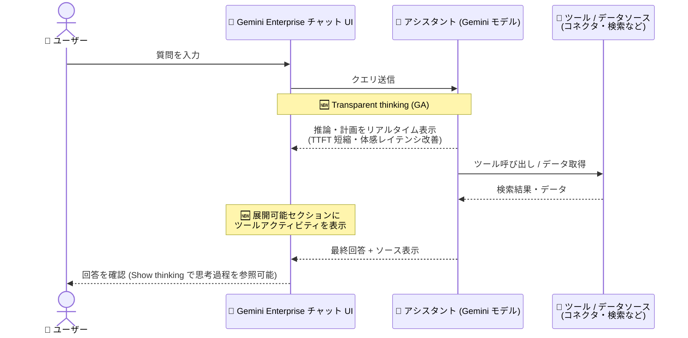

# Gemini Enterprise: Transparent thinking (透過的な思考プロセス表示) が GA

**リリース日**: 2026-07-27

**サービス**: Gemini Enterprise

**機能**: Transparent thinking (透過的な思考プロセス表示)

**ステータス**: GA (一般提供)

📊 [このアップデートのインフォグラフィックを見る](https://takech9203.github.io/google-cloud-news-summary/20260727-gemini-enterprise-transparent-thinking-ga.html)

## 概要

Gemini Enterprise のチャットアシスタントにおいて、**Transparent thinking (透過的な思考プロセス表示)** が一般提供 (GA) になりました。チャットでの対話中に、アシスタントがツールやデータソースを呼び出す前に、リアルタイムの推論・計画 (Reasoning / Planning) の内容をユーザーインターフェース上に表示します。

さらに、思考フェーズと最終回答の間に実行されたツールアクティビティ (どのツールやデータソースにアクセスしたか) を、展開可能なセクションとして確認できます。この透明性の向上により、**最初のトークンが表示されるまでの時間 (TTFT: Time To First Token) が短縮**され、合計応答時間を増やすことなく体感レイテンシが改善されます。

Gemini Enterprise でエンタープライズ検索やアシスタントチャットを利用するすべてのユーザー、および AI アシスタントの回答根拠の説明可能性を重視する組織の管理者・推進担当者にとって重要なアップデートです。

**アップデート前の課題**

- ツールやデータソースの呼び出しを伴う複雑なクエリでは、最終回答が生成されるまでユーザーは画面上で何も確認できず、待ち時間が長く感じられた (体感レイテンシの問題)
- アシスタントがどのような推論・計画に基づいて回答を組み立てているかがユーザーから見えず、回答プロセスがブラックボックスだった
- どのツールやデータソースが回答生成に使われたかを、処理の途中で把握する手段が限られていた

**アップデート後の改善**

- ツール呼び出しの前に推論・計画がリアルタイムで表示されるため、TTFT が短縮され、合計応答時間を増やすことなく体感レイテンシが改善された
- 「Show thinking」からモデルがクエリやプロンプトをどのように処理しているかを確認でき、回答プロセスの透明性が向上した
- 思考フェーズと最終回答の間のツールアクティビティが展開可能なセクションで表示され、どのデータソースにアクセスしたかを把握しやすくなった

## アーキテクチャ図

ユーザーの質問に対して、アシスタントがツールを呼び出す前に推論・計画を UI に表示し、ツールアクティビティを展開可能セクションとして提示した上で最終回答を返すフローです。

## サービスアップデートの詳細

### 主要機能

1. **リアルタイムの推論・計画の表示**
   - チャット対話中、アシスタントがツールやデータソースを呼び出す前に、推論と計画の内容をリアルタイムで UI に表示
   - ユーザーは回答を待つ間に、アシスタントが何を考え、どう進めようとしているかを確認できる

2. **展開可能なツールアクティビティセクション**
   - 思考フェーズと最終回答の間に実行されたツールアクティビティを、展開可能なセクションとして表示
   - どのツールやデータソースが回答生成に使われたかを段階的に追跡できる

3. **体感レイテンシの改善 (TTFT の短縮)**
   - 最終回答の生成を待たずに思考内容が表示されるため、最初のトークンまでの時間 (TTFT) が短縮
   - 合計応答時間を増やすことなく、待ち時間の体感が改善される

4. **Show thinking による思考過程の確認**
   - 回答の「Show thinking」をクリックすると、モデルがクエリやプロンプトをどのように処理したかを確認可能
   - 回答末尾の「Sources」からは回答に使用されたデータソースを確認でき、ソースにカーソルを合わせると該当箇所がハイライトされる

## 技術仕様

### 機能の概要

| 項目 | 詳細 |
|------|------|
| 対象機能 | Gemini Enterprise アシスタントチャット |
| 表示タイミング | ツール / データソース呼び出しの前 (リアルタイム) |
| ツールアクティビティ | 思考フェーズと最終回答の間に展開可能セクションで表示 |
| パフォーマンス効果 | TTFT の短縮、体感レイテンシの改善 (合計応答時間は増加しない) |
| 確認方法 | 「Show thinking」で思考過程、「Sources」でデータソースを確認 |
| ローカライズ | 思考中 (Thinking) のコンテンツはローカライズされないが、「Show thinking」で確認する際のステップはローカライズされる |

## 設定方法

Transparent thinking は Gemini Enterprise のアシスタントチャットに組み込まれた機能であり、個別の有効化設定は不要です。

### 利用手順

#### ステップ 1: 質問を入力する

Gemini Enterprise アプリのチャットボックスに質問を入力します。アシスタントが処理を開始すると、ツール呼び出しの前に推論・計画がリアルタイムで表示されます。

#### ステップ 2: 思考過程とツールアクティビティを確認する

- 「**Show thinking**」をクリックすると、モデルがクエリやプロンプトをどのように処理したかを確認できます
- 思考フェーズと最終回答の間に表示される展開可能セクションで、ツールアクティビティ (アクセスしたツール / データソース) を確認できます

#### ステップ 3: ソースを確認する

- 回答の末尾にある「**Sources**」をクリックすると、アシスタントが使用したデータソースの一覧が表示されます
- 一覧のソースにカーソルを合わせると、そのソースが裏付けている回答箇所がハイライトされます

## メリット

### ビジネス面

- **AI 回答の説明可能性の向上**: どのような推論・計画で回答が組み立てられたか、どのデータソースが使われたかを確認できるため、エンタープライズにおける AI 活用のガバナンスや信頼性の要件に応えやすくなる
- **ユーザー体験の改善による利用定着**: 複雑なクエリでも「待たされている感覚」が減り、社内でのアシスタント利用の定着を後押しする

### 技術面

- **TTFT の短縮**: 最終回答の生成を待たずに思考内容の表示が始まるため、最初のトークンまでの時間が短縮される
- **合計応答時間は不変**: 体感レイテンシの改善は表示方式の工夫によるもので、合計応答時間が増加することはない
- **トラブルシューティングの容易化**: 期待と異なる回答が返った場合に、思考過程とツールアクティビティを確認することで、プロンプトの改善やデータソース設定の見直しに役立てられる

## デメリット・制約事項

### 制限事項

- 思考中 (Thinking) に表示されるコンテンツはローカライズされない (「Show thinking」でステップを確認する際はローカライズされる)

### 考慮すべき点

- 思考過程の表示はあくまで UI 上の透明性向上であり、回答品質そのものを変えるものではない
- ユーザーへの周知 (Show thinking や Sources の使い方) を行うことで、機能の価値を最大限に引き出せる

## ユースケース

### ユースケース 1: 社内ナレッジ検索での回答根拠の確認

**シナリオ**: 社員が Gemini Enterprise で社内ドキュメント (Google Drive、SharePoint など) を横断検索し、ポリシーに関する質問をする。回答の根拠が正しいか確認したい。

**効果**: 思考過程の表示とツールアクティビティにより、アシスタントがどのコネクタ・データソースを参照したかを確認できる。「Sources」で回答の裏付け箇所をハイライト表示できるため、回答の妥当性を短時間で検証できる。

### ユースケース 2: 複雑な分析クエリでの待ち時間の改善

**シナリオ**: 複数のデータソースを横断する複雑な質問 (例: 「直近の営業レポートと契約書を突き合わせて要点をまとめて」) では、ツール呼び出しが多く応答に時間がかかる。

**効果**: ツール呼び出しの前に推論・計画がリアルタイムに表示されるため、ユーザーは処理の進行状況を把握でき、体感的な待ち時間が大幅に改善される。合計応答時間は増加しない。

## 料金

Transparent thinking は Gemini Enterprise アシスタントチャットの組み込み機能であり、追加料金に関する記載はありません。Gemini Enterprise 自体はシートベースのサブスクリプション料金です。

### 料金例 (Gemini Enterprise エディション)

| エディション | 月額料金 (1 シートあたり) |
|--------------|---------------------------|
| Business | $21 USD〜 |
| Standard / Plus | $30 USD〜 |

詳細は [Gemini Enterprise の料金ページ](https://cloud.google.com/gemini-enterprise) を参照してください。

## 利用可能リージョン

リリースノートにリージョン固有の記載はありません。詳細は [Gemini Enterprise ドキュメント](https://docs.cloud.google.com/gemini/enterprise/docs) を参照してください。

## 関連サービス・機能

- **Gemini Enterprise コネクタ (Google Drive / SharePoint / Box / Outlook など)**: アシスタントが回答生成時に呼び出すデータソース。Transparent thinking のツールアクティビティ表示で、どのコネクタが使われたかを確認できる
- **Sources (ソース表示)**: 回答末尾からアシスタントが使用したデータソースを確認できる既存機能。Transparent thinking と組み合わせることで、思考過程から根拠までを一貫して追跡できる
- **Gemini Notebook Enterprise / Deep Research**: Gemini Enterprise に含まれる Google 製エージェント群。アシスタントチャットと同じ基盤で企業データを活用する

## 参考リンク

- 📊 [インフォグラフィック](https://takech9203.github.io/google-cloud-news-summary/20260727-gemini-enterprise-transparent-thinking-ga.html)
- [公式リリースノート](https://docs.cloud.google.com/release-notes#July_27_2026)
- [ドキュメント: Ask questions and view sources](https://docs.cloud.google.com/gemini/enterprise/docs/assistant-chat#ask_questions_and_view_sources)
- [Gemini Enterprise エディション](https://docs.cloud.google.com/gemini/enterprise/docs/editions)
- [料金ページ](https://cloud.google.com/gemini-enterprise)

## まとめ

Transparent thinking の GA により、Gemini Enterprise アシスタントの推論・計画とツールアクティビティが可視化され、TTFT の短縮による体感レイテンシの改善と回答プロセスの透明性向上が同時に実現されました。Gemini Enterprise を利用中の組織は、「Show thinking」と「Sources」の使い方をユーザーに周知し、回答根拠の確認フローに組み込むことを推奨します。

---

**タグ**: #GeminiEnterprise #AI #GA #TransparentThinking #UX #エンタープライズ検索
