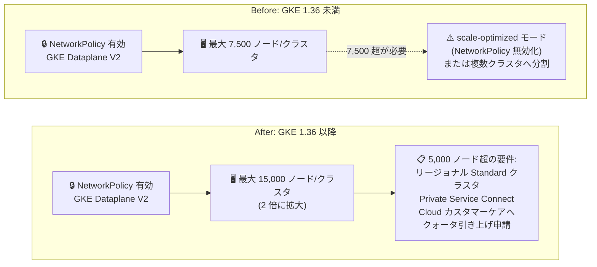

# Google Kubernetes Engine: Dataplane V2 + NetworkPolicy 使用時のノード上限が 15,000 に倍増

**リリース日**: 2026-07-27

**サービス**: Google Kubernetes Engine (GKE)

**機能**: GKE Dataplane V2 (NetworkPolicy 有効) クラスタのノード上限拡大 (7,500 → 15,000)

**ステータス**: Feature (GKE 1.36 以降)

📊 [このアップデートのインフォグラフィックを見る](https://takech9203.github.io/google-cloud-news-summary/20260727-gke-dataplane-v2-15000-nodes.html)

## 概要

GKE バージョン 1.36 以降で、NetworkPolicy を使用する GKE Dataplane V2 クラスタが 1 クラスタあたり最大 15,000 ノードをサポートするようになりました。従来の上限である 7,500 ノードから 2 倍への引き上げです。5,000 ノードを超えるクラスタを構成する場合は、Cloud カスタマーケアに連絡してクォータの引き上げをリクエストする必要があります。

これまで、ネットワークポリシーによる Pod 間通信制御を維持したまま超大規模クラスタを運用するには 7,500 ノードが上限であり、それを超えるスケール (最大 65,000 ノード) には、ネットワークポリシー適用を無効化する Dataplane V2 の scale-optimized モードが必要でした。今回のアップデートにより、ネットワークポリシーによるセキュリティ制御を犠牲にすることなく到達できるクラスタ規模が大幅に拡大します。

HPC、大規模データ処理、大規模 AI/ML トレーニングなど、単一クラスタで数千〜1 万ノード超を必要とするワークロードを、マルチテナント分離やゼロトラストのネットワーク制御と両立して運用したいユーザーにとって重要なアップデートです。

**アップデート前の課題**

- NetworkPolicy を有効にした GKE Dataplane V2 クラスタは、1 クラスタあたり最大 7,500 ノードまでしかスケールできなかった
- 7,500 ノードを超える規模が必要な場合、ネットワークポリシー適用を無効化する scale-optimized モードを使うか、複数クラスタにワークロードを分割する必要があった
- クラスタ分割はフリート管理などの追加の運用負荷を伴い、単一クラスタ運用に比べて管理効率・リソース利用効率が低下していた

**アップデート後の改善**

- GKE 1.36 以降では、NetworkPolicy を有効にしたまま 1 クラスタあたり最大 15,000 ノードまでスケールできるようになった (従来比 2 倍)
- ネットワークポリシーによる Pod レベルのセキュリティ制御と超大規模スケールを両立できるようになった
- 7,500 ノード超の規模でもクラスタ分割が必須ではなくなり、単一クラスタでの管理・コスト効率・リソース利用率の利点を維持しやすくなった

## アーキテクチャ図



従来はネットワークポリシーを維持したままでは 7,500 ノードが上限でしたが、GKE 1.36 以降ではセキュリティ制御を保ったまま 15,000 ノードまで単一クラスタでスケールできます。

## サービスアップデートの詳細

### 主要機能

1. **NetworkPolicy 有効クラスタのノード上限が 15,000 に拡大**
   - GKE 1.36 以降の GKE Dataplane V2 クラスタで、NetworkPolicy を使用したまま 1 クラスタあたり最大 15,000 ノードをサポート
   - 従来の上限 7,500 ノードから 2 倍への引き上げ

2. **5,000 ノード超はクォータ引き上げ申請で対応**
   - 5,000 ノードまでのスケールは、要件 (Dataplane V2、Private Service Connect) を満たしていれば自動
   - 5,000 ノードを超える場合は、Cloud カスタマーケアに連絡してクラスタサイズとクォータの引き上げをリクエストする

3. **セキュリティとスケールの両立**
   - 15,000 ノードを超えて最大 65,000 ノードまでスケールする場合は、引き続きネットワークポリシー適用を無効化する Dataplane V2 の scale-optimized モードが必要
   - 今回の拡大により、ネットワークポリシーによる Pod 間通信制御を保ったまま到達可能な規模が大幅に広がった

## 技術仕様

### クラスタサイズ別の要件 (公式ドキュメントより)

| ノード数 | インフラ要件 | ネットワーク要件 | 申請 | ユースケース例 |
|------|------|------|------|------|
| 〜1,000 | すべてのクラスタで利用可能 | 追加要件なし | 不要 (自動) | 一般ワークロード、開発、テスト |
| 1,000〜5,000 | リージョナル Standard / Autopilot クラスタ | GKE Dataplane V2、Private Service Connect | 不要 (要件を満たせば自動) | 大量の短命ジョブ、エンタープライズサービス |
| 5,000〜15,000 | リージョナル Standard クラスタのみ。GKE 1.36 以降を推奨 (大規模スケーリングの性能改善) | GKE Dataplane V2、Private Service Connect | Cloud カスタマーケアへクォータ引き上げを申請 | HPC、データ処理ワークロード |
| 15,000〜65,000 | GKE 1.31 以降 (1.36 以降推奨)。リージョナル Standard のみ。クラスタオートスケーラー非対応 | Dataplane V2 scale-optimized モード (ネットワークポリシー適用が無効化される)、Private Service Connect | Cloud カスタマーケアへ申請 | 大規模モデルトレーニング |

### GKE Dataplane V2 の主なスケール仕様

| 項目 | 上限 (GKE) |
|------|------|
| ノード数/クラスタ | 15,000 |
| Pod 数/クラスタ | 400,000 |
| 1 Service あたりのバックエンド Pod 数 | 10,000 |
| ClusterIP Service 数 | 10,000 |
| LoadBalancer Service 数/クラスタ | 750 |
| Service マップのエントリ数 (全 Service のエンドポイント合計) | 260,000 |

### NetworkPolicy CRD に関する注意

- `CiliumNetworkPolicy` CRD (namespace スコープ) を使用するクラスタは、ゾーンクラスタ相当の上限 (最大 1,000 ノード) に制限される
- 5,000 ノード以上へのスケーリングをサポートするには、`CiliumClusterwideNetworkPolicy` CRD を使用する
- ゾーンクラスタの上限は最大 1,000 ノード (大規模スケールはリージョナルクラスタのみ)

## 設定方法

### 前提条件

1. GKE バージョン 1.36 以降のリージョナル Standard クラスタ
2. GKE Dataplane V2 が有効であること (クラスタ作成時にのみ有効化可能)
3. Private Service Connect が有効なクラスタであること
4. 5,000 ノード超のスケールには Cloud カスタマーケアへのクォータ引き上げ申請

### 手順

#### ステップ 1: Dataplane V2 有効のリージョナルクラスタを作成

```bash
gcloud container clusters create CLUSTER_NAME \
    --region COMPUTE_REGION \
    --enable-dataplane-v2 \
    --cluster-version 1.36
```

GKE Dataplane V2 は新規クラスタ作成時にのみ有効化できます。既存クラスタを Dataplane V2 にアップグレードすることはできません。

#### ステップ 2: Private Service Connect の利用を確認

```bash
gcloud container clusters describe CLUSTER_NAME \
    --region COMPUTE_REGION
```

クラスタが Private Service Connect を使用しているかどうかは、公式ドキュメントの「Clusters with Private Service Connect」の手順で確認します。

#### ステップ 3: 5,000 ノード超のクォータ引き上げを申請

5,000 ノードを超えるスケールが必要な場合は、[Cloud カスタマーケア](https://cloud.google.com/support-hub) に連絡し、クラスタサイズとクォータの引き上げをリクエストします。

## メリット

### ビジネス面

- **インフラ集約によるコスト効率**: クラスタ分割が必須だった規模のワークロードを単一クラスタに集約でき、管理コストの削減とリソース利用率の向上が見込める
- **セキュリティ要件との両立**: マルチテナント分離やコンプライアンス上ネットワークポリシーが必須の環境でも、超大規模ワークロードを GKE で実行可能になる

### 技術面

- **上限 2 倍への拡大**: NetworkPolicy 有効時のノード上限が 7,500 から 15,000 に倍増
- **セキュリティ制御の維持**: scale-optimized モード (ネットワークポリシー無効) に切り替えることなく 15,000 ノードまで到達可能
- **大規模スケーリングの性能改善**: GKE 1.36 以降では大規模クラスタのスケーリングに関する性能改善が含まれる

## デメリット・制約事項

### 制限事項

- 5,000 ノードを超えるスケールはリージョナル Standard クラスタのみ対応 (Autopilot は 5,000 ノードまで、ゾーンクラスタは 1,000 ノードまで)
- 5,000 ノード超には Private Service Connect が必須
- 5,000 ノード超は自動では拡張されず、Cloud カスタマーケアへのクォータ引き上げ申請が必要
- `CiliumNetworkPolicy` CRD を使用するクラスタは最大 1,000 ノードに制限される (`CiliumClusterwideNetworkPolicy` CRD を使用すること)
- 15,000 ノードを超えるスケール (最大 65,000 ノード) には scale-optimized モードが必要で、ネットワークポリシー適用が無効化される

### 考慮すべき点

- ノード数以外の Dataplane V2 の上限 (Pod 400,000/クラスタ、Service マップ 260,000 エントリなど) は引き続き適用されるため、大規模化の際はノード数以外の軸でも上限を確認する必要がある
- GKE Dataplane V2 は新規クラスタ作成時にのみ有効化できるため、既存の非 Dataplane V2 クラスタではクラスタの再作成が必要
- クラスタが GKE の各種上限に近づく場合は、フリート管理を用いた複数クラスタへの分割も引き続き有効な選択肢

## ユースケース

### ユースケース 1: HPC / 大規模データ処理基盤のセキュアな単一クラスタ運用

**シナリオ**: 金融リスク計算やゲノム解析などの HPC ワークロードで 1 万ノード規模のクラスタが必要だが、部門間のマルチテナント分離のためネットワークポリシーが必須。従来は 7,500 ノード上限のため 2 クラスタに分割していた。

**効果**: GKE 1.36 以降では NetworkPolicy を維持したまま単一クラスタで 15,000 ノードまでスケールでき、クラスタ分割に伴う運用負荷とリソースの分断を解消できる。

### ユースケース 2: コンプライアンス要件のある大規模バッチ処理

**シナリオ**: Pod 間通信の制御 (ネットワークポリシー) がセキュリティ標準で義務付けられている環境で、ピーク時に 7,500 ノードを超える大量の短命ジョブを実行する。

**効果**: scale-optimized モードによるネットワークポリシー無効化という妥協をせずに、ピーク時のスケール需要 (最大 15,000 ノード) に対応できる。`CiliumClusterwideNetworkPolicy` を用いればクラスタ全体の一元的な通信制御も維持できる。

## 料金

ノード上限の拡大自体に追加料金はありません。通常の GKE の料金 (クラスタ管理料金およびノードとして稼働する Compute Engine リソースの料金) が適用されます。大規模クラスタではノード数に比例してコンピュートコストが増加するため、コスト管理の仕組みと合わせて計画してください。

詳細は [GKE の料金ページ](https://cloud.google.com/kubernetes-engine/pricing) を参照してください。

## 利用可能リージョン

GKE 1.36 以降が利用可能なリージョンのリージョナル Standard クラスタで利用できます。5,000 ノード超のスケールにはクォータ引き上げ申請が必要です。

## 関連サービス・機能

- **GKE Dataplane V2**: 本アップデートの対象。eBPF (Cilium) ベースのデータプレーンで、NetworkPolicy の適用・ロギング・可観測性を提供
- **Kubernetes NetworkPolicy / CiliumClusterwideNetworkPolicy / ClusterNetworkPolicy**: Pod 間通信を制御するポリシー。大規模スケールには CiliumClusterwideNetworkPolicy (または Kubernetes ネイティブの ClusterNetworkPolicy) を使用
- **Private Service Connect**: 5,000 ノード超のスケールに必須のネットワーク要件
- **フリート管理 (Fleet Management)**: 上限を超える規模や要件でクラスタを分割する場合のマルチクラスタ管理を簡素化
- **Cloud カスタマーケア**: 5,000 ノード超のクォータ引き上げ申請窓口

## 参考リンク

- 📊 [インフォグラフィック](https://takech9203.github.io/google-cloud-news-summary/20260727-gke-dataplane-v2-15000-nodes.html)
- [公式リリースノート (2026-07-27)](https://docs.cloud.google.com/release-notes#July_27_2026)
- [大規模クラスタの計画 (5,000 ノード超の要件)](https://docs.cloud.google.com/kubernetes-engine/docs/concepts/planning-large-clusters#clusters-5k-nodes)
- [GKE Dataplane V2 の概要 (ノード上限)](https://docs.cloud.google.com/kubernetes-engine/docs/concepts/dataplane-v2#node-limits)
- [Cilium クラスタ全体ネットワークポリシーの構成](https://docs.cloud.google.com/kubernetes-engine/docs/how-to/configure-cilium-network-policy)
- [GKE 料金ページ](https://cloud.google.com/kubernetes-engine/pricing)

## まとめ

GKE 1.36 以降で、NetworkPolicy を有効にした GKE Dataplane V2 クラスタのノード上限が 7,500 から 15,000 へと倍増しました。ネットワークポリシーによるセキュリティ制御を維持したまま超大規模ワークロードを単一クラスタで運用できるようになり、HPC や大規模データ処理での構成の選択肢が広がります。7,500 ノード上限を理由にクラスタを分割している、または scale-optimized モードを検討していた場合は、GKE 1.36 へのアップグレードと Cloud カスタマーケアへのクォータ引き上げ申請を検討してください。

---

**タグ**: #GKE #Kubernetes #DataplaneV2 #NetworkPolicy #Cilium #eBPF #大規模クラスタ #スケーラビリティ #HPC
