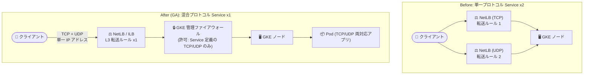

# Google Kubernetes Engine: 混合プロトコル LoadBalancer Service が GA (トラフィックルーティング修正を含む)

**リリース日**: 2026-07-27

**サービス**: Google Kubernetes Engine (GKE)

**機能**: 混合プロトコル (TCP/UDP) Service of type LoadBalancer

**ステータス**: GA (一般提供)

📊 [このアップデートのインフォグラフィックを見る](https://takech9203.github.io/google-cloud-news-summary/20260727-gke-mixed-protocol-loadbalancer-ga.html)

## 概要

GKE バージョン 1.36.2-gke.1498000 以降で、混合プロトコル (mixed-protocol) の Service of type LoadBalancer が一般提供 (GA) となりました。混合プロトコル Service を使用すると、外部パススルー Network Load Balancer (NetLB) と内部パススルー Network Load Balancer (ILB) の両方で、単一の IP アドレス上で TCP と UDP のトラフィックを同時に処理できます。GA 版では IPv4、IPv6、デュアルスタックのすべての構成に対応します。

また、今回の GA には Security アップデートも含まれています。GA ステージでは、GA 以前のステージ (Preview) に存在していたトラフィックルーティングのエラーが修正されました。Preview 段階で本機能を利用していたクラスタは、GKE 1.36.2-gke.1498000 以降へのアップグレードにより修正版を利用できます。

ゲームサーバー (TCP でメタデータ、UDP でゲームトラフィック)、DNS サービス (TCP/UDP 53 番ポート)、メディアストリーミングなど、単一アプリケーションで TCP と UDP の両方を使うワークロードを GKE 上で運用するユーザーにとって、構成の簡素化と IP アドレスの節約につながる重要なアップデートです。

**アップデート前の課題**

- Kubernetes の仕様上、標準的な LoadBalancer Service は単一プロトコルのみをサポートしていたため、TCP と UDP の両方を使うアプリケーションでは 2 つの LoadBalancer Service を作成し、共有 IP アドレスを手動で調整する必要があった
- 複数 Service の管理は構成ミスや IP アドレスクォータの枯渇といった問題を招きやすかった
- Preview 段階 (GKE 1.34.1-gke.2190000 〜 1.36.2-gke.1498000 未満) では、IPv4 アドレスを使用する外部ロードバランサーのみのサポートに限定されており、内部ロードバランサー (ILB) や IPv6/デュアルスタックには対応していなかった
- Preview 段階の実装にはトラフィックルーティングのエラーが存在していた
- Preview 段階の混合プロトコル外部ロードバランサーは TCP 用と UDP 用に 2 つの転送ルールを使用していた

**アップデート後の改善**

- 単一の LoadBalancer Service・単一の IP アドレスで TCP と UDP の両トラフィックを処理できるようになり、構成が大幅に簡素化された
- 外部 (NetLB) と内部 (ILB) の両方のパススルー Network Load Balancer に対応した
- IPv4、IPv6、デュアルスタックのすべてのネットワーク構成をサポートした
- L3 転送ルールの採用により、単一の転送ルール (デュアルスタックは IPv4/IPv6 で 2 つ) に集約された
- GA 以前に存在したトラフィックルーティングのエラーが修正された

## アーキテクチャ図



従来は TCP と UDP それぞれに Service と転送ルールが必要でしたが、GA では単一の混合プロトコル Service が L3 転送ルール 1 本で両プロトコルを単一 IP アドレスに集約します。セキュリティは GKE 管理のファイアウォールルール (優先度 999 で許可、1000 で拒否) により担保されます。

## サービスアップデートの詳細

### 主要機能

1. **単一 IP アドレスでの TCP/UDP 同時処理 (GA)**
   - 1 つの LoadBalancer Service の `spec.ports[]` に TCP ポートと UDP ポートを混在させて定義可能
   - 外部パススルー NetLB と内部パススルー ILB の両方をサポート
   - IPv4、IPv6、デュアルスタックのすべての構成に対応

2. **L3 転送ルールによる集約**
   - 混合プロトコル Service は Layer 3 (L3) 転送ルールを使用し、ロードバランサーの VIP に到着したすべてのトラフィックをクラスタノードへ直接転送
   - GKE 1.36.2-gke.1498000 以降では単一の L3 転送ルールを使用 (それ以前は TCP/UDP で 2 つの転送ルールが必要だった)
   - Service 検証用アノテーション: IPv4 は `service.kubernetes.io/l3-forwarding-rule`、IPv6 は `service.kubernetes.io/l3-forwarding-rule-ipv6`

3. **GKE 管理ファイアウォールによるセキュリティ制御**
   - L3 転送ルールは VIP 宛の全トラフィックをノードに転送する設計のため、GKE が優先度 999 のファイアウォールルールを自動作成・管理し、Service マニフェストで定義された TCP/UDP トラフィックのみを許可
   - それ以外の VIP 宛の未承認トラフィックは優先度 1000 の GKE 管理ファイアウォールルールでブロック

4. **トラフィックルーティングエラーの修正 (Security)**
   - GA ステージでは、GA 以前のステージに存在していたトラフィックルーティングのエラーが修正された
   - Preview で本機能を利用している場合は GKE 1.36.2-gke.1498000 以降へのアップグレードを推奨

## 技術仕様

### 要件

| 項目 | 詳細 |
|------|------|
| GA 対象バージョン | GKE 1.36.2-gke.1498000 以降 |
| Preview 段階 (参考) | 1.34.1-gke.2190000 〜 1.36.2-gke.1498000 未満 (外部 LB + IPv4 のみ) |
| 必須アドオン | `HttpLoadBalancing` アドオンの有効化 |
| 内部 LB の要件 | GKE subsetting の有効化 (GKE 1.36 以降は自動有効) |
| 外部 LB の指定 | 新規 Service: `spec.loadBalancerClass: networking.gke.io/l4-regional-external` (既存の `cloud.google.com/l4-rbs: "enabled"` アノテーションはそのままで可) |
| 内部 LB の指定 | 新規 Service: `spec.loadBalancerClass: networking.gke.io/l4-regional-internal` (既存の `networking.gke.io/load-balancer-type: "Internal"` アノテーションはそのままで可) |
| クラスタタイプ | Autopilot / Standard の両方 |

### Service マニフェスト例 (外部 LB)

```yaml
apiVersion: v1
kind: Service
metadata:
  name: mixed-protocol-external-lb
spec:
  loadBalancerClass: "networking.gke.io/l4-regional-external"
  type: LoadBalancer
  selector:
    app: mixed-app
  ports:
  - name: tcp-port
    protocol: TCP
    port: 8080
  - name: udp-port
    protocol: UDP
    port: 8080
```

内部 LB の場合は `spec.loadBalancerClass` を `networking.gke.io/l4-regional-internal` に設定します。

## 設定方法

### 前提条件

1. GKE 1.36.2-gke.1498000 以降の Autopilot または Standard クラスタ
2. `HttpLoadBalancing` アドオンが有効であること
3. 内部 LB を使う場合は GKE subsetting が有効であること (1.36 以降は自動有効)

### 手順

#### ステップ 1: TCP/UDP 両対応のワークロードをデプロイ

```bash
kubectl apply -f mixed-app-deployment.yaml
```

TCP と UDP の両方でリッスンするコンテナポート (例: `containerPort: 8080` を `protocol: TCP` と `protocol: UDP` で定義) を持つ Deployment を適用します。

#### ステップ 2: 混合プロトコル LoadBalancer Service を作成

```bash
kubectl apply --server-side -f mixed-protocol-lb.yaml
```

**重要**: 同一ポート番号で TCP と UDP を定義する場合、`kubectl apply` のクライアントサイドパッチではポート定義が欠落する既知の Kubernetes の問題があるため、`--server-side` フラグの使用が推奨されます。

#### ステップ 3: ロードバランサーの検証

```bash
kubectl describe service mixed-protocol-external-lb
```

`status.loadBalancer.ingress.ip` に IP アドレスが設定されていること、`service.kubernetes.io/l3-forwarding-rule` (IPv4) / `service.kubernetes.io/l3-forwarding-rule-ipv6` (IPv6) アノテーションが存在すること、Events にエラーがないことを確認します。

なお、`cloud.google.com/l4-rbs: "enabled"` アノテーションで作成した Service ではレガシーコントローラーから `mixed-protocol is not supported for LoadBalancer` という警告イベントが出る場合がありますが、新コントローラーが正しくプロビジョニングするため無視して問題ありません。

## メリット

### ビジネス面

- **運用コストの削減**: TCP/UDP 混在アプリケーションで 2 つの Service と共有 IP の手動調整が不要になり、構成ミスのリスクが低減
- **IP アドレスの節約**: 単一 IP アドレスで両プロトコルを処理できるため、外部 IP アドレスのクォータ消費と課金を抑制
- **転送ルール数の削減**: 単一の L3 転送ルールに集約されるため、転送ルール単位の課金も削減 (従来の Preview 実装は 2 ルール必要)

### 技術面

- **宣言的でシンプルな構成**: 1 つの Service マニフェストに TCP/UDP ポートを混在定義するだけで完結
- **フルスタック対応**: 外部/内部、IPv4/IPv6/デュアルスタックのすべての組み合わせをサポート
- **自動化されたセキュリティ**: GKE が管理するファイアウォールルールにより、Service に定義したポートのみが許可される
- **信頼性の向上**: GA 以前に存在したトラフィックルーティングのエラーが修正済み

## デメリット・制約事項

### 制限事項

- 既存の `gke.networking.io/l4-ilb-v1` または `gke.networking.io/l4-netlb-v1` ファイナライザーを持つ Service は混合プロトコルに利用できない。利用するには要件に従って Service を削除・再作成する必要がある
- 1.34.1-gke.2190000 〜 1.36.2-gke.1498000 のバージョンでは、混合プロトコル LB は IPv4 アドレスのみ・外部 LB のみのサポート
- Service のポートを更新すると、ロードバランサー経由の全トラフィックに短時間の中断が発生する可能性がある

### 考慮すべき点

- L3 転送ルールは VIP 宛の全トラフィックをノードに転送するため、GKE 管理ファイアウォール (優先度 999/1000) より高優先度のファイアウォールルールを独自に作成する場合、意図せず未承認トラフィックを許可しないよう注意が必要
- 同一ポートで TCP/UDP を定義した Service の更新には `kubectl apply --server-side` を使用する (クライアントサイドパッチではポート定義が欠落する既知の問題がある)
- Go クライアントを使う場合はマージパッチではなく Update (PUT) を使用する
- Preview 段階で本機能を利用中のクラスタは、ルーティングエラー修正のため 1.36.2-gke.1498000 以降へのアップグレードを推奨

## ユースケース

### ユースケース 1: オンラインゲームサーバー

**シナリオ**: ゲームトラフィックは低レイテンシの UDP、ロビー/メタデータ API は TCP で提供するゲームサーバーを GKE で運用する。従来は 2 つの Service と共有 IP の調整が必要だった。

**実装例**:
```yaml
ports:
- name: gameserver-udp
  protocol: UDP
  port: 10100
- name: gameserver-metadata
  protocol: TCP
  port: 10400
- name: https
  protocol: TCP
  port: 443
```

**効果**: プレイヤーには単一の接続先 IP を案内するだけでよく、Service 管理も 1 つに集約。IP アドレスと転送ルールのコストも削減。

### ユースケース 2: 社内 DNS / ネットワークサービスの内部公開

**シナリオ**: DNS (TCP/UDP 53 番) のように両プロトコルを使うネットワークサービスを、内部パススルー ILB を通じて VPC 内の他ワークロードに公開する。

**効果**: GA で内部 LB がサポートされたことにより、単一の内部 IP アドレスで TCP/UDP 両方の DNS クエリを処理可能。デュアルスタック環境にも対応できる。

## 料金

混合プロトコル機能自体に追加料金はなく、通常のパススルー Network Load Balancer と同様に、転送ルール数・外部 IP アドレス・送信データ量に基づいて課金されます。

### 構成別のリソース使用数

| タイプ | プロトコル | IP スタック | 転送ルール数 | 外部 IP アドレス数 |
|--------|-----------|-------------|--------------|---------------------|
| 内部 (ILB) | TCP / UDP / 混合 | IPv4 | 1 | 0 |
| 内部 (ILB) | TCP / UDP / 混合 | IPv6 | 1 | 0 |
| 内部 (ILB) | TCP / UDP / 混合 | デュアルスタック | 2 | 0 |
| 外部 (NetLB) | TCP / UDP / 混合 | IPv4 | 1 | 1 |
| 外部 (NetLB) | TCP / UDP / 混合 | IPv6 | 1 | 1 |
| 外部 (NetLB) | TCP / UDP / 混合 | デュアルスタック | 2 | 2 |

※ GKE 1.36.2-gke.1498000 より前のバージョンでは、混合プロトコル外部 LB は単一の L3 転送ルールではなく 2 つの転送ルール (TCP 用と UDP 用) を使用します。

詳細は [VPC ネットワーク料金](https://docs.cloud.google.com/vpc/network-pricing) を参照してください。

## 利用可能リージョン

GKE が利用可能なすべてのリージョンで、GKE バージョン 1.36.2-gke.1498000 以降のクラスタにて利用できます。

## 関連サービス・機能

- **Cloud Load Balancing (パススルー NetLB / ILB)**: 本機能の基盤。混合プロトコル Service は L3 転送ルールを使用するバックエンドサービスベースのパススルー LB としてプロビジョニングされる
- **VPC ファイアウォールルール**: GKE が Service 定義に基づき自動作成・管理し、許可された TCP/UDP トラフィックのみを通過させる
- **GKE subsetting**: 内部 LB での混合プロトコル利用の前提条件。GCE_VM_IP NEG バックエンドを使用 (GKE 1.36 以降は自動有効)
- **GKE Dataplane V2**: LoadBalancer Service のトラフィック制御 (externalTrafficPolicy など) と組み合わせて利用

## 参考リンク

- 📊 [インフォグラフィック](https://takech9203.github.io/google-cloud-news-summary/20260727-gke-mixed-protocol-loadbalancer-ga.html)
- [公式リリースノート (2026-07-27)](https://docs.cloud.google.com/release-notes#July_27_2026)
- [混合プロトコル LoadBalancer Service の作成 (公式ドキュメント)](https://docs.cloud.google.com/kubernetes-engine/docs/how-to/mixed-protocol-lb)
- [LoadBalancer Service の概要](https://docs.cloud.google.com/kubernetes-engine/docs/concepts/service-load-balancer)
- [LoadBalancer Service のパラメータ](https://docs.cloud.google.com/kubernetes-engine/docs/concepts/service-load-balancer-parameters)
- [VPC ネットワーク料金](https://docs.cloud.google.com/vpc/network-pricing)

## まとめ

GKE 1.36.2-gke.1498000 以降で、単一の LoadBalancer Service・単一 IP アドレスによる TCP/UDP 混在トラフィックの処理が、外部/内部・IPv4/IPv6/デュアルスタックのフルカバレッジで GA となりました。ゲームサーバーや DNS など両プロトコルを使うワークロードでは、2 Service + 共有 IP という従来のワークアラウンドを廃止して構成を簡素化できます。Preview 段階で本機能を利用している場合は、トラフィックルーティングエラーの修正が含まれるため、対象バージョンへのアップグレードを優先的に検討してください。

---

**タグ**: #GKE #Kubernetes #LoadBalancer #ネットワーキング #TCP #UDP #NetLB #ILB #GA
