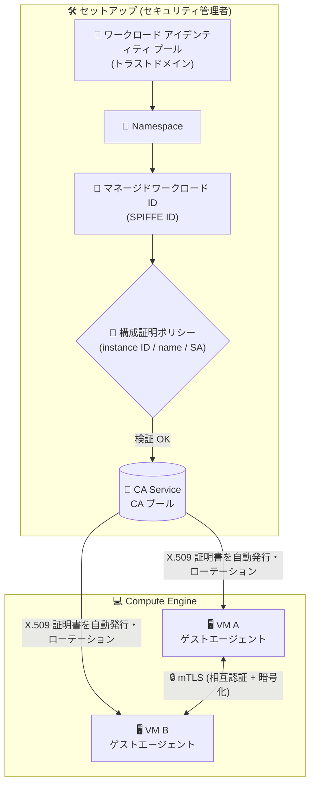

# Identity and Access Management (IAM): Compute Engine 向けマネージドワークロード ID が GA

**リリース日**: 2026-07-27

**サービス**: Identity and Access Management (IAM)

**機能**: Compute Engine 向けマネージドワークロード ID (Managed Workload Identities)

**ステータス**: GA (一般提供)

📊 [このアップデートのインフォグラフィックを見る](https://takech9203.github.io/google-cloud-news-summary/20260727-iam-managed-workload-identities-compute-engine-ga.html)

## 概要

Compute Engine 向けのマネージドワークロード ID (Managed Workload Identities) が一般提供 (GA) になりました。この機能により、任意の 2 つの Compute Engine VM 間で相互認証・暗号化された通信 (mTLS) を実装できます。VM 上で稼働するワークロードアプリケーションは、Google Cloud が発行する X.509 クレデンシャルを使用して VM 単位の mTLS を確立できます。

マネージドワークロード ID はオープンソースの SPIFFE (Secure Production Identity Framework for Everyone) 標準に準拠しており、`spiffe://TRUST_DOMAIN/ns/NAMESPACE/sa/WORKLOAD_ID` 形式の SPIFFE ID でワークロードを一意に識別します。トラストドメインは IAM のワークロード アイデンティティ プールに対応し、証明書の発行は Certificate Authority Service (CA Service) との統合によって行われます。証明書のローテーションとクレデンシャルの更新は Compute Engine のゲストエージェントが自動で実施します。

VM 間通信のゼロトラスト化やサービス間認証の標準化に取り組むセキュリティ管理者・インフラ管理者にとって、証明書ベースのワークロード認証をマネージドに実現できる重要なアップデートです。

**アップデート前の課題**

- VM 間の mTLS を実現するには、証明書の発行・配布・ローテーションを自前の仕組み (独自 PKI や手動運用) で構築・管理する必要があった
- 手動の証明書管理は複雑でエラーが発生しやすく、証明書の期限切れによる障害リスクがあった
- ワークロードの識別情報 (アイデンティティ) を組織横断で一元的に統制する標準的な手段がなかった

**アップデート後の改善**

- ワークロードの構成証明 (attestation) が成功すると、Google Cloud が X.509 証明書を自動的にプロビジョニングし、ゲストエージェントが自動でローテーション・更新するため、手動の証明書管理が不要になった
- SPIFFE 標準準拠の相互運用可能なアイデンティティにより、マイクロサービスアーキテクチャでの認証・認可を標準的な方法で実現できるようになった
- ワークロード アイデンティティ プールを中央管理ポイントとして、トラストドメインの定義や構成証明ポリシーによる統制を一元的に行えるようになった
- GA になったことで、本番環境での利用に適した提供条件で使用できるようになった

## アーキテクチャ図



ワークロード アイデンティティ プール (トラストドメイン) 内に定義したマネージドワークロード ID を、構成証明ポリシーで検証された VM に付与し、CA Service が発行する X.509 証明書を使って VM 間で mTLS 通信を行う構成です。

## サービスアップデートの詳細

### 主要機能

1. **SPIFFE 標準準拠のワークロード ID**
   - SPIFFE ID は `spiffe://TRUST_DOMAIN/ns/NAMESPACE/sa/WORKLOAD_ID` 形式
   - トラストドメインは `POOL_ID.global.PROJECT_NUMBER.workload.id.goog` 形式で、IAM のワークロード アイデンティティ プールに対応
   - プール内は Namespace という管理境界で ID を整理でき、アプリケーションごとの Namespace とマイクロサービスごとのマネージド ID といった構成が可能

2. **構成証明ポリシー (Attestation Policy) による統制**
   - 信頼できるワークロードだけがマネージド ID を主張できるよう、構成証明ポリシーで認可を定義
   - Compute Engine VM は、インスタンス ID、インスタンス名、アタッチされたサービスアカウントなどの属性に基づいてワークロード ID の受領を認可される

3. **Certificate Authority Service との統合による証明書の自動発行**
   - CA Service のルート CA プール (および必要に応じて下位 CA) を構成し、ワークロード アイデンティティ プールに紐付け
   - インライン証明書発行構成 (inline certificate issuance config) で証明書のライフタイム (24 時間〜30 日、デフォルト 24 時間)、ローテーション開始タイミング (ライフタイムの 50〜80%、デフォルト 50%)、鍵アルゴリズム (ECDSA_P256 デフォルト、ECDSA_P384、RSA_2048/3072/4096) を指定可能

4. **ゲストエージェントによるクレデンシャルの自動更新**
   - ゲストエージェントが mTLS 証明書を自動ローテーションし、VM 上のクレデンシャルを更新
   - クレデンシャルは Linux では `/run/secrets/workload-spiffe-credentials`、Windows では `C:\ProgramData\Google\ComputeEngine\secrets\workload-spiffe-credentials` に配置される
   - クレデンシャルの更新間隔はデフォルト 10 分 (ゲストエージェント設定 `credential_refresh_minutes` で変更可能)

## 技術仕様

### 主要コンポーネント

| 項目 | 詳細 |
|------|------|
| ワークロード アイデンティティ プール | トラストドメインとして機能する最上位コンテナ。TRUST_DOMAIN モードで構成 |
| Namespace | プール内の管理境界。関連するワークロード ID をグループ化 |
| マネージドワークロード ID | Namespace 内の個別ワークロード識別子。作成後に ID の変更は不可 |
| 構成証明ポリシー | インスタンス ID / インスタンス名 / サービスアカウントに基づき証明書発行の可否を検証 |
| 証明書発行元 | CA Service の CA プール (identity reflection により SPIFFE ID を X.509 証明書に反映) |
| 証明書ライフタイム | 24 時間〜30 日 (デフォルト 24 時間) |
| 鍵アルゴリズム | ECDSA_P256 (デフォルト)、ECDSA_P384、RSA_2048、RSA_3072、RSA_4096 |
| クレデンシャル配置先 (Linux) | `/run/secrets/workload-spiffe-credentials` |
| クレデンシャル配置先 (Windows) | `C:\ProgramData\Google\ComputeEngine\secrets\workload-spiffe-credentials` |

### インライン証明書発行構成の例

```json
{
  "inlineCertificateIssuanceConfig": {
    "caPools": {
      "REGION": "projects/PROJECT_NUMBER/locations/REGION/caPools/ROOT_CA_POOL_ID"
    },
    "lifetime": "86400s",
    "rotationWindowPercentage": 50,
    "keyAlgorithm": "ECDSA_P256"
  }
}
```

## 設定方法

### 前提条件

1. ワークロード アイデンティティ プール、Namespace、マネージドワークロード ID、構成証明ポリシーを作成済みであること (セキュリティ管理者のタスク)
2. CA Service の CA プールを構成し、ワークロード アイデンティティ プールに `roles/privateca.poolReader` と `roles/privateca.workloadCertificateRequester` を付与して証明書リクエストを認可済みであること
3. VM が Compute Engine ゲストエージェントの対応バージョン (20231103.01 以降) を実行していること

### 手順

#### ステップ 1: 構成証明ルールの追加

```bash
gcloud iam workload-identity-pools managed-identities add-attestation-rule MANAGED_IDENTITY_ID \
  --namespace=NAMESPACE_ID \
  --workload-identity-pool=WORKLOAD_IDENTITY_POOL_ID \
  --google-cloud-resource='//compute.googleapis.com/projects/PROJECT_NUMBER/type/Instance/*' \
  --location=global
```

マネージドワークロード ID に構成証明ルールを追加し、証明書を受領できるワークロードを定義します (上記はプロジェクト内の Compute Engine インスタンスを対象とする例)。

#### ステップ 2: マネージドワークロード ID を有効にした VM の作成

```bash
gcloud compute instances create INSTANCE_NAME \
  --zone=INSTANCE_ZONE \
  --service-account SERVICE_ACCOUNT_NAME@PROJECT_ID.iam.gserviceaccount.com \
  --identity=TRUST_DOMAIN/ns/NAMESPACE/sa/WORKLOAD_IDENTIFIER \
  --identity-certificate
```

`--identity` と `--identity-certificate` フラグを指定して VM を作成します。サービスアカウントベースの構成証明を使う場合は、該当のサービスアカウントをアタッチします。既存インスタンスでも同フラグによる更新と VM 再起動で有効化できます。

#### ステップ 3: ゲストエージェントでのクレデンシャル ブートストラップ有効化

```bash
# ゲストエージェント設定ファイル (instance_configs.cfg) の MWLID セクション
[MWLID]
enabled = true
credential_refresh_minutes = 10
```

ゲストエージェント設定で有効化すると、クレデンシャルが VM 上の所定のパスにブートストラップされ、自動更新されます。

## メリット

### ビジネス面

- **セキュリティ強化**: ワークロード間の相互認証により、認可されていないワークロードからのアクセスを防止し、転送中のデータを暗号化。ゼロトラストアーキテクチャの実現に寄与
- **運用負荷の削減**: 複雑でエラーが発生しやすい手動の証明書管理 (発行・配布・ローテーション) が不要になり、証明書期限切れによる障害リスクを低減
- **一元的なガバナンス**: ワークロード アイデンティティ プールを中央管理ポイントとして、管理者がトラストドメインと構成証明ポリシーを定義し、証明書を受領できるワークロードを統制可能

### 技術面

- **SPIFFE 標準準拠**: 分散システム全体でアイデンティティを管理する業界標準フレームワークに準拠し、モダンなマイクロサービスアーキテクチャでの認証・認可と相互運用可能
- **証明書の自動ローテーション**: ゲストエージェントが証明書を自動更新するため、アプリケーション側での証明書管理ロジックが不要
- **柔軟な構成証明**: インスタンス ID、インスタンス名、サービスアカウントといった属性に基づき、証明書を受領できる VM をきめ細かく制御可能

## デメリット・制約事項

### 制限事項

- マネージドワークロード ID の ID は作成後に変更できない。VM に割り当てたマネージド ID の値もインスタンス作成時にのみ設定可能で、変更するには新しいインスタンスの作成が必要
- ワークロード アイデンティティ プールで更新できるのは証明書発行構成 (certificate issuance config) と信頼構成 (trust config) のみ
- 証明書発行構成・信頼構成の更新は、プールに参加するすべての VM / MIG に段階的に反映されるため、影響範囲に注意が必要
- ゲストエージェント バージョン 20231103.01 以降が必要

### 考慮すべき点

- 証明書発行に CA Service の CA プールが必要であり、CA Service の構成 (ルート CA / 下位 CA の階層設計) と料金が発生する
- 短命証明書を大量に発行するユースケースでは、CA Service の DevOps ティア (高スループット、ただし証明書の失効・一覧表示は非対応) と Enterprise ティアの選択を検討する必要がある
- ロードバランサーのバックエンド mTLS にマネージドワークロード ID を使用する関連機能は、ドキュメント上 Preview として案内されており、本 GA とは提供ステータスが異なる

## ユースケース

### ユースケース 1: VM 間のサービス間通信のゼロトラスト化

**シナリオ**: 複数の Compute Engine VM で構成されるマルチティアアプリケーション (Web 層 → API 層 → バックエンド層) で、ネットワーク境界に依存せずサービス間の相互認証と暗号化を実現したい。

**実装例**:
```bash
# API 層の VM をマネージドワークロード ID 付きで作成
gcloud compute instances create api-server-1 \
  --zone=asia-northeast1-a \
  --service-account api-sa@my-project.iam.gserviceaccount.com \
  --identity=my-pool.global.123456789.workload.id.goog/ns/my-app/sa/api-service \
  --identity-certificate
```

**効果**: 各 VM が SPIFFE ID に基づく X.509 証明書で相互認証するため、同一ネットワーク内でも認可されていないワークロードはサービスにアクセスできず、通信は暗号化される。

### ユースケース 2: 独自 PKI 運用からの移行による証明書管理の自動化

**シナリオ**: これまで独自スクリプトで VM 用のクライアント証明書を発行・配布・ローテーションしており、期限切れ事故や運用負荷が課題になっている。

**効果**: 構成証明が成功した VM に対して Google Cloud が証明書を自動発行し、ゲストエージェントがローテーション (デフォルトでライフタイムの 50% 経過時に更新) するため、証明書管理の運用を大幅に自動化できる。証明書のライフタイムや鍵アルゴリズムはインライン証明書発行構成で統制できる。

## 料金

マネージドワークロード ID の証明書発行には Certificate Authority Service の CA プールを使用するため、CA Service の料金 (CA の稼働料金および証明書発行料金) が適用されます。ティア (DevOps / Enterprise) によって特性と料金が異なります。詳細は料金ページを参照してください。

- [Certificate Authority Service の料金](https://cloud.google.com/certificate-authority-service/pricing)

## 関連サービス・機能

- **Certificate Authority Service (CA Service)**: マネージドワークロード ID の X.509 証明書を発行する CA プールを提供。identity reflection により SPIFFE ID を証明書に反映
- **Compute Engine ゲストエージェント**: VM 上でクレデンシャルのブートストラップと自動更新を担当 (`MWLID` 設定セクション)
- **Cloud Load Balancing**: バックエンド mTLS にマネージドワークロード ID を使用する関連機能があり、ロードバランサーとバックエンド間の相互認証に利用可能 (ドキュメント上 Preview)
- **Workload Identity Federation**: X.509 証明書を使用した Workload Identity Federation により、クライアントライブラリや gcloud CLI から Google Cloud API への認証にも利用可能
- **Cloud Audit Logs**: ワークロード アイデンティティ プールや構成証明ポリシーの誤構成のトラブルシューティングに監査ログを活用可能

## 参考リンク

- 📊 [インフォグラフィック](https://takech9203.github.io/google-cloud-news-summary/20260727-iam-managed-workload-identities-compute-engine-ga.html)
- [公式リリースノート](https://docs.cloud.google.com/release-notes#July_27_2026)
- [マネージドワークロード ID 認証の構成 (ドキュメント)](https://docs.cloud.google.com/iam/docs/create-managed-workload-identities)
- [mTLS を使用したワークロード間認証 (Compute Engine ドキュメント)](https://docs.cloud.google.com/compute/docs/access/authenticate-workloads-over-mtls)
- [ワークロード間認証のトラブルシューティング](https://docs.cloud.google.com/compute/docs/troubleshooting/troubleshooting-workload-to-workload-auth)
- [Certificate Authority Service の料金](https://cloud.google.com/certificate-authority-service/pricing)

## まとめ

Compute Engine 向けマネージドワークロード ID の GA により、SPIFFE 標準に準拠した VM 間 mTLS を、証明書の自動発行・ローテーション付きでマネージドに実現できるようになりました。VM 間通信のゼロトラスト化や独自 PKI 運用の置き換えを検討しているチームは、ワークロード アイデンティティ プールと CA Service の構成から評価を始めることを推奨します。

---

**タグ**: IAM, Compute Engine, マネージドワークロード ID, SPIFFE, mTLS, Certificate Authority Service, セキュリティ, GA
