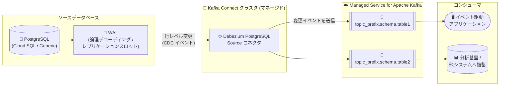

# Google Cloud Managed Service for Apache Kafka: PostgreSQL Source コネクタ (Cloud SQL / Generic) の提供開始

**リリース日**: 2026-07-27

**サービス**: Google Cloud Managed Service for Apache Kafka

**機能**: Cloud SQL for PostgreSQL Source コネクタ / Generic PostgreSQL Source コネクタ

**ステータス**: 提供開始 (Feature)

📊 [このアップデートのインフォグラフィックを見る](https://takech9203.github.io/google-cloud-news-summary/20260727-managed-kafka-postgresql-source-connectors.html)

## 概要

Google Cloud Managed Service for Apache Kafka の Kafka Connect で、**Cloud SQL for PostgreSQL Source コネクタ**と **Generic PostgreSQL Source コネクタ**の 2 種類の PostgreSQL 向け Source コネクタが作成できるようになりました。いずれも [Debezium PostgreSQL コネクタ](https://debezium.io/documentation/reference/stable/connectors/postgresql.html)のインスタンスとして動作し、PostgreSQL データベースの行レベルの変更 (CDC: Change Data Capture) を読み取り、Managed Service for Apache Kafka クラスタのトピックに書き込みます。

Cloud SQL for PostgreSQL Source コネクタは Cloud SQL for PostgreSQL インスタンス専用で、IAM データベース認証を使用して安全に接続します。Generic PostgreSQL Source コネクタは、Cloud SQL 以外の PostgreSQL データベース (セルフマネージドやオンプレミスなど) を対象とし、Secret Manager に保存したパスワードで認証します。

データベースの変更をリアルタイムにイベントとして扱いたいデータエンジニアや、イベント駆動アーキテクチャを構築するアーキテクトにとって、CDC パイプラインをフルマネージドで構築できる重要なアップデートです。

**アップデート前の課題**

- Managed Service for Apache Kafka の Kafka Connect には PostgreSQL 用のマネージド Source コネクタがなく、PostgreSQL の変更データを Kafka に取り込むには Debezium を自前でホスト・運用する必要があった
- Managed Service for Apache Kafka の Connect クラスタはカスタムコネクタプラグインのアップロードをサポートしていないため、Debezium PostgreSQL コネクタをマネージド環境で利用する手段がなかった

**アップデート後の改善**

- Cloud SQL for PostgreSQL Source コネクタにより、Cloud SQL for PostgreSQL の行レベル変更を IAM データベース認証経由でマネージドに Kafka トピックへストリーミングできるようになった
- Generic PostgreSQL Source コネクタにより、Cloud SQL 以外の任意の PostgreSQL データベースからも CDC が可能になった
- コネクタの作成・管理は Google Cloud コンソールや `gcloud managed-kafka connectors create` コマンドで完結し、Debezium ワーカーのインフラ運用が不要になった
- PostgreSQL Source コネクタ専用のトラブルシューティングドキュメントも提供された

## アーキテクチャ図



PostgreSQL の WAL (Write-Ahead Log) から Debezium PostgreSQL Source コネクタが行レベルの変更を読み取り、テーブルごとに作成される Kafka トピックへ変更イベントを送信します。下流のコンシューマはトピックを購読して、リアルタイム処理や他システムへの複製を行います。

## サービスアップデートの詳細

### 主要機能

1. **Cloud SQL for PostgreSQL Source コネクタ**
   - Cloud SQL for PostgreSQL データベースの行レベル変更を読み取り、Kafka トピックに書き込む
   - 認証には IAM データベース認証を使用 (Managed Kafka サービスアカウントを Cloud SQL の IAM ユーザーとして追加)
   - ネットワーク接続はプライベート IP、Private Service Connect、パブリック IP の 3 方式に対応 (セキュリティのベストプラクティスとしてプライベート IP または Private Service Connect を推奨)

2. **Generic PostgreSQL Source コネクタ**
   - Cloud SQL 以外の PostgreSQL データベース (セルフマネージド、オンプレミスなど) の行レベル変更を読み取る
   - データベースパスワードは Secret Manager のシークレットで管理 (プレーンテキストパスワードは非サポート)
   - テーブルの複製・リストアなどのユースケースにも対応

3. **初期スナップショットと継続的な変更キャプチャ**
   - コネクタの初期化時にデータベースの初期スナップショットを作成
   - 行を持つすべてのテーブルに対応する Kafka トピックを自動作成し、各行の変更イベントを対応するトピックへ送信
   - 稼働中は継続的に変更イベントをトピックへ送信

4. **柔軟なテーブルフィルタリング**
   - デフォルトではデータベース内のすべての非システムテーブルをキャプチャ
   - `schema.include.list` / `schema.exclude.list` / `table.include.list` / `table.exclude.list` で対象を絞り込み可能

## 技術仕様

### コネクタの比較

| 項目 | Cloud SQL for PostgreSQL Source | Generic PostgreSQL Source |
|------|--------------------------------|---------------------------|
| 対象データベース | Cloud SQL for PostgreSQL | 任意の PostgreSQL |
| 実体 | Debezium PostgreSQL コネクタ | Debezium PostgreSQL コネクタ |
| 認証方式 | IAM データベース認証 (`driver.enableIamAuth: true`) | データベースユーザー + Secret Manager シークレット |
| 論理デコーディングの有効化 | データベースフラグ `cloudsql.logical_decoding` を On | `wal_level = logical` を設定 |
| プラグイン | `pgoutput` | `pgoutput` |
| トピック命名規則 | `topic_prefix.schema.table_name` | `topic_prefix.schema.table_name` |

### 必要な IAM ロール

| 対象 | ロール |
|------|--------|
| コネクタ作成者 | Managed Kafka Connector Editor (`roles/managedkafka.connectorEditor`) |
| Managed Kafka サービスアカウント (Cloud SQL 版) | Cloud SQL Client (`roles/cloudsql.client`)、Cloud SQL Instance User (`roles/cloudsql.instanceUser`) |
| Managed Kafka サービスアカウント (Generic 版) | Secret Manager Viewer (`roles/secretmanager.viewer`)、Secret Manager Secret Accessor (`roles/secretmanager.secretAccessor`) |

Managed Kafka サービスアカウントの形式: `service-PROJECT_NUMBER@gcp-sa-managedkafka.iam.gserviceaccount.com` (`PROJECT_NUMBER` は Connect クラスタのプロジェクト番号)

### 設定ファイルの例 (Cloud SQL for PostgreSQL Source)

```yaml
connector.class: io.debezium.connector.postgresql.PostgresConnector
database.dbname: DATABASE_NAME
driver.cloudSqlInstance: PROJECT_ID:REGION:INSTANCE_NAME
driver.enableIamAuth: "true"
driver.ipTypes: IP_TYPES
driver.sslmode: disable
key.converter: org.apache.kafka.connect.json.JsonConverter
key.converter.schemas.enable: "false"
plugin.name: pgoutput
slot.name: SLOT_NAME
table.include.list: TABLE_LIST
topic.prefix: TOPIC_PREFIX
value.converter: org.apache.kafka.connect.json.JsonConverter
value.converter.schemas.enable: "true"
```

### 設定ファイルの例 (Generic PostgreSQL Source)

```yaml
connector.class: io.debezium.connector.postgresql.PostgresConnector
database.dbname: DATABASE_NAME
database.hostname: HOSTNAME
database.user: DATABASE_USER
database.password: ${directory:/var/secrets:PROJECT_ID-SECRET_NAME-SECRET_VERSION}
key.converter: org.apache.kafka.connect.json.JsonConverter
key.converter.schemas.enable: "false"
plugin.name: pgoutput
topic.prefix: TOPIC_PREFIX
value.converter: org.apache.kafka.connect.json.JsonConverter
value.converter.schemas.enable: "true"
```

## 設定方法

### 前提条件

1. Managed Service for Apache Kafka クラスタと、それに関連付けられた Connect クラスタ
2. Cloud SQL 版: データベースを持つ Cloud SQL for PostgreSQL インスタンス
3. Generic 版: PostgreSQL データベースと、パスワードを保存した Secret Manager シークレット (Connect クラスタにシークレットを設定)

### 手順 (Cloud SQL for PostgreSQL Source の例)

#### ステップ 1: 論理デコーディングの有効化

Cloud SQL インスタンスのデータベースフラグ `cloudsql.logical_decoding` を `On` に設定します (設定によりデータベースが再起動します)。

#### ステップ 2: CDC 対象テーブルのパブリケーション作成

```sql
-- すべてのテーブルを対象にする場合
CREATE PUBLICATION dbz_publication FOR ALL TABLES;

-- 特定のテーブルのみ対象にする場合
CREATE PUBLICATION dbz_publication FOR TABLE "schema_name"."table_name";
```

デフォルトではコネクタはパブリケーション名 `dbz_publication` を使用します。

#### ステップ 3: IAM データベースユーザーの作成と権限付与

```bash
gcloud sql users create service-PROJECT_NUMBER@gcp-sa-managedkafka.iam \
  --instance=INSTANCE_NAME \
  --type=cloud_iam_service_account
```

その後、`cloudsqlsuperuser` ロールを持つユーザーで接続し、以下を実行します。

```sql
ALTER USER "service-PROJECT_NUMBER@gcp-sa-managedkafka.iam" WITH REPLICATION;
GRANT SELECT ON ALL TABLES IN SCHEMA "SCHEMA_NAME" TO "service-PROJECT_NUMBER@gcp-sa-managedkafka.iam";
GRANT USAGE ON SCHEMA SCHEMA_NAME TO "service-PROJECT_NUMBER@gcp-sa-managedkafka.iam";
```

#### ステップ 4: コネクタの作成

```bash
gcloud managed-kafka connectors create CONNECTOR_ID \
  --location=LOCATION \
  --connect-cluster=CONNECT_CLUSTER_ID \
  --config-file=CONFIG_FILE
```

コネクタは Connect クラスタと同じロケーションに作成する必要があります。作成後、初期スナップショットが実行され、テーブルごとのトピックへ変更イベントの送信が始まります。

## メリット

### ビジネス面

- **運用負荷の削減**: Debezium ワーカーの構築・パッチ適用・スケーリングを自前で行う必要がなくなり、CDC パイプラインの運用コストを削減できる
- **リアルタイムデータ活用の加速**: データベースの変更を即座にイベント化できるため、リアルタイム分析やイベント駆動のビジネスプロセスを迅速に実現できる

### 技術面

- **標準技術 (Debezium) ベース**: 広く使われている Debezium PostgreSQL コネクタがそのまま使われるため、既存の Debezium の知識・設定 (トピック命名規則、スナップショット動作など) を活用できる
- **セキュアな認証**: Cloud SQL 版は IAM データベース認証、Generic 版は Secret Manager によるパスワード管理で、認証情報をコネクタ設定に平文で書く必要がない
- **柔軟なネットワーク接続**: プライベート IP、Private Service Connect、パブリック IP (Cloud NAT 経由) の 3 方式から選択可能

## デメリット・制約事項

### 制限事項

- Generic 版でプレーンテキストパスワードはサポートされない (`database.password` には Secret Manager のシークレットパスのみ指定可能)
- Connect クラスタへのカスタムコネクタプラグインのアップロードは引き続き非サポート
- コネクタは Connect クラスタと同じロケーションに作成する必要がある

### 考慮すべき点

- **レプリケーションスロットの管理**: コネクタが一時停止・失敗・削除されてもレプリケーションスロットは自動削除されない。放置すると WAL ファイルが保持され続けてデータベースサーバーのディスクを圧迫し、障害の原因になり得る。コネクタを完全に削除する際は手動でスロットを削除し、WAL ディスク使用量のアラートを設定することが推奨される
- 同じデータベースに対して複数のコネクタインスタンスを作成する場合は、`slot.name` にそれぞれ一意の値を指定する必要がある
- Cloud SQL 版の論理デコーディング有効化 (`cloudsql.logical_decoding`) はデータベースの再起動を伴う
- トピックプレフィックスは Cloud SQL for PostgreSQL Source コネクタごとに一意の値を選択する

## ユースケース

### ユースケース 1: Cloud SQL の変更をリアルタイムに下流システムへ連携

**シナリオ**: EC サイトの注文テーブル (Cloud SQL for PostgreSQL) の INSERT/UPDATE/DELETE を、在庫管理や通知などの下流マイクロサービスにリアルタイムで伝搬したい。

**実装例**:
```yaml
# 注文テーブルのみを CDC 対象にする設定 (抜粋)
table.include.list: '"public"."orders"'
topic.prefix: ec-orders
slot.name: ec_orders_slot
```

**効果**: アプリケーション側にイベント発行ロジックを追加することなく、データベースの変更を確実にイベント化でき、イベント駆動アーキテクチャを疎結合に実現できる。

### ユースケース 2: オンプレミス PostgreSQL からのデータ複製・移行

**シナリオ**: オンプレミスで稼働する PostgreSQL のテーブルを、Generic PostgreSQL Source コネクタで Kafka 経由で他システムに複製し、段階的なクラウド移行や分析基盤へのデータ供給を行う。

**効果**: 初期スナップショット + 継続的な CDC により、ソースデータベースを止めずにデータを複製・同期でき、移行のダウンタイムを最小化できる。

## 料金

コネクタは Connect クラスタ上で稼働します。Managed Service for Apache Kafka はプロビジョニングしたリソース (vCPU、RAM、ローカルストレージ) と消費したリソース (永続ストレージ、データ転送) に対して課金される料金モデルです。Kafka クラスタと Connect クラスタを同一リージョンに配置すると、レイテンシとリージョン間ネットワーク転送コストを削減できます。

詳細は [Managed Service for Apache Kafka の料金ページ](https://cloud.google.com/managed-service-for-apache-kafka/pricing)を参照してください。

## 利用可能リージョン

リリースノートおよびドキュメントにリージョン固有の記載はありません。コネクタは Connect クラスタと同じロケーションに作成する必要があります。詳細は[公式ドキュメント](https://docs.cloud.google.com/managed-service-for-apache-kafka/docs/connect-cluster/create-cloud-sql-postgres-source-connector)を参照してください。

## 関連サービス・機能

- **Cloud SQL for PostgreSQL**: Cloud SQL 版コネクタの CDC ソース。論理デコーディングと IAM データベース認証を利用
- **Secret Manager**: Generic 版コネクタのデータベースパスワード管理に使用
- **Cloud NAT**: パブリック IP 接続時に Connect クラスタのワーカーがインターネットと通信するために使用
- **Private Service Connect**: Cloud SQL インスタンスへのプライベート接続方式の 1 つ
- **BigQuery / Cloud Storage / Pub/Sub Sink コネクタ**: Kafka トピックに取り込んだ CDC イベントを分析基盤等へ書き出す際に組み合わせて利用可能

## 参考リンク

- 📊 [インフォグラフィック](https://takech9203.github.io/google-cloud-news-summary/20260727-managed-kafka-postgresql-source-connectors.html)
- [公式リリースノート](https://docs.cloud.google.com/release-notes#July_27_2026)
- [Cloud SQL for PostgreSQL Source コネクタの作成](https://docs.cloud.google.com/managed-service-for-apache-kafka/docs/connect-cluster/create-cloud-sql-postgres-source-connector)
- [Generic PostgreSQL Source コネクタの作成](https://docs.cloud.google.com/managed-service-for-apache-kafka/docs/connect-cluster/create-generic-postgres-source-connector)
- [PostgreSQL Source コネクタのトラブルシューティング](https://docs.cloud.google.com/managed-service-for-apache-kafka/docs/connect-cluster/troubleshoot-postgres-source-connector)
- [Debezium PostgreSQL コネクタ (公式ドキュメント)](https://debezium.io/documentation/reference/stable/connectors/postgresql.html)
- [料金ページ](https://cloud.google.com/managed-service-for-apache-kafka/pricing)

## まとめ

Managed Service for Apache Kafka に PostgreSQL 向けの CDC Source コネクタ (Cloud SQL 版 / Generic 版) が追加され、Debezium ベースの変更データキャプチャをフルマネージドで構築できるようになりました。PostgreSQL を起点としたリアルタイムデータパイプラインやイベント駆動アーキテクチャを検討しているチームは、まずドキュメントの手順に沿って論理デコーディングの有効化とコネクタ作成を試し、レプリケーションスロットの監視 (WAL ディスク使用量アラート) を忘れずに設定することを推奨します。

---

**タグ**: `Managed Service for Apache Kafka`, `Kafka Connect`, `Cloud SQL for PostgreSQL`, `PostgreSQL`, `Debezium`, `CDC`, `Change Data Capture`, `データパイプライン`, `イベント駆動アーキテクチャ`
