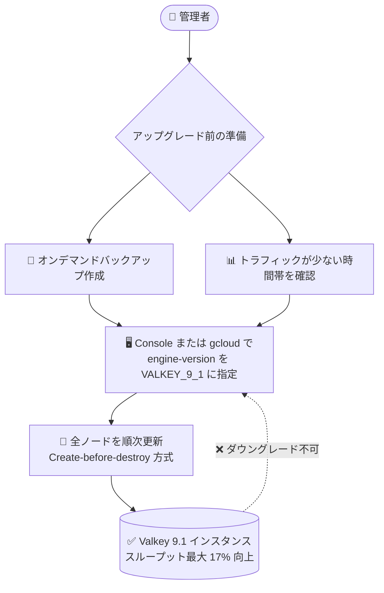

# Memorystore for Valkey: Valkey 9.1 サポート (Preview)

**リリース日**: 2026-07-27

**サービス**: Memorystore for Valkey

**機能**: Valkey バージョン 9.1 のサポート

**ステータス**: Preview

📊 [このアップデートのインフォグラフィックを見る](https://takech9203.github.io/google-cloud-news-summary/20260727-memorystore-valkey-9-1-support.html)

## 概要

Memorystore for Valkey が Valkey バージョン 9.1 のサポートを Preview として開始しました。既存の Memorystore for Valkey インスタンスを 9.1 にアップグレードできるほか、新規インスタンス作成時に 9.1 を選択できるようになります。これにより、Memorystore for Valkey がサポートするバージョンは 7.2、8.0、9.0、9.1 (Preview) の 4 つとなりました (デフォルトは 9.0)。

Valkey 9.1 の主な特徴は、スループットの向上、データベースレベルのアクセス制御、新コマンドの追加です。特に I/O スレッディングと文字列処理の内部最適化により、全体スループットが最大 17% 向上し、GET 操作では最大 30% の向上が見込めます。キャッシュやセッションストアとして Memorystore for Valkey を利用しているワークロードにとって、アプリケーション側の変更なしに性能向上が期待できるアップデートです。

アップグレードは任意の新しいバージョンへ直接実行できます (例: 7.2 から 9.1 へ直接アップグレード可能)。ただし、一度アップグレードするとダウングレードはできない点に注意が必要です。

**アップデート前の課題**

- Memorystore for Valkey で選択できる最新バージョンは 9.0 までであり、Valkey 9.1 で導入された機能や性能改善をマネージドサービスとして利用できなかった
- ユーザーのアクセス制御をデータベースレベルで細かく制限する手段がなかった
- HGETDEL や CLUSTERSCAN など、Valkey 9.1 で追加されたコマンドを利用できなかった

**アップデート後の改善**

- 既存インスタンスを 9.1 にアップグレードでき、I/O スレッディングと文字列処理の最適化により全体スループットが最大 17% (GET 操作は最大 30%) 向上する
- ACL (アクセス制御リスト) を使用して、データベースレベルでユーザーのアクセスを制限できるようになった
- HGETDEL、MSETNX、CLUSTERSCAN の各コマンドが利用可能になり、HSETEX コマンドで NX / XX パラメータがサポートされた

## アーキテクチャ図



バージョンアップグレードの流れを示しています。アップグレードはメンテナンス操作と同様の Create-before-destroy 方式で全ノードを更新し、完了後は以前のバージョンに戻せません。

## サービスアップデートの詳細

### 主要機能

1. **スループットの向上**
   - I/O スレッディングと文字列処理の内部最適化により、インスタンス全体のスループットが最大 17% 向上
   - GET 操作については最大 30% のスループット向上

2. **データベースレベルのアクセス制御**
   - ACL (アクセス制御リスト) を使用して、ユーザーのアクセスをデータベース単位で制限可能
   - マルチテナント的にデータベースを分けて利用する場合のセキュリティ強化に有効

3. **新コマンドの追加**
   - `HGETDEL`: ハッシュフィールドの値を取得して削除を単一のアトミック操作で実行
   - `MSETNX`: 共有の有効期限付きで複数キーを設定
   - `CLUSTERSCAN`: インスタンスの全ノードを横断してキーをスキャン
   - `HSETEX` コマンドが NX / XX パラメータをサポート

## 技術仕様

### サポートバージョン一覧

| Valkey メジャーバージョン | 最終更新日 | ステータス |
|------|------|------|
| 9.1 | 2026 年 7 月 27 日 | Preview |
| 9.0 (デフォルト) | 2026 年 3 月 11 日 | GA |
| 8.0 | 2024 年 10 月 2 日 | GA |
| 7.2 | 2024 年 8 月 30 日 | GA |

### アップグレードの挙動

| 項目 | 詳細 |
|------|------|
| アップグレードパス | 任意の新しいバージョンへ直接アップグレード可能 (例: 7.2 → 9.1) |
| ダウングレード | 不可 (アップグレードは不可逆) |
| 更新方式 | インスタンス内の全ノードを更新。メンテナンス操作と同様の Create-before-destroy ライフサイクル戦略 |
| gcloud での指定値 | `VALKEY_7_2`、`VALKEY_8_0`、`VALKEY_9_0`、`VALKEY_9_1` (Preview) |

## 設定方法

### 前提条件

1. Memorystore for Valkey インスタンスが作成済みであること
2. 最新の Google Cloud CLI がインストールされていること (`gcloud components update`)
3. アップグレード前にオンデマンドバックアップを作成しておくこと (推奨)

### 手順

#### ステップ 1: バックアップの作成 (推奨)

アップグレードは不可逆のため、事前にインスタンスデータのオンデマンドバックアップを作成します。あわせて、Cloud Monitoring でインスタンスのトラフィックを確認し、トラフィックが少ない時間帯にアップグレードを実施することが推奨されています。

#### ステップ 2: バージョンのアップグレード (gcloud)

```bash
gcloud memorystore instances update INSTANCE_ID \
  --project=PROJECT_ID \
  --location=REGION_ID \
  --engine-version=VALKEY_9_1
```

Google Cloud コンソールの場合は、対象インスタンスの詳細ページの「Configurations」セクションで「Valkey version」の横にある「Upgrade」をクリックし、バージョンとして 9.1 を選択して「Update instance」を実行します。

#### ステップ 3: 新規インスタンスを 9.1 で作成する場合

```bash
gcloud memorystore instances create my-instance \
  --location=us-central1 \
  --endpoints='[{"connections": [{"pscAutoConnection": {"network": "projects/PROJECT_ID/global/networks/NETWORK_ID", "projectId": "PROJECT_ID"}}]}]' \
  --replica-count=2 \
  --node-type=highmem-medium \
  --engine-version=VALKEY_9_1 \
  --shard-count=8 \
  --mode=cluster
```

新規作成時に `--engine-version=VALKEY_9_1` を指定します (未指定の場合のデフォルトは `VALKEY_9_0`)。

## メリット

### ビジネス面

- **追加コストなしの性能向上**: アプリケーションコードの変更なしに最大 17% (GET 操作は最大 30%) のスループット向上が見込め、同一構成でより多くのリクエストを処理できる
- **マネージドサービスでの最新機能利用**: オープンソース Valkey の最新機能を、運用負荷を増やさずにマネージドサービスとして利用できる

### 技術面

- **データベースレベルの ACL**: ユーザーごとにアクセス可能なデータベースを制限でき、複数アプリケーションでインスタンスを共有する際のセキュリティが向上する
- **アトミック操作の拡充**: HGETDEL による取得と削除のアトミック実行や、HSETEX の NX / XX パラメータにより、クライアント側でのトランザクション的な処理を簡素化できる
- **クラスタ横断のキースキャン**: CLUSTERSCAN により、全ノードを横断したキーのスキャンが 1 コマンドで可能になる

## デメリット・制約事項

### 制限事項

- Valkey 9.1 サポートは Preview であり、Pre-GA Offerings Terms が適用される (サポートが限定される可能性がある)
- アップグレードは不可逆であり、9.1 にアップグレードした後に以前のバージョンへダウングレードすることはできない

### 考慮すべき点

- アップグレード前にオンデマンドバックアップの作成が推奨される
- アップグレード処理は全ノードの更新を伴うため、トラフィックが少ない時間帯に実施することで速度と信頼性が向上する
- アップグレード前に、メモリ管理のベストプラクティスに従ってインスタンスのメモリを管理しておくことが推奨される
- 新バージョンがアプリケーションに与える影響を事前に確認すること (サポートされる機能・コマンドの確認)

## ユースケース

### ユースケース 1: 高トラフィックなキャッシュレイヤーの性能改善

**シナリオ**: EC サイトのセッションストア・商品カタログキャッシュとして Memorystore for Valkey 9.0 を利用しており、読み取り (GET) 中心のワークロードでピーク時のスループットに余裕を持たせたい。

**実装例**:
```bash
# 事前にバックアップを作成した上で、トラフィックの少ない時間帯に実行
gcloud memorystore instances update ec-session-cache \
  --project=my-project \
  --location=asia-northeast1 \
  --engine-version=VALKEY_9_1
```

**効果**: GET 操作で最大 30% のスループット向上が見込め、同一ノード構成のままピークトラフィックへの耐性を高められる。

### ユースケース 2: 複数アプリケーションで共有するインスタンスのアクセス制御強化

**シナリオ**: 複数のマイクロサービスが 1 つの Memorystore for Valkey インスタンスをデータベース番号で分けて共用しており、サービスごとにアクセス可能な範囲を制限したい。

**効果**: Valkey 9.1 の ACL によるデータベースレベルのアクセス制御により、各サービスのユーザーが自分のデータベースにのみアクセスできるよう制限でき、誤操作や情報漏えいのリスクを低減できる。

## 料金

Valkey 9.1 の利用自体に追加料金は発生せず、Memorystore for Valkey の通常の料金体系 (ノードタイプとノード数、リージョンに基づく課金) が適用されます。詳細は料金ページを参照してください。

- [Memorystore for Valkey 料金ページ](https://cloud.google.com/memorystore/valkey/pricing)

## 利用可能リージョン

公式ドキュメントにバージョン 9.1 固有のリージョン制限の記載はありません。Memorystore for Valkey の利用可能リージョンは以下を参照してください。

- [Memorystore for Valkey ロケーション](https://docs.cloud.google.com/memorystore/docs/valkey/locations)

## 関連サービス・機能

- **Cloud Monitoring**: アップグレード実施タイミングの判断に必要なインスタンストラフィックの監視や、ノードレベルメトリクスによる健全性確認に使用
- **Memorystore バックアップ管理**: アップグレード前のオンデマンドバックアップ作成に使用 (アップグレードは不可逆のため強く推奨)
- **セルフサービスメンテナンス**: バージョン更新をユーザー主導のタイミングで実施するための仕組み。バージョンアップグレードはメンテナンス操作と同様の Create-before-destroy 方式で実行される

## 参考リンク

- 📊 [インフォグラフィック](https://takech9203.github.io/google-cloud-news-summary/20260727-memorystore-valkey-9-1-support.html)
- [公式リリースノート](https://docs.cloud.google.com/release-notes#July_27_2026)
- [サポートされているバージョン](https://docs.cloud.google.com/memorystore/docs/valkey/supported-versions)
- [インスタンスの Valkey バージョンのアップグレードについて](https://docs.cloud.google.com/memorystore/docs/valkey/about-upgrading-version)
- [インスタンスの Valkey バージョンをアップグレードする](https://docs.cloud.google.com/memorystore/docs/valkey/upgrade-valkey-version)
- [料金ページ](https://cloud.google.com/memorystore/valkey/pricing)

## まとめ

Memorystore for Valkey で Valkey 9.1 が Preview として利用可能になり、最大 17% (GET は最大 30%) のスループット向上、データベースレベルの ACL、新コマンドが利用できるようになりました。アップグレードは不可逆のため、まずは開発・検証環境のインスタンスで 9.1 の挙動とアプリケーションへの影響を確認し、バックアップ作成とトラフィックの少ない時間帯での実施を前提に本番適用を計画することを推奨します。

---

**タグ**: Memorystore, Valkey, Valkey 9.1, バージョンアップグレード, キャッシュ, Preview, パフォーマンス, ACL
