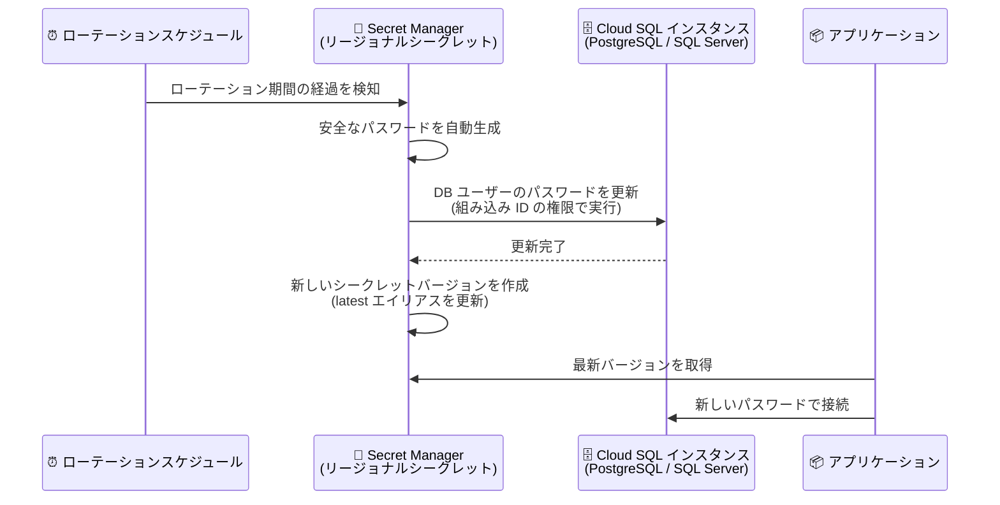

# Secret Manager: リージョナル Cloud SQL データベース認証情報の自動ローテーション (Preview)

**リリース日**: 2026-07-27

**サービス**: Secret Manager

**機能**: Cloud SQL データベース認証情報の自動ローテーション (リージョナルシークレット)

**ステータス**: Preview

📊 [このアップデートのインフォグラフィックを見る](https://takech9203.github.io/google-cloud-news-summary/20260727-secret-manager-cloud-sql-credential-autorotation.html)

## 概要

Secret Manager において、リージョナルシークレットに保存した Cloud SQL データベース認証情報の自動ローテーション機能が Preview で利用可能になりました。Secret Manager が安全なパスワードを自動生成し、対象の Cloud SQL データベースインスタンス (PostgreSQL または SQL Server) のユーザーパスワードを更新した上で、新しいパスワードを最新のシークレットバージョンとして保存します。この一連の処理を、設定したスケジュールに従って自動的に実行できます。

これまで Cloud SQL の認証情報を定期的にローテーションするには、Secret Manager のローテーション通知 (Pub/Sub への `SECRET_ROTATE` メッセージ) を受け取り、パスワード生成・Cloud SQL 更新・シークレットバージョン追加を行うカスタムの Cloud Run functions などを自作・運用する必要がありました。本アップデートにより、このローテーションロジックが Secret Manager のマネージド機能として提供され、カスタムコードの開発・保守が不要になります。

認証情報の定期ローテーションを義務付ける PCI-DSS などのコンプライアンス要件への対応や、漏洩した認証情報の影響を最小化したいセキュリティ運用チーム、データベース認証情報の管理を自動化したいプラットフォームチームに有用なアップデートです。

**アップデート前の課題**

- Cloud SQL 認証情報のローテーションを自動化するには、Pub/Sub のローテーション通知を受けてパスワード生成と Cloud SQL 更新を行うカスタムの Cloud Run functions を自作し、保守し続ける必要があった
- ローテーションワークフロー (関数のコード、権限、エラー処理) をユーザー自身が設計・運用する必要があり、運用負荷と実装ミスのリスクがあった
- 認証情報が長期間固定されると、漏洩時の影響範囲が拡大し、定期的なパスワードローテーションを求めるコンプライアンス要件への対応も手間がかかった

**アップデート後の改善**

- Secret Manager が安全なパスワードの自動生成、対象 Cloud SQL インスタンスのユーザーパスワード更新、新しいシークレットバージョンの保存までをエンドツーエンドで実行するようになった
- ローテーション用のカスタム Cloud Run functions の維持が不要になった
- ローテーションスケジュール (例: 30 日ごと、90 日ごと) を設定するだけで定期ローテーションが実現でき、PCI-DSS などの定期ローテーション要件を満たしやすくなった
- 頻繁なローテーションにより、認証情報漏洩時の影響を最小化できるようになった

## アーキテクチャ図



設定したスケジュールに従い、Secret Manager がパスワード生成 → Cloud SQL のユーザーパスワード更新 → 新しいシークレットバージョンの保存までを自動実行します。アプリケーションは最新バージョンを取得して接続するだけで、常に有効な認証情報を利用できます。

## サービスアップデートの詳細

### 主要機能

1. **Cloud SQL DB credentials シークレットタイプ**
   - シークレット作成時に「Cloud SQL DB credentials」タイプを選択することで自動ローテーションが有効化できる
   - このタイプのシークレットは 1 つの認証情報セット (Cloud SQL インスタンス ID、ユーザー名、パスワード) を管理する
   - シークレットバージョンは Secret Manager がローテーションプロセスの中で自動的に作成・更新するため、手動でバージョンを追加することはできない
   - シークレットタイプは作成時にのみ指定可能で、既存シークレットへの追加・変更はできない (既存シークレットは自動ローテーション非対応)

2. **シークレットの組み込み ID (Built-in identity) による最小権限の実行**
   - 各シークレットには一意の組み込み ID (`iamPolicyUidPrincipal` フィールドに格納) が自動生成される
   - この組み込み ID に対して Cloud SQL インスタンスの認証情報を更新するための権限を付与する仕組みで、シークレットは自身の認証情報のローテーションに必要な権限のみを持つ (最小権限の原則)
   - 組み込み ID に必要な権限がない場合、自動ローテーションは失敗する

3. **ローテーションスケジュールとステータス管理**
   - ローテーション頻度 (例: 30 日ごと、90 日ごと) と開始日時を設定できる
   - ローテーションステータスで健全性を追跡: `Enabled` (スケジュール有効・直近のローテーション成功) / `Disabled` (スケジュール停止、またはローテーション失敗時)
   - 新規作成した Cloud SQL シークレットのステータスは、最初の手動ローテーションが成功するまで `Disabled` となる (権限検証を兼ねる)
   - 手動ローテーションはいつでも実行可能で、セキュリティインシデント対応やローテーションロジックのテストに利用できる (既存の自動スケジュールには影響しない)

## 技術仕様

### 対応範囲と制約

| 項目 | 詳細 |
|------|------|
| シークレットの種類 | リージョナルシークレットのみ (グローバルシークレットは非対応) |
| 対応データベースエンジン | Cloud SQL for PostgreSQL、Cloud SQL for SQL Server |
| リージョン配置 | シークレットは Cloud SQL インスタンスと同一リージョンに作成する必要がある (クロスリージョンレイテンシの最小化とデータレジデンシー要件への対応のため) |
| シークレットタイプ | 作成時に「Cloud SQL DB credentials」を選択 (後から変更・追加不可) |
| バージョン管理 | ローテーション時に Secret Manager が自動でバージョンを作成 (手動追加不可) |
| 管理対象 | 1 シークレット = 1 認証情報セット (インスタンス ID、ユーザー名、パスワード) |

### 組み込み ID に必要な権限

シークレットの組み込み ID (以下の形式) に、Cloud SQL ユーザーを更新する権限を付与する必要があります。

```text
principal://secretmanager.googleapis.com/projects/PROJECT_NUMBER/uid/secrets/SECRET_UID
```

必要な権限:

- `cloudsql.users.list`
- `cloudsql.users.update`

## 設定方法

### 前提条件

1. Cloud SQL インスタンスが対応エンジン (PostgreSQL または SQL Server) であること
2. リージョナルシークレットを使用すること (グローバルシークレットは非対応)
3. 既存の Cloud SQL インスタンスとデータベースユーザーが存在すること
4. Cloud SQL インスタンスの IAM ポリシーを管理する権限を持っていること

### 手順 (Google Cloud コンソール)

#### ステップ 1: Cloud SQL DB credentials タイプのリージョナルシークレットを作成

1. Secret Manager ページの「Regional secrets」タブで「Create regional secret」をクリック
2. シークレット名を入力し、「Set secret type」で **Cloud SQL DB credentials** を選択
3. リージョン (Cloud SQL インスタンスと同一リージョン) を選択
4. 「Rotation」セクションでローテーション期間 (デフォルトの選択肢またはカスタム) と開始日時を設定
5. 「Create secret」をクリック

#### ステップ 2: 組み込み ID に権限を付与

1. シークレット詳細ページの「Overview」タブで IAM プリンシパル識別子 (`principal://secretmanager.googleapis.com/...`) をコピー
2. IAM ページで「Grant access」をクリックし、コピーした識別子をプリンシパルとして指定
3. `cloudsql.users.list` と `cloudsql.users.update` を含むロールを付与

#### ステップ 3: 初回の手動ローテーションを実行

1. シークレット詳細ページで「Rotate」をクリック
2. 対象の Cloud SQL インスタンス ID とユーザー名を指定 (パスワードは未指定なら Secret Manager が強力なランダムパスワードを自動生成)
3. 「Rotate」をクリック。成功するとローテーションステータスが `Enabled` になり、自動ローテーションのスケジュールが開始される

## メリット

### ビジネス面

- **コンプライアンス対応の簡素化**: PCI-DSS など、定期的なパスワードローテーションを義務付けるコンプライアンス要件への対応が、マネージド機能の設定だけで実現できる
- **運用コストの削減**: ローテーション用カスタム関数の開発・保守・監視が不要になり、運用負荷を削減できる

### 技術面

- **カスタムコード不要**: 従来必要だった Cloud Run functions によるローテーションワークフローの実装が不要になる
- **漏洩リスクの低減**: 頻繁なローテーションにより、認証情報が漏洩した場合の影響を最小化できる
- **最小権限の設計**: シークレットごとの組み込み ID に権限を付与するため、各シークレットは自身の認証情報のローテーションに必要な権限のみを保持する

## デメリット・制約事項

### 制限事項

- Preview 段階の機能であり、Pre-GA 利用規約が適用される (サポートが限定される場合がある)
- リージョナルシークレットのみ対応。グローバルシークレットでは利用できない
- 対応データベースエンジンは PostgreSQL と SQL Server (ドキュメントに記載の対応エンジン)
- 既存シークレットでは有効化できず、作成時に Cloud SQL DB credentials タイプを選択した新規シークレットのみ対応
- Cloud SQL DB credentials タイプのシークレットには手動でバージョンを追加できない

### 考慮すべき点

- **一時的なダウンタイムの可能性**: データベースのパスワード更新後、エイリアスが新バージョンを指すまでに短い遅延があり、この間、古いパスワードを使うアプリケーションは接続エラーになる可能性がある。認証失敗時に最新バージョンを再取得するリトライ処理をアプリケーションに実装しておく必要がある
- 新規作成したシークレットのローテーションステータスは `Disabled` で始まるため、最初に手動ローテーションを実行して権限を検証し、自動スケジュールを開始する必要がある
- ローテーションが失敗するとステータスが `Disabled` に変わるため、ステータスの監視を組み込むことが望ましい
- シークレットは Cloud SQL インスタンスと同一リージョンに作成する必要がある

## ユースケース

### ユースケース 1: PCI-DSS 準拠のための定期パスワードローテーション

**シナリオ**: 決済系システムで Cloud SQL for PostgreSQL を利用しており、PCI-DSS の要件としてデータベースパスワードの定期的なローテーションが求められている。従来はローテーション用の Cloud Run functions を自作して運用していた。

**実装例**:

1. Cloud SQL インスタンスと同一リージョンに Cloud SQL DB credentials タイプのリージョナルシークレットを作成し、ローテーション期間を 90 日に設定
2. シークレットの組み込み ID に `cloudsql.users.list` / `cloudsql.users.update` を含むロールを付与
3. 初回の手動ローテーションを実行してスケジュールを有効化

**効果**: カスタム関数の保守が不要になり、コンプライアンス要件を満たす定期ローテーションをマネージド機能だけで実現できる。

### ユースケース 2: 認証情報漏洩時の緊急ローテーション

**シナリオ**: セキュリティインシデントの疑いがあり、Cloud SQL のデータベースパスワードを即時に無効化・更新したい。

**効果**: シークレット詳細ページから手動ローテーションをいつでも実行でき、Secret Manager が新しい強力なパスワードを生成して Cloud SQL とシークレットバージョンを即座に更新する。手動ローテーションは既存の自動スケジュールに影響しない。

## 料金

Secret Manager の料金は、アクティブなシークレットバージョン数やアクセス操作数などに基づいて課金されます。本機能 (Preview) 固有の料金情報は、公式の料金ページを参照してください。

- [Secret Manager 料金ページ](https://cloud.google.com/secret-manager/pricing)

## 利用可能リージョン

本機能はリージョナルシークレットでのみ利用可能です。シークレットは対象の Cloud SQL インスタンスと同一リージョンに作成する必要があります。対応リージョンの詳細は [Secret Manager のロケーション](https://docs.cloud.google.com/secret-manager/docs/locations)を参照してください。

## 関連サービス・機能

- **Cloud SQL (PostgreSQL / SQL Server)**: 自動ローテーションの対象となるデータベースサービス。Secret Manager がユーザーパスワードを直接更新する
- **IAM (組み込みリソース ID)**: シークレットの組み込み ID に Cloud SQL ユーザー更新権限を付与することで、最小権限でのローテーション実行を実現する
- **従来のローテーション通知 (Pub/Sub)**: 従来方式では `SECRET_ROTATE` メッセージを Pub/Sub トピックに送信し、ユーザー側のワークフロー (Cloud Run functions など) でローテーションを実装していた。本機能はこのワークフローをマネージド化するもの

## 参考リンク

- 📊 [インフォグラフィック](https://takech9203.github.io/google-cloud-news-summary/20260727-secret-manager-cloud-sql-credential-autorotation.html)
- [公式リリースノート](https://docs.cloud.google.com/release-notes#July_27_2026)
- [ドキュメント: Cloud SQL シークレットの自動ローテーション (リージョナルシークレット)](https://docs.cloud.google.com/secret-manager/regional-secrets/autorotation-of-cloudsql-secrets-rs)
- [ドキュメント: Cloud SQL シークレットの自動ローテーションの設定](https://docs.cloud.google.com/secret-manager/regional-secrets/set-up-automatic-rotation-for-cloudsql-secrets-rs)
- [料金ページ](https://cloud.google.com/secret-manager/pricing)

## まとめ

Cloud SQL データベース認証情報の自動ローテーションがマネージド機能として提供され、従来必要だったカスタム Cloud Run functions の開発・運用が不要になりました。定期的なパスワードローテーションを求めるコンプライアンス要件を持つシステムや、認証情報の漏洩リスクを低減したいシステムでは、Preview 段階から評価を始める価値があります。導入時は、ローテーション時の短い切り替えウィンドウに備えたアプリケーション側のリトライ実装を忘れずに行ってください。

---

**タグ**: Secret Manager, Cloud SQL, セキュリティ, 認証情報管理, 自動ローテーション, PostgreSQL, SQL Server, Preview
