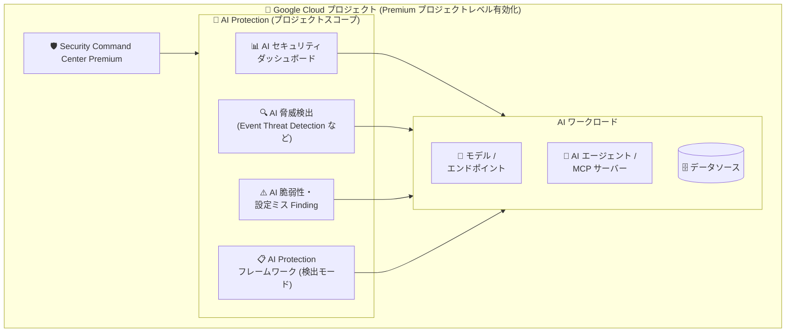

# Security Command Center: AI Protection のプロジェクトレベル有効化に対応

**リリース日**: 2026-07-27

**サービス**: Security Command Center

**機能**: AI Protection のプロジェクトレベル有効化

**ステータス**: Feature

📊 [このアップデートのインフォグラフィックを見る](https://takech9203.github.io/google-cloud-news-summary/20260727-security-command-center-ai-protection-project-level.html)

## 概要

Security Command Center の Premium ティアにおいて、AI Protection をプロジェクトレベルで有効化できるようになった。AI Protection は AI ワークロードのセキュリティポスチャーを管理し、脅威検出と AI アセットインベントリに対するリスク軽減を支援する機能である。

プロジェクトレベルの有効化では、AI セキュリティダッシュボード、AI 脅威検出、AI の脆弱性・設定ミスに関する Finding へのアクセスが提供される。プロジェクトレベルで有効化した場合、AI セキュリティダッシュボードにはそのプロジェクトに限定されたデータが表示される。組織全体で Security Command Center Premium を契約せずとも、AI ワークロードを運用する特定のプロジェクトだけを対象に AI セキュリティ管理を導入できるため、AI 活用を進める個別チームや、スモールスタートで AI セキュリティ対策を始めたい組織に適している。

**アップデート前の課題**

- AI Protection のダッシュボードやフル機能を利用するには、組織レベルで Security Command Center を有効化する必要があり、組織全体での導入判断・契約が前提となっていた
- AI ワークロードが特定のプロジェクトに集中している場合でも、AI Protection の利用のために組織全体を対象とした有効化が必要で、スモールスタートが難しかった
- 組織管理者の関与なしに、プロジェクト単位で AI セキュリティの可視化・脅威検出を導入する手段がなかった

**アップデート後の改善**

- Premium ティアのプロジェクトレベル有効化で AI Protection が利用可能になり、対象プロジェクトのみで AI セキュリティ管理を開始できるようになった
- プロジェクトレベルの有効化でも、AI セキュリティダッシュボード、AI 脅威検出、AI の脆弱性・設定ミス Finding にアクセスできるようになった
- プロジェクトレベルの Premium は従量課金 (pay-as-you-go) でプロジェクト単位に課金されるため、対象プロジェクトのリソース使用量に応じたコスト管理が可能になった

## アーキテクチャ図

プロジェクトレベルで Security Command Center Premium を有効化すると、AI Protection の各コンポーネント (ダッシュボード、脅威検出、脆弱性・設定ミス検出、フレームワーク) がそのプロジェクト内の AI ワークロードを対象に動作する。

## サービスアップデートの詳細

### 主要機能

1. **AI セキュリティダッシュボード (プロジェクトスコープ)**
   - Risk Overview > AI Security からアクセスでき、プロジェクト内の AI アセット (モデル、データソース、エンドポイント、エージェント、Agent Registry にカタログされた MCP サーバー) を可視化
   - 組織レベル有効化では組織全体のデータが集約表示されるのに対し、プロジェクトレベルではそのプロジェクトに限定されたデータが表示される

2. **AI 脅威検出**
   - Event Threat Detection により、AI アセットに関する異常なサービスアカウント活動、機密性の高い権限変更、エージェント ID の悪用などを検出 (例: `Persistence: New AI API Method`、`Credential Access: Agentic Identity Credential Used Outside of Google Cloud`)
   - Agent Platform Threat Detection (Preview) により、Agent Runtime にデプロイされたエージェントのランタイム脅威 (リバースシェル、認証情報探索、暗号資産マイニングなど) を検出

3. **AI の脆弱性・設定ミス Finding**
   - Agent Platform Vulnerability Assessment (Preview) により、エージェンティックワークロードのソフトウェア脆弱性 (CVE) を特定
   - AI Protection のデフォルトフレームワーク (Google Recommended AI Essentials - Vertex AI) が検出モードで自動適用され、ベースラインコントロール違反をアラートとして生成

4. **AI Protection フレームワーク**
   - デフォルトフレームワークは AI Protection の有効化時に組織またはプロジェクトへ自動適用される
   - デフォルトフレームワークのコピーからカスタムフレームワークを作成し、組織・フォルダ・プロジェクト単位で適用可能

## 技術仕様

### 有効化レベルによる違い

| 項目 | 組織レベル有効化 | プロジェクトレベル有効化 |
|------|------------------|--------------------------|
| 対象ティア | Premium / Enterprise (非推奨) | Premium |
| ダッシュボードのデータ範囲 | 組織内の全プロジェクト・リソースを集約 | 当該プロジェクトのみ |
| 課金 | 組織単位 (従量課金またはサブスクリプション) | プロジェクト単位の従量課金 (pay-as-you-go) |
| 有効化の権限 | 組織管理者 | プロジェクトの IAM 権限があれば自己完結で有効化可能 |
| データレジデンシー | サポートあり | サポートなし (プロジェクトレベル有効化の制限) |

### AI Protection を構成するサービス

AI Protection の有効化に伴い、以下のサービスが自動有効化される (一部例外あり)。

| サービス | 役割 |
|----------|------|
| AI Discovery service | AI アセットの自動検出 |
| Event Threat Detection | AI アセットに対する脅威検出 |
| Agent Platform Threat Detection (Preview) | Agent Runtime エージェントのランタイム脅威検出 |
| Agent Platform Vulnerability Assessment (Preview) | エージェンティックワークロードの CVE 検出 (新規有効化ではデフォルト有効) |
| Model Armor | LLM プロンプト・レスポンスの保護 (必須サービス、テンプレート設定が必要) |
| Compliance Manager | AI Protection フレームワークの適用 (必須サービス) |
| Sensitive Data Protection | 機密データの検出・分類 |
| Attack Path Simulations | エージェント・MCP サーバーを高価値リソースとしたリスク特定 |
| App Hub (Preview) | MCP サーバーインベントリに必要 (必須サービス) |

## 設定方法

### 前提条件

1. プロジェクトが組織に関連付けられていること
2. プロジェクトに対する Security Admin (`roles/iam.securityAdmin`) および Security Center Admin (`roles/securitycenter.admin`) 相当の IAM ロールが付与されていること
3. Security Command Center Premium ティアがプロジェクトで有効化されていること (未有効の場合、組織で Security Command Center が未使用であれば 30 日間の無料トライアルで Premium を有効化可能)

### 手順

#### ステップ 1: Security Command Center Premium をプロジェクトで有効化

Google Cloud コンソールの「Tier details」ページで対象プロジェクトを選択し、「Manage project tier」から Premium ティアを選択して更新する。

#### ステップ 2: AI Protection のセットアップ

Premium ティア有効化後、「Settings > Manage Settings」の AI Protection カードから AI Protection をセットアップする。

#### ステップ 3: ディスカバリの有効化とダッシュボードの確認

AI Protection で保護したいリソースの Sensitive Data Discovery を有効化し、「Risk Overview > AI Security」で AI セキュリティダッシュボードを確認する。必要なサービスが無効な場合はダッシュボード上に設定手順が案内される。Model Armor を利用する場合は、生成 AI を利用する各プロジェクトで `modelarmor.googleapis.com` を有効化し、テンプレートとフロア設定を構成する。

## メリット

### ビジネス面

- **スモールスタートが可能**: 組織全体での契約・導入判断を待たず、AI ワークロードを持つプロジェクト単位で AI セキュリティ管理を開始できる
- **コストの最適化**: プロジェクト単位の従量課金により、AI Protection が必要なプロジェクトのリソース使用量のみに課金範囲を限定できる

### 技術面

- **プロジェクトに閉じた可視化**: AI セキュリティダッシュボードが当該プロジェクトの AI アセットに限定されるため、チーム単位での責任範囲が明確になる
- **組織レベルと同系統の検出機能**: AI 脅威検出、AI 脆弱性・設定ミス Finding といった主要機能をプロジェクトレベルでも利用できる

## デメリット・制約事項

### 制限事項

- プロジェクトレベル有効化では、Security Command Center のログ・データへのアクセスが当該プロジェクトに限定されるため、プロジェクト外のデータを必要とするサービスは利用できないか、完全な Finding を生成できない
- データレジデンシーはプロジェクトレベル有効化ではサポートされない
- 既存顧客が Agent Platform Vulnerability Assessment を後から有効化する場合、AI Protection の設定ページは組織レベルビューでのみ利用可能
- AI Protection フレームワークはアプリケーションには割り当てられない

### 考慮すべき点

- 組織レベルで Premium (従量課金) を利用中の場合、プロジェクトレベル有効化を反映させるには組織レベルを Standard ティアにダウングレードする必要がある (組織レベルサブスクリプションの場合は期限満了後に反映)
- プロジェクトレベル有効化を最適化するため、組織レベルで Standard ティアを有効化しておくことが推奨されている
- Model Armor のテンプレートを設定していない場合、AI セキュリティダッシュボードの Model Armor ウィジェットにはデータが表示されない
- MCP サーバーの検出には、MCP サーバーをホストする各プロジェクトで App Hub API (`apphub.googleapis.com`) の有効化が必要

## ユースケース

### ユースケース 1: AI 開発プロジェクト単独でのセキュリティ強化

**シナリオ**: 組織全体では Security Command Center Standard を利用しているが、Vertex AI で生成 AI アプリケーションを開発する特定プロジェクトのみ、AI 固有の脅威検出と脆弱性管理を強化したい。

**実装例**: 対象プロジェクトで Premium ティアをプロジェクトレベルで有効化し、AI Protection をセットアップ。Model Armor テンプレートとフロア設定で LLM プロンプト・レスポンスの保護を構成する。

**効果**: 組織全体の契約変更なしに、AI ワークロードを持つプロジェクトだけで AI セキュリティダッシュボードと脅威検出を利用でき、課金も当該プロジェクトに限定される。

### ユースケース 2: エージェンティックワークロードのリスク管理

**シナリオ**: Agent Runtime にデプロイした AI エージェントと MCP サーバーを運用するプロジェクトで、ランタイム脅威と CVE を継続的に監視したい。

**効果**: Agent Platform Threat Detection によるランタイム脅威検出 (リバースシェル、認証情報探索など) と、Agent Platform Vulnerability Assessment による CVE 検出をプロジェクト単位で有効化し、AI セキュリティダッシュボードで一元管理できる。

## 料金

AI Protection は Security Command Center Premium ティアの機能として提供される。プロジェクトレベル有効化の Premium ティアは、プロジェクト内の特定の Google Cloud リソースの使用量に基づく従量課金 (pay-as-you-go) でプロジェクトに課金される。組織で Security Command Center が未使用の場合、プロジェクトの Premium 有効化には 30 日間の無料トライアルが提供される (トライアル終了後は自動的に従量課金プランに移行)。

詳細は [Security Command Center 料金ページ](https://cloud.google.com/security-command-center/pricing) を参照。

## 関連サービス・機能

- **Model Armor**: LLM のプロンプトとレスポンスに対する保護 (プロンプトインジェクション、ジェイルブレイク、機密データ検出)。AI Protection の必須サービス
- **Compliance Manager**: AI Protection フレームワーク (クラウドコントロール) の定義・適用を担う
- **Event Threat Detection**: AI アセットに対する異常なサービスアカウント活動や権限変更などの脅威を検出
- **Sensitive Data Protection**: AI が扱う機密データの検出・分類。ディスカバリの有効化が AI Protection のセットアップ手順に含まれる
- **App Hub**: Agent Registry にカタログされた MCP サーバーのインベントリに必要

## 参考リンク

- 📊 [インフォグラフィック](https://takech9203.github.io/google-cloud-news-summary/20260727-security-command-center-ai-protection-project-level.html)
- [公式リリースノート](https://docs.cloud.google.com/release-notes#July_27_2026)
- [AI Protection の概要](https://docs.cloud.google.com/security-command-center/docs/ai-protection-overview)
- [AI Protection の構成](https://docs.cloud.google.com/security-command-center/docs/configure-ai-protection)
- [プロジェクトに対する Security Command Center の有効化](https://docs.cloud.google.com/security-command-center/docs/activate-scc-for-a-project)
- [料金ページ](https://cloud.google.com/security-command-center/pricing)

## まとめ

AI Protection のプロジェクトレベル有効化により、組織全体の契約を前提とせず、AI ワークロードを持つプロジェクト単位で AI セキュリティダッシュボード・脅威検出・脆弱性管理を導入できるようになった。生成 AI やエージェントを特定プロジェクトで運用しているチームは、Premium ティアのプロジェクトレベル有効化 (30 日間無料トライアルあり) から AI Protection のセットアップを検討するとよい。

---

**タグ**: Security Command Center, AI Protection, AI セキュリティ, プロジェクトレベル有効化, Premium ティア, Model Armor, 脅威検出
