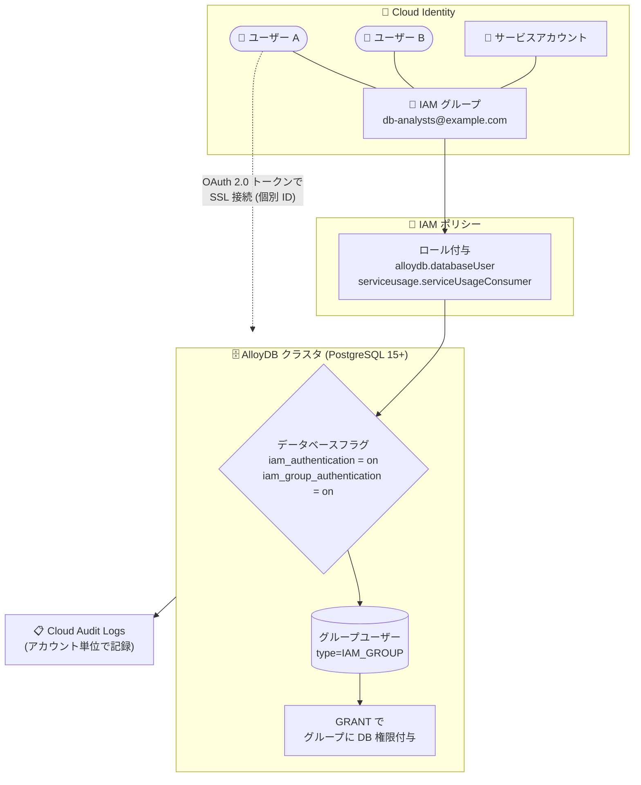

# AlloyDB for PostgreSQL: IAM グループ認証が Preview で利用可能に

**リリース日**: 2026-07-28

**サービス**: AlloyDB for PostgreSQL

**機能**: IAM グループ認証 (IAM group authentication)

**ステータス**: Preview (新規クラスタのみ)

📊 [このアップデートのインフォグラフィックを見る](https://takech9203.github.io/google-cloud-news-summary/20260728-alloydb-iam-group-authentication.html)

## 概要

AlloyDB for PostgreSQL において、IAM グループ認証が Preview で利用可能になりました。従来の IAM データベース認証では IAM ユーザーやサービスアカウントを 1 つずつクラスタに追加する必要がありましたが、本機能では Cloud Identity グループなどの IAM グループをクラスタに追加するだけで、そのグループのメンバー (ユーザーおよびサービスアカウント) 全員が認証権限を継承します。

データベース権限もグループ単位で付与できるため、`GRANT` 文をユーザーごとに繰り返す必要がなくなります。グループにメンバーを追加すれば、そのメンバーは自動的にグループの IAM ロールとデータベース権限を継承し、逆にグループから外せばログインアクセスとデータベース権限が失われます。つまり、データベースユーザー管理を「Cloud Identity のグループメンバーシップ管理」に集約でき、ロールベースアクセス制御 (RBAC) をグループ単位で設計できるようになります。

重要な点として、IAM ロールと権限がグループレベルで割り当てられていても、ユーザーとサービスアカウントは共有のグループアカウントではなく各自の個別 IAM アカウントと認証情報でサインインします。AlloyDB は初回サインイン時にそのプリンシパル用のデータベースアカウントをクラスタ上に自動作成し、個々のアカウントのサインインとデータベースアクティビティは監査ログに記録されます。そのため、グループ単位の権限管理の利便性と、アカウント単位の監査性を同時に得られます。

本機能は Preview であり、新規 AlloyDB クラスタでのみ利用できます。既存クラスタで有効化するには Google Cloud アカウントチームへの問い合わせが必要です。また、Preview では PostgreSQL 15 (`POSTGRES_15`) 以降のデータベースバージョンのみがサポートされます。

**アップデート前の課題**

- IAM データベース認証を使う場合、IAM ユーザーやサービスアカウントを個別にクラスタへ追加する必要があった (`gcloud alloydb users create --type=IAM_BASED` をアカウントごとに実行)
- データベース権限も個々のユーザーに対して繰り返し `GRANT` する必要があり、同じ権限を複数ユーザーに何度も付与する運用が発生していた
- 組織の異動・入退社に伴うアクセス権の追加・削除を、Cloud Identity 側とクラスタ側の両方で個別に反映する必要があった
- アクセス権をまとめて剥奪したい場合も、ユーザーごとに権限の削除やアカウントの削除を行う必要があった

**アップデート後の改善**

- IAM グループをクラスタに追加すれば、グループメンバー全員が認証権限を継承するようになり、メンバーを個別に追加する必要がなくなった
- ログイン権限やデータベース権限をグループに 1 回付与するだけで済み、複数ユーザーへの重複した権限付与が不要になった
- グループにアカウントを追加するだけで、そのアカウントが IAM ロールとデータベース権限を自動的に継承するようになった
- グループからアカウントを削除することで、AlloyDB クラスタへのログインアクセスとデータベース権限をまとめて取り除けるようになった
- グループ単位で権限管理を行いながら、監査ログでは個々のアカウントの操作を追跡できる

## アーキテクチャ図



IAM グループにロールを付与し、グループをクラスタのデータベースユーザーとして登録することで、グループメンバーは個別の ID で認証しながらグループのデータベース権限を継承します。

## サービスアップデートの詳細

### 主要機能

1. **グループ単位のログイン権限継承**
   - IAM グループをクラスタに追加すると、そのグループのメンバー (ユーザーおよびサービスアカウント) 全員が認証権限を継承する
   - メンバーを個別にクラスタへ追加する必要はなく、メンバーが初回サインインしたタイミングで AlloyDB がそのアカウントを自動作成する
   - 認証はグループの共有アカウントではなく、各メンバー個別の IAM アカウントと認証情報で行われる

2. **グループ単位のデータベース権限付与**
   - `GRANT` 文の対象にグループのメールアドレスを指定することで、データベース権限をグループに付与できる
   - グループにアカウントを追加すると、そのアカウントはグループに付与済みのデータベース権限やロールを自動的に継承する
   - グループからアカウントを削除すると、グループメンバーシップ経由で継承していたデータベース権限を失う
   - グループに最小権限のみを付与することで、データベース側の RBAC をグループ単位で構成できる

3. **アカウント単位の監査性の維持**
   - 権限はグループレベルで管理しつつ、個々のユーザー・サービスアカウントのサインインとデータベースアクティビティは監査ログに記録される
   - どのアカウントがどの操作を実行したかを確認できるため、グループ管理と監査要件を両立できる

4. **既存の個別 IAM ユーザーからの移行パス**
   - 既存の個別 IAM ユーザーはグループ認証を利用しないため、移行手順が用意されている
   - ユーザーを IAM グループに追加 → グループをクラスタに追加 → グループに必要なロールを割り当て → グループにデータベース権限を割り当て → クラスタから既存の個別ユーザーを削除 (必要に応じてオブジェクト所有権を移譲)
   - 削除後にユーザーが再度サインインすると、AlloyDB がグループユーザーとしてアカウントを再作成する

## 技術仕様

### データベースフラグ

| フラグ | 型 | デフォルト | インスタンス再起動 | 説明 |
|--------|-----|-----------|------------------|------|
| `alloydb.iam_authentication` | boolean | `off` | 必要 | AlloyDB インスタンスで IAM 認証を有効化する |
| `alloydb.iam_group_authentication` | boolean | `off` | 不要 | AlloyDB インスタンスで IAM グループ認証を有効化する (Preview) |

グループ認証を利用するには、`alloydb.iam_authentication` と `alloydb.iam_group_authentication` の **両方** を `on` に設定する必要があります。無効化する場合はフラグを `off` に設定します。

### 必要な IAM ロール・権限

| 項目 | 詳細 |
|------|------|
| `alloydb.databaseUser` | AlloyDB インスタンスへの接続を許可する (グループアカウントに付与) |
| `serviceusage.serviceUsageConsumer` | 権限チェックを行う API へのアクセスを提供する |
| `alloydb.instances.login` | IAM データベース認証に必要な権限。AlloyDB Client ロール (`roles/alloydb.client`) に含まれる |

IAM ポリシーのバインディングはプロジェクトレベルで適用されるため、プリンシパルはプロジェクト内のすべての AlloyDB インスタンスに対してロールの権限を受け取ります。

### データベースユーザーのタイプ

| タイプ | 説明 |
|--------|------|
| `ALLOYDB_IAM_USER` | 個別に追加された IAM ユーザー。グループの権限を継承しない |
| `ALLOYDB_IAM_SERVICE_ACCOUNT` | 個別に追加された IAM サービスアカウント。グループの権限を継承しない |
| `ALLOYDB_IAM_GROUP_USER` | グループ経由で作成された IAM ユーザー |
| `ALLOYDB_IAM_GROUP_SERVICE_ACCOUNT` | グループ経由で作成された IAM サービスアカウント |

### 認証方式の比較

| 項目 | 組み込みデータベース認証 | IAM データベース認証 |
|------|------------------------|---------------------|
| 認証方式 | パスワード | 一時的な認証トークン |
| ネットワークトラフィックの暗号化 | SSL は必須ではない | SSL が必須 |
| ユーザー管理 | 手動 | IAM による集中管理 |

## 設定方法

### 前提条件

1. 新規 AlloyDB クラスタであること (既存クラスタで有効化するには Google Cloud アカウントチームへの問い合わせが必要)
2. データベースバージョンが `POSTGRES_15` 以降であること
3. Cloud Identity グループが作成済みであること (グループ名は 63 文字以内)
4. クライアントが SSL 接続を利用できること (非暗号化接続は拒否される)

### 手順

#### ステップ 1: データベースフラグを有効化する

インスタンスのデータベースフラグとして以下を設定します。

```
alloydb.iam_authentication = on
alloydb.iam_group_authentication = on
```

`alloydb.iam_authentication` の変更にはインスタンスの再起動が必要です。フラグの設定方法は「Configure an instance's database flags」を参照してください。

#### ステップ 2: グループに IAM ロールを付与する

グループアカウントに対して `alloydb.databaseUser` と `serviceusage.serviceUsageConsumer` のロールを割り当てます。

#### ステップ 3: グループをクラスタのデータベースユーザーとして追加する

```bash
gcloud beta alloydb users create GROUP_EMAIL \
  --cluster=CLUSTER \
  --region=REGION \
  --type=IAM_GROUP
```

- `GROUP_EMAIL`: IAM グループのメールアドレス (例: `db-analysts@example.com`)
- `CLUSTER`: 対象クラスタの ID
- `REGION`: クラスタが存在するリージョン (例: `us-central1`)

IAM 側でグループを削除した直後に同名のグループを再作成した場合、伝播に時間がかかるため、すぐには利用できないことがあります。

#### ステップ 4: グループにデータベース権限を付与する

psql から `GRANT` 文を実行します。グループ名にはメールアドレスを指定し、特殊文字を含むためダブルクォートで囲みます。

```sql
GRANT SELECT ON TABLE_NAME TO "GROUP_NAME";
```

#### ステップ 5: メンバーがサインインする

メンバーは OAuth 2.0 アクセストークンをパスワードとして使用してサインインします。

```bash
PGPASSWORD=$(gcloud auth print-access-token) psql \
  -h INSTANCE_ADDRESS \
  -U USERNAME \
  -d DATABASE
```

- `USERNAME`: IAM ユーザーの場合はメールアドレス全体 (例: `kai@altostrat.com`)。サービスアカウントの場合は `.gserviceaccount.com` サフィックスを除いたアドレス (例: `my-service@my-project.iam`)
- トークンを AlloyDB 認証専用にスコープ制限したい場合は、`gcloud auth application-default print-access-token --scopes=https://www.googleapis.com/auth/alloydb.login` を利用できます
- psql はコマンドラインで入力された 100 文字を超えるパスワードを切り詰めるため、必ず `PGPASSWORD` 環境変数を使用します

初回サインイン時に、AlloyDB がそのプリンシパル用のデータベースアカウントを自動作成します。

#### ステップ 6: グループを削除する場合

```bash
# クラスタからグループユーザーを削除
gcloud alloydb users delete GROUP_EMAIL_ADDRESS \
  --cluster=CLUSTER_ID \
  --region=REGION_ID
```

あわせて、Google Cloud コンソールの IAM ページから `roles/alloydb.databaseUser` およびクラスタへのアクセスを許可する他の AlloyDB 関連ロールを削除します。Cloud Identity でグループのログイン権限 (`alloydb.databaseUser`) を剥奪した場合は、アクセスを完全に取り除くために AlloyDB クラスタからもグループを削除する必要があります。

## メリット

### ビジネス面

- **ユーザー管理コストの削減**: データベースユーザーの追加・削除を Cloud Identity のグループメンバーシップ管理に集約でき、クラスタごとの個別作業が不要になる
- **オンボーディング / オフボーディングの迅速化**: 入退社や異動時にグループメンバーシップを変更するだけで、データベースへのアクセス権と権限が反映される
- **ガバナンスの強化**: ログイン権限とデータベース権限をグループ単位で一括剥奪できるため、退職者や委託先のアクセス残存リスクを低減できる

### 技術面

- **RBAC の一元設計**: グループを役割 (アナリスト、開発者、バッチ処理など) にマッピングし、最小権限をグループに付与することでロールベースアクセス制御を構成できる
- **監査性の維持**: グループ単位で権限を管理しつつ、監査ログにはアカウント単位のアクティビティが記録されるため、誰が何をしたかを追跡できる
- **パスワード管理の排除**: IAM 認証は一時的な認証トークンを使用し、SSL 接続が必須となるため、静的なデータベースパスワードの管理・ローテーションが不要になる
- **サービスアカウントにも適用可能**: アプリケーション用のサービスアカウントもグループメンバーとして扱えるため、人間のユーザーとワークロードの権限管理を同じ枠組みで行える

## デメリット・制約事項

### 制限事項

- IAM グループ認証は **新規** AlloyDB クラスタでのみ Preview 提供。既存クラスタで有効化するには Google Cloud アカウントチームへの問い合わせが必要
- Preview では `POSTGRES_15` 以降のデータベースバージョンのみサポート
- IAM データベース認証によるサインインは SSL 接続でのみ利用可能。非暗号化接続は拒否される
- インスタンスごとに 1 分あたりのサインインクォータがあり、成功・失敗の両方がカウントされる。超過するとサインインが一時的に利用できなくなる
- リードレプリカがあるクラスタでは、まずプライマリインスタンスにサインインする必要がある。初回サインイン後にグループユーザー情報がリードレプリカへレプリケートされ、2 回目以降は直接リードレプリカにサインインできる
- 1 つのインスタンス / クラスタに追加できる IAM グループは最大 200 個。非アクティブなグループもこの上限にカウントされる
- IAM グループ名は 63 文字以内。超過する場合は有効な名前を持つ親グループの下にネストし、親グループを先にクラスタへ追加する必要がある
- 同一インスタンス上で、グループに所属する個別の IAM ユーザー / サービスアカウントを追加することはできない (`ALLOYDB_IAM_GROUP_USER` / `ALLOYDB_IAM_GROUP_SERVICE_ACCOUNT` と同一のアカウントを `ALLOYDB_IAM_USER` として追加できない)
- 既に `ALLOYDB_IAM_USER` タイプで存在するアカウントはグループの IAM ロールやデータベース権限を継承しない。グループ認証で使うには個別ユーザーを削除する必要がある
- Cloud Identity のグループメンバーシップ変更 (アカウント追加など) の伝播には約 15 分かかる。これは IAM 変更の伝播時間に加算される
- マネージド接続プーリング (managed connection pooling) との併用は非対応
- フェデレーション ID (federated identities) との併用は非対応

### 考慮すべき点

- Preview 機能であり、「Pre-GA Offerings Terms」が適用される。現状のまま提供され、サポートが限定される場合があるため、本番環境への適用は慎重に判断する
- 権限変更が即時反映されない (グループメンバーシップの伝播に約 15 分) ため、緊急のアクセス剥奪が必要なケースでは、グループ削除だけでなく個別の対応も検討する
- ユーザーをグループから外しても、他のグループメンバーシップ経由で AlloyDB クラスタへのサインイン権限を持っている場合は新規セッションを作成できる (ただし元のグループ由来のデータベース権限は失う)
- 既存の個別 IAM ユーザーが混在している環境では、移行手順に従って個別ユーザーを削除する必要がある。削除時にはデータベースオブジェクトの所有権移譲を忘れないよう注意する
- 頻繁なサインインはクォータを消費するため、接続プーリングや承認済みネットワークによる制限が推奨される (ただしマネージド接続プーリングは本機能と併用できない点に留意)

### ベストプラクティス (公式ドキュメント)

- Cloud Identity で IAM グループのログイン権限 (`alloydb.databaseUser`) を剥奪する際は、AlloyDB クラスタからもそのグループを削除する
- Cloud Identity からグループを削除する際は、AlloyDB クラスタからもそのグループを削除する
- グループを使ってデータベースのロールベースアクセス制御を構成し、グループには必要最小限の権限のみを付与する

## ユースケース

### ユースケース 1: 部門・職務単位のデータベースアクセス管理

**シナリオ**: データ分析チーム、アプリケーション開発チーム、運用チームがそれぞれ異なる範囲のテーブルにアクセスする必要がある。従来はメンバーごとに AlloyDB クラスタへユーザーを追加し、`GRANT` を繰り返していた。

**実装例**:
```bash
# 職務ごとの Cloud Identity グループをクラスタに登録
gcloud beta alloydb users create analysts@example.com \
  --cluster=prod-cluster --region=us-central1 --type=IAM_GROUP

gcloud beta alloydb users create app-developers@example.com \
  --cluster=prod-cluster --region=us-central1 --type=IAM_GROUP
```
```sql
-- グループ単位で最小権限を付与
GRANT SELECT ON sales_summary TO "analysts@example.com";
GRANT SELECT, INSERT, UPDATE ON orders TO "app-developers@example.com";
```

**効果**: 新しいメンバーは Cloud Identity グループに追加されるだけで適切な権限でデータベースにアクセスでき、退職・異動時はグループから外すだけでアクセス権と権限が失われる。クラスタ側の作業が不要になる。

### ユースケース 2: 入退社・異動時のアクセス権ライフサイクル自動化

**シナリオ**: 人事システムと連携した Cloud Identity のグループ管理を既に運用しており、データベースアクセスもそのライフサイクルに乗せたい。

**効果**: ID 管理基盤 (Cloud Identity) をアクセス権の単一の管理点にできる。データベース側の個別ユーザー管理タスクが削減され、アクセス権の棚卸しもグループメンバーシップの確認で完結する。監査ログにはアカウント単位のアクティビティが残るため、内部統制上の追跡性も確保される。

### ユースケース 3: 複数のアプリケーションサービスアカウントの権限統一

**シナリオ**: 同じデータベース権限を必要とする複数のマイクロサービスがあり、それぞれサービスアカウントを持っている。サービス追加のたびにデータベース権限を付与する運用が発生していた。

**効果**: サービスアカウントを共通のグループにまとめてグループへ権限を付与することで、新しいサービスの追加時にデータベース側の権限設定が不要になる。共有アカウントを使わないため、どのサービスアカウントがどの操作を行ったかは監査ログで区別できる。

## 料金

IAM グループ認証について、公式ドキュメントおよびリリースノートに追加料金の記載はありません。AlloyDB for PostgreSQL の料金は以下の要素で構成されます。

| 課金要素 | 内容 |
|---------|------|
| CPU / メモリ | インスタンス単位に vCPU 数と メモリ GiB 単位で課金。1 ノードあたり最大 288 vCPU / 2232 GiB。リージョンおよびマシンシリーズにより単価が異なる |
| データベースストレージ | クラスタ内のインスタンスが共有する、リージョン単位の水平スケーリング可能なストレージ層に対する課金 |
| バックアップストレージ | バックアップデータの保存に対する課金 |
| ネットワーキング | データ転送に対する課金 |

CPU / メモリについては 1 年または 3 年の確約利用割引 (CUD) が提供されます。正確な料金は下記の料金ページで、対象リージョンを選択して確認してください。

## 関連サービス・機能

- **Cloud Identity**: IAM グループの作成・メンバーシップ管理を行う。本機能におけるアクセス権管理の起点となる
- **IAM (Identity and Access Management)**: `alloydb.databaseUser` / `serviceusage.serviceUsageConsumer` などのロール付与により、グループへのログイン権限を集中管理する
- **Cloud Audit Logs**: グループ単位の権限管理下でも、個々のアカウントのサインインおよびデータベースアクティビティを記録し、監査に利用できる
- **AlloyDB 個別 IAM 認証 (IAM_BASED ユーザー)**: 特定のアカウントに直接アクセスを付与する既存方式。グループ認証と同一インスタンス上で同じアカウントを重複させることはできない
- **標準 PostgreSQL ユーザー (組み込みデータベース認証)**: すべての AlloyDB クラスタがサポートする従来のパスワード認証。IAM 認証はこれを補完する形で併用できる
- **AlloyDB リードプール / リードレプリカ**: グループユーザー情報はプライマリへの初回サインイン後にレプリケートされるため、サインイン順序に注意が必要
- **AlloyDB マネージド接続プーリング**: 本機能とは併用できないため、接続プーリング戦略の見直しが必要になる場合がある

## 参考リンク

- 📊 [インフォグラフィック](https://takech9203.github.io/google-cloud-news-summary/20260728-alloydb-iam-group-authentication.html)
- [公式リリースノート (AlloyDB for PostgreSQL)](https://cloud.google.com/alloydb/docs/release-notes)
- [IAM group authentication (ドキュメント)](https://docs.cloud.google.com/alloydb/docs/database-users/iam-authentication#group-auth)
- [Manage IAM authentication (ドキュメント)](https://docs.cloud.google.com/alloydb/docs/database-users/manage-iam-auth#group)
- [Connect using an IAM account](https://docs.cloud.google.com/alloydb/docs/connect-iam)
- [AlloyDB データベースフラグ リファレンス](https://docs.cloud.google.com/alloydb/docs/reference/alloydb-flags#alloydb.iam_group_authentication)
- [Configure an instance's database flags](https://docs.cloud.google.com/alloydb/docs/instance-configure-database-flags)
- [Overview of Cloud Identity](https://docs.cloud.google.com/identity/docs/overview)
- [料金ページ (AlloyDB for PostgreSQL)](https://cloud.google.com/alloydb/pricing)

## まとめ

AlloyDB の IAM グループ認証は、データベースユーザー管理を Cloud Identity のグループメンバーシップ管理に集約できる、運用負荷とガバナンスの両面で価値の大きいアップデートです。グループ単位で権限を付与しながら、監査ログではアカウント単位の追跡性が維持される点が実務上の大きな利点となります。ただし Preview であり、新規クラスタ限定・PostgreSQL 15 以降・マネージド接続プーリングおよびフェデレーション ID との併用不可といった制約があるため、まずは検証用の新規クラスタでフラグ (`alloydb.iam_authentication` と `alloydb.iam_group_authentication`) を有効化し、既存の個別 IAM ユーザーからの移行手順とアクセス権の伝播時間 (約 15 分) を含めた運用フローを確認することを推奨します。

---

**タグ**: AlloyDB for PostgreSQL, IAM, Cloud Identity, データベース認証, グループ認証, Preview, RBAC, セキュリティ, アクセス管理, PostgreSQL
