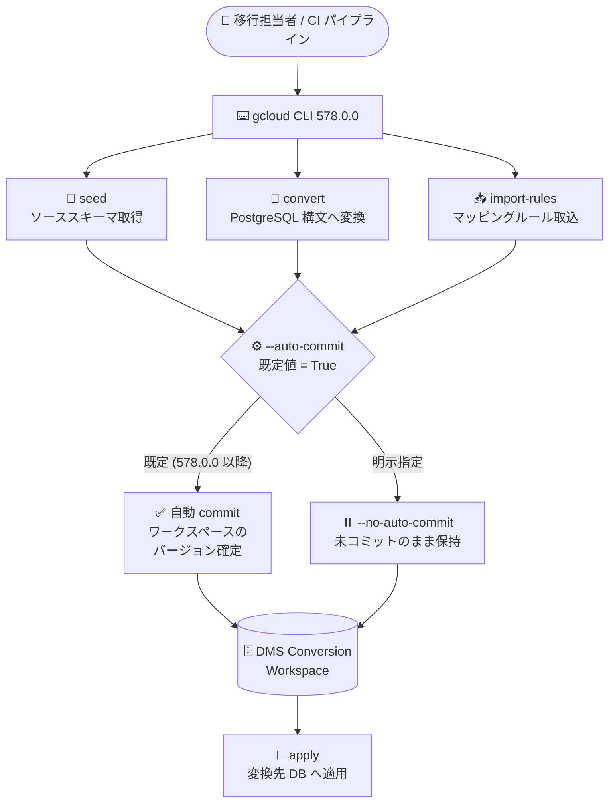

# Cloud SDK (gcloud CLI): 578.0.0 リリース — Database Migration の `--auto-commit` がデフォルト化 (破壊的変更)

**リリース日**: 2026-07-28

**サービス**: Cloud SDK (gcloud CLI / bq)

**機能**: gcloud CLI 578.0.0

**ステータス**: GA (安定版リリース) / 破壊的変更を 1 件含む

📊 [このアップデートのインフォグラフィックを見る](https://takech9203.github.io/google-cloud-news-summary/20260728-cloud-sdk-578-0-0.html)

## 概要

2026 年 7 月 28 日、Google Cloud CLI (gcloud CLI) のバージョン **578.0.0** がリリースされました。このリリースには **1 件の破壊的変更 (Breaking Change)** が含まれています。Database Migration Service (DMS) の Conversion Workspace 操作である `gcloud database-migration conversion-workspaces seed` / `convert` / `import-rules` の 3 コマンドについて、`--auto-commit` フラグの既定値が **有効 (True)** に変更されました。自動コミットを無効化したい場合は、明示的に `--no-auto-commit` を指定する必要があります。

この変更は、Oracle / SQL Server から PostgreSQL・AlloyDB・Cloud SQL への移行パイプラインを gcloud CLI でスクリプト化・CI 化しているユーザーに直接影響します。従来はスキーマのシード・変換・マッピングルールのインポートを実行しても Conversion Workspace のコミットは別途 `commit` コマンドで行う運用が前提でしたが、578.0.0 以降は各操作の完了時点で自動的にコミット (バージョン確定) されるため、既存の自動化スクリプトの挙動が変わります。

破壊的変更に加えて、AlloyDB、BigQuery (bq)、Cloud Run、Compute Engine、Cloud Backup DR、Cloud Bigtable、Cloud Composer、Cloud IAM、Cloud Workstations、Secret Manager、Developer Connect、GKE Hub、Network Management、BigLake の各サービスに対して多数のフラグ・コマンド追加および GA 昇格が含まれています。特に Compute Engine では `test-iam-permissions` / `set-iam-policy` 系のコマンドが複数リソースタイプに横展開され、Cloud Router の Named Set 管理コマンド群が GA に昇格しました。

**アップデート前の課題**

- `gcloud database-migration conversion-workspaces seed|convert|import-rules` を実行しても Conversion Workspace はコミットされず、変更を確定するには別途 `gcloud database-migration conversion-workspaces commit` を実行する必要があった (コマンドを忘れると変換結果が未確定のまま残る)
- Cloud Backup DR の Backup Plan を gcloud CLI で作成する際、トランザクションログの保持期間を指定する手段が Google Cloud コンソールに比べて限定的で、Point-in-Time Recovery (PITR) の構成がしづらかった
- AlloyDB のクラスタリストア時に Backup and DR Service のバックアップボールト内バックアップを指定するフラグ (`--backupdr-backup` / `--backupdr-data-source`) は Pre-GA トラックのみで、GA トラックでは利用できなかった
- Compute Engine の machine images、snapshots、subnets、health sources、interconnect attachment groups、instant snapshot groups などのリソースについて、IAM 権限のテストや IAM ポリシー設定を gcloud CLI から実行できないリソースタイプが残っていた
- Cloud Router の Named Set (BGP ルートポリシーで参照するプレフィックス/コミュニティの名前付き集合) を管理するコマンド群が Pre-GA トラックのみで提供されており、本番運用での利用に制約があった
- Cloud Workstations では、アイドルタイムアウト到達時の動作 (停止するか、サスペンドするか) を gcloud CLI から指定できなかった
- Secret Manager では、Cloud SQL 認証情報などのシークレット種別を指定した作成や、マネージドローテーションの有効化・実行を gcloud CLI から行えなかった
- `gcloud init` の実行時、Enterprise Certificate Proxy (ECP) のバイナリが構成に存在しない場合にクラッシュする不具合があった

**アップデート後の改善**

- Conversion Workspace の `seed` / `convert` / `import-rules` は既定で自動コミットされるようになり、コミット漏れによる「変換したはずが確定していない」状態を防げるようになった (明示的に無効化する場合は `--no-auto-commit`)
- `gcloud backup-dr backup-plans create` / `update` の全リリーストラックで `--log-retention-days` が利用可能になり、AlloyDB / Cloud SQL ワークロードの PITR 用ログ保持期間を CLI から構成できるようになった
- AlloyDB の `--backupdr-backup` / `--backupdr-data-source` フラグが GA トラックに昇格し、`gcloud alloydb clusters restore` で安定版としてバックアップボールトからのリストアが可能になった
- Compute Engine の machine images / snapshots / subnets / health sources に `test-iam-permissions`、instant snapshot groups / interconnect attachment groups に `set-iam-policy` が追加され、IAM 検証・設定の CLI カバレッジが広がった
- Cloud Router の Named Set 管理コマンド群 8 個が GA に昇格した
- Cloud Workstations の `--idle-action` フラグにより、アイドル時に `stop` / `suspend` のいずれを行うかを構成テンプレートで指定できるようになった
- Secret Manager に `--secret-type`、`enable-managed-rotation`、`rotate-secret` が追加され、Cloud SQL 認証情報の自動ローテーションを CLI で一貫して設定できるようになった
- `gcloud init` の ECP バイナリ欠落時クラッシュが修正された

## アーキテクチャ図



578.0.0 以降、`seed` / `convert` / `import-rules` は既定で自動コミットされ、Conversion Workspace のバージョンが即座に確定します。従来の「実行してから内容を確認して手動 commit」というフローを維持したい場合は `--no-auto-commit` を明示する必要があります。

## サービスアップデートの詳細

### 破壊的変更: Database Migration Service の `--auto-commit` デフォルト化

**対象コマンド** (すべてのリリーストラック):

- `gcloud database-migration conversion-workspaces seed`
- `gcloud database-migration conversion-workspaces convert`
- `gcloud database-migration conversion-workspaces import-rules`

公式リファレンスでは、これらのコマンドのフラグ仕様が次のように記載されています。

> `--[no-]auto-commit` — Auto-commit the conversion workspace (default: True). Use `--auto-commit` to enable and `--no-auto-commit` to disable.

Conversion Workspace は、ソースデータベース (Oracle / SQL Server) のスキーマとコードを変換先 (PostgreSQL / AlloyDB / Cloud SQL for PostgreSQL) の構文へ変換するための作業領域です。`commit` はワークスペースの状態をバージョンとして確定する操作であり、`rollback` によって直前のコミット済みバージョンへ戻すことができます。578.0.0 以降は seed/convert/import-rules の各操作が完了した時点で自動的にこのコミットが行われます。

**マイグレーション影響と対応方針**

| 観点 | 従来 (〜577.x) | 578.0.0 以降 | 推奨対応 |
|------|---------------|-------------|---------|
| 既定の挙動 | 操作後は未コミット状態 | 操作後に自動コミット | スクリプトの前提を見直す |
| 明示的に手動コミット運用を維持 | 何も指定しない | `--no-auto-commit` を付与 | CI/CD スクリプトへ `--no-auto-commit` を追記 |
| 後続の `commit` 呼び出し | 必須 | 自動コミット時は不要 | 冗長な `commit` 呼び出しの有無を確認 |
| コミット済みバージョンの巻き戻し | `rollback` | `rollback` (変更なし) | 誤コミット時は `rollback` を利用 |
| 必要な IAM 権限 | `datamigration.conversionworkspaces.commit` を別操作で使用 | seed/convert/import-rules 実行時に暗黙的に必要 | 実行主体に `commit` 権限があるか確認 |

特に、`convert` の結果を人がレビューしてから確定する承認フローを組んでいる場合、フラグ未指定のままバージョンを上げると **レビュー前に自動コミットされる** ため、`--no-auto-commit` の明示追加が必須です。

### Compute Engine: IAM 系コマンドの横展開と Cloud Router Named Set の GA

`test-iam-permissions` は指定リソースに対して呼び出し元が持つ権限をテストするコマンドで、今回以下のリソースへ追加されました。

- `gcloud compute machine-images test-iam-permissions` (beta / preview / GA)
- `gcloud compute networks subnets test-iam-permissions` (beta / preview / GA)
- `gcloud compute snapshots test-iam-permissions`
- `gcloud compute health-sources test-iam-permissions`

`set-iam-policy` は以下へ追加されました。

- `gcloud compute instant-snapshot-groups set-iam-policy`
- `gcloud compute interconnects attachments groups set-iam-policy` (beta / preview / GA)

また、Cloud Router の BGP ルートポリシーで参照する **Named Set** (プレフィックス集合・BGP コミュニティ集合の名前付きグループ) を操作する以下 8 コマンドが GA に昇格しました。

`add-named-set`、`add-named-set-element`、`download-named-set`、`get-named-set`、`list-named-sets`、`remove-named-set`、`remove-named-set-element`、`upload-named-set`

### Cloud Backup DR: `--log-retention-days` による PITR ログ保持設定

`gcloud backup-dr backup-plans create` および `update` の全リリーストラックで `--log-retention-days` が使用可能になりました。公式リファレンスでは次のように定義されています。

> `--log-retention-days=LOG_RETENTION_DAYS` — Configures how long logs will be stored. It is defined in "days". This value should be greater than or equal to minimum enforced retention duration of the backup vault.

このフラグは **AlloyDB および Cloud SQL ワークロード専用** です。重要な注意点として、Google Cloud コンソールでは推奨値 13 日が既定で設定されますが、**gcloud CLI でプログラム的にプランを作成した場合、未指定だとログ保持は無効のまま** になります (公式ドキュメント記載)。PITR を必要とする場合は明示指定が必須です。

## 技術仕様

### サービス別の変更一覧

| サービス | 変更内容 | 対象コマンド / フラグ | トラック |
|---------|---------|---------------------|---------|
| **Database Migration** | **破壊的変更**: `--auto-commit` を既定有効化 | `conversion-workspaces seed｜convert｜import-rules` | 全トラック |
| Google Cloud CLI | ECP バイナリ欠落時の `gcloud init` クラッシュを修正 | `gcloud init` | — |
| Google Cloud CLI | macOS 版 Python Virtualenv を 3.14.6 に更新 | — | — |
| AlloyDB | Backup DR リストアフラグを GA 昇格 | `--backupdr-backup`, `--backupdr-data-source` | GA |
| BigLake | `X-Iceberg-Access-Delegation: vended-credentials` ヘッダ送信漏れを修正 | `biglake iceberg tables` | — |
| BigQuery (bq) | `NOT_FOUND` を無視する強制削除を追加 | `bq rm --connection -f｜--force` | — |
| BigQuery (bq) | `--nouse_google_auth` 指定時の gcloud 構成読込を修正 | — | — |
| BigQuery (bq) | 特定メトリクス環境で作成されたジョブに定義済みラベルを付与 | — | — |
| BigQuery (bq) | グローバルフラグのヘルプテキスト更新 / User-Agent のコマンド形式更新 | — | — |
| Cloud Backup DR | PITR 用ログ保持期間の設定フラグを追加 | `backup-dr backup-plans create｜update --log-retention-days` | 全トラック |
| Cloud Bigtable | 警告を無視するフラグを追加 | `bigtable instances tables update`, `bigtable tables update` の `--ignore-warnings` | — |
| Cloud Bigtable | `--ignore-warnings` を GA 昇格 | `bigtable materialized-views create` | GA |
| Cloud Composer | Airflow 3.2 環境で Airflow CLI コマンドを有効化 | `composer environments run` 系 | — |
| Cloud IAM | `--scim-usage` の `enabled-for-users-groups` を beta 昇格 | `beta iam workforce-pools providers` | beta |
| Cloud Run | コンテナをサンドボックスランチャーに指定するフラグを追加 | `beta run jobs`, `beta run worker-pools` の `--sandbox-launcher` | beta |
| Cloud Workstations | アイドル時アクション (`stop` / `suspend`) を追加 | `alpha｜beta workstations configs create｜update --idle-action` | alpha / beta |
| Compute Engine | ネットワークティア指定を追加 | `compute public-advertised-prefixes create --network-tier` | beta |
| Compute Engine | メタデータフィルタを追加 | `compute forwarding-rules create｜update --metadata-filter` | 全トラック |
| Compute Engine | IAM 権限テストコマンドを追加 | `compute machine-images test-iam-permissions` | beta / preview / GA |
| Compute Engine | `url_rewrite` 内の `regex_rewrite` サポートを beta 昇格 | `compute url-maps` | beta |
| Compute Engine | Named Set 管理コマンド群 8 個を GA 昇格 | `compute routers add-named-set` 他 | GA |
| Compute Engine | IAM 権限テストコマンドを追加 | `compute health-sources test-iam-permissions` | — |
| Compute Engine | IAM ポリシー設定コマンドを追加 | `compute instant-snapshot-groups set-iam-policy` | — |
| Compute Engine | IAM 権限テストコマンドを追加 | `compute networks subnets test-iam-permissions` | beta / preview / GA |
| Compute Engine | イメージビュー参照コマンドを追加 | `compute image-views describe` | beta |
| Compute Engine | IAM 権限テストコマンドを追加 | `compute snapshots test-iam-permissions` | — |
| Compute Engine | IAM ポリシー設定コマンドを追加 | `compute interconnects attachments groups set-iam-policy` | beta / preview / GA |
| Compute Engine | Internal Range からグローバル内部 IP を確保 (PSC 用) | `compute addresses create --internal-range` | — |
| Compute Engine | `--reservation-block` 指定時に `--reservation` を必須化 | `compute reservations hosts list｜describe` | — |
| Developer Connect | BYO / Bitbucket Cloud (BBC) 接続タイプに対応 | `beta developer-connect account-connectors` | beta |
| GKE Hub | `--view`, `--memberships`, `--filter`, `--sort-by` を beta 昇格 | `container fleet｜hub config-management describe` | beta |
| Network Management | DMS プライベート接続をソースに指定するフラグを追加 | `network-management connectivity-tests --source-dms-private-connection` | — |
| Secret Manager | シークレット種別の指定に対応 (例: Cloud SQL 認証情報) | `secrets create --secret-type` | — |
| Secret Manager | マネージドローテーションの有効化コマンドを追加 | `secrets enable-managed-rotation` | — |
| Secret Manager | シークレットのローテーション実行コマンドを追加 | `secrets rotate-secret` | — |

### Cloud Run `--sandbox-launcher` の仕様

公式リファレンス (`gcloud beta run worker-pools deploy`) では、コンテナ単位のフラグとして定義されています。

> `--[no-]sandbox-launcher` — Set the container as a sandbox supervisor to launch sandboxes. Use `--sandbox-launcher` to enable and `--no-sandbox-launcher` to disable.

`--container` フラグと組み合わせるマルチコンテナ構成において、特定のコンテナをサンドボックス監視役 (supervisor) として指定します。

### Cloud Workstations `--idle-action` の仕様

| 値 | 動作 |
|----|------|
| `stop` | `--idle-timeout` 経過後にワークステーションを停止する |
| `suspend` | `--idle-timeout` 経過後にワークステーションをサスペンドする |

Workstations API の `WorkstationConfig.idle_action` フィールドに対応し、既定値は `STOP` です。`--idle-timeout` の既定値は 7200 秒 (`configs create` のリファレンス記載値) で、`0` を指定するとアイドルによるタイムアウトは発生しません。

## 設定方法

### 前提条件

1. gcloud CLI を 578.0.0 以降に更新していること
2. Database Migration Service を操作する場合、`roles/datamigration.admin` (または `datamigration.conversionworkspaces.commit` を含むカスタムロール) が付与されていること

### 手順

#### ステップ 1: gcloud CLI を 578.0.0 へ更新し、バージョンを確認する

```bash
gcloud components update
gcloud version
```

#### ステップ 2: 破壊的変更の影響を受けるスクリプトを洗い出す

```bash
# リポジトリ内の該当コマンド呼び出しを検索
grep -rn "conversion-workspaces \(seed\|convert\|import-rules\)" .
```

該当箇所について、自動コミットして良いか / 手動コミット運用を維持すべきかを判断します。

#### ステップ 3: 従来の挙動を維持する場合は `--no-auto-commit` を追加する

```bash
# 従来どおり未コミットのまま変換のみ実施
gcloud database-migration conversion-workspaces convert my-conversion-workspace \
  --region=us-central1 \
  --no-auto-commit

# レビュー後、明示的にコミット
gcloud database-migration conversion-workspaces commit my-conversion-workspace \
  --region=us-central1 \
  --commit-name=reviewed-2026-07-28
```

#### ステップ 4: 自動コミットを受け入れる場合 (推奨: 明示指定)

```bash
# 578.0.0 以降は --auto-commit が既定だが、意図を明示するために指定しておくと
# バージョン間で挙動が安定する
gcloud database-migration conversion-workspaces seed my-conversion-workspace \
  --region=us-central1 \
  --source-connection-profile=cp1 \
  --auto-commit
```

意図しないコミットが発生した場合は `rollback` で直前のコミット済みバージョンへ戻せます。

```bash
gcloud database-migration conversion-workspaces rollback my-conversion-workspace \
  --region=us-central1
```

#### ステップ 5: Cloud Backup DR で PITR ログ保持を構成する

```bash
gcloud backup-dr backup-plans create bp-alloydb-daily \
  --project=test-project \
  --location=us-central1 \
  --resource-type=alloydb.googleapis.com/Cluster \
  --backup-vault=test-bv \
  --log-retention-days=13 \
  --backup-rule=rule-id=rule-alloydb,recurrence=DAILY,backup-window-start=2,backup-window-end=8,retention-days=30
```

`--log-retention-days` はバックアップボールトの最小強制保持期間以上の値を指定する必要があります。

#### ステップ 6: Secret Manager で Cloud SQL 認証情報のローテーションを設定する

```bash
# Cloud SQL DB 認証情報タイプのリージョナルシークレットを作成
gcloud secrets create my-secret \
  --location=us-central1 \
  --secret-type=...

# マネージドローテーションを有効化 (初期パスワードは省略すると自動生成)
gcloud secrets enable-managed-rotation my-secret \
  --location=us-central1 \
  --instance-id=my-project:my-instance \
  --username=db-user

# 手動ローテーションを実行して権限を検証
gcloud secrets rotate-secret my-secret --location=us-central1
```

Cloud SQL DB 認証情報タイプのシークレットは **リージョナルシークレットのみ** 対応で、シークレット種別は作成時のみ指定でき、後から変更できません。

## メリット

### ビジネス面

- **移行作業の確定漏れリスク低減**: Conversion Workspace の自動コミットにより、変換結果が未確定のまま放置される運用事故を減らせます
- **本番運用可能なネットワーク自動化**: Cloud Router Named Set コマンド群の GA 昇格により、BGP ルートポリシーの Infrastructure as Code 化を GA サポート下で進められます
- **バックアップ要件の CLI 統一**: `--log-retention-days` の全トラック提供により、コンソール操作と同等の PITR 構成を IaC / CI から一貫して実施できます

### 技術面

- **IAM 検証の自動化範囲拡大**: `test-iam-permissions` の対応リソースが増え、デプロイ前の権限プリフライトチェックをスクリプト化しやすくなりました
- **シークレットローテーションの CLI 完結**: `--secret-type` / `enable-managed-rotation` / `rotate-secret` により、Cloud SQL 認証情報のローテーション設定をコンソールなしで完結できます
- **PSC アドレス管理の柔軟化**: `gcloud compute addresses create --internal-range` により、Internal Range リソースからグローバル内部 IP を確保でき、IP 管理を Internal Range に集約できます

## デメリット・制約事項

### 制限事項

- `--auto-commit` のデフォルト化は **破壊的変更** であり、gcloud CLI をアップグレードするだけで既存スクリプトの挙動が変わります
- `--log-retention-days` は **AlloyDB と Cloud SQL のワークロードのみ** で有効であり、他のリソースタイプには適用できません。またバックアップボールトの最小強制保持期間以上の値が必要です
- Cloud Backup DR の保持期間には上限があり、Cloud SQL インスタンスは 3,653 日 (10 年)、AlloyDB クラスタは 365 日、その他のリソースタイプは 36,135 日 (99 年) が上限です
- Secret Manager の Cloud SQL DB 認証情報タイプはリージョナルシークレットのみ対応で、既存シークレットに種別を後付けできません。また対応する Cloud SQL データベースエンジンは PostgreSQL と SQL Server です
- Cloud Workstations の `--idle-action` は現時点で alpha / beta トラックのみの提供です
- Cloud Run の `--sandbox-launcher` は `gcloud beta run jobs` および `gcloud beta run worker-pools` のみで、beta トラックです
- `gcloud compute reservations hosts list｜describe` は `--reservation-block` を指定する際に `--reservation` が必須になったため、既存スクリプトがエラーになる可能性があります
- Secret Manager の自動ローテーションは、データベース側のパスワード更新とシークレットエイリアス更新の間に短い時間差があり、その間に旧パスワードを使うアプリケーションが接続エラーになる可能性があります (リトライ処理の実装が推奨されています)

### 考慮すべき点

- 自動コミットにより Conversion Workspace のバージョン数が増えるため、レビュー承認フローを持つ組織では `--no-auto-commit` を CI 側の標準オプションとして固定することを検討してください
- 破壊的変更を含むリリースのため、CI/CD で gcloud CLI のバージョンを固定している場合は、テスト環境で 578.0.0 の挙動を検証してから昇格させる運用が安全です
- seed/convert/import-rules 実行主体のサービスアカウントに `datamigration.conversionworkspaces.commit` 権限がない場合、自動コミット段階で権限エラーとなる可能性があるため、事前に IAM を確認してください

## ユースケース

### ユースケース 1: Oracle → AlloyDB 移行の CI パイプラインで承認フローを維持する

**シナリオ**: Oracle から AlloyDB への移行プロジェクトで、`convert` の結果 (変換された DDL) を DBA がレビューしてから確定する承認ゲートを CI に組み込んでいる。gcloud CLI を 578.0.0 に更新した結果、レビュー前に自動コミットされてしまう懸念がある。

**実装例**:
```bash
# CI ステージ 1: 変換のみ実行 (コミットしない)
gcloud database-migration conversion-workspaces convert "${CW_NAME}" \
  --region="${REGION}" \
  --no-auto-commit \
  --no-async

# CI ステージ 2: 変換結果の DDL と課題一覧を出力してレビューに回す
gcloud database-migration conversion-workspaces describe-ddls "${CW_NAME}" --region="${REGION}"
gcloud database-migration conversion-workspaces describe-issues "${CW_NAME}" --region="${REGION}"

# CI ステージ 3: 手動承認後にコミット
gcloud database-migration conversion-workspaces commit "${CW_NAME}" \
  --region="${REGION}" \
  --commit-name="approved-${BUILD_ID}"
```

**効果**: gcloud CLI のバージョンアップに関わらず、承認ゲートを含む既存の移行フローを維持できます。

### ユースケース 2: AlloyDB クラスタの PITR をバックアップボールト前提で GA 構成する

**シナリオ**: 規制要件から、AlloyDB クラスタのバックアップを不変性 (immutability) と強制保持のあるバックアップボールトに保管し、かつ PITR を有効にしたい。GA トラックのコマンドのみで構成する必要がある。

**実装例**:
```bash
# 1) PITR 用ログ保持を含む Backup Plan を作成
gcloud backup-dr backup-plans create bp-alloydb \
  --location="${REGION}" \
  --resource-type=alloydb.googleapis.com/Cluster \
  --backup-vault="${BV_ID}" \
  --log-retention-days=13 \
  --backup-rule=rule-id=daily,recurrence=DAILY,backup-window-start=2,backup-window-end=8,retention-days=30

# 2) データソース ID を特定
gcloud backup-dr data-source-references fetch-for-resource-type alloydb.googleapis.com/Cluster \
  --location="${REGION}" \
  --project="${WORKLOAD_PROJECT_ID}"

# 3) GA トラックでポイントインタイムリストア (578.0.0 でフラグが GA 昇格)
gcloud alloydb clusters restore "${RESTORED_CLUSTER_ID}" \
  --region="${REGION}" \
  --backupdr-data-source="projects/${VAULT_PROJECT_ID}/locations/${REGION}/backupVaults/${BV_ID}/dataSources/${DS_ID}" \
  --point-in-time="2026-07-28T10:00:00Z"
```

**効果**: バックアップボールトからの PITR リストアを、Pre-GA トラックに依存せず GA コマンドのみで自動化できます。

### ユースケース 3: デプロイ前の IAM プリフライトチェック

**シナリオ**: マシンイメージやスナップショットからの VM 展開を自動化しているが、実行サービスアカウントの権限不足で途中失敗するケースがある。実行前に権限を検証したい。

**実装例**:
```bash
gcloud compute machine-images test-iam-permissions "${MACHINE_IMAGE}" \
  --permissions=compute.machineImages.useReadOnly

gcloud compute snapshots test-iam-permissions "${SNAPSHOT}" \
  --permissions=compute.snapshots.useReadOnly

gcloud compute networks subnets test-iam-permissions "${SUBNET}" \
  --region="${REGION}" \
  --permissions=compute.subnetworks.use
```

**効果**: デプロイ処理の途中で権限エラーになる前に検出でき、パイプラインの失敗を早期化・明確化できます。

## 料金

gcloud CLI 自体は無償で提供されるツールであり、CLI の利用に対する追加課金はありません。CLI から操作する各 Google Cloud サービス (Database Migration Service、AlloyDB、Cloud Backup DR、Cloud Run、Compute Engine、Secret Manager 等) の料金がそれぞれ適用されます。

なお本リリースに関連して、Cloud Backup DR の `--log-retention-days` を設定するとトランザクションログがバックアップボールトに保管されるため、保管容量に応じたストレージ課金が発生します。Cloud Backup DR には 30 日間の導入トライアルがあり、トライアル終了後も保持されるバックアップは課金対象になる点が公式ドキュメントに明記されています。

各サービスの正確な料金は以下の公式料金ページを参照してください。

- Database Migration Service: https://cloud.google.com/database-migration/pricing
- Backup and DR Service: https://cloud.google.com/backup-disaster-recovery/pricing
- AlloyDB for PostgreSQL: https://cloud.google.com/alloydb/pricing
- Secret Manager: https://cloud.google.com/secret-manager/pricing

## 利用可能リージョン

gcloud CLI はクライアントツールであるため、リージョンの制約はありません。個別の機能は対応する API のリージョン可用性に従います。なお `gcloud database-migration conversion-workspaces` の各コマンドはリージョナルエンドポイントに対応しており、`--endpoint-mode=regional-preferred` の指定、または `gcloud config set regional/endpoint_mode regional-preferred` による既定化が可能です。

## 関連サービス・機能

- **Database Migration Service**: 今回の破壊的変更の対象。Conversion Workspace の `seed` / `convert` / `import-rules` / `commit` / `rollback` / `apply` が一連の移行フローを構成します
- **AlloyDB for PostgreSQL / Cloud SQL for PostgreSQL**: DMS Conversion Workspace の変換先であり、Backup DR リストアフラグ GA 昇格の対象でもあります
- **Backup and DR Service**: `--log-retention-days` による PITR ログ保持と、AlloyDB の `--backupdr-backup` / `--backupdr-data-source` リストアで連携します
- **Cloud SQL**: Secret Manager の Cloud SQL DB 認証情報タイプ・マネージドローテーションの対象 (PostgreSQL / SQL Server)
- **Cloud Router / Network Connectivity**: Named Set コマンド群 GA 昇格により、BGP ルートポリシーの CEL ベース制御を GA サポート下で管理できます
- **Private Service Connect / Internal Ranges**: `gcloud compute addresses create --internal-range` により、Internal Range リソースからのグローバル内部 IP 確保に対応します
- **IAM**: `test-iam-permissions` / `set-iam-policy` の追加により、Compute Engine リソースの権限管理カバレッジが拡大しました
- **Cloud Composer / Airflow**: Airflow 3.2 環境で Airflow CLI コマンドが利用可能になりました

## 参考リンク

- 📊 [インフォグラフィック](https://takech9203.github.io/google-cloud-news-summary/20260728-cloud-sdk-578-0-0.html)
- [Google Cloud CLI リリースノート](https://cloud.google.com/sdk/docs/release-notes)
- [gcloud database-migration conversion-workspaces convert](https://cloud.google.com/sdk/gcloud/reference/database-migration/conversion-workspaces/convert)
- [gcloud database-migration conversion-workspaces seed](https://cloud.google.com/sdk/gcloud/reference/database-migration/conversion-workspaces/seed)
- [gcloud database-migration conversion-workspaces import-rules](https://cloud.google.com/sdk/gcloud/reference/database-migration/conversion-workspaces/import-rules)
- [gcloud database-migration conversion-workspaces commit](https://cloud.google.com/sdk/gcloud/reference/database-migration/conversion-workspaces/commit)
- [gcloud alloydb clusters restore](https://cloud.google.com/sdk/gcloud/reference/alloydb/clusters/restore)
- [gcloud beta backup-dr backup-plans create](https://cloud.google.com/sdk/gcloud/reference/beta/backup-dr/backup-plans/create)
- [Backup and DR: バックアッププランの作成](https://cloud.google.com/backup-disaster-recovery/docs/cloud-console/backup-plan-create)
- [gcloud secrets enable-managed-rotation](https://cloud.google.com/sdk/gcloud/reference/secrets/enable-managed-rotation)
- [Secret Manager: Cloud SQL シークレットの自動ローテーション](https://cloud.google.com/secret-manager/regional-secrets/autorotation-of-cloudsql-secrets-rs)
- [gcloud beta run worker-pools deploy](https://cloud.google.com/sdk/gcloud/reference/beta/run/worker-pools/deploy)
- [gcloud beta workstations configs create](https://cloud.google.com/sdk/gcloud/reference/beta/workstations/configs/create)
- [Cloud Router: 名前付きセットの管理](https://cloud.google.com/network-connectivity/docs/router/how-to/bgp-route-policies/update-named-sets)
- [gcloud compute addresses create](https://cloud.google.com/sdk/gcloud/reference/compute/addresses/create)
- [gcloud CLI リリースノート メーリングリスト](https://groups.google.com/forum/#!forum/google-cloud-sdk-announce)

## まとめ

gcloud CLI 578.0.0 は、Database Migration Service の Conversion Workspace 操作における `--auto-commit` デフォルト化という破壊的変更を含むため、DMS を CLI で自動化しているチームは **アップグレード前に該当スクリプトを棚卸しし、手動コミット運用を維持する場合は `--no-auto-commit` を明示追加** してください。加えて Cloud Backup DR の `--log-retention-days` 全トラック提供と AlloyDB Backup DR リストアフラグの GA 昇格により、バックアップボールト前提の PITR 構成を GA コマンドのみで IaC 化できるようになった点も実務上のインパクトが大きいアップデートです。Compute Engine の IAM コマンド拡充と Cloud Router Named Set の GA 昇格も、権限検証とネットワークポリシー管理の自動化を進める好機となります。

---

**タグ**: Cloud SDK, gcloud CLI, Breaking Change, Database Migration Service, Conversion Workspace, AlloyDB, Backup and DR, Compute Engine, Cloud Router, Secret Manager, Cloud Run, Cloud Workstations, BigQuery, IAM
