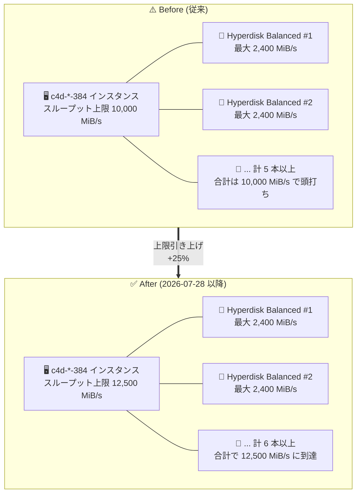

# Compute Engine: Hyperdisk Balanced の C4D インスタンス向け最大スループット上限を引き上げ

**リリース日**: 2026-07-28

**サービス**: Compute Engine (Hyperdisk Balanced)

**機能**: C4D インスタンスにアタッチした Hyperdisk Balanced の最大スループット上限の引き上げ

**ステータス**: Feature (一般提供 / 上限値の引き上げ)

📊 [このアップデートのインフォグラフィックを見る](https://takech9203.github.io/google-cloud-news-summary/20260728-compute-engine-hyperdisk-balanced-c4d-throughput.html)

## 概要

Google Cloud は 2026 年 7 月 28 日、Compute Engine の C4D マシンシリーズにアタッチした **Hyperdisk Balanced ボリュームの最大スループット上限を引き上げた**ことを発表しました。対象は大規模な 3 つのマシンタイプサイズ (96 / 192 / 384 vCPU) で、`c4d-*-96` が 2,800 MiB/s から 3,125 MiB/s、`c4d-*-192` が 4,800 MiB/s から 6,250 MiB/s、`c4d-*-384` が 10,000 MiB/s から 12,500 MiB/s になりました。

Hyperdisk Balanced は Google Cloud の汎用 Hyperdisk タイプであり、公式ドキュメントでは「ほとんどのワークロードに最適で、TCO の観点で価格とパフォーマンスの最良の組み合わせを提供する」と位置づけられています。C4D は第 5 世代 AMD EPYC Turin プロセッサと Titanium を採用した汎用マシンシリーズで、最大 384 vCPU / 3,024 GB DDR5 メモリをサポートし、**ブロックストレージとして Hyperdisk のみをサポートする** (Persistent Disk 非対応) 点が特徴です。つまり C4D 上で動くすべてのワークロードのストレージ性能は Hyperdisk の性能上限に直結するため、今回の上限引き上げは C4D 利用者にとって直接的な意味を持ちます。

重要な点として、これは**インスタンス側 (マシンタイプ側) の性能上限の引き上げ**であり、単一 Hyperdisk Balanced ボリュームあたりのプロビジョニング上限 (160,000 IOPS / 2,400 MiB/s) は変わっていません。したがって新しい上限値を実際に引き出すには、同一インスタンスに複数の Hyperdisk Balanced ボリュームをアタッチする必要があります。対象ユーザーは、C4D 上で大規模なデータベース、分析処理、バックアップ/リストア、大量データのロードなどスループット主導のワークロードを運用しているチームです。

**アップデート前の課題**

- `c4d-*-96` にアタッチした Hyperdisk Balanced のスループットはインスタンス側の上限 2,800 MiB/s で頭打ちになっていた
- `c4d-*-192` は 4,800 MiB/s、`c4d-*-384` は 10,000 MiB/s が上限で、vCPU 数を増やしてもストレージ帯域がそれに比例して伸びない領域があった
- ボリュームを追加してプロビジョニング済みスループットの合計を増やしても、インスタンス側の上限を超える分は消費できなかった (性能上限はインスタンスにアタッチされたすべての Hyperdisk Balanced ボリュームで共有される)

**アップデート後の改善**

- `c4d-*-96` は 3,125 MiB/s まで利用可能になり、従来比で約 +11.6% のスループット上限
- `c4d-*-192` は 6,250 MiB/s まで利用可能になり、従来比で約 +30.2% のスループット上限
- `c4d-*-384` は 12,500 MiB/s まで利用可能になり、従来比で +25% のスループット上限
- スループット律速のワークロードにおいて、インスタンスをより大きなマシンシリーズへ乗り換えたり Hyperdisk Extreme / Hyperdisk ML へ切り替えることなく、既存の C4D 構成のままボリューム追加で帯域を拡張できる余地が広がった

## アーキテクチャ図



インスタンス側のスループット上限が引き上げられたことで、同じ C4D マシンタイプに複数の Hyperdisk Balanced ボリュームをアタッチした際に消費できる合計帯域が増えます。単一ボリュームの上限 (2,400 MiB/s) は変わらないため、新上限を引き出すには複数ボリューム構成が前提になります。

## サービスアップデートの詳細

### 主要機能

1. **`c4d-*-96` のスループット上限: 2,800 → 3,125 MiB/s**
   - 96 vCPU の standard / highcpu / highmem すべてのバリアントが対象 (`c4d-*` はワイルドカード表記)
   - 最大 IOPS 上限は 160,000 のまま変更なし
   - 単一ボリューム上限 2,400 MiB/s を超えるため、3,125 MiB/s の到達には 2 本以上の Hyperdisk Balanced が必要

2. **`c4d-*-192` のスループット上限: 4,800 → 6,250 MiB/s**
   - 3 つのサイズ変更のうち、相対的な伸び幅が最も大きい (約 +30.2%)
   - 最大 IOPS 上限は 240,000 のまま変更なし
   - 6,250 MiB/s の到達には 3 本以上の Hyperdisk Balanced が必要

3. **`c4d-*-384` のスループット上限: 10,000 → 12,500 MiB/s**
   - C4D の最大構成 (384 vCPU) における絶対値の伸びが最大 (+2,500 MiB/s)
   - 最大 IOPS 上限は 320,000 のまま変更なし
   - 12,500 MiB/s の到達には 6 本以上の Hyperdisk Balanced が必要
   - **注意**: ベアメタルの `c4d-*-384-metal` は 10,000 MiB/s のままで、今回の引き上げ対象外

## 技術仕様

### Before / After スループット比較

| マシンタイプ | 最大 IOPS (変更なし) | 最大スループット (Before) | 最大スループット (After) | 増加量 | 増加率 |
|---|---|---|---|---|---|
| `c4d-*-96` | 160,000 | 2,800 MiB/s | **3,125 MiB/s** | +325 MiB/s | 約 +11.6% |
| `c4d-*-192` | 240,000 | 4,800 MiB/s | **6,250 MiB/s** | +1,450 MiB/s | 約 +30.2% |
| `c4d-*-384` | 320,000 | 10,000 MiB/s | **12,500 MiB/s** | +2,500 MiB/s | +25% |
| `c4d-*-384-metal` | 320,000 | 10,000 MiB/s | 10,000 MiB/s (変更なし) | — | — |

増加率は公式ドキュメント記載の前後値から算出した参考値です。

### C4D の Hyperdisk Balanced 性能上限 (全マシンタイプ・更新後の現行値)

| マシンタイプ | 最大 IOPS | 最大スループット (MiB/s) |
|---|---|---|
| `c4d-*-2` | 22,500 | 400 |
| `c4d-*-4` | 50,000 | 400 |
| `c4d-*-8` | 50,000 | 800 |
| `c4d-*-16` | 75,000 | 1,200 |
| `c4d-*-32` | 75,000 | 1,600 |
| `c4d-*-48` | 75,000 | 1,600 |
| `c4d-*-64` | 160,000 | 2,400 |
| `c4d-*-96` | 160,000 | 3,125 |
| `c4d-*-192` | 240,000 | 6,250 |
| `c4d-*-384` | 320,000 | 12,500 |
| `c4d-*-384-metal` | 320,000 | 10,000 |

2 vCPU から 48 vCPU までのマシンタイプ、および 64 vCPU、ベアメタルの値は今回変更されていません。

### 新上限に到達するために必要なボリューム本数

単一 Hyperdisk Balanced ボリュームの上限は 2,400 MiB/s であるため、インスタンス上限に到達するには複数ボリュームが必要です。以下は公式に記載された 2 つの上限値 (インスタンス上限と単一ボリューム上限 2,400 MiB/s) から算出した最小本数です。

| マシンタイプ | インスタンス上限 | 必要な最小ボリューム本数 (計算値) | アタッチ可能な Hyperdisk Balanced 本数の上限 |
|---|---|---|---|
| `c4d-*-96` | 3,125 MiB/s | 2 本 (3,125 ÷ 2,400 = 1.30) | 32 |
| `c4d-*-192` | 6,250 MiB/s | 3 本 (6,250 ÷ 2,400 = 2.61) | 64 |
| `c4d-*-384` | 12,500 MiB/s | 6 本 (12,500 ÷ 2,400 = 5.21) | 128 |

アタッチ可能本数の上限は十分に余裕があるため、ボリューム本数がボトルネックになることは通常ありません。

### Hyperdisk Balanced のプロビジョニング上限とスループット計算式

| 項目 | 詳細 |
|---|---|
| ボリュームサイズ | 4 GiB 〜 64 TiB (デフォルト 100 GiB) |
| プロビジョニング可能 IOPS | 3,000 〜 160,000 (320 GiB 未満はサイズ依存) |
| プロビジョニング可能スループット | 140 〜 2,400 MiB/s |
| 最小スループット | MAX(140, P/256) MiB/s (P = プロビジョニング IOPS) |
| 最大スループット | MIN(2,400, P/4) MiB/s |
| ベースライン (無償枠) | 3,000 IOPS + 140 MiB/s (ボリュームごと) |
| 最大 IOPS 到達条件 | I/O サイズ 4 KB |
| 最大スループット到達条件 | I/O サイズ 256 KB 以上 |
| 性能の方向性 | 半二重 (read と write で IOPS / スループットを共有) |
| 性能変更の頻度制限 | プロビジョニング性能は 4 時間に 1 回まで、サイズは 4 時間に 2 回まで |
| 耐久性 (設計値) | 99.999% 超 |
| 対応ディスクインターフェイス (C4D) | NVMe のみ |

上記の計算式から、1 本のボリュームで 2,400 MiB/s を出すには **9,600 IOPS 以上のプロビジョニングが必要** (2,400 = P/4 → P = 9,600) です。たとえば `c4d-*-384` で 12,500 MiB/s を狙う場合、6 本 × 9,600 = 57,600 IOPS 相当となり、インスタンスの IOPS 上限 320,000 に対して十分な余裕があります。

### インスタンスあたりの Hyperdisk 共通制限

| 項目 | 詳細 |
|---|---|
| ディスク総数 (全タイプ合計) | 128 |
| Hyperdisk Balanced 本数 (`c4d-*-96`) | 32 |
| Hyperdisk Balanced 本数 (`c4d-*-192`) | 64 |
| Hyperdisk Balanced 本数 (`c4d-*-384`) | 128 |
| Hyperdisk Balanced 本数 (`c4d-*-384-metal`) | 32 |
| 総容量上限 (32 vCPU 以上) | 512 TiB |

## 設定方法

### 前提条件

1. 対象マシンタイプ (`c4d-*-96`、`c4d-*-192`、`c4d-*-384`) の C4D インスタンスが存在する、または作成できること
2. Hyperdisk Balanced ボリュームのプロビジョニング IOPS / スループットのクォータに余裕があること (ベースラインの 3,000 IOPS と 140 MiB/s はクォータを消費しません)
3. C4D が利用可能なリージョンであること

### 手順

#### ステップ 1: 高スループットの Hyperdisk Balanced ボリュームを作成する

```bash
# 単一ボリューム上限の 2,400 MiB/s をプロビジョニング
# 2,400 MiB/s には 9,600 IOPS 以上が必要 (最大スループット = MIN(2,400, IOPS/4))
for i in 1 2 3 4 5 6; do
  gcloud compute disks create hd-bal-data-${i} \
    --type=hyperdisk-balanced \
    --size=1000GB \
    --provisioned-iops=20000 \
    --provisioned-throughput=2400 \
    --zone=us-central1-a
done
```

`c4d-*-384` で 12,500 MiB/s を狙う場合、6 本以上のボリュームが必要です。

#### ステップ 2: 複数ボリュームを C4D インスタンスにアタッチする

```bash
for i in 1 2 3 4 5 6; do
  gcloud compute instances attach-disk my-c4d-instance \
    --disk=hd-bal-data-${i} \
    --zone=us-central1-a
done
```

C4D は NVMe インターフェイスのみをサポートします。OS 側では複数の NVMe デバイスとして見えるため、LVM やソフトウェア RAID 0 でストライピングし、単一のファイルシステムとして帯域を集約するのが一般的な構成です。

#### ステップ 3: 既存ボリュームのプロビジョニング性能を引き上げる

```bash
# 既存ボリュームの IOPS / スループットを変更
gcloud compute disks update hd-bal-data-1 \
  --provisioned-iops=20000 \
  --provisioned-throughput=2400 \
  --zone=us-central1-a
```

プロビジョニング性能の変更は 4 時間に 1 回までという制限があります。REST API を使う場合は `compute.disks.update` メソッドに対して `provisionedIops` / `provisionedThroughput` を含む PATCH リクエストを送信します。

```json
{
  "sizeGb": "1000",
  "provisionedIops": "20000",
  "provisionedThroughput": "2400"
}
```

#### ステップ 4: 実効スループットを検証する

最大スループット上限に到達するには I/O サイズが 256 KB 以上である必要があります。ベンチマーク時は I/O サイズの設定を確認してください。IOPS 上限の測定には 4 KB の I/O サイズを使用します。

## メリット

### ビジネス面

- **スケールアップの継続性**: スループット律速のワークロードで上限に達していた場合、より高価な Hyperdisk Extreme や別マシンシリーズへの移行を検討せずに、既存の C4D + Hyperdisk Balanced 構成のまま帯域を拡張できる可能性がある
- **処理時間の短縮**: バッチ処理、バックアップ/リストア、大量データロードなど帯域が支配的な処理で、上限引き上げ分に応じた所要時間の短縮が期待できる
- **設定変更のみで恩恵**: インスタンスの再作成やマシンタイプの変更は不要で、ボリューム追加やプロビジョニング値の引き上げで対応できる

### 技術面

- **vCPU 数とストレージ帯域のバランス改善**: 特に `c4d-*-192` で約 +30.2%、`c4d-*-384` で +25% の上限引き上げにより、大規模マシンタイプにおける vCPU あたりのストレージ帯域が改善
- **IOPS 上限は据え置きだがスループット側に余裕**: `c4d-*-384` の 320,000 IOPS 上限に対し、12,500 MiB/s を 6 本構成で満たすのに必要な IOPS は 57,600 相当のため、IOPS とスループットを両立させやすい
- **ベースライン無償枠の活用**: ボリューム 1 本ごとに 3,000 IOPS と 140 MiB/s が無償のベースラインとして含まれるため、複数ボリューム構成では無償枠の合計も増える

## デメリット・制約事項

### 制限事項

- **単一ボリュームでは新上限に到達できない**: Hyperdisk Balanced 単一ボリュームの上限は 160,000 IOPS / 2,400 MiB/s のままであり、新しいインスタンス上限を引き出すには複数ボリュームのアタッチが必須
- **`c4d-*-384-metal` は対象外**: ベアメタルマシンタイプのスループット上限は 10,000 MiB/s で変更されていない
- **64 vCPU 以下は対象外**: `c4d-*-64` (2,400 MiB/s) 以下のマシンタイプの上限は変更されていない
- **性能上限はインスタンス内で共有**: 性能上限はアタッチされたすべての Hyperdisk Balanced ボリュームで共有され、各ボリュームのプロビジョニング値の合計がインスタンス上限を超えても、実際に消費できるのはインスタンス上限まで
- **半二重**: IOPS / スループットは read と write の合計に対する上限
- **性能変更の頻度制限**: プロビジョニング性能の変更は 4 時間に 1 回まで、サイズ変更は 4 時間に 2 回まで
- **CUD / SUD の対象外**: Hyperdisk ボリュームはリソースベース確約利用割引 (CUD) および継続利用割引 (SUD) の対象外。Spot VM でも Hyperdisk の割引価格はない

### 考慮すべき点

- **I/O サイズの確認**: 最大スループットには 256 KB 以上の I/O サイズが必要。アプリケーションの I/O サイズが小さい場合、上限引き上げの効果を体感できない可能性がある
- **プロビジョニングは自動では増えない**: 上限が引き上げられても、既存ボリュームのプロビジョニング値が自動で増えるわけではない。恩恵を受けるには明示的にボリュームを追加するかプロビジョニング値を引き上げる必要がある
- **課金への影響**: ベースライン (3,000 IOPS / 140 MiB/s) を超えるプロビジョニング分は課金対象。スループットを引き上げる場合は追加コストが発生する
- **ボリューム集約の運用コスト**: LVM / RAID 0 でストライピングする構成では、スナップショットや障害時のリストア手順が単一ボリューム構成より複雑になる
- **他のボトルネック**: ネットワーク帯域や CPU がボトルネックになるケースもあるため、ストレージ帯域の引き上げ単独では性能が改善しない場合がある

## ユースケース

### ユースケース 1: C4D 上の大規模リレーショナルデータベース

**シナリオ**: `c4d-highmem-192` 上でセルフマネージドの PostgreSQL / MySQL を運用しており、大規模なテーブルスキャンやバルクロード、WAL/binlog の書き出しでストレージ帯域が 4,800 MiB/s に張り付いていた。

**実装例**:
```bash
# 3 本以上のボリュームで 6,250 MiB/s の新上限に到達させる
for i in 1 2 3; do
  gcloud compute disks create pg-data-${i} \
    --type=hyperdisk-balanced --size=4TB \
    --provisioned-iops=40000 --provisioned-throughput=2400 \
    --zone=us-central1-a
  gcloud compute instances attach-disk pg-primary \
    --disk=pg-data-${i} --zone=us-central1-a
done
# ゲスト OS 側で 3 本を LVM ストライプ化してデータディレクトリに割り当てる
```

**効果**: インスタンス側の帯域上限が 4,800 MiB/s から 6,250 MiB/s になったことで、スキャン主体のクエリやバルクロードのスループットを最大で約 30% 拡張できる余地が生まれる。

### ユースケース 2: 384 vCPU 構成での分析・ETL 処理

**シナリオ**: `c4d-standard-384` 上で大量の中間データを書き出す ETL / 分析ジョブを実行しており、10,000 MiB/s のストレージ帯域上限が処理時間を決めていた。

**効果**: 上限が 12,500 MiB/s になり、6 本以上の Hyperdisk Balanced 構成で +25% の帯域を利用できる。ジョブが完全に帯域律速であれば、それに応じた処理時間の短縮が期待できる。384 vCPU では Hyperdisk Balanced を最大 128 本までアタッチできるため、本数上限が制約になることはない。

### ユースケース 3: Hyperdisk Extreme からの構成見直し

**シナリオ**: これまで C4D で高スループットを確保するために Hyperdisk Extreme を併用していた。

**効果**: Hyperdisk Balanced 側の上限が引き上げられたことで、要求スループットが新上限の範囲内に収まるワークロードについては、Hyperdisk Balanced のみの構成を再検討できる。なお `c4d-*-64` 以上では Hyperdisk Extreme を最大 8 本アタッチできるため、より高い IOPS が必要な場合は引き続き併用が選択肢となる。

## 料金

今回のアップデートは**性能上限の引き上げであり、料金体系自体の変更ではありません**。ただし、新しい上限を活用するためにボリュームを追加したりプロビジョニング値を引き上げた場合は、その分の課金が発生します。

Hyperdisk Balanced の課金は以下の 3 要素で構成されます (公式ドキュメントに基づく)。

| 課金要素 | 課金単位 | 備考 |
|---|---|---|
| プロビジョニング済み容量 | GiB / 月 | ボリュームを削除するまで課金。インスタンスにアタッチしていない場合、インスタンスが停止/一時停止中の場合も課金される |
| プロビジョニング済み IOPS | IOPS / 月 | ベースライン 3,000 IOPS を超える分のみが課金対象 |
| プロビジョニング済みスループット | MiB/s / 月 | ベースライン 140 MiB/s を超える分のみが課金対象 |

- ベースライン (3,000 IOPS + 140 MiB/s) はボリュームごとに無償で含まれます。たとえば 5,000 IOPS をプロビジョニングした場合、課金対象は 2,000 IOPS です。
- ベースラインは Standard performance / Standard capacity / Advanced capacity の Hyperdisk Storage Pools 内のボリュームにも含まれますが、**Advanced performance の Hyperdisk Storage Pools 内のボリュームには含まれません**。
- Hyperdisk Balanced High Availability はデータを 2 箇所に書き込むため、ストレージコストは Hyperdisk Balanced の 2 倍です。
- Hyperdisk はリソースベース CUD および SUD の対象外です。

リージョンごとの具体的な単価は、下記の「[料金ページ](https://cloud.google.com/compute/disks-image-pricing#disk)」を参照してください (本レポートでは公式単価を確認できなかったため、具体的な金額の記載は割愛します)。

## 利用可能リージョン

今回の上限引き上げは対象マシンタイプの性能仕様の変更であり、公式リリースノートではリージョン限定の記載はありません。前提として C4D マシンシリーズが利用できるリージョンが必要です。

2026 年 7 月時点で C4D が提供されているリージョンは以下の 17 リージョンです (公式の「リージョンとゾーン」ドキュメントより)。

| 地域 | リージョン |
|---|---|
| 北米 | `us-central1`, `us-east1`, `us-east4`, `us-east5`, `us-west1`, `us-west4`, `northamerica-northeast1` |
| ヨーロッパ | `europe-west1`, `europe-west2`, `europe-west3`, `europe-west4`, `europe-west9` |
| アジア太平洋 | `asia-northeast1` (東京), `asia-south1`, `asia-southeast1`, `australia-southeast1` |
| アフリカ | `africa-south1` |

マシンタイプごとの提供状況はゾーン単位で異なる場合があるため、実際の利用前に対象ゾーンでの可用性を確認してください。

## 関連サービス・機能

- **C4D マシンシリーズ**: 第 5 世代 AMD EPYC Turin + Titanium 構成の汎用マシンシリーズ。最大 384 vCPU / 3,024 GB DDR5、最大 12 TiB のローカル Titanium SSD (`-lssd` バリアント)、Tier_1 ネットワーキングで最大 200 Gbps。ブロックストレージは Hyperdisk のみ対応で Persistent Disk 非対応
- **Hyperdisk Balanced High Availability**: リージョン (2 ゾーン) レプリケーション対応の Hyperdisk。C4D の `c4d-*-96` / `c4d-*-192` / `c4d-*-384` については、同ドキュメントの性能上限表でも 3,125 / 6,250 / 12,500 MiB/s と同じ値が示されている。単一ボリューム上限は 100,000 IOPS / 2,400 MiB/s
- **Hyperdisk Extreme**: IOPS 重視のワークロード向け。単一ボリュームで最大 350,000 IOPS。C4D では `c4d-*-64` 以上で最大 8 本アタッチ可能
- **Hyperdisk ML**: 読み取り主体の ML ワークロード向け。複数 VM からの同時アタッチに追加料金が不要
- **Hyperdisk Storage Pools**: 複数ボリュームで容量と性能をプールして共有・管理する仕組み。Advanced performance プール内のボリュームはベースライン性能が含まれない点に注意
- **Local Titanium SSD**: C4D の `-lssd` マシンタイプで自動的にアタッチされるローカルストレージ。最大 12 TiB
- **GKE (Compute Engine Persistent Disk CSI Driver)**: `hyperdisk-balanced` を StorageClass の `type` に指定して GKE から利用可能。`use-allowed-disk-topology: "true"` パラメータで Hyperdisk 対応ノードへの自動スケジューリングが可能 (クラスタ / ノードプールが 1.34.1-gke.2541000 以降)

## 参考リンク

- 📊 [インフォグラフィック](https://takech9203.github.io/google-cloud-news-summary/20260728-compute-engine-hyperdisk-balanced-c4d-throughput.html)
- [公式リリースノート (Compute Engine)](https://cloud.google.com/compute/docs/release-notes)
- [Hyperdisk Balanced について](https://docs.cloud.google.com/compute/docs/disks/hd-types/hyperdisk-balanced)
- [インスタンスにアタッチした際の Hyperdisk Balanced 性能上限](https://docs.cloud.google.com/compute/docs/disks/hd-types/hyperdisk-balanced#perf-limits)
- [Hyperdisk の性能上限 (全タイプ)](https://docs.cloud.google.com/compute/docs/disks/hyperdisk-perf-limits)
- [汎用マシンファミリー (C4D マシンシリーズ)](https://docs.cloud.google.com/compute/docs/general-purpose-machines#c4d_series)
- [Hyperdisk ボリュームのサイズとプロビジョニング性能の変更](https://docs.cloud.google.com/compute/docs/disks/modify-hyperdisks)
- [Hyperdisk について (料金・耐久性)](https://docs.cloud.google.com/compute/docs/disks/hyperdisks)
- [リージョンとゾーン](https://docs.cloud.google.com/compute/docs/regions-zones/regions-zones)
- [料金ページ (ディスクとイメージ)](https://cloud.google.com/compute/disks-image-pricing#disk)

## まとめ

C4D の大規模マシンタイプ (96 / 192 / 384 vCPU) における Hyperdisk Balanced のスループット上限が最大 +30% 引き上げられ、`c4d-*-384` では 12,500 MiB/s まで利用できるようになりました。C4D は Hyperdisk のみをサポートするマシンシリーズであるため、スループット律速のデータベースや分析ワークロードを C4D で運用しているチームにとっては、マシンシリーズ変更やより高価なディスクタイプへの移行を伴わずに性能余地を確保できる実利のあるアップデートです。

一方で、新上限は自動的に適用されるわけではなく、単一ボリューム上限 (2,400 MiB/s) の制約から複数ボリューム構成が前提となります。まず Cloud Monitoring でディスクスループットが従来上限に張り付いていないかを確認し、該当する場合はボリューム追加とプロビジョニング値の見直し、そして 256 KB 以上の I/O サイズが出ているかの検証を進めることを推奨します。

---

**タグ**: Compute Engine, Hyperdisk, Hyperdisk Balanced, C4D, ストレージ, スループット, パフォーマンス, AMD EPYC Turin, Titanium, ブロックストレージ
