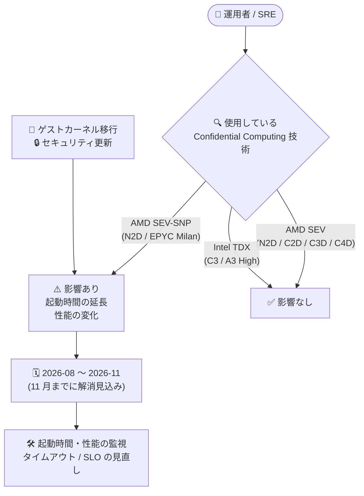

# Confidential VM: AMD SEV-SNP インスタンスの起動時間延長・性能変化に関する既知の問題 (2026 年 8 月〜11 月)

**リリース日**: 2026-07-28

**サービス**: Confidential VM (Confidential Computing)

**機能**: AMD SEV-SNP を使用する Confidential VM インスタンスの起動時間・性能に関する既知の問題 (Known Issue)

**ステータス**: Issue (既知の問題) / 影響期間: 2026 年 8 月 〜 2026 年 11 月 (解消見込み)

📊 [このアップデートのインフォグラフィックを見る](https://takech9203.github.io/google-cloud-news-summary/20260728-confidential-vm-sev-snp-boot-performance-issue.html)

## 概要

Google Cloud は 2026 年 7 月 28 日、Confidential VM に関する既知の問題 (Issue) を公開しました。**2026 年 8 月以降、AMD SEV-SNP を使用する Confidential VM インスタンスにおいて、起動時間の延長および性能の変化が発生する可能性がある**という内容です。原因は「ゲストカーネルの移行 (guest kernel migration)」と「セキュリティ更新 (security updates)」であり、本問題は **2026 年 11 月までに解消される見込み**とされています。

重要な点として、影響を受けるのは **AMD SEV-SNP** を使用するインスタンスのみです。**AMD SEV および Intel TDX を使用する Confidential VM インスタンスは影響を受けません**。AMD SEV-SNP は現在、N2D マシンタイプ (AMD EPYC Milan CPU プラットフォーム) でのみサポートされているため、影響範囲は N2D + SEV-SNP という比較的限定的な構成に絞られます。

これは新機能の発表ではなく**運用上のアドバイザリ (注意喚起)** です。したがって、対象構成を本番運用している場合は、機能変更への対応ではなく「起動時間に依存した運用設計の見直し」と「性能ベースラインの再確認」が求められます。特に、オートスケーリングのヘルスチェック猶予期間、デプロイパイプラインのタイムアウト設定、起動時間を前提とした SLO/SLA の妥当性を、影響期間の開始前に点検しておくことが推奨されます。なお、本問題は公式ドキュメントの「Supported configurations」の AMD SEV-SNP の Limitations にも「2026 年 8 月から 11 月の間、ゲストカーネル移行とセキュリティ更新により起動時間の延長と性能変化が発生する可能性がある」として恒久的に記載されています。

**告知の背景 (これまでの経緯)**

- AMD SEV-SNP を使用する Confidential VM は、2024 年 6 月 18 日に N2D マシンタイプ (AMD EPYC Milan) で GA となっている
- Confidential VM には従来から「起動時間はインスタンスに割り当てられたメモリ量に比例し、大容量メモリのインスタンスでは起動時間が長くなる場合がある」という一般的な制限が文書化されている
- 過去にも AMD SEV-SNP に関するセキュリティ修正が性能に影響した事例が公式に告知されている (2025 年 2 月 18 日にリリースされた N2D + SEV-SNP 向けセキュリティ修正について、ワークロード次第で性能低下が生じる可能性があると 2025 年 3 月 25 日に告知)
- 2026 年 4 月 14 日にも AMD SEV-SNP 関連の脆弱性 (GCP-2026-021 / CVE-2023-20585 など) への緩和策が Google 側で適用されている

**今回告知された影響**

- 2026 年 8 月以降、AMD SEV-SNP インスタンスで**起動時間が長くなる**可能性がある
- 2026 年 8 月以降、AMD SEV-SNP インスタンスで**性能の変化 (performance changes)** が生じる可能性がある
- 原因は**ゲストカーネルの移行**および**セキュリティ更新**
- **2026 年 11 月までに解消される見込み**
- AMD SEV および Intel TDX を使用するインスタンスは**影響を受けない**

## アーキテクチャ図



使用している Confidential Computing 技術によって影響有無が決まることを示した判定フローです。AMD SEV-SNP のみが対象で、影響は 2026 年 8 月から 11 月までの期間に限定される見込みです。

## サービスアップデートの詳細

### 告知内容のポイント

1. **影響を受ける構成は AMD SEV-SNP のみ**
   - AMD SEV-SNP は N2D マシンタイプ + AMD EPYC Milan CPU プラットフォームでのみサポートされる
   - したがって、影響対象は「N2D で SEV-SNP を有効化した Confidential VM インスタンス」に限定される
   - 同じ N2D 上でも AMD SEV を選択しているインスタンスは影響を受けない

2. **2 種類の症状 (起動時間・性能)**
   - **起動時間の延長**: インスタンス起動 (boot) に要する時間が長くなる可能性がある
   - **性能の変化**: 実行時の性能に変化が生じる可能性がある。公式告知では "performance changes" とされ、影響の程度や具体的な数値は示されていない

3. **原因はゲストカーネル移行とセキュリティ更新**
   - ゲストカーネルの移行 (guest kernel migration) とセキュリティ更新に起因する
   - Google 側で実施される変更であり、リリースノートおよびドキュメントには利用者側で実施すべき回避策 (workaround) は記載されていない

4. **期間限定の問題として告知**
   - 開始: 2026 年 8 月
   - 解消見込み: 2026 年 11 月まで
   - 公式ドキュメントの Limitations にも「between August 2026 and November 2026」と期間が明記されている

## 技術仕様

### 影響範囲マトリクス

| Confidential Computing 技術 | 対象マシンタイプ | CPU プラットフォーム | 本問題の影響 |
|------|------|------|------|
| AMD SEV-SNP | N2D | AMD EPYC Milan | ⚠️ **影響あり** (起動時間延長 / 性能変化) |
| AMD SEV | N2D, C2D, C3D, C4D | AMD EPYC Milan / Genoa / Turin | ✅ 影響なし |
| Intel TDX | c3-standard-*, c3-standard-*-lssd (Preview), a3-highgpu-1g | Intel Sapphire Rapids | ✅ 影響なし |
| NVIDIA Confidential Computing | a3-highgpu-1g, g4-standard-48 (Preview) | Intel Sapphire Rapids / AMD EPYC Turin | ✅ 影響なし (CPU 側は SEV または TDX と統合) |

### タイムライン

| 時期 | 内容 |
|------|------|
| 2026-07-28 | 既知の問題として Google Cloud リリースノートに掲載 |
| 2026-08 | 影響の開始 (ゲストカーネル移行およびセキュリティ更新に伴う) |
| 2026-11 | 解消見込み |

### AMD SEV-SNP に関する既存の制限事項 (影響評価時に併せて確認すべき項目)

| 制限事項 | 詳細 |
|------|------|
| 予約 (Reservations) 非対応 | AMD SEV-SNP の Confidential VM インスタンスは Compute Engine の予約をサポートしない |
| kdump 非対応 | カーネルダンプが利用できないため、ゲストコンソールログを使用する |
| vNIC キュー数の上限 | N2D + SEV-SNP の最大 vNIC キュー数は 8 |
| Debian 12 のアテステーション | `/dev/sev-guest` パッケージ欠如により Debian 12 では SEV-SNP のアテステーションがサポートされない |
| 起動時間とメモリ量 | Confidential VM 全般の制限として、起動時間は割り当てメモリ量に比例する (大容量メモリインスタンスでは起動が遅くなる) |
| SSH 接続 | Confidential VM インスタンスは非 Confidential VM より SSH 接続確立に時間がかかる |
| ライブマイグレーション | ライブマイグレーションは AMD SEV を実行する N2D および C3D でのみサポート (SEV-SNP は非対応) |

## 確認方法

### 自分の環境が影響を受けるかの確認

#### ステップ 1: SEV-SNP を使用しているインスタンスを洗い出す

```bash
# Confidential Computing の設定を含めてインスタンス一覧を確認する
gcloud compute instances list \
  --format="table(name,zone,machineType.basename(),confidentialInstanceConfig)"

# 特定インスタンスの Confidential Computing 技術を確認する
gcloud compute instances describe INSTANCE_NAME \
  --zone=ZONE \
  --format="value(confidentialInstanceConfig)"
```

`confidentialInstanceConfig` の `confidentialInstanceType` が `SEV_SNP` になっているインスタンスが本問題の対象です。`SEV` または `TDX` の場合は影響を受けません。

#### ステップ 2: SEV-SNP がサポートされるゾーンで稼働しているか確認する

AMD SEV-SNP がサポートされるゾーンは限定されています (「利用可能リージョン」セクション参照)。これらのゾーンで N2D インスタンスを運用している場合は、対象の可能性が高くなります。

#### ステップ 3: 起動イベントと起動時間を監視する

```bash
# インテグリティ検証イベント (起動時のアテステーションレポート) を確認する
gcloud logging read \
  'logName:"compute.googleapis.com%2Fshielded_vm_integrity"
   AND resource.labels.instance_id="INSTANCE_ID"' \
  --limit=20 \
  --format="value(timestamp,jsonPayload.bootCounter)"
```

Confidential VM ではインテグリティモニタリングがデフォルトで有効になっており、Cloud Logging と Cloud Monitoring で起動時のインテグリティ検証イベントを確認できます。影響期間の前後で起動完了までの所要時間を比較するためのベースラインとして活用できます。

#### ステップ 4: 起動時の詳細をシリアルコンソールログで確認する

```bash
# シリアルポート出力を取得して起動シーケンスの所要時間を確認する
gcloud compute instances get-serial-port-output INSTANCE_NAME \
  --zone=ZONE
```

SEV-SNP では `kdump` が利用できないため、起動に関する調査はゲストコンソール (シリアルポート) のログを使用します。

## 影響と対応の考え方

### 運用面での影響

- **オートスケーリングの応答性**: 起動時間が延びると、マネージドインスタンスグループ (MIG) のスケールアウトが完了するまでの時間が長くなり、急激な負荷増加への追従が遅れる可能性がある
- **ヘルスチェックによる誤検知**: 起動完了前にヘルスチェックが失敗と判定されると、インスタンスの再作成ループを招く可能性がある
- **デプロイ・CI/CD のタイムアウト**: インスタンス作成やローリングアップデートにタイムアウトを設定している場合、想定超過で失敗する可能性がある
- **性能ベースラインの変動**: 性能の変化により、既存のキャパシティプランニングやベンチマーク結果との乖離が生じる可能性がある
- **予約でのキャパシティ確保が不可**: SEV-SNP は予約に非対応のため、起動遅延を見込んだインスタンスの事前確保という手段は取れない

### 考慮すべき点

- 公式告知では影響の**程度 (どの程度遅くなるか、性能が何 % 変化するか) は示されていない**ため、自環境での実測によるベースライン取得が唯一の定量把握手段となる
- 公式には利用者側の回避策が示されていない。Google 側の対応により 2026 年 11 月までに解消される見込みとされているため、基本方針は「監視と運用パラメータの余裕確保」となる
- 「性能変化 (performance changes)」は必ずしも低下のみを意味する表現ではないが、公式に方向性が明示されていないため、悪化する前提で余裕を持った設計としておくのが安全側の判断となる
- Confidential VM 全般の制限として起動時間はメモリ量に比例するため、大容量メモリの SEV-SNP インスタンスでは影響がより顕在化しやすい点を考慮する
- ハードウェアベースのアテステーション (AMD Secure Processor による起動時測定) を要件としているワークロードでは、SEV から SEV-SNP への代替が容易でない場合がある。技術選択の変更を検討する際はセキュリティ要件との整合を確認する必要がある

## ユースケース (影響が想定されるシナリオ)

### シナリオ 1: SEV-SNP ベースの MIG でオートスケーリングを運用している

**状況**: N2D + AMD SEV-SNP の Confidential VM をマネージドインスタンスグループで運用し、負荷に応じたスケールアウトを行っている。ヘルスチェックの初期遅延 (initial delay) は現行の起動時間に合わせてタイトに設定している。

**対応の方向性**:
```
1. 影響期間前に現行の起動完了までの所要時間を実測しベースライン化する
   (Cloud Logging のインテグリティ検証イベント / シリアルコンソールログ)
2. ヘルスチェックの初期遅延・オートヒーリングの猶予期間に余裕を持たせる
3. スケールアウトのトリガー閾値を前倒しし、起動遅延を吸収できるようにする
4. 2026 年 8 月以降、起動時間の推移を継続監視する
```

**効果**: 起動時間が延びた場合でも、ヘルスチェック失敗によるインスタンス再作成ループやスケールアウト遅延による容量不足を回避できる。

### シナリオ 2: アテステーション要件を満たす必要がある機密ワークロード

**状況**: ハードウェアアテステーション (AMD Secure Processor が署名する ATTESTATION_REPORT) を要件として SEV-SNP を選定しており、性能変化の影響を評価したい。

**対応の方向性**: 影響期間の前に代表的なワークロードのベンチマークを取得し、期間中に再測定して差分を把握する。要件上 SEV-SNP からの変更が難しい場合は、性能変化を織り込んだキャパシティの余裕確保と、ステークホルダーへの事前共有を行う。同等のハードウェアアテステーションを求める場合の選択肢としては Intel TDX (C3 マシンシリーズ) があり、こちらは本問題の影響を受けない。

**効果**: 性能変化を定量的に把握でき、影響期間中の SLO 違反リスクを事前に管理できる。

## 料金

本問題は既知の問題の告知であり、**料金体系の変更はありません**。Confidential VM は Compute Engine の料金に加えて、vCPU 単位およびメモリ (GiB) 単位の追加料金が発生します。AMD SEV-SNP (N2D マシンシリーズ) の追加料金は以下のとおりです。

| 項目 | オンデマンド価格 | Spot 価格 |
|------|-----------------|-----------|
| vCPU | $0.0027502 / 1 時間 | $0.000436 / 1 時間 |
| メモリ | $0.0003686 / 1 GiB 時間 | $0.0000584 / 1 GiB 時間 |

### 料金例 (Confidential VM の追加料金分のみ、730 時間/月・オンデマンド)

| 構成 | 月額料金 (概算) |
|--------|-----------------|
| n2d-standard-8 相当 (8 vCPU / 32 GiB) | 約 $24.67 |
| n2d-standard-16 相当 (16 vCPU / 64 GiB) | 約 $49.34 |

上記は Confidential VM の追加料金のみで、Compute Engine のインスタンス料金・ディスク・ネットワークは別途必要です。Confidential VM の利用は、基盤となる Compute Engine サービスに適用される契約割引には影響しません。

参考として、他の技術のオンデマンド追加料金は AMD SEV が vCPU $0.005479/時間・メモリ $0.0007342/GiB 時間、Intel TDX が vCPU $0.0033982/時間・メモリ $0.0004555/GiB 時間です。

## 利用可能リージョン

AMD SEV-SNP は N2D マシンタイプ + AMD EPYC Milan CPU プラットフォームで、以下のゾーンでサポートされています。本問題の影響範囲もこれらのゾーンで稼働する SEV-SNP インスタンスに限られます。

| リージョン | ゾーン |
|------|------|
| asia-southeast1 (シンガポール) | asia-southeast1-a, -b, -c |
| europe-west3 (フランクフルト) | europe-west3-a, -b, -c |
| europe-west4 (オランダ) | europe-west4-a, -b, -c |
| us-central1 (アイオワ) | us-central1-a, -b, -c |

## 関連サービス・機能

- **Compute Engine**: Confidential VM は Compute Engine の VM インスタンスの一種。マシンタイプ (N2D) とオートスケーリング (MIG)、ヘルスチェックの設定が本問題の運用影響に直結する
- **Cloud Monitoring / Cloud Logging**: Confidential VM ではインテグリティモニタリングがデフォルト有効。起動時のインテグリティ検証イベントの確認とアラート設定に使用し、起動時間の推移把握に活用できる
- **Shielded VM (vTPM / Secure Boot / インテグリティモニタリング)**: SEV-SNP では、起動時測定を AMD Secure Processor が担い、ブートローダー・カーネル・ユーザー空間の測定は Shielded VM の vTPM (PCR) に記録される
- **Intel TDX (C3 マシンシリーズ)**: 本問題の影響を受けないハードウェアアテステーション対応の代替技術
- **AMD SEV (N2D / C2D / C3D / C4D)**: 本問題の影響を受けない。N2D および C3D ではライブマイグレーションにも対応
- **Confidential Space**: Confidential VM を基盤とするマルチパーティ演算向けサービス。SEV-SNP を基盤に利用している場合は同様の影響評価が必要

## 参考リンク

- 📊 [インフォグラフィック](https://takech9203.github.io/google-cloud-news-summary/20260728-confidential-vm-sev-snp-boot-performance-issue.html)
- [公式リリースノート (Google Cloud)](https://cloud.google.com/release-notes#July_28_2026)
- [Confidential VM リリースノート](https://cloud.google.com/confidential-computing/confidential-vm/docs/release-notes#July_28_2026)
- [Supported configurations (Limitations に本問題が記載)](https://cloud.google.com/confidential-computing/confidential-vm/docs/supported-configurations#limitations)
- [Confidential VM overview (AMD SEV-SNP の説明)](https://cloud.google.com/confidential-computing/confidential-vm/docs/confidential-vm-overview#amd_sev-snp)
- [Attestation overview](https://cloud.google.com/confidential-computing/confidential-vm/docs/attestation-overview)
- [Monitor integrity (インテグリティレポートの確認方法)](https://cloud.google.com/confidential-computing/confidential-vm/docs/monitor-integrity)
- [Confidential VM security bulletins](https://cloud.google.com/confidential-computing/confidential-vm/docs/security-bulletins)
- [Get support (サポート窓口)](https://cloud.google.com/confidential-computing/confidential-vm/docs/get-support)
- [料金ページ (Confidential VM pricing)](https://cloud.google.com/confidential-computing/confidential-vm/pricing)

## まとめ

2026 年 8 月から 11 月にかけて、AMD SEV-SNP を使用する Confidential VM (N2D + AMD EPYC Milan) で起動時間の延長と性能変化が発生する可能性があるという運用上のアドバイザリです。影響は SEV-SNP に限定され、AMD SEV および Intel TDX を使用するインスタンスは対象外であるため、まずは `confidentialInstanceType` が `SEV_SNP` のインスタンスを洗い出して影響範囲を確定させることが第一歩となります。公式に利用者側の回避策は示されておらず Google 側の対応により解消される見込みであるため、影響期間の開始前に起動時間と性能のベースラインを取得し、ヘルスチェックの猶予期間・デプロイのタイムアウト・オートスケーリング閾値に余裕を持たせておくことを推奨します。

---

**タグ**: #ConfidentialVM #ConfidentialComputing #AMDSEVSNP #ComputeEngine #N2D #KnownIssue #既知の問題 #セキュリティ #運用アドバイザリ
