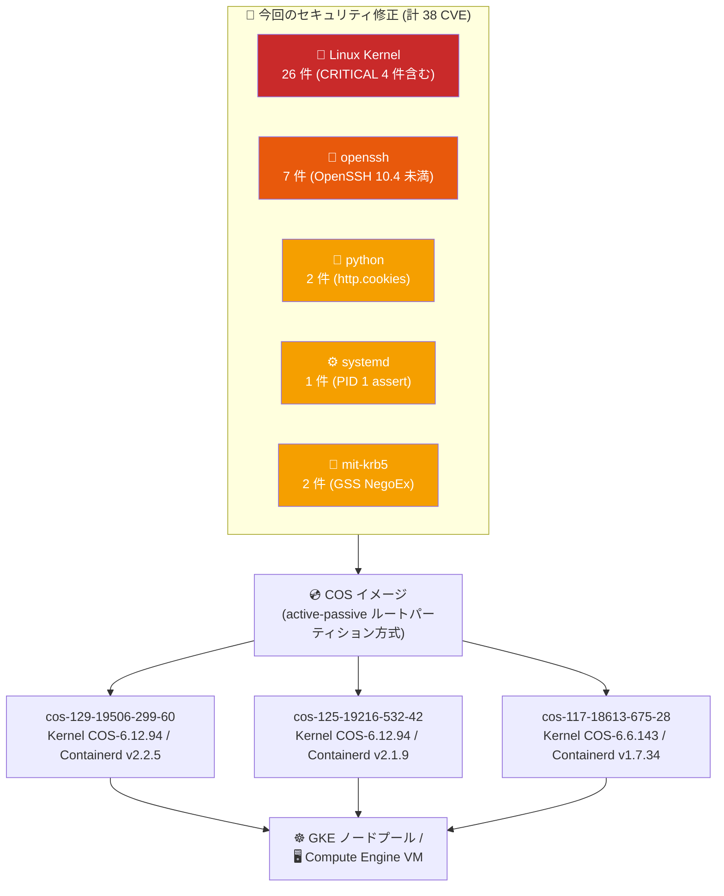

# Container-Optimized OS: 7月28日リリース (COS 129/125/117 大規模セキュリティアップデート)

**リリース日**: 2026-07-28

**サービス**: Container-Optimized OS (COS)

**機能**: マイルストーン 129/125/117 セキュリティ・バグ修正リリース (cos-129-19506-299-60 ほか)

**ステータス**: Change / Fixed / Security

📊 [このアップデートのインフォグラフィックを見る](https://takech9203.github.io/google-cloud-news-summary/20260728-container-optimized-os-security-updates-july-28.html)

## 概要

2026年7月28日、Google は Container-Optimized OS (COS) の 3 つの LTS マイルストーン (129 / 125 / 117) に対して新リリースを公開した。主要リリースである `cos-129-19506-299-60` は Kernel COS-6.12.94、Docker v27.5.1、Containerd v2.2.5 を搭載し、Linux カーネル 26 件、openssh 7 件、python 2 件、systemd 1 件、mit-krb5 2 件という合計 38 件の CVE 修正を含む。COS の定例リリースとしては非常に大規模なセキュリティリリースである。

セキュリティ修正の中心は Linux カーネルであり、NFS/NFSD/pNFS のプロトコルデコード処理、9p、blk-cgroup、KVM、keys、AppArmor、netfilter/ipset、skmsg など広範なサブシステムに及ぶ。特に `CVE-2026-63795` (9p, CVSS 10.0 CRITICAL)、`CVE-2026-63830` (net/skmsg, 9.4 CRITICAL)、`CVE-2026-53398` (NFSD SECINFO_NO_NAME, 9.8 CRITICAL)、`CVE-2026-63800` (pNFS use-after-free, 9.8 CRITICAL) の 4 件が CRITICAL 評価であり、優先的な対応が求められる。openssh については OpenSSH 10.4 未満に存在する 7 件の脆弱性が一括で修正されており、`CVE-2026-60002` (クライアント側 use-after-free, 7.7 HIGH) が最も深刻である。

セキュリティ以外では、`protected_stateful_partition` の udev ルールが更新され、COS 129 ではロギングエージェントである `app-admin/fluent-bit` が v4.2.7 にアップグレードされた。COS 125 では XFS ファイルシステム利用者向けの重要なバグ修正が入っており、COS 117 では `net-fs/cifs-utils` v7.7 と `sys-libs/talloc` v2.4.4-r1 へのアップグレードが行われている。COS は GKE のデフォルトノード OS イメージであるため、これらの修正は GKE クラスタを運用するすべてのユーザーに影響する。

**アップデート前の課題**

- Linux カーネルに NFS/NFSD/pNFS 関連の解析処理の不備 (`CVE-2026-53391`、`CVE-2026-53392`、`CVE-2026-53398`、`CVE-2026-63800` など) が存在し、リモートからの DoS や use-after-free のリスクがあった
- 9p ファイルシステムの `p9_client_walk()` エラーパスに `CVE-2026-63795` (CVSS 10.0) の欠陥が存在していた
- 同梱の openssh が OpenSSH 10.4 未満であり、sftp/scp のファイル配置制約の不備、`DisableForwarding` が `PermitTunnel` に優先しない問題、認証遅延の不履行など 7 件の脆弱性を抱えていた
- systemd が非特権 IPC API 呼び出しで assert に到達し PID 1 が停止しうる `CVE-2026-29111` の影響を受けていた
- python の `http.cookies.Morsel` に制御文字バイパス (`CVE-2026-3644`) および `js_output()` の `</script>` 未エスケープ (`CVE-2026-6019`) が残存していた
- mit-krb5 が 1.22.3 未満であり、`gss_accept_sec_context()` 経由で NULL ポインタ参照・整数アンダーフローを誘発できる状態だった (`CVE-2026-40355` / `CVE-2026-40356`)
- COS 125 において XFS ファイルシステム利用者に影響する重要なバグが存在していた

**アップデート後の改善**

- Linux カーネルの CVE が COS 129 / COS 125 で各 26 件、COS 117 で 20 件修正された
- CRITICAL 評価の 4 件 (`CVE-2026-63795` / `CVE-2026-63830` / `CVE-2026-53398` / `CVE-2026-63800`) が COS 129 および COS 125 で修正された
- openssh の 7 件の CVE (`CVE-2026-59995`〜`CVE-2026-60002`) が COS 129 / COS 125 で修正された
- systemd の `CVE-2026-29111` が全 3 マイルストーンで修正された
- mit-krb5 の `CVE-2026-40355` / `CVE-2026-40356` が全 3 マイルストーンで修正された
- COS 129 で `app-admin/fluent-bit` が v4.2.7 にアップグレードされ、Cloud Logging へのログ転送コンポーネントが更新された
- `protected_stateful_partition` の udev ルールが更新され、COS 129 / COS 125 に適用された
- COS 125 で XFS ファイルシステム利用者向けの重要なバグが修正された
- COS 117 で `net-fs/cifs-utils` v7.7、`sys-libs/talloc` v2.4.4-r1 にアップグレードされた

## アーキテクチャ図



COS はパッケージ単位ではなくカーネルを含む OS イメージ全体を差し替える active-passive ルートパーティション方式を採用しているため、これらの CVE 修正はイメージ更新とノード再作成 (または再起動) を経て適用される。

## サービスアップデートの詳細

### コンポーネントバージョンマトリクス

| コンポーネント | COS 129 | COS 125 | COS 117 |
|---|---|---|---|
| **イメージ名** | cos-129-19506-299-60 | cos-125-19216-532-42 | cos-117-18613-675-28 |
| **Kernel** | COS-6.12.94 | COS-6.12.94 | COS-6.6.143 |
| **Docker** | v27.5.1 | v27.5.1 | v24.0.9 |
| **Containerd** | v2.2.5 | v2.1.9 | v1.7.34 |
| **GPU Driver (DEFAULT/LATEST)** | 580.173.02 | (GPU Drivers リスト参照) | (GPU Drivers リスト参照) |
| **x86 イメージファミリー** | cos-129-lts | cos-125-lts | cos-117-lts |
| **Arm イメージファミリー** | cos-arm64-129-lts | cos-arm64-125-lts | cos-arm64-117-lts |
| **サポート終了 (End of support)** | 2028年3月 | 2027年9月 | 2026年9月 |

前回リリース (2026年7月20日) からの差分として、Kernel / Docker / Containerd のバージョンは 3 マイルストーンいずれも据え置きで、今回は CVE 修正とパッケージ更新が中心のリリースとなっている。

### CVE 修正一覧: Linux カーネル

| CVE | CVSS | 概要 (影響サブシステム) | 129 | 125 | 117 |
|---|:---:|---|:---:|:---:|:---:|
| CVE-2026-63795 | 10.0 CRITICAL | 9p: `p9_client_walk()` のエラーパスで oldfid を put してしまう問題 | ✅ | ✅ | ✅ |
| CVE-2026-53398 | 9.8 CRITICAL | NFSD: `SECINFO_NO_NAME` デコードエラー時のクリーンアップ不備 | ✅ | ✅ | ✅ |
| CVE-2026-63800 | 9.8 CRITICAL | pNFS: `pnfs_update_layout()` の use-after-free | ✅ | ✅ | ✅ |
| CVE-2026-63830 | 9.4 CRITICAL | net/skmsg: SG 変換をまたいだ `sg.copy` の保持不備 | ✅ | ✅ | ✅ |
| CVE-2026-63807 | 8.8 HIGH | KVM x86/mmu: hugepage の slot 内包チェック順序の誤り | ✅ | ✅ | ✅ |
| CVE-2026-63829 | 8.8 HIGH | net/ip_gre: `changelink` で device netns の CAP_NET_ADMIN を要求 | ✅ | ✅ | - |
| CVE-2026-63828 | 8.4 HIGH | apparmor: TCP Fast Open `sendmsg` の暗黙 connect が未仲介 | ✅ | ✅ | ✅ |
| CVE-2026-53381 | 7.8 HIGH | virtiofs: submount の umount 時 use-after-free | ✅ | ✅ | ✅ |
| CVE-2026-53388 | 7.8 HIGH | fuse: page cache folio 置換前のリクエスト再ロック漏れ | ✅ | ✅ | ✅ |
| CVE-2026-53400 | 7.8 HIGH | i2c core: アダプタ登録処理のレース | ✅ | ✅ | - |
| CVE-2026-63802 | 7.8 HIGH | blk-cgroup: `__blkcg_rstat_flush()` の use-after-free | ✅ | ✅ | ✅ |
| CVE-2026-63809 | 7.8 HIGH | bpf: 置換された sysctl 書き込みバッファの解放方法誤り (`kvfree()`) | ✅ | ✅ | ✅ |
| CVE-2026-63823 | 7.8 HIGH | keys: instantiate パスで `request_key_auth` ペイロードを固定 | ✅ | ✅ | ✅ |
| CVE-2026-63824 | 7.8 HIGH | KEYS: `keyctl_pkey_params_get_2()` のバッファ長計算オーバーフロー | ✅ | ✅ | ✅ |
| CVE-2026-63827 | 7.8 HIGH | apparmor: rawdata 重複排除ループの use-after-free | ✅ | ✅ | ✅ |
| CVE-2026-64189 | 7.8 HIGH | netfilter/ipset: dump と `ip_set_list` リサイズのレース | ✅ | ✅ | - |
| CVE-2026-53391 | 7.5 HIGH | NFSv4/pNFS: `nfs4_decode_mp_ds_addr` の長さ 0 `r_addr` を拒否 | ✅ | ✅ | ✅ |
| CVE-2026-53392 | 7.5 HIGH | NFSv4/flexfiles: filehandle バージョン数 0 を拒否 | ✅ | ✅ | - |
| CVE-2026-53394 | 7.5 HIGH | nfsd: 未確認 openowner の再試行レースによるリーク | ✅ | ✅ | - |
| CVE-2026-53397 | 7.5 HIGH | nfsd: SETACL デコード失敗時の `posix_acl` リーク | ✅ | ✅ | ✅ |
| CVE-2026-63806 | 7.1 HIGH | KVM: ioeventfd datamatch のゲスト誘発可能な `BUG_ON()` | ✅ | ✅ | - |
| CVE-2026-63833 | 7.1 HIGH | ntfs3: 予約 `$LX*` xattr へのユーザ空間書き込みを拒否 | ✅ | ✅ | - |
| CVE-2026-53385 | 5.5 MEDIUM | vc_screen: `vcs_write` 並行時の `vcs_notifier()` NULL ポインタ参照 | ✅ | ✅ | ✅ |
| CVE-2026-53393 | 5.5 MEDIUM | nfsd: 遅延ライトバックエラー時に write verifier をリセット | ✅ | ✅ | - |
| CVE-2026-63810 | (未評定) | block: bdev 疑似ファイルシステムのユーザ空間マウント防止 | ✅ | ✅ | ✅ |
| CVE-2026-64187 | (未評定) | xfs: リージョンを持たないコミット済みログアイテムでリカバリを失敗させる | ✅ | ✅ | - |
| CVE-2026-63794 | (未評定) | Linux カーネル修正 (COS 117 のみ) | - | - | ✅ |

COS 129 / COS 125 はいずれも 26 件、COS 117 は 20 件のカーネル CVE を修正している。COS 117 のみ `CVE-2026-63794` が追加で修正されており、これは 6.6 系カーネル固有の修正である。

### CVE 修正一覧: openssh (COS 129 / COS 125)

いずれも OpenSSH 10.4 未満に該当する脆弱性であり、今回のリリースで一括修正された。COS 117 は今回の openssh 修正対象に含まれていない。

| CVE | CVSS | 概要 |
|---|:---:|---|
| CVE-2026-60002 | 7.7 HIGH | ssh: key re-exchange 中にサーバがホストキーを変更した場合のクライアント側 use-after-free |
| CVE-2026-60001 | 6.5 MEDIUM | sshd: 最小認証遅延 (minimum authentication delay) が常に守られない |
| CVE-2026-59999 | 5.9 MEDIUM | sshd: `DisableForwarding=yes` が `PermitTunnel=yes` に優先されない |
| CVE-2026-59995 | 4.2 MEDIUM | sftp: 攻撃者が制御するサーバに対し `sftp server:/path .` を使うとダウンロード先が制約されない |
| CVE-2026-59996 | 4.2 MEDIUM | scp: リモート間コピー時に意図したディレクトリの親にファイルを配置しうる |
| CVE-2026-59997 | 4.2 MEDIUM | internal-sftp: コマンドライン引数の先頭 9 個のみを認識し、後続のセキュリティ指定が無視される |
| CVE-2026-60000 | 3.7 LOW | sshd: GSSAPIAuthentication で `MaxAuthTries` が誤処理され、認証試行によるリソース消費 DoS が可能 |

### CVE 修正一覧: python / systemd / mit-krb5

| コンポーネント | CVE | CVSS | 概要 | 129 | 125 | 117 |
|---|---|:---:|---|:---:|:---:|:---:|
| dev-lang/python | CVE-2026-3644 | 7.5 HIGH | `http.cookies.Morsel` の制御文字検証バイパス (CVE-2026-0672 の修正漏れ)。`Morsel.update()`、`\|=` 演算子、unpickling 経路が未修正で、`BaseCookie.js_output()` に出力検証が欠落 | ✅ | ✅ | - |
| dev-lang/python | CVE-2026-6019 | 6.1 MEDIUM | `Morsel.js_output()` がインライン `<script>` を返す際に `</script>` シーケンスを無効化しない | ✅ | ✅ | ✅ |
| sys-apps/systemd | CVE-2026-29111 | 5.5 MEDIUM | PID 1 として動作する systemd が、不正データを伴う非特権 IPC API 呼び出しで assert に到達して実行停止する | ✅ | ✅ | ✅ |
| app-crypt/mit-krb5 | CVE-2026-40355 | 5.9 MEDIUM | krb5 1.22.3 未満。`/etc/gss/mech` に NegoEx メカニズムが登録された環境で `gss_accept_sec_context()` 呼び出し時に NULL ポインタ参照 (`parse_nego_message`) | ✅ | ✅ | ✅ |
| app-crypt/mit-krb5 | CVE-2026-40356 | 5.9 MEDIUM | krb5 1.22.3 未満。同条件で整数アンダーフローと境界外読み取りが発生し `parse_message` でプロセス終了 | ✅ | ✅ | ✅ |

### 主要機能

1. **Linux カーネル 26 件の CVE 修正 (COS 129 / COS 125)**
   - CRITICAL 4 件 (`CVE-2026-63795` / `CVE-2026-53398` / `CVE-2026-63800` / `CVE-2026-63830`) を含む
   - NFS / NFSD / pNFS / flexfiles のプロトコルデコード処理の堅牢化が中心
   - `keys`、`apparmor`、`bpf`、`netfilter/ipset`、`blk-cgroup`、`KVM` など、コンテナ隔離やホスト保護に直接関わるサブシステムの修正を含む
   - COS 117 は 20 件を修正し、加えて `CVE-2026-63794` を独自に修正

2. **openssh の 7 件の CVE 一括修正 (COS 129 / COS 125)**
   - OpenSSH 10.4 未満に存在する sftp / scp / sshd の脆弱性群
   - `DisableForwarding` の優先順位不履行 (`CVE-2026-59999`) はポートフォワーディングを禁止する運用ポリシーが実質的に無効化されうる問題
   - `CVE-2026-60001` (最小認証遅延の不履行) と `CVE-2026-60000` (GSSAPI 認証での `MaxAuthTries` 誤処理) はブルートフォース耐性に影響

3. **fluent-bit v4.2.7 へのアップグレード (COS 129)**
   - COS 109 以降 (x86) および全 Arm イメージで既定のロギングエージェントとなっている `app-admin/fluent-bit` を更新
   - COS 外での利用 (Compute Engine 単体) では `google-logging-enabled=true` メタデータで有効化する
   - GKE 上では Cloud Logging が自動的に有効になる

4. **protected_stateful_partition の udev ルール更新 (COS 129 / COS 125)**
   - COS は root パーティションを読み取り専用でマウントし、`/mnt/stateful_partition` を書き込み可能な stateful パーティションとして分離している
   - この stateful パーティションの保護に関わる udev ルールが更新された

5. **XFS バグ修正 (COS 125) / パッケージ更新 (COS 117)**
   - COS 125: XFS ファイルシステム利用者にとって重要なバグを修正
   - COS 117: `net-fs/cifs-utils` を v7.7、`sys-libs/talloc` を v2.4.4-r1 にアップグレード

## 技術仕様

### カーネルシリーズとコンテナランタイム世代

| マイルストーン | カーネルシリーズ | 今回のカーネル | Docker | Containerd | 備考 |
|---|---|---|---|---|---|
| COS 129 | Linux 6.12 LTS | COS-6.12.94 | v27.5.1 | v2.2.5 | Containerd 2.2 系 (最新) |
| COS 125 | Linux 6.12 LTS | COS-6.12.94 | v27.5.1 | v2.1.9 | Containerd 2.1 系 |
| COS 117 | Linux 6.6 LTS | COS-6.6.143 | v24.0.9 | v1.7.34 | Containerd 1.7 系 (2026年9月サポート終了) |

COS 129 と COS 125 は同一のカーネルバージョン (COS-6.12.94) を共有しているが、Containerd のマイナーバージョンが異なる。COS 117 は Linux 6.6 LTS 系であり、6.12 系固有の修正 (`CVE-2026-63829`、`CVE-2026-53400`、`CVE-2026-63806` など) は該当しない。

### GPU ドライバ (cos-129-19506-299-60)

`cos-129-19506-299-60` に対応する GPU ドライババージョン情報では、`NVIDIA_H100_80GB`、`NVIDIA_H200`、`NVIDIA_B200`、`NVIDIA_GB200`、`NVIDIA_GB300`、`NVIDIA_L4`、`NVIDIA_TESLA_T4`、`NVIDIA_RTX_PRO_6000` などすべての GPU タイプについて、`LATEST` および `DEFAULT` ラベルが **580.173.02** を指している。

| ラベル | バージョン | 意味 |
|---|---|---|
| `DEFAULT` | 580.173.02 | LTSB (Long-Term Support Branch)、なければ PB を指す |
| `LATEST` | 580.173.02 | 最新の PB / LTSB ドライバを指す |
| `R595` | 595.71.05 | 特定ドライバファミリーへのピン留め用ラベル |
| `R580` | 580.173.02 | 特定ドライバファミリーへのピン留め用ラベル |

### COS のファイルシステム構成 (protected_stateful_partition 関連)

| パス | 属性 | 用途 |
|---|---|---|
| `/` | 読み取り専用 / 実行可能 | ルートファイルシステム。ブート時にカーネルが整合性を検証し、エラー時はブートを拒否 |
| `/home`、`/var` | 書き込み可能 / 非実行 / stateful | `/mnt/stateful_partition` からマウント。ブートディスクのライフタイムで永続 |
| `/var/lib/google`、`/var/lib/docker`、`/var/lib/toolbox` | 書き込み可能 / 実行可能 / stateful | Compute Engine パッケージ、Docker、Toolbox の作業ディレクトリ |
| `/etc` | 書き込み可能 / 実行可能 / stateless / tmpfs | 設定を保持するが再起動で揮発 |
| `/tmp`、`/mnt/disks` | 書き込み可能 / stateless / tmpfs | スクラッチ領域、永続ディスクのマウントポイント |

## 設定方法

### 前提条件

1. GKE クラスタまたは Compute Engine インスタンスで COS を使用していること
2. 対象マイルストーン (129 / 125 / 117) のイメージを使用していること
3. GKE の場合は `roles/container.clusterAdmin` 相当のノードプールアップグレード権限があること

### 手順

#### ステップ 1: 現在の COS バージョンを確認

```bash
# GKE ノードの OS イメージバージョンを一覧で確認
kubectl get nodes -o custom-columns=\
'NAME:.metadata.name,OS_IMAGE:.status.nodeInfo.osImage,KERNEL:.status.nodeInfo.kernelVersion,RUNTIME:.status.nodeInfo.containerRuntimeVersion'

# Compute Engine 上の COS インスタンス内から確認
cat /etc/os-release
```

#### ステップ 2: 最新イメージがどのバージョンか確認

```bash
# イメージファミリーの最新イメージを確認
gcloud compute images describe-from-family cos-129-lts \
  --project=cos-cloud \
  --format="value(name,creationTimestamp)"
```

`cos-129-19506-299-60` 以降であれば今回の修正が含まれる。

#### ステップ 3: GKE ノードプールをアップグレード

```bash
# ノードプールを最新の COS イメージにアップグレード (ローリング)
gcloud container clusters upgrade CLUSTER_NAME \
  --node-pool=NODE_POOL_NAME \
  --location=LOCATION

# 進行状況の確認
gcloud container operations list --location=LOCATION --limit=5
```

#### ステップ 4: Compute Engine で最新イメージを使用

```bash
# イメージファミリー指定 (常に最新)
gcloud compute instances create INSTANCE_NAME \
  --image-family=cos-129-lts \
  --image-project=cos-cloud \
  --zone=ZONE

# 特定バージョンをピン留め
gcloud compute instances create INSTANCE_NAME \
  --image=cos-129-19506-299-60 \
  --image-project=cos-cloud \
  --zone=ZONE
```

#### ステップ 5: 自動更新の設定 (Compute Engine 単体利用時)

```bash
# 自動更新を有効化 (マイルストーン 117 以降はデフォルト無効)
gcloud compute instances add-metadata INSTANCE_NAME \
  --metadata cos-update-strategy=update_enabled

# プロジェクト全体で有効化
gcloud compute project-info add-metadata \
  --metadata cos-update-strategy=update_enabled
```

マイルストーン 117 以降では自動更新はデフォルトで無効であり、明示的に `update_enabled` を設定する必要がある。また、更新はインスタンスを再起動するまで有効にならず、auto-updater は強制再起動を行わない。

## メリット

### ビジネス面

- **重大脆弱性への迅速な対応**: CRITICAL 4 件を含む 38 件の CVE がまとめて解消されるため、脆弱性スキャン結果と是正 SLA の維持に直結する
- **コンプライアンス維持**: PCI DSS や CIS ベンチマークなど、既知の重大脆弱性の是正期限が定められた要件への対応が容易になる
- **管理コストの削減**: COS はパッケージ単位ではなく OS イメージ全体を更新するため、個別パッケージのパッチ適用作業が不要

### 技術面

- **カーネルレベルの隔離強化**: `keys`、`apparmor`、`bpf`、`blk-cgroup`、`KVM` の修正により、コンテナからホストへのエスケープ経路や cgroup 境界の堅牢性が向上
- **ネットワークファイルシステムの安全性向上**: NFS / NFSD / pNFS / flexfiles / 9p / virtiofs / fuse の複数の解析処理不備が修正され、悪意あるサーバや細工されたレスポンスに対する耐性が向上
- **SSH 運用ポリシーの実効性回復**: `DisableForwarding` の優先順位不履行が修正され、ポートフォワーディング禁止ポリシーが正しく機能する
- **ロギング基盤の更新**: fluent-bit v4.2.7 により Cloud Logging へのログ転送コンポーネントが最新化される

## デメリット・制約事項

### 制限事項

- COS はカーネルがロックダウンされており、サードパーティのカーネルモジュールやドライバをインストールできない。したがってカーネル CVE の修正は OS イメージ更新以外の手段では適用できない
- カーネルを含むイメージ全体の差し替えとなるため、修正の適用にはインスタンスの再起動またはノードの再作成が必須である
- UEFI Secure Boot が有効な COS VM および Arm ベースの COS イメージでは in-place 更新がサポートされない
- COS 117 は 2026年9月にサポート終了予定であり、今回のリリースでも openssh の CVE 修正や一部のカーネル CVE 修正が対象外となっている

### 考慮すべき点

- COS 117 では openssh 7 件の CVE および `CVE-2026-3644` (python) が修正対象に含まれていないため、SSH 経路や Python ベースの Cookie 処理に依存する構成では COS 125 / 129 への移行を検討すべきである
- COS 117 から COS 125 / 129 への移行では Containerd がメジャーバージョン 1.x から 2.x へ変わるため、CRI 設定や CNI プラグインの互換性確認が必要
- COS 125 から COS 129 では Containerd が 2.1 系から 2.2 系に上がるため、Containerd 設定ファイル (`config.toml`) のカスタマイズがある場合は検証が必要
- `protected_stateful_partition` の udev ルール更新および XFS 修正 (COS 125) はストレージ層の変更であるため、ステートフルワークロードでは事前検証環境での確認が望ましい
- GKE ノード自動アップグレードが有効な場合は順次適用されるが、適用タイミングを制御したい場合はメンテナンスウィンドウや除外期間の設定を併用する

## ユースケース

### ユースケース 1: CRITICAL カーネル脆弱性の緊急是正

**シナリオ**: 本番 GKE クラスタで COS 129 を使用しており、脆弱性管理ツールが `CVE-2026-63795` (CVSS 10.0) と `CVE-2026-53398` (CVSS 9.8) を検出した。是正期限は 7 日以内。

**実装例**:
```bash
# 1. 現行バージョンを確認
kubectl get nodes -o custom-columns='NAME:.metadata.name,OS_IMAGE:.status.nodeInfo.osImage'

# 2. サージアップグレード設定で無停止性を確保
gcloud container node-pools update default-pool \
  --cluster=prod-cluster \
  --location=asia-northeast1 \
  --max-surge-upgrade=2 \
  --max-unavailable-upgrade=0

# 3. ノードプールをアップグレード
gcloud container clusters upgrade prod-cluster \
  --node-pool=default-pool \
  --location=asia-northeast1
```

**効果**: PodDisruptionBudget とサージアップグレードを組み合わせることで、ワークロードを維持しながら 38 件の CVE 修正を適用できる。

### ユースケース 2: SSH フォワーディング禁止ポリシーの実効性確保

**シナリオ**: セキュリティポリシーで `sshd_config` に `DisableForwarding yes` を設定してポートフォワーディングとトンネリングを禁止していたが、`CVE-2026-59999` により `PermitTunnel=yes` が優先され、実質的にトンネリングが可能な状態だった。

**実装例**:
```bash
# COS 129 / COS 125 の最新イメージで再作成
gcloud compute instances create bastion-01 \
  --image=cos-129-19506-299-60 \
  --image-project=cos-cloud \
  --zone=asia-northeast1-a \
  --metadata enable-oslogin=TRUE
```

**効果**: OpenSSH 10.4 相当の修正が適用され、`DisableForwarding` が `PermitTunnel` に正しく優先されるようになり、意図した SSH 運用ポリシーが実際に強制される。

### ユースケース 3: NFS / CIFS を利用するワークロードの安定化

**シナリオ**: COS ノード上で NFS (Filestore など) や CIFS マウントを利用するステートフルワークロードを運用しており、NFS クライアント/サーバ側の解析不備によるカーネル panic を懸念している。

**効果**: COS 129 / COS 125 では NFS 系の CVE (`CVE-2026-53391`、`CVE-2026-53392`、`CVE-2026-53394`、`CVE-2026-53397`、`CVE-2026-53398`、`CVE-2026-63800`) が修正され、COS 117 では `net-fs/cifs-utils` が v7.7 に更新されるため、ネットワークファイルシステム利用時の安定性が向上する。

## 料金

Container-Optimized OS のイメージ自体は追加費用なしで利用できる。課金対象は COS を実行する Compute Engine インスタンス (vCPU / メモリ / 永続ディスク / ネットワーク) および GKE クラスタ管理費用であり、今回のセキュリティアップデートの適用による追加料金は発生しない。

ノードアップグレードに伴い一時的にサージノードが追加される場合、そのノードの稼働時間分の Compute Engine 料金が発生する点に留意する。詳細は Compute Engine および GKE の料金ページを参照。

## 利用可能リージョン

COS イメージは `cos-cloud` イメージプロジェクトからグローバルに提供され、Compute Engine が利用可能なすべてのリージョン / ゾーンで使用できる。x86 は `cos-129-lts` / `cos-125-lts` / `cos-117-lts`、Arm は `cos-arm64-129-lts` / `cos-arm64-125-lts` / `cos-arm64-117-lts` のイメージファミリーを使用する。

## 関連サービス・機能

- **Google Kubernetes Engine (GKE)**: COS はデフォルトのノード OS イメージ。ノード自動アップグレードにより今回の修正が順次適用される
- **Compute Engine**: COS イメージを VM として直接使用できる。マイルストーン 117 以降は自動更新がデフォルト無効のため `cos-update-strategy` の明示設定が必要
- **Cloud Logging**: 今回 v4.2.7 に更新された fluent-bit がログ転送を担う。Compute Engine 単体では `google-logging-enabled=true` メタデータで有効化する
- **OS Login**: openssh の修正はホストへの SSH アクセス経路に直接影響する。OS Login を併用することで IAM ベースのアクセス制御が可能
- **Filestore / Cloud Storage FUSE**: NFS および FUSE 関連のカーネル修正が含まれるため、これらを利用するワークロードで安定性が向上する
- **Confidential Space / Confidential VM**: Confidential Space イメージは COS のセキュリティ強化を基盤としており、COS のカーネル修正の恩恵を受ける
- **GKE Sandbox (gVisor)**: gVisor 利用時はホストカーネルへの露出が減るが、基盤 OS の更新は引き続き推奨される

## 参考リンク

- 📊 [インフォグラフィック](https://takech9203.github.io/google-cloud-news-summary/20260728-container-optimized-os-security-updates-july-28.html)
- [公式リリースノート (Google Cloud, July 28 2026)](https://docs.cloud.google.com/release-notes#July_28_2026)
- [COS リリースノート (マイルストーン 129)](https://docs.cloud.google.com/container-optimized-os/docs/release-notes/m129)
- [COS リリースノート (マイルストーン 125)](https://docs.cloud.google.com/container-optimized-os/docs/release-notes/m125)
- [COS リリースノート (マイルストーン 117)](https://docs.cloud.google.com/container-optimized-os/docs/release-notes/m117)
- [COS リリーススケジュール / アクティブマイルストーン](https://docs.cloud.google.com/container-optimized-os/docs/release-notes)
- [COS セキュリティ概要](https://docs.cloud.google.com/container-optimized-os/docs/concepts/security)
- [COS 自動更新](https://docs.cloud.google.com/container-optimized-os/docs/concepts/auto-update)
- [COS ディスクとファイルシステム](https://docs.cloud.google.com/container-optimized-os/docs/concepts/disks-and-filesystem)
- [COS ロギング (fluent-bit)](https://docs.cloud.google.com/container-optimized-os/docs/how-to/logging)
- [COS で GPU を実行する](https://cloud.google.com/container-optimized-os/docs/how-to/run-gpus)
- [GPU ドライババージョン (19506.299.60)](https://storage.googleapis.com/cos-tools/19506.299.60/lakitu/gpu_driver_versions.textproto)
- [GKE ノードイメージ](https://docs.cloud.google.com/kubernetes-engine/docs/concepts/node-images)
- [GKE クラスタのアップグレード](https://docs.cloud.google.com/kubernetes-engine/docs/how-to/upgrading-a-cluster)
- [Compute Engine 料金](https://cloud.google.com/compute/pricing)

## まとめ

2026年7月28日の Container-Optimized OS リリースは、Linux カーネル 26 件・openssh 7 件・python 2 件・systemd 1 件・mit-krb5 2 件という計 38 件の CVE を修正する大規模なセキュリティリリースである。特に `CVE-2026-63795` (CVSS 10.0)、`CVE-2026-53398` (9.8)、`CVE-2026-63800` (9.8)、`CVE-2026-63830` (9.4) の 4 件は CRITICAL 評価であり、GKE クラスタおよび COS ベースの Compute Engine インスタンスを運用しているユーザーは `cos-129-19506-299-60` / `cos-125-19216-532-42` / `cos-117-18613-675-28` 以降への速やかな更新を推奨する。

COS はカーネルを含む OS イメージ全体を差し替える方式であるため、修正の適用にはノード再作成または再起動が必要である。GKE ではノード自動アップグレードを有効にしておくことで順次適用されるが、CRITICAL 脆弱性の是正期限が定められている環境ではサージアップグレード設定と組み合わせた手動アップグレードによる即時適用を検討すべきである。また COS 117 は openssh CVE 修正の対象外であり 2026年9月にサポート終了となるため、COS 125 / 129 への移行計画を並行して進めることが望ましい。

---

**タグ**: #ContainerOptimizedOS #COS #GKE #Security #CVE #LinuxKernel #OpenSSH #systemd #Kerberos #Containerd #fluentbit #セキュリティアップデート
