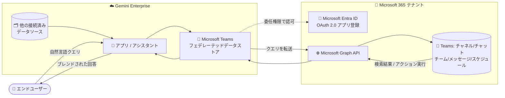

# Gemini Enterprise: Microsoft Teams フェデレーテッドコネクタが GA

**リリース日**: 2026-07-28

**サービス**: Gemini Enterprise

**機能**: Microsoft Teams フェデレーテッドコネクタ / フェデレーテッドデータストア

**ステータス**: GA (一般提供)

📊 [このアップデートのインフォグラフィックを見る](https://takech9203.github.io/google-cloud-news-summary/20260728-gemini-enterprise-microsoft-teams-connector-ga.html)

## 概要

Gemini Enterprise において、**Microsoft Teams フェデレーテッドデータストア (Microsoft Teams federated data store)** が一般提供 (GA) になりました。Microsoft Teams を Gemini Enterprise に接続することで、チャネル (channels)、チャット (chats)、チーム (teams)、メッセージ (messages) を横断的にクエリでき、さらにサポートされているアクションをアシスタントから直接実行できます。

公式ドキュメントによると、Microsoft Teams データストアは「チャネル、チャット、スケジュールに対する検索とアクションの実行」を可能にします。エンドユーザーは Gemini Enterprise 上で自然言語コマンドを使い、**Send channel message** (指定チャネルへのメッセージ送信) や **Send chat message** (チャットへのメッセージ送信) といった書き込みアクションを実行できます。加えて、読み取り専用のアクションも利用可能です。

Microsoft 365 / Microsoft Teams を社内コミュニケーション基盤として利用しつつ、Google Cloud の Gemini Enterprise を全社的な AI アシスタント / エンタープライズ検索のフロントエンドとして採用している組織にとって、重要なアップデートです。Gemini Enterprise は Microsoft Teams からの結果を他の接続済みデータソースの結果とブレンドし、統合された検索結果として提示します。

**アップデート前の課題**

- Microsoft Teams コネクタは GA ではなかったため、本番環境での正式サポートを前提とした全社導入の判断が難しかった
- Teams のチャネルやチャットに蓄積された会話履歴は、Gemini Enterprise の統合検索・アシスタントの回答根拠として正式には活用できなかった
- Teams へのメッセージ送信のような操作は、Gemini Enterprise のアシスタントから直接実行できず、ユーザーが Teams クライアントに切り替える必要があった

**アップデート後の改善**

- Microsoft Teams フェデレーテッドデータストアが GA となり、正式サポートのもとで本番利用が可能になった
- チャネル、チャット、チーム、メッセージ、スケジュールを対象に、Gemini Enterprise から横断検索できるようになった
- 自然言語コマンドで **Send channel message** / **Send chat message** といったアクションをアシスタントから直接実行できるようになった
- Teams の検索結果を他の接続済みデータソースの結果とブレンドし、統合された検索結果として取得できるようになった

## アーキテクチャ図



Gemini Enterprise はクエリを索引にコピーせず、Microsoft Entra ID で認可された委任権限を使って Microsoft Graph API に直接転送し、返ってきた結果を他のデータソースの結果とブレンドして提示します。

## サービスアップデートの詳細

### 主要機能

1. **フェデレーテッド検索 (Federated search)**
   - Microsoft Teams のチャネル、チャット、チーム、メッセージ、スケジュールを対象に検索を実行
   - データを Gemini Enterprise の索引にコピーせず、クエリ時に Microsoft API へ直接問い合わせる
   - データストア作成時に「Entities to search」セクションで検索対象エンティティを選択する (最低 1 つは必須)

2. **アクションの実行 (Actions)**
   - エンドユーザーは Gemini Enterprise 上の自然言語コマンドで Teams の操作を実行できる
   - `Send channel message`: 指定したチャネルへメッセージを送信
   - `Send chat message`: チャット内でメッセージを送信
   - 上記に加えて、読み取り専用のアクションも利用可能
   - アクションはデータストア作成時に選択するほか、後から追加・管理も可能

3. **結果のブレンド (Blended results)**
   - Microsoft Teams からの結果を、他の接続済みデータソースの結果と統合して 1 つの検索結果として表示
   - Google Workspace 系コネクタや他のサードパーティコネクタと併用することで、社内情報を横断した回答が可能

4. **セキュリティ・ガバナンス機能との統合**
   - `us` / `eu` ロケーションを選択した場合、Google 管理の暗号鍵または Cloud KMS 鍵 (CMEK) を選択可能
   - Static IP egress を有効化すると、送信トラフィックに固定 IP アドレスセットを使用でき、ソースシステム側での許可リスト登録に対応

## 技術仕様

### 「フェデレーテッド」と「インデックス型 (データ取り込み)」の違い

Gemini Enterprise のコネクタには、データ連携方式として **データフェデレーション (federation)** と **データ取り込み / インデックス化 (ingestion / indexing)** の 2 つのモードがあります。Microsoft Teams コネクタは、今回 GA となった **Federated search** モードを使用します。

| 観点 | データフェデレーション (今回の Teams コネクタ) | データ取り込み (インデックス化) |
|------|--------------------------------------------|------------------------------|
| データの所在 | データは Gemini Enterprise の索引にコピーされない | データを Gemini Enterprise の索引にコピーする |
| ストレージ | データストレージを気にする必要がない | ストレージ消費が増える |
| 処理時間 | 取り込み処理が不要 | 取り込みに時間を要する |
| 検索品質 | データが索引化されていないため、検索品質が低くなる可能性がある | 検索品質の向上が期待できる |
| クエリ実行 | クエリ時にソースシステムの API へ直接問い合わせる | 索引に対して検索する |
| データ同期 | ソースの最新状態がそのまま反映される | 同期スケジュール (フル / 増分) の設定が必要 |

公式ドキュメント (Introduction to connectors and data stores) では、コネクタが両方の方式に対応している場合は、要件に応じて優先する接続方式を選択できると説明されています。Microsoft Teams については、ドキュメント上の手順で接続モードとして **Federated search** を選択します。

### クエリ実行とデータの取り扱い

Microsoft Teams を認可した後、Gemini Enterprise に検索クエリを送信すると次のように処理されます。

- Gemini Enterprise は検索クエリを **Microsoft API へ直接送信** する
- Gemini Enterprise は他の接続済みデータソースの結果と結果をブレンドし、統合された検索結果を表示する

サードパーティのフェデレーテッド検索を使用する際のデータ取り扱いルールは以下の通りです。

- クエリ文字列はサードパーティの検索バックエンド (Microsoft API) に送信される
- サードパーティ側はクエリをユーザーの ID と関連付ける可能性がある
- 複数のフェデレーテッド検索データソースが有効な場合、クエリがそれらすべてに送信される可能性がある
- データがサードパーティのシステムに到達した後は、そのシステムの利用規約およびプライバシーポリシーに従う

なお公式ドキュメントには、精度向上のために **LLM が Microsoft Teams へ送信する前にクエリを書き換える場合がある** という注記があります。この書き換え後のクエリにはセッションのクエリ履歴の情報が組み込まれる可能性があり、結果としてクエリ履歴の一部が Microsoft API に送信されるクエリに含まれる場合があります。

### サポートバージョン

| 項目 | 詳細 |
|------|------|
| Microsoft Teams バージョン | バージョン 2.1 以降をサポート |
| 接続モード | Federated search |
| サポートロケーション | `global`、`us`、`eu` のみ |

### 必要な Microsoft Graph 権限

必要な権限はすべて **委任権限 (Delegated)** であり、**管理者による同意 (admin consent) の付与が必須**です。同意が付与されると、Microsoft Entra 管理センターの「Status」列に緑のチェックマーク付きで「Granted」と表示されます。

**接続モード: Federated search (検索のみ)**

| 権限 | 種類 | 目的 |
|------|------|------|
| `Channel.ReadBasic.All` | Delegated | チャネルの名前と説明の読み取り |
| `ChannelMember.Read.All` | Delegated | チャネルのメンバーの読み取り |
| `ChannelMessage.Read.All` | Delegated | ユーザーのチャネルメッセージの読み取り |
| `Chat.Read` | Delegated | すべてのチャットの読み取り |
| `Chat.ReadBasic` | Delegated | チャットの基本プロパティの読み取り |
| `ChatMessage.Read` | Delegated | 1 対 1 およびグループチャットのメッセージの読み取り |
| `Schedule.Read.All` | Delegated | チームのスケジュール、スケジュールグループ、シフトの読み取り |
| `Team.ReadBasic.All` | Delegated | チームの名前と説明の読み取り |
| `TeamMember.Read.All` | Delegated | チームのメンバーの読み取り |
| `User.Read.All` | Delegated | すべてのユーザーの完全なプロファイルの読み取り |

**接続モード: Federated search and actions (検索 + アクション)**

上記 10 個の権限に加えて、以下の 2 つの送信系権限が必要です。

| 権限 | 種類 | 目的 |
|------|------|------|
| `ChannelMessage.Send` | Delegated | 任意のチャネルへのメッセージ送信 |
| `ChatMessage.Send` | Delegated | チャットメッセージの送信 |

公式ドキュメントの注記によると、**検索のみに使用し Microsoft Teams のコンテンツを変更するアクションを実行しない場合は、スコープを `Read.All` 系の権限に限定できます**。その他の権限は、Microsoft Teams のコンテンツを更新するアクションのために必要です。

### Microsoft Entra ID アプリ登録の設定値

```text
# Microsoft Entra 管理センター > Entra ID > App registrations > New registration

Name:                   任意の表示名 (例: Gemini Enterprise Teams Connector)
Supported account types: Accounts in the organizational directory only
                         (組織の Entra テナント内のユーザーにアクセスを限定)
Redirect URI (Web):     https://vertexaisearch.cloud.google.com/oauth-redirect
```

登録後、以下の 3 つの値を取得してデータストア作成時に入力します。

```text
Client ID     : アプリの [Overview] > Application (client) ID
Client Secret : アプリの [Certificates & secrets] > New client secret の Value
                (有効期限はデフォルト値の選択が推奨)
Tenant ID     : Microsoft Entra 管理センターの Overview ページの Tenant ID
```

## 設定方法

### 前提条件

1. **アイデンティティプロバイダの構成**: データソースのアクセス制御を適用し Gemini Enterprise でデータを保護するため、アイデンティティプロバイダを構成しておく
2. **IAM ロールの付与**: データストアを作成するユーザーに **Discovery Engine Editor** ロール (`roles/discoveryengine.editor`) を付与する
3. **Microsoft Entra ID での OAuth 2.0 アプリ登録**: Gemini Enterprise を OAuth 2.0 アプリケーションとして登録し、Client ID / Client secret / Tenant ID を取得する
4. **Microsoft Graph 権限の構成**: Microsoft Teams 管理者の同意 (admin consent) のもとで、必要な委任権限を構成する
5. **Web コールバック URL の追加**: `https://vertexaisearch.cloud.google.com/oauth-redirect` をリダイレクト URI として登録する

### 手順

#### ステップ 1: Microsoft Entra ID でアプリを登録し権限を構成

1. Microsoft Entra 管理センターで **Entra ID** > **App registrations** > **New registration** を選択
2. 表示名を入力し、**Supported account types** で `Accounts in the organizational directory only` を選択
3. **Redirect URI** で `Web` を選び、`https://vertexaisearch.cloud.google.com/oauth-redirect` を入力して **Register**
4. **Certificates & secrets** で `New client secret` を作成し、Value (クライアントシークレット) をコピー
5. **Overview** から Application (client) ID と Tenant ID をコピー
6. **API permissions** > **Add a permission** > **Microsoft Graph** > **Delegated permissions** から、接続モードに応じた権限を追加
7. グローバル管理者またはアプリケーション管理者としてサインインし、**Grant admin consent for** をクリックして同意を付与

#### ステップ 2: Gemini Enterprise で Microsoft Teams データストアを作成

1. Google Cloud コンソールで **Gemini Enterprise** ページを開き、プロジェクトを選択または作成
2. ナビゲーションメニューで **Data stores** > **Create data store** をクリック
3. **Source** で `Microsoft Teams` を検索して **Select**
4. **Data** セクションで、接続モードとして **Federated search** を選択
5. **Authentication settings** で Client ID / Client Secret / Tenant ID を入力し、**Login** から Microsoft のサインインを完了して **Continue**
6. **Advanced options** セクションを設定
   - **Azure Tenant**: テナント ID (必須。Authentication settings の Tenant ID と一致させる必要がある)
   - **Include All Groups**: 組織内のすべてのグループを列挙するか、ログインユーザーが所属するグループのみにするか (任意)
   - **Include All Users**: 組織内のすべてのユーザーを列挙するか、ログインユーザーのみにするか (任意)
7. **Entities to search** で検索対象のエンティティを選択 (最低 1 つは必須)
8. **Actions** セクションで、有効化する Microsoft Teams のアクションを選択 (この手順をスキップして後から追加することも可能)
9. **Advanced options** が表示される場合、必要に応じて **Enable Static IP Addresses** を選択
10. **Configuration** セクションで Multi-region (ロケーション) とデータコネクタ名を設定。`us` または `eu` を選んだ場合は暗号化設定 (Google 管理鍵または Cloud KMS 鍵) を構成
11. **Billing** セクションで `General pricing` または `Configurable pricing` を選択

#### ステップ 3: アプリと接続して認可する

データストアの状態が `Creating` から `Active` に変わると、Microsoft Teams コネクタが利用可能になります。その後、以下を実施します。

1. **アプリを作成** (create an app)
2. **アプリを Microsoft Teams データストアに接続** (connect it to the Microsoft Teams data store)
3. **Gemini Enterprise から Microsoft Teams への認可 (user authorization) を実施**

クエリを実行する前に、上記の認可を完了しておく必要があります。

## メリット

### ビジネス面

- **正式サポートによる本番導入**: GA になったことで、本番環境での全社導入を前提とした計画が立てやすくなった
- **サイロ化した情報の統合**: Google Workspace 系データソースと Microsoft Teams の情報を横断して検索でき、社内の情報探索コストを削減できる
- **ツールスイッチングの削減**: メッセージ送信などのアクションをアシスタントから直接実行でき、Teams クライアントへの切り替えが不要になる
- **マルチクラウド / ハイブリッドな SaaS 環境への適合**: Microsoft 365 を利用しながら Google Cloud の AI アシスタントを採用する構成が正式にサポートされる

### 技術面

- **ストレージ管理が不要**: フェデレーテッド方式のためデータが Gemini Enterprise の索引にコピーされず、ストレージの管理・課金を考慮する必要がない
- **取り込み処理・同期スケジュール設計が不要**: フルスキャン / 増分同期のスケジュール設計や、同期遅延に伴う情報の鮮度問題を回避できる
- **委任権限モデル**: すべての権限が Delegated であり、サインインユーザーの権限の範囲内でデータにアクセスする
- **CMEK と Static IP egress に対応**: `us` / `eu` ロケーションでは Cloud KMS 鍵を利用でき、Static IP egress によりソースシステム側の IP 許可リストにも対応できる

## デメリット・制約事項

### 制限事項

公式ドキュメントに明記されている制限事項は以下の通りです。

- 新しいアプリを作成する場合、または既存のアプリにデータストアを追加する場合、**アクションを持つデータストアは 1 つのコネクタタイプにつき 1 つだけを関連付けることが推奨される**
- **既存の Microsoft Teams データストアに対する VPC Service Controls 境界の適用はサポートされていない**。VPC Service Controls を適用するには、データストアを削除して再作成する必要がある
- Microsoft Teams データストアは **`global`、`us`、`eu` のロケーションのみでサポート**される
- サポートされる Microsoft Teams のバージョンは **2.1 以降**

### 考慮すべき点

- **検索品質のトレードオフ**: フェデレーテッド方式ではデータが索引化されないため、公式ドキュメントの記載どおり検索品質がインデックス方式より低くなる可能性がある
- **クエリがサードパーティに送信される**: クエリ文字列は Microsoft API に送信され、Microsoft 側でユーザー ID と関連付けられる可能性がある。データが Microsoft のシステムに到達した後は、Microsoft の利用規約とプライバシーポリシーが適用される
- **クエリ履歴の送信可能性**: 精度向上のために LLM がクエリを書き換える際、セッションのクエリ履歴の一部が Microsoft API へのクエリに含まれる可能性がある
- **複数のフェデレーテッドデータソースへの同時送信**: 複数のフェデレーテッド検索データソースを有効化している場合、クエリがそれらすべてに送信される可能性がある
- **広範な委任権限と管理者同意**: `ChannelMessage.Read.All`、`ChatMessage.Read`、`User.Read.All` など影響範囲の広い権限に対して管理者同意が必要となるため、社内のセキュリティレビューに時間を要する可能性がある。検索のみの用途であれば `Read.All` 系に限定してスコープを最小化することが望ましい
- **クライアントシークレットの有効期限管理**: Microsoft Entra のクライアントシークレットには有効期限があるため、失効前のローテーション運用を設計する必要がある
- **VPC Service Controls の適用タイミング**: 後から VPC-SC を適用するにはデータストアの再作成が必要なため、設計段階でセキュリティ境界の要件を確定しておくべき

## ユースケース

### ユースケース 1: Microsoft Teams と Google Workspace を横断した情報探索

**シナリオ**: 社内コミュニケーションは Microsoft Teams、ドキュメント管理は Google Drive という混在環境の企業。ある製品仕様の決定経緯を調べたいが、Teams のチャネルでの議論と Drive の仕様書の両方を確認する必要があり、探索に時間がかかっている。

**実装例**:
```text
1. Microsoft Teams フェデレーテッドデータストアを作成 (Entities to search でチャネル/チャット/メッセージを選択)
2. Google Drive データストアを作成
3. Gemini Enterprise アプリを作成し、両方のデータストアを接続
4. アシスタントに自然言語で問い合わせる
   例: 「〇〇機能の仕様変更について、いつどのチャネルで決まったか教えて」
```

**効果**: Gemini Enterprise が Teams と Drive の結果をブレンドして提示するため、複数ツールを個別に検索する手間がなくなり、意思決定の経緯を根拠付きで追跡できます。

### ユースケース 2: アシスタントからの Teams メッセージ送信による通知フローの簡略化

**シナリオ**: 運用担当者が調査結果や日次サマリを、関係者が集まる Teams チャネルへ共有している。従来は Gemini Enterprise で調べた内容をコピーし、Teams クライアントに切り替えて貼り付ける手順が必要だった。

**実装例**:
```text
データストア作成時の Actions セクションで
「Send channel message」および「Send chat message」を有効化
(必要な追加権限: ChannelMessage.Send, ChatMessage.Send)

その後、アシスタントに自然言語で指示:
  「この内容を〇〇チャネルに投稿して」
```

**効果**: 調査から共有までを Gemini Enterprise 上で完結でき、ツール間の切り替えと転記の手間を削減できます。

## 料金

Microsoft Teams コネクタ固有の料金は公式ドキュメントに記載されていません。Gemini Enterprise はエディションごとのシート単位のサブスクリプションで提供されます。データストア作成時の **Billing** セクションでは、`General pricing` または `Configurable pricing` を選択します。

なお、今回のコネクタはフェデレーテッド方式のためデータが Gemini Enterprise の索引にコピーされず、公式ドキュメントの記載どおり「データストレージを気にする必要がない」方式です。そのため、エディションごとに割り当てられるストレージ / データインデックスのクォータ (Standard: 30 GiB/ユーザー (プール)、Plus: 75 GiB/ユーザー (プール)、Frontline: 2 GiB/ユーザー (プール)) を消費しません。

サードパーティコネクタエコシステムへのフルアクセスは、エディションによって差があります (公式の Compare editions ページより)。

| 項目 | 内容 |
|------|------|
| Business エディション | 21 USD / シート / 月から。「セグメントに関連する選択されたコネクタ」へのアクセス |
| Standard / Plus エディション | 30 USD / シート / 月から。「データコネクタエコシステムへのフルアクセス」を含む |
| Frontline エディション | Standard / Plus の 150 シート以上のユーザー向けアドオン |

最新かつ正確な料金は、下記の料金ページおよび Google Cloud 営業担当にご確認ください。

## 利用可能リージョン

Microsoft Teams データストアは **`global`、`us`、`eu`** のロケーションのみでサポートされます。データストア作成時に **Configuration** セクションの **Multi-region** リストからロケーションを選択します。`us` または `eu` を選択した場合は暗号化設定 (Google 管理の暗号鍵または Cloud KMS 鍵) の構成が必要です。

## 関連サービス・機能

- **Microsoft Entra ID**: 認証・認可の基盤。OAuth 2.0 アプリ登録と Microsoft Graph 委任権限の管理を行う。Gemini Enterprise には Microsoft Entra ID コネクタも別途存在する
- **Microsoft Graph API**: Gemini Enterprise が Teams のデータにアクセスする際に呼び出す API。クエリは Microsoft Graph 経由で処理される
- **Microsoft OneDrive / SharePoint Online / Outlook コネクタ**: 同じ Microsoft 365 環境の他サービス向けコネクタ。Microsoft 365 全体を Gemini Enterprise に統合する際に併用する
- **Cloud KMS (CMEK)**: `us` / `eu` ロケーションでのデータストア暗号化に顧客管理鍵を利用できる。サードパーティコネクタ向けにはシングルリージョン鍵の登録が必要
- **VPC Service Controls**: セキュリティ境界の適用。ただし既存の Microsoft Teams データストアへの適用はサポートされないため、事前設計が必要
- **Static IP egress**: 送信トラフィックに固定 IP アドレスセットを使用し、ソースシステム側の許可リストに対応
- **Manage actions**: データストアで有効化するアクションの追加・管理を行う機能
- **Configure alerts for third-party data stores**: サードパーティデータストアのアラート設定機能

## 参考リンク

- 📊 [インフォグラフィック](https://takech9203.github.io/google-cloud-news-summary/20260728-gemini-enterprise-microsoft-teams-connector-ga.html)
- [公式リリースノート](https://cloud.google.com/release-notes)
- [Connect Microsoft Teams (Overview)](https://docs.cloud.google.com/gemini/enterprise/docs/connectors/ms-teams)
- [Set up a Microsoft Teams data store](https://docs.cloud.google.com/gemini/enterprise/docs/connectors/ms-teams/set-up-data-store)
- [Microsoft Teams configuration (認証・権限の設定)](https://docs.cloud.google.com/gemini/enterprise/docs/connectors/ms-teams/ms-teams-config)
- [Introduction to connectors and data stores (フェデレーション vs 取り込み)](https://docs.cloud.google.com/gemini/enterprise/docs/connectors/introduction-to-connectors-and-data-stores)
- [Manage actions](https://docs.cloud.google.com/gemini/enterprise/docs/manage-actions)
- [Configure static IP egress](https://docs.cloud.google.com/gemini/enterprise/docs/connectors/configure-static-ip-egress)
- [Customer-managed encryption keys](https://docs.cloud.google.com/gemini/enterprise/docs/cmek)
- [Secure your app with VPC Service Controls](https://docs.cloud.google.com/gemini/enterprise/docs/use-vpc-service-controls)
- [Compare editions](https://docs.cloud.google.com/gemini/enterprise/docs/editions)
- [Gemini Enterprise 料金ページ](https://cloud.google.com/gemini-enterprise)
- [Microsoft Graph permissions reference](https://learn.microsoft.com/en-us/graph/permissions-reference)

## まとめ

Microsoft Teams フェデレーテッドコネクタの GA により、Microsoft 365 を利用する組織でも Gemini Enterprise を全社的な AI アシスタント / 統合検索の入口として本番導入しやすくなりました。フェデレーテッド方式のためストレージ管理や同期スケジュール設計が不要な一方、クエリが Microsoft API に送信される点や、索引化されないことによる検索品質のトレードオフは事前に理解しておく必要があります。

導入を検討する際は、まず Microsoft Entra ID でのアプリ登録と管理者同意のプロセスを社内のセキュリティ部門と調整し、検索のみで足りる場合は権限を `Read.All` 系に限定してスコープを最小化することを推奨します。また VPC Service Controls を適用する予定がある場合は、後からの適用にデータストア再作成が必要となるため、設計段階で境界要件を確定させてください。

---

**タグ**: Gemini Enterprise, Microsoft Teams, コネクタ, フェデレーテッド検索, データストア, Microsoft Graph, Microsoft Entra ID, OAuth 2.0, エンタープライズ検索, GA
