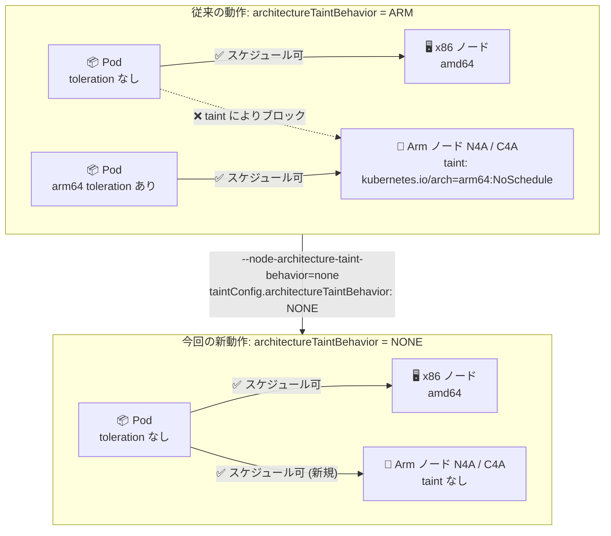

# Google Kubernetes Engine (GKE): Arm ノードのデフォルト architecture taint のオプトアウトに対応

**リリース日**: 2026-07-28

**サービス**: Google Kubernetes Engine (GKE)

**機能**: Arm ノードの デフォルト taint `kubernetes.io/arch=arm64:NoSchedule` のオプトアウト設定 (`--node-architecture-taint-behavior` / `taintConfig.architectureTaintBehavior`)

**ステータス**: Feature (一般提供)

📊 [このアップデートのインフォグラフィックを見る](https://takech9203.github.io/google-cloud-news-summary/20260728-gke-arm-architecture-taint-opt-out.html)

## 概要

GKE は従来、すべての Arm ノードに対して `kubernetes.io/arch=arm64:NoSchedule` という taint を自動的に付与していました。これは x86 (amd64) 専用のコンテナイメージを持つワークロードが、誤って Arm ノードにスケジュールされてしまうことを防ぐための安全機構です。この taint があるため、Arm ノードで Pod を動かすには対応する toleration が必要でした。

今回のアップデートにより、この**デフォルト taint の付与そのものをオプトアウト (無効化) できる**ようになりました。Standard ノードプールでは gcloud CLI の `--node-architecture-taint-behavior` フラグに `none` を指定し、カスタム ComputeClass では `taintConfig.architectureTaintBehavior` フィールドに `NONE` を指定します。これにより、明示的な Arm 用 toleration を持たないワークロードでも、N4A や C4A などの Arm ベースのマシンファミリー上にスケジュールできるようになります。

対象となるのは、マルチアーキテクチャ (multi-arch) イメージを利用しているワークロードや、x86 ノードと Arm ノードが混在する mixed-mode クラスタです。マルチアーキテクチャイメージであれば x86 でも Arm でも動作するため、アーキテクチャごとに toleration や nodeSelector を書き分ける必要がなくなり、スケジューリング設定を大幅に簡素化できます。一方で、Arm 非対応イメージが混在するクラスタでこの設定を有効にすると、非対応ワークロードが Arm ノードに配置され起動に失敗するリスクがあるため、適用範囲の見極めが重要です。

**アップデート前の課題**

- Arm ノードには常に `kubernetes.io/arch=arm64:NoSchedule` taint が付与され、この動作を変更する手段がなかった
- マルチアーキテクチャイメージを使っていて x86 / Arm のどちらでも動作するワークロードであっても、Arm ノードで動かすには `kubernetes.io/arch=arm64` に対する toleration を Pod 仕様に手動で追加する必要があった
- x86 ノードと Arm ノードが混在するクラスタでは、Pod ごとに toleration・nodeSelector・node affinity を書き分ける必要があり、マニフェストが煩雑になっていた
- 既存の x86 前提のマニフェスト群を Arm ノードでも動かしたい場合、多数の Deployment を一括で書き換える作業が発生していた

**アップデート後の改善**

- Standard ノードプール単位、またはカスタム ComputeClass 単位で、デフォルト taint の付与を `none` / `NONE` に設定してオプトアウトできるようになった
- toleration を持たないワークロードでも、そのまま N4A / C4A などの Arm ノードにスケジュールできるようになった
- マルチアーキテクチャワークロードや mixed-mode クラスタにおいて、Pod 仕様の変更なしに Arm ノードを活用できるようになった
- Standard ノードプールの taint 動作を変更した場合、GKE は**ノードを再作成せずに即座に taint を更新する**ため、既存ノードの入れ替えによるダウンタイムが不要になった

## アーキテクチャ図



デフォルト taint をオプトアウトすると、Arm 用 toleration を持たない Pod も Arm ノードのスケジューリング候補に含まれるようになります。この挙動はマルチアーキテクチャイメージ前提であり、x86 専用イメージが混在する環境では起動失敗を招く点に注意が必要です。

## サービスアップデートの詳細

### 主要機能

1. **Standard ノードプールでの taint 動作の設定 (`--node-architecture-taint-behavior`)**
   - gcloud CLI フラグ `--node-architecture-taint-behavior` で Arm ノードの taint 動作を指定する
   - 指定可能な値は `none` (デフォルト taint を付与しない) と `arm` (従来どおり `kubernetes.io/arch=arm64:NoSchedule` を付与する。デフォルト)
   - クラスタ作成時 (デフォルトノードプール向け)、ノードプール作成時、ノードプール更新時のいずれでも設定できる
   - コントロールプレーンが GKE バージョン **1.35.0-gke.2141000 以降**の Standard ノードプールでのみ設定可能
   - 設定変更時、GKE はノードを再作成せずに即座に taint を更新する

2. **カスタム ComputeClass での taint 動作の設定 (`taintConfig.architectureTaintBehavior`)**
   - ComputeClass の `spec.nodePoolConfig.taintConfig.architectureTaintBehavior` フィールドで指定する
   - 指定可能な値は `NONE` (デフォルト Arm taint を付与しない) と `ARM` (付与する。フィールド省略時のデフォルト)
   - `NONE` を指定すると、その ComputeClass を選択したワークロードは、Arm 用 toleration を持っていなくても ComputeClass 用に作成された Arm ノードで実行できる
   - クラスタが GKE バージョン **1.36.2-gke.1498000 以降**である必要がある

3. **Terraform からの設定 (`taint_config`)**
   - `google_container_node_pool` リソースの `node_config` 内に `taint_config` ブロックを追加し、`architecture_taint_behavior` に `NONE` または `ARM` を指定する
   - IaC による構成管理でも同機能を宣言的に適用できる

4. **Autopilot の Arm ワークロードは対象外**
   - この taint 動作の変更は Autopilot での Arm ワークロードのデプロイには適用されない
   - 組み込みの Autopilot Arm ComputeClass (`autopilot-arm` など) 用に GKE が作成するノードの taint 動作は変更できない

## 技術仕様

### 設定値の対応表

| 設定インターフェース | フィールド / フラグ | 値 (オプトアウト) | 値 (デフォルト) | 必要な GKE バージョン |
|------|------|------|------|------|
| gcloud CLI (Standard ノードプール) | `--node-architecture-taint-behavior` | `none` | `arm` | コントロールプレーン 1.35.0-gke.2141000 以降 |
| カスタム ComputeClass | `spec.nodePoolConfig.taintConfig.architectureTaintBehavior` | `NONE` | `ARM` (省略時) | 1.36.2-gke.1498000 以降 |
| Terraform | `node_config.taint_config.architecture_taint_behavior` | `NONE` | `ARM` | Standard ノードプールに準ずる |
| Autopilot 組み込み Arm ComputeClass | — | 設定不可 | — | — |

**注意**: gcloud CLI では小文字 (`none` / `arm`)、ComputeClass および Terraform では大文字 (`NONE` / `ARM`) を使用します。

### 対象となる taint

| 項目 | 詳細 |
|------|------|
| taint キー | `kubernetes.io/arch` |
| taint 値 | `arm64` |
| effect | `NoSchedule` |
| 付与対象 | すべての Arm ノード (Standard ノードプール、カスタム ComputeClass 用ノードを含む) |
| 対応するノードラベル | `kubernetes.io/arch: arm64` (Arm ノード) / `kubernetes.io/arch: amd64` (x86 ノード) |

### 対象の Arm マシンシリーズ

| マシンシリーズ | 概要 |
|------|------|
| C4A | Google Axion (Arm Neoverse V2 ベース) を採用した最初の Arm VM。最大 72 vCPU / 576 GB DDR5 メモリ。ベアメタルタイプ `c4a-standard-96-metal` / `c4a-highmem-96-metal` も提供 |
| N4A | Google Axion (Arm Neoverse N3 ベース) の最新 VM。最大 64 vCPU / 512 GB DDR5 メモリ。価格性能バランス重視 |
| T2A (Tau T2A) | Ampere Altra Arm プロセッサ搭載。水平スケールアウト型ワークロード向け |

### ComputeClass の設定例 (YAML)

```yaml
apiVersion: cloud.google.com/v1
kind: ComputeClass
metadata:
  name: multi-arch-class
spec:
  nodePoolConfig:
    # Arm ノードにデフォルトの kubernetes.io/arch=arm64:NoSchedule taint を付与しない
    taintConfig:
      architectureTaintBehavior: NONE
  nodePoolAutoCreation:
    enabled: true
  priorities:
    # 優先度 1: Arm (N4A) を優先
    - machineFamily: n4a
      minCores: 4
    # 優先度 2: Arm (C4A) にフォールバック
    - machineFamily: c4a
      minCores: 4
    # 優先度 3: x86 (N4) にフォールバック
    - machineFamily: n4
      minCores: 4
  whenUnsatisfiable: ScaleUpAnyway
```

この ComputeClass を選択した Pod は、toleration を明示しなくても N4A / C4A の Arm ノードにスケジュールされます。Arm の在庫がない場合は x86 (N4) にフォールバックします。

## 設定方法

### 前提条件

1. **GKE バージョン**
   - Standard ノードプールで設定する場合: コントロールプレーンが 1.35.0-gke.2141000 以降
   - カスタム ComputeClass で設定する場合: クラスタが 1.36.2-gke.1498000 以降
2. **Arm 対応イメージ**: 対象ワークロードのコンテナイメージが Arm (arm64) に対応しているか、マルチアーキテクチャイメージであること
3. **Arm VM が利用可能なロケーション**: クラスタが Arm VM (N4A / C4A / T2A) を提供するリージョン・ゾーンにあること
4. **クラスタ内の全ワークロードの互換性確認**: クラスタ内に Arm 非対応のワークロードが存在しないことを確認すること (存在する場合はデフォルト taint を外さない)

### 手順

#### ステップ 1: 既存ワークロードの Arm 互換性を確認する

```bash
# クラスタ内の Deployment で使用しているイメージを一覧化する
kubectl get deployments --all-namespaces \
  -o custom-columns='NS:.metadata.namespace,NAME:.metadata.name,IMAGE:.spec.template.spec.containers[*].image'

# 各イメージが arm64 に対応しているか manifest を確認する
docker manifest inspect IMAGE_NAME | grep -A2 architecture
```

マルチアーキテクチャイメージであれば `linux/amd64` と `linux/arm64` の両方のエントリが含まれます。1 つでも Arm 非対応のイメージがある場合、そのワークロードが Arm ノードにスケジュールされる可能性があるため、デフォルト taint を維持するか、別途 nodeSelector / node affinity で x86 に固定してください。

#### ステップ 2-A: Standard ノードプールでデフォルト taint をオプトアウトする

```bash
# 新規に Arm ノードプールを作成し、デフォルト taint を付与しない
gcloud container node-pools create arm-pool \
  --cluster=my-cluster \
  --location=us-central1 \
  --machine-type=n4a-standard-4 \
  --node-architecture-taint-behavior=none

# 既存の Arm ノードプールの taint 動作を変更する (ノード再作成は不要)
gcloud container node-pools update arm-pool \
  --cluster=my-cluster \
  --location=us-central1 \
  --node-architecture-taint-behavior=none

# 従来のデフォルト動作に戻す
gcloud container node-pools update arm-pool \
  --cluster=my-cluster \
  --location=us-central1 \
  --node-architecture-taint-behavior=arm
```

クラスタ作成時にデフォルトノードプールへ適用する場合は、`gcloud container clusters create` に同じフラグを指定します。

```bash
gcloud container clusters create my-arm-cluster \
  --location=us-central1 \
  --machine-type=c4a-standard-4 \
  --node-architecture-taint-behavior=none
```

#### ステップ 2-B: カスタム ComputeClass でデフォルト taint をオプトアウトする

```bash
cat <<'EOF' | kubectl apply -f -
apiVersion: cloud.google.com/v1
kind: ComputeClass
metadata:
  name: multi-arch-class
spec:
  nodePoolConfig:
    taintConfig:
      architectureTaintBehavior: NONE
  nodePoolAutoCreation:
    enabled: true
  priorities:
    - machineFamily: n4a
      minCores: 4
    - machineFamily: c4a
      minCores: 4
  whenUnsatisfiable: ScaleUpAnyway
EOF
```

#### ステップ 3: taint が外れていることを確認する

```bash
# ノードの taint 状態を確認する
kubectl get nodes -l kubernetes.io/arch=arm64 \
  -o custom-columns='NAME:.metadata.name,TAINTS:.spec.taints'

# 個別ノードの詳細確認
kubectl describe node NODE_NAME | grep -i taints
```

`kubernetes.io/arch=arm64:NoSchedule` が表示されなければオプトアウトが反映されています。

#### ステップ 4: toleration なしのワークロードをデプロイして検証する

```yaml
apiVersion: apps/v1
kind: Deployment
metadata:
  name: multi-arch-app
spec:
  replicas: 6
  selector:
    matchLabels:
      app: multi-arch-app
  template:
    metadata:
      labels:
        app: multi-arch-app
    spec:
      # ComputeClass を使う場合のみ以下の nodeSelector を指定する
      nodeSelector:
        cloud.google.com/compute-class: multi-arch-class
      containers:
        - name: app
          # マルチアーキテクチャ (linux/amd64 + linux/arm64) イメージであること
          image: REGION-docker.pkg.dev/PROJECT_ID/REPO/multi-arch-app:v1
          resources:
            requests:
              cpu: 500m
              memory: 512Mi
```

```bash
# Pod がどのアーキテクチャのノードに配置されたか確認する
kubectl get pods -l app=multi-arch-app -o wide
kubectl get nodes -o custom-columns='NAME:.metadata.name,ARCH:.status.nodeInfo.architecture'
```

toleration を一切書いていない Pod が arm64 ノードに配置されていれば、設定は期待どおり機能しています。

## メリット

### ビジネス面

- **Arm 移行の障壁低減**: 既存マニフェストの大規模な書き換えなしに Arm ノードを導入できるため、Arm 移行の初期コストと工数を削減できる
- **価格性能の改善余地**: Arm アーキテクチャは電力効率に優れ、Arm 互換ワークロードでは価格性能の最適化が期待できる。既存ワークロードを Arm ノードへ流し込みやすくなることで、この効果を得やすくなる
- **運用負荷の削減**: アーキテクチャごとのスケジューリング設定の書き分けが不要になり、マニフェスト管理と運用の複雑さが下がる

### 技術面

- **無停止での設定変更**: Standard ノードプールでは、taint 動作の変更時に GKE がノードを再作成せず即座に taint を更新するため、ノード入れ替えに伴う Pod の退避が発生しない
- **段階的な適用**: ノードプール単位・ComputeClass 単位で設定できるため、クラスタ全体を一括で切り替えるのではなく、検証済みワークロードの範囲から段階的に適用できる
- **キャパシティの柔軟性向上**: ComputeClass の優先度リストと組み合わせることで、Arm を優先しつつ在庫状況に応じて x86 にフォールバックする構成を、Pod 側の設定変更なしに実現できる
- **宣言的管理との親和性**: gcloud CLI、ComputeClass (Kubernetes CRD)、Terraform のいずれからも設定でき、既存の IaC / GitOps ワークフローに組み込める

## デメリット・制約事項

### 制限事項

- **Standard ノードプールとカスタム ComputeClass のみ対応**: Autopilot での Arm ワークロードのデプロイには適用されない。組み込みの Autopilot Arm ComputeClass 用に作成されるノードの taint 動作は変更できない
- **GKE バージョン要件**: Standard ノードプールはコントロールプレーン 1.35.0-gke.2141000 以降、カスタム ComputeClass はクラスタ 1.36.2-gke.1498000 以降が必要
- **ComputeClass のフィールド配置制約**: ComputeClass では `nodePoolConfig` 配下の設定であり、優先度 (priority) 単位ではなく ComputeClass 全体に適用される
- **Arm マシンシリーズ側の機能制約は解消されない**: C4A / N4A では Confidential GKE Nodes、コンパクト配置、SMT、Persistent Disk (Hyperdisk を使用)、ネストされた仮想化、GPU が非対応。N4A ではローカル SSD と 1 GB hugepages も非対応
- **Config Connector / Config Controller**: Arm ノードプールを持つクラスタではサポートされない
- **リージョン制約**: Arm ノードは Arm アーキテクチャをサポートする Google Cloud のロケーションでのみ利用可能

### 考慮すべき点

- **マルチアーキテクチャ非対応イメージのスケジューリングリスク (最重要)**: デフォルト taint は x86 専用イメージが Arm ノードに配置されるのを防ぐ安全機構です。これを `none` / `NONE` にすると、Arm 非対応のワークロードが Arm ノードにスケジュールされ、`exec format error` などでコンテナが起動に失敗する、あるいは `CrashLoopBackOff` に陥る可能性があります。公式ドキュメントも「クラスタ内に Arm 非対応のワークロードが存在する場合はデフォルト taint を削除しないこと」を明示しています
- **クラスタ全体のイメージ棚卸しが前提**: 自作アプリケーションだけでなく、Helm チャートで導入したミドルウェア、監視エージェント、サイドカー、DaemonSet、Init コンテナなど、クラスタで動作するすべてのイメージについて arm64 対応を確認する必要があります
- **サードパーティイメージの追加リスク**: 運用開始後に Arm 非対応のサードパーティイメージを追加すると、想定外に Arm ノードへ配置されて障害となり得ます。Gatekeeper / Policy Controller などのポリシー制御や、CI でのイメージ manifest 検証を併用する運用設計が望まれます
- **代替手段としての明示的な制御**: taint を外す代わりに、マルチアーキテクチャ対応 Pod 側へ `kubernetes.io/arch=arm64` の toleration を付与する、あるいは node affinity で `arm64` と `amd64` の両方を許可する従来の方法も引き続き有効です。クラスタ内に非対応ワークロードが混在する場合はこちらが安全です
- **段階的な検証の推奨**: まず専用のノードプールまたは ComputeClass を作成して検証済みワークロードのみ流し、問題がないことを確認してから適用範囲を広げる進め方が安全です
- **ロールバック手段の確保**: `--node-architecture-taint-behavior=arm` (または ComputeClass の `ARM`) に戻すことで従来動作に復帰できます。Standard ノードプールでは即座に taint が再付与されますが、すでに Arm ノード上で稼働している非対応 Pod の扱いは別途対応が必要です

## ユースケース

### ユースケース 1: マルチアーキテクチャイメージによる Arm 段階導入

**シナリオ**: すべてのアプリケーションイメージを `docker buildx` でマルチアーキテクチャ (linux/amd64 + linux/arm64) としてビルド済みの環境で、コスト最適化のために Arm ノードを導入したい。ただし数十の Deployment すべてに toleration を追記する変更は避けたい。

**実装例**:
```bash
# Arm ノードプールを追加し、デフォルト taint を付与しない
gcloud container node-pools create n4a-pool \
  --cluster=prod-cluster \
  --location=us-central1 \
  --machine-type=n4a-standard-8 \
  --num-nodes=3 \
  --node-architecture-taint-behavior=none
```

**効果**: 既存の Deployment マニフェストを 1 行も変更せずに、Pod が x86 ノードと Arm ノードの両方に分散配置されるようになる。Arm の価格性能メリットを、アプリケーション側の変更工数ゼロで享受できる。

### ユースケース 2: ComputeClass による Arm 優先・x86 フォールバック構成

**シナリオ**: バッチ処理ワークロードを可能な限り Arm ノード (N4A) で実行してコストを抑えたいが、Arm の在庫が確保できないゾーンでは x86 ノードで実行を継続したい。

**実装例**:
```yaml
apiVersion: cloud.google.com/v1
kind: ComputeClass
metadata:
  name: batch-arm-preferred
spec:
  nodePoolConfig:
    taintConfig:
      architectureTaintBehavior: NONE
  nodePoolAutoCreation:
    enabled: true
  priorities:
    - machineFamily: n4a
      minCores: 8
      spot: true
    - machineFamily: c4a
      minCores: 8
      spot: true
    - machineFamily: n4
      minCores: 8
      spot: true
  whenUnsatisfiable: ScaleUpAnyway
```

```yaml
# Job 側は ComputeClass を選択するだけ。toleration や arch の記述は不要
apiVersion: batch/v1
kind: Job
metadata:
  name: nightly-batch
spec:
  template:
    spec:
      nodeSelector:
        cloud.google.com/compute-class: batch-arm-preferred
      containers:
        - name: batch
          image: REGION-docker.pkg.dev/PROJECT_ID/REPO/batch:v2
      restartPolicy: Never
```

**効果**: Job 側の記述を最小限に保ちながら、Arm 優先・x86 フォールバックのキャパシティ戦略を ComputeClass 側で一元管理できる。Spot VM との組み合わせでさらなるコスト削減が可能。

### ユースケース 3: mixed-mode クラスタでのスケジューリング簡素化

**シナリオ**: x86 ノードプールと Arm ノードプールが混在するクラスタで、共通の監視サイドカーやサービスメッシュのプロキシ (いずれもマルチアーキテクチャ対応) を全ノードで動作させたい。

**効果**: デフォルト taint をオプトアウトすることで、DaemonSet や自動注入されるサイドカーに Arm 用 toleration を付与するための Webhook 設定やパッチ運用が不要になり、mixed-mode クラスタの構成管理が単純化される。ただしサイドカーを含むすべてのイメージが arm64 に対応していることが前提となる。

## 料金

この taint 動作の設定自体に追加料金は発生しません。ノードプールおよび ComputeClass の構成オプションとして提供されます。

課金は従来どおり以下の要素で構成されます。

- **GKE クラスタ管理手数料**: Standard / Autopilot のエディションに応じたクラスタ単位の料金
- **ノードの Compute Engine 料金**: Arm ノード (N4A / C4A / T2A) のマシンタイプ、vCPU / メモリ、ディスク (Hyperdisk) の使用量に応じた料金。Spot VM や確約利用割引 (CUD) の適用も可能

なお、Arm ベースのマシンシリーズは電力効率に優れ、Arm 互換ワークロードにおいて価格性能の改善が期待できるとドキュメントに記載されています。具体的な単価は下記の料金ページを参照してください。

## 利用可能リージョン

- Arm ノードは、Arm アーキテクチャをサポートする Google Cloud のロケーションで利用可能です。マシンタイプごとの提供状況は [利用可能なリージョンとゾーン](https://docs.cloud.google.com/compute/docs/regions-zones#available) のフィルタ可能な表で確認できます
- 本機能自体はバージョン要件 (Standard ノードプール: コントロールプレーン 1.35.0-gke.2141000 以降 / カスタム ComputeClass: 1.36.2-gke.1498000 以降) を満たすクラスタで利用できます

## 関連サービス・機能

- **カスタム ComputeClass**: `nodePoolConfig.taintConfig` を通じて本機能を設定するインターフェース。優先度リストによる Arm 優先・x86 フォールバックの構成と組み合わせると効果的
- **ノード自動プロビジョニング (NAP) / クラスタオートスケーラー**: ComputeClass の `nodePoolAutoCreation` と併用して Arm ノードプールを自動作成する際、taint 動作の設定が自動作成されたノードプールにも適用される
- **Compute Engine Arm マシンシリーズ (N4A / C4A / T2A)**: 本機能が対象とするノードの実体。C4A と N4A は Google Axion プロセッサベース
- **Artifact Registry / Cloud Build (docker buildx)**: マルチアーキテクチャイメージのビルドと保管。本機能を安全に使う前提となる arm64 対応イメージの準備に必要
- **Terraform (google_container_node_pool)**: `node_config.taint_config.architecture_taint_behavior` により IaC から宣言的に設定可能
- **Policy Controller / Gatekeeper**: Arm 非対応イメージのデプロイを検出・ブロックするガードレールとして併用が推奨される
- **Hyperdisk**: C4A / N4A では Persistent Disk が非対応のため、永続ボリュームには Hyperdisk を使用する

## 参考リンク

- 📊 [インフォグラフィック](https://takech9203.github.io/google-cloud-news-summary/20260728-gke-arm-architecture-taint-opt-out.html)
- [公式リリースノート (GKE)](https://cloud.google.com/kubernetes-engine/docs/release-notes)
- [Configure the default Arm architecture taint (Standard ノードプール)](https://docs.cloud.google.com/kubernetes-engine/docs/how-to/prepare-arm-workloads-for-deployment#configure-default-taint)
- [Configure the default Arm architecture taint (カスタム ComputeClass)](https://docs.cloud.google.com/kubernetes-engine/docs/concepts/about-custom-compute-classes#architecture-taint)
- [ComputeClass CustomResourceDefinition (taintConfig)](https://docs.cloud.google.com/kubernetes-engine/docs/reference/crds/computeclass#taintConfig)
- [Prepare an Arm workload for deployment](https://docs.cloud.google.com/kubernetes-engine/docs/how-to/prepare-arm-workloads-for-deployment)
- [Arm workloads on GKE (要件と制限事項)](https://docs.cloud.google.com/kubernetes-engine/docs/concepts/arm-on-gke)
- [Deploy Autopilot workloads on Arm architecture](https://docs.cloud.google.com/kubernetes-engine/docs/how-to/autopilot-arm-workloads)
- [Build multi-architecture images for Arm workloads](https://docs.cloud.google.com/kubernetes-engine/docs/how-to/build-multi-arch-for-arm)
- [Migrate x86 application on GKE to multi-arch with Arm](https://docs.cloud.google.com/kubernetes-engine/docs/tutorials/migrate-x86-to-multi-arch-arm)
- [Arm VMs on Compute Engine](https://docs.cloud.google.com/compute/docs/instances/arm-on-compute)
- [gcloud container node-pools create --node-architecture-taint-behavior](https://docs.cloud.google.com/sdk/gcloud/reference/container/node-pools/create#--node-architecture-taint-behavior)
- [Troubleshooting Arm workloads](https://docs.cloud.google.com/kubernetes-engine/docs/troubleshooting/troubleshooting-arm-workloads)
- [GKE 料金ページ](https://cloud.google.com/kubernetes-engine/pricing)
- [Compute Engine 料金ページ](https://cloud.google.com/compute/all-pricing)

## まとめ

Arm ノードのデフォルト taint をノードプール単位・ComputeClass 単位でオプトアウトできるようになったことで、マルチアーキテクチャイメージを整備済みの環境では、既存マニフェストを変更せずに Arm ノードを活用できるようになりました。Standard ノードプールではノード再作成なしで即座に taint が更新されるため、導入・切り戻しのコストも低く抑えられます。

一方で、この taint は x86 専用イメージの誤配置を防ぐ安全機構であり、無効化するとアーキテクチャ非互換によるコンテナ起動失敗のリスクが生じます。適用前にサイドカーや DaemonSet を含むクラスタ内の全イメージについて arm64 対応を棚卸しし、検証用のノードプールまたは ComputeClass から段階的に適用することを推奨します。

---

**タグ**: GKE, Google Kubernetes Engine, Arm, arm64, Axion, N4A, C4A, T2A, Taint, Toleration, ComputeClass, スケジューリング, マルチアーキテクチャ, multi-arch, Standard クラスタ, ノードプール, Terraform, コスト最適化
