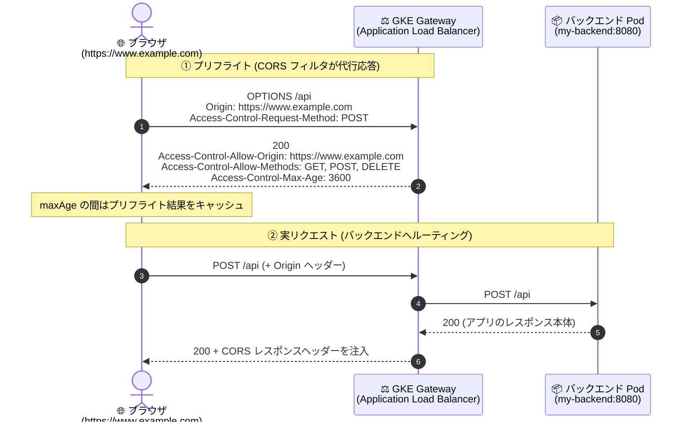

# Google Kubernetes Engine (GKE): GKE Gateway / Inference Gateway が CORS フィルタをサポート

**リリース日**: 2026-07-28

**サービス**: Google Kubernetes Engine (GKE) — GKE Gateway / GKE Inference Gateway

**機能**: HTTPRoute の CORS フィルタによる Cross-Origin Resource Sharing (CORS) 設定

**ステータス**: Preview (GKE 1.35 以降)

📊 [このアップデートのインフォグラフィックを見る](https://takech9203.github.io/google-cloud-news-summary/20260728-gke-gateway-cors-support.html)

## 概要

GKE Gateway および GKE Inference Gateway が Cross-Origin Resource Sharing (CORS) をサポートしました。Gateway API が標準化したポータブルな構文を使い、HTTPRoute リソースに `type: CORS` のフィルタを直接記述することで、CORS ポリシーを宣言的に設定できます。GKE バージョン 1.35 以降で Preview として提供され、対象の GatewayClass は `gke-l7-rilb`、`gke-l7-regional-external-managed`、`gke-l7-global-external-managed` の 3 つです。

CORS はブラウザが実装するセキュリティ機構で、あるオリジン (ドメイン) で動作する Web アプリケーションが別のオリジンにホストされたリソースへ安全にアクセスできるようにするものです。今回の機能では、CORS フィルタを設定するとロードバランサ (Application Load Balancer) 側が適切な CORS レスポンスヘッダーを注入し、さらに CORS プリフライト (`OPTIONS`) リクエストへの応答を代行します。つまり、これまでバックエンドのアプリケーションが負っていた CORS 処理の責務をエッジ側にオフロードできます。

対象ユーザーは、SPA やモバイル Web フロントエンドと GKE 上の API を別ドメインで運用しているチーム、および GKE Inference Gateway でブラウザから直接 LLM 推論エンドポイントを呼び出すような生成 AI アプリケーションのチームです。Gateway API の標準フィルタであるため、他の Gateway API 実装 (Ingress NGINX からの移行を含む) との設定の可搬性が高い点も特徴です。

**アップデート前の課題**

- CORS 処理をアプリケーション側で実装する必要があった。各バックエンドサービスが `Access-Control-Allow-Origin` などのレスポンスヘッダー生成と `OPTIONS` プリフライトへの応答を自前で実装・維持する必要があり、マイクロサービスごとに実装が重複・分散しがちだった。
- GKE Gateway の HTTPRoute では CORS を宣言的に設定する手段がなく、`filters` で利用できたのは `requestHeaderModifier`、`responseHeaderModifier`、`requestMirror`、`requestRedirect`、`urlRewrite` のみだった。
- カスタムリクエストヘッダーによる回避も制限されていた。GKE Gateway のドキュメントには「HTTPRoute のカスタムリクエストヘッダーを設定する際、Google Cloud 変数 `origin_request_header` はサポートされない」と明記されており、ヘッダー操作でオリジンを条件分岐させる方法は取れなかった。
- 結果として、CORS を集中管理したい場合はカスタムのバックエンド/プロキシ (サイドカーや専用のリバースプロキシ、サービスメッシュのフィルタなど) を挟む構成が必要で、運用コストと追加ホップが発生していた。
- Ingress NGINX からの移行時にギャップとなっていた。Ingress NGINX の `nginx.ingress.kubernetes.io/enable-cors` アノテーションに相当する GKE Gateway の機能が存在しなかった。

**アップデート後の改善**

- HTTPRoute の `filters` に `type: CORS` を追加するだけで CORS ポリシーを設定できるようになった。アプリケーションコードの変更なしに、Kubernetes マニフェストとして宣言的に管理できる。
- プリフライト (`OPTIONS`) リクエストへの応答をロードバランサが代行するようになった。プリフライトが Pod まで到達しなくなるため、バックエンドの実装負荷とリクエスト処理量が削減される (ただし後述の `gke-l7-global-external-managed` の Preview 期間中の例外あり)。
- CORS レスポンスヘッダーの注入がロードバランサ側で行われるようになり、バックエンドごとに実装が分散する問題が解消された。
- Gateway API 標準の構文を使うため設定が可搬になった。Ingress NGINX の CORS アノテーションに対する機能パリティが確立され、移行時のギャップが埋まった。
- GKE Inference Gateway でも同じ CORS フィルタが使えるようになり、`InferencePool` を backendRef とする HTTPRoute に対して CORS を設定できるようになった。

## アーキテクチャ図



HTTPRoute の CORS フィルタにより、プリフライト `OPTIONS` はロードバランサが直接応答して Pod に到達せず、実リクエストのレスポンスにはロードバランサが CORS ヘッダーを注入します。

## サービスアップデートの詳細

### 主要機能

1. **HTTPRoute の CORS フィルタ (Gateway API 標準構文)**
   - `spec.rules[].filters[]` に `type: CORS` と `cors` ブロックを指定して CORS ポリシーを定義する。
   - Gateway API 上流の `HTTPRouteCORS` は Extended support 機能で、Standard Channel には v1.5.0 から含まれる。GKE では 1.35.2-gke.1842000 以降のクラスタで Gateway API 1.5.0 が提供される。
   - GatewayClass capabilities のフィルタ一覧で、`cors` が `gke-l7-global-external-managed`、`gke-l7-regional-external-managed`、`gke-l7-rilb` の対応フィルタとして追加されている。

2. **プリフライト (`OPTIONS`) 応答のオフロード**
   - CORS フィルタを設定すると、ロードバランサがプリフライトリクエストに直接応答し、CORS レスポンスヘッダーを注入する。バックエンドサービスからこの責務が切り離される。

3. **GKE Inference Gateway での CORS 設定**
   - `InferencePool` (`group: inference.networking.k8s.io`) を backendRef とする HTTPRoute に対しても、同じ CORS フィルタを適用できる。推論エンドポイントをブラウザから直接呼ぶ構成で有効。

4. **柔軟なオリジン指定 (ワイルドカードパターン対応)**
   - 明示的なオリジン、キャッチオール `*`、および `https://*.domain.com` のようなワイルドカードパターンをサポートする。

## 技術仕様

### `cors` ブロックのフィールド

| フィールド | 詳細 |
|------|------|
| `allowOrigins` | 許可するオリジンのリスト。`http` / `https` プロトコルに対応。明示的なオリジン (例: `https://www.example.com`)、単一のキャッチオールワイルドカード `*` (使用時は他のオリジンを併記不可)、ワイルドカードパターン (例: `https://*.domain.com`) を指定できる。`*` はスキーム (`http://` / `https://`) の直後に置き、その後にドット (`http://*.domain.com`)、ポート (`https://*:4433`) が続くか、末尾の文字である (`http://*`) 必要がある |
| `allowMethods` | CORS リクエストで許可する HTTP メソッド。ワイルドカード `*` で全メソッド許可 (使用時は他のメソッドを併記不可) |
| `allowHeaders` | クライアントが送信を許可される HTTP ヘッダー。ワイルドカード `*` で全ヘッダー許可 (使用時は他のヘッダーを併記不可) |
| `exposeHeaders` | クライアントスクリプトに公開して安全な HTTP ヘッダー。ワイルドカード `*` で全ヘッダー公開が可能 |
| `allowCredentials` | Cookie や HTTP 認証を含む credentialed mode のリクエストに対し、ブラウザがサーバーレスポンスを共有できるかを制御する。デフォルトは `false` |
| `maxAge` | ブラウザがプリフライトレスポンスをキャッシュできる秒数。デフォルトは 5 秒。値は 1 以上 |

### `allowCredentials` に関するセキュリティ上の注意 (公式ドキュメント記載)

- `allowMethods`、`allowHeaders`、`exposeHeaders` のいずれかに `*` ワイルドカードを指定した場合、`allowCredentials: true` であってもブラウザは credentialed mode のリクエストに対するレスポンスをブロックする。
- `allowOrigins` に `*` ワイルドカードを含む場合、GKE Gateway コントローラは `*` をそのままレスポンスヘッダーにコピーしない。そのためブラウザは credentialed mode のレスポンスをブロックせず、悪意のあるサイトがユーザーデータにアクセスできてしまう可能性がある。この理由から、`allowCredentials: true` と `allowOrigins` の `*` の組み合わせは強く非推奨とされている。

### HTTPRoute のマニフェスト例

`https://www.example.com` からのクロスオリジンリクエストを、特定のメソッドとヘッダーに限って許可する例です。

```yaml
apiVersion: gateway.networking.k8s.io/v1
kind: HTTPRoute
metadata:
  name: route-with-cors
  namespace: default
spec:
  parentRefs:
  - name: my-gateway
  rules:
  - matches:
    - path:
        type: PathPrefix
        value: /api
    backendRefs:
    - name: my-backend
      port: 8080
    filters:
    - type: CORS
      cors:
        allowOrigins:
        - "https://www.example.com"
        allowMethods:
        - GET
        - POST
        - DELETE
        allowHeaders:
        - "x-request-header-1"
        - "x-request-header-2"
        exposeHeaders:
        - "x-response-header-a"
        - "x-response-header-b"
        allowCredentials: true
        maxAge: 3600
```

### Before / After の比較

| 観点 | アップデート前 | アップデート後 |
|------|----------------|----------------|
| CORS ヘッダーの生成 | 各バックエンドアプリケーションが実装 | ロードバランサが注入 |
| プリフライト (`OPTIONS`) 応答 | アプリケーションが処理 | ロードバランサが代行応答 |
| 集中管理 | カスタムバックエンド/プロキシの追加が必要 | HTTPRoute マニフェストで宣言的に管理 |
| 設定の可搬性 | 実装依存 (アノテーション等) | Gateway API 標準の CORS フィルタ |

## 設定方法

### 前提条件

1. GKE バージョン 1.35 以降のクラスタ (Gateway API 1.5.0 の CORS フィルタを使うには 1.35.2-gke.1842000 以降)。
2. 対象の GatewayClass のいずれかを使う単一クラスタ Gateway: `gke-l7-rilb`、`gke-l7-regional-external-managed`、`gke-l7-global-external-managed`。
3. Gateway API CRD が有効化された GKE クラスタ (Autopilot ではデフォルトで有効)。GKE Gateway は Gateway API の Standard release channel のみをサポートする。
4. バックエンドの Service (または GKE Inference Gateway の場合は `InferencePool`) と、それを参照する HTTPRoute。

### 手順

#### ステップ 1: クラスタと GatewayClass を確認する

```bash
# クラスタの GKE バージョンを確認
gcloud container clusters describe CLUSTER_NAME \
  --location=LOCATION \
  --format="value(currentMasterVersion)"

# 利用可能な GatewayClass を確認
kubectl get gatewayclass
```

`gke-l7-rilb`、`gke-l7-regional-external-managed`、`gke-l7-global-external-managed` のいずれかが `ACCEPTED=True` であることを確認します。

#### ステップ 2: CORS フィルタ付きの HTTPRoute を適用する

```bash
# 上記の route-with-cors マニフェストを保存して適用
kubectl apply -f httproute-cors.yaml

# HTTPRoute が Gateway に受け入れられたか確認
kubectl describe httproute route-with-cors
```

`Accepted` 条件が `True` になれば、ロードバランサへ設定が反映されます。

#### ステップ 3: プリフライトリクエストで動作を確認する

```bash
# Gateway の IP アドレスを取得
kubectl get gateway my-gateway -o jsonpath='{.status.addresses[0].value}'

# プリフライト (OPTIONS) を送って CORS レスポンスヘッダーを確認
curl -i -X OPTIONS "http://GATEWAY_IP/api" \
  -H "Origin: https://www.example.com" \
  -H "Access-Control-Request-Method: POST"
```

レスポンスに `Access-Control-Allow-Origin`、`Access-Control-Allow-Methods`、`Access-Control-Max-Age` が含まれていれば、ロードバランサがプリフライトに応答しています。

## メリット

### ビジネス面

- **開発工数の削減**: CORS の実装・検証をアプリケーションごとに行う必要がなくなり、プラットフォーム層で一元的に提供できる。マイクロサービスの数が多い環境では重複実装の削減効果が大きい。
- **設定変更のリードタイム短縮**: 許可オリジンの追加や変更が、アプリケーションの再ビルド・再デプロイなしに HTTPRoute の更新だけで完了する。
- **移行コストの低減**: Ingress NGINX の `enable-cors` アノテーションに対する機能パリティが確立されたことで、GKE Gateway への移行時に CORS が阻害要因にならない。

### 技術面

- **バックエンド負荷の軽減**: プリフライト `OPTIONS` がロードバランサで終端されるため、Pod が処理するリクエスト数が減る。
- **宣言的・GitOps 親和性**: CORS ポリシーが Kubernetes マニフェストとして表現されるため、レビュー・バージョン管理・監査が容易になる。
- **設定の可搬性**: Gateway API 標準の CORS フィルタであり、実装固有のアノテーションに依存しない。
- **プリフライトのブラウザキャッシュ制御**: `maxAge` により、ブラウザ側のプリフライトキャッシュ時間を明示的に制御できる (デフォルト 5 秒)。
- **推論エンドポイントへの適用**: GKE Inference Gateway の `InferencePool` に対しても同じ仕組みで CORS を設定できる。

## デメリット・制約事項

### 制限事項

公式ドキュメントに記載されている制限は以下のとおりです。

- **Preview 段階**: 本機能は Preview であり、「Pre-GA Offerings Terms」が適用される。現状のまま提供され、サポートが限定される可能性がある。
- **単一クラスタ Gateway のみ**: マルチクラスタ Gateway では CORS はサポートされない (`-mc` サフィックスの GatewayClass は対象外)。
- **`RequestRedirect` との併用不可**: 同一のルートルール内で CORS フィルタと `RequestRedirect` フィルタを併用できない。
- **正規表現の上限**: GKE Gateway コントローラは `allowOrigins` のワイルドカードパターンを内部的に正規表現として表現するため、正規表現の使用上限の影響を受ける。
  - `gke-l7-global-external-managed`: Gateway リスナーごとに正規表現は 1 つのみ (他機能と共有)。二重カウントの規則が適用されるため、ワイルドカードパターンと `PathPrefix` マッチの組み合わせはサポートされない。
  - `gke-l7-regional-external-managed` および `gke-l7-rilb`: ホスト名ごとに最大 5 つの正規表現 (他機能と共有)。
  - キャッチオールワイルドカード `*` はこの上限にカウントされない。
  - CORS フィルタ内の単一のワイルドカードパターンが上限に対して複数回カウントされることがある。コントローラは HTTPRoute ルール内の CORS フィルタをそのルールのマッチ数で乗算し、さらに `PathPrefix` タイプのマッチはパスが `/` でない限り 2 回カウントされる。
- **マッチしないプリフライトリクエストの扱い**: `gke-l7-global-external-managed` では、設定された許可オリジンにマッチしない CORS プリフライト (`OPTIONS`) リクエストは、ロードバランサが直接応答せず Pod に転送される。この挙動は Preview 期間中の一時的なものとドキュメントに明記されている。

### 考慮すべき点

- **`allowOrigins: "*"` と `allowCredentials: true` の併用は強く非推奨**: 前述のとおり、ブラウザがレスポンスをブロックしないため、任意のサイトがユーザーデータにアクセスできる可能性がある。
- **`maxAge` のデフォルトは 5 秒と短い**: 明示的に設定しない場合、ブラウザはプリフライト結果をほとんどキャッシュせず、プリフライトが頻発する。実運用では用途に応じた値の設定を検討する。
- **`gke-l7-global-external-managed` でのワイルドカード利用は設計上の制約が大きい**: リスナーあたり正規表現 1 つという制約と二重カウント規則により、パスプレフィックスマッチとワイルドカードオリジンの併用ができない。グローバル構成では明示的なオリジン列挙を基本に設計するのが安全。
- **アプリ側の既存 CORS 実装との二重適用**: ゲートウェイとアプリの双方が CORS ヘッダーを付与すると、ヘッダーの重複により想定外の挙動になり得る。移行時はアプリ側の実装を無効化するかどうかを整理する。
- **Preview のため本番採用は慎重に**: GA 前の機能であり、挙動 (特にマッチしないプリフライトの転送) が変更される可能性がある。

## ユースケース

### ユースケース 1: 別ドメインの SPA から GKE 上の API を呼び出す

**シナリオ**: フロントエンド SPA を `https://www.example.com` (Cloud Storage / Firebase Hosting などで配信) にホストし、API は GKE 上のマイクロサービス群で `https://api.example.com` として公開している。各 API サービスが個別に CORS ヘッダーと `OPTIONS` ハンドラを実装しており、許可オリジンを追加するたびに全サービスの再デプロイが必要になっていた。

**実装例**:
```yaml
apiVersion: gateway.networking.k8s.io/v1
kind: HTTPRoute
metadata:
  name: api-cors
  namespace: default
spec:
  parentRefs:
  - name: external-gateway
  hostnames:
  - "api.example.com"
  rules:
  - matches:
    - path:
        type: PathPrefix
        value: /v1
    backendRefs:
    - name: api-service
      port: 8080
    filters:
    - type: CORS
      cors:
        allowOrigins:
        - "https://www.example.com"
        allowMethods:
        - GET
        - POST
        - PUT
        - DELETE
        allowHeaders:
        - "content-type"
        - "authorization"
        allowCredentials: true
        maxAge: 3600
```

**効果**: CORS ポリシーが Gateway 層に集約され、許可オリジンの変更が HTTPRoute の更新のみで完結する。プリフライトはロードバランサで終端され、Pod に到達しない。

### ユースケース 2: GKE Inference Gateway の推論エンドポイントをブラウザから直接呼び出す

**シナリオ**: GKE Inference Gateway で `InferencePool` (vLLM などのモデルサーバー) を公開し、ブラウザベースのチャット UI から推論 API を直接呼び出したい。モデルサーバーのコンテナイメージに手を入れて CORS 対応を追加するのは避けたい。

**実装例**:
```yaml
apiVersion: gateway.networking.k8s.io/v1
kind: HTTPRoute
metadata:
  name: inference-route
spec:
  parentRefs:
  - name: inference-gateway
  rules:
  - matches:
    - path:
        type: PathPrefix
        value: /
    backendRefs:
    - name: vllm-llama3-8b-instruct
      group: inference.networking.k8s.io
      kind: InferencePool
    filters:
    - type: CORS
      cors:
        allowOrigins:
        - "https://chat.example.com"
        allowMethods:
        - POST
        allowHeaders:
        - "content-type"
        - "authorization"
        maxAge: 3600
```

**効果**: モデルサーバーのイメージを変更せずに、Gateway 層で CORS を制御できる。推論リクエストのプリフライトが GPU/TPU バックエンドに到達しないため、貴重なアクセラレータリソースを無駄な `OPTIONS` 処理に使わない。

### ユースケース 3: Ingress NGINX から GKE Gateway への移行

**シナリオ**: セルフマネージドの Ingress NGINX で `nginx.ingress.kubernetes.io/enable-cors` を使って CORS を設定していたが、マネージドな GKE Gateway へ移行したい。従来は CORS が移行のブロッカーだった。

**効果**: Ingress NGINX の CORS アノテーションに対して GKE Gateway の CORS フィルタで機能パリティが確立されたため、CORS 設定を Gateway API 標準構文に置き換えて移行できる。ただし移行ガイドには、GKE Gateway はリスナー/ホスト名あたりに定義できるワイルドカードパターン数に制限を課す点が注記されている。

## 料金

GKE Gateway の CORS フィルタは、HTTPRoute の設定項目として提供される機能です。Release Notes およびドキュメントには、CORS フィルタ固有の追加課金に関する記載はありません。

実際に発生するコストは、GKE クラスタと、Gateway が背後にプロビジョニングする Application Load Balancer (転送ルール、処理データ量など) の通常料金に従います。正確な料金は以下の公式料金ページで確認してください。

- [GKE の料金](https://cloud.google.com/kubernetes-engine/pricing)
- [Cloud Load Balancing の料金](https://cloud.google.com/vpc/network-pricing#lb)

なお、プリフライト `OPTIONS` リクエストがロードバランサで終端されることで、バックエンド Pod が処理するリクエスト数は減少します。

## 利用可能リージョン

本機能はリージョン単位で個別に提供されるものではなく、対応する GKE バージョンと GatewayClass の利用可否に依存します。

| GatewayClass | ロードバランサ | スコープ |
|--------------|----------------|----------|
| `gke-l7-global-external-managed` | グローバル外部 Application Load Balancer | グローバル |
| `gke-l7-regional-external-managed` | リージョン外部 Application Load Balancer | リージョン |
| `gke-l7-rilb` | 内部 Application Load Balancer | リージョン |

- 対象は上記 3 つの単一クラスタ GatewayClass のみで、マルチクラスタ (`-mc`) GatewayClass および `gke-l7-gxlb` は対象外です。
- 必要な GKE バージョンは 1.35 以降 (Gateway API 1.5.0 は 1.35.2-gke.1842000 以降で提供)。

## 関連サービス・機能

- **Gateway API (Kubernetes SIG-Network)**: CORS フィルタは上流の Gateway API が標準化した `HTTPRouteCORS` 機能。Extended support 機能であり、Standard Channel には v1.5.0 から含まれる。
- **Cloud Load Balancing (Application Load Balancer)**: GKE Gateway が背後でプロビジョニングするロードバランサ。CORS レスポンスヘッダーの注入とプリフライト応答を実行する主体。
- **GKE Inference Gateway**: GKE Gateway を拡張した生成 AI 推論向けのゲートウェイ。`InferencePool` を backendRef とする HTTPRoute でも CORS フィルタが利用できる。
- **Identity-Aware Proxy (IAP)**: GKE Gateway のバックエンド認証手段。`GCPBackendPolicy` で構成する。なお IAP は Cloud CDN と非互換である点がドキュメントに注記されている。
- **Cloud CDN for Gateway**: `GCPHTTPFilter` によるエッジキャッシング。CORS と同様に Gateway 層で処理をオフロードする機能群のひとつ。
- **GKE Gateway Service Extensions (`GCPTrafficExtension` / `GCPRoutingExtension` / `GCPWasmPlugin`)**: より高度なカスタムロジックが必要な場合の選択肢。CORS のような標準的な要件は CORS フィルタで完結する。
- **Ingress NGINX**: 移行元として比較対象になるコントローラ。`nginx.ingress.kubernetes.io/enable-cors` アノテーションに対して CORS フィルタが機能パリティを提供する。

## 参考リンク

- 📊 [インフォグラフィック](https://takech9203.github.io/google-cloud-news-summary/20260728-gke-gateway-cors-support.html)
- [公式リリースノート (Google Kubernetes Engine)](https://cloud.google.com/kubernetes-engine/docs/release-notes)
- [Configure Cross-Origin Resource Sharing (CORS) — GKE Gateway のデプロイ](https://docs.cloud.google.com/kubernetes-engine/docs/how-to/deploying-gateways#configure-cors)
- [Cross-Origin Resource Sharing (CORS) — Gateway API 上流ユーザーガイド](https://gateway-api.sigs.k8s.io/guides/user-guides/http-cors/)
- [GatewayClass capabilities (サポートされる HTTPRoute フィルタ一覧)](https://docs.cloud.google.com/kubernetes-engine/docs/how-to/gatewayclass-capabilities)
- [Gateway トラフィック管理](https://docs.cloud.google.com/kubernetes-engine/docs/concepts/traffic-management)
- [Gateway のセキュリティ](https://docs.cloud.google.com/kubernetes-engine/docs/how-to/secure-gateway)
- [Ingress NGINX から GKE Gateway への移行](https://docs.cloud.google.com/kubernetes-engine/docs/how-to/migrate-ingress-gateway)
- [GKE Inference Gateway で LLM を配信する](https://docs.cloud.google.com/kubernetes-engine/docs/tutorials/serve-with-gke-inference-gateway)
- [GKE の料金](https://cloud.google.com/kubernetes-engine/pricing)

## まとめ

GKE Gateway / Inference Gateway の CORS フィルタは、これまでアプリケーションやカスタムプロキシが担っていた CORS ヘッダー生成とプリフライト応答を、Gateway API 標準の宣言的な設定でロードバランサへオフロードできるようにする実用性の高いアップデートです。特に別ドメインの SPA から GKE 上の API を呼ぶ構成や、ブラウザから推論エンドポイントを直接呼ぶ生成 AI アプリケーションで、実装の重複と運用負荷を大きく削減できます。

一方で Preview 段階であり、単一クラスタ Gateway 限定、`RequestRedirect` との併用不可、`allowOrigins` のワイルドカードに対する正規表現数の上限 (特に `gke-l7-global-external-managed` ではリスナーあたり 1 つ) といった制約があります。まずは GKE 1.35 以降の検証クラスタで、明示的なオリジン列挙を基本とした構成で挙動を確認し、`maxAge` のデフォルト 5 秒やアプリ側の既存 CORS 実装との重複を整理した上で、GA を見据えた移行計画を立てることを推奨します。

---

**タグ**: GKE, Google Kubernetes Engine, GKE Gateway, GKE Inference Gateway, Gateway API, HTTPRoute, CORS, Cross-Origin Resource Sharing, Application Load Balancer, Cloud Load Balancing, Kubernetes, Preview, ネットワーキング
