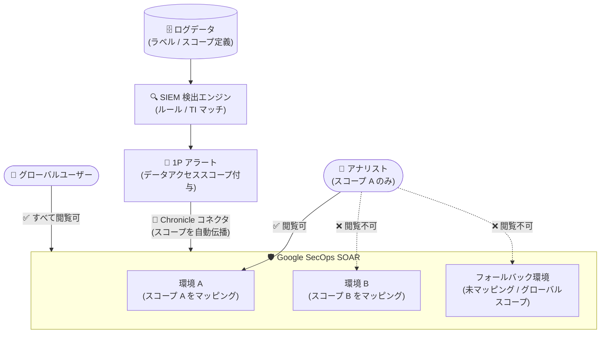

# Google SecOps: ファーストパーティ (1P) ケース・アラートへの Data RBAC 対応

**リリース日**: 2026-07-28

**サービス**: Google SecOps (Google Security Operations)

**機能**: ファーストパーティ (1P) SOAR ケース・アラートに対するデータロールベースアクセス制御 (Data RBAC)

**ステータス**: Public Preview (全リージョン)

📊 [このアップデートのインフォグラフィックを見る](https://takech9203.github.io/google-cloud-news-summary/20260728-google-secops-data-rbac-1p-cases-alerts.html)

## 概要

Google SecOps が、ファーストパーティ (1P) SOAR ケースとアラートに対するデータロールベースアクセス制御 (Data RBAC) をサポートしました。1P アラートとは、Google SecOps SIEM の検出エンジン (ルール、脅威インテリジェンスマッチ、セキュリティ分析など) が生成した検出結果が、Chronicle コネクタ経由で SOAR コンポーネントに取り込まれたものを指し、これらがグループ化されて 1P ケースを形成します。

今回のアップデートにより、SIEM 側で定義したデータアクセススコープが、Chronicle コネクタで取り込まれるアラートとケースに自動的に適用されるようになりました。基盤となるイベントのデータスコープが SOAR コンポーネントへ伝播されるため、アナリストは自分がアクセスを許可されたデータに由来するアラート・ケースのみを閲覧できます。たとえば、財務データへのアクセス権を持つユーザーは財務データに関連するアラート・ケースのみを閲覧でき、顧客連絡先データに関連するものは閲覧できません。

SIEM と SOAR にまたがる一貫したデータガバナンスを実現したい Google SecOps 管理者と、コンプライアンス要件 (部門別・テナント別のデータ分離など) を持つ SOC チームが主な対象です。本機能は Pre-GA Offerings Terms が適用される Public Preview として、全リージョンで利用可能です。

**アップデート前の課題**

- SIEM 側では Data RBAC によりスコープベースのデータアクセス制御が可能だったが、SIEM の検出結果が Chronicle コネクタ経由で SOAR に取り込まれると、スコープによる制御が SOAR 側のケース・アラートには適用されなかった
- SOAR 環境へのアクセス権を持つアナリストは、本来閲覧を許可されていないデータに由来するアラート・ケースも閲覧できる可能性があった
- 部門やデータ種別ごとの閲覧制限をケース管理まで一貫して適用するには、環境分離などの運用上の工夫に頼る必要があった

**アップデート後の改善**

- SIEM のデータアクセススコープが Chronicle コネクタで取り込まれる 1P アラート・ケースに自動的に伝播され、SIEM から SOAR までエンドツーエンドでデータアクセス制御を適用できるようになった
- SIEM スコープを SOAR 環境にマッピングすることで、スコープ付きアラートを対応する環境へ自動ルーティングできるようになった
- ケースはグループ化されたアラートの全スコープを継承し、ユーザーはケースの全スコープと環境の両方の権限を持つ場合のみアクセス可能という明確なアクセス評価ロジックが提供された
- ケース管理 UI (ケースヘッダー、List cases テーブルの Data access scopes 列) でスコープの確認・フィルタリングが可能になった

## アーキテクチャ図



SIEM 検出エンジンが付与したデータアクセススコープが Chronicle コネクタ経由で SOAR に伝播され、スコープと環境のマッピングに基づいてケース・アラートの可視性が制御されるセキュリティ境界を示しています。

## サービスアップデートの詳細

### 主要機能

1. **SIEM データアクセススコープの SOAR への自動伝播**
   - SIEM 検出ルールが付与したデータアクセススコープが、Chronicle コネクタで取り込まれる 1P アラートに引き継がれる
   - ケースは関連付けられた全アラートのスコープの和集合 (union) を自動的に継承する (例: Alert 1 がスコープ A、Alert 2 がスコープ B の場合、ケースはスコープ A と B の両方を継承)

2. **スコープと SOAR 環境のマッピング**
   - SOAR Settings > Environments で SIEM スコープを SOAR 環境に関連付け可能
   - 1 つのスコープは 1 つの環境にのみマッピング可能、1 つの環境には複数スコープをマッピング可能
   - マッピングされたスコープを持つ SIEM アラートは対応する環境へ自動割り当てされ、Chronicle コネクタの環境設定より優先される
   - スコープなし (グローバル) またはマッピングされていないスコープのアラートは、Chronicle コネクタで定義されたフォールバック環境にルーティングされる

3. **厳密なアクセス評価ロジック**
   - ケース・アラートへアクセスするには、リソースに割り当てられた「SOAR 環境」と「すべてのデータアクセススコープ」の両方の権限が必要
   - グローバルユーザーはスコープフィルタリングをバイパスし、すべてのケースを閲覧可能
   - グローバルスコープが付与されたケースはグローバルユーザーのみ閲覧可能

4. **ケース管理 UI でのスコープ可視化**
   - ケースヘッダーの Environment フィールド横に、割り当てスコープが読み取り専用ラベルとして表示される
   - List cases テーブルに Data access scopes 列が追加され、スコープ名によるフィルタリングが可能

## 技術仕様

### 1P アラートと 3P アラートの違い

| 項目 | 詳細 |
|------|------|
| 1P アラート | SIEM 検出エンジン (ルール、TI マッチ、セキュリティ分析) が生成し、Chronicle コネクタで SOAR に取り込まれるアラート。SIEM データアクセススコープの適用対象 |
| 3P アラート | 外部セキュリティツール (サードパーティのファイアウォールや EDR など) から別の SOAR インテグレーションで直接取り込まれるアラート。SIEM 検出エンジンを経由せず、SIEM データアクセススコープの適用対象外 |

### アクセス評価のシナリオ (抜粋)

| ケースのスコープ | ユーザーのスコープ | アクセス可否 | 理由 |
|------|------|------|------|
| スコープ 1 | スコープ 1 | 可 | ケースの単一スコープにアクセス権あり |
| スコープ 1 + スコープ 2 | スコープ 1 のみ | 不可 | ケースの全スコープへのアクセス権が必要 |
| スコープ 1 + スコープ 2 | スコープ 1 + スコープ 2 | 可 | ケースの全スコープにアクセス権あり |
| グローバル | スコープ 1 (スコープ付きユーザー) | 不可 | グローバルスコープのケースはグローバルユーザー専用 |
| 任意 | グローバルユーザー | 可 | グローバルユーザーはスコープフィルタリングをバイパス |

### ケースグループ化とエンティティのスコープルール

| ルール | 詳細 |
|------|------|
| グループ化の境界 | アラートは、マッピングされたスコープが同一環境にルーティングされる場合のみ、同じケースにグループ化される |
| スコープの蓄積 | 異なるスコープのアラートが同一環境で 1 つのケースにグループ化されると、ケースはそれらすべてのスコープを継承する |
| スコープなしアラートの影響 | フォールバック環境でスコープなしアラートがスコープ付きアラートとグループ化されると、ケースはグローバルスコープを継承し、グローバルユーザーのみ閲覧可能になる |
| Unique entities | 出現するすべてのアラートのスコープを継承する |
| Involved entities | 親アラートのスコープのみを継承する |
| Overflow ケース | 複数スコープにまたがるアラートをグループ化するため、グローバルスコープが割り当てられ、グローバルユーザーのみ閲覧可能 |

## 設定方法

### 前提条件

1. Google SecOps インスタンスが unified (SIEM と SOAR の両方が有効) であること
2. Chronicle コネクタが最新の Chronicle API を使用していること (レガシーの Backstory API を使用している場合は、本機能の有効化前にアップグレードが必要)
3. 複数の SIEM インスタンスを単一 SOAR インスタンスに接続している場合、スコープの伝播と適用は Primary SIEM インスタンスにのみ適用される (セカンダリ SIEM インスタンスのスコープは SOAR 側で無視される)
4. 有効化の操作には Chronicle API Admin ロール (Google Cloud IAM) が必要

### 手順

#### シナリオ A: SIEM でデータアクセス制御をすでに適用済みの場合

1. Google SecOps にサインインする
2. **SIEM Settings > Data Access** でスコープが正しく構成されていることを確認する
3. Google Cloud コンソールの IAM でユーザーにデータスコープを割り当てる
4. **SIEM Settings > Data Access** で **Enable Data Access in SOAR** をクリックする
5. SIEM スコープを SOAR 環境にマッピングする

これにより、新規のアラート・ケースに加え、SIEM Data Access の適用開始後に作成された既存のアラート・ケースにも適用されます。

#### シナリオ B: SIEM でデータアクセス制御が未適用の場合

1. Google SecOps にサインインする
2. **SIEM Settings > Data Access** でスコープが正しく構成されていることを確認する
3. Google Cloud コンソールの IAM でユーザーにデータスコープを割り当てる
4. **SIEM Settings > Data Access** で **Enforce Data Access** をクリックする (SIEM と SOAR の両方で同時に適用が有効化される)
5. SIEM スコープを SOAR 環境にマッピングする

#### スコープと環境のマッピング

1. **SOAR Settings > Environments** で環境設定ページを開く
2. 既存環境を選択するか、**Add Environment** をクリックする
3. **Data access scopes** フィールドで必要な SIEM スコープを選択する (1 スコープは 1 環境のみ、1 環境に複数スコープ可)
4. **Save** をクリックして適用する (反映まで最大 30 秒)

## メリット

### ビジネス面

- **コンプライアンス強化**: 役割と責任に基づいてデータ可視性を制限でき、データガバナンスポリシーをケース管理まで一貫して適用できる
- **データ露出リスクの低減**: アナリストが認可されていないデータ (他部門の機密データなど) に由来するアラート・ケースを閲覧できなくなる
- **部門別・組織別の SOC 運用**: 財務、人事など部門ごとのデータ分離を、検出からインシデント対応まで通して維持できる

### 技術面

- **自動的なスコープ伝播**: SIEM で定義したスコープが Chronicle コネクタ経由で自動適用されるため、SOAR 側で個別のアクセス制御を二重管理する必要がない
- **環境ルーティングの自動化**: スコープと環境のマッピングにより、アラートが適切な SOAR 環境へ自動的に振り分けられる
- **IAM との統合**: スコープ割り当ては Google Cloud IAM (Chronicle API Restricted Data Access ロールなど) を通じて一元管理できる

## デメリット・制約事項

### 制限事項

- Public Preview (Pre-GA) であり、Pre-GA Offerings Terms が適用される。サポートが限定される場合があり、他の Pre-GA バージョンとの互換性が保証されない
- unified インスタンス (SIEM + SOAR) 専用。3P アラート (外部ツールから SOAR に直接取り込まれるアラート) は SIEM データアクセススコープの適用対象外
- マルチ SIEM 構成では Primary SIEM インスタンスのスコープのみが適用され、セカンダリ SIEM のアラートは環境アクセス権を持つ任意のユーザーに可視となる
- Chronicle コネクタがレガシー Backstory API のままでは利用できない (Chronicle API へのアップグレードが必須)

### 考慮すべき点

- スコープなしアラートとスコープ付きアラートがフォールバック環境でグループ化されると、ケースがグローバルスコープとなりスコープ付きユーザーから見えなくなるため、スコープ設計とマッピングの網羅性が重要
- SIEM 側でスコープを削除すると SOAR 環境から自動的にマッピング解除され、過去のケース・アラートはグローバルユーザーのみアクセス可能になる
- スコープのマッピング変更時、既存のアラート・ケースは元の環境に残るため、移行時の可視性への影響を事前に検証する必要がある
- Data RBAC 有効化時、キュレーテッド検出、Triage Agent、生ログ、UEBA などはグローバルスコープユーザーのみ利用可能となる点に注意
- マッピング変更や初回有効化の反映には最大 30 秒かかる

## ユースケース

### ユースケース 1: 部門別データ分離を伴う SOC 運用

**シナリオ**: 財務部門と人事部門のログを同一の Google SecOps インスタンスに取り込んでいる企業で、各部門担当のアナリストには自部門のデータに由来するアラート・ケースのみを閲覧させたい。

**実装例**:
```
1. SIEM Settings > Data Access で「finance-scope」「hr-scope」を定義
   (ログタイプ / namespace / カスタムラベルでデータを分類)
2. IAM で各アナリストに Chronicle API Restricted Data Access ロールと
   対応するスコープを割り当て
3. SOAR 環境「Finance-Env」「HR-Env」を作成し、各スコープをマッピング
4. Enable Data Access in SOAR で適用を有効化
```

**効果**: 財務担当アナリストは財務データ由来のアラート・ケースのみを閲覧でき、人事データへの意図しないアクセスを防止。検出からケース対応まで一貫した最小権限を実現。

### ユースケース 2: MSSP / マルチテナント型のケース管理

**シナリオ**: 複数の顧客 (テナント) のデータを単一の unified インスタンスで監視するチームが、顧客ごとにアラート・ケースの可視性を分離したい。

**効果**: 顧客ごとのスコープを対応する SOAR 環境にマッピングすることで、SIEM 検出由来のアラートが顧客専用環境に自動ルーティングされ、担当アナリスト以外には見えない状態を維持できる。グローバルユーザー (SOC マネージャーなど) は全体を横断的に監視可能。

## 料金

本機能自体の追加料金に関する公式情報は確認できませんでした。Google SecOps の料金の詳細は公式ページを参照してください。

- [Google Security Operations の料金](https://cloud.google.com/security/products/security-operations#pricing)

## 利用可能リージョン

すべてのリージョンで利用可能 (Public Preview)。

## 関連サービス・機能

- **Google SecOps SIEM (Data RBAC)**: 本機能の基盤。ラベル (ログタイプ、namespace、ingestion metadata、カスタムラベル) によるデータアクセススコープの定義と、allow / deny ラベルによる可視性制御を提供
- **Google SecOps SOAR (Chronicle コネクタ)**: SIEM 検出を SOAR に取り込むコネクタ。本機能ではスコープ伝播の経路となり、フォールバック環境の決定にも関与
- **Cloud IAM**: Chronicle API Restricted Data Access ロール (`roles/chronicle.restrictedDataAccess`) や IAM Conditions を用いたスコープのユーザー割り当てに使用
- **Google SecOps Triage Agent**: AI によるアラートトリアージ機能。Data RBAC 有効時はグローバルデータアクセス権を持つユーザーのみが利用可能

## 参考リンク

- 📊 [インフォグラフィック](https://takech9203.github.io/google-cloud-news-summary/20260728-google-secops-data-rbac-1p-cases-alerts.html)
- [公式リリースノート](https://docs.cloud.google.com/release-notes#July_28_2026)
- [Google SecOps リリースノート](https://docs.cloud.google.com/chronicle/docs/secops/release-notes#July_06_2026)
- [Control access to 1P cases and alerts (公式ドキュメント)](https://docs.cloud.google.com/chronicle/docs/administration/datarbac-impact-cases)
- [Overview of data RBAC](https://docs.cloud.google.com/chronicle/docs/administration/datarbac-overview)
- [Configure data RBAC](https://docs.cloud.google.com/chronicle/docs/administration/configure-datarbac-users)
- [Impact of data RBAC on Google SecOps features](https://docs.cloud.google.com/chronicle/docs/administration/datarbac-impact)
- [料金ページ](https://cloud.google.com/security/products/security-operations#pricing)

## まとめ

SIEM で定義したデータアクセススコープが SOAR のケース・アラートまで自動伝播されるようになり、Google SecOps における検出からインシデント対応までのエンドツーエンドなデータガバナンスが実現しました。部門別・テナント別のデータ分離要件を持つ組織は、Chronicle コネクタの Chronicle API へのアップグレード状況を確認のうえ、スコープ設計と SOAR 環境マッピングの検証を Public Preview の段階から始めることを推奨します。

---

**タグ**: #GoogleSecOps #DataRBAC #SOAR #SIEM #アクセス制御 #セキュリティ #PublicPreview
