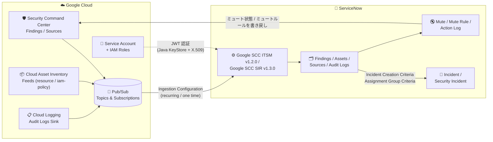

# Security Command Center: Google SCC ITSM アプリ v1.2.0 / Google SCC SIR アプリ v1.3.0 リリースと ServiceNow 連携ガイドの更新

**リリース日**: 2026-07-28

**サービス**: Security Command Center

**機能**: ServiceNow 連携アプリ (Google SCC ITSM v1.2.0 / Google SCC SIR v1.3.0)

**ステータス**: Feature (一般提供)

📊 [このアップデートのインフォグラフィックを見る](https://takech9203.github.io/google-cloud-news-summary/20260728-security-command-center-servicenow-apps-update.html)

## 概要

Security Command Center (SCC) の ServiceNow 連携アプリがバージョンアップし、**Google SCC ITSM アプリが v1.2.0**、**Google SCC SIR アプリが v1.3.0** としてリリースされました。これに合わせて公式ドキュメント「Send Security Command Center data to ServiceNow」が更新され、サポート対象の ServiceNow バージョン、新機能、証明書セットアップ手順、トラブルシューティングの各セクションが刷新されています。

SCC の ServiceNow 連携は、SCC が検出した **Findings (検出結果)**、**Assets (アセット)**、**Audit logs (監査ログ)**、**Security sources (セキュリティソース)** の 4 種類のデータを ServiceNow へ自動的にエクスポートし、ServiceNow 側でインシデントとして管理・トリアージできるようにする仕組みです。今回のアップデートで特に大きいのは、**ServiceNow 側から SCC の検出結果をミュート/アンミュートしたり、ミュートルールを作成できるようになった点** です。これまで ServiceNow は SCC データの「受け取り側」に近い位置づけでしたが、ServiceNow から SCC へ書き戻す双方向のワークフローが公式手順として整備されました。

対象となるのは、Google Cloud のセキュリティ運用を ServiceNow の ITSM または SIR (Security Incident Response) 上で一元管理している組織です。SOC アナリストが ServiceNow のコンソールから離れずに SCC の検出結果を処理できるようになるため、ツール間のコンテキストスイッチを削減できます。

**アップデート前の課題**

- ServiceNow から取り込んだ検出結果を誤検知と判断しても、ミュート操作のために Google Cloud コンソールまたは SCC API へ戻る必要があった
- ミュートルール (今後同種の検出結果を自動的にミュートするルール) を ServiceNow の画面から作成する手順が用意されていなかった
- CI (Configuration Item) ルックアップルールの作成は Guided Setup のフロー内でしか案内されておらず、運用開始後に手動で追加・調整する手順が明示されていなかった
- ミュート操作やミュートルールの変更について、「誰がいつ何を実行したか」を ServiceNow 側で追跡する専用のログがなかった
- サポート対象の ServiceNow バージョンが旧世代 (Rome、San Diego、Tokyo など) の記載を含み、最新リリースへの対応状況が不明瞭だった
- Java KeyStore 証明書の作成手順や、ECC Queue タイムアウト・最大実行時間超過といった実運用で遭遇するエラーの対処法が十分に整備されていなかった

**アップデート後の改善**

- ServiceNow の Findings 画面から検出結果を直接ミュート/アンミュートでき、その状態が SCC 側に反映されるようになった
- ServiceNow 上でミュートルール (Static / Dynamic) を作成でき、ServiceNow で削除すると SCC 側のルールも削除される
- CI ルックアップルールを Guided Setup 外から手動で新規作成できる手順が明文化された
- ミュート関連の操作履歴を確認できる **Action Log** が追加された
- サポート対象 ServiceNow バージョンが **Australia / Zurich / Yokohama** に整理された
- Java KeyStore 証明書のセットアップ手順が更新され、ServiceNow 公式ドキュメントへの参照が明示された
- 「Maximum execution time exceeded」「Unable to collect data」「ECC Queue Timeout Error」の 3 つのトラブルシューティング項目が追加された

## アーキテクチャ図



SCC・Cloud Asset Inventory・Cloud Logging のデータが Pub/Sub 経由で ServiceNow アプリに取り込まれ、条件に合致した検出結果が Incident (ITSM) または Security Incident (SIR) として起票されます。今回のアップデートで追加されたミュート機能により、ServiceNow から SCC へ状態を書き戻す経路 (図右下から SCC への矢印) が新たに確立されました。

## サービスアップデートの詳細

### ITSM アプリと SIR アプリの違い

2 つのアプリは「どの ServiceNow 製品ラインと統合するか」で使い分けます。SCC からのデータ取り込みの仕組みは共通ですが、起票されるレコードの種類、必要なロール、備わっている機能が異なります。

| 項目 | Google SCC ITSM アプリ (v1.2.0) | Google SCC SIR アプリ (v1.3.0) |
|------|--------------------------------|-------------------------------|
| 統合先 ServiceNow 製品 | ServiceNow IT Service Management (ITSM) | ServiceNow Security Incident Response (SIR) |
| ServiceNow Store での検索名 | `Google SCC ITSM` | `Google SCC SIR` |
| 起票されるレコード | Incident (「Create Incident」ボタン) | Security Incident (「Create Security Incident」ボタン) |
| 起票条件の設定項目名 | Incident Creation Criteria | Security Incident Creation Criteria |
| 管理者ロール | `x_goog_scc_itsm.Google_SCC_ITSM_Admin`<br/>`itil` / `itil_admin` / `personalize_dictionary` / `oauth_admin` | `x_goog_scc_sir.Google_SCC_SIR_Admin`<br/>`sn_si.admin` / `oauth_admin` |
| 一般ユーザーロール | `x_goog_scc_itsm.Google_SCC_ITSM_User`<br/>`itil` | `x_goog_scc_sir.Google_SCC_SIR_User`<br/>`sn_si.analyst` |
| ダッシュボード | Overview / Sources / Findings / Assets / Audit Logs の 5 種 | ダッシュボードページを利用可能 |
| 想定ユーザー | IT 運用チーム (ヘルプデスク、変更管理と連携) | セキュリティ運用チーム / SOC アナリスト |

なお公式ドキュメントでは、今回追加された **ミュート/アンミュート、ミュートルール作成、CI ルックアップルールの手動作成、Action Log の 4 機能は「Google SCC SIR アプリ」の機能として記載** されています。一方で「検出結果の状態変更 (Active / Inactive)」「手動でのインシデント作成」「アプリケーションログの表示」「アプリのアンインストール」は ITSM / SIR 双方に共通の手順として記載されています。

### 新機能の一覧

| 新機能 | 概要 | 必要なロール | ナビゲーション |
|--------|------|-------------|---------------|
| 検出結果のミュート / アンミュート | 検出結果を開き、`Mute Finding` / `Unmute Finding` をクリック。理由の説明を入力すると SCC 側のミュート状態が変更される。リストビューで複数選択した場合は説明が全件に適用される | `Google_SCC_SIR_Admin` または `Google_SCC_SIR_User` | Google SCC SIR > Findings |
| ミュートルールの作成 | 条件に合致する検出結果を自動的にミュートするルールを作成。ServiceNow で削除すると SCC 側でも削除される | `Google_SCC_SIR_Admin` または `Google_SCC_SIR_User` | Google SCC SIR > Mute Rule |
| CI ルックアップルールの手動作成 | CMDB を検索して検出結果に対応する Configuration Item を特定するルールを、Guided Setup 外から新規作成 | `Google_SCC_SIR_Admin` | Google SCC SIR > CI Lookup Rules |
| Action Log の表示 | ミュート/アンミュート操作およびミュートルールの変更履歴を Action / User / Record / Date の 4 項目で表示 | `Google_SCC_SIR_Admin` | Google SCC SIR > Action Log |

### 主要機能

1. **検出結果のミュート / アンミュート**
   - ミュート状態が `Undefined` または `Unmuted` の場合は `Mute Finding` ボタン、`Muted` の場合は `Unmute Finding` ボタンが表示される
   - 入力した説明は Google Cloud コンソール上の検出結果の **security marks** に反映され、実行した ServiceNow ユーザー名も含まれる
   - SCC 側でミュート状態を変更した場合は、**次回のデータ収集後** に ServiceNow へ反映される (即時ではない)

2. **ミュートルールの作成**
   - 設定項目: `Name`、`Description`、`Authentication Configuration`、`Query` (フィルタークエリ)、`Type`
   - `Type` は 2 種類 — **Static**: 今後の検出結果のみをミュート / **Dynamic**: 既存および今後の検出結果をミュート
   - 送信すると、ルール名の先頭に `servicenow-<ユーザーのフルネーム>` というプレフィックスが自動付与される
   - 成否に応じて情報メッセージとアプリケーションログのエントリが生成される

3. **CI ルックアップルールの手動作成**
   - `Lookup method` は `Field Matching` または `Script` を選択
   - `Source Field` (検出結果データ側の入力フィールド)、`Search On Field` / `Search On Table` (CMDB 側の検索対象) を指定
   - Field Matching の場合、CMDB 側の検索対象フィールドは **文字列または数値型でなければならない**
   - Script の場合、スクリプトは一致した Configuration Item の **システム ID (`sys_id`) を返す必要がある**
   - `Order` により他ルールとの評価順序を制御

4. **Action Log**
   - 記録される内容: ミュートルールの作成・更新・削除、検出結果のミュート/アンミュート
   - 表示項目: `Action` (実行された操作)、`User` (実行者のユーザー名)、`Record` (対象レコードへの参照)、`Date` (実行日時)
   - 監査・コンプライアンス対応で「誰が例外扱いを承認したか」を追跡する用途に利用できる

5. **サポート対象 ServiceNow バージョンの更新**
   - **Australia**、**Zurich**、**Yokohama** の 3 バージョンをサポート
   - Rome、San Diego、Tokyo などの旧バージョンを利用している場合は、最新のサポート対象バージョンへの移行が推奨される

## 技術仕様

### データフローとコンポーネント

| データ種別 | Google Cloud 側の設定 | ServiceNow 側の設定項目 |
|-----------|---------------------|----------------------|
| Findings (検出結果) | SCC API を有効化し、検出結果の通知フィルターを作成して Pub/Sub トピックへエクスポート | `Findings Subscription Id` (定期収集時) |
| Assets (アセット) | Cloud Asset API を有効化し、`content-type=resource` と `content-type=iam-policy` の 2 つのフィードを **同一の** Pub/Sub トピックに作成 (Findings とは別トピック) | `Asset Subscription Id` |
| Sources (セキュリティソース) | Findings を有効化すると自動的に有効になる | `Sources` タブで `Enabled` を選択 |
| Audit logs (監査ログ) | Pub/Sub を宛先とするログシンクを作成 | `Audit Logs Subscription Id` |

Findings を有効にすると Assets と Sources も自動的に有効になります。また、One Time Data Collection (単発のデータ収集) は **監査ログをサポートしません**。

### 必要な IAM ロール

サービスアカウントには、プロジェクトレベルと組織レベルで以下のロールを付与します。

| スコープ | ロール |
|---------|-------|
| プロジェクト (Pub/Sub トピックを作成したプロジェクト) | `roles/pubsub.editor` (Pub/Sub Editor) |
| 組織 | `roles/securitycenter.adminEditor` (Security Center Admin Editor) |
| 組織 | `roles/securitycenter.notificationConfigEditor` (Security Center Notification Configurations Editor) |
| 組織 | `roles/resourcemanager.organizationViewer` (Organization Viewer) |
| 組織 | `roles/cloudasset.viewer` (Cloud Asset Viewer) |

### 認証構成 (JWT ベース)

ServiceNow から SCC API を呼び出すための認証は、サービスアカウントキーを Java KeyStore (`.jks`) に変換し、X.509 証明書 → JWT キー → JWT プロバイダー → 認証構成の順に設定します。

| 設定オブジェクト | 主な設定値 |
|-----------------|-----------|
| X.509 Certificate | `Format`: `PEM` / `Type`: `Java Key Store` / `.jks` ファイルを添付 |
| JWT Key | `Signing Keystore`: 上記証明書名 / `Signing Algorithm`: `RSA 256` / `Signing Key`: `.jks` のパスワード |
| JWT Provider | `Expiry Interval (sec)`: `60` / `Signing Configuration`: 上記 JWT キー名 |
| Authentication Configuration | `Organization ID`: Google Cloud の組織 ID / `Base URL`: `https://securitycenter.googleapis.com` / `Client Email`: IAM 資格情報のメールアドレス / `JWT Provider`: 上記プロバイダー名 |

Authentication Configuration の Submit 時に `Authentication Successful` メッセージが表示されれば接続成功です。

### システムプロパティ (トラブルシューティングで参照)

| プロパティ | 推奨値 | 用途 |
|-----------|-------|------|
| `Number of max retries for an invalid response from Google SCC (in numbers)` | `3` (再接続失敗時は 3 より大きい値) | SCC からの不正レスポンス時のリトライ回数 |
| `Time window to wait before making another request after reaching request limit (in milliseconds)` | `60000` | リクエスト上限到達後の待機時間 |
| `com.glide.ecc.agent_response_timeout` (Global スコープで新規作成、型 `integer`) | `3600` 以上 | ECC Queue Timeout Error の解消 |
| `glide.history.max_entries` | `250` より大きい値 | インシデントへの Work notes / Activities が 250 件を超える場合 |

## 設定方法

### 前提条件

1. ServiceNow のシステム管理者権限 (アプリのインストール、ユーザー作成、認証構成に必要)
2. サポート対象の ServiceNow バージョン (Australia / Zurich / Yokohama) を利用していること
3. Security Command Center API および Cloud Asset API が有効化されていること
4. Findings 用と Assets 用に **別々の** Pub/Sub トピックとサブスクリプションが作成済みであること
5. 上記 IAM ロールを付与したサービスアカウントと、その JSON 形式のキーを取得済みであること
6. Google Cloud の組織 ID と Pub/Sub サブスクリプション名を把握していること

> **注意**: サービスアカウントキーは適切に管理しないとセキュリティリスクとなります。秘密鍵の保護については「Best practices for managing service account keys」を参照してください。組織のポリシーによりキーの作成が無効化されている場合があります。また、外部ソースから取得したキーは使用前に検証が必要です。

### 手順

#### ステップ 1: Google Cloud 側の設定

```bash
# SCC API と Cloud Asset API を有効化
gcloud services enable securitycenter.googleapis.com cloudasset.googleapis.com

# Findings 用と Assets 用に別々の Pub/Sub トピックを作成
gcloud pubsub topics create scc-findings-topic
gcloud pubsub topics create scc-assets-topic
gcloud pubsub topics create scc-auditlogs-topic

# サブスクリプションを作成
gcloud pubsub subscriptions create scc-findings-sub --topic=scc-findings-topic
gcloud pubsub subscriptions create scc-assets-sub   --topic=scc-assets-topic
gcloud pubsub subscriptions create scc-auditlogs-sub --topic=scc-auditlogs-topic
```

Assets 用トピックには、リソース用と IAM ポリシー用の 2 つの Cloud Asset Inventory フィードを作成します。IAM ポリシー用フィードでは `content-type=iam-policy` と `--asset-types="cloudresourcemanager.googleapis.com/Project"` を指定します。

#### ステップ 2: Java KeyStore 証明書の準備

サービスアカウントキーの JSON ファイルから Java KeyStore 証明書を作成します。手順は ServiceNow 公式ドキュメントの「Create a Java KeyStore certificate」を参照します (今回のアップデートでこのセクションの手順が更新されています)。

#### ステップ 3: ServiceNow アプリのインストールと Guided Setup

1. ServiceNow Store で `Google SCC ITSM` または `Google SCC SIR` を検索して取得・インストール
2. 管理者用・一般ユーザー用の 2 アカウントを作成し、前掲のロールを割り当て
3. `Guided Setup` から `Authentication Configuration` → `Incident Configuration` の順に設定
4. CI Lookup Rule、Ingestion Configuration、Incident Creation Criteria、Assignment Group Criteria を設定
5. `Activate Ingestion Configuration` で `Active` を選択し、`Collect Data` をクリック

#### ステップ 4: データ取得の確認

`Ingestion Configuration` の状態を確認し、`Assets` / `Findings` / `Sources` / `Audit Logs` の各テーブルにレコードが追加されていることを確認します。自動インシデント作成を設定した場合は、条件に合致した検出結果に対してインシデントが作成されているかを確認します。

## メリット

### ビジネス面

- **ツール間の往復削減**: 誤検知と判断した検出結果を ServiceNow 上でそのままミュートできるため、Google Cloud コンソールへ切り替える必要がなくなり、アナリストのトリアージ工数を削減できる
- **監査対応の強化**: Action Log により「誰がいつどの検出結果をミュートしたか」を ServiceNow 内で追跡可能。ミュート理由も security marks 経由で Google Cloud 側に残るため、両者で証跡が突き合わせられる
- **最新 ServiceNow への追随**: Australia / Zurich / Yokohama への対応が明示されたことで、ServiceNow プラットフォームのアップグレード計画を立てやすくなった

### 技術面

- **ミュートルールによる恒久対処**: 個別のミュートではなく Static / Dynamic のミュートルールを ServiceNow から作成できるため、既知の例外 (承認済みの構成など) によるノイズを継続的に抑制できる
- **CMDB との紐付けの柔軟性**: CI ルックアップルールを手動で追加でき、Field Matching だけでなく Script による柔軟なマッチングロジックを実装できる
- **運用障害の切り分けが容易**: ECC Queue タイムアウト、データ収集失敗、ダッシュボードの最大実行時間超過という頻出エラーの手順が文書化され、原因調査の時間を短縮できる
- **ルールのライフサイクル同期**: ServiceNow で作成したミュートルールを削除すると SCC 側でも削除されるため、両システムのルール定義が乖離しにくい

## デメリット・制約事項

### 制限事項

- 1 回の API 呼び出しで取得できるのは、**アセット・検出結果・ソース・監査ログの合計で最大 1,000 件**
- Findings API のレスポンスが `429` または `5xx` の場合、アプリは **60 秒後に 3 回まで** リトライする。それでも失敗するとプロセスが失敗する
- One Time Data Collection (単発のデータ収集) は **監査ログをサポートしない**
- ミュート/アンミュート、ミュートルール、CI ルックアップルールの手動作成、Action Log の各手順は、公式ドキュメント上 **Google SCC SIR アプリ** の機能として記載されている
- SCC 側でミュート状態を変更した場合、ServiceNow への反映は **次回のデータ収集後** となり、リアルタイムではない
- Field Matching 方式の CI ルックアップルールでは、CMDB 側の検索対象フィールドが文字列または数値型に限られる
- Event Threat Detection や Container Threat Detection などの一部 SCC サービスの検出結果を受け取るには **Security Command Center Premium** が必要
- Findings ダッシュボードのテーブルに表示されるのは **最新 1,000 件** の検出結果

### 考慮すべき点

- **サービスアカウントキーの管理**: 本連携は JSON 形式のサービスアカウントキーを前提としている。組織ポリシーでキー作成が禁止されている場合は、事前にポリシーの見直しが必要
- **Pub/Sub トピックの分離設計**: Assets 用トピックは Findings 用と別にする必要があり、かつリソースフィードと IAM ポリシーフィードは同一トピックにまとめる、という制約に注意
- **複数組織構成での作業量**: 複数の Google Cloud 組織からデータを取り込む場合、IAM ロール付与・通知設定・認証構成を **組織ごとに** 実施する必要がある。取り込み構成 (Ingestion Configuration) も認証構成ごとに 1 つ必要
- **ミュート権限の設計**: ミュート/アンミュートとミュートルール作成は Admin ロールだけでなく User ロールでも実行できるため、意図しないミュートによる検出結果の見落としを防ぐ運用ルールが必要
- **添付ファイルの拡張子制限**: ServiceNow のセキュリティ設定で許可される拡張子リストに含まれない形式は添付できない (空欄の場合は全拡張子が許可される)
- **Enterprise ティアの廃止**: Security Command Center Enterprise サービスティアは **2027 年 5 月 21 日に廃止** され、以降は自動的に Premium ティアへ移行される

## ユースケース

### ユースケース 1: SOC での誤検知トリアージの効率化

**シナリオ**: 金融系企業の SOC が ServiceNow SIR で全社のセキュリティインシデントを管理している。SCC の Security Health Analytics から「公開バケット」の検出結果が多数流入するが、その一部は静的コンテンツ配信用に意図的に公開しているバケットで、毎回誤検知として処理していた。

**実装例**:
```text
1. Google SCC SIR > Findings で該当の検出結果を複数選択
2. Mute Finding をクリックし、説明に
   "承認済み: 静的コンテンツ配信バケット (変更管理 CHG0012345)" を入力
3. 恒久対処として Google SCC SIR > Mute Rule で新規ルールを作成
   - Name: static-content-public-buckets
     (送信時に servicenow-<フルネーム> のプレフィックスが付与される)
   - Query: 該当バケットを特定するフィルタークエリ
   - Type: Dynamic  (既存および今後の検出結果をミュート)
4. Google SCC SIR > Action Log で実行者・日時・対象レコードを確認
```

**効果**: 個別のミュート操作から恒久的なミュートルールへの移行が ServiceNow 内で完結する。ミュート理由が Google Cloud コンソール側の security marks にもユーザー名付きで記録されるため、後続の監査で「誰がこの例外を承認したか」を追跡できる。

### ユースケース 2: 検出結果と CMDB の自動紐付けによる担当者アサイン

**シナリオ**: 事業部ごとにインフラ担当チームが分かれている企業で、SCC の検出結果を ServiceNow のインシデントとして起票する際に、対象リソースを CMDB の Configuration Item と紐付け、適切な担当グループへ自動アサインしたい。

**実装例**:
```text
1. Google SCC SIR > CI Lookup Rules で新規ルールを作成
   - Lookup method: Field Matching
   - Source Field:    検出結果データ側のリソース名フィールド
   - Search On Table: CMDB のテーブル (文字列/数値型のフィールドが必須)
   - Search On Field: 照合先フィールド
   - Order:  評価順序、Active: チェック
2. 複雑なマッチングが必要な場合は Lookup method に Script を選択し、
   一致した Configuration Item の sys_id を返すスクリプトを実装
3. Ingestion Configuration > Assignment Group Criteria で条件を設定
   - 例: Finding Class = Misconfiguration の場合は
         インフラ運用グループへアサイン
4. Incident Creation Criteria で起票条件を設定
   - 例: Severity = High の検出結果のみインシデント化
```

**効果**: 検出結果が CMDB 上の資産と自動的に紐付き、Severity や Finding Class に応じて適切なチームへルーティングされる。手動での振り分け作業が不要になり、初動対応までの時間が短縮される。

### ユースケース 3: 大規模環境でのダッシュボード表示エラーの解消

**シナリオ**: 数十万件の検出結果を保持する大規模組織で、Google SCC ITSM の Overview ダッシュボードを開くと「Maximum execution time exceeded」が表示され、ウィジェットが描画されない。同時にアプリケーションログに「ECC Queue Timeout Error」も記録されている。

**実装例**:
```text
[ECC Queue Timeout Error の対処] (要 admin ロール、Global スコープ)
1. Application Scope を Global に切り替え
2. ナビゲーションフィルターに sys_properties.list を入力
3. New をクリックしてシステムプロパティを新規作成
   - Name:  com.glide.ecc.agent_response_timeout
   - Value: 3600  (必要に応じてより大きい値)
   - Type:  integer
4. Submit

[Maximum execution time exceeded の対処]
- ダッシュボードウィジェットのトランザクションクォータを引き上げる
  (ServiceNow ナレッジベース記事
   "Widget cancelled - Maximum execution time exceeded" を参照。
   ServiceNow の認証が必要)

[データ収集失敗の対処] (要 Google_SCC_SIR_Admin)
- Google SCC SIR > System Properties で以下が空でないことを確認
  - Number of max retries for invalid response from Google SCC → 3
  - Time window to wait before making another request ...    → 60000
```

**効果**: 大量データ環境でもダッシュボードとデータ収集が安定して動作するようになる。今回のドキュメント更新でこれらの手順が追加されたため、ServiceNow ベンダーへの問い合わせなしに自己解決できる。

## 料金

Google SCC ITSM アプリおよび Google SCC SIR アプリは ServiceNow Store から提供されるアプリケーションです。Google Cloud 側では、本連携を構成する以下のコンポーネントの利用料金が発生します。

| コンポーネント | 料金の考え方 | 参照先 |
|---------------|-------------|--------|
| Security Command Center | サービスティア (Standard-legacy / Standard / Premium / Enterprise (廃止予定)) に応じた課金。Event Threat Detection、Container Threat Detection などの検出結果を取得するには Premium が必要 | [Security Command Center の料金](https://cloud.google.com/security-command-center/pricing) |
| Pub/Sub | 検出結果・アセット・監査ログの各トピック/サブスクリプションのメッセージ量に応じた課金 | [Pub/Sub の料金](https://cloud.google.com/pubsub/pricing) |
| Cloud Asset Inventory | アセットフィード (resource / iam-policy) の利用に応じた課金 | [Cloud Asset Inventory の料金](https://cloud.google.com/asset-inventory/pricing) |
| Cloud Logging | 監査ログのシンク (Pub/Sub 宛先) に関する課金 | [Cloud Logging の料金](https://cloud.google.com/stackdriver/pricing) |

ServiceNow 側のライセンス費用 (ITSM / SIR) については ServiceNow に確認してください。具体的な金額は利用量と契約内容により変動するため、上記の公式料金ページを参照してください。

## 利用可能リージョン / 対応バージョン

本連携は Security Command Center の以下のサービスティアで利用できます。

- Standard-legacy
- Standard
- Premium
- Enterprise (廃止予定 — 2027 年 5 月 21 日にシャットダウン。以降は自動的に Premium ティアへ移行)

サポート対象の ServiceNow バージョン:

| ServiceNow バージョン | サポート状況 |
|---------------------|-------------|
| Australia | ✅ サポート対象 |
| Zurich | ✅ サポート対象 |
| Yokohama | ✅ サポート対象 |
| Rome / San Diego / Tokyo など旧バージョン | ⚠️ 最新のサポート対象バージョンへの移行を推奨 |

## 関連サービス・機能

- **Pub/Sub**: 検出結果・アセット・監査ログを ServiceNow へ配送するトランスポート。Findings 用と Assets 用に別トピックが必要
- **Cloud Asset Inventory**: アセット情報 (リソースおよび IAM ポリシー) のフィードを提供。`content-type=resource` と `content-type=iam-policy` の 2 フィードを同一トピックに作成
- **Cloud Logging (監査ログ)**: 管理アクティビティ、データアクセス、システムイベント、ポリシー拒否の各監査ログを Pub/Sub シンク経由で連携
- **IAM**: サービスアカウントとロール付与により、ServiceNow から SCC API を呼び出す権限を制御
- **Security Health Analytics**: 構成の誤りを検出する SCC の組み込みサービス。検出結果の主要な供給元の一つ
- **Web Security Scanner**: ウェブアプリケーションの脆弱性を検出する SCC の組み込みサービス
- **Event Threat Detection / Container Threat Detection**: 脅威検出を行う SCC サービス。検出結果の取得には Premium ティアが必要
- **Security marks**: ミュート時に入力した説明と実行した ServiceNow ユーザー名が記録される、検出結果のメタデータ
- **ミュートルール (SCC)**: ServiceNow から作成したルールは SCC 側のミュートルールとして同期され、ServiceNow で削除すると SCC 側でも削除される

## 参考リンク

- 📊 [インフォグラフィック](https://takech9203.github.io/google-cloud-news-summary/20260728-security-command-center-servicenow-apps-update.html)
- [公式リリースノート (Security Command Center)](https://cloud.google.com/security-command-center/docs/release-notes)
- [Send Security Command Center data to ServiceNow (ドキュメント)](https://docs.cloud.google.com/security-command-center/docs/how-to-configure-scc-servicenow)
- [Create a Java KeyStore certificate (ServiceNow ドキュメント)](https://www.servicenow.com/docs/r/platform-administration/dynamic-translation/create-jks-google.html)
- [ServiceNow Store](https://store.servicenow.com/)
- [Security Command Center のサービスティア](https://cloud.google.com/security-command-center/docs/service-tiers)
- [検出結果の通知の設定](https://cloud.google.com/security-command-center/docs/how-to-notifications)
- [検出結果の通知のフィルタリング](https://cloud.google.com/security-command-center/docs/how-to-filter-notifications)
- [Security Command Center の料金](https://cloud.google.com/security-command-center/pricing)
- [サービスアカウントキー管理のベストプラクティス](https://cloud.google.com/iam/docs/best-practices-for-managing-service-account-keys)

## まとめ

Google SCC ITSM v1.2.0 / Google SCC SIR v1.3.0 のリリースにより、ServiceNow が SCC データの「閲覧・起票先」から、ミュート状態やミュートルールを SCC へ書き戻せる「双方向の運用プラットフォーム」へと進化しました。特に SOC アナリストが ServiceNow から離れずに誤検知処理を完結でき、Action Log で操作証跡を追跡できる点は、セキュリティ運用の効率と監査対応の両面で価値があります。

既に本連携を利用している組織は、ServiceNow のバージョンが Australia / Zurich / Yokohama のいずれかであることを確認し、アプリを最新版にアップデートした上で、ミュート権限の運用ルール (Admin / User いずれもミュート可能である点に注意) を整備することを推奨します。また、大規模環境ではドキュメントに追加された `com.glide.ecc.agent_response_timeout` などのシステムプロパティ設定を事前に適用しておくと、ダッシュボード表示やデータ収集の安定性を確保できます。

---

**タグ**: Security Command Center, ServiceNow, ITSM, Security Incident Response, SIR, セキュリティ運用, SOC, インシデント管理, ミュートルール, CMDB, CI Lookup Rule, Pub/Sub, Cloud Asset Inventory, IAM, 監査ログ, SecOps
