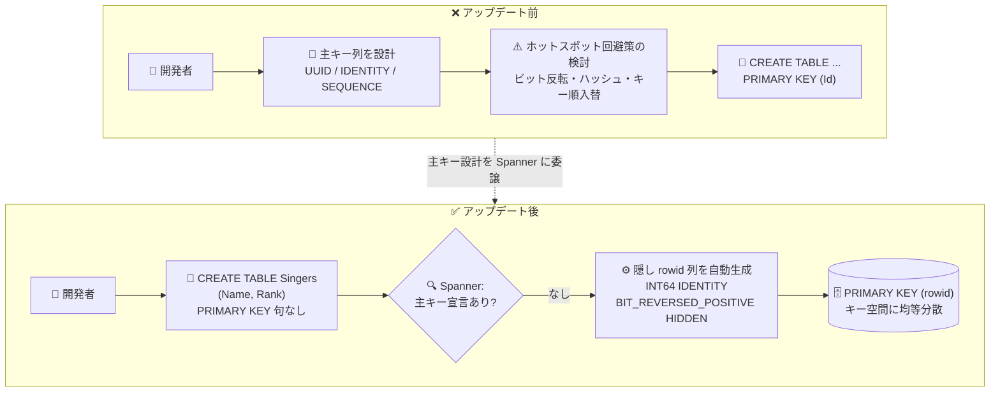

# Spanner: 主キーを定義しないテーブル作成のサポート (隠し rowid 列)

**リリース日**: 2026-07-28

**サービス**: Spanner

**機能**: 主キーを定義せずにテーブルを作成 (自動生成される隠し `rowid` 列)

**ステータス**: Feature (リリースノートに提供ステージ (Preview / GA) の明記なし)

📊 [このアップデートのインフォグラフィックを見る](https://takech9203.github.io/google-cloud-news-summary/20260728-spanner-tables-without-primary-keys.html)

## 概要

Spanner で、`CREATE TABLE` 時に `PRIMARY KEY` 句を指定せずにテーブルを作成できるようになりました。主キーを定義しない場合、Spanner は `rowid` という名前の隠し (HIDDEN) 列を自動的に作成し、その列がテーブルの主キーとして機能します。

これは Spanner の長年の設計原則に対する実務上の緩和です。Spanner は主キーの値でデータを「スプリット」に分割して複数のコンピュートノードに分散させる (range sharding) アーキテクチャを採用しているため、公式ドキュメントでも「Spanner では、すべてのテーブルが 1 つ以上の列で構成される主キーを持つ」と説明されてきました。今回のアップデートは、この内部的な要件そのものを撤廃したわけではなく、**ユーザーが主キーを明示的に設計・宣言する手間を Spanner 側が引き受ける** という形で解決しています。自動生成される `rowid` 列は `INT64` 型の `IDENTITY` 列であり、内部的にビット反転シーケンス (bit-reversed sequence) に裏付けられています。

主な対象ユーザーは、主キーを持たないテーブルを含む既存の RDBMS (MySQL、PostgreSQL など) から Spanner へ移行するチームです。公式の移行ドキュメントでも「移行元データベースにユーザー定義の主キーを持たないテーブルがある場合、新しい主キーを定義せずにそれらのテーブルを Spanner に移行できる」と明記されており、移行時のスキーマ設計作業を削減する機能として位置づけられています。加えて、主キーに業務的な意味を持たせる必要がないテーブル (ログ、イベント、中間テーブルなど) を手早く作成したい場合にも有効です。

**アップデート前の課題**

- テーブルを作成する際、必ず `PRIMARY KEY` 句を記述し、主キーとなる列を自分で設計する必要があった
- 主キーを持たない移行元テーブルについては、移行時にサロゲートキー列を新規に追加し、その生成方式 (UUID、ビット反転シーケンス、IDENTITY 列など) を選定する必要があった
- サロゲートキーを自分で設計する場合、単調増加する値を主キーにするとホットスポットが発生するため、UUID・ビット反転シーケンス・ハッシュ・キー順の入れ替えといったホットスポット回避策を設計者が理解して適用する必要があった
- 主キーに業務的な意味がないテーブルであっても、キー列の定義と DDL の記述が定型的に必要だった

**アップデート後の改善**

- `PRIMARY KEY` 句を省略した `CREATE TABLE` が受け付けられるようになった
- Spanner が `rowid` 隠し列を自動生成し、主キーとして機能させるため、キー列を自分で設計する必要がなくなった
- `rowid` はビット反転シーケンスに裏付けられた `IDENTITY` 列であるため、生成される値がキー空間に均等に分散し、単調増加キーによるホットスポットを設計者が意識せずに回避できる
- 主キーを持たない移行元テーブルを、新しい主キーを定義せずにそのまま Spanner へ移行できる
- `rowid` は `HIDDEN` 属性を持つため、`SELECT *` の結果には現れず、既存のアプリケーションが期待する列構成を崩さない

## アーキテクチャ図



アップデート前は開発者が主キー列とホットスポット回避策を設計する必要がありましたが、アップデート後は `PRIMARY KEY` 句を省略するだけで Spanner がビット反転シーケンスに裏付けられた隠し `rowid` 列を生成し、均等に分散したキーを自動的に割り当てます。

## サービスアップデートの詳細

### 主要機能

1. **`PRIMARY KEY` 句を省略した `CREATE TABLE`**
   - テーブル作成時に主キーを一切指定しないと、Spanner が `rowid` という名前の隠し列を作成する
   - この `rowid` 列がテーブルの主キーとして機能する
   - GoogleSQL 方言と PostgreSQL 方言の両方でドキュメント化されている

2. **自動生成される `rowid` 列の実体**
   - デフォルトで `INT64` (PostgreSQL 方言では `bigint`) 値を使う `IDENTITY` 列
   - ビット反転シーケンス (`BIT_REVERSED_POSITIVE`) に裏付けられ、キーを自動生成する
   - ビット反転された値はキー空間全体に均等に分散するため、スケール時のホットスポットを回避できる
   - `NOT NULL` かつ `HIDDEN` 属性を持つ

3. **`HIDDEN` 属性によるクエリ結果からの除外**
   - `HIDDEN` 列は `SELECT *` の結果に現れない
   - 列名を明示すれば `SELECT rowid FROM Singers` のように取得できる
   - `INFORMATION_SCHEMA` のテーブルには表示されるため、スキーマ検査では確認可能

4. **主キーを持たない移行元テーブルの移行パス**
   - 移行元データベースにユーザー定義の主キーを持たないテーブルがある場合、新しい主キーを定義せずに Spanner へ移行できる

## 技術仕様

### 生成される `rowid` 列の仕様

| 項目 | 詳細 |
|------|------|
| 列名 | `rowid` (固定) |
| データ型 | GoogleSQL: `INT64` / PostgreSQL: `bigint` |
| NULL 許容 | `NOT NULL` |
| 値の生成方式 | `GENERATED BY DEFAULT AS IDENTITY (BIT_REVERSED_POSITIVE)` |
| 可視性 | `HIDDEN` (`SELECT *` に現れない。列名指定で取得可能) |
| 主キー | `PRIMARY KEY (rowid)` として設定される |
| 値の分布 | ビット反転により正の 64 ビット整数空間に均等分散 (連番ではない) |
| `INFORMATION_SCHEMA` | 表示される |

### DDL 構文: 記述したスキーマと実際に生成されるスキーマ

主キーを定義せずにテーブルを作成する場合の DDL (GoogleSQL):

```sql
CREATE TABLE Singers (
  Name STRING(MAX),
  Rank INT64
);
```

上記に対して Spanner が実際に構成するスキーマは次のようになります (GoogleSQL):

```sql
CREATE TABLE Singers (
  Name STRING(MAX),
  Rank INT64,
  rowid INT64 NOT NULL GENERATED BY DEFAULT AS IDENTITY (BIT_REVERSED_POSITIVE) HIDDEN
) PRIMARY KEY (rowid);
```

PostgreSQL 方言の場合は次のとおりです。

```sql
-- 記述するスキーマ
CREATE TABLE Singers (
  Name text,
  Rank bigint
);

-- 実際に生成されるスキーマ
CREATE TABLE Singers (
  Name text,
  Rank bigint,
  rowid bigint GENERATED BY DEFAULT AS IDENTITY (BIT_REVERSED_POSITIVE) NOT NULL HIDDEN,
  PRIMARY KEY (rowid)
);
```

### `CREATE TABLE` 構文における `PRIMARY KEY` 句の位置づけ

GoogleSQL の DDL リファレンスでは、`CREATE TABLE` の `PRIMARY KEY` 句は角括弧で囲まれた省略可能な句として定義されています。

```sql
CREATE TABLE [ IF NOT EXISTS ] table_name (
  [ { column_name data_type [NOT NULL] [ ... ] [ HIDDEN ] [ PRIMARY KEY ] [ OPTIONS (...) ]
    | location_name STRING(MAX) NOT NULL PLACEMENT KEY
    | table_constraint
    | synonym_definition } [, ... ] ]
) [ PRIMARY KEY ( [ column_name [ { ASC | DESC } ], ...] ) ]
  [, INTERLEAVE IN [PARENT] table_name [ ON DELETE { CASCADE | NO ACTION } ] ]
  [, ROW DELETION POLICY ( OLDER_THAN ( timestamp_column, INTERVAL num_days DAY ) ) ]
  [, OPTIONS ( table_options_def [ , ... ] ) ]
```

### 「`PRIMARY KEY` 句の省略」と「`PRIMARY KEY ()` の明示」の違い

混同しやすい 2 つの挙動があるため、区別が必要です。

| 記述 | 挙動 |
|------|------|
| `PRIMARY KEY` 句を**省略** (今回のアップデート) | Spanner が隠し `rowid` 列を生成し、`PRIMARY KEY (rowid)` として扱う。複数行を格納できる |
| `PRIMARY KEY ()` を**空で明示** (従来から存在) | 主キー列が 0 個のテーブルになる。ドキュメントによれば主キー列を持たないテーブルは **1 行しか格納できず**、この形式は **GoogleSQL 方言のデータベースのみ** 利用可能 |

DDL リファレンスでも「すべてのテーブルは主キーを持つ必要があり、その主キーはそのテーブルの 0 個以上の列で構成できる」「0 列または複数列の主キーはテーブルレベルの `PRIMARY KEY (...)` 構文で定義する必要がある」と記述されており、`PRIMARY KEY ()` の明示は今回のアップデートとは別の機能です。

## 設定方法

### 前提条件

1. Spanner インスタンスとデータベースが作成済みであること
2. スキーマ変更を行うための IAM 権限。主キーの移行に関する公式ドキュメントでは Cloud Spanner Database Admin (`roles/spanner.databaseAdmin`) ロールが案内されている
3. GoogleSQL 方言または PostgreSQL 方言のデータベース (どちらもドキュメントに例が記載されている)

### 手順

#### ステップ 1: 主キーを定義せずにテーブルを作成する

```sql
-- GoogleSQL
CREATE TABLE Singers (
  Name STRING(MAX),
  Rank INT64
);
```

`PRIMARY KEY` 句を書かずに `CREATE TABLE` を実行します。Spanner が隠し `rowid` 列を追加し、主キーとして設定します。

#### ステップ 2: データを挿入する

```sql
INSERT INTO Singers (Name, Rank) VALUES ('Alice', 1);
INSERT INTO Singers (Name, Rank) VALUES ('David', 2);
```

`rowid` の値を指定する必要はありません。`IDENTITY` 列としてビット反転シーケンスから値が自動生成されます。

#### ステップ 3: `SELECT *` の結果を確認する

```sql
SELECT * FROM Singers;
/*-------+------+
| Name  | Rank |
+-------+------+
| Alice | 1    |
| David | 2    |
+-------+------*/
```

`rowid` は `HIDDEN` のため、`SELECT *` には含まれません。

#### ステップ 4: `rowid` を明示的に取得する

```sql
SELECT rowid FROM Singers;
/*---------------------+
| rowid               |
+---------------------+
| 3458764513820540928 |
+---------------------*/
```

列名を明示すれば `rowid` の値を取得できます。値がビット反転されているため、挿入順を表す連番にはなりません。

#### ステップ 5: `INFORMATION_SCHEMA` で主キーを確認する

```sql
-- GoogleSQL
SELECT column_name
FROM information_schema.key_column_usage
WHERE constraint_name LIKE 'PK_%' AND table_name = 'Singers';
/*-------------+
| column_name |
+-------------+
| rowid       |
+-------------*/
```

PostgreSQL 方言では `table_name = 'singers'` を指定し、結果は `"rowid"` として返されます。

## メリット

### ビジネス面

- **移行コストの削減**: 主キーを持たない移行元テーブルについて、新しい主キーを設計・追加する作業が不要になり、他 RDBMS からの移行工数を削減できる
- **学習コストの低減**: Spanner 固有のホットスポット回避設計 (ビット反転、ハッシュ、キー順の入れ替え) を理解しないままでも、ホットスポットを避けたテーブルを作成できる
- **開発速度の向上**: 主キーに業務的意味を持たせる必要のないテーブルを、定型的な DDL 記述なしで素早く作成できる

### 技術面

- **ホットスポットの自動回避**: `rowid` はビット反転シーケンスに裏付けられており、値が正の 64 ビット整数空間に均等分散するため、単調増加キーによるスプリット偏りを避けられる
- **既存クエリへの影響の最小化**: `HIDDEN` 属性により `SELECT *` の列構成が変わらないため、移行元と同じ列だけを期待するアプリケーションコードやレポートを変更せずに済む
- **スキーマの可観測性の維持**: `rowid` は `INFORMATION_SCHEMA` から参照できるため、スキーマ管理ツールや監査で主キー構成を把握できる
- **手動シーケンス管理の不要化**: `IDENTITY` 列は基盤となるシーケンスの手動管理や、列とシーケンスの関係の管理を必要としない

## デメリット・制約事項

### 制限事項

- **後から主キーを追加できない**: 主キーを定義せずに作成したテーブルに、後から主キーを追加することはできない。主キーを設計し直したい場合はテーブルの再作成とデータ移行が必要になる
- **`rowid` という名前の非キー列を定義できない**: Spanner は同一テーブル内に同名の列を 2 つ持てないため、主キーを定義せずに作成したテーブルに `rowid` という名前の非キー列を新たに定義することはできない。次の DDL はエラーになる

  ```sql
  -- エラーになる例 (GoogleSQL)
  CREATE TABLE Singers (
    rowid INT64,
    Name STRING(MAX),
  );
  ```

- **`SELECT *` に現れない**: `rowid` は `HIDDEN` であるため、`SELECT *` では取得できない。値が必要な場合は列名を明示する必要がある
- **`PRIMARY KEY ()` (0 列の明示) との違い**: 主キー列を持たないテーブル (`PRIMARY KEY ()` を明示した場合) は 1 行しか格納できず、GoogleSQL 方言のみで利用できる。この制約は `PRIMARY KEY` 句を省略した場合の挙動とは別のものである

### 考慮すべき点

- **インターリーブテーブルとしての利用**: 公式ドキュメントでは「インターリーブでは、すべてのテーブルが主キーを持つ必要がある」「子テーブルは親テーブルの主キーの全構成要素を同じ順序で含む複合主キーを持つ必要がある」と規定されている。主キーが自動生成の `rowid` 単独であるテーブルは、この「親の主キーを先頭に含む複合主キー」という要件を満たせないため、インターリーブの親子関係を前提とするスキーマ設計では従来どおり主キーを明示的に設計する必要がある。なお、インターリーブは一度設定すると取り消せず、変更するにはテーブルの再作成とデータ移行が必要になる
- **キーの順序に意味がない**: ビット反転により生成される値は連番でも順序付きでもないため、`rowid` の大小関係からデータの新しさや作成順を判断することはできない。作成順が必要な場合はタイムスタンプ列を別途設ける必要がある
- **新規アプリケーションへの推奨**: 公式ドキュメントは、新規アプリケーションの主キーには UUID (UUIDv4) の利用を推奨している。`rowid` は主に主キーを設計しない・できないケース向けの選択肢であり、主キーをアプリケーションから参照したい場合は UUID や `IDENTITY` 列を明示的に定義する方が設計意図が明確になる
- **外部キーからの参照**: 外部キーの参照先列はインデックス可能である必要があり、参照関係を明示的に設計する場合は主キー列をアプリケーションから扱える形で定義しておく方が扱いやすい

## ユースケース

### ユースケース 1: 主キーを持たない MySQL テーブルの Spanner 移行

**シナリオ**: オンプレミスの MySQL で運用しているアクセスログテーブルに主キーが定義されていない。Spanner へ移行するにあたり、従来はサロゲートキー列を追加し、ホットスポットを避けるための生成方式を検討する必要があった。

**実装例**:
```sql
-- 移行先 Spanner (GoogleSQL): 主キーを定義せずに作成
CREATE TABLE AccessLogs (
  RequestPath STRING(MAX),
  StatusCode INT64,
  RequestedAt TIMESTAMP
);
```

**効果**: 新しい主キーを定義せずに移行できるため、スキーマ設計とアプリケーション側の対応工数を削減できる。`rowid` はビット反転シーケンスに裏付けられているため、書き込みが特定のスプリットに集中するホットスポットも回避される。

### ユースケース 2: 主キーに業務的意味を持たせないイベント記録テーブル

**シナリオ**: アプリケーションが追記のみを行うイベント記録テーブルを作成したい。アプリケーションから行を主キーで直接参照することはなく、常に属性列での絞り込みや集計しか行わない。

**実装例**:
```sql
CREATE TABLE Events (
  EventType STRING(64),
  Payload JSON,
  OccurredAt TIMESTAMP
);

-- SELECT * には rowid は現れない
SELECT * FROM Events WHERE EventType = 'signup';
```

**効果**: キー列の設計・命名・生成方式の検討が不要になり、スキーマ定義がシンプルになる。行の一意識別が必要になった場合は `SELECT rowid FROM Events` で明示的に取得できる。

## 料金

この機能はスキーマ定義 (DDL) レベルの機能であり、リリースノートおよびドキュメントに本機能固有の課金は記載されていません。Spanner の課金は従来どおりインスタンスの構成に基づきます。最新の料金体系は公式の料金ページを参照してください。

なお、`rowid` は実体を持つ `INT64` (PostgreSQL 方言では `bigint`) 列かつ主キーであり、主キーは常にインデックス化されるため、ストレージ使用量の見積もりでは他の主キー列と同様に扱う必要があります。

- [Spanner の料金](https://cloud.google.com/spanner/pricing)

## 利用可能リージョン

リリースノートおよび公式ドキュメントに、本機能に固有のリージョン制限は記載されていません。ドキュメントには GoogleSQL 方言と PostgreSQL 方言の両方の構文例が記載されています。詳細は公式ドキュメントを参照してください。

- [Create a table without defining a primary key](https://docs.cloud.google.com/spanner/docs/primary-key-default-value#tables-without-primary-keys)

## 関連サービス・機能

- **IDENTITY 列**: `rowid` の実装基盤。キー列・非キー列に整数値を自動生成する。基盤シーケンスの手動管理が不要で、列を削除すると基盤シーケンスも自動的に削除される
- **ビット反転シーケンス (`SEQUENCE` / `bit_reversed_positive`)**: `rowid` の値生成に使われるスキーマオブジェクト。内部カウンタの値をビット反転して、キー空間に均等分散した正の整数を生成する
- **UUID 関数 (`NEW_UUID` / `gen_random_uuid()`)**: 新規アプリケーションで推奨される主キー生成方式。`rowid` の代替として、アプリケーションから参照可能な主キーが必要な場合に使用する
- **`SERIAL` / `AUTO_INCREMENT`**: `IDENTITY` 列に対する DDL エイリアス。利用前にデータベースの `default_sequence_kind` オプションを設定する必要がある
- **インターリーブテーブル / 外部キー**: 親子関係の表現方法。インターリーブは親の主キーを含む複合主キーを必須とするため、主キーを明示設計するかどうかの判断に関わる
- **Spanner migration tool / Dataflow テンプレート**: 移行元データベースから Spanner へデータを移行する際に利用するツール
- **`INFORMATION_SCHEMA`**: `rowid` 列や主キー制約の確認に使用するシステムビュー

## 参考リンク

- 📊 [インフォグラフィック](https://takech9203.github.io/google-cloud-news-summary/20260728-spanner-tables-without-primary-keys.html)
- [公式リリースノート (Spanner)](https://docs.cloud.google.com/spanner/docs/release-notes)
- [Create a table without defining a primary key](https://docs.cloud.google.com/spanner/docs/primary-key-default-value#tables-without-primary-keys)
- [Primary key default values management](https://docs.cloud.google.com/spanner/docs/primary-key-default-value)
- [Primary key migration overview](https://docs.cloud.google.com/spanner/docs/primary-keys-overview)
- [Migrate primary keys](https://docs.cloud.google.com/spanner/docs/migrating-primary-keys)
- [Schema and data model](https://docs.cloud.google.com/spanner/docs/schema-and-data-model)
- [GoogleSQL データ定義言語リファレンス (CREATE TABLE)](https://docs.cloud.google.com/spanner/docs/reference/standard-sql/data-definition-language#create_table)
- [Schema design best practices](https://docs.cloud.google.com/spanner/docs/schema-design)
- [Spanner の料金](https://cloud.google.com/spanner/pricing)

## まとめ

`PRIMARY KEY` 句の省略が可能になったことで、Spanner のスキーマ設計における「必ず主キーを設計する」という実務的なハードルが下がり、特に主キーを持たないテーブルを含む他 RDBMS からの移行が大幅に簡素化されます。自動生成される `rowid` はビット反転シーケンスに裏付けられているため、ホットスポット回避の観点でも安全なデフォルトになっています。

一方で、後から主キーを追加できない、`rowid` という名前の列を定義できない、インターリーブの親子関係には親の主キーを含む複合主キーが必要といった制約があるため、恒久的なスキーマでは適用範囲を見極める必要があります。新規アプリケーションでは引き続き UUID による主キー設計が推奨されているため、移行の初期段階やキーをアプリケーションから参照しないテーブルを主な適用先として検討することを推奨します。

---

**タグ**: Spanner, データベース, スキーマ設計, 主キー, rowid, IDENTITY, ビット反転シーケンス, DDL, GoogleSQL, PostgreSQL, データベース移行, ホットスポット対策
