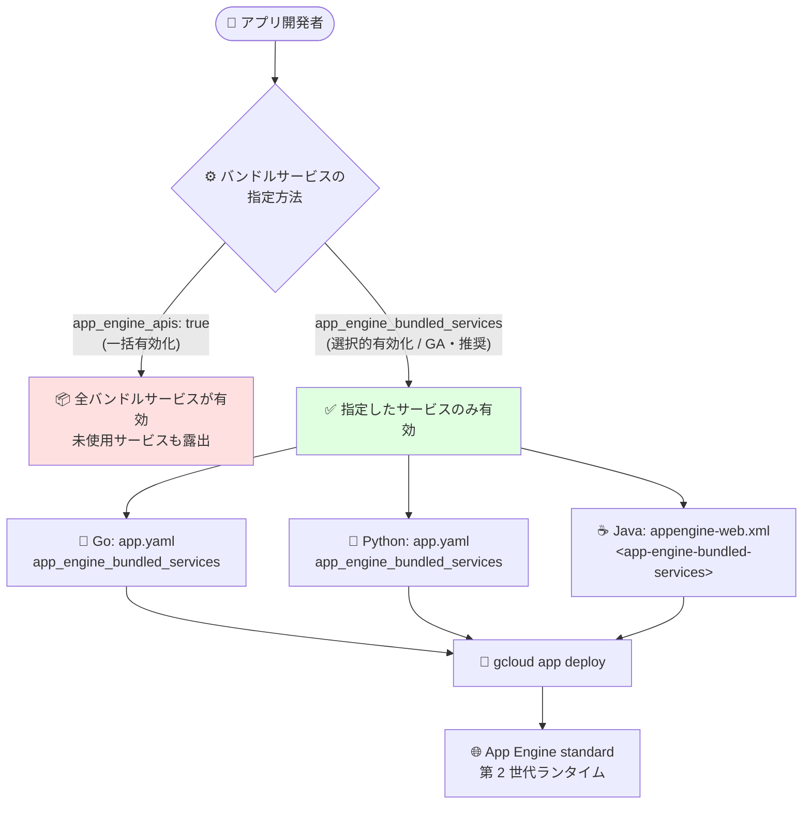

# App Engine standard environment: レガシーバンドルサービスの選択的有効化が GA

**リリース日**: 2026-07-29

**サービス**: App Engine standard environment (Go / Java / Python)

**機能**: `app_engine_bundled_services` フィールドによる必要なレガシーバンドルサービスのみの選択的有効化 (General Availability)

**ステータス**: General Availability (GA)

📊 [このアップデートのインフォグラフィックを見る](https://takech9203.github.io/google-cloud-news-summary/20260729-app-engine-bundled-services-selective-enable-ga.html)

## 概要

Google Cloud は 2026 年 7 月 29 日、App Engine standard environment の `app_engine_bundled_services` フィールドによる「必要なレガシーバンドルサービスのみを有効化する」機能を **General Availability (GA)** に昇格させました。リリースノートには Go、Java、Python の 3 ランタイムそれぞれについて同一内容のエントリが掲載されており、いずれも「Support for enabling only needed legacy bundled services using the `app_engine_bundled_services` field is in General Availability.」と記載されています。

この機能は 2026 年 5 月 27 日に Preview として発表されたものです (本レポートでは Preview 時点の内容を [2026-05-27 のレポート](./2026-05-27-app-engine-bundled-services-selective-enable.md) で扱っています)。従来の `app_engine_apis: true` は第 2 世代ランタイムで利用可能なバンドルサービスを一括で有効化する設定でしたが、`app_engine_bundled_services` ではアプリケーションが実際に必要とするサービスだけをリストで列挙します。公式ドキュメントは `app_engine_apis` よりも `app_engine_bundled_services` の使用を明示的に推奨しており、その理由として「きめ細かい制御が可能になる」「不要なサービスへの露出を最小化してセキュリティが向上する」「アプリが実際に使用しているサービスに対して重要な更新を確実に受け取れるため保守性が高まる」の 3 点を挙げています。

対象は第 2 世代ランタイム (Go 1.12+、Java 11+、Python 3) です。第 1 世代ランタイム (Python 2、Java 8、Go 1.11、PHP 5.5) からの段階的移行を進めている組織にとって、依存サービスを設定ファイル上で明示し、移行状況を追跡するための実運用可能な手段が整ったことになります。

**Preview 時点からの変更点 (このアップデートで何が変わったか)**

- **ステータスが Preview から GA になった**: 2026-05-27 のリリースノートでは「(Preview)」と明記されていましたが、今回のリリースノートでは「in General Availability」と記載されています。これにより、Preview 段階の利用制限や仕様変更リスクを前提とせず、本番環境での利用を検討できる段階になりました。
- **GA 対象として明示されたランタイムは Go / Java / Python の 3 つ**: Preview 発表時のリリースノートは Go / Java / PHP / Python の各ランタイムのリリースノートページに掲載されていましたが、2026-07-29 の GA アナウンスに含まれているのは Go、Java、Python の 3 ランタイムです (PHP については GA のリリースノートエントリが確認できませんでした)。
- **`app_engine_apis` との関係がドキュメント上で明確化された**: 現行の app.yaml / appengine-web.xml リファレンスには「`app_engine_apis` を `true` または `false` に設定した場合、`app_engine_bundled_services` が未指定のときにのみデプロイが成功する」と記載され、両者が排他であることが明示されています。あわせて「`app_engine_bundled_services` の使用を推奨する」という記述がリファレンスに含まれています。

**アップデート前の課題 (機能そのものが解決する課題)**

- `app_engine_apis: true` はすべてのバンドルサービスを一括で有効化するため、アプリが使用していないサービス (Mail、Images、Search など) まで利用可能な状態になっていた
- 不要なサービスが有効化されることで、露出範囲が必要以上に広がっていた
- 設定ファイルからはアプリがどのバンドルサービスに依存しているかが読み取れず、移行計画の可視化や保守が困難だった

**アップデート後の改善**

- `app_engine_bundled_services` に必要なサービスの識別子のみをリストで指定できる (GA)
- 不要なサービスへの露出を最小化でき、公式ドキュメントが推奨する構成を本番環境で採用できる
- 設定ファイルが依存サービスの一覧として機能し、バンドルサービスからの移行進捗を追跡しやすくなる

## アーキテクチャ図



`app_engine_apis: true` による一括有効化と、GA になった `app_engine_bundled_services` による選択的有効化の分岐を示しています。両フィールドは排他であり、Go / Python は app.yaml、Java は appengine-web.xml (または web.xml) で設定します。

## サービスアップデートの詳細

### 主要機能

1. **必要なバンドルサービスのみを列挙する設定 (GA)**
   - `app_engine_bundled_services` に、有効化したいバンドルサービスの識別子をリストで指定する
   - 第 2 世代ランタイム向けの設定であり、Go / Java / Python で GA として利用可能
   - 公式リファレンスは `app_engine_apis` より本フィールドの使用を推奨している

2. **`app_engine_apis` との排他制御**
   - `app_engine_apis` を `true` または `false` に設定した場合、`app_engine_bundled_services` が未指定のときにのみデプロイが成功する
   - 逆に `app_engine_bundled_services` を使う場合、Go / Python では `app_engine_apis: true` を設定できない (Java では `app_engine_apis` / `<app-engine-apis>` を設定していると `<app-engine-bundled-services>` を使用できない)

3. **ランタイムごとの設定ファイル**
   - Go / Python: `app.yaml` の `app_engine_bundled_services` (YAML のリスト)
   - Java: `appengine-web.xml` の `<app-engine-bundled-services>` 要素 (各サービスを `<api>` 要素で指定)。web.xml を使うアプリは web.xml 側で同名の要素を設定する

## 技術仕様

### 指定可能なバンドルサービスの識別子

以下はドキュメント上で `app_engine_bundled_services` に指定できるものとして列挙されている識別子です。ランタイムによって対応範囲が異なります。

| バンドルサービス | 識別子 | Go | Java | Python |
|------------------|--------|----|------|--------|
| App identity | `app_identity_service` | ✅ | ✅ | ✅ |
| Blobstore | `blobstore` | ✅ | ✅ | ✅ |
| Capabilities | `capability_service` | ✅ | ✅ | ✅ |
| Datastore | `datastore_v3` | ✅ | ✅ | ✅ |
| Images | `images` | ✅ | ✅ | ✅ |
| Namespaces | `namespaces` | ✅ | ✅ | ✅ |
| Search | `search` | ✅ | ✅ | ✅ |
| Deferred | `deferred` | ✅ | ✅ | ✅ |
| Mail | `mail` | ✅ | ✅ | ✅ |
| Memcache | `memcache` | ✅ | ✅ | ✅ |
| Modules | `modules` | ✅ | ✅ | ✅ |
| NDB | `ndb` | - | - | ✅ |
| Task queues | `taskqueue` | ✅ | ✅ | ✅ |
| URL fetch | `urlfetch` | ✅ | ✅ | ✅ |
| User | `user` | ✅ | ✅ | ✅ |

注: `ndb` は Python の app.yaml リファレンスにのみ記載されています。識別子は `datastore_v3`、`capability_service`、`app_identity_service`、`user` のようにサービス名と綴りが異なるものがあるため、ドキュメントの表記どおりに指定してください。

### 設定例: Go (app.yaml)

```yaml
runtime: go125

app_engine_bundled_services:
  - datastore_v3
  - memcache
  - user
```

Go では App Engine services SDK の v2 を利用します (`go get google.golang.org/appengine/v2`)。import 文はパッケージ名に `/v2/` を挿入した形式になります。

```go
import (
    "google.golang.org/appengine/v2"
    "google.golang.org/appengine/v2/memcache"
)
```

### 設定例: Python (app.yaml)

```yaml
runtime: python314

app_engine_bundled_services:
  - datastore_v3
  - memcache
  - user
```

Python 3 では `requirements.txt` に App Engine services SDK を追加し、WSGI ミドルウェアでラップする必要があります。

```text
appengine-python-standard>=1.0.0
```

```python
from flask import Flask
from google.appengine.api import wrap_wsgi_app

app = Flask(__name__)
app.wsgi_app = wrap_wsgi_app(app.wsgi_app)
```

### 設定例: Java (appengine-web.xml)

Java はレガシーバンドルサービスを使用する場合、app.yaml ではなく `appengine-web.xml` で構成します。バンドルサービスは `<app-engine-bundled-services>` 要素の中に `<api>` 要素で列挙します。

```xml
<?xml version="1.0" encoding="utf-8"?>
<appengine-web-app xmlns="http://appengine.google.com/ns/1.0">
  <runtime>java21</runtime>
  <system-properties>
    <property name="appengine.use.EE10" value="true"/>
  </system-properties>
  <app-engine-bundled-services>
    <api>datastore_v3</api>
    <api>memcache</api>
    <!-- LIST YOUR SERVICES -->
  </app-engine-bundled-services>
</appengine-web-app>
```

Java 25 では EE 11 (`appengine.use.EE11`)、Java 21 では EE 10 (`appengine.use.EE10`)、Java 17 では EE 8 (`appengine.use.EE8`) を指定する構成がドキュメントに示されています。依存関係として次を `pom.xml` に追加します。

```xml
<dependency>
  <groupId>com.google.appengine</groupId>
  <artifactId>appengine-api-1.0-sdk</artifactId>
  <version>2.0.31</version> <!-- or later -->
</dependency>
```

アプリが `web.xml` を使用している場合は、web.xml リファレンスに従い web.xml 側に同名の要素を設定します。

```xml
<app-engine-bundled-services>
  <api>memcache</api>
  <api>datastore_v3</api>
  <api>modules</api>
  <api>search</api>
</app-engine-bundled-services>
```

## 設定方法

### 前提条件

1. App Engine standard environment の第 2 世代ランタイム (Go 1.12+ / Java 11+ / Python 3) を使用していること
2. 各ランタイムの App Engine services SDK が導入されていること
   - Go: `google.golang.org/appengine/v2`
   - Java: `com.google.appengine:appengine-api-1.0-sdk` 2.0.31 以降
   - Python: `appengine-python-standard>=1.0.0`
3. `app_engine_apis` (Java の場合は `<app-engine-apis>`) を併用しないこと

### 手順

#### ステップ 1: アプリが使用しているバンドルサービスを洗い出す

```bash
# Python の例: バンドルサービス API の import を確認する
grep -rn "from google.appengine" ./
```

`app_engine_bundled_services` には使用しているサービスをすべて列挙する必要があります。特に app.yaml の `handlers` セクションで `login: admin` などを使用している場合は、Users API (`user`) をリストに含める必要があります (Go / Python のドキュメントに明記)。

#### ステップ 2: 設定ファイルを更新する

Go / Python (app.yaml):

```yaml
# app_engine_apis: true を削除し、必要なサービスのみを列挙する
app_engine_bundled_services:
  - datastore_v3
  - memcache
  - user
```

Java (appengine-web.xml):

```xml
<app-engine-bundled-services>
  <api>datastore_v3</api>
  <api>memcache</api>
  <api>user</api>
</app-engine-bundled-services>
```

`app_engine_apis` と `app_engine_bundled_services` は同時に指定できないため、既存の `app_engine_apis` 設定は削除します。

#### ステップ 3: デプロイする

```bash
# Go / Python
gcloud app deploy app.yaml

# Java (staging 済みアプリ)
gcloud app deploy ~/my_app/WEB-INF/appengine-web.xml
```

Java では Maven プラグインの `mvn appengine:deploy` も利用できます。

## メリット

### ビジネス面

- **本番環境での採用が可能になった**: GA になったことで、Preview 前提の制約を考慮せずに本番アプリケーションの構成標準として採用できる
- **移行計画の可視化**: 設定ファイルが依存バンドルサービスの一覧になるため、Cloud Tasks や Memorystore などへの移行残作業をチームで共有しやすくなる

### 技術面

- **露出範囲の最小化**: 公式ドキュメントが述べるとおり、不要なサービスへの露出を減らすことでセキュリティが向上する
- **きめ細かい制御**: サービス単位で有効・無効を管理できる
- **保守性の向上**: 実際に使用しているサービスに対する重要な更新を確実に受け取れる (ドキュメント記載の利点)

## デメリット・制約事項

### 制限事項

- `app_engine_apis` と `app_engine_bundled_services` は併用できない。`app_engine_apis` を `true` / `false` のいずれかに設定している場合、`app_engine_bundled_services` が未指定でなければデプロイは成功しない
- 第 2 世代ランタイム向けの設定であり、第 1 世代ランタイムは対象外
- ランタイムによって指定可能な識別子が異なる (例: `ndb` は Python の app.yaml リファレンスにのみ記載)
- 今回の GA アナウンスの対象は Go / Java / Python。PHP については GA のリリースノートエントリが確認できなかった
- Java はレガシーバンドルサービスを使う場合 app.yaml ではなく appengine-web.xml (または web.xml) での構成が必要

### 考慮すべき点

- 使用しているサービスの列挙漏れがあると、そのサービスの API 呼び出しが利用できなくなる。`login: admin` のような設定に紐づく Users API (`user`) は特に見落としやすい
- Cloud Run への移行 (`gcloud beta app migrate-to-run`) では `app_engine_apis: true` を含む app.yaml が非対応構成として扱われるため、バンドルサービス自体からの移行計画も並行して検討する必要がある
- Java 25 へのアップグレードでレガシーバンドルサービスを継続利用する場合は、EE 11 (Jakarta 名前空間) または EE 8 のいずれかの構成を選択する必要がある

## ユースケース

### ユースケース 1: Datastore と Memcache のみを使用するアプリの最小構成化

**シナリオ**: `app_engine_apis: true` で全バンドルサービスを有効化している Python 3 アプリが、実際には Datastore と Memcache しか使用していない。

**実装例**:
```yaml
runtime: python314

app_engine_bundled_services:
  - datastore_v3
  - memcache
```

**効果**: Mail、Images、Search など未使用サービスへの露出をなくし、ドキュメント推奨の構成に揃えられる。

### ユースケース 2: バンドルサービスからの段階的移行の進捗管理

**シナリオ**: Memcache を Memorystore へ、Task Queues を Cloud Tasks へ順次移行している。移行済みサービスを設定から外していくことで残作業を可視化したい。

**実装例**:
```yaml
# 移行前
app_engine_bundled_services:
  - datastore_v3
  - memcache
  - taskqueue
  - user

# Memcache を Memorystore へ移行後は memcache を削除する
```

**効果**: 設定ファイルが移行チェックリストとして機能し、残っている依存関係が一目で分かる。

### ユースケース 3: Java アプリのバージョンアップと同時のサービス整理

**シナリオ**: Java 17 から Java 21 (EE 10) へ移行するタイミングで、appengine-web.xml のバンドルサービス指定を必要最小限に整理する。

**実装例**:
```xml
<?xml version="1.0" encoding="utf-8"?>
<appengine-web-app xmlns="http://appengine.google.com/ns/1.0">
  <runtime>java21</runtime>
  <system-properties>
    <property name="appengine.use.EE10" value="true"/>
  </system-properties>
  <app-engine-bundled-services>
    <api>datastore_v3</api>
    <api>memcache</api>
  </app-engine-bundled-services>
</appengine-web-app>
```

**効果**: ランタイムアップグレードと依存サービスの棚卸しを 1 回の変更でまとめて実施できる。

## 料金

この設定フィールド自体に追加料金は発生しません。App Engine standard environment の通常の料金と、有効化した各バンドルサービスの料金が適用されます。具体的な単価は公式の料金ページを参照してください。

- [App Engine の料金](https://cloud.google.com/appengine/pricing)

## 利用可能リージョン

App Engine standard environment の第 2 世代ランタイム (Go 1.12+ / Java 11+ / Python 3) が利用できる環境で構成可能です。リージョン固有の制限に関する記載はドキュメント上で確認できませんでした。

## 関連サービス・機能

- **Cloud Tasks**: Task Queues (push queues) の移行先として推奨されるフルマネージドサービス
- **Pub/Sub**: Task Queues (pull queues) の移行先
- **Memorystore**: Memcache の移行先となるフルマネージドインメモリサービス
- **Firestore in Datastore mode / Datastore クライアントライブラリ**: Datastore バンドルサービスの移行先
- **Cloud Storage**: Blobstore および Images (画像配信) の移行先
- **Cloud Run**: App Engine standard environment からの移行先。`gcloud beta app migrate-to-run` による移行では `app_engine_apis: true` が非対応構成として扱われる

## 参考リンク

- 📊 [インフォグラフィック](https://takech9203.github.io/google-cloud-news-summary/20260729-app-engine-bundled-services-selective-enable-ga.html)
- [公式リリースノート (Google Cloud)](https://cloud.google.com/release-notes#July_29_2026)
- [app.yaml リファレンス (Go) - app_engine_bundled_services](https://docs.cloud.google.com/appengine/docs/standard/reference/app-yaml?tab=go#app_engine_bundled_services)
- [app.yaml リファレンス (Python) - app_engine_bundled_services](https://docs.cloud.google.com/appengine/docs/standard/reference/app-yaml?tab=python#app_engine_bundled_services)
- [appengine-web.xml リファレンス (Java)](https://docs.cloud.google.com/appengine/docs/standard/java-gen2/config/appref-xml#app_engine_apis)
- [web.xml リファレンス (Java) - app_engine_bundled_services](https://docs.cloud.google.com/appengine/docs/standard/java-gen2/config/webxml#app_engine_bundled_services)
- [レガシーバンドルサービスへのアクセス (Go)](https://docs.cloud.google.com/appengine/docs/standard/go/services/access)
- [レガシーバンドルサービスへのアクセス (Java)](https://docs.cloud.google.com/appengine/docs/standard/java-gen2/services/access)
- [レガシーバンドルサービスへのアクセス (Python 3)](https://docs.cloud.google.com/appengine/docs/standard/python3/services/access)
- [利用可能なレガシーバンドルサービス一覧](https://docs.cloud.google.com/appengine/docs/standard/services/overview)
- [レガシーバンドルサービスからの移行](https://docs.cloud.google.com/appengine/migration-center/standard/services/migrating-services)
- [App Engine の料金](https://cloud.google.com/appengine/pricing)
- 関連レポート: [Preview 時点のレポート (2026-05-27)](./2026-05-27-app-engine-bundled-services-selective-enable.md)

## まとめ

`app_engine_bundled_services` は 2026-05-27 の Preview から約 2 か月で GA となり、Go / Java / Python の第 2 世代ランタイムで本番利用可能になりました。公式リファレンスが `app_engine_apis` よりも本フィールドを推奨していることから、レガシーバンドルサービスを利用しているアプリは、使用サービスの棚卸しを行った上で `app_engine_bundled_services` への移行を検討すべきです。両フィールドは排他であるため、既存の `app_engine_apis` 設定を削除し、`login: admin` に紐づく `user` などの見落としがないかを確認してからデプロイしてください。

---

**タグ**: #AppEngine #BundledServices #GA #Security #Migration #Go #Java #Python
