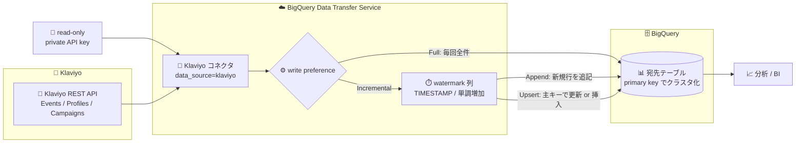

# BigQuery Data Transfer Service: Klaviyo 転送での増分データ転送サポート

**リリース日**: 2026-07-29

**サービス**: BigQuery (BigQuery Data Transfer Service)

**機能**: Klaviyo → BigQuery 転送における増分データ転送 (Incremental transfers)

**ステータス**: Preview

📊 [このアップデートのインフォグラフィックを見る](https://takech9203.github.io/google-cloud-news-summary/20260729-bigquery-dts-klaviyo-incremental-transfers.html)

## 概要

BigQuery Data Transfer Service (以下 DTS) の Klaviyo コネクタが、**増分データ転送 (incremental data transfers)** に対応しました。本機能は Preview で提供されます。Klaviyo コネクタ自体も Preview 段階のコネクタで、マーケティングプラットフォームカテゴリの一つとして DTS のサポート対象データソースに含まれています。

これまでの Klaviyo 転送は、転送実行のたびに Klaviyo 側のデータセット全体を BigQuery にロードする **フル転送 (full transfer)** のみでした。公式ドキュメントの記述にも「With every transfer run, the Klaviyo connector transfers all available data from Klaviyo into BigQuery」とあり、Events や Profiles のように行数が増え続けるオブジェクトでも毎回全件を取得する必要がありました。今回のアップデートにより、転送構成 (transfer configuration) の **write preference** で `Full` / `Incremental` を選択できるようになり、`Incremental` を選ぶと「前回の転送以降に変更されたデータのみ」を転送できます。

増分転送を選択した場合は、BigQuery 側への書き込み方式として **Append** または **Upsert** の write mode を指定します。いずれのモードでも、ソース側の変更を追跡するための **ウォーターマーク列 (watermark column)** の指定が必須で、Upsert モードではさらに **主キー (primary key)** の指定が必要です。ウォーターマーク列に指定できるのは `TIMESTAMP` 型の列のみで、値が単調増加である必要があります。対象ユーザーは、Klaviyo の E コマース / メールマーケティングデータを BigQuery に集約して分析している組織のデータエンジニア・アナリティクスチームです。

**アップデート前の課題**

- 転送実行のたびに Klaviyo の対象オブジェクト全件が転送されるフル転送のみで、差分のみを取り込む選択肢がなかった
- 全件転送のため、Klaviyo API 側の呼び出し量と転送処理の実行時間が、データ量の増加に比例して増え続けていた
- 転送先テーブルの更新方式を選べず、行単位の更新 (Upsert) や追記 (Append) といった書き込みセマンティクスを転送構成側で制御できなかった
- ドキュメントのトラブルシューティングにも「Error: FAILED_PRECONDITION → Retry the transfer with a shorter date range」という記載があり、対象期間が広い転送は失敗要因になり得た

**アップデート後の改善**

- 転送構成の write preference で `Incremental` を選択でき、前回転送以降に変更された行のみを転送できるようになった
- Append (新規行の追記のみ) と Upsert (主キーによる更新または挿入) の 2 つの write mode を選択できるようになった
- 転送量が差分のみに絞られるため、Klaviyo API 呼び出し量と転送実行時間の削減が期待できる
- Upsert モードでは、指定した主キーで転送先 BigQuery テーブルがクラスタ化されるため、主キーを条件とするクエリのパフォーマンス最適化が同時に得られる

## アーキテクチャ図



Klaviyo API から取得したデータが DTS の Klaviyo コネクタを経由して BigQuery に取り込まれるパイプラインです。write preference が `Incremental` の場合はウォーターマーク列で差分を判定し、Append または Upsert のいずれかで宛先テーブルに書き込まれます。

## サービスアップデートの詳細

### 主要機能

1. **フル転送と増分転送の選択 (write preference)**
   - 転送構成のセットアップ時に `Full` または `Incremental` の write preference を選択する
   - `Full`: 転送実行のたびに Klaviyo のデータセットから全データを転送する (従来の動作)
   - `Incremental` (Preview): 前回の転送以降に変更されたデータのみを転送し、データセット全体のロードを回避する
   - 1 つの転送構成でサポートできるのは増分取り込みかフル取り込みのいずれか一方のみ

2. **Append write mode (追記モード)**
   - 宛先テーブルに新規行を挿入するのみのモード
   - 既存レコードの有無をチェックせず厳密に追記するため、宛先テーブルでデータ重複が発生する可能性がある
   - ウォーターマーク列の指定が必須
   - Klaviyo 転送では、レコード作成時にのみ設定され以後の更新で変化しない列 (例: `CREATED_AT` 相当の列) を選ぶことが推奨される

3. **Upsert write mode (更新または挿入モード)**
   - 主キーの存在チェックにより、宛先テーブルの行を更新するか新規行を挿入するかを決定するモード
   - 転送時に指定した主キーが宛先 BigQuery テーブルに存在すればその行をソース側の新しいデータで更新し、存在しなければ新規行を挿入する
   - ウォーターマーク列と主キーの両方の指定が必須
   - ウォーターマーク列には、行が変更されるたびに更新される列 (例: `UPDATED_AT` / `LAST_MODIFIED` 相当の列) を選ぶことが推奨される
   - 主キーはテーブル上の 1 つ以上の列を指定でき、全行で NULL でなく一意な値を持つ列を選ぶ必要がある。システム生成の識別子、一意の参照コード (自動採番 ID など)、不変の時系列シーケンス ID などが推奨される
   - 主キーの一意性に不安がある場合は、データ損失やデータ破損を避けるため Append モードの使用が推奨される

4. **初回転送時のフルロード動作**
   - 既存の転送構成を初めて増分取り込みモードに更新した場合、その更新後の最初の転送ではデータソースから利用可能な全データが転送される
   - 以降の増分転送では、新規行と更新行のみが転送される

## 技術仕様

### write mode の比較

| 項目 | Append | Upsert |
|------|--------|--------|
| 書き込み動作 | 新規行の挿入のみ | 主キーの有無で更新または挿入 |
| ウォーターマーク列 | 必須 | 必須 |
| 主キー | 不要 | 必須 (1 列以上) |
| 推奨するウォーターマーク列 | レコード作成時のみ設定される列 (`CREATED_AT` 相当) | 行の変更ごとに更新される列 (`UPDATED_AT` / `LAST_MODIFIED` 相当) |
| データ重複の可能性 | あり (既存レコードをチェックしないため) | 主キーが一意であれば抑止される |
| 宛先テーブルのクラスタ化 | — | 指定した主キーでクラスタ化される |

### ウォーターマーク列の要件

| 要件 | 内容 |
|------|------|
| データ型 | `TIMESTAMP` 型の列のみ選択可能 |
| 値の性質 | 単調増加 (monotonically increasing) である必要がある |
| 対象アセット | 有効なウォーターマーク列を持つアセットのみ増分取り込みをサポート |
| 削除の同期 | 増分転送はソーステーブルの削除操作を同期できない |

### 増分転送に利用できる Klaviyo アセットの目安

増分取り込みは「有効なウォーターマーク列を持つアセット」でのみサポートされ、ウォーターマーク列は `TIMESTAMP` 型に限られます。Klaviyo データモデルリファレンスに記載された各テーブルの `TIMESTAMP` 型フィールドは次のとおりです (Upsert 用のウォーターマークには変更時に更新される `updated` 系の列、Append 用には `created` 系の列が候補になります)。

| Klaviyo テーブル | TIMESTAMP 型フィールド |
|------------------|------------------------|
| Profiles | `created`, `updated`, `last_event_date`, `email_marketing_consent_timestamp`, `email_marketing_last_updated`, `sms_marketing_consent_timestamp`, `sms_marketing_last_updated`, `sms_transactional_consent_timestamp`, `sms_transactional_last_updated`, `mobile_push_consent_timestamp`, `predictive_analytics_expected_date_of_next_order` |
| Events | `datetime` |
| Campaigns | `created_at`, `updated_at`, `scheduled_at`, `send_time` |
| CampaignMessages | `created_at`, `updated_at` |
| Flows | `created`, `updated` |
| Lists | `created`, `updated` |
| Segments | `created`, `updated` |
| Metrics | `created`, `updated` |
| Templates | `created`, `updated` |
| Forms | `created_at`, `updated_at` |
| Reviews | `created`, `updated` |
| Items | `created`, `updated` |
| Variants | `created`, `updated` |
| Categories | `updated` |
| WebFeeds | `created`, `updated` |
| Images | `updated_at` |
| CouponCode | `expires_at` |

一方、Klaviyo データモデルリファレンス上で `TIMESTAMP` 型フィールドを持たない **Accounts / Coupons / Tags / DataSources** は、ウォーターマーク列の要件を満たさないためフル転送の対象となります。なお `CouponCode` の `expires_at` は失効日時であり単調増加とは限らないため、実際に増分取り込みが可能かどうかは転送構成のセットアップ時に UI で選択可能なウォーターマーク列を確認してください。

### Klaviyo データ型と BigQuery データ型のマッピング

| Klaviyo データ型 | BigQuery データ型 |
|------------------|-------------------|
| String | `STRING` |
| Text | `STRING` |
| Integer | `INTEGER` |
| Boolean | `BOOLEAN` |
| Date (YYYY-MM-DD HH:MM:SS) | `TIMESTAMP` |
| List | `ARRAY` |

ウォーターマーク列に使えるのは `TIMESTAMP` 型のみのため、Klaviyo 側では Date 型としてマッピングされる列が対象になります。

## 設定方法

### 前提条件

1. **Klaviyo 側**: Klaviyo コネクタが BigQuery にデータを転送できるよう、**READ ONLY** 以上のアクセスレベルを持つ read-only の private API キーを用意する
2. **BigQuery 側**: BigQuery Data Transfer Service の有効化に必要な作業をすべて完了しておく
3. **BigQuery 側**: データを格納する BigQuery データセットを作成しておく
4. **IAM**: 転送を作成するプロジェクトに対して BigQuery Admin (`roles/bigquery.admin`) ロールの付与を管理者に依頼する
   - 必要な権限: `bigquery.transfers.update`, `bigquery.transfers.get`, `bigquery.datasets.get`, `bigquery.datasets.getIamPolicy`, `bigquery.datasets.update`, `bigquery.datasets.setIamPolicy`, `bigquery.jobs.create`
   - Pub/Sub による転送実行通知を設定する場合は `pubsub.topics.setIamPolicy` も必要 (メール通知のみなら不要)

### 手順

#### ステップ 1: Google Cloud コンソールで転送構成を作成する

1. Google Cloud コンソールの **Data transfers** ページに移動する
2. **Create transfer** をクリックする
3. **Source type** セクションの **Source** で **Klaviyo - Preview** を選択する
4. **Data source details** セクションで以下を設定する
   - **Private API Key**: Klaviyo の private API キーを入力する
   - **Start Date** (任意): 転送に含める新規レコードの開始日を指定する。この日付以降に作成されたレコードのみが転送対象となる。デフォルトは転送実行日の 3 か月前
   - **Klaviyo objects to transfer**: **Browse** をクリックして転送対象オブジェクトを選択する (手動入力も可能)
5. **Destination settings** の **Dataset** で、作成済みのデータセットを選択する
6. **Transfer config name** の **Display name** に転送構成の名前を入力する
7. **Schedule options** で **Repeat frequency** (Custom や On-demand も選択可) と開始時刻を設定する
8. 転送構成のセットアップ時に **write preference** で `Full` または `Incremental` を選択する。`Incremental` を選択した場合は、`Append` または `Upsert` の write mode と、ウォーターマーク列 (Upsert では加えて主キー) を指定する
9. 任意で **Notification options** のメール通知 / Pub/Sub 通知を有効化する
10. **Save** をクリックする

#### ステップ 2: bq コマンドラインツールで転送構成を作成する

```bash
bq mk --transfer_config \
  --project_id=PROJECT_ID \
  --data_source=klaviyo \
  --display_name=NAME \
  --target_dataset=DATASET \
  --params='PARAMETERS'
```

ドキュメントに記載されている Klaviyo 転送のパラメータは次の通りです。

- `assets`: BigQuery に転送する Klaviyo オブジェクトのパス
- `connector.authentication.privateApiKey`: Klaviyo アカウントの private API キー
- `connector.startDate` (任意): 転送に含める新規レコードの開始日 (`YYYY-MM-DD` 形式)。デフォルトは転送実行日の 3 か月前

実行例:

```bash
bq mk --transfer_config \
  --target_dataset=mydataset \
  --data_source=klaviyo \
  --display_name='My Transfer' \
  --params='{
    "assets": ["Events", "Flows"],
    "connector.authentication.privateApiKey": "pk_123456789123",
    "connector.startDate": "2025-10-20"
  }'
```

転送構成を保存すると、Klaviyo コネクタはスケジュール設定に従って転送実行を自動的にトリガーします。通常のスケジュール外で手動実行したい場合はバックフィル実行を開始します。

#### ステップ 3: 増分転送の初回実行を確認する

既存の転送構成を初めて増分取り込みモードに変更した場合、その直後の 1 回目は全データが転送されます。2 回目以降の実行で新規行・更新行のみが転送されることを、転送実行履歴と宛先テーブルの行数で確認してください。

## メリット

### ビジネス面

- **運用コストの低減**: 転送のたびに全件をロードしていた処理を差分のみに絞れるため、BigQuery のロード処理量および Klaviyo API 側の消費リソースを削減できる。取り込み後の BigQuery ストレージ・クエリ料金にも波及する
- **データ鮮度の向上余地**: 1 回の転送で扱うデータ量が小さくなるため、より高い頻度のスケジュールを現実的に運用しやすくなる
- **コード不要の実装**: DTS はマネージドサービスとしてスケジュール実行されるため、増分同期のロジックを自前実装・保守する必要がない

### 技術面

- **実行時間の短縮**: データセット全体ではなく変更分のみを転送するため、転送実行時間の短縮が期待できる。対象期間が広い場合に発生し得る `FAILED_PRECONDITION` のリスク低減にもつながる
- **書き込みセマンティクスの選択**: 追記のみで良いイベント系データは Append、マスタ的に最新状態を保持したい Profiles などは Upsert という使い分けが可能
- **クエリ性能の副次的改善**: Upsert モードでは宛先テーブルが指定した主キーでクラスタ化されるため、主キーによるフィルタを行うクエリのスキャン量削減が期待できる

## デメリット・制約事項

### 制限事項

Klaviyo の増分転送には以下の制限があります。

- ウォーターマーク列に選択できるのは `TIMESTAMP` 型の列のみ
- 増分取り込みは、有効なウォーターマーク列を持つアセットのみサポートされる
- ウォーターマーク列の値は単調増加である必要がある
- 増分転送はソーステーブルの削除操作を同期できない
- 1 つの転送構成でサポートできるのは増分取り込みまたはフル取り込みのいずれか一方のみ
- 最初の増分取り込み実行後は、アセットリスト内のオブジェクトを更新できない
- 最初の増分取り込み実行後は、転送構成の write mode を変更できない
- 最初の増分取り込み実行後は、ウォーターマーク列または主キーを変更できない
- 宛先 BigQuery テーブルは指定した主キーでクラスタ化され、クラスタ化テーブルの制限が適用される
- 既存の転送構成を初めて増分取り込みモードに更新した場合、その直後の最初の転送では全データが転送される
- Append モードは既存レコードの有無をチェックしないため、宛先テーブルでデータ重複が発生する可能性がある

### 考慮すべき点

- **Preview 段階である**: 本機能および Klaviyo コネクタは Preview で、Service Specific Terms の「Pre-GA Offerings Terms」が適用される。Pre-GA 機能は "as is" で提供され、サポートが限定される場合がある。サポートやフィードバックは `dts-preview-support@google.com` に連絡する
- **設計変更が後戻りできない**: アセットリスト、write mode、ウォーターマーク列、主キーは初回の増分取り込み実行後に変更できないため、対象オブジェクトとキー設計を事前に確定させる必要がある
- **削除が反映されない**: Klaviyo 側で削除されたレコードは宛先テーブルに残り続けるため、論理削除の扱いや定期的なフル再取り込みなど、運用設計での補完が必要
- **主キーの一意性**: 主キー列の値が一意でない場合、データ損失やデータ破損の恐れがある。一意性に確信が持てない場合は Append モードを選ぶことが推奨される
- **SLO の適用範囲**: Data Delivery SLO は Google Cloud 内のソースからの自動スケジュール転送に適用され、Klaviyo のようなサードパーティ / 非 Google Cloud ソースからの転送には適用されない
- **API キーのアクセスレベル**: private API キーが READ ONLY 未満の場合、`PERMISSION_DENIED: Permission denied. Your API key may lack required access scopes` が発生する

## ユースケース

### ユースケース 1: Events テーブルの追記型インクリメンタル取り込み

**シナリオ**: E コマース事業者が Klaviyo の `Events` (Placed Order、Viewed Product などのアクティビティイベント) を BigQuery に日次で取り込んでいる。イベントは一度記録されたら更新されない追記型データだが、これまで毎回全件転送しており、蓄積量の増加に伴って転送時間が伸びていた。

**実装例**:
```
Source           : Klaviyo - Preview
Assets           : Events
write preference : Incremental
write mode       : Append
watermark column : datetime (TIMESTAMP)
```

**効果**: 前回転送以降に発生したイベントのみが転送されるため、転送実行時間と Klaviyo API 呼び出し量が削減される。イベントは更新されないため Append モードでも重複が発生しにくい。

### ユースケース 2: Profiles テーブルの最新状態同期 (Upsert)

**シナリオ**: 顧客プロファイル (`Profiles`) の最新のマーケティング同意状況やセグメント属性を BigQuery 側で常に最新に保ちたい。プロファイルは新規作成だけでなく既存行の更新も頻繁に発生するため、追記のみでは最新状態を表現できない。

**実装例**:
```
Source           : Klaviyo - Preview
Assets           : Profiles
write preference : Incremental
write mode       : Upsert
watermark column : updated (TIMESTAMP)
primary key      : id
```

**効果**: `updated` 列で変更行を検出し、`id` を主キーとして既存行を更新 / 新規行を挿入するため、宛先テーブルが常にソースの最新状態を反映する。加えて宛先テーブルが `id` でクラスタ化されるため、特定プロファイルを絞り込むクエリのスキャン量が抑えられる。

### ユースケース 3: マスタ系オブジェクトはフル転送、トランザクション系は増分転送に分離

**シナリオ**: `Accounts` や `Tags` のようにウォーターマーク列を持たない小規模なマスタ系オブジェクトと、`Events` や `Profiles` のように大量に増減するオブジェクトを同じパイプラインで扱っている。

**効果**: 1 つの転送構成では増分とフルのいずれか一方しか選べないという制約に対応するため、転送構成を「マスタ系 = Full」「トランザクション系 = Incremental」の 2 つ以上に分割する。オブジェクトの特性ごとに最適な取り込み方式とスケジュールを設定できる。

## 料金

Klaviyo 転送の料金については、公式ドキュメントに **「There is no cost to transfer Klaviyo data into BigQuery while this feature is in Preview」** と明記されています。すなわち、本機能が Preview の間、Klaviyo データの BigQuery への転送自体には課金されません。

一方、BigQuery Data Transfer Service 全般の考え方として、データが BigQuery に転送された後は標準の BigQuery **ストレージ料金** と **クエリ料金** が適用されます。また、DTS がトリガーするジョブは、プロジェクト / フォルダ / 組織が以下のジョブタイプの予約に割り当てられている場合にのみ予約スロットを使用します。

| 項目 | 内容 |
|------|------|
| Klaviyo 転送の転送料金 | Preview 期間中は無料 |
| 転送後のデータ保持 | 標準の BigQuery ストレージ料金が適用される |
| 転送データへのクエリ | 標準の BigQuery クエリ料金が適用される |
| 予約スロットの利用 | `QUERY` (クエリジョブ) および `PIPELINE` (ロードジョブ) の予約割り当てがある場合に使用される |

具体的な単価は [BigQuery 料金ページ](https://cloud.google.com/bigquery/pricing) を参照してください。なお、Preview 終了後の課金体系については公式ドキュメントに記載がないため、GA 時点の料金ページを再確認することを推奨します。

## 利用可能リージョン

BigQuery Data Transfer Service は BigQuery と同様にマルチリージョンリソースであり、加えて多数の単一リージョンが利用可能です。

- 転送先データセットの作成時にロケーションを指定し、転送構成自体は転送先データセットと同じロケーションに設定されます
- DTS はデータの処理とステージングを転送先データセットと同じロケーションで行います
- DTS は、データが保存されている任意のリージョンから、転送先データセットが存在する任意のロケーションへのデータ転送をサポートします

詳細は [Dataset locations and transfers](https://docs.cloud.google.com/bigquery/docs/dts-locations) および [Dataset locations](https://docs.cloud.google.com/bigquery/docs/locations#supported_locations) を参照してください。

## 関連サービス・機能

- **BigQuery Data Transfer Service**: 本アップデートの基盤サービス。スケジュールベースのマネージドなデータ取り込みを提供し、バックフィル実行による障害・欠損からのリカバリにも対応する
- **BigQuery クラスタ化テーブル**: Upsert モードでは宛先テーブルが主キーでクラスタ化されるため、クラスタ化テーブルの制限とクエリ最適化の特性が関係する
- **Pub/Sub**: 転送実行通知 (transfer run notifications) の宛先として利用でき、転送の成否をイベント駆動で下流処理に伝播できる
- **BigQuery Reservations**: DTS がトリガーするジョブは、`QUERY` または `PIPELINE` ジョブタイプの予約割り当てがある場合に予約スロットを使用する
- **他の SaaS / マーケティング系 DTS コネクタ**: Salesforce、Salesforce Marketing Cloud、ServiceNow、Facebook Ads、HubSpot (Preview)、Mailchimp (Preview) などが同じ DTS フレームワーク上で提供されており、Klaviyo と組み合わせたマーケティングデータの統合分析が可能
- **BigQuery Pipelines & Connections ページ**: 合理化されたワークフローで転送を作成できる機能 (Preview)

## 参考リンク

- 📊 [インフォグラフィック](https://takech9203.github.io/google-cloud-news-summary/20260729-bigquery-dts-klaviyo-incremental-transfers.html)
- [公式リリースノート (BigQuery release notes)](https://cloud.google.com/bigquery/docs/release-notes)
- [Introduction to Klaviyo transfers — Full or incremental transfers](https://docs.cloud.google.com/bigquery/docs/klaviyo-transfer-intro#full_or_incremental_transfers)
- [Load Klaviyo data into BigQuery](https://docs.cloud.google.com/bigquery/docs/klaviyo-transfer)
- [Klaviyo data model reference](https://docs.cloud.google.com/bigquery/docs/klaviyo-data-model)
- [What is the BigQuery Data Transfer Service?](https://docs.cloud.google.com/bigquery/docs/dts-introduction)
- [Klaviyo transfer issues (トラブルシューティング)](https://docs.cloud.google.com/bigquery/docs/transfer-troubleshooting#klaviyo-issues)
- [Dataset locations and transfers](https://docs.cloud.google.com/bigquery/docs/dts-locations)
- [BigQuery 料金ページ](https://cloud.google.com/bigquery/pricing)

## まとめ

Klaviyo → BigQuery 転送に増分データ転送 (Preview) が追加され、従来のフル転送のみという制約が解消されました。Events のような追記型データは Append、Profiles のような更新を伴うデータは Upsert という使い分けにより、転送量・実行時間の削減と最新状態の維持を同時に実現できます。ただしアセットリスト・write mode・ウォーターマーク列・主キーは初回の増分実行後に変更できず、削除操作も同期されないため、既存の Klaviyo 転送を移行する前に対象オブジェクトとキー設計を確定させ、Preview の利用条件 (Pre-GA Offerings Terms) を確認した上で検証環境から適用することを推奨します。

---

**タグ**: BigQuery, BigQuery Data Transfer Service, DTS, Klaviyo, Incremental Transfer, Upsert, Append, Watermark Column, データパイプライン, Preview, マーケティング分析
